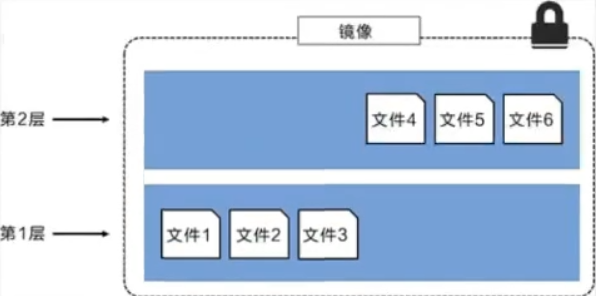
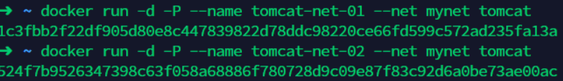
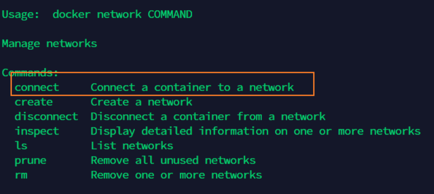

# Docker概述

## Docker为什么出现？

一款产品： 开发–上线 两套环境！应用环境，应用配置！

开发 — 运维。 问题：我在我的电脑上可以允许！版本更新，导致服务不可用！对于运维来说考验十分大？

环境配置是十分的麻烦，每一个及其都要部署环境(集群Redis、ES、Hadoop…) !费事费力。

发布一个项目( jar + (Redis MySQL JDK ES) ),项目能不能带上环境安装打包！

之前在服务器配置一个应用的环境 Redis MySQL JDK ES Hadoop 配置超麻烦了，不能够跨平台。

开发环境Windows，最后发布到Linux！

传统：开发jar，运维来做！

现在：开发打包部署上线，一套流程做完！

安卓流程：java — apk —发布（应用商店）一 张三使用apk一安装即可用！

docker流程： java-jar（环境） — 打包项目帯上环境（镜像） — ( Docker仓库：商店）——-

Docker给以上的问题，提出了解决方案！

Docker的思想就来自于集装箱！

JRE – 多个应用(端口冲突) – 原来都是交叉的！
隔离：Docker核心思想！打包装箱！每个箱子是互相隔离的。

Docker通过隔离机制，可以将服务器利用到极致！

## Docker历史

2010年，几个的年轻人，就在美国成立了一家公司 dotcloud

做一些pass的云计算服务！LXC（Linux Container容器）有关的容器技术！

> Linux Container容器是一种内核虚拟化技术，可以提供轻量级的虚拟化，以便隔离进程和资源。
>

他们将自己的技术（容器化技术）命名就是 Docker
Docker刚刚延生的时候，没有引起行业的注意！dotCloud，就活不下去！

2013年，Docker开源！

越来越多的人发现docker的优点！火了。Docker每个月都会更新一个版本！

2014年4月9日，Docker1.0发布！

docker为什么这么火？十分的轻巧！

在容器技术出来之前，我们都是使用虚拟机技术！

虚拟机：在window中装一个VMware，通过这个软件我们可以虚拟出来一台或者多台电脑！笨重！

虚拟机也属于虚拟化技术，Docker容器技术，也是一种虚拟化技术！

> vm : linux centos 原生镜像（一个电脑！） 隔离、需要开启多个虚拟机！ 几个G 几分钟
> docker: 隔离，镜像（最核心的环境 4m + jdk + mysql）十分的小巧，运行镜像就可以了！小巧！ 几个M 秒级启动！

Docker基于Go语言开发的！开源项目！

## Docker能干嘛

> 之前的虚拟机技术


虚拟机技术缺点：

1、 资源占用十分多

2、 冗余步骤多

3、 启动很慢！

> 容器化技术

容器化技术不是模拟一个完整的操作系统


> 比较Docker和虚拟机技术的不同：

1 .传统虚拟机，虚拟出一条硬件，运行一个完整的操作系统，然后在这个系统上安装和运行软件
2 .容器内的应用直接运行在宿主机的内容，容器是没有自己的内核的，也没有虚拟我们的硬件，所以就轻便了
3 .每个容器间是互相隔离，每个容器内都有一个属于自己的文件系统，互不影响
应用更快速的交付和部署

传统：一对帮助文档，安装程序。

Docker：打包镜像发布测试一键运行。

更便捷的升级和扩缩容

使用了 Docker之后，我们部署应用就和搭积木一样
项目打包为一个镜像，扩展服务器A！服务器B

更简单的系统运维
在容器化之后，我们的开发，测试环境都是高度一致的

更高效的计算资源利用

Docker是内核级别的虚拟化，可以在一个物理机上可以运行很多的容器实例！服务器的性能可以被压榨到极致。

# Docker安装

## Docker的基本组成


- 镜像（image)：

  docker镜像就好比是一个目标，可以通过这个目标来创建容器服务，tomcat镜像==>run==>容器（提供服务器），==通过这个镜像可以创建多个容器==（最终服务运行或者项目运行就是在容器中的）。

- 容器(container)：

  Docker利用容器技术，独立运行一个或者一组应用，通过镜像来创建的.
  启动，停止，删除，基本命令
  **目前就可以把这个容器理解为就是一个简易的 Linux系统**

- 仓库(repository)：

  仓库就是存放镜像的地方！
  仓库分为公有仓库和私有仓库。(很类似git)
  Docker Hub是国外的。
  阿里云…都有容器服务器(配置镜像加速!)

## 安装Docker

环境要求，CentOS7要求内核3.0以上

### 环境查看

~~~shell
# 系统环境必须是3.10以上的
[root@VM_0_9_centos /]# uname -r
3.10.0-862.el7.x86_64
~~~

~~~sh
[root@VM_0_9_centos /]# cat /etc/os-release 
NAME="CentOS Linux"
VERSION="7 (Core)"
ID="centos"
ID_LIKE="rhel fedora"
VERSION_ID="7"
PRETTY_NAME="CentOS Linux 7 (Core)"
ANSI_COLOR="0;31"
CPE_NAME="cpe:/o:centos:centos:7"
HOME_URL="https://www.centos.org/"
BUG_REPORT_URL="https://bugs.centos.org/"
CENTOS_MANTISBT_PROJECT="CentOS-7"
CENTOS_MANTISBT_PROJECT_VERSION="7"
REDHAT_SUPPORT_PRODUCT="centos"
REDHAT_SUPPORT_PRODUCT_VERSION="7"
~~~

1.卸载旧的版本

```sh
sudo yum remove docker \
                  docker-client \
                  docker-client-latest \
                  docker-common \
                  docker-latest \
                  docker-latest-logrotate \
                  docker-logrotate \
                  docker-engine
```

2.需要的安装包

```shell
sudo yum install -y yum-utils
```

3.设置镜像的仓库

```shell
# 默认是境外的仓库，很慢不建议使用
sudo yum-config-manager \
    --add-repo \
    https://download.docker.com/linux/centos/docker-ce.repo
# 阿里云镜像仓库，推荐使用
sudo yum-config-manager \
    --add-repo \
    http://mirrors.aliyun.com/docker-ce/linux/centos/docker-ce.repo
# 更新软件包索引
yum makecache fast
```

4.安装docker docker-ce 社区版 ee 企业版

```shell
sudo yum install docker-ce docker-ce-cli containerd.io
```

5.启动docker

```shell
sudo systemctl start docker
```

6.使用 `docker version` 查看是否安装成功


7.hello world

```sh
sudo docker run hello-world
```


8.查看一下下载的hello-world镜像

```sh
docker images
```


### 卸载docker

```sh
# 卸载依赖
sudo yum remove docker-ce docker-ce-cli containerd.io
# 删除docker资源目录
# /var/lib/docker    docker的默认工作路径
sudo rm -rf /var/lib/docker
sudo rm -rf /var/lib/containerd
```

### 镜像加速器配置

腾讯云

安装 Docker 软件后，您可以直接通过 `docker pull` 命令拉取镜像。如您未配置镜像加速源，直接拉取 DockerHub 中的镜像，通常下载速度会比较慢。

- 适用于 Linux 操作系统实例：

  1. 执行以下命令，打开`/etc/docker/daemon.json`配置文件。

     ```shell
     vim /etc/docker/daemon.json
     ```

  2. 按` i `切换至编辑模式，添加以下内容，并保存。

     ```shell
     {
     "registry-mirrors": [
      "https://mirror.ccs.tencentyun.com"
     ]
     }
     ```

  3. 执行以下命令，重启 Docker 即可。示例命令以 CentOS 7 为例。

     ```shell
     sudo systemctl restart docker
     ```

- 适用于已安装 Boot2Docker 的 Windows 操作系统实例：

  1. 进入 Boot2Docker Start Shell，并执行以下命令：

     ```shell
     sudo su echo "EXTRA_ARGS=\"–registry-mirror=https://mirror.ccs.tencentyun.com\"" >> /var/lib/boot2docker/profile  exit
     ```

  2. 重启 Boot2Docker。


## 回顾HelloWord流程

> 基本流程图


## 底层原理

> Docker是怎么工作的？

Docker是Client-Server结果的系统，Docker的守护进程运行在主机上，通过Socket从客户端访问！

DockerServer接受到Docker-Client的命令就会执行这个命令！


> Docker为什么比VM快？

1. Docker有着比虚拟机很少的抽象层

   

2. Docker利用了宿主机的内核，vm需要是Guest OS

所以说，新建一个容器的时候，docker不需要像虚拟机一样重新加载一个操作系统，避免引导。虚拟机是加载Guest OS，分钟级别，而docker是利用宿主机的操作系统，省略了这个复杂的过程

# Docker的常用命令

帮助命令

~~~shell
docker version  #版本
docker info  #系统信息，包括镜像和容器数量
docker 命令 --help #帮助命令
~~~

帮助文档的地址：https://docs.docker.com/reference/

## 镜像命令

**docker images查看所有本地的主机上的镜像**

~~~shell
REPOSITORY    TAG       IMAGE ID       CREATED        SIZE
hello-world   latest    d1165f221234   4 months ago   13.3kB

#解释
REPOSITORY 镜像的仓库源
TAG        镜像的标签
IMAGE ID   镜像的id
CREATED    镜像的创建时间
SIZE       镜像的大小

#可选项
-a --all   #列出所有的镜像
-q --quiet #只显示镜像的id
~~~

**docker search XXX 搜索镜像**

~~~shell
[root@VM-16-17-centos ~]# docker search mysql
NAME     DESCRIPTION                                     STARS     OFFICIAL   AUTOMATED
mysql    MySQL is a widely used, open-source relation…   11193     [OK]       
mariadb  MariaDB Server is a high performing open sou…   4253      [OK]                   

#可选项
-f --filter #过滤  通过收藏过滤 --filter=STARS=3000
~~~

**docker pull 下载镜像**

~~~shell
#下载镜像 docker pull 镜像名[:tag]
[root@VM-16-17-centos ~]# docker pull mysql
Using default tag: latest           #默认下载最新版本
latest: Pulling from library/mysql
33847f680f63: Pull complete         #分层下载，docker image的核心 联合文件系统
5cb67864e624: Pull complete 
1a2b594783f5: Pull complete 
b30e406dd925: Pull complete 
48901e306e4c: Pull complete 
603d2b7147fd: Pull complete 
802aa684c1c4: Pull complete 
715d3c143a06: Pull complete 
6978e1b7a511: Pull complete 
f0d78b0ac1be: Pull complete 
35a94d251ed1: Pull complete 
36f75719b1a9: Pull complete 
Digest: sha256:8b928a5117cf5c2238c7a09cd28c2e801ac98f91c3f8203a8938ae51f14700fd
Status: Downloaded newer image for mysql:latest
docker.io/library/mysql:latest      #真实地址

#等价于
docker pull mysql
docker pull docker.io/library/mysql:latest 

#指定版本
[root@VM-16-17-centos ~]# docker pull mysql:5.7
5.7: Pulling from library/mysql
33847f680f63: Already exists  #已经下载的层，不再下载
5cb67864e624: Already exists 
1a2b594783f5: Already exists 
b30e406dd925: Already exists 
48901e306e4c: Already exists 
603d2b7147fd: Already exists 
802aa684c1c4: Already exists 
5b5a19178915: Pull complete 
f9ce7411c6e4: Pull complete 
f51f6977d9b2: Pull complete 
aeb6b16ce012: Pull complete 
Digest: sha256:be70d18aedc37927293e7947c8de41ae6490ecd4c79df1db40d1b5b5af7d9596
Status: Downloaded newer image for mysql:5.7
docker.io/library/mysql:5.7

~~~

**docker rmi 删除镜像**

~~~shell
docker rmi -f 容器id  #删除一个镜像
docker rmi -f 容器id 容器id 容器id  #删除多个镜像

[root@VM-16-17-centos ~]# docker rmi -f 8cf625070931
Untagged: mysql:5.7
Untagged: mysql@sha256:be70d18aedc37927293e7947c8de41ae6490ecd4c79df1db40d1b5b5af7d9596
Deleted: sha256:8cf6250709314f2fcd2669e8643f5d3bdebfe715bddb63990c8c96e5d261d6fc
Deleted: sha256:452fe6896278c26338d547f8d1092011d923785247c46629b374d3477fe28c84
Deleted: sha256:bd40bf60af5d06e6b93eaf5a648393d97f70998faa3bfa1b85af55b5a270cb35
Deleted: sha256:c43e9e7d1e833650e0ed54be969d6410efa4e7fa6e27a236a44a2b97e412ee93
Deleted: sha256:70f18560bbf492ddb2eadbc511c58c4d01e51e8f5af237e3dbb319632f16335b

#删除所有镜像
docker rmi -f $(docker images -aq)

[root@VM-16-17-centos ~]# docker rmi -f $(docker images -aq)
Untagged: mysql:latest
Untagged: mysql@sha256:8b928a5117cf5c2238c7a09cd28c2e801ac98f91c3f8203a8938ae51f14700fd
Deleted: sha256:c60d96bd2b771a8e3cae776e02e55ae914a6641139d963defeb3c93388f61707
Deleted: sha256:5c8c91273faab368a6d659156f2569fa9f40b0e0139222fdf9eef073df4b3797
Deleted: sha256:33d8196a776f42a16f10395b66f10f91443b1fb194bca2a9b8dfb0deff5babb8
Deleted: sha256:3ec63323025213e3cabf17ac7933506dc5520ec49226a9764418f77ea60d35c8
Deleted: sha256:1f129b005b51b049ac84ed0775b82096d480b7d9308a9a137697f37346562266
Deleted: sha256:80ed209bd0434faa1ce31fbaab8508124dddf8f6502c5736ee4b8e46697a8477
Deleted: sha256:e53f0d35c77064014a5c1c1332d84d5f421a58418ca9c208bc470691c0e483e3
Deleted: sha256:75209fb28131d5537e73406ff0f6f508f3eb1f4d86c43d1d16df76fd28b9cc35
Deleted: sha256:34a01bee1a62a01034ffc3da48a3cb45716a0cf2e264c26663e02288e81c7ec2
Deleted: sha256:9f8bca37a56017fd3462d4fc329b0b20f97c2dd4c15e55a8e6ad1c023ab5552b
Deleted: sha256:c8a6e3f9a2412c28cd8c48e2c7bed5e7fbaa0ab6649add2dbe8641cb29b967f6
Deleted: sha256:0a26eacdbd862e75d064d817e8a5bcf5e060c2680c10f77ffa52757c0b8c3328
Deleted: sha256:814bff7343242acfd20a2c841e041dd57c50f0cf844d4abd2329f78b992197f4
Untagged: hello-world:latest
Untagged: hello-world@sha256:df5f5184104426b65967e016ff2ac0bfcd44ad7899ca3bbcf8e44e4461491a9e
Deleted: sha256:d1165f2212346b2bab48cb01c1e39ee8ad1be46b87873d9ca7a4e434980a7726

#全部删除完毕
[root@VM-16-17-centos ~]# docker images
REPOSITORY   TAG       IMAGE ID   CREATED   SIZE
~~~

## 容器命令

**有了镜像才能创建容器，linux，下载一个Centos镜像**

~~~shell
docker pull centos
~~~

新建容器并启动

~~~shell
docker run [可选参数] image

#参数说明
--name="Name"  #容器名字
-d             #后台方式运行
-it            #使用交互方式运行，进入容器查看内容
-p             #指定容器的端口
    -p  ip:主机端口：容器端口
    -p  主机端口：容器端口
    -p  容器端口
    容器端口
-p              #随机指定端口

#测试  启动并进入容器
[root@VM-16-17-centos ~]# docker run -it centos /bin/bash
[root@c483e2a259e4 /]# 

[root@c483e2a259e4 /]# ls  #查看容器内的centos 很多命令不完善
bin  dev  etc  home  lib  lib64  lost+found  media  mnt  opt  proc  root  run  sbin  srv  sys  tmp  usr  var

[root@c483e2a259e4 /]# exit #退出
exit
[root@VM-16-17-centos /]# ls
bin  boot  data  dev  etc  home  lib  lib64  lost+found  media  mnt  opt  proc  root  run  sbin  srv  sys  tmp  usr  var
~~~

**列出所有的运行容器**

~~~shell
#  docker ps       查看运行的容器
-a  #列出当前运行的容器+历史运行过的容器
-n=? #显示最近创建的容器
-q   #只显示容器的变化


[root@VM-16-17-centos /]# docker ps
CONTAINER ID   IMAGE     COMMAND   CREATED   STATUS    PORTS     NAMES
[root@VM-16-17-centos /]# docker ps -a
CONTAINER ID   IMAGE          COMMAND       CREATED         STATUS                     PORTS     NAMES
c483e2a259e4   centos         "/bin/bash"   4 minutes ago   Exited (0) About a minute ago             nifty_jang
518ccfb5df2f   d1165f221234   "/hello"      6 hours ago     Exited (0) 6 hours ago                    clever_ellis


[root@VM-16-17-centos /]# docker ps -n=1
CONTAINER ID   IMAGE     COMMAND       CREATED         STATUS                     PORTS     NAMES
c483e2a259e4   centos    "/bin/bash"   6 minutes ago   Exited (0) 4 minutes ago
~~~

**退出容器**

~~~ shell
exit  #直接容器停止退出
Ctrl + P + Q #容器不停止退出

[root@VM-16-17-centos /]# docker run -it centos /bin/bash
[root@3b86401e67f5 /]# [root@VM-16-17-centos /]# docker ps
CONTAINER ID   IMAGE     COMMAND       CREATED          STATUS          PORTS     NAMES
3b86401e67f5   centos    "/bin/bash"   26 seconds ago   Up 26 seconds             blissful_hofstadter
~~~

**输出容器**

~~~shell
docker rm 容器id   #删除一个容器，不能删除运行容器，如果强制删除 rm -f
docker rm -f $(docker ps -aq)    #删除所有容器
docker ps -a -q|xargs docker rm  #删除所有容器

[root@VM-16-17-centos /]# docker ps -a
CONTAINER ID   IMAGE          COMMAND       CREATED          STATUS                      PORTS     NAMES
3b86401e67f5   centos         "/bin/bash"   3 minutes ago    Up 3 minutes                          blissful_hofstadter
c483e2a259e4   centos         "/bin/bash"   14 minutes ago   Exited (0) 12 minutes ago             nifty_jang
518ccfb5df2f   d1165f221234   "/hello"      6 hours ago      Exited (0) 6 hours ago                clever_ellis
[root@VM-16-17-centos /]# docker rm c483e2a259e4
c483e2a259e4
[root@VM-16-17-centos /]# docker ps -a
CONTAINER ID   IMAGE          COMMAND       CREATED         STATUS                   PORTS     NAMES
3b86401e67f5   centos         "/bin/bash"   3 minutes ago   Up 3 minutes                       blissful_hofstadter
518ccfb5df2f   d1165f221234   "/hello"      6 hours ago     Exited (0) 6 hours ago             clever_ellis
[root@VM-16-17-centos /]# docker rm 3b86401e67f5
Error response from daemon: You cannot remove a running container 3b86401e67f506ac90d937866a3121ab982a7f7369a8f0184ac1b7dfaaf5a736. Stop the container before attempting removal or force remove
[root@VM-16-17-centos /]# docker rm -f $(docker ps -aq)
3b86401e67f5
518ccfb5df2f
[root@VM-16-17-centos /]# docker ps -aq

~~~

**启动和停止容器操作**

~~~shell
docker start 容器id
docker restart 容器id
docker stop 容器id
docker kill 容器id
~~~

## 常用其他命令

后台启动命令

~~~shell
docker run -d 镜像名


# 问题：docker ps ，发现centos停止了
# docker容器使用后台运行，就必须要有一个前台进程，docker发现没有应用，就会自动停止
# 使用Nginx没有提供服务时，容器启动后，发现自己没有提供服务，就会立刻停止
~~~

查看日志

~~~shell
docker logs
-f #显示时间戳
-t #保留打印日志窗口
--tail #要显示的日志行数
docker logs -f -t --tail 10 容器id  #容器没有日志
#自己编写一个shell脚本
"while true;do echo XXX;sleep 1;done"
docker run -d centos /bin/sh -c "while true;do echo XXX;sleep 1;done"
~~~

查看容器的进程信息

~~~shell
docker top 容器id
~~~

查看镜像的元数据

~~~shell
docker inspect 容器id
~~~

进入当前正在运行的容器

~~~shell
#我们通常容器都是使用后台方式运行，需要进入容器修改配置
#方式一
docker exec -it 容器id /bin/bash

#方式二
docker attach 容器id
正在执行当前的代码...

#docker exec 进入容器后开启一个新的终端
#docker attach 进入容器当前终端
~~~

从容器内拷贝文件到主机上

~~~shell
docker cp 容器id:容器内路径 目的主机路径
#拷贝是手动过程，未来我们使用 -v 卷的技术，可以实现，自动同步
~~~

## 小结


~~~shell
# 1. 搜索镜像
# 2.下载镜像
# 3. 运行测试
~~~

## 作业练习

> 作业一：Docker 安装Nginx

~~~shell
#1. 搜索镜像 search 建议大家去docker搜索，可以看到帮助文档
[root@iz2zeak7sgj6i7hrb2g862z ~]# docker search nginx

#2. 拉取下载镜像 pull
[root@iz2zeak7sgj6i7hrb2g862z ~]# docker pull nginx

#3. 查看是否下载成功镜像
[root@iz2zeak7sgj6i7hrb2g862z ~]# docker images

#3. 运行测试
# -d 后台运行
# --name 给容器命名
# -p 宿主机端口：容器内部端口
[root@iz2zeak7sgj6i7hrb2g862z ~]# docker run -d --name nginx01 -p 3344:80 nginx
aa664b0c8ed98f532453ce1c599be823bcc1f3c9209e5078615af416ccb454c2

#4. 查看正在启动的镜像
[root@iz2zeak7sgj6i7hrb2g862z ~]# docker ps
CONTAINER ID        IMAGE               COMMAND                  CREATED             STATUS              PORTS                NAMES
75943663c116        nginx               "nginx -g 'daemon of…"   41 seconds ago      Up 40 seconds       0.0.0.0:82->80/tcp   nginx00

#5. 进入容器
[root@iz2zeak7sgj6i7hrb2g862z ~]# docker exec -it nginx01 /bin/bash #进入
root@aa664b0c8ed9:/# whereis nginx	#找到nginx位置
nginx: /usr/sbin/nginx /usr/lib/nginx /etc/nginx /usr/share/nginx
root@aa664b0c8ed9:/# cd /etc/nginx/
root@aa664b0c8ed9:/etc/nginx# ls
conf.d	fastcgi_params	koi-utf  koi-win  mime.types  modules  nginx.conf  scgi_params	uwsgi_params  win-utf

#6. 退出容器
root@aa664b0c8ed9:/etc/nginx# exit
exit

#7. 停止容器
[root@iz2zeak7sgj6i7hrb2g862z ~]# docker ps
CONTAINER ID        IMAGE               COMMAND                  CREATED             STATUS              PORTS                  NAMES
aa664b0c8ed9        nginx               "nginx -g 'daemon of…"   10 minutes ago      Up 10 minutes       0.0.0.0:3344->80/tcp   nginx01
[root@iz2zeak7sgj6i7hrb2g862z ~]# docker stop aa664b0c8ed9

~~~

**宿主机端口** 和 **容器内部端口** 以及端口暴露：


**问题：**我们每次改动nginx配置文件，都需要进入容器内部？十分麻烦，我要是可以在容器外部提供一个映射路径，达到在容器外部修改文件名，容器内部就可以自动修改？-v 数据卷 技术！


>作业二：用docker 来装一个tomcat

~~~shell
# 下载 tomcat9.0
# 之前的启动都是后台，停止了容器，容器还是可以查到， docker run -it --rm 镜像名 一般是用来测试，用完就删除
[root@iz2zeak7sgj6i7hrb2g862z ~]# docker run -it --rm tomcat:9.0

--rm       Automatically remove the container when it exits 用完即删

#下载 最新版
[root@iz2zeak7sgj6i7hrb2g862z ~]# docker pull tomcat

#查看下载的镜像
[root@iz2zeak7sgj6i7hrb2g862z ~]# docker images

#以后台方式，暴露端口方式，启动运行
[root@iz2zeak7sgj6i7hrb2g862z ~]# docker run -d -p 8080:8080 --name tomcat01 tomcat

#测试访问有没有问题
curl localhost:8080

#根据容器id进入tomcat容器
[root@iz2zeak7sgj6i7hrb2g862z ~]# docker exec -it 645596565d3f /bin/bash
root@645596565d3f:/usr/local/tomcat# 
#查看tomcat容器内部内容：
root@645596565d3f:/usr/local/tomcat# ls -l
total 152
-rw-r--r-- 1 root root 18982 May  5 20:40 BUILDING.txt
-rw-r--r-- 1 root root  5409 May  5 20:40 CONTRIBUTING.md
-rw-r--r-- 1 root root 57092 May  5 20:40 LICENSE
-rw-r--r-- 1 root root  2333 May  5 20:40 NOTICE
-rw-r--r-- 1 root root  3255 May  5 20:40 README.md
-rw-r--r-- 1 root root  6898 May  5 20:40 RELEASE-NOTES
-rw-r--r-- 1 root root 16262 May  5 20:40 RUNNING.txt
drwxr-xr-x 2 root root  4096 May 16 12:05 bin
drwxr-xr-x 1 root root  4096 May 21 11:04 conf
drwxr-xr-x 2 root root  4096 May 16 12:05 lib
drwxrwxrwx 1 root root  4096 May 21 11:04 logs
drwxr-xr-x 2 root root  4096 May 16 12:05 native-jni-lib
drwxrwxrwx 2 root root  4096 May 16 12:05 temp
drwxr-xr-x 2 root root  4096 May 16 12:05 webapps
drwxr-xr-x 7 root root  4096 May  5 20:37 webapps.dist
drwxrwxrwx 2 root root  4096 May  5 20:36 work
root@645596565d3f:/usr/local/tomcat# 
#进入webapps目录
root@645596565d3f:/usr/local/tomcat# cd webapps
root@645596565d3f:/usr/local/tomcat/webapps# ls
root@645596565d3f:/usr/local/tomcat/webapps# 
# 发现问题：1、linux命令少了。 2.webapps目录为空 
# 原因：阿里云镜像的原因，阿里云默认是最小的镜像，所以不必要的都剔除掉
# 保证最小可运行的环境！
# 解决方案：
# 将webapps.dist下的文件都拷贝到webapps下即可
root@645596565d3f:/usr/local/tomcat# ls 找到webapps.dist
BUILDING.txt	 LICENSE  README.md	 RUNNING.txt  conf  logs  temp     webapps.dist
CONTRIBUTING.md  NOTICE   RELEASE-NOTES  bin   lib   native-jni-lib  webapps  work

root@645596565d3f:/usr/local/tomcat# cd webapps.dist/ # 进入webapps.dist 
root@645596565d3f:/usr/local/tomcat/webapps.dist# ls # 查看内容
ROOT  docs  examples  host-manager  manager

root@645596565d3f:/usr/local/tomcat/webapps.dist# cd ..
root@645596565d3f:/usr/local/tomcat# cp -r webapps.dist/* webapps # 拷贝webapps.dist 内容给webapps
root@645596565d3f:/usr/local/tomcat# cd webapps #进入webapps
root@645596565d3f:/usr/local/tomcat/webapps# ls #查看拷贝结果
ROOT  docs  examples  host-manager  manager

~~~

**问题**:我们以后要部署项目，如果每次都要进入容器是不是十分麻烦？要是可以在容器外部提供一个映射路径，比如webapps，我们在外部放置项目，就自动同步内部就好了！

> 作业三：部署elasticsearch+kibana

~~~shell
# es 暴露的端口很多！
# es 十分耗内存
# es 的数据一般需要放置到安全目录！挂载
# --net somenetwork ? 网络配置

# 启动elasticsearch
[root@iz2zeak7sgj6i7hrb2g862z ~]# docker run -d --name elasticsearch -p 9200:9200 -p 9300:9300 -e "discovery.type=single-node" elasticsearch:7.6.2

# 测试一下es是否成功启动
➜  ~ curl localhost:9200
{
  "name" : "d73ad2f22dd3",
  "cluster_name" : "docker-cluster",
  "cluster_uuid" : "atFKgANxS8CzgIyCB8PGxA",
  "version" : {
    "number" : "7.6.2",
    "build_flavor" : "default",
    "build_type" : "docker",
    "build_hash" : "ef48eb35cf30adf4db14086e8aabd07ef6fb113f",
    "build_date" : "2020-03-26T06:34:37.794943Z",
    "build_snapshot" : false,
    "lucene_version" : "8.4.0",
    "minimum_wire_compatibility_version" : "6.8.0",
    "minimum_index_compatibility_version" : "6.0.0-beta1"
  },
  "tagline" : "You Know, for Search"
}

#测试成功就关掉elasticSearch，防止耗内存
[root@iz2zeak7sgj6i7hrb2g862z ~]# docker stop d834ce2bd306
d834ce2bd306

[root@iz2zeak7sgj6i7hrb2g862z ~]# docker stats  # 查看docker容器使用内存情况

~~~


~~~shell
#测试成功就关掉elasticSearch，可以添加内存的限制，修改配置文件 -e 环境配置修改
➜  ~ docker rm -f d73ad2f22dd3            # stop命令也行                               
➜  ~ docker run -d --name elasticsearch -p 9200:9200 -p 9300:9300 -e "discovery.type=single-node" -e ES_JAVA_OPTS="-Xms64m -Xmx512m" elasticsearch:7.6.2
~~~


~~~shell
➜  ~ curl localhost:9200
{
  "name" : "b72c9847ec48",
  "cluster_name" : "docker-cluster",
  "cluster_uuid" : "yNAK0EORSvq3Wtaqe2QqAg",
  "version" : {
    "number" : "7.6.2",
    "build_flavor" : "default",
    "build_type" : "docker",
    "build_hash" : "ef48eb35cf30adf4db14086e8aabd07ef6fb113f",
    "build_date" : "2020-03-26T06:34:37.794943Z",
    "build_snapshot" : false,
    "lucene_version" : "8.4.0",
    "minimum_wire_compatibility_version" : "6.8.0",
    "minimum_index_compatibility_version" : "6.0.0-beta1"
  },
  "tagline" : "You Know, for Search"
}
~~~

> 作业三：使用kibana连接es (elasticSearch)？思考网络如何才能连接
>
> 

# Portainer 可视化面板安装

- portainer(先用这个)

  ~~~shell
  docker run -d -p 8080:9000 \
  --restart=always -v /var/run/docker.sock:/var/run/docker.sock --privileged=true portainer/portainer
  ~~~

- Rancher(CI/CD再用)
  **什么是portainer？**

  Docker图形化界面管理工具！提供一个后台面板供我们操作！

  ~~~shell
  # 安装命令
  [root@iz2zeak7sgj6i7hrb2g862z ~]# docker run -d -p 8080:9000 \
  > --restart=always -v /var/run/docker.sock:/var/run/docker.sock --privileged=true portainer/portainer
  
  Unable to find image 'portainer/portainer:latest' locally
  latest: Pulling from portainer/portainer
  d1e017099d17: Pull complete 
  a7dca5b5a9e8: Pull complete 
  Digest: sha256:4ae7f14330b56ffc8728e63d355bc4bc7381417fa45ba0597e5dd32682901080
  Status: Downloaded newer image for portainer/portainer:latest
  81753869c4fd438cec0e31659cbed0d112ad22bbcfcb9605483b126ee8ff306d
  ~~~

# 镜像原理之联合文件系统

**镜像是什么**

镜像是一种轻量级、可执行的独立软件保，用来打包软件运行环境和基于运行环境开发的软件，他包含运行某个软件所需的所有内容，包括代码、运行时库、环境变量和配置文件。

所有应用，直接打包docker镜像，就可以直接跑起来！

**如何得到镜像**

从远程仓库下载

别人拷贝给你

自己制作一个镜像 DockerFile

**Docker镜像加载原理**

> UnionFs （联合文件系统）

UnionFs（联合文件系统）：Union文件系统（UnionFs）是一种分层、轻量级并且高性能的文件系统，他支持对文件系统的修改作为一次提交来一层层的叠加，同时可以将不同目录挂载到同一个虚拟文件系统下（ unite several directories into a single virtual filesystem)。Union文件系统是 Docker镜像的基础。镜像可以通过分层来进行继承，基于基础镜像（没有父镜像），可以制作各种具体的应用镜像
特性：一次同时加载多个文件系统，但从外面看起来，只能看到一个文件系统，联合加载会把各层文件系统叠加起来，这样最终的文件系统会包含所有底层的文件和目录。

> Docker镜像加载原理

docker的镜像实际上由一层一层的文件系统组成，这种层级的文件系统UnionFS。
boots(boot file system）主要包含 bootloader和 Kernel, bootloader主要是引导加 kernel, Linux刚启动时会加bootfs文件系统，在 Docker镜像的最底层是 boots。这一层与我们典型的Linux/Unix系统是一样的，包含boot加載器和内核。当boot加载完成之后整个内核就都在内存中了，此时内存的使用权已由 bootfs转交给内核，此时系统也会卸载bootfs。
rootfs（root file system),在 bootfs之上。包含的就是典型 Linux系统中的/dev,/proc,/bin,/etc等标准目录和文件。 rootfs就是各种不同的操作系统发行版，比如 Ubuntu, Centos等等。


平时我们安装进虚拟机的CentOS都是好几个G，为什么Docker这里才200M？


对于个精简的OS,rootfs可以很小，只需要包合最基本的命令，工具和程序库就可以了，因为底层直接用Host的kernel，自己只需要提供rootfs就可以了。由此可见对于不同的Linux发行版， boots基本是一致的， rootfs会有差別，因此不同的发行版可以公用bootfs.

虚拟机是分钟级别，容器是秒级！

## 分层理解

> 分层的镜像

我们可以去下载一个镜像，注意观察下载的日志输出，可以看到是一层层的在下载


思考：为什么Docker镜像要采用这种分层的结构呢？

最大的好处，我觉得莫过于资源共享了！比如有多个镜像都从相同的Base镜像构建而来，那么宿主机只需在磁盘上保留一份base镜像，同时内存中也只需要加载一份base镜像，这样就可以为所有的容器服务了，而且镜像的每一层都可以被共享。

查看镜像分层的方式可以通过docker image inspect 命令

~~~shell
➜  / docker image inspect redis          
[
    {
        "Id": "sha256:f9b9909726890b00d2098081642edf32e5211b7ab53563929a47f250bcdc1d7c",
        "RepoTags": [
            "redis:latest"
        ],
        "RepoDigests": [
            "redis@sha256:399a9b17b8522e24fbe2fd3b42474d4bb668d3994153c4b5d38c3dafd5903e32"
        ],
        "Parent": "",
        "Comment": "",
        "Created": "2020-05-02T01:40:19.112130797Z",
        "Container": "d30c0bcea88561bc5139821227d2199bb027eeba9083f90c701891b4affce3bc",
        "ContainerConfig": {
            "Hostname": "d30c0bcea885",
            "Domainname": "",
            "User": "",
            "AttachStdin": false,
            "AttachStdout": false,
            "AttachStderr": false,
            "ExposedPorts": {
                "6379/tcp": {}
            },
            "Tty": false,
            "OpenStdin": false,
            "StdinOnce": false,
            "Env": [
                "PATH=/usr/local/sbin:/usr/local/bin:/usr/sbin:/usr/bin:/sbin:/bin",
                "GOSU_VERSION=1.12",
                "REDIS_VERSION=6.0.1",
                "REDIS_DOWNLOAD_URL=http://download.redis.io/releases/redis-6.0.1.tar.gz",
                "REDIS_DOWNLOAD_SHA=b8756e430479edc162ba9c44dc89ac394316cd482f2dc6b91bcd5fe12593f273"
            ],
            "Cmd": [
                "/bin/sh",
                "-c",
                "#(nop) ",
                "CMD [\"redis-server\"]"
            ],
            "ArgsEscaped": true,
            "Image": "sha256:704c602fa36f41a6d2d08e49bd2319ccd6915418f545c838416318b3c29811e0",
            "Volumes": {
                "/data": {}
            },
            "WorkingDir": "/data",
            "Entrypoint": [
                "docker-entrypoint.sh"
            ],
            "OnBuild": null,
            "Labels": {}
        },
        "DockerVersion": "18.09.7",
        "Author": "",
        "Config": {
            "Hostname": "",
            "Domainname": "",
            "User": "",
            "AttachStdin": false,
            "AttachStdout": false,
            "AttachStderr": false,
            "ExposedPorts": {
                "6379/tcp": {}
            },
            "Tty": false,
            "OpenStdin": false,
            "StdinOnce": false,
            "Env": [
                "PATH=/usr/local/sbin:/usr/local/bin:/usr/sbin:/usr/bin:/sbin:/bin",
                "GOSU_VERSION=1.12",
                "REDIS_VERSION=6.0.1",
                "REDIS_DOWNLOAD_URL=http://download.redis.io/releases/redis-6.0.1.tar.gz",
                "REDIS_DOWNLOAD_SHA=b8756e430479edc162ba9c44dc89ac394316cd482f2dc6b91bcd5fe12593f273"
            ],
            "Cmd": [
                "redis-server"
            ],
            "ArgsEscaped": true,
            "Image": "sha256:704c602fa36f41a6d2d08e49bd2319ccd6915418f545c838416318b3c29811e0",
            "Volumes": {
                "/data": {}
            },
            "WorkingDir": "/data",
            "Entrypoint": [
                "docker-entrypoint.sh"
            ],
            "OnBuild": null,
            "Labels": null
        },
        "Architecture": "amd64",
        "Os": "linux",
        "Size": 104101893,
        "VirtualSize": 104101893,
        "GraphDriver": {
            "Data": {
                "LowerDir": "/var/lib/docker/overlay2/adea96bbe6518657dc2d4c6331a807eea70567144abda686588ef6c3bb0d778a/diff:/var/lib/docker/overlay2/66abd822d34dc6446e6bebe73721dfd1dc497c2c8063c43ffb8cf8140e2caeb6/diff:/var/lib/docker/overlay2/d19d24fb6a24801c5fa639c1d979d19f3f17196b3c6dde96d3b69cd2ad07ba8a/diff:/var/lib/docker/overlay2/a1e95aae5e09ca6df4f71b542c86c677b884f5280c1d3e3a1111b13644b221f9/diff:/var/lib/docker/overlay2/cd90f7a9cd0227c1db29ea992e889e4e6af057d9ab2835dd18a67a019c18bab4/diff",
                "MergedDir": "/var/lib/docker/overlay2/afa1de233453b60686a3847854624ef191d7bc317fb01e015b4f06671139fb11/merged",
                "UpperDir": "/var/lib/docker/overlay2/afa1de233453b60686a3847854624ef191d7bc317fb01e015b4f06671139fb11/diff",
                "WorkDir": "/var/lib/docker/overlay2/afa1de233453b60686a3847854624ef191d7bc317fb01e015b4f06671139fb11/work"
            },
            "Name": "overlay2"
        },
        "RootFS": {
            "Type": "layers",
            "Layers": [
                "sha256:c2adabaecedbda0af72b153c6499a0555f3a769d52370469d8f6bd6328af9b13",
                "sha256:744315296a49be711c312dfa1b3a80516116f78c437367ff0bc678da1123e990",
                "sha256:379ef5d5cb402a5538413d7285b21aa58a560882d15f1f553f7868dc4b66afa8",
                "sha256:d00fd460effb7b066760f97447c071492d471c5176d05b8af1751806a1f905f8",
                "sha256:4d0c196331523cfed7bf5bafd616ecb3855256838d850b6f3d5fba911f6c4123",
                "sha256:98b4a6242af2536383425ba2d6de033a510e049d9ca07ff501b95052da76e894"
            ]
        },
        "Metadata": {
            "LastTagTime": "0001-01-01T00:00:00Z"
        }
    }
]

~~~

理解：

所有的 Docker镜像都起始于一个基础镜像层，当进行修改或培加新的内容时，就会在当前镜像层之上，创建新的镜像层。

举一个简单的例子，假如基于 Ubuntu Linux16.04创建一个新的镜像，这就是新镜像的第一层；如果在该镜像中添加 Python包，
就会在基础镜像层之上创建第二个镜像层；如果继续添加一个安全补丁，就会创健第三个镜像层该像当前已经包含3个镜像层，如下图所示（这只是一个用于演示的很简单的例子）。

在添加额外的镜像层的同时，镜像始终保持是当前所有镜像的组合，理解这一点.


在添加额外的镜像层的同时，镜像始终保持是当前所有镜像的组合，理解这一点非常重要。下图中举了一个简单的例子，每个镜像层包含3个文件，而镜像包含了来自两个镜像层的6个文件。



上图中的镜像层跟之前图中的略有区別，主要目的是便于展示文件
下图中展示了一个稍微复杂的三层镜像，在外部看来整个镜像只有6个文件，这是因为最上层中的文件7是文件5的一个更新版。


文种情況下，上层镜像层中的文件覆盖了底层镜像层中的文件。这样就使得文件的更新版本作为一个新镜像层添加到镜像当中

Docker通过存储引擎（新版本采用快照机制）的方式来实现镜像层堆栈，并保证多镜像层对外展示为统一的文件系统

Linux上可用的存储引撃有AUFS、 Overlay2、 Device Mapper、Btrfs以及ZFS。顾名思义，每种存储引擎都基于 Linux中对应的
件系统或者块设备技术，井且每种存储引擎都有其独有的性能特点。

Docker在 Windows上仅支持 windowsfilter 一种存储引擎，该引擎基于NTFS文件系统之上实现了分层和CoW [1]。

下图展示了与系统显示相同的三层镜像。所有镜像层堆并合井，对外提供统一的视图。


> 特点

Docker 镜像都是只读的，当容器启动时，一个新的可写层加载到镜像的顶部！

这一层就是我们通常说的容器层，容器之下的都叫镜像层！


## commit镜像

~~~shell
docker commit 提交容器成为一个新的副本

# 命令和git原理类似
docker commit -m="描述信息" -a="作者" 容器id 目标镜像名:[版本TAG]

~~~

实战测试

~~~shell
# 1、启动一个默认的tomcat
[root@iz2zeak7sgj6i7hrb2g862z ~]# docker run -d -p 8080:8080 tomcat
de57d0ace5716d27d0e3a7341503d07ed4695ffc266aef78e0a855b270c4064e

# 2、发现这个默认的tomcat 是没有webapps应用，官方的镜像默认webapps下面是没有文件的！
#docker exec -it 容器id /bin/bash
[root@iz2zeak7sgj6i7hrb2g862z ~]# docker exec -it de57d0ace571 /bin/bash
root@de57d0ace571:/usr/local/tomcat# 

# 3、从webapps.dist拷贝文件进去webapp
root@de57d0ace571:/usr/local/tomcat# cp -r webapps.dist/* webapps
root@de57d0ace571:/usr/local/tomcat# cd webapps
root@de57d0ace571:/usr/local/tomcat/webapps# ls
ROOT  docs  examples  host-manager  manager

# 4、将操作过的容器通过commit调教为一个镜像！我们以后就使用我们修改过的镜像即可，而不需要每次都重新拷贝webapps.dist下的文件到webapps了，这就是我们自己的一个修改的镜像。
docker commit -m="描述信息" -a="作者" 容器id 目标镜像名:[TAG]
docker commit -a="kuangshen" -m="add webapps app" 容器id tomcat02:1.0

[root@iz2zeak7sgj6i7hrb2g862z ~]# docker commit -a="csp提交的" -m="add webapps app" de57d0ace571 tomcat02.1.0
sha256:d5f28a0bb0d0b6522fdcb56f100d11298377b2b7c51b9a9e621379b01cf1487e

[root@iz2zeak7sgj6i7hrb2g862z ~]# docker images
REPOSITORY            TAG                 IMAGE ID            CREATED             SIZE
tomcat02.1.0          latest              d5f28a0bb0d0        14 seconds ago      652MB
tomcat                latest              1b6b1fe7261e        5 days ago          647MB
nginx                 latest              9beeba249f3e        5 days ago          127MB
mysql                 5.7                 b84d68d0a7db        5 days ago          448MB
elasticsearch         7.6.2               f29a1ee41030        8 weeks ago         791MB
portainer/portainer   latest              2869fc110bf7        2 months ago        78.6MB
centos                latest              470671670cac        4 months ago        237MB
hello-world           latest              bf756fb1ae65        4 months ago        13.3kB

~~~

如果你想要保存当前容器的状态，就可以通过commit来提交，获得一个镜像，就好比我们我们使用虚拟机的快照。

# 容器数据卷

什么是容器数据卷

将应用和环境打包成一个镜像！

数据？如果数据都在容器中，那么我们容器删除，数据就会丢失！需求：数据可以持久化

MySQL，容器删除了，删库跑路！需求：MySQL数据可以存储在本地！

容器之间可以有一个数据共享的技术！Docker容器中产生的数据，同步到本地！

这就是卷技术！目录的挂载，将我们容器内的目录，挂载到Linux上面！

**总结一句话：容器的持久化和同步操作！容器间也是可以数据共享的！**

## 使用数据卷

> 方式一 ：直接使用命令挂载 -v

~~~shell
-v, --volume list                    Bind mount a volume

docker run -it -v 主机目录:容器内目录  -p 主机端口:容器内端口
# /home/ceshi：主机home目录下的ceshi文件夹  映射：centos容器中的/home
[root@iz2zeak7 home]# docker run -it -v /home/ceshi:/home centos /bin/bash
#这时候主机的/home/ceshi文件夹就和容器的/home文件夹关联了,二者可以实现文件或数据同步了

#通过 docker inspect 容器id 查看
[root@iz2zeak7sgj6i7hrb2g862z home]# docker inspect 6064c490c371

~~~


测试文件的同步


再来测试！

1、停止容器

2、宿主机修改文件

3、启动容器

4、容器内的数据依旧是同步的

好处：我们以后修改只需要在本地修改即可，容器内会自动同步！

## 实战：安装MySQL

**思考：MySQL的数据持久化的问题**

~~~shell
# 获取mysql镜像
[root@iz2zeak7sgj6i7hrb2g862z home]# docker pull mysql:5.7

# 运行容器,需要做数据挂载 #安装启动mysql，需要配置密码的，这是要注意点！
# 参考官网hub 
docker run --name some-mysql -e MYSQL_ROOT_PASSWORD=my-secret-pw -d mysql:tag

#启动我们得
-d 后台运行
-p 端口映射
-v 卷挂载
-e 环境配置
-- name 容器名字
$ docker run -d -p 3310:3306 -v /home/mysql/conf:/etc/mysql/conf.d -v /home/mysql/data:/var/lib/mysql -e MYSQL_ROOT_PASSWORD=123456 --name mysql03 mysql:5.7

# 启动成功之后，我们在本地使用sqlyog来测试一下
# sqlyog-连接到服务器的3306--和容器内的3306映射 

# 在本地测试创建一个数据库，查看一下我们映射的路径是否ok！

~~~

发现，**我们挂载到本地的数据卷依旧没有丢失，这就实现了容器数据持久化功能**。

## 具名和匿名挂载

~~~shell
# 匿名挂载
-v 容器内路径!
$ docker run -d -P --name nginx01 -v /etc/nginx nginx

# 查看所有的volume(卷)的情况
$ docker volume ls    
DRIVER              VOLUME NAME # 容器内的卷名(匿名卷挂载)
local               21159a8518abd468728cdbe8594a75b204a10c26be6c36090cde1ee88965f0d0
local               b17f52d38f528893dd5720899f555caf22b31bf50b0680e7c6d5431dbda2802c
         
# 这里发现，这种就是匿名挂载，我们在 -v只写了容器内的路径，没有写容器外的路径！

# 具名挂载 -P:表示随机映射端口
$ docker run -d -P --name nginx02 -v juming-nginx:/etc/nginx nginx
9663cfcb1e5a9a1548867481bfddab9fd7824a6dc4c778bf438a040fe891f0ee

# 查看所有的volume(卷)的情况
$ docker volume ls                  
DRIVER              VOLUME NAME
local               21159a8518abd468728cdbe8594a75b204a10c26be6c36090cde1ee88965f0d0
local               b17f52d38f528893dd5720899f555caf22b31bf50b0680e7c6d5431dbda2802c
local               juming-nginx #多了一个名字


# 通过 -v 卷名：查看容器内路径
# 查看一下这个卷
$ docker volume inspect juming-nginx
[
    {
        "CreatedAt": "2020-05-23T13:55:34+08:00",
        "Driver": "local",
        "Labels": null,
        "Mountpoint": "/var/lib/docker/volumes/juming-nginx/_data", #默认目录
        "Name": "juming-nginx",
        "Options": null,
        "Scope": "local"
    }
]
~~~


所有的docker容器内的卷，没有指定目录的情况下都是在**/var/lib/docker/volumes/自定义的卷名/_data**下，
**如果指定了目录，docker volume ls 是查看不到的**。

**区分三种挂载方式**

~~~shell
# 三种挂载： 匿名挂载、具名挂载、指定路径挂载
-v 容器内路径			#匿名挂载
-v 卷名：容器内路径		  #具名挂载
-v /宿主机路径：容器内路径 #指定路径挂载 docker volume ls 是查看不到的
~~~

拓展：

~~~shell
# 通过 -v 容器内路径： ro rw 改变读写权限
ro #readonly 只读
rw #readwrite 可读可写
$ docker run -d -P --name nginx05 -v juming:/etc/nginx:ro nginx
$ docker run -d -P --name nginx05 -v juming:/etc/nginx:rw nginx

# ro 只要看到ro就说明这个路径只能通过宿主机来操作，容器内部是无法操作！
~~~

## 初始Dockerfile

**Dockerfile 就是用来构建docker镜像的构建文件**！命令脚本！先体验一下！

通过这个**脚本可以生成镜像**，镜像是一层一层的，脚本是一个个的命令，每个命令都是一层！

~~~shell
# 创建一个dockerfile文件，名字可以随便 建议Dockerfile
# 文件中的内容： 指令(大写) + 参数
$ vim dockerfile1
    FROM centos 					# 当前这个镜像是以centos为基础的

    VOLUME ["volume01","volume02"] 	# 挂载卷的卷目录列表(多个目录)

    CMD echo "-----end-----"		# 输出一下用于测试
    CMD /bin/bash					# 默认走bash控制台

# 这里的每个命令，就是镜像的一层！
# 构建出这个镜像 
-f dockerfile1 			# f代表file，指这个当前文件的地址(这里是当前目录下的dockerfile1)
-t caoshipeng/centos 	# t就代表target，指目标目录(注意caoshipeng镜像名前不能加斜杠‘/’)
. 						# 表示生成在当前目录下
$ docker build -f dockerfile1 -t caoshipeng/centos .
Sending build context to Docker daemon   2.56kB
Step 1/4 : FROM centos
latest: Pulling from library/centos
8a29a15cefae: Already exists 
Digest: sha256:fe8d824220415eed5477b63addf40fb06c3b049404242b31982106ac204f6700
Status: Downloaded newer image for centos:latest
 ---> 470671670cac
Step 2/4 : VOLUME ["volume01","volume02"] 			# 卷名列表
 ---> Running in c18eefc2c233
Removing intermediate container c18eefc2c233
 ---> 623ae1d40fb8
Step 3/4 : CMD echo "-----end-----"					# 输出 脚本命令
 ---> Running in 70e403669f3c
Removing intermediate container 70e403669f3c
 ---> 0eba1989c4e6
Step 4/4 : CMD /bin/bash
 ---> Running in 4342feb3a05b
Removing intermediate container 4342feb3a05b
 ---> f4a6b0d4d948
Successfully built f4a6b0d4d948
Successfully tagged caoshipeng/centos:latest

# 查看自己构建的镜像
$ docker images
REPOSITORY          TAG          IMAGE ID            CREATED              SIZE
caoshipeng/centos   latest       f4a6b0d4d948        About a minute ago   237MB
~~~

> 启动自己写的容器镜像

~~~shell
$ docker run -it f4a6b0d4d948 /bin/bash	# 运行自己写的镜像
$ ls -l 								# 查看目录
~~~


这个卷和外部一定有一个同步的目录


查看一下卷挂载

~~~shell
# docker inspect 容器id
$ docker inspect ca3b45913df5
~~~


这种方式使用的十分多，因为我们通常会构建自己的镜像！

假设构建镜像时候没有挂载卷，要手动镜像挂载 -v 卷名：容器内路径！

## 数据卷容器

**多个MySQL同步数据**！

命名的容器挂载数据卷！

~~~shell
# 测试 启动3个容器，通过刚才自己写的镜像启动
# 创建docker01：因为我本机是最新版，故这里用latest，狂神老师用的是1.0如下图
$ docker run -it --name docker01 caoshipeng/centos:latest

# 查看容器docekr01内容
$ ls
bin  home   lost+found	opt   run   sys  var
dev  lib    media	proc  sbin  tmp  volume01
etc  lib64  mnt		root  srv   usr  volume02

# 不关闭该容器退出
CTRL + Q + P  

# 创建docker02: 并且让docker02 继承 docker01
$ docker run -it --name docker02 --volumes-from docker01 caoshipeng/centos:latest

# 查看容器docker02内容
$ ls
bin  home   lost+found	opt   run   sys  var
dev  lib    media	proc  sbin  tmp  volume01
etc  lib64  mnt		root  srv   usr  volume02

~~~


~~~shell
# 再新建一个docker03同样继承docker01
$ docker run -it --name docker03 --volumes-from docker01 caoshipeng/centos:latest
$ cd volume01	#进入volume01 查看是否也同步docker01的数据
$ ls 
docker01.txt

# 测试：可以删除docker01，查看一下docker02和docker03是否可以访问这个文件
# 测试发现：数据依旧保留在docker02和docker03中没有被删除
~~~

**多个mysql实现数据共享**

~~~shell
$ docker run -d -p 3306:3306 -v /home/mysql/conf:/etc/mysql/conf.d -v /home/mysql/data:/var/lib/mysql -e MYSQL_ROOT_PASSWORD=123456 --name mysql01 mysql:5.7

$ docker run -d -p 3310:3306 -e MYSQL_ROOT_PASSWORD=123456 --name mysql02 --volumes-from mysql01  mysql:5.7

# 这个时候，可以实现两个容器数据同步！
~~~

结论：

容器之间的配置信息的传递，数据卷容器的生命周期一直持续到没有容器使用为止。

但是一旦你持久化到了本地，这个时候，本地的数据是不会删除的！

# DockerFile

## DockerFile介绍

dockerfile是用来构建docker镜像的文件！命令参数脚本！

构建步骤：

1、 编写一个dockerfile文件

2、 docker build 构建称为一个镜像

3、 docker run运行镜像

4、 docker push发布镜像（DockerHub 、阿里云仓库)


点击后跳到一个Dockerfile


很多官方镜像都是基础包，很多功能没有，我们通常会自己搭建自己的镜像！

官方既然可以制作镜像，那我们也可以！

## DockerFile构建过程

**基础知识**：

1、每个保留关键字(指令）都是必须是大写字母

2、执行从上到下顺序

3、#表示注释

4、每一个指令都会创建提交一个新的镜像曾，并提交！


Dockerfile是面向开发的，我们以后要发布项目，做镜像，就需要编写dockerfile文件，这个文件十分简单！

Docker镜像逐渐成企业交付的标准，必须要掌握！

DockerFile：构建文件，定义了一切的步骤，源代码

DockerImages：通过DockerFile构建生成的镜像，最终发布和运行产品。

Docker容器：容器就是镜像运行起来提供服务。

## DockerFile的指令

~~~shell
FROM				# from:基础镜像，一切从这里开始构建
MAINTAINER			# maintainer:镜像是谁写的， 姓名+邮箱
RUN					# run:镜像构建的时候需要运行的命令
ADD					# add:步骤，tomcat镜像，这个tomcat压缩包！添加内容 添加同目录
WORKDIR				# workdir:镜像的工作目录
VOLUME				# volume:挂载的目录
EXPOSE				# expose:保留端口配置
CMD					# cmd:指定这个容器启动的时候要运行的命令，只有最后一个会生效，可被替代
ENTRYPOINT			# entrypoint:指定这个容器启动的时候要运行的命令，可以追加命令
ONBUILD				# onbuild:当构建一个被继承DockerFile这个时候就会运行onbuild的指令，触发指令
COPY				# copy:类似ADD，将我们文件拷贝到镜像中
ENV					# env:构建的时候设置环境变量！
~~~


## 实战测试

scratch 镜像

~~~shell
FROM scratch
ADD centos-7-x86_64-docker.tar.xz /

LABEL \
    org.label-schema.schema-version="1.0" \
    org.label-schema.name="CentOS Base Image" \
    org.label-schema.vendor="CentOS" \
    org.label-schema.license="GPLv2" \
    org.label-schema.build-date="20200504" \
    org.opencontainers.image.title="CentOS Base Image" \
    org.opencontainers.image.vendor="CentOS" \
    org.opencontainers.image.licenses="GPL-2.0-only" \
    org.opencontainers.image.created="2020-05-04 00:00:00+01:00"

CMD ["/bin/bash"]
~~~

**Docker Hub 中 99%的镜像都是从这个基础镜像过来的 FROM scratch**，然后配置需要的软件和配置来进行构建。

> 创建一个自己的centos

~~~shell
# 1./home下新建dockerfile目录
$ mkdir dockerfile

# 2. dockerfile目录下新建mydockerfile-centos文件
$ vim mydockerfile-centos

# 3.编写Dockerfile配置文件
FROM centos							# 基础镜像是官方原生的centos
MAINTAINER cao<1165680007@qq.com> 	# 作者

ENV MYPATH /usr/local				# 配置环境变量的目录 
WORKDIR $MYPATH						# 将工作目录设置为 MYPATH

RUN yum -y install vim				# 给官方原生的centos 增加 vim指令
RUN yum -y install net-tools		# 给官方原生的centos 增加 ifconfig命令

EXPOSE 80							# 暴露端口号为80

CMD echo $MYPATH					# 输出下 MYPATH 路径
CMD echo "-----end----"				
CMD /bin/bash						# 启动后进入 /bin/bash

# 4.通过这个文件构建镜像
# 命令： docker build -f 文件路径 -t 镜像名:[tag] .
$ docker build -f mydockerfile-centos -t mycentos:0.1 .

# 5.出现下图后则构建成功
~~~


~~~shell
$ docker images
REPOSITORY          TAG                 IMAGE ID            CREATED             SIZE
mycentos            0.1                 cbf5110a646d        2 minutes ago       311MB

# 6.测试运行
$ docker run -it mycentos:0.1 		# 注意带上版本号，否则每次都回去找最新版latest

$ pwd	
/usr/local							# 与Dockerfile文件中 WORKDIR 设置的 MYPATH 一致
$ vim								# vim 指令可以使用
$ ifconfig     						# ifconfig 指令可以使用

# docker history 镜像id 查看镜像构建历史步骤
$ docker history 镜像id
~~~

我们可以列出本地进行的变更历史 `docker history 镜像id`


> CMD 和 ENTRYPOINT区别

~~~shell
CMD					# 指定这个容器启动的时候要运行的命令，只有最后一个会生效，可被替代。
ENTRYPOINT			# 指定这个容器启动的时候要运行的命令，可以追加命令
~~~

**测试cmd**

~~~shell
# 编写dockerfile文件
$ vim dockerfile-test-cmd
FROM centos
CMD ["ls","-a"]					# 启动后执行 ls -a 命令

# 构建镜像
$ docker build  -f dockerfile-test-cmd -t cmd-test:0.1 .

# 运行镜像
$ docker run cmd-test:0.1		# 由结果可得，运行后就执行了 ls -a 命令
.
..
.dockerenv
bin
dev
etc
home

# 想追加一个命令  -l 成为ls -al：展示列表详细数据
$ docker run cmd-test:0.1 -l
docker: Error response from daemon: OCI runtime create failed: container_linux.go:349: starting container process caused "exec: \"-l\":
executable file not found in $PATH": unknown.
ERRO[0000] error waiting for container: context canceled 

# cmd的情况下 -l 替换了CMD["ls","-l"] 而 -l  不是命令所以报错
~~~

**测试ENTRYPOINT**

~~~shell
# 编写dockerfile文件
$ vim dockerfile-test-entrypoint
FROM centos
ENTRYPOINT ["ls","-a"]

# 构建镜像
$ docker build  -f dockerfile-test-entrypoint -t cmd-test:0.1 .

# 运行镜像
$ docker run entrypoint-test:0.1
.
..
.dockerenv
bin
dev
etc
home
lib
lib64
lost+found ...

# 我们的命令，是直接拼接在我们得ENTRYPOINT命令后面的
$ docker run entrypoint-test:0.1 -l
total 56
drwxr-xr-x   1 root root 4096 May 16 06:32 .
drwxr-xr-x   1 root root 4096 May 16 06:32 ..
-rwxr-xr-x   1 root root    0 May 16 06:32 .dockerenv
lrwxrwxrwx   1 root root    7 May 11  2019 bin -> usr/bin
drwxr-xr-x   5 root root  340 May 16 06:32 dev
drwxr-xr-x   1 root root 4096 May 16 06:32 etc
drwxr-xr-x   2 root root 4096 May 11  2019 home
lrwxrwxrwx   1 root root    7 May 11  2019 lib -> usr/lib
lrwxrwxrwx   1 root root    9 May 11  2019 lib64 -> usr/lib64 ....
~~~

Dockerfile中很多命令都十分的相似，我们需要了解它们的区别，我们最好的学习就是对比他们然后测试效果！

## 实战：Tomcat镜像

**1、准备镜像文件**

准备tomcat 和 jdk 到当前目录，编写好README

**2、编写dokerfile**

~~~shell
$ vim dockerfile
FROM centos 										# 基础镜像centos
MAINTAINER cao<1165680007@qq.com>					# 作者
COPY README /usr/local/README 						# 复制README文件
ADD jdk-8u231-linux-x64.tar.gz /usr/local/ 			# 添加jdk，ADD 命令会自动解压
ADD apache-tomcat-9.0.35.tar.gz /usr/local/ 		# 添加tomcat，ADD 命令会自动解压
RUN yum -y install vim								# 安装 vim 命令
ENV MYPATH /usr/local 								# 环境变量设置 工作目录
WORKDIR $MYPATH

ENV JAVA_HOME /usr/local/jdk1.8.0_231 				# 环境变量： JAVA_HOME环境变量
ENV CLASSPATH $JAVA_HOME/lib/dt.jar:$JAVA_HOME/lib/tools.jar

ENV CATALINA_HOME /usr/local/apache-tomcat-9.0.35 	# 环境变量： tomcat环境变量
ENV CATALINA_BASH /usr/local/apache-tomcat-9.0.35

# 设置环境变量 分隔符是：
ENV PATH $PATH:$JAVA_HOME/bin:$CATALINA_HOME/lib:$CATALINA_HOME/bin 	

EXPOSE 8080 										# 设置暴露的端口

CMD /usr/local/apache-tomcat-9.0.35/bin/startup.sh && tail -F /usr/local/apache-tomcat-9.0.35/logs/catalina.out 					# 设置默认命令
~~~

**3、构建镜像**

~~~shell
# 因为dockerfile命名使用默认命名 因此不用使用-f 指定文件
$ docker build -t mytomcat:0.1 .
~~~

**4、run镜像**

~~~shell
# -d:后台运行 -p:暴露端口 --name:别名 -v:绑定路径 
$ docker run -d -p 8080:8080 --name tomcat01 
-v /home/kuangshen/build/tomcat/test:/usr/local/apache-tomcat-9.0.35/webapps/test 
-v /home/kuangshen/build/tomcat/tomcatlogs/:/usr/local/apache-tomcat-9.0.35/logs mytomcat:0.1
~~~

5、访问测试

~~~shell
$ docker exec -it 自定义容器的id /bin/bash

$ cul localhost:8080
~~~

**6、发布项目**

(由于做了卷挂载，我们直接在本地编写项目就可以发布了！)

发现：项目部署成功，可以直接访问！

我们以后开发的步骤：需要掌握Dockerfile的编写！我们之后的一切都是使用docker镜像来发布运行！

## 发布自己的镜像

>发布到 Docker Hub

1、地址 https://hub.docker.com/

2、确定这个账号可以登录

3、登录

~~~shell
$ docker login --help
Usage:  docker login [OPTIONS] [SERVER]

Log in to a Docker registry.
If no server is specified, the default is defined by the daemon.

Options:
  -p, --password string   Password
      --password-stdin    Take the password from stdin
  -u, --username string   Username

$ docker login -u 你的用户名 -p 你的密码
~~~

4、提交 push镜像


~~~shell
# 会发现push不上去，因为如果没有前缀的话默认是push到 官方的library
# 解决方法：
# 第一种 build的时候添加你的dockerhub用户名，然后在push就可以放到自己的仓库了
$ docker build -t kuangshen/mytomcat:0.1 .

# 第二种 使用docker tag #然后再次push
$ docker tag 容器id kuangshen/mytomcat:1.0 #然后再次push
$ docker push kuangshen/mytomcat:1.0
~~~

>发布到 阿里云镜像服务上

看官网 很详细https://cr.console.aliyun.com/repository/

~~~shell
$ sudo docker login --username=zchengx registry.cn-shenzhen.aliyuncs.com
$ sudo docker tag [ImageId] registry.cn-shenzhen.aliyuncs.com/dsadxzc/cheng:[镜像版本号]

# 修改id 和 版本
sudo docker tag a5ef1f32aaae registry.cn-shenzhen.aliyuncs.com/dsadxzc/cheng:1.0
# 修改版本
$ sudo docker push registry.cn-shenzhen.aliyuncs.com/dsadxzc/cheng:[镜像版本号]
~~~

## 小结


# Docker 网络

## 理解Docker 0

学习之前**清空下前面的docker 镜像、容器**

~~~shell
# 删除全部容器
$ docker rm -f $(docker ps -aq)

# 删除全部镜像
$ docker rmi -f $(docker images -aq)
~~~

> 测试


**三个网络**

> 问题： docker 是如果处理容器网络访问的？

~~~shell
# 测试  运行一个tomcat
$ docker run -d -P --name tomcat01 tomcat

# 查看容器内部网络地址
$ docker exec -it 容器id ip addr

# 发现容器启动的时候会得到一个 eth0@if91 ip地址，docker分配！
$ ip addr
1: lo: <LOOPBACK,UP,LOWER_UP> mtu 65536 qdisc noqueue state UNKNOWN group default qlen 1
    link/loopback 00:00:00:00:00:00 brd 00:00:00:00:00:00
    inet 127.0.0.1/8 scope host lo
       valid_lft forever preferred_lft forever
261: eth0@if91: <BROADCAST,MULTICAST,UP,LOWER_UP> mtu 1500 qdisc noqueue state UP group default 
    link/ether 02:42:ac:12:00:02 brd ff:ff:ff:ff:ff:ff link-netnsid 0
    inet 172.18.0.2/16 brd 172.18.255.255 scope global eth0
       valid_lft forever preferred_lft forever

       
# 思考？ linux能不能ping通容器内部！ 可以 容器内部可以ping通外界吗？ 可以！
$ ping 172.18.0.2
PING 172.18.0.2 (172.18.0.2) 56(84) bytes of data.
64 bytes from 172.18.0.2: icmp_seq=1 ttl=64 time=0.069 ms
64 bytes from 172.18.0.2: icmp_seq=2 ttl=64 time=0.074 ms
~~~

> 原理

1、我们每启动一个docker容器，docker就会给docker容器分配一个ip，我们只要按照了docker，就会有一个docker0桥接模式，使用的技术是veth-pair技术！

https://www.cnblogs.com/bakari/p/10613710.html

再次测试 ip addr


2 、再启动一个容器测试，发现又多了一对网络


~~~shell
# 我们发现这个容器带来网卡，都是一对对的
# veth-pair 就是一对的虚拟设备接口，他们都是成对出现的，一端连着协议，一端彼此相连
# 正因为有这个特性 veth-pair 充当一个桥梁，连接各种虚拟网络设备的
# OpenStac,Docker容器之间的连接，OVS的连接，都是使用evth-pair技术
~~~

3、我们来测试下tomcat01和tomcat02是否可以ping通

~~~shell
# 获取tomcat01的ip 172.17.0.2
$ docker-tomcat docker exec -it tomcat01 ip addr  
550: eth0@if551: <BROADCAST,MULTICAST,UP,LOWER_UP> mtu 1500 qdisc noqueue state UP group default 
    link/ether 02:42:ac:11:00:02 brd ff:ff:ff:ff:ff:ff link-netnsid 0
    inet 172.17.0.2/16 brd 172.17.255.255 scope global eth0
       valid_lft forever preferred_lft forever
       
# 让tomcat02 ping tomcat01       
$ docker-tomcat docker exec -it tomcat02 ping 172.17.0.2
PING 172.17.0.2 (172.17.0.2) 56(84) bytes of data.
64 bytes from 172.17.0.2: icmp_seq=1 ttl=64 time=0.098 ms
64 bytes from 172.17.0.2: icmp_seq=2 ttl=64 time=0.071 ms

# 结论：容器和容器之间是可以互相ping通
~~~

**网络模型图**


结论：tomcat01和tomcat02公用一个路由器，docker0。

所有的容器不指定网络的情况下，都是docker0路由的，docker会给我们的容器分配一个默认的可用ip。

> 小结

Docker使用的是Linux的桥接，宿主机是一个Docker容器的网桥 docker0


Docker中所有网络接口都是虚拟的，虚拟的转发效率高（内网传递文件）

只要容器删除，对应的网桥一对就没了！

**思考一个场景：我们编写了一个微服务，database url=ip: 项目不重启，数据ip换了，我们希望可以处理这个问题，可以通过名字来进行访问容器**？

## –-link

~~~shell
$ docker exec -it tomcat02 ping tomca01   # ping不通
ping: tomca01: Name or service not known

# 运行一个tomcat03 --link tomcat02 
$ docker run -d -P --name tomcat03 --link tomcat02 tomcat
5f9331566980a9e92bc54681caaac14e9fc993f14ad13d98534026c08c0a9aef

# 3连接2
# 用tomcat03 ping tomcat02 可以ping通
$ docker exec -it tomcat03 ping tomcat02
PING tomcat02 (172.17.0.3) 56(84) bytes of data.
64 bytes from tomcat02 (172.17.0.3): icmp_seq=1 ttl=64 time=0.115 ms
64 bytes from tomcat02 (172.17.0.3): icmp_seq=2 ttl=64 time=0.080 ms

# 2连接3
# 用tomcat02 ping tomcat03 ping不通

~~~

**探究：**

docker network inspect 网络id 网段相同


docker inspect tomcat03


查看tomcat03里面的/etc/hosts发现有tomcat02的配置


–link 本质就是在hosts配置中添加映射

现在使用Docker已经不建议使用–link了！

自定义网络，不适用docker0！

docker0问题：不支持容器名连接访问！

## 自定义网络

~~~shell
docker network
connect     -- Connect a container to a network
create      -- Creates a new network with a name specified by the
disconnect  -- Disconnects a container from a network
inspect     -- Displays detailed information on a network
ls          -- Lists all the networks created by the user
prune       -- Remove all unused networks
rm          -- Deletes one or more networks
~~~

> 查看所有的docker网络


**网络模式**

bridge ：桥接 docker（默认，自己创建也是用bridge模式）

none ：不配置网络，一般不用

host ：和所主机共享网络

container ：容器网络连通（用得少！局限很大）

测试

~~~shell
# 我们直接启动的命令 --net bridge,而这个就是我们得docker0
# bridge就是docker0
$ docker run -d -P --name tomcat01 tomcat
等价于 => docker run -d -P --name tomcat01 --net bridge tomcat

# docker0，特点：默认，域名不能访问。 --link可以打通连接，但是很麻烦！
# 我们可以 自定义一个网络
$ docker network create --driver bridge --subnet 192.168.0.0/16 --gateway 192.168.0.1 mynet
~~~


~~~shell
$ docker network inspect mynet;
~~~


启动两个tomcat,再次查看网络情况




在自定义的网络下，服务可以互相ping通，不用使用–link


我们自定义的网络docker当我们维护好了对应的关系，推荐我们平时这样使用网络！

好处：

redis -不同的集群使用不同的网络，保证集群是安全和健康的

mysql-不同的集群使用不同的网络，保证集群是安全和健康的

## 网络连通




~~~shell
# 测试两个不同的网络连通  再启动两个tomcat 使用默认网络，即docker0
$ docker run -d -P --name tomcat01 tomcat
$ docker run -d -P --name tomcat02 tomcat
# 此时ping不通

~~~

~~~shell
# 要将tomcat01 连通 tomcat—net-01 ，连通就是将 tomcat01加到 mynet网络
# 一个容器两个ip（tomcat01）
~~~


~~~shell
# 01连通 ，加入后此时，已经可以tomcat01 和 tomcat-01-net ping通了
# 02是依旧不通的
~~~

结论：假设要跨网络操作别人，就需要使用docker network connect 连通！

## 实战：部署Redis集群


~~~shell
# 创建网卡
docker network create redis --subnet 172.38.0.0/16
# 通过脚本创建六个redis配置
for port in $(seq 1 6);\
do \
mkdir -p /mydata/redis/node-${port}/conf
touch /mydata/redis/node-${port}/conf/redis.conf
cat << EOF >> /mydata/redis/node-${port}/conf/redis.conf
port 6379
bind 0.0.0.0
cluster-enabled yes
cluster-config-file nodes.conf
cluster-node-timeout 5000
cluster-announce-ip 172.38.0.1${port}
cluster-announce-port 6379
cluster-announce-bus-port 16379
appendonly yes
EOF
done

# 通过脚本运行六个redis
for port in $(seq 1 6);\
docker run -p 637${port}:6379 -p 1667${port}:16379 --name redis-${port} \
-v /mydata/redis/node-${port}/data:/data \
-v /mydata/redis/node-${port}/conf/redis.conf:/etc/redis/redis.conf \
-d --net redis --ip 172.38.0.1${port} redis:5.0.9-alpine3.11 redis-server /etc/redis/redis.conf
docker exec -it redis-1 /bin/sh #redis默认没有bash
redis-cli --cluster create 172.38.0.11:6379 172.38.0.12:6379 172.38.0.13:6379 172.38.0.14:6379 172.38.0.15:6379 172.38.0.16:6379  --cluster-replicas 1

~~~

# SpringBoot微服务打包Docker镜像

1、构建SpringBoot项目

2、打包运行

3、编写dockerfile

~~~shell
FROM java:8
COPY *.jar /app.jar
CMD ["--server.port=8080"]
EXPOSE 8080
ENTRYPOINT ["java","-jar","app.jar"]
~~~

4、构建镜像

~~~shell
# 1.复制jar和DockerFIle到服务器
# 2.构建镜像
$ docker build -t xxxxx:xx .
~~~

5、发布运行

以后我们使用了Docker之后，给别人交付就是一个镜像即可！

