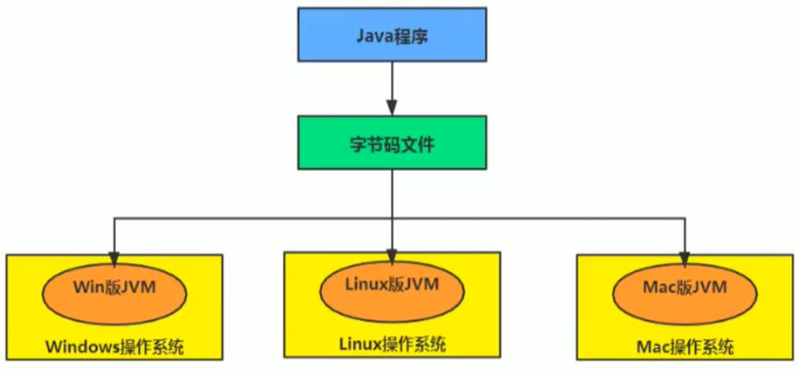
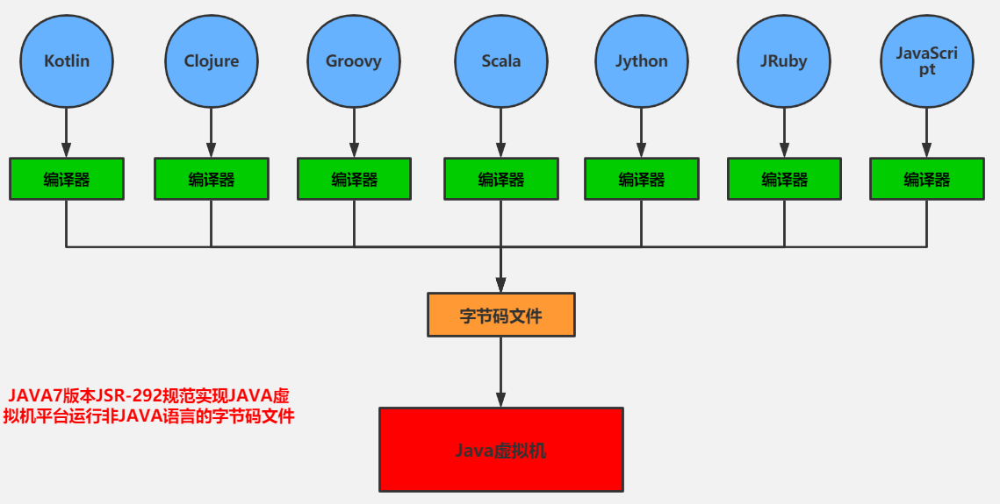
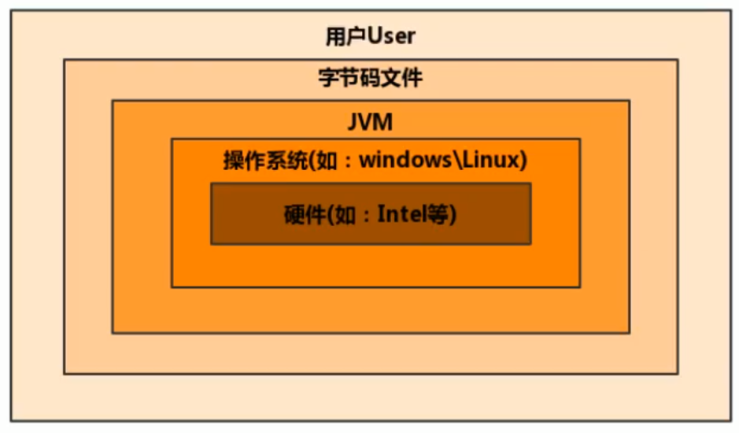
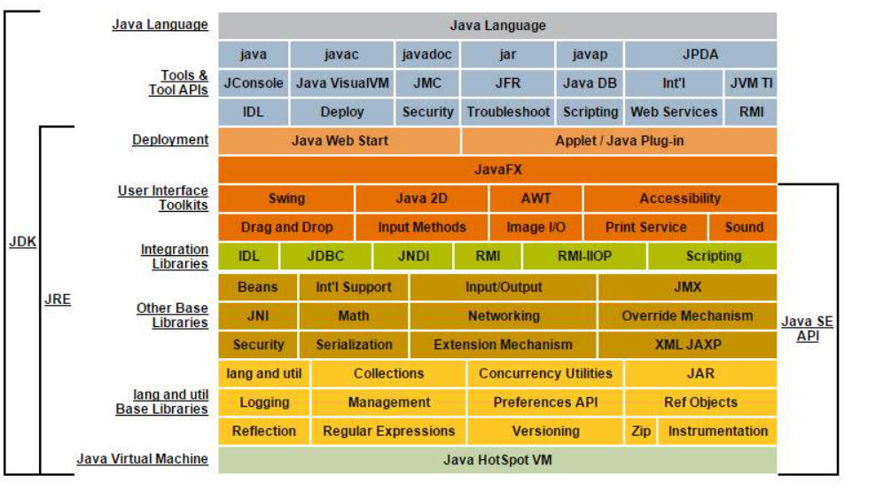
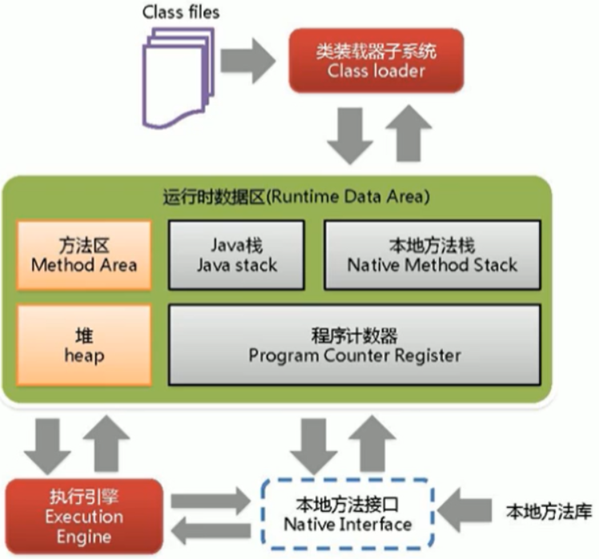
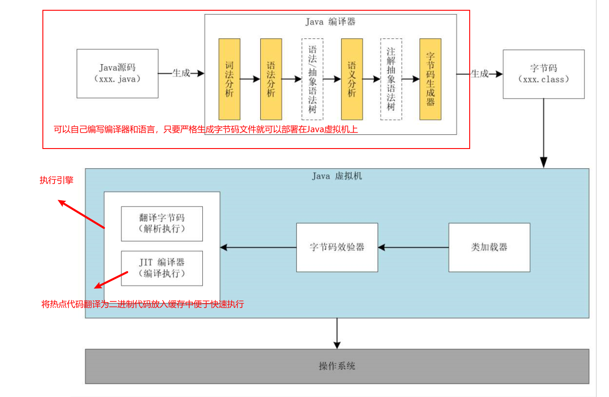

# 第一章 JVM与Java体系结构


## 1. Java和JVM简介


### 1.1 Java：跨平台的语言




### 1.2 JVM：跨语言的平台

**什么是JVM**

引用The Java Virtual Machine Specification Java SE 8 Edition对JVM的解释：

> The Java Virtual Machine is the cornerstone of the Java platform. It is the component of the technology responsible for its hardware- and operating systemindependence, the small size of its compiled code, and its ability to protect users from malicious programs.

随着Java7的正式发布，Java虚拟机的设计者们通过JSR-292规范基本实现在Java虚拟机平台上运行非Java语言编写的程序。

**Java虚拟机根本不关心运行在其内部的程序到底是使用何种编程语言编写的，它只关心“字节码”文件。**也就是说Java虚拟机拥有语言无关性，并不会单纯地与Java语言“终身绑定”，只要其他编程语言的编译结果满足并包含Java虚拟机的内部指令集、符号表以及其他的辅助信息，它就是一个有效的字节码文件，就能够被虚拟机所识别并装载运行。

我们平时说的java字节码，指的是用java语言编译成的字节码。准确的说任何能在JVM平台上执行的字节码格式都是一样的。所以应该统称为：**JVM字节码**。不同的编译器，可以编译出相同的字节码文件，字节码文件也可以在不同的JVM上运行。Java虚拟机与 Java 语言并没有必然的联系，它只与特定的二进制文件格式—Class文件格式所关联，class 文件中包含了Java虚拟机指令集（或者称为字节码、Bytecodes）和符号表，还有一些其他辅助信息。



**多语言混合编程**

**Java平台上的多语言混合编程正成为主流，通过特定领域的语言去解决特定领域的问题是当前软件开发应对日趋复杂的项目需求的一个方向。**试想一下，在一个项目之中，并行处理用Clojure语言编写，展示层使用JRuby/Rails，中间层则是Java，每个应用层都将使用不同的编程语言来完成，而且，接口对每一层的开发者都是透明的，各种语言之间的交互不存在任何困难，就像使用自己语言的原生API一样方便，因为它们最终都运行在一个虚拟机之上。对这些运行于Java虚拟机之上、Java之外的语言，来自系统级的、底层的支持正在迅速增强，以JSR-292为核心的一系列项目和功能改进（如DaVinci Machine项目、Nashorn引擎、InvokeDynamic指令、java.lang.invoke包等），**推动Java虚拟机从“Java语言的虚拟机”向 “多语言虚拟机”的方向发展**。

> For the sake of security, the Java Virtual Machine imposes strong syntactic and structural constraints on the code in a class file. However, any language with functionality that can be expressed in terms of a valid class file can be hosted by the Java Virtual Machine. Attracted by a generally available, machine-independent platform, implementors of other languages can turn to the Java Virtual Machine as a delivery vehicle for their languages.


### 1.3 Java重大事件

- 1990年，在Sun计算机公司中，由Patrick Naughton、MikeSheridan及**James Gosling**（java之父）领导的小组Green Team，开发出的新的程序语言，命名为Oak，后期命名为Java。
- **1995年**，Sun正式发布Java和HotJava产品，Java首次公开亮相。被认作为java诞生元年。
- 1996年1月23日Sun Microsystems发布了JDK 1.0。
- 1998年，JDK1.2版本发布。同时，Sun发布了JSP/Servlet、EJB规范，以及将Java分成了J2EE、J2SE和J2ME。这表明了Java开始向企业、桌面应用和移动设备应用3大领域挺进。
- 2000年，JDK1.3发布，**Java HotSpot Virtual Machine**正式发布，成为Java的默认虚拟机。
- 2002年，JDK1.4发布，古老的Classic虚拟机退出历史舞台。
- 2003年年底，Java平台的scala正式发布，同年Groovy也加入了Java阵营。
- 2004年，**JDK1.5发布。同时JDK1.5改名为JavaSE5.0**。
- 2006年，JDK6发布。同年，Java开源并建立了OpenJDK。顺理成章，**Hotspot虚拟机也成为了OpenJDK中的默认虚拟机**。
- 2007年，Java平台迎来了新伙伴Clojure。
- 2008年，oracle收购了BEA，得到了JRockit虚拟机。
- 2009年，Twitter宣布把后台大部分程序从Ruby迁移到Scala，这是Java平台的又一次大规模应用。
- 2010年，Oracle收购了Sun，获得Java商标和最真价值的HotSpot虚拟机。此时，Oracle拥有市场占用率最高的两款虚拟机HotSpot和JRockit，并计划在未来对它们进行整合：HotRockit。
- 2011年，JDK7发布。**在JDK1.7u4中，正式启用了新的垃圾回收器G1**。
- 2017年，JDK9发布。将G1设置为默认GC，替代CMS。
- 同年，IBM的J9开源，形成了现在的Open J9社区。
- 2018年，Android的Java侵权案判决，Google赔偿Oracle计88亿美元。
- 同年，Oracle宣告JavagE成为历史名词JDBC、JMS、Servlet赠予Eclipse基金会。
- 同年，JDK11发布，**LTS版本的JDK，发布革命性的ZGC，调整JDK授权许可**。
- 2019年，JDK12发布，加入RedHat领导开发的Shenandoah GC


## 2. 虚拟机和Java虚拟机

### 2.1 虚拟机

所谓虚拟机（Virtual Machine），就是一台虚拟的计算机。它是一款软件，用来执行一系列虚拟计算机指令。大体上，虚拟机可以分为系统虚拟机和程序虚拟机。

1. 大名鼎鼎的Virtual Box，VMware就属于系统虚拟机，它们完全是对物理计算机的仿真，提供了一个可运行完整操作系统的软件平台。
2. 程序虚拟机的典型代表就是Java虚拟机，它专门为执行单个计算机程序而设计，在Java虚拟机中执行的指令我们称为Java字节码指令。
3. 无论是系统虚拟机还是程序虚拟机，在上面运行的软件都被限制于虚拟机提供的资源中。

### 2.2 Java虚拟机

1. Java虚拟机是一台执行Java字节码的虚拟计算机，它拥有独立的运行机制，其运行的Java字节码也未必由Java语言编译而成。
2. JVM平台的各种语言可以共享Java虚拟机带来的跨平台性、优秀的垃圾回器，以及可靠的即时编译器。
3. Java技术的核心就是Java虚拟机（JVM，Java Virtual Machine），因为所有的Java程序都运行在Java虚拟机内部。
4. Java虚拟机就是二进制字节码的运行环境，负责装载字节码到其内部，解释/编译为对应平台上的机器指令执行。每一条Java指令，Java虚拟机规范中都有详细定义，如怎么取操作数，怎么处理操作数，处理结果放在哪里。

**特点：**

1. 一次编译，到处运行
2. 自动内存管理
3. 自动垃圾回收功能


## 3. JVM的位置

**JVM是运行在操作系统之上的，它与硬件没有直接的交互**



**Java的体系结构**



## 4. JVM的整体结构

1. HotSpot VM是目前市面上高性能虚拟机的代表作之一。
2. 它采用**解释器与即时编译器并存的架构**。
3. 在今天，Java程序的运行性能早已脱胎换骨，已经达到了可以和C/C++程序一较高下的地步。
4. **执行引擎包含三部分：解释器，即时编译器，垃圾回收器**



**要求：**可以画出图中的各个部分

## 5. Java代码的执行流程

凡是能生成被Java虚拟机所能解释、运行的字节码文件，那么理论上我们就可以自己设计一套语言了




## 6. JVM的架构模型

**Java编译器输入的指令流基本上是一种基于栈的指令集架构**，另外一种指令集架构则是基于寄存器的指令集架构。具体来说：这两种架构之间的区别：


### 6.1 基于栈的指令集架构

**基于栈式架构的特点：**

1. 设计和实现更简单，适用于资源受限的系统；
2. **避开了寄存器的分配难题：使用零地址指令方式分配**
3. 指令流中的指令大部分是零地址指令，其执行过程依赖于操作栈。**指令集更小，编译器容易实现**，（但是指令多）
4. **不需要硬件支持，可移植性更好，更好实现跨平台**


### 6.2 基于寄存器的指令集架构

**基于寄存器架构的特点：**

1. 典型的应用是x86的二进制指令集：比如传统的PC以及Android的Davlik虚拟机。
2. **指令集架构则完全依赖硬件，与硬件的耦合度高，可移植性差**
3. 性能优秀和执行更高效
4. 花费更少的指令去完成一项操作
5. 在大部分情况下，**基于寄存器架构的指令集往往都以一地址指令、二地址指令和三地址指令为主**，而基于栈式架构的指令集却是以零地址指令为主


### 6.3 两种架构的举例

同样执行2+3这种逻辑操作，其指令分别如下：


- **基于栈的计算流程（以Java虚拟机为例）：**

```
iconst_2 //常量2入栈
istore_1
iconst_3 // 常量3入栈
istore_2
iload_1
iload_2
iadd //常量2/3出栈，执行相加
istore_0 // 结果5入栈
12345678
```

- **而基于寄存器的计算流程**

```
mov eax,2 //将eax寄存器的值设为1
add eax,3 //使eax寄存器的值加3
```


### 6.4 如何反编译字节码文件

- 编写 java 代码，编译生成字节码文件

~~~java
public class StackStruTest {
    public static void main(String[] args){
        int i = 2;
        int j = 3;
        int k = i+j;
    }
}
~~~

- 在 .class 文件的同级目录下，执行反编译


~~~java
javap -v StackStruTest.class
~~~

- 反编译得到的指令


### 6.5 JVM 架构总结

**由于跨平台性的设计，Java的指令都是根据栈来设计的**。不同平台CPU架构不同，所以不能设计为基于寄存器的。**优点是跨平台，指令集小，编译器容易实现，缺点是性能下降，实现同样的功能需要更多的指令**

问：

时至今日，尽管嵌入式平台已经不是Java程序的主流运行平台了（准确来说应该是HotSpot VM的宿主环境已经不局限于嵌入式平台了），那么为什么不将架构更换为基于寄存器的架构呢？

答：

（还是从优点考虑）因为基于栈的架构跨平台性好、指令集小，虽然相对于基于寄存器的架构来说，基于栈的架构编译得到的指令更多，执行性能也不如基于寄存器的架构好，但考虑到其跨平台性与移植性，我们还是选用栈的架构


## 7. JVM 生命周期

### 7.1 虚拟机的启动

**Java虚拟机的启动是通过引导类加载器（bootstrap class loader）创建一个初始类（initial class）来完成的**，这个类是由虚拟机的具体实现指定的。


### 7.2 虚拟机的执行

1. 一个运行中的Java虚拟机有着一个清晰的任务：执行Java程序
2. 程序开始执行时他才运行，程序结束时他就停止
3. **执行一个所谓的Java程序的时候，真真正正在执行的是一个叫做Java虚拟机的进程**


### 7.3 虚拟机的退出

**有如下的几种情况：**

1. 程序正常执行结束
2. 程序在执行过程中遇到了异常或错误而异常终止
3. 由于操作系统用现错误而导致Java虚拟机进程终止
4. 某线程调用Runtime类或System类的exit()方法，或Runtime类的halt()方法，并且Java安全管理器也允许这次exit()或halt()操作。
5. 除此之外，JNI（Java Native Interface）规范描述了用JNI Invocation API来加载或卸载 Java虚拟机时，Java虚拟机的退出情况。


### 7.4 exit() 方法

**Runtime 类源码分析**

- Runtime 对象全局唯一，对应着下图中的【运行时数据区】
- 明显的饿汉设计模式： new 一个 Runtime 类的实例，并且将 Runtime 类的构造器私有化了

~~~java
public class Runtime {
    private static Runtime currentRuntime = new Runtime();

    /**
     * Returns the runtime object associated with the current Java application.
     * Most of the methods of class <code>Runtime</code> are instance
     * methods and must be invoked with respect to the current runtime object.
     *
     * @return  the <code>Runtime</code> object associated with the current
     *          Java application.
     */
    public static Runtime getRuntime() {
        return currentRuntime;
    }

    /** Don't let anyone else instantiate this class */
    private Runtime() {}
~~~

- Runtime 类的 exit() 方法调用了 ShutDown 类的 exit() 方法

~~~java
public void exit(int status) {
        SecurityManager security = System.getSecurityManager();
        if (security != null) {
            security.checkExit(status);
        }
        Shutdown.exit(status);
    }
~~~

**ShutDown 类源码分析**

- exit() 方法会调用到本地方法 runAllFinalizers() 和 halt0()

~~~java
static void exit(int status) {
        boolean runMoreFinalizers = false;
        synchronized (lock) {
            if (status != 0) runFinalizersOnExit = false;
            switch (state) {
            case RUNNING:       /* Initiate shutdown */
                state = HOOKS;
                break;
            case HOOKS:         /* Stall and halt */
                break;
            case FINALIZERS:
                if (status != 0) {
                    /* Halt immediately on nonzero status */
                    halt(status);
                } else {
                    /* Compatibility with old behavior:
                     * Run more finalizers and then halt
                     */
                    runMoreFinalizers = runFinalizersOnExit;
                }
                break;
            }
        }
        if (runMoreFinalizers) {
            runAllFinalizers();
            halt(status);
        }
        synchronized (Shutdown.class) {
            /* Synchronize on the class object, causing any other thread
             * that attempts to initiate shutdown to stall indefinitely
             */
            sequence();
            halt(status);
        }
    }

~~~

~~~java
static void halt(int status) {
        synchronized (haltLock) {
            halt0(status);
        }
    }

    static native void halt0(int status);

    /* Wormhole for invoking java.lang.ref.Finalizer.runAllFinalizers */
    private static native void runAllFinalizers();
~~~

**System 类源码分析**

~~~java
public static void exit(int status) {
    Runtime.getRuntime().exit(status);
}
~~~

**总结**

1. 调用 System.exit() 方法 --> 调用 Runtime.exit() 方法
2. 调用 Runtime.exit() 方法 --> 调用了 ShutDown.exit() 方法

## 8. JVM 发展历程

### 8.1 Sun Classic VM

1. 早在1996年Java1.0版本的时候，Sun公司发布了一款名为sun classic VM的Java虚拟机，它同时也是世界上第一款商用Java虚拟机，JDK1.4时完全被淘汰。
2. **这款虚拟机内部只提供解释器**，没有即时编译器，因此效率比较低，即时编译器会把热点代码缓存起来，那么以后使用热点代码的时候，效率就比较高。
3. 如果使用JIT编译器，就需要进行外挂。但是一旦使用了JIT编译器，JIT就会接管虚拟机的执行系统。解释器就不再工作。解释器和编译器不能配合工作。
4. 现在Hotspot内置了此虚拟机。

### 8.2 Exact VM

1. 为了解决上一个虚拟机问题，jdk1.2时，Sun提供了此虚拟机。
2. Exact Memory Management：准确式内存管理
   - 也可以叫Non-Conservative/Accurate Memory Management
   - **虚拟机可以知道内存中某个位置的数据具体是什么类型**。
3. 具备现代高性能虚拟机的维形
   - **热点探测（寻找出热点代码进行缓存）**
   - **编译器与解释器混合工作模式**
4. 只在Solaris平台短暂使用，其他平台上还是classic vm，英雄气短，终被Hotspot虚拟机替换

### 8.3 HotSpot VM

1. HotSpot历史

   - 最初由一家名为“Longview Technologies”的小公司设计
   - 1997年，此公司被Sun收购；2009年，Sun公司被甲骨文收购。
   - JDK1.3时，HotSpot VM成为默认虚拟机

2. 目前Hotspot占有绝对的市场地位，称霸武林。

   - 不管是现在仍在广泛使用的JDK6，还是使用比例较多的JDK8中，默认的虚拟机都是HotSpot
   - Sun/oracle JDK和openJDK的默认虚拟机
   - 因此本课程中默认介绍的虚拟机都是HotSpot，相关机制也主要是指HotSpot的GC机制。（**比如其他两个商用虚机都没有方法区的概念**）

3. 从服务器、桌面到移动端、嵌入式都有应用。

4. 名称中的HotSpot指的就是它的热点代码探测技术。

   - 通过计数器找到最具编译价值代码，触发即时编译或栈上替换

   - 通过编译器与解释器协同工作，在最优化的程序响应时间与最佳执行性能中取得平衡

### 8.4 JRockit

1. 专注于服务器端应用：它可以不太关注程序启动速度，因此**JRockit内部不包含解析器实现，全部代码都靠即时编译器编译后执行**。
2. 大量的行业基准测试显示，JRockit JVM是世界上最快的JVM：使用JRockit产品，客户已经体验到了显著的性能提高（一些超过了70%）和硬件成本的减少（达50%）。
3. 优势：全面的Java运行时解决方案组合
   - JRockit面向延迟敏感型应用的解决方案JRockit Real Time提供以毫秒或微秒级的JVM响应时间，适合财务、军事指挥、电信网络的需要
   - Mission Control服务套件，它是一组以极低的开销来监控、管理和分析生产环境中的应用程序的工具。
4. 2008年，JRockit被Oracle收购。
5. Oracle表达了整合两大优秀虚拟机的工作，大致在JDK8中完成。整合的方式是在HotSpot的基础上，移植JRockit的优秀特性。

### 8.5 IBM的J9

1. 全称：IBM Technology for Java Virtual Machine，简称IT4J，内部代号：J9
2. 市场定位与HotSpot接近，服务器端、桌面应用、嵌入式等多用途VM广泛用于IBM的各种Java产品。
3. 目前，有影响力的三大商用虚拟机之一，也号称是世界上最快的Java虚拟机。
4. 2017年左右，IBM发布了开源J9VM，命名为openJ9，交给Eclipse基金会管理，也称为Eclipse OpenJ9
5. OpenJDK -> 是JDK开源了，包括了虚拟机

### 8.6 KVM和CDC/CLDC Hotspot

1. Oracle在Java ME产品线上的两款虚拟机为：CDC/CLDC HotSpot Implementation VM KVM（Kilobyte）是CLDC-HI早期产品目前移动领域地位尴尬，智能机被Android和iOS二分天下。
2. KVM简单、轻量、高度可移植，面向更低端的设备上还维持自己的一片市场
   - 智能控制器、传感器
   - 老人手机、经济欠发达地区的功能手机
3. 所有的虚拟机的原则：一次编译，到处运行。

### 8.7 Azul VM

1. 前面三大“高性能Java虚拟机”使用在通用硬件平台上这里Azul VW和BEA Liquid VM是与特定硬件平台绑定、软硬件配合的专有虚拟机：高性能Java虚拟机中的战斗机。
2. Azul VM是Azul Systems公司在HotSpot基础上进行大量改进，运行于Azul Systems公司的专有硬件Vega系统上的Java虚拟机。
3. 每个Azul VM实例都可以管理至少数十个CPU和数百GB内存的硬件资源，并提供在巨大内存范围内实现可控的GC时间的垃圾收集器、专有硬件优化的线程调度等优秀特性。
4. 2010年，Azul Systems公司开始从硬件转向软件，发布了自己的Zing JVM，可以在通用x86平台上提供接近于Vega系统的特性。

### 8.8 Liquid VM

1. 高性能Java虚拟机中的战斗机。
2. BEA公司开发的，直接运行在自家Hypervisor系统上
3. Liquid VM即是现在的JRockit VE（Virtual Edition）
4. Liquid VM不需要操作系统的支持，或者说它自己本身实现了一个专用操作系统的必要功能，如线程调度、文件系统、网络支持等。
5. 随着JRockit虚拟机终止开发，Liquid vM项目也停止了。

### 8.9 Apache Marmony

1. Apache也曾经推出过与JDK1.5和JDK1.6兼容的Java运行平台Apache Harmony。
2. 它是IElf和Intel联合开发的开源JVM，受到同样开源的Open JDK的压制，Sun坚决不让Harmony获得JCP认证，最终于2011年退役，IBM转而参与OpenJDK
3. 虽然目前并没有Apache Harmony被大规模商用的案例，但是它的Java类库代码吸纳进了Android SDK。

### 8.10 Micorsoft JVM

1. 微软为了在IE3浏览器中支持Java Applets，开发了Microsoft JVM。
2. 只能在window平台下运行。但确是当时Windows下性能最好的Java VM。
3. 1997年，Sun以侵犯商标、不正当竞争罪名指控微软成功，赔了Sun很多钱。微软WindowsXP SP3中抹掉了其VM。现在Windows上安装的jdk都是HotSpot。

### 8.11 Taobao JVM

1. 由AliJVM团队发布。阿里，国内使用Java最强大的公司，覆盖云计算、金融、物流、电商等众多领域，需要解决高并发、高可用、分布式的复合问题。有大量的开源产品。
2. 基于OpenJDK开发了自己的定制版本AlibabaJDK，简称AJDK。是整个阿里Java体系的基石。
3. 基于OpenJDK Hotspot VM发布的国内第一个优化、深度定制且开源的高性能服务器版Java虚拟机。
   - 创新的GCIH（GCinvisible heap）技术实现了off-heap，即将生命周期较长的Java对象从heap中移到heap之外，并且GC不能管理GCIH内部的Java对象，以此达到降低GC的回收频率和提升GC的回收效率的目的。
   - GCIH中的对象还能够在多个Java虚拟机进程中实现共享
   - 使用crc32指令实现JvM intrinsic降低JNI的调用开销
   - PMU hardware的Java profiling tool和诊断协助功能
   - 针对大数据场景的ZenGC
4. taobao vm应用在阿里产品上性能高，硬件严重依赖inte1的cpu，损失了兼容性，但提高了性能
5. 目前已经在淘宝、天猫上线，把Oracle官方JvM版本全部替换了。

### 8.12 Dalvik VM

1. 谷歌开发的，应用于Android系统，并在Android2.2中提供了JIT，发展迅猛。
2. Dalvik VM只能称作虚拟机，而不能称作“Java虚拟机”，它没有遵循 Java虚拟机规范
3. 不能直接执行Java的Class文件
4. 基于寄存器架构，不是jvm的栈架构。
5. 执行的是编译以后的dex（Dalvik Executable）文件。执行效率比较高。
6. 它执行的dex（Dalvik Executable）文件可以通过class文件转化而来，使用Java语法编写应用程序，可以直接使用大部分的Java API等。
7. Android 5.0使用支持提前编译（Ahead of Time Compilation，AoT）的ART VM替换Dalvik VM。

### 8.13 Graal VM

1. 2018年4月，Oracle Labs公开了GraalvM，号称 “Run Programs Faster Anywhere”，勃勃野心。与1995年java的”write once，run anywhere"遥相呼应。
2. GraalVM在HotSpot VM基础上增强而成的跨语言全栈虚拟机，可以作为“任何语言”
   的运行平台使用。语言包括：Java、Scala、Groovy、Kotlin；C、C++、Javascript、Ruby、Python、R等
3. 支持不同语言中混用对方的接口和对象，支持这些语言使用已经编写好的本地库文件
4. 工作原理是将这些语言的源代码或源代码编译后的中间格式，通过解释器转换为能被Graal VM接受的中间表示。Graal VM提供Truffle工具集快速构建面向一种新语言的解释器。在运行时还能进行即时编译优化，获得比原生编译器更优秀的执行效率。
5. 如果说HotSpot有一天真的被取代，Graalvm希望最大。但是Java的软件生态没有丝毫变化。

### 8.14 总结

具体JVM的内存结构，其实取决于其实现，不同厂商的JVM，或者同一厂商发布的不同版本，都有可能存在一定差异。主要以Oracle HotSpot VM为默认虚拟机。
