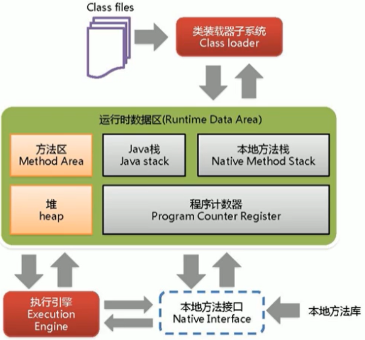
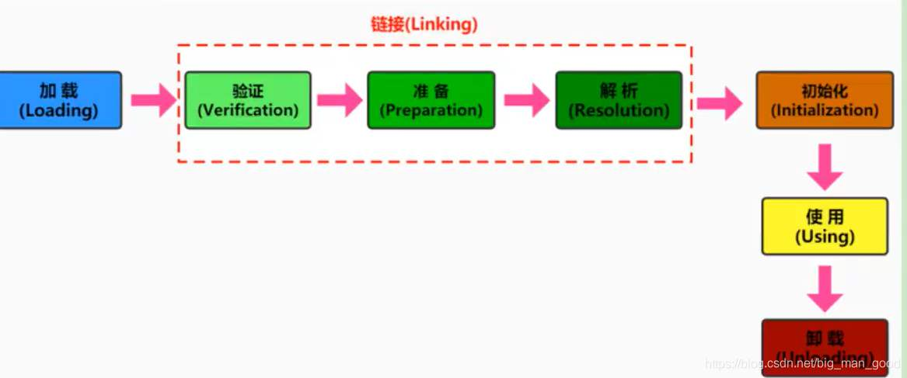
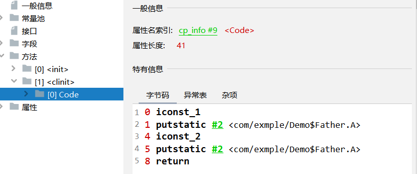

# 第二章 类加载子系统


## 1. 内存结构概述

如果自己想手写一个Java虚拟机的话，主要考虑哪些结构呢？

1. 类加载器
2. 执行引擎



**详细结构图：**


## 2 类加载子系统

**类加载器子系统作用**

1. **类加载器子系统负责从文件系统或者网络中加载Class文件**，class文件在文件开头有特定的文件标识。**魔数（十六进制：CA FE BA BE）**

> 为什么要使用魔数来进行字节码文件的判断呢,为什么不适用后缀名进行判断呢？
>
> **其实使用后缀也是可以的,只不过无法确保用户会不会手动修改文件的后缀名,所以使用了魔数来进行判断**
>
> 魔数内容的由来：CAFEBABE象征着著名的咖啡品牌 Peet' s Coffee 中 深受欢迎的Baristas,这也是为什么java的图标是一个咖啡标志的原因

1. ClassLoader只负责class文件的加载，至于它是否可以运行，则由Execution Engine决定。
2. **加载的类信息存放于一块称为方法区的内存空间**。除了类的信息外，方法区中还会存放运行时常量池信息，可能还包括**字符串字面量和数字常量**（这部分常量信息是Class文件中常量池部分的内存映射）


**class --> Java.lang.Class**

1. class file存在于本地硬盘上，可以理解为设计师画在纸上的模板，而最终这个模板在执行的时候是要加载到JVM当中来根据这个文件实例化出n个一模一样的实例。
2. **class file加载到JVM中，被称为DNA元数据模板，放在方法区**。
3. 在.class文件–>JVM–>最终成为元数据模板，此过程就要一个运输工具（类装载器Class Loader），扮演一个快递员的角色。


## 3 类加载过程

### 3.1 类加载过程和时机

- 看代码

```java
public class HelloLoader {
    public static void main(String[] args) {
        System.out.println("谢谢ClassLoader加载我....");
        System.out.println("你的大恩大德，我下辈子再报！");
    }
}
```

- 它的加载过程是怎么样的呢?
  - 执行 main() 方法（静态方法）就需要先加载承载类 HelloLoader
  - 加载成功，则进行链接、初始化等操作，完成后调用 HelloLoader 类中的静态方法 main
  - 加载失败则抛出异常


**完整的流程图如下所示：**

​		类从创建起（这里的类也可能是接口，下同），就注定了其是有生命周期的（这里的生命周期指的是类在运行期间所经历的过程，与是否存储在存储介质上无关）。类从被虚拟机加载到内存中开始，到卸载出内存为止，它的生命周期经历了**加载（Loading）、验证（Verification）、准备（Preparation）、解析（Resolution）、初始化（Initialization）、使用（Using）和卸载（Unloading）**，一共七个阶段，其中验证、准备、解析部分统称为链接。这七个阶段可以用如下图描述：



从上图中可以明显看出各个阶段是有顺序的，**加载、验证、准备、初始化这个5个阶段的顺序是固定的**，也就是说类的加载过程必须按照这种顺序按部就班开始；解析阶段则不一定，解析阶段的工作完全可能在初始化之后才开始，之所以这么设计，就是为了支持Java语言的动态绑定。还有一点需要注意的是，**虽然上述的5个阶段可能按照顺序开始，但是并不是说一个接一个阶段完成后才开始，一个阶段的进行完全可能激活另一个阶段的进行，交叉混合式的进行**。

那么什么情况下需要开始类加载过程的第一个阶段，加载到内存中呢？这就不得不涉及两个概念：**主动引用和被动引用**。根据Java虚拟机的规范，**只有5中情况属于主动引用**：

1. 遇到new（使用new 关键字实例化一个对象）、getstatic（读取一个类的静态字段）、putstatic或者invokestatic（设置一个类的静态字段）这4条指令的时候，如果类没有进行过初始化。则需要先触发其初始化。
2. 使用反射进行反射调用的时候，如果类没有初始化，则需要先触发其初始化。
3. 当初始化一个类的时候，如果其父类没有初始化，则需要先触发其父类的初始化
4. 程序启动需要触发main方法的时候，虚拟机会先触发这个类的初始化
5. 当使用jdk1.7的动态语言支持的时候，如果一个java.lang.invoke.MethodHandler实例最后的解析结果为REF_getStatic、REF_pusStatic、REF_invokeStatic的方法句柄（句柄中包含了对象的实例数据和类型数据，句柄是访问对象的一种方法。句柄存储在堆中），并且句柄对应的类没有被初始化，那么需要先触发这个类的初始化。


**5种之外情况就是被动引用。被动引用的经典例子有：**

1. 通过子类引用父类的静态字段 
   这种情况不会导致子类的初始化，因为对于静态字段，只有直接定义静态字段的类才会被触发初始化，子类不是定义这个静态字段的类，自然不能被实例化。代码如下：

   ~~~java
   //父类
   class SuperClass {
       //静态变量value
       public static int value = 666;
       //静态块，父类初始化时会调用
       static{
           System.out.println("父类初始化！");
       }
   }
   
   //子类
   class SubClass extends SuperClass{
       //静态块，子类初始化时会调用
       static{
           System.out.println("子类初始化！");
       }
   }
   
   //主类、测试类
   public class Demo {
       public static void main(String[] args){
           System.out.println(SubClass.value);
       }
   }
   ~~~

   输出结果：

   

2. 通过数组来引用类，不会触发类的初始化，因为是数组new，而类没有被new，所以没有触发任何“主动引用”条款，属于“被动引用”。代码如下：

   ~~~java
   //父类
   class SuperClass {
       //静态变量value  
       public static int value = 666;
       //静态块，父类初始化时会调用
       static{
           System.out.println("父类初始化！");
       }
   }
   
   //主类、测试类
   public class Demo {
       public static void main(String[] args){
           SuperClass[] test = new SuperClass[10];
       }
   }
   ~~~

   输出结果：

   无

   

3. 常量不会触发定义常量的类的初始化 ，因为常量在编译阶段会存入调用常量的类的常量池中，本质上并没有引用定义这个常量的类，所以不会触发定义这个常量的类的初始化。

   ~~~java
   //常量类
   class ConstClass {
       static{
           System.out.println("常量类初始化！");
       }
   
       public static final String HELLOWORLD = "hello world!";
   }
   
   //主类、测试类
   public class Demo {
       public static void main(String[] args){
           System.out.println(ConstClass.HELLOWORLD);
       }
   }
   ~~~

   输出结果：

   

**对于这5种主动引用会触发类进行初始化的场景，在java虚拟机规范中限定了“有且只有”这5种场景会触发类的加载。**


### 3.2 加载阶段

**加载流程**

1. **通过一个类的全限定名获取定义此类的二进制字节流**
2. 将这个字节流所代表的静态存储结构转化为**方法区的运行时数据结构**
3. **在内存中生成一个代表这个类的java.lang.Class对象**，作为方法区这个类的各种数据的访问入口


**加载class文件的方式**

1. 从本地系统中直接加载
2. 通过网络获取，典型场景：Web Applet
3. 从zip压缩包中读取，成为日后jar、war格式的基础
4. 运行时计算生成，使用最多的是：动态代理技术
5. 由其他文件生成，典型场景：JSP应用从专有数据库中提取.class文件，比较少见
6. 从加密文件中获取，典型的防Class文件被反编译的保护措施

**类的加载是由类的加载器完成的，类的加载器分为两种：**

- java虚拟机自带的加载器，包括启动类加载器，扩展类加载器，和系统类加载器

- 用户自定义加载器：ClassLoader类的子类，用户可以通过实现该类来定制类的加载方式

类的加载器并不需要等到某个类被首次使用时初始化，java虚拟机规范允许类加载器在预料某个类将要被使用时优先加载它，如果在预先加载的过程没有找到.class文件或者存在错误，类加载器必须等到程序首次主动使用该类时才抛出LinkageError异常，如果这个类一直没有被程序主动使用，则类加载器不会抛出异常

对于类的加载，可以分为数组类型和非数组类型，对于非数组类型可以通过系统的引导类加载器进行加载，也可以通过自定义的类加载器进行加载。这点是比较灵活的。而对于数组类型，数组类本身不通过类加载器进行加载，而是通过Java虚拟机直接进行加载的，那么是不是数组类型的类就不需要类加载器了呢？答案是否定的。因为当数组去除所有维度之后的类型最终还是要依靠类加载器进行加载的，所以数组类型的类与类加载器的关系还是很密切的。

**通常一个数组类型的类进行加载需要遵循以下的原则：**

1. 如果数组的组件类型（也就是数组类去除一个维度之后的类型，比如对于二维数组，去除一个维度之后是一个一维数组）是引用类型，那么递归采用上面的过程加载这个组件类型
2. 如果数组类的组件类型不是引用类型，比如是基本数据类型，Java虚拟机将把数组类标记为与引导类加载器关联
3. 数组类的可见性与组件类型的可见性是一致的。如果组件类型不是引用类型，那么数组类的可见性是public，意味着组件类型的可见性也是public。

### 3.3 链接阶段

- **链接分为三个子阶段：验证 --> 准备 --> 解析**

#### 3.3.1 验证阶段(Verify)

验证阶段的目的是为了确保Class字节流中包含的信息符合当前虚拟机的要求，并且不会危害虚拟机的安全，也因为java虚拟机不知道.class文件是如何被创建的，有可能是正常创建，也有可能是黑客特质破坏虚拟机的所以要有验证环节，提高程序的健壮性

主要包括四种验证，文件格式验证，元数据验证，字节码验证，符号引用验证。

- **文件格式验证：**

  ​		这里的文件格式是指Class的文件规范，这一步的验证主要保证加载的字节流（在计算机中不可能是整个Class文件，只有0和1，也就是字节流）符合Class文件的规范（根据前面对Class类文件的描述，Class文件的每一个字节表示的含义都是确定的。比如前四个字节是否是一个魔数等）以及保证这个字节流可以被虚拟机接受处理。

  ​		在Hotspot的规范中，对文件格式的验证远不止这些，但是只有通过文件格式的验证才能进入方法区中进行存储。所以自然也就知道，后面阶段的验证工作都是在方法区中进行的。

- **元数据的验证：**

  元数据可以理解为描述数据的数据，更通俗的说，元数据是描述类之间的依赖关系的数据，比如Java语言中的注解使用（使用@interface创建一个注解）。元数据验证主要目的是对类的元数据信息进行语义校验，保证不存在不符合Java语言规范（Java语法）的元数据信息。

  具体的验证信息包括以下几个方面：

  1. 这个类是否有父类（除了java.lang.Object外其余的类都应该有父类）
  2. 这个类的父类是否继承了不允许被继承的类（比如被final修饰的类）
  3. 如果这个类不是抽象类，是否实现了其父类或者接口中要求实现的方法
  4. 类中的字段、方法是否与父类产生矛盾（比如是否覆盖了父类的final字段）

- **字节码验证：**

  这个阶段主要对类的方法体进行校验分析。通过了字节码的验证并不代表就是没有问题的，但是如果没有通过验证就一定是有问题的。整个字节码的验证过程比这个复杂的多，由于字节码验证的高度复杂性，在jdk1.6版本之后的虚拟机增加了一项优化，Class类文件结构这篇文章中说到过有一个属性：StackMapTable属性。可以简单理解这个属性是用于检查类型是否匹配。

- **二进制兼容验证：**

  这个验证是最后阶段的验证，符号引用是Class文件的逻辑符号，直接引用指向的方法区中某一个地址，在解析阶段，将符号引用转为直接引用，这里只进行转化前的匹配性校验。符号引用验证主要是对类自身以外的信息进行匹配性校验。比如符号引用是否通过字符串描述的全限定名是否能够找到对应点类。

  - 符号引用（Symbolic Reference） 
    符号引用以一组符号来描述所引用的目标，符号引用可以是任何形式的字面量，只要使用时能无歧义的定位到目标即可（符号字面量，还没有涉及到内存）。符号引用与虚拟机实现的内存布局无关，引用的目标并不一定已经加载在内存中。各种虚拟机实现的内存布局可以各不相同，但是他们能接受的符号引用必须都是一致的，因为符号引用的字面量形式明确定义在Java虚拟机规范的Class文件格式中。
  - 直接引用（Direct Reference） 
    直接引用可以是直接指向目标的指针、相对偏移量或是一个能间接定位到目标的句柄（可以理解为内存地址）。直接引用是与虚拟机实现的内存布局相关的，同一个符号引用在不同的虚拟机实例上翻译出来的直接引用一般都不相同，如果有了直接引用，那引用的目标必定已经在内存中存在。

  进行符号引用验证的目的在于确保解析动作能够正常执行，如果无法通过符号引用验证那么将会抛出java.lang.IncomingChangeError异常的子类。

#### 3.3.2 准备阶段(Prepare)

1. 为类的静态变量分配内存空间，并将其赋予默认值，注意是初始值 如int变量默认初始值为0，引用变量默认初始值为null

   例如在类中有如下的一个变量定义：准备阶段会将a的默认初始值设置为0；在初始化阶段才会将a的值设置为1。

   ```java
   private static int a = 1;
   ```

   

2. 对于final修饰的static变量。在编译时期就已经分配空间了，在准备阶段会显示初始化。

3. 准备阶段不会为实例变量分配初始化，因为这时候还没有创建对象。类变量分配在方法区，实例变量分配在堆区。

#### 3.3.3 解析阶段(Resolve)

解析阶段是将常量池中的符号引用替换为直接引用的过程（前面已经提到了符号引用与直接引用的区别）。在进行解析之前需要对符号引用进行解析，不同虚拟机实现可以根据需要判断到底是在类被加载器加载的时候对常量池的符号引用进行解析（也就是初始化之前），还是等到一个符号引用被使用之前进行解析（也就是在初始化之后）。

到现在我们已经明白解析阶段的时机，那么还有一个问题是：如果一个符号引用进行多次解析请求，虚拟机中除了invokedynamic指令外，虚拟机可以对第一次解析的结果进行缓存（在运行时常量池中记录引用，并把常量标识为一解析状态），这样就避免了一个符号引用的多次解析。

解析动作主要针对的是类或者接口、字段、类方法、方法类型、方法句柄和调用点限定符7类符号引用。这里主要说明前四种的解析过程。

**类或者接口解析**

要把一个类或者接口的符号引用解析为直接引用，需要以下三个步骤：

1. 如果该符号引用不是一个数组类型，那么虚拟机将会把该符号代表的全限定名称传递给调用这个符号引用的类。这个过程由于涉及验证过程所以可能会触发其他相关类的加载
2. 如果该符号引用是一个数组类型，并且该数组的元素类型是对象。我们知道符号引用是存在方法区的常量池中的，该符号引用的描述符会类似”[java/lang/Integer”的形式，将会按照上面的规则进行加载，虚拟机将会生成一个代表此数组对象的直接引用
3. 如果上面的步骤都没有出现异常，那么该符号引用已经在虚拟机中产生了一个直接引用，但是在解析完成之前需要对符号引用进行验证，主要是确认当前调用这个符号引用的类是否具有访问权限，如果没有访问权限将抛出java.lang.IllegalAccess异常

**字段解析**

对字段的解析需要首先对其所属的类进行解析，因为字段是属于类的，只有在正确解析得到其类的正确的直接引用才能继续对字段的解析。对字段的解析主要包括以下几个步骤：

1. 如果该字段符号引用（后面简称符号）就包含了简单名称和字段描述符都与目标相匹配的字段，则返回这个字段的直接引用，解析结束
2. 否则，如果在该符号的类实现了接口，将会按照继承关系从下往上递归搜索各个接口和它的父接口，如果在接口中包含了简单名称和字段描述符都与目标相匹配的字段，那么久直接返回这个字段的直接引用，解析结束
3. 否则，如果该符号所在的类不是Object类的话，将会按照继承关系从下往上递归搜索其父类，如果在父类中包含了简单名称和字段描述符都相匹配的字段，那么直接返回这个字段的直接引用，解析结束
4. 否则，解析失败，抛出java.lang.NoSuchFieldError异常 
   如果最终返回了这个字段的直接引用，就进行权限验证，如果发现不具备对字段的访问权限，将抛出java.lang.IllegalAccessError异常

**类方法解析**

进行类方法的解析仍然需要先解析此类方法的类，在正确解析之后需要进行如下的步骤：

1. 类方法和接口方法的符号引用是分开的，所以如果在类方法表中发现class_index（类中方法的符号引用）的索引是一个接口，那么会抛出java.lang.IncompatibleClassChangeError的异常
2. 如果class_index的索引确实是一个类，那么在该类中查找是否有简单名称和描述符都与目标字段相匹配的方法，如果有的话就返回这个方法的直接引用，查找结束
3. 否则，在该类的父类中递归查找是否具有简单名称和描述符都与目标字段相匹配的字段，如果有，则直接返回这个字段的直接引用，查找结束
4. 否则，在这个类的接口以及它的父接口中递归查找，如果找到的话就说明这个方法是一个抽象类，查找结束，返回java.lang.AbstractMethodError异常（因为抽象类是没有实现的）
5. 否则，查找失败，抛出java.lang.NoSuchMethodError异常 
   如果最终返回了直接引用，还需要对该符号引用进行权限验证，如果没有访问权限，就抛出java.lang.IllegalAccessError异常

**接口方法解析**

同类方法解析一样，也需要先解析出该方法的类或者接口的符号引用，如果解析成功，就进行下面的解析工作：

1. 如果在接口方法表中发现class_index的索引是一个类而不是一个接口，那么也会抛出java.lang.IncompatibleClassChangeError的异常
2. 否则，在该接口方法的所属的接口中查找是否具有简单名称和描述符都与目标字段相匹配的方法，如果有的话就直接返回这个方法的直接引用。查找结束
3. 否则，在该接口以及其父接口中查找，直到Object类，如果找到则直接返回这个方法的直接引用 
   否则，查找失败

接口的所有方法都是public，所以不存在访问权限问题

### 3.4 初始化

到了初始化阶段，虚拟机才开始真正执行Java程序代码，前文讲到对类变量的初始化，但那是仅仅赋初值，用户自定义的值还没有赋给该变量。只有到了初始化阶段，才开始真正执行这个自定义的过程，所以也可以说初始化阶段是执行类构造器方法clinit() 的过程。那么这个clinit() 方法是这么生成的呢？

**初始化阶段**

1. **初始化阶段就是执行类构造器方法`<clinit>()`的过程**
2. 此方法不需定义，是javac编译器自动收集类中的所有类变量的赋值动作和静态代码块中的语句合并而来。也就是说，**当我们代码中包含static变量的时候，就会有clinit方法**
3. **`<clinit>()`方法中的指令按语句在源文件中出现的顺序执行**
4. `<clinit>()`不同于类的构造器。（关联：构造器是虚拟机视角下的`<init>()`）
5. **若该类具有父类，JVM会保证子类的`<clinit>()`执行前，父类的`<clinit>()`已经执行完毕**
6. **虚拟机必须保证一个类的`<clinit>()`方法在多线程下被同步加锁**


**当我们代码中包含static变量的时候，就会有clinit方法**

**示例 1：无 static 变量**

~~~java
public class Demo {
    private int a = 1;

    public static void main(String[] args) {
        int b = 2;
    }
}
~~~

并没有生成 clinit 方法


**示例 2：有 static 变量**

~~~java
public class Demo {
    //任何一个类声明以后，内部至少存在一个类的构造器
    private int a = 1;
    private static int c = 3;

    public static void main(String[] args) {
        int b = 2;
    }
}
~~~


**构造器方法中指令按语句在源文件中出现的顺序执行**

**示例 1**

~~~java
public class Demo {
    private static int num = 1;
    private static int number = 10;      //linking之prepare: number = 0 --> initial: 10 --> 20

    static {
        num = 2;
        number = 20;
        System.out.println(num);
        //System.out.println(number);    //报错：非法的前向引用（可以赋值，但不能调用）
    }

    public static void main(String[] args) {
        System.out.println(Demo.num);//2
        System.out.println(Demo.number);//10
    }
}
~~~

静态变量 number 的值变化过程如下

- 准备阶段时：0
- 执行静态变量初始化：10
- 执行静态代码块：20


**构造器是虚拟机视角下的`<init>()`**

~~~java
public class Demo {
    //任何一个类声明以后，内部至少存在一个类的构造器
    public int a = 1;
    private static int c = 3;

    public static void main(String[] args) {
        int b = 2;
    }

    public Demo(){
        a = 10;
        int d = 20;
    }

}
~~~

在构造器中：

- 先将类变量 a 由1赋值为 10
- 再将局部变量赋值为 20


**若该类具有父类，JVM会保证子类的`<clinit>()`执行前，父类的`<clinit>()`已经执行完毕**

~~~java
public class Demo {
    static class Father{
        public static int A = 1;
        static{
            A = 2;
        }
    }

    static class Son extends Father{
        public static int B = A;
    }

    public static void main(String[] args) {
        //加载Father类，其次加载Son类。
        System.out.println(Son.B);//2
    }
}
~~~

如上代码，加载流程如下：

- 首先，执行 main() 方法需要加载 ClinitTest1 类
- 获取 Son.B 静态变量，需要加载 Son 类
- Son 类的父类是 Father 类，所以需要先执行 Father 类的加载，再执行 Son 类的加载




**虚拟机必须保证一个类的`<clinit>()`方法在多线程下被同步加锁**

~~~java
public class Demo {
    public static void main(String[] args) {
        Runnable r = () -> {
            System.out.println(Thread.currentThread().getName() + "开始");
            DeadThread dead = new DeadThread();
            System.out.println(Thread.currentThread().getName() + "结束");
        };

        Thread t1 = new Thread(r, "线程1");
        Thread t2 = new Thread(r, "线程2");

        t1.start();
        t2.start();
    }
}

class DeadThread {
    static {
        if (true) {
            System.out.println(Thread.currentThread().getName() + "初始化当前类");
            while (true) {

            }
        }
    }
}
~~~

程序卡死，分析原因：

- 两个线程同时去加载 DeadThread 类，而 DeadThread 类中静态代码块中有一处死循环
- 先加载 DeadThread 类的线程抢到了同步锁，然后在类的静态代码块中执行死循环，而另一个线程在等待同步锁的释放
- 所以无论哪个线程先执行 DeadThread 类的加载，另外一个类也不会继续执行


## 4 类加载器的分类

### 4.1 类加载器概述

**类加载器的分类**

1. **JVM支持两种类型的类加载器 。分别为引导类加载器（Bootstrap ClassLoader）和自定义类加载器（User-Defined ClassLoader）**
2. 从概念上来讲，自定义类加载器一般指的是程序中由开发人员自定义的一类类加载器，但是Java虚拟机规范却没有这么定义，而是**将所有派生于抽象类ClassLoader的类加载器都划分为自定义类加载器**
3. 无论类加载器的类型如何划分，在程序中我们最常见的类加载器始终只有3个，如下所示
4. 这里的四者之间是包含关系，**不是上层和下层，也不是子父类的继承关系**。


**为什么 ExtClassLoader 和 AppClassLoader 都属于自定义加载器**

- **规范定义：所有派生于抽象类ClassLoader的类加载器都划分为自定义类加载器**

- ExtClassLoader 继承树

  

- AppClassLoader 继承树

  

**代码**：

- 我们尝试获取引导类加载器，获取到的值为 null ，这并不代表引导类加载器不存在，**因为引导类加载器右 C/C++ 语言，我们获取不到**
- 两次获取系统类加载器的值都相同：sun.misc.Launcher$AppClassLoader@18b4aac2 ，这说明**系统类加载器是全局唯一的**

~~~java
public class Demo {
    public static void main(String[] args){
        //获取系统类加载器
        ClassLoader systemClassLoader = ClassLoader.getSystemClassLoader();
        System.out.println(systemClassLoader);//sun.misc.Launcher$AppClassLoader@18b4aac2
        //获取扩展类加载器
        ClassLoader extClassLoader  = systemClassLoader.getParent();
        System.out.println(extClassLoader);//sun.misc.Launcher$ExtClassLoader@1b6d3586
        //获取引导类加载器，获取不到
        ClassLoader bootstrapClassLoader = extClassLoader .getParent();
        System.out.println(bootstrapClassLoader);//null
        //对于用户自定义类来说：默认使用系统类加载器进行加载
        ClassLoader classLoader = Demo.class.getClassLoader();
        System.out.println(classLoader);//sun.misc.Launcher$AppClassLoader@18b4aac2
        //String类使用引导类加载器进行加载的。---> Java的核心类库都是使用引导类加载器进行加载的。
        ClassLoader classLoader1 = String.class.getClassLoader();
        System.out.println(classLoader1);//null
    }
}
~~~

### 4.2 虚拟机自带的加载器

#### 4.2.1 启动类加载器

> **启动类加载器（引导类加载器，Bootstrap ClassLoader）**

1. **这个类加载使用C/C++语言实现的，嵌套在JVM内部**
2. **它用来加载Java的核心库（JAVA_HOME/jre/lib/rt.jar、resources.jar或sun.boot.class.path路径下的内容），用于提供JVM自身需要的类**
3. **并不继承自java.lang.ClassLoader，没有父加载器**
4. **加载扩展类和应用程序类加载器，并作为他们的父类加载器（当他俩的爹）**
5. **出于安全考虑，Bootstrap启动类加载器只加载包名为java、javax、sun等开头的类（JDK的安装目录的lib路径下的jar包）**

#### 4.2.2 扩展类加载器

> **扩展类加载器（Extension ClassLoader）**

1. **Java语言编写，由sun.misc.Launcher$ExtClassLoader实现**
2. **派生于ClassLoader类**
3. **父类加载器为启动类加载器**
4. **从java.ext.dirs系统属性所指定的目录中加载类库，或从JDK的安装目录的jre/lib/ext子目录（扩展目录）下加载类库。如果用户创建的JAR放在此目录下，也会自动由扩展类加载器加载**

#### 4.2.3、系统类加载器

> **应用程序类加载器（系统类加载器，AppClassLoader）**

1. **Java语言编写，由sun.misc.LaunchersAppClassLoader实现**
2. **派生于ClassLoader类**
3. **父类加载器为扩展类加载器**
4. **它负责加载环境变量classpath或系统属性java.class.path指定路径下的类库**
5. **该类加载是程序中默认的类加载器，一般来说，Java应用的类都是由它来完成加载**
6. **通过classLoader.getSystemclassLoader()方法可以获取到该类加载器**

**代码举例说明**

~~~java
public class Demo {
    public static void main(String[] args){
        System.out.println("**********启动类加载器**************");
        //获取BootstrapClassLoader能够加载的api的路径
        URL[] urLs = sun.misc.Launcher.getBootstrapClassPath().getURLs();
        for (URL element : urLs) {
            System.out.println(element.toExternalForm());
        }
        //从上面的路径中随意选择一个类,来看看他的类加载器是什么:引导类加载器
        ClassLoader classLoader = Provider.class.getClassLoader();
        System.out.println(classLoader);//null

        System.out.println("***********扩展类加载器*************");
        String extDirs = System.getProperty("java.ext.dirs");
        for (String path : extDirs.split(";")) {
            System.out.println(path);
        }

        //从上面的路径中随意选择一个类,来看看他的类加载器是什么:扩展类加载器
        ClassLoader classLoader1 = CurveDB.class.getClassLoader();
        System.out.println(classLoader1);//sun.misc.Launcher$ExtClassLoader@4b67cf4d
    }
}

~~~

System.out.println(classLoader); 输出 null ，再次证明我们无法获取到启动类加载器

~~~java
**********启动类加载器**************
file:/C:/Program%20Files/Java/jdk1.8.0_211/jre/lib/resources.jar
file:/C:/Program%20Files/Java/jdk1.8.0_211/jre/lib/rt.jar
file:/C:/Program%20Files/Java/jdk1.8.0_211/jre/lib/sunrsasign.jar
file:/C:/Program%20Files/Java/jdk1.8.0_211/jre/lib/jsse.jar
file:/C:/Program%20Files/Java/jdk1.8.0_211/jre/lib/jce.jar
file:/C:/Program%20Files/Java/jdk1.8.0_211/jre/lib/charsets.jar
file:/C:/Program%20Files/Java/jdk1.8.0_211/jre/lib/jfr.jar
file:/C:/Program%20Files/Java/jdk1.8.0_211/jre/classes
null
***********扩展类加载器*************
C:\Program Files\Java\jdk1.8.0_211\jre\lib\ext
C:\WINDOWS\Sun\Java\lib\ext
sun.misc.Launcher$ExtClassLoader@4b67cf4d
~~~

### 4.3 用户自定义类加载器

> **为什么需要自定义类加载器？**

在Java的日常应用程序开发中，类的加载几乎是由上述3种类加载器相互配合执行的，在必要时，我们还可以自定义类加载器，来定制类的加载方式。那为什么还需要自定义类加载器？

1. 隔离加载类
2. 修改类加载的方式
3. 扩展加载源
4. 防止源码泄漏

> **如何自定义类加载器？**

1. 开发人员可以通过继承抽象类java.lang.ClassLoader类的方式，实现自己的类加载器，以满足一些特殊的需求
2. 在JDK1.2之前，在自定义类加载器时，总会去继承ClassLoader类并重写loadClass()方法，从而实现自定义的类加载类，但是在JDK1.2之后已不再建议用户去覆盖loadClass()方法，而是建议把自定义的类加载逻辑写在findclass()方法中
3. 在编写自定义类加载器时，如果没有太过于复杂的需求，可以直接继承URIClassLoader类，这样就可以避免自己去编写findclass()方法及其获取字节码流的方式，使自定义类加载器编写更加简洁。

**代码示例**

~~~java
public class CustomClassLoader extends ClassLoader {
    @Override
    protected Class<?> findClass(String name) throws ClassNotFoundException {

        try {
            byte[] result = getClassFromCustomPath(name);
            if (result == null) {
                throw new FileNotFoundException();
            } else {
                return defineClass(name, result, 0, result.length);
            }
        } catch (FileNotFoundException e) {
            e.printStackTrace();
        }

        throw new ClassNotFoundException(name);
    }

    private byte[] getClassFromCustomPath(String name) {
        //从自定义路径中加载指定类:细节略
        //如果指定路径的字节码文件进行了加密，则需要在此方法中进行解密操作。
        return null;
    }

    public static void main(String[] args) {
        CustomClassLoader customClassLoader = new CustomClassLoader();
        try {
            Class<?> clazz = Class.forName("One", true, customClassLoader);
            Object obj = clazz.newInstance();
            System.out.println(obj.getClass().getClassLoader());
        } catch (Exception e) {
            e.printStackTrace();
        }
    }
}
~~~

### 4.4 关于 ClassLoader

> **ClassLoader 类介绍**

- ClassLoader类，它是一个抽象类，其后所有的类加载器都继承自ClassLoader（不包括启动类加载器）

|                           方法名称                           |                             描述                             |
| :----------------------------------------------------------: | :----------------------------------------------------------: |
|           public final ClassLoader **getParent**()           | 返回父类加载器进行委派。 一些实现可以使用`null`来表示引导类加载器。  如果此类加载器的父级是引导类加载器，则此方法将返回`null` 。 |
|    protected final 类<?> **findLoadedClass**(String name)    | 返回给定类`binary name`如果装载机已记录由Java虚拟机作为与一类的初始化加载器`binaryname`。 否则返回`null` 。 |
| protected 类<?> **findClass**(String name)  throws ClassNotFoundException | 查找具有指定的课程`binary name`。  该方法应该被加载类的委托模型后面的类加载器实现覆盖，并且在检查所请求的类的父类加载器之后将被`ClassLoader`方法调用。  默认实现会抛出一个`ClassNotFoundException` 。 |
|     public static ClassLoader **getSystemClassLoade**r()     | 返回用于委派的系统类加载器。 这是新的`ClassLoader`实例的默认委派父项，  通常是用于启动应用程序的类加载器。 |
| protected final 类<?> **defineClass**(String name,byte[] b,int off, int len)  throws ClassFormatError |  将字节数组转换为类别类的实例。 在类可以使用之前必须解决。   |
| public 类<?> **loadClass**(String name)  throws ClassNotFoundException | 加载指定的课程`binaryname`。  该方法以与`loadClass(String,  boolean)`方法相同的方式搜索类。 它由Java虚拟机调用来解析类引用。  调用此方法相当于调用`loadClass(name,  false)` 。 |
|        protected final void **resolveClass**(类<?> c)        | 链接指定的类。 这个（误导性的）方法可能被类加载器用来链接一个类。  如果`c`类已经被链接，那么这个方法只是返回。 否则，课程将按照The Java™ Language  Specification的“执行”一章中的描述进行链接 。 |

- sun.misc.Launcher 它是一个java虚拟机的入口应用

  

- 获取 ClassLoader 途径

  

- 代码示例：

  ~~~java
  public class ClassLoaderTest2 {
      public static void main(String[] args) {
          try {
              
              //1.Class.forName().getClassLoader()
              ClassLoader classLoader = Class.forName("java.lang.String").getClassLoader();
              System.out.println(classLoader); // String 类由启动类加载器加载，我们无法获取
  
              //2.Thread.currentThread().getContextClassLoader()
              ClassLoader classLoader1 = Thread.currentThread().getContextClassLoader();
              System.out.println(classLoader1);
  
              //3.ClassLoader.getSystemClassLoader().getParent()
              ClassLoader classLoader2 = ClassLoader.getSystemClassLoader();
              System.out.println(classLoader2);
  
          } catch (ClassNotFoundException e) {
              e.printStackTrace();
          }
      }
  }
  
  // 输出
  null
  sun.misc.Launcher$AppClassLoader@18b4aac2
  sun.misc.Launcher$AppClassLoader@18b4aac2
  ~~~


## 5. 双亲委派机制

### 5.1 双亲委派机制原理

**Java虚拟机对class文件采用的是按需加载的方式**，也就是说当需要使用该类时才会将它的class文件加载到内存生成class对象。而且**加载某个类的class文件时，Java虚拟机采用的是双亲委派模式，即把请求交由父类处理，它是一种任务委派模式**

1. 如果一个类加载器收到了类加载请求，它并不会自己先去加载，而是把这个请求委托给父类的加载器去执行；
2. 如果父类加载器还存在其父类加载器，则进一步向上委托，依次递归，请求最终将到达顶层的启动类加载器；
3. 如果父类加载器可以完成类加载任务，就成功返回，倘若父类加载器无法完成此加载任务，子加载器才会尝试自己去加载，这就是双亲委派模式。
4. 父类加载器一层一层往下分配任务，如果子类加载器能加载，则加载此类，如果将加载任务分配至系统类加载器也无法加载此类，则抛出异常


**代码示例：**

在src目录下，新建java\lang包，新建String类，

~~~java
public class String {
    static {
        System.out.println("自定义的String类的静态代码块");
    }

    public static void main(String[] args) {
        System.out.println("hello,String");
    }
}
~~~

加载该类的时候，会向上委托，交给了引导类加载器加载，加载了系统的String类，得到了没有main函数的String，就会报错


**线程上下文类加载器**

**线程上下文类加载器从根本解决了一般应用不能违背双亲委派模式的问题，使得java类加载体系显得更灵活。** 上面所提到的问题正是线程上下文类加载器的拿手好菜。如果不做任何的设置，Java应用的线程上下文类加载器默认就是系统类加载器。因此，在 SPI 接口的代码中使用线程上下文类加载器，就可以成功的加载到 SPI 实现的类。

当我们加载jdbc.jar 用于实现数据库连接的时候

1. 首先我们需要知道的是 jdbc.jar是基于SPI接口进行实现的
2. 所以在加载的时候，会进行双亲委派，最终从根加载器中加载 SPI核心类，然后再加载SPI接口类
3. 接着在进行反向委托，通过线程上下文类加载器进行实现类 jdbc.jar的加载。


### 5.2 双亲委派机制优势

通过上面的例子，我们可以知道，双亲机制可以

1. 避免类的重复加载
2. 保护程序安全，防止核心API被随意篡改
   1. 自定义类：java.lang.String 没有使用
   2. 自定义类：java.lang.ShkStart（报错：阻止创建 java.lang开头的类）

### 5.3 补充

- **如何判断两个class对象是否相同？**

  在JVM中表示两个class对象是否为同一个类存在两个必要条件：

  1. **类的完整类名必须一致，包括包名**
  2. **加载这个类的ClassLoader（指ClassLoader实例对象）必须相同**
  3. 换句话说，在JVM中，即使这两个类对象（class对象）来源同一个Class文件，被同一个虚拟机所加载，但只要加载它们的ClassLoader实例对象不同，那么这两个类对象也是不相等的

- **对类加载器的引用**

  1. JVM必须知道一个类型是由启动加载器加载的还是由用户类加载器加载的
  2. **如果一个类型是由用户类加载器加载的，那么JVM会将这个类加载器的一个引用作为类型信息的一部分保存在方法区中**
  3. 当解析一个类型到另一个类型的引用的时候，JVM需要保证这两个类型的类加载器是相同的