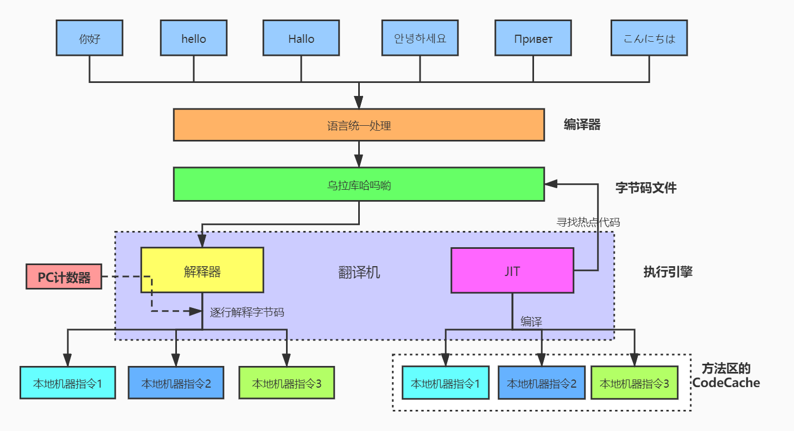
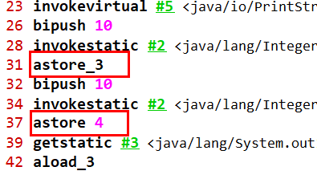
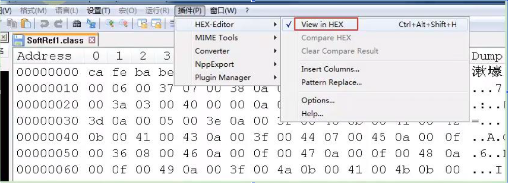
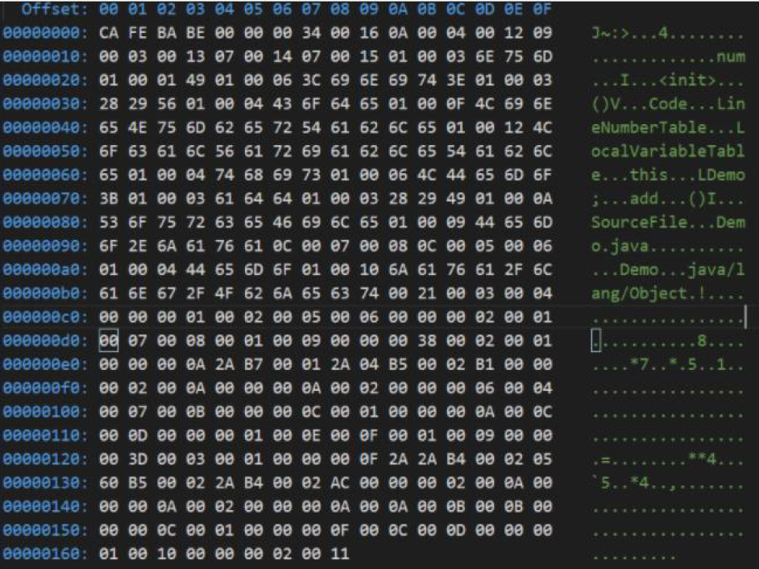
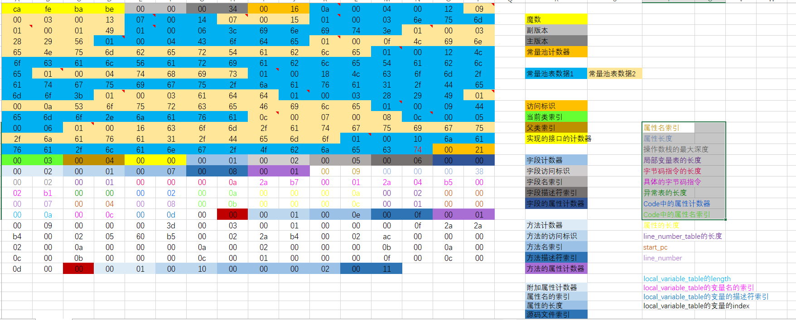
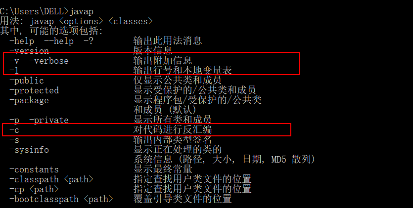

# 第1章 Class文件结构

## 1. 概述

### 1.1 字节码文件的跨平台性

**Java 语言，跨平台的(write once, run anywhere)**

- 当Java 源代码成功编译成字节码后，如果想在不同的平台上面运行，则无须再次编译
- 这个优势不再那么吸引人了。Python、PHP、Perl、Ruby、Lisp 等有强大的解释器
- 跨平台似乎已经快称为一门语言必选的特性

**Java 虚拟机：跨语言的平台**

**Java 虚拟机不和包括Java 在内的任何语言绑定，它只与"Class 文件"这种特定的二进制文件格式所关联。**无论使用何种语言进行软件开发， 只要能将源文件编译为正确的Class 文件，那么这种语言就可以在Java 虚拟机上执行，可以说，统一而强大的Class 文件结构，就是Java 虚拟机的基石、桥梁。


https://docs.oracle.com/javase/specs/index.html

所有的JVM 全部遵守Java 虚拟机规范，也就是说所有的JVM 环境都是一样的， 这样一来字节码文件可以在各种JVM 上进行。

想要让一个Java 程序正确地运行在JVM 中，Java 源码就是必须要被编译为符合JVM规范的字节码

- 前端编译器的主要任务就是负责将符合Java 语法规范的Java 代码转换为符合JVM规范的字节码文件
- javac 是一种能够将Java源码编译为字节码的前端编译器
- javac 编译器在将Java源码编译为一个有效的字节码文件过程中经历了4个步骤，分别是词法分析、语法分析、语义分析以及生成字节码。


Oracle 的JDK 软件包括两部分内容：

- 一部分是将Java 源代码编译成Java 虚拟机的指令集的编译器
- 另一部分是用于实现Java 虚拟机的运行时环境

### 1.2 Java的前端编译器



**前端编译器 VS 后端编译器**

Java 源代码的编译结果是字节码，那么肯定需要有一种编译器能够将 Java源码编译为字节码，承担这个重要责任的就是配置在 path 环境变量中的 javac编译器。javac 是一种能够将 Java 源码编译为字节码的前端编译器。

HotSpot VM 并没有强制要求前端编译器只能使用 javac 来编译字节码，其实只要编译结果符合 JVM 规范都可以被 JVM 所识别即可。在 Java 的前端编译器领域，除了 javac 之外，还有一种被大家经常用到的前端编译器，那就是内置在 Eclipse 中的 ECJ (Eclipse Compiler for Java)编译器。和 javac 的全量式编译不同，ECJ 是一种增量式编译器。

- 在 Eclipse 中，当开发人员编写完代码后，使用"Ctrl + S"快捷键时，ECJ 编译器所采取的编译方案是把未编译部分的源码逐行进行编译，而非每次都全量编译。因此 ECJ 的编译效率会比 javac 更加迅速和高效，当然编译质量和 javac 相比大致还是一样的
- ECJ 不仅是 Eclipse 的默认内置前端编译器，在 Tomcat 中同样也是使用ECJ 编译器来编译 jsp 文件。由于 ECJ 编译器是采用 GPLv2 的开源协议进行源代码公开，所以，大家可以登录 Eclipse 官网下载 ECJ 编译器的源码进行二次开发
- 默认情况下，IntelliJ IDEA 使用 javac 编译器（还可以自己设置为 AspectJ编译器 ajc）

前端编译器并不会直接涉及编译优化等方面的技术，而是将这些具体优化细节移交给 HotSpot 的 JIT 编译器负责

### 1.3 透过字节码看代码细节

例一：

~~~java
public class IntegerTest {
    public static void main(String[] args) {

        Integer x = 5;
        int y = 5;
        System.out.println(x == y);

        Integer i1 = 10;
        Integer i2 = 10;
        System.out.println(i1 == i2);//true

        Integer i3 = 128;
        Integer i4 = 128;
        System.out.println(i3 == i4);//false

    }
}
~~~

对应的的字节码：

~~~java
 0 iconst_5
 1 invokestatic #2 <java/lang/Integer.valueOf>
 4 astore_1
 5 iconst_5
 6 istore_2
 7 getstatic #3 <java/lang/System.out>
10 aload_1
11 invokevirtual #4 <java/lang/Integer.intValue>
14 iload_2
15 if_icmpne 22 (+7)
18 iconst_1
19 goto 23 (+4)
22 iconst_0
23 invokevirtual #5 <java/io/PrintStream.println>
26 bipush 10
28 invokestatic #2 <java/lang/Integer.valueOf>
31 astore_3
32 bipush 10
34 invokestatic #2 <java/lang/Integer.valueOf>
37 astore 4
39 getstatic #3 <java/lang/System.out>
42 aload_3
43 aload 4
45 if_acmpne 52 (+7)
48 iconst_1
49 goto 53 (+4)
52 iconst_0
53 invokevirtual #5 <java/io/PrintStream.println>
56 sipush 128
59 invokestatic #2 <java/lang/Integer.valueOf>
62 astore 5
64 sipush 128
67 invokestatic #2 <java/lang/Integer.valueOf>
70 astore 6
72 getstatic #3 <java/lang/System.out>
75 aload 5
77 aload 6
79 if_acmpne 86 (+7)
82 iconst_1
83 goto 87 (+4)
86 iconst_0
87 invokevirtual #5 <java/io/PrintStream.println>
90 return
~~~

可以看到`Integer x = 5`调用了Integer中的valueOf，打开Integer的源码找到valueOf的方法

~~~java
public static Integer valueOf(String s) throws NumberFormatException {
        return Integer.valueOf(parseInt(s, 10));
    }
~~~

继续点入`Integer.valueOf(int i)`方法

~~~java
public static Integer valueOf(int i) {
        if (i >= IntegerCache.low && i <= IntegerCache.high)
            return IntegerCache.cache[i + (-IntegerCache.low)];
        return new Integer(i);
    }
~~~

可以看到代码和一个类IntegerCache有关，它是Integer的内部类

~~~java
private static class IntegerCache {
        static final int low = -128;
        static final int high;
        static final Integer cache[];

        static {
            // high value may be configured by property
            int h = 127;
            String integerCacheHighPropValue =
                sun.misc.VM.getSavedProperty("java.lang.Integer.IntegerCache.high");
            if (integerCacheHighPropValue != null) {
                try {
                    int i = parseInt(integerCacheHighPropValue);
                    i = Math.max(i, 127);
                    // Maximum array size is Integer.MAX_VALUE
                    h = Math.min(i, Integer.MAX_VALUE - (-low) -1);
                } catch( NumberFormatException nfe) {
                    // If the property cannot be parsed into an int, ignore it.
                }
            }
            high = h;

            cache = new Integer[(high - low) + 1];
            int j = low;
            for(int k = 0; k < cache.length; k++)
                cache[k] = new Integer(j++);

            // range [-128, 127] must be interned (JLS7 5.1.7)
            assert IntegerCache.high >= 127;
        }

        private IntegerCache() {}
    }
~~~

在这个类中有一个Integer类型的数组常量cache，从代码中可以看到cache有256的空间，然后循环放入Integer类型的-128到127，由此可以看到当new一个[-128, 127]的数就会从数组中拿取，不在范围内时在进行new操作。

~~~java
true
true
false

Process finished with exit code 0
~~~

因此第一个自动拆箱数值相比自然是true，第二个都是同一个数组中拿到的也是true，第三个超出数组范围自己new自己的毫无疑问为false


例二：

~~~java
public class StringTest {
    public static void main(String[] args) {
        String str = new String("hello") + new String("world");
        String str1 = "helloworld";
        System.out.println(str == str1); //false
        String str2 = new String("helloworld");
        System.out.println(str == str2); //false
    }
}
~~~

这个例子在上篇中StringTable中已经讲得很清楚了。附上字节码

~~~java
 0 new #2 <java/lang/StringBuilder>
 3 dup
 4 invokespecial #3 <java/lang/StringBuilder.<init>>
 7 new #4 <java/lang/String>
10 dup
11 ldc #5 <hello>
13 invokespecial #6 <java/lang/String.<init>>
16 invokevirtual #7 <java/lang/StringBuilder.append>
19 new #4 <java/lang/String>
22 dup
23 ldc #8 <world>
25 invokespecial #6 <java/lang/String.<init>>
28 invokevirtual #7 <java/lang/StringBuilder.append>
31 invokevirtual #9 <java/lang/StringBuilder.toString>
34 astore_1
35 ldc #10 <helloworld>
37 astore_2
38 getstatic #11 <java/lang/System.out>
41 aload_1
42 aload_2
43 if_acmpne 50 (+7)
46 iconst_1
47 goto 51 (+4)
50 iconst_0
51 invokevirtual #12 <java/io/PrintStream.println>
54 new #4 <java/lang/String>
57 dup
58 ldc #10 <helloworld>
60 invokespecial #6 <java/lang/String.<init>>
63 astore_3
64 getstatic #11 <java/lang/System.out>
67 aload_1
68 aload_3
69 if_acmpne 76 (+7)
72 iconst_1
73 goto 77 (+4)
76 iconst_0
77 invokevirtual #12 <java/io/PrintStream.println>
80 return
~~~


例三：

~~~java
class Father {
    int x = 10;

    public Father() {
        this.print();
        x = 20;
    }
    public void print() {
        System.out.println("Father.x = " + x);
    }
}

class Son extends Father {
    int x = 30;
//    float x = 30.1F;
    public Son() {
        this.print();
        x = 40;
    }
    public void print() {
        System.out.println("Son.x = " + x);
    }
}

public class SonTest {
    public static void main(String[] args) {
        Father f = new Son();
        System.out.println(f.x);
    }
}

结果：
    Son.x = 0
	Son.x = 30
	20
~~~

father类：

~~~java
当改为：
    Father f = new Father();

 0 new #2 <com/atguigu/java/Father>
 3 dup
 4 invokespecial #3 <com/atguigu/java/Father.<init>>
 7 astore_1
 8 getstatic #4 <java/lang/System.out>
11 aload_1
12 getfield #5 <com/atguigu/java/Father.x>
15 invokevirtual #6 <java/io/PrintStream.println>
18 return
     
结果：
    Father.x = 10
	20
~~~

只有一个father类的时候很好理解：成员变量（非静态的）的赋值过程：① 默认初始化-② 显式初始化/代码块中初始化-③构造器中初始化-④有了对象之后，可以“对象.属性”或"对象.方法"的方式对成员变量进行赋值。

**数据类型和默认初始值对应**

| 类型      | 默认初始值 |
| --------- | ---------- |
| byte      | (byte)0    |
| short     | (short)0   |
| int       | 0          |
| long      | 0L         |
| float     | 0.0f       |
| double    | 0.0        |
| char      | \u0000     |
| boolean   | false      |
| reference | null       |

son类：

~~~java
 0 new #2 <com/atguigu/java/Son>
 3 dup
 4 invokespecial #3 <com/atguigu/java/Son.<init>>
 7 astore_1
 8 getstatic #4 <java/lang/System.out>
11 aload_1
12 getfield #5 <com/atguigu/java/Father.x>
15 invokevirtual #6 <java/io/PrintStream.println>
18 return
~~~

new一个son的实例要先加载他的父类father，调用father的构造方法时调用了已经被son类覆盖的print方法，子类的x还没显式初始化，自然为零，接着子类son调用构造方法，输出x为30，最后的语句f.x中f是father的变量，所以调用father的x

## 2.  虚拟机的基石：Class 文件

**字节码文件里是什么？**

源代码经过编译器编译之后便会生成一个字节码文件，字节码是一种二进制的类文件，它的内容是 JVM 的指令，而不像 C、C++ 经由编译器直接生成机器码

**什么是字节码指令(byte code)？**

Java 虚拟机的指令由一个字节长度的、代表着某种特定操作含义的**操作码(opcode)以及跟随其后的零至多个代表此操作所需参数的操作数(operand)**所构成。虚拟机中许多指令并不包含操作数，只有一个操作码

比如：



**如何解读供虚拟机解释执行的二进制字节码？**

方式一：一个一个二进制的看，这里用到的是 Notepad++，需要安装一个HEX-Editor 插件，或者使用 Binary Viewer



方式二：使用 javap 指令，JDK 自带的反解析工具

方式三：使用 IDEA 插件，jclasslib 或 jclasslib bytecode viewer 客户端工具

## 3. Class 文件结构

官方文档位置

https://docs.oracle.com/javase/specs/jvms/se8/html/jvms-4.html

**Class 类的本质**

任何一个 Class 文件都对应着唯一一个类或接口的定义信息，但反过来说，Class 文件实际上它并不一定以磁盘文件形式存在。Class 文件是一组以 8 位字节为基础单位的**二进制流**

**Class 文件格式**

Class 的结构不像 XML 等描述语言，由于它没有任何分隔符号。所以在其中的数据项，无论是字节顺序还是数量，都是被严格限定的，哪个字节代表什么含义，长度是多少，先后顺序如何，都不允许改变

Class 文件格式采用一种类似于 C 语言结构体的方式进行数据存储，这种结构中只有两种数据类型：**无符号数和表**

1. 无符号数属于基本的数据类型，以 u1、u2、u4、u8 来分别代表1 个字节、 2 个字节、4 个字节、8 个字节的无符号数，无符号数可以用来描述数字、索引引用、数量值或者按照 UTF-8 编码构成字符串值
2. 表是由多个无符号数或者其他表作为数据项构成的复合数据类型，所有表都习惯性地以"_info"结尾。表用于描述有层次关系的复合结构的数据，整个Class 文件本质上就是一张表。由于表没有固定长度，所以通常会在其前面加上个数说明

~~~java
public class Demo {
    private int num = 1;

    public int add(){
        num = num + 2;
        return num;

    }
}
~~~



换句话说，充分理解了每一个字节码文件的细节，自己也可以反编译出 Java 源文件来

**Class 文件结构概述**

Class 文件的结构并不是一成不变的，随着 Java 虚拟机的不断发展，总是不可避免地会对 Class 文件结构做出一些调整，但是其基本结构和框架是非常稳定的

Class 文件的总体结构如下：

1. 魔数
2. Class 文件版本
3. 常量池
4. 访问标志
5. 类索引、父类索引、接口索引集合
6. 字段表集合
7. 方法表集合
8. 属性表集合

| 类型           | 名称                | 说明                   | 长度    | 数量                  |
| -------------- | ------------------- | ---------------------- | ------- | --------------------- |
| u4             | magic               | 魔数,识别Class文件格式 | 4个字节 | 1                     |
| u2             | minor_version       | 副版本号(小版本)       | 2个字节 | 1                     |
| u2             | major_version       | 主版本号(大版本)       | 2个字节 | 1                     |
| u2             | constant_pool_count | 常量池计数器           | 2个字节 | 1                     |
| cp_info        | constant_pool       | 常量池表               | n个字节 | constant_pool_count-1 |
| u2             | access_flags        | 访问标识               | 2个字节 | 1                     |
| u2             | this_class          | 类索引                 | 2个字节 | 1                     |
| u2             | super_class         | 父类索引               | 2个字节 | 1                     |
| u2             | interfaces_count    | 接口计数器             | 2个字节 | 1                     |
| u2             | interfaces          | 接口索引集合           | 2个字节 | interfaces_count      |
| u2             | fields_count        | 字段计数器             | 2个字节 | 1                     |
| field_info     | fields              | 字段表                 | n个字节 | fields_count          |
| u2             | methods_count       | 方法计数器             | 2个字节 | 1                     |
| method_info    | methods             | 方法表                 | n个字节 | methods_count         |
| u2             | attributes_count    | 属性计数器             | 2个字节 | 1                     |
| attribute_info | attributes          | 属性表                 | n个字节 | attributes_count      |

对应文档

~~~
ClassFile {
    u4             magic;
    u2             minor_version;
    u2             major_version;
    u2             constant_pool_count;
    cp_info        constant_pool[constant_pool_count-1];
    u2             access_flags;
    u2             this_class;
    u2             super_class;
    u2             interfaces_count;
    u2             interfaces[interfaces_count];
    u2             fields_count;
    field_info     fields[fields_count];
    u2             methods_count;
    method_info    methods[methods_count];
    u2             attributes_count;
    attribute_info attributes[attributes_count];
}
~~~

**对应字节码文件，根据下面的知识，对例子一一解析**



### 3.1 魔数：Class 文件的标志

> **Magic Number(魔数)**

- 每个 Class 文件开头的4 个字节的无符号整数称为魔数(Magic Number)

- 它的唯一作用是确定这个文件是否为一个能被虚拟机接受的有效合法的Class 文件。即：魔数是 Class 文件的标识符

- 魔数值固定为 0xCAFEBABE。不会改变

- 如果一个 Class 文件不以 0xCAFEBABE 开头，虚拟机在进行文件校验的时候就会直接抛出以下错误：

  ~~~java
  Error: A JNI error has occurred, please check your installation and try again
  Exception in thread "main" java.lang.ClassFormatError: Incompatible magic value 1885430635 in class file StringTest
  ~~~

### 3.2 Class 文件版本号

- 紧接着魔数的4 个字节存储的是 Class 文件的版本号。同样也是4 个字节。第5 个和第6 个字节所代表的含义就是编译的副版本号 minor_version，而第7 个和第8 个字节就是编译的主版本号 major_version

- 它们共同构成了 Class 文件的格式版本号。譬如某个 Class 文件的主版本号为 M，服版本号为 m，那么这个 Class 文件的格式版本号就确定为 M.m

- 版本号和 Java 编译器的对应关系如下表：

  | 主版本（十进制） | 副版本（十进制） | 编译器版本 |
  | ---------------- | ---------------- | ---------- |
  | 45               | 3                | 1.1        |
  | 46               | 0                | 1.2        |
  | 47               | 0                | 1.3        |
  | 48               | 0                | 1.4        |
  | 49               | 0                | 1.5        |
  | 50               | 0                | 1.6        |
  | 51               | 0                | 1.7        |
  | 52               | 0                | 1.8        |
  | 53               | 0                | 1.9        |
  | 54               | 0                | 1.10       |
  | 55               | 0                | 1.11       |

- Java 的版本号是从 45 开始的，JDK 1.1 之后的每个 JDK 大版本发布主版本号向上加1
- 不同版本的 Java 编译器编译的 Class 文件对应的版本是不一样的。目前，高版本的 Java 虚拟机可以执行由低版本编译器生成的 Class 文件，但是低版本的 Java 虚拟机不能执行由高版本编译器生成的 Class 文件。否则JVM 会抛出 `java.lang.UnsupportedClassVersionError` 异常(**向下兼容**)
- 在实际应用中，由于开发环境和生产环境的不同，可能会导致该问题的发生。因此，需要我们在开发时，特别注意开发编译的 JDK 版本和生产环境的JDK 版本是否一致
  - 虚拟机 JDK 版本为 1.k (k >= 2)时，对应的 Class 文件格式版本号的范围为 45.0 - 44 + k.0(含两端)

### 3.3 常量池：存放所有常量

- 常量池是 Class 文件中内容最为丰富的区域之一。常量池对于 Class 文件中的字段和方法解析也有着至关重要的作用
- 随着 Java 虚拟机的不断发展，常量池的内容也日渐丰富，可以说，常量池是整个 Class 文件的基石
- 在版本号之后，紧跟着的是常量池的数量，以及若干个常量池表项
- 常量池中常量的数量是不固定的，所以在常量池的入口需要放置一项 u2 类型的无符号数，代表常量池容量计数值(constant_pool_count)，与 Java 中语言习惯不一样的是，这个容量计数是从1 而不是0 开始的

| 数据类型   | 名称                | 数量    | 定义                                                         | 说明                                                         |
| :--------- | ------------------- | ------- | ------------------------------------------------------------ | ------------------------------------------------------------ |
| u2无符号数 | constant_pool_count | 1       | 无符号数可以用来描述数字、索引引用、数量值或按照utf-8编码构成的字符串值。 | 其中无符号数属于基本的数据类型。 以u1、u2、u4、u8来分别代表1个字节、2个字节、4个字节和8个字节 |
| cp_info表  | constant_pool       | count-1 | 表是由多个无符号数或其他表构成的复合数据结构。               | 所有的表都以“_info”结尾。 由于表没有固定长度，所以通常会在其前面加上个数说明。 |

由上表可见，Class 文件使用了一个前置的容量计数器(constant_pool_count)加若干个连续的数据项(constant_pool)的形式来描述常量池内容，我们把这一系列连续常量池数据称为常量池集合

常量池表项中，用于存放编译时期生成的各种字面量和符号引用，这部分内容将在类加载后进入方法区的运行时常量池中存放

------

> **常量池计数器**

- 由于常量池的数量不固定，时长时短，所以需要放置两个字节来表示常量池容量计数值
- 常量池容量计数值(u2 类型)：从 1 开始，表示常量池中有多少项常量。即constant_pool_count = 1 表示常量池中有0 个常量项

**需要注意的是，这实际上只有21 项常量。索引为范围是1-21。为什么呢？**

通常我们写代码时都是从0 开始的，但是这里的常量池却是从1 开始，因为它把第0 项常量空出来了。这是为了满足后面某些指向常量池的索引值的数据在特定情况下需要表达"不引用任何一个常量池项目"的含义，这种情况可用索引值0 来表示

------

> **常量池表**

- constant_pool 是一种表结构，以 1 ~ constant_pool_count - 1 为索引。表明了后面有多少个常量项
- 常量池主要存放两大类常量：**字面量**(Literal) 和**符号引用**(Symbolic References)
- 它包含了 Class 文件结构及其子结构中**引用的所有字符串常量**、**类或接口名**、**字段名**和**其他常量**。常量池中的每一项都具备相同的特征。第1个字节作为类型标记，用于确定该项的格式，这个字节称为 tag byte(标记字节、标签字节)

**常量类型和结构**

| 类型                             | 标志(或标识) | 描述                   |
| -------------------------------- | ------------ | ---------------------- |
| CONSTANT_utf8_info               | 1            | UTF-8编码的字符串      |
| CONSTANT_Integer_info            | 3            | 整型字面量             |
| CONSTANT_Float_info              | 4            | 浮点型字面量           |
| CONSTANT_Long_info               | 5            | 长整型字面量           |
| CONSTANT_Double_info             | 6            | 双精度浮点型字面量     |
| CONSTANT_Class_info              | 7            | 类或接口的符号引用     |
| CONSTANT_String_info             | 8            | 字符串类型字面量       |
| CONSTANT_Fieldref_info           | 9            | 字段的符号引用         |
| CONSTANT_Methodref_info          | 10           | 类中方法的符号引用     |
| CONSTANT_InterfaceMethodref_info | 11           | 接口中方法的符号引用   |
| CONSTANT_NameAndType_info        | 12           | 字段或方法的符号引用   |
| CONSTANT_MethodHandle_info       | 15           | 表示方法句柄           |
| CONSTANT_MethodType_info         | 16           | 标志方法类型           |
| CONSTANT_InvokeDynamic_info      | 18           | 表示一个动态方法调用点 |

------

> **字面量和符号引用**

常量池主要存放两大类常量：字面量(Literal) 和符号引用(Symbolic References)。如下表：

| 常量     | 具体的常量          |
| -------- | ------------------- |
| 字面量   | 文本字符串          |
|          | 声明为final的常量值 |
| 符号引用 | 类和接口的全限定名  |
|          | 字段的名称和描述符  |
|          | 方法的名称和描述符  |

**全限定名**

com/atguigu/test/Demo 这个就是类的全限定名，仅仅是把包的"."替换成"/"，为了使连续的多个全限定名之间不产生混淆，在使用时最后一般会加入一个";" 表示全限定名结束

**简单名称**

简单名称是指没有类型和参数修饰的方法或者字段名称，上面例子中的类的add() 方法和 num 字段的简单名称分别是 add 和 num

**描述符**

**描述符的作用是用来描述字段的数据类型、方法的参数列表(包括数量、类型以及顺序)和返回值。**根据描述符规则，基本数据类型(byte、char、double、 float、int、long、short、boolean)以及代表无返回值的 void 类型都用一个大写字符来表示，而对象类型则用字符 L 加对象的全限定名表示，详见下表：

| 标志符 | 含义                                                 |
| ------ | ---------------------------------------------------- |
| B      | 基本数据类型byte                                     |
| C      | 基本数据类型char                                     |
| D      | 基本数据类型double                                   |
| F      | 基本数据类型float                                    |
| I      | 基本数据类型int                                      |
| J      | 基本数据类型long                                     |
| S      | 基本数据类型short                                    |
| Z      | 基本数据类型boolean                                  |
| V      | 代表void类型                                         |
| L      | 对象类型，比如：`Ljava/lang/Object;`                 |
| [      | 数组类型，代表一维数组。比如：`double[][][] is [[[D` |

用描述符来藐视方法时，按照先参数列表，后返回值的顺序描述，参数列表按照参数的严格顺序放在一组小括号"()"之内，如方法 java.lang.String toString()的描述符为 () Ljava/lang/String;，方法 int abc(int[] x ,int y)描述符为([II) I

虚拟机在加载 Class 文件时才会进行动态链接，也就是说，Class 文件中不会保存各个方法和字段的最终内存布局信息，因此，这些字段和方法的符号引用不经过转换是无法直接被虚拟机使用的。当虚拟机运行时，需要从常量池中获得对应的符号引用，再在类加载过程中的解析阶段将其替换为直接引用，并翻译到具体的内存地址中。
这里说明下符号引用和直接引用的区别与关联：

- 符号引用：符号引用以一组符号来描述所引用的目标，符号可以是任何形式的字面量，只要使用时能无歧义地定位到目标即可。符号引用与虚拟机实现的内存布局无关，引用的目标并不一定已经加载到内存中
- 直接引用：直接引用可以是直接指**向目标的指针、相对偏移量或是一个能间接定位到目标的句柄。直接引用是与虚拟机实现的内存布局相关的，**同一个符号引用在不同虚拟机实例上翻译出来的直接引用一般不会相同。如果有了直接引用，那说明引用的目标必定已经存在于内存之中了。

------

> **常量类型和结构**

常量池中每一项常量都是一个表，JDK 1.7 之后共14 种不同的表结构数据。如下表格所示：


- 根据上图每个类型的描述我们也可以知道每个类型是用来描述常量池中那些内容(主要是字面量、符号引用)的。比如： CONSTANT_Integer_info 是用来描述常量池中字面量信息的，而且只是整型字面量信息

- 标志为15、16、18 的常量项类型是用来支持动态语言调用的( JDK 1.7 时才加入)

- 细节说明：

  1. `CONSTANT_Class_info` 结构用于表示类或接口

  2. `CONSTANT_Fieldref_info` 、 `CONSTANT_Methodref_info`和`CONSTANT_InterfaceMethodref_info` 结构表示字段、方法和接口方法

  3. `CONSTANT_String_info` 结构用于表示 String 类型的常量对象

  4. `CONSTANT_Integer_info` 和 `CONSTANT_Float_info` 表示 4 字节(int 和float)的数值常量

  5. `CONSTANT_Long_info` 和 `CONSTANT_Double_info` 结构表示 8 字节(long 和 double)的数值常量

     在 Class 文件的常量池中，所有的 8 字节常量均占两个表成员(项)的 空 间 ， 如 果 一 个 `CONSTANT_Long_info` 或`CONSTANT_Double_info` 结构的项在常量池表中的索引位 n，则常量池表中下一个可用项的索引位 n + 2，此时常量池表中索引为 n + 1的项仍然有效但必须视为不可用的

  6. `CONSTANT_NameAndType_info` 结构用于表示字段或方法，但是和之前的3 个结构不同，`CONSTANT_NameAndType_info` 结构没有知名该字段或方法所属的类或接口

  7. `CONSTANT_Utf8_info` 用于表示字符常量的值

  8. `CONSTANT_MethodHandle_info` 结构用于表示方法句柄

  9. `CONSTANT_MethodType_info` 结构表示方法类型

  10. `CONSTANT_InvokeDynamic_info` 结构用于表示 invokedynamic 指令所用到的引导方法(bootstrap method)、引导方法所用到的动态调用名称(dynamic invocation name)、参数和返回类型，并可以给引导方法传入一系列称为静态参数(static argument)的常量

**总结：**

- 这14 种表(或者常量项结构)的共同点是：表开始的第一位是一个 u1 类型的标志位(tag)，代表当前这个常量项使用的是哪种表结构，即哪种常量类型
- 在常量池列表中，CONSTANT_Utf8_info 常量项是一种使用改进过的UTF-8 编码格式来存储诸如文字字符串、类或者接口的全限定名、字段或者方法的简单名称以及描述符等常量字符串信息
- 这14 种常量项结构还有一个特点是，其中13 个常量项占用的字节固定，只有 CONSTANT_Utf8_info 占用字节不固定，其大小由 length 决定。为什么？**因为从常量池存放的内容可知，其存放的是字面量和符号引用，最终这些内容都会是一个字符串，这些字符串的大小是在编写程序时才确定，**比如你定义一个类，类名可以取长去短，所以在没编译前，大小不固定，编译后，通过 UTF-8 编码，就可以知道其长度
- 常量池：可以理解为 Class 文件之中的资源仓库，它是 Class 文件结构中与其他项目关联最多的数据类型(后面的很多数据类型都会指向此处)，也是占用 Class 文件空间最大的数据项目之一

**常量池中为什么包含这些内容**

Java 代码在进行 javac 编译的时候，并不像 C 和 C++ 那样有"连接"这一步骤，而是在虚拟机加载 Class 文件的时候进行动态链接。也就是说，**在 Class文件中不会保存各个方法、字段的最终内存布局信息，因此这些字段、方法的符号引用不经过运行期转换的话无法得到真正的内存入口地址，也就无法直接被虚
拟机使用。**当虚拟机运行时，需要从常量池获得对应的符号引用，再在类创建时或运行时解析、翻译到具体的内存地址之中。

### 3.4 访问标识

在常量池后，紧跟着访问标记。该标记使用两个字节表示，用于识别一些类或者接口层次的访问信息，包括：这个 Class 是类还是接口；是否定义为public 类型；是否定义为 abstract 类型；如果是类的话，是否被声明为 final等。各种访问标记如下所示：

**访问标志**

| 标志名称       | 标志值 | 含义                                                         |
| -------------- | ------ | ------------------------------------------------------------ |
| ACC_PUBLIC     | 0x0001 | 标志为public类型                                             |
| ACC_FINAL      | 0x0010 | 标志被声明为final，只有类可以设置                            |
| ACC_SUPER      | 0x0020 | 标志允许使用invokespecial字节码指令的新语义，JDK1.0.2之后编译出来的类的这个标志默认为真。（使用增强的方法调用父类方法） |
| ACC_INTERFACE  | 0x0200 | 标志这是一个接口                                             |
| ACC_ABSTRACT   | 0x0400 | 是否为abstract类型，对于接口或者抽象类来说，次标志值为真，其他类型为假 |
| ACC_SYNTHETIC  | 0x1000 | 标志此类并非由用户代码产生（即：由编译器产生的类，没有源码对应） |
| ACC_ANNOTATION | 0x2000 | 标志这是一个注解                                             |
| ACC_ENUM       | 0x4000 | 标志这是一个枚举                                             |

- 类的访问权限通常为 ACC_ 开头的常量
- 每一个种类型的表示都是通过设置访问标记的 32 位中的特定位来实现的。比如，若是 public final 的类，则该标记为 ACC_PUBLIC | ACC_FINAL
- 使用 ACC_SUPER 可以让类更准确地定位到父类的方法 super.method()，现代编译器都会设置并且使用这个标记

**补存说明**

1. 带有 ACC_INTERFACE 标志的 Class 文件表示的是接口而不是类，反之则表示的是类而不是接口
   1. 如果一个 Class 文件被设置了 ACC_INTERFACE 标志，那么同时也得设置 ACC_ABSTRACT 标志。同时它不能再设置 ACC_FINAL、 ACC_SUPER 或 ACC_ENUM 标志
   2. 如果没有设置 ACC_INTERFACE 标志，那么这个 Class 问价可以具有上表中除 ACC_ANNOTATION 外的其他所有标志。当然，ACC_FINAL和 ACC_ABSTRACT 这类互斥的标志除外。这两个标志不能同时设置
2. ACC_SUPER 标志用于确定类或接口里面的 invokespecial 指令使用的是哪一种执行语义。**针对 Java 虚拟机指令集的编译器都应当设置这个标志。 **对于 Java SE 8 及后续版本来说，无论 Class 文件中这个标志的实际值是什么，也不管 Class 文件的版本
3. ACC_SYNTHETIC 标志意味着该类或接口是由编译器生成的，而不是由源代码生成的
4. 注 解 类 型 必 须 设 置 ACC_ANNOTATION 标 志 。 如 果 设 置 了ACC_ANNOTATION 标志，那么也必须设置 ACC_INTERFACE 标志
   ACC_ENUM 标志标明该类或其父类为枚举类型
5. 表中没有使用的 access_flags 标志是为未来扩充而预留的，这些预留的标志在编译器中应该设置为0，Java 虚拟机实现也应该忽略他们

### 3.5 类索引、父类索引、接口索引集合

在访问标记后，会指定该类的类别、父类类别以及实现的接口，格式如下：

| 长度 | 含义                         |
| ---- | ---------------------------- |
| u2   | this_class                   |
| u2   | super_class                  |
| u2   | interfaces_count             |
| u2   | interfaces[interfaces_count] |

**这三项数据来确定这个类的继承关系**

- 类索引用于确定这个类的全限定名
- 父类索引用于确定这个类的父类的全限定名。由于 Java 语言不允许多重继承，所以父类索引只有一个，除了 java.lang.Object 之外，所有的Java 类都有父类，因此除了 java.lang.Object 外，所有 Java 类的父类索引都不为0
- 接口索引集合就用来描述这个类实现了哪些接口，这些被实现的接口将按 implements 语句(如果这个类本身是一个接口，则应当是 extends 语句)后的接口顺序从左到右排列在接口索引集合中

------

> **this_class(类索引)**

2 字节无符号整数，指向常量池的索引。它提供了类的全限定名，如com/atguigu/java1/Demo。this_class 的值必须是对常量池表中某项的一个有效索引值。常量池在这个索引处的成员必须为 CONSTANT_Class_info 类型结构体，该结构体表示这个 Class 文件所定义的类或接口

> **super_class(父类索引)**

2 字节无符号整数，指向常量池的索引。它提供了当前类的父类的全限定名。如果我们没有继承任何类，其默认继承的是 java/lang/Object 类。同时，由于 Java 不支持多继承，所以其父类只有一个

superclass 指向的父类不能是 final

> **interfaces**

指向常量池索引集合，它提供了一个符号引用到所有已实现的接口

由于一个类可以实现多个接口，因此需要以数组形式保存多个接口的索引，表示接口的每个索引也是一个指向常量池的 CONSTANT_Class(当然这里就必须是接口，而不是类)

**interfaces_count(接口计数器)**

interfaces_count 项的值表示当前类或接口的直接超接口数量

**interface[] (接口索引集合)**

interfaces[] 中每个成员的值必须是对常量池表中某项的有效索引值，它的长度为 interfaces_count。每个成员 interfaces[i] 必须为 CONSTANT_Class_info 结构，其中 0 <= i < interfaces_count。在 interfaces[] 中，各成员所表示的接口顺序和对应的源代码中给定的接口顺序(从左至右)一样，即 interfaces[0] 对应的是源代码中最左边的接口

### 3.6 字段表集合

- 用于描述接口或类中声明的变量。字段(field)包括类级变量以及实例级变量，但是不包括方法内部、代码块内部声明的局部变量
- 字段叫什么名字、字段被定义为什么数据类型，这些都是无法固定的，只能引用常量池中的常量来描述
- 它指向常量池索引集合，它描述了每个字段的完整信息。比如**字段的标识符、访问修饰符(public、private 或 protected)、是类变量还是实例变量(static修饰符)、是否是常量(final 修饰符)**等。

**注意事项：**

字段表集合中不会列出从父类或者实现的接口中继承而来的字段，但有可能列出原 Java 代码中不存在的字段，譬如在内部类中为了保持对外部类的方文星，会自动添加指向外部类实例的字段

在 Java 语言中字段是无法重载的，两个字段的数据类型、修饰符不管是否相同，都必须使用不一样的名称，但是对于字节码来讲，如果两个字段的描述符不一致，那字段重名就是合法的

**（1）字段计数器**

fields_count 的值表示当前 Class 文件 fields 表的成员个数。使用两个字节来表示

fields 表中每个成员都是一个 field_info 结构，用于表示该类或接口所声明的所有类字段或者实例字段，不包括方法内部声明的变量，也不包括从父类或父接口继承的那些字段

**（2）字段表**

fields 表中的每个成员都必须是一个 fields_info 结构的数据项，用于表示当前类或接口中某个字段的完整描述
一个字段的信息包括如下这些信息，这些信息中，各个修饰符都是布尔值，要么有，要么没有

- 作用域(public、private、protected 修饰符)
- 是实例变量还是类变量(static 修饰符)
- 可变性(final)
- 并发可见性(volatile 修饰符，是否强制从主内存读写)
- 可否序列化(transient 修饰符)
- 字段数据类型(基本数据类型、对象、数组)
- 字段名称

**字段表结构：**

|      类型      |             名称             |    含义    |       数量       |
| :------------: | :--------------------------: | :--------: | :--------------: |
|       u2       |         access_flags         |  访问标志  |        1         |
|       u2       |          name_index          | 字段名索引 |        1         |
|       u2       |       descriptor_index       | 描述符索引 |        1         |
|       u2       |       attributes_count       | 属性计数器 |        1         |
| attribute_info | attributes[attributes_count] |  属性集合  | attributes_count |

**字段表访问标识**

我们知道，一个字段可以被各种关键字去修饰，比如：作用域修饰符(public、 private、protected)、static 修饰符、final 修饰符、volatile 修饰符等等。因此，其可像类的访问标志那样，使用一些标志来标记字段。字段的访问标志有如下这些：

| 标志名称      | 标志值 | 含义                       |
| ------------- | ------ | -------------------------- |
| ACC_PUBLIC    | 0x0001 | 字段是否为public           |
| ACC_PRIVATE   | 0x0002 | 字段是否为private          |
| ACC_PROTECTED | 0x0004 | 字段是否为protected        |
| ACC_STATIC    | 0x0008 | 字段是否为static           |
| ACC_FINAL     | 0x0010 | 字段是否为final            |
| ACC_VOLATILE  | 0x0040 | 字段是否为volatile         |
| ACC_TRANSTENT | 0x0080 | 字段是否为transient        |
| ACC_SYNCHETIC | 0x1000 | 字段是否为由编译器自动产生 |
| ACC_ENUM      | 0x4000 | 字段是否为enum             |

**字段名索引**

根据字段名索引的值，查询常量池中的指定索引项即可

**描述符索引**

描述符的作用是用来描述字段的数据类型、方法的参数列表(包括数量、类型以及顺序)和返回值。根据描述符规则，基本数据类型(byte、char、double、float、 int、long、short、boolean)及代表无返回值的 void 类型都用一个大写字符来表示，而对象则用字符L 加对象的全限定名来表示。

**属性表集合**

一个字段还可能拥有一些属性，用于存储更多的额外信息。比如初始化值、一些注释信息等。属性个数存放在 attribute_count 中，属性具体内容存放在attributes 数组中

以常量属性为例，结构为：

~~~
ConstantValue_attribute {
    u2 attribute_name_index;
    u4 attribute_length;
    u2 constantvalue_index;
}
~~~

说明：对于常量属性而言，attribute_length 值恒为2

### 3.7 方法表集合

methods: 指向常量池索引集合，它完整描述了每个方法的签名

在字节码文件中，每一个 method_info 项都对应着一个类或者接口中的方法信息。比如方法的访问修饰符(public、private 或 protected)，方法的返回值类型以及方法的参数信息等

如果这个方法不是抽象的或者不是 native 的，那么字节码中会体现出来

一方面，methods 表只描述当前类或接口中声明的方法，不包括从父类或父接口继承的方法。另一方面，methods 表有可能会出现由编译器自动添加的方法，最典型的便是编译器产生的方法信息(比如：类(接口)初始化方法 () 和实例初始化方法 ()

**使用注意事项：**

在 Java 语言中，要重载(Overload)一个方法，除了要与原方法具有相同的简单名称之外，还要求必须拥有一个与原方法不同的特征签名，特征签名就是一个方法中各个参数在常量池中的字段符号引用的集合，也就是因为返回值不会包含在特征签名之中，因此 **Java 语言里无法仅仅依靠返回值的不同来对一个已有方法进行重载**。**但在 Class 文件格式中，特征签名的范围更大一些，只要描述符不是完全一致的两个方法就可以共存**。也就是说，**如果两个方法有相同的名称和特征签名，但返回值不同，那么也是可以合法共存于同一个 Class 文件中**。

也就是说，尽管 Java 语法规范并不允许在一个类或者接口中声明多个方法签名相同的方法，但是和 Java 语法规范相反，字节码文件中却恰恰允许存放多个方法签名相同的方法，唯一的条件就是这些方法之间的返回值不能相同。

**(1) 方法计数器**

methods_count 的值表示当前 Class 文件 methods 表的成员个数，使用两个字节来表示

methods 表中每个成员都是一个 method_info 结构

**(2) 方法表**

methods 表中的每个成员都必须是一个 method_info 结构，用于表示当前类或接口中某个方法的完整描述。如果某个 method_info 结构的 access_flags项既没有设置 ACC_NATIVE 标志也没有设置 ACC_ABSTRACT 标志，那么该结构中也应包含实现这个方法所有的 Java 虚拟机指令

method_info 结构可以表示类和接口中定义的所有方法，包括实例方法、类方法、实例初始化方法和类或接口初始化方法

方法表的结构实际跟字段表是一样的，方法表结构如下：

|      类型      |             名称             |    含义    |       数量       |
| :------------: | :--------------------------: | :--------: | :--------------: |
|       u2       |         access_flags         |  访问标志  |        1         |
|       u2       |          name_index          | 方法名索引 |        1         |
|       u2       |       descriptor_index       | 描述符索引 |        1         |
|       u2       |       attributes_count       | 属性计数器 |        1         |
| attribute_info | attributes[attributes_count] |  属性集合  | attributes_count |

**方法表访问标志**

跟字段表一样，方法表也有访问标志，而且他们的标志有部分相同，部分则不同，方法表的具体访问标志如下：

| 标志名称      | 标志值 | 含义                |
| ------------- | ------ | ------------------- |
| ACC_PUBLIC    | 0x0001 | 方法是否为public    |
| ACC_PRIVATE   | 0x0002 | 方法是否为private   |
| ACC_PROTECTED | 0x0004 | 方法是否为protected |
| ACC_STATIC    | 0x0008 | 方法是否为static    |

**属性表集合**

方法表集合之后的属性表集合，指的是 Class 文件所携带的辅助信息，比如该 Class 文件的源文件的名称。以及任何带有 RetentionPolicy.CLASS 或者RetentionPolicy.RUNTIME 的注解。这类信息通常被用于 Java 虚拟机的验证和运行，以及 Java 程序的调试，一般无需深入了解

此外，字段表、方法表都可以有自己的属性表。用于描述某些场景专有的信息属性表集合的限制没有那么严格，不再要求各个属性表具有严格的顺序，并且只要不与已有的属性名重复，任何人实现的编译器都可以向属性表中写入自己定义的属性信息，但 Java 虚拟机运行时会忽略掉它不认识的属性

1. **属性计数器**
   attributes_count 的值表示当前 Class 文件属性表的成员个数。属性表中每一项都是一个 attribute_info 结构

2. **属性表**
属性表的每个项的值必须是 attribute_info 结构。属性表的结构比较灵活，各种不同的属性只要满足以下结构即可属性的通用格式

| 类型 | 名称                 | 数量             | 含义       |
| ---- | -------------------- | ---------------- | ---------- |
| u2   | attribute_name_index | 1                | 属性名索引 |
| u4   | attribute_length     | 1                | 属性长度   |
| u1   | info                 | attribute_length | 属性表     |

即只需说明属性的名称以及占用位数的长度即可，属性表具体的结构可以去自定义

**属性类型**

属性表实际上可以有很多类型，上面看到的 Code 属性只是其中一种，Java 8 里面定义了23 种属性

下面这些是虚拟机中预定义的属性：

| 属性名称                               | 使用方法         | 含义                                                         |
| -------------------------------------- | ---------------- | ------------------------------------------------------------ |
| `ConstantValue`                        | 字段表           | final关键字定义的常量池                                      |
| `Code`                                 | 方法表           | java代码编译成的字节码指令                                   |
| `StackMapTable`                        | Code属性         | JDK1.6中新增的属性，供新的类型检查检验器检查和处理目标方法的局部变量和操作数有所需要的类是否匹配 |
| `Exceptions`                           | 方法表           | 方法抛出的异常                                               |
| `InnerClasses`                         | 类文件           | 内部类列表                                                   |
| `EnclosingMethod`                      | 类文件           | 仅当一个类为局部类或者匿名类是才能拥有这个属性，这个属性用于标识这个类所在的外围方法 |
| `Synthetic`                            | 类，方法，字段表 | 标志方法或字段为编译器自动生产的                             |
| `Signature`                            | 类，方法，字段表 | 用于支持泛型情况下的方法签名                                 |
| `SourceFile`                           | 类文件           | 记录源文件名称                                               |
| `SourceDebugExtension`                 | 类文件           | 用于存储额外的调试信息                                       |
| `LineNumberTable`                      | Code属性         | Java源码的行号与字节码指令的对应关系                         |
| `LocalVariableTable`                   | Code属性         | 方法的局部变量表描述                                         |
| `LocalVariableTypeTable`               |                  |                                                              |
| `Deprecated`                           | 类，方法，字段表 | 被声明为deprecated的方法和字段                               |
| `RuntimeVisibleAnnotations`            | 类，方法，字段表 | 为动态注解提供支持                                           |
| `RuntimeInvisibleAnnotations`          | 类，方法，字段表 | 用于指明哪些注解是运行时不可见的                             |
| `RuntimeVisibleParameterAnnotations`   | 方法表           | 作用与RuntimeVisibleAnnotations属性类似，只不过作用对象为方法 |
| `RuntimeInvisibleParameterAnnotations` | 方法表           | 作用与RuntimeInvisibleAnnotations属性类似，作用对象哪个为方法参数 |
| `AnnotationDefault`                    | 方法表           | 用于记录注解类元素的默认值                                   |
| `BootstrapMethods`                     | 类文件           | 用于保存invokeddynamic指令引用的引导方式限定符               |

**部分属性详解**

> **ConstantValue 属性**

ConstantValue 属性表示一个常量字段的值。位于 field_info 结构的属性表中

```
ConstantValue_attribute {
    u2 attribute_name_index;
    u4 attribute_length;
    u2 constantvalue_index;//字段值在常量池中的索引，常量池在该索引处的项给出该属性表示的常量值。( 例如，值是 long 型的，在常量池中便是CONSTANT_Long)
}
```

> **Deprecated 属性**

```
Deprecated_attribute {
    u2 attribute_name_index;
    u4 attribute_length;
}
```

Code 属性
Code 属性就是存放方法体里面的代码，但是，并非所有方法表都有 Code 属性，像接口或者抽象方法，他们没有具体的方法体，因此也就不会有 Code 属性了
Code 属性表的结构，如下：

```
Code_attribute {
    u2 attribute_name_index;
    u4 attribute_length;
    u2 max_stack;
    u2 max_locals;
    u4 code_length;
    u1 code[code_length];
    u2 exception_table_length;
    {   u2 start_pc;
        u2 end_pc;
        u2 handler_pc;
        u2 catch_type;
    } exception_table[exception_table_length];
    u2 attributes_count;
    attribute_info attributes[attributes_count];
}
```

| 名称                         | 含义               |      |
| ---------------------------- | ------------------ | ---- |
| attribute_name_index         | 属性名索引         |      |
| attribute_length             | 属性长度           |      |
| max_stack                    | 操作数栈的最大深度 |      |
| max_locals                   | 局部变量表的长度   |      |
| code_length                  | 字节码指令的长度   |      |
| code[code_length]            | 具体的字节码指令   |      |
| exception_table_length       | 异常表的长度       |      |
| attributes_count             | Code中的属性计数器 |      |
| attributes[attributes_count] | Code中的属性名索引 |      |

可以看到：Code 属性表的前两项跟属性表是一致的，即 Code 属性表遵循属性表的结构，后面那些则是他自定义的结构

> **InnerClasses 属性**

```
InnerClasses_attribute {
    u2 attribute_name_index;
    u4 attribute_length;
    u2 number_of_classes;
    {   u2 inner_class_info_index;
        u2 outer_class_info_index;
        u2 inner_name_index;
        u2 inner_class_access_flags;
    } classes[number_of_classes];
}
```

为了方便说明特别定义一个表示类或接口的 Class 格式为 C。如果 C 的常量池中包含某个 CONSTANT_Class_info 成员，且这个成员所表示的类或接口不属于任何一个包，那么 C 的 ClassFile 结构的属性表中就必须含有对应的InnerClasses 属性。InnerClasses 属性是在 JDK 1.1 中为了支持内部类和内部接口而引入的，位于 ClassFile 结构的属性表

> **LineNumberTable 属性**

LineNumberTable 属性是可选变长属性，位于 Code 结构的属性表

LineNumberTable 属性是用来描述 Java 源码行号与字节码行号之间的对应关系，这个属性可以用来在调试的时候定位代码执行的行数start_pc，即字节码行号；line_number，即 Java 源代码行号

在 Code 属性的属性表中，LineNumberTable 属性可以按照任意顺序出现，此外，多个 LineNumberTable 属性可以共同表示一个行号在源文件中表示的内容，即 LineNumberTable 属性不需要与源文件的行一一对应

```
LineNumberTable_attribute {
    u2 attribute_name_index;
    u4 attribute_length;
    u2 line_number_table_length;
    {   u2 start_pc;
        u2 line_number;	
    } line_number_table[line_number_table_length];
}
```

> **LocalVariableTable 属性**

LocalVariableTable 是可选变长属性，位于 Code 属性的属性表中。它被调试器**用于确定方法在执行过程中局部变量的信息。**在 Code 属性的属性中， LocalVariableTable 属性可以按照任意顺序出现。Code 属性中的每个局部变量最多只能有一个 LocalVariableTable 属性。

1. tart_pc + length 表示这个变量在字节码中的生命周期起始和结束的偏移位置(this 生命周期从头0 到结尾10)
2. index 就是这个变量在局部变量表中的槽位(槽位可复用)
3. name 就是变量名称
4. Descriptor 表示局部变量类型描述

LocalVariableTable 属性表结构：

```
LocalVariableTable_attribute {
    u2 attribute_name_index;
    u4 attribute_length;
    u2 local_variable_table_length;
    {   u2 start_pc;
        u2 length;
        u2 name_index;
        u2 descriptor_index;
        u2 index;
    } local_variable_table[local_variable_table_length];
}
```

> **Signature 属性**

Signature 属性是可选的定长属性，位于 ClassFile，field_info 或 method_info结构的属性表中。在 Java 语言中，任何类、接口、初始化方法或成员的泛型签名如果包含了类型变量(Type Variables)或参数化类型(Parameterized Types)，则Signature 属性会为它记录泛型签名信息

> **SourceFile 属性**

SourceFile 属性结构

```
SourceFile_attribute {
    u2 attribute_name_index;
    u4 attribute_length;
    u2 sourcefile_index;
}
```

可以看到，其长度总是固定的8 个字节

> **其他属性**

Java 虚拟机中预定义的属性有 20 多个，这里就不一一介绍了，通过上面几个属性的介绍，只要领会其精髓，其他属性的解读也是易如反掌


**总结**
通过手动去解读字节码文件，终于大概了解到其构成和原理了
实际上，我们可以使用各种工具来帮我们去解读字节码文件，而不用直接去看这些16 进制，太繁琐了

### 3.8 小结

本章主要介绍了 Class 文件的基本格式

随着 Java 平台的不断发展，在将来，Class 文件的内容也一定会做进一步的扩充，但是其基本的格式和结构不会做重大调整

从 Java 虚拟机的角度看，通过 Class 文件，可以让更多的计算机语言支持Java 虚拟机平台。因此，Class 文件结构不仅仅是 Java 虚拟机的执行入口，更是 Java 生态圈的基础和核心


## 4.  使用 javap 指令解析 Class 文件

当然这些信息中，有些信息(如本地变量表、指令和代码行偏移量映射表、常量池中方法的参数名称等等)需要在使用` javac `编译成 Class 文件时，指定参数才能输出，比如，你直接 `javac xx.java`，就不会再生成对应的局部变量表等信息，如果你使用` javac -g xx.java `就可以生成所有相关信息了。如果你使用的是Eclipse，则默认情况下，Eclipse 在编译时会帮你生成局部变量表、指令和代码行盘一辆映射表等信息

通过反编译生成的汇编代码，我们可以深入的了解 Java 代码的工作机制。比如我们看到的 i++，这行代码实际运行时是先获取变量 i 的值，然后将这个值加1，最后再将加1 后的值赋值给变量 i

**解析字节码的作用**

通过反编译生成的字节码文件，我们可以深入的了解 Java 代码的工作机制。

但是，自己分析类文件结构太麻烦了，除了使用第三方的 jclasslib 工具之外， Oracle 官方也提供了工具：javap

javap 是 JDK 自带的反解析工具。它的作用就是根据 Class 字节码文件，反解析出当前类对应的 Code 区(字节码指令)、局部变量表、异常表和代码行偏移量映射表、常量池等信息

通过局部变量表，我们可以查看局部变量的作用域范围、所在槽位等信息，甚至可以看到槽位复用等信息

**`javac -g` 操作**

解析字节码文件得到的信息中，有些信息(如局部变量表、指令和代码行偏移量映射表、常量池中方法的参数名称等等)需要在使用 javac 编译成 Class 文件时，指定参数才能输出

比如，你直接 javac xx.java，就不会在生成对应的局部变量表等信息，如果你使用 javac -g xx.java 就可以生成所有相关信息了。如果你使用的 Eclipse 或IDEA，则默认情况下，Eclipse、IDEA 在编译时会帮你生成局部变量表、指令和代码行偏移量映射表等信息

**javap 的用法**

javap 的用法格式：javap
其中，classes 就是你要反编译的 Class 文件
在命令行中直接输入 javap 或 javap -help 可以看到 javap 的 options 有如下选项：



一般常用的是 -v -l -c 三个选项

- javap -l 会输出行号和本地变量表信息
- javap -c 会对当前 Class 字节码进行反编译生成汇编代码
- javap -v classxx 除了包含 -c 内容外，还会输出行号、局部变量表信息、常量池等信息

**总结**

1.	通过 javap 命令可以查看一个 Java 类反汇编得到的 Class 文件版本号、常量池、访问标识、变量表、指令代码行号表等信息。不显式类索引、父类索引、接口索引集合、()、()等结构
2.	通过对前面的例子代码反汇编文件的简单分析，可以发现，一个方法的执行通常会涉及下面几块内存的操作
   - Java 栈中：局部变量表、操作数栈
   - Java 堆： 通过对象的地址引用去操作
   - 常量池
   - 其他如帧数据区、方法区的剩余部分等情况，测试中没有显示出来，这里说明一下

3. 平常，我们比较关注的是 Java 类中每个方法的反汇编中的指令操作过程，这些指令都是顺序执行的，可以参考官方文档查看每个指令含义