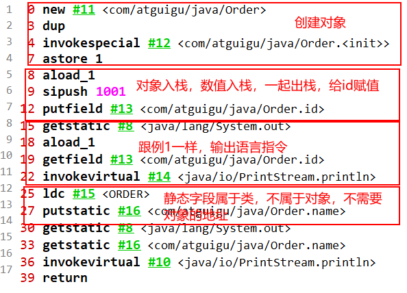
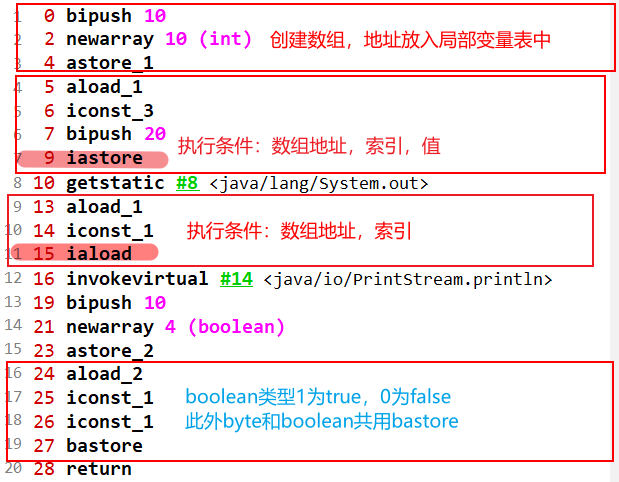

# 第2章 字节码指令集与解析

## 第一节 概述

- Java 字节码对于虚拟机，就好像汇编语言对于计算机，属于基本执行命令
- Java 虚拟机的指令由一个字节长度的、代表着某种特定操作含义的数字(称为操作码，Opcode)以及跟随其后的零至多个代表此操作所需参数(称为操作数，Operands)而构成，由于 Java 虚拟机采用面向操作数栈而不是寄存器的结构，所以大多数的指令都不包含操作数，只有一个操作码
- 由于限制了 Java 虚拟机操作码的长度为一个字节(即0~255)，这意味着指令集的操作码总数不可能超过256 条
- 官方文档：https://docs.oracle.com/javase/specs/jvms/se8/html/jvms-6.html
- 熟悉虚拟机的指令对于动态字节码生成、反编译 Class 文件、 Class 文件修补都有着非常重要的价值。因此，阅读字节码作为了解 Java 虚拟机的基础技能，需要熟练掌握常见指令

### 1. 执行模型

如果不考虑异常处理的话，那么 Java 虚拟机的解释器可以使用下面这个伪代码当做最基本的执行模型来理解

~~~
do {
		自动计算PC 寄存器的值加1;
		根据PC 寄存器的指示位置，从字节码流中取出操作码;
		if(字节码存在操作数) 从字节码流中取出操作数;执行操作码所定义的操作;
}while(字节码长度>0)
~~~

### 2. 字节码与数据类型

在 Java 虚拟机的指令集中，大多数的指令都包含了其操作所对应的数据类型信息。例如，iload 指令用于从局部变量表中加载 int 类型的数据到操作数栈中，而 fload 指令加载的则是 float 类型的数据

对于大部分与数据类型相关的字节码指令，它们的操作码助记符中都有特殊的字符来表明专门为哪种数据类型服务：

- i 代表对 int 类型的数据操作
- l 代表 long
- s 代表 short
- b 代表 byte
- c 代表 char
- f 代表 float
- d 代表 double

也有一些指令的助记符中没有明确地指明操作类型的字母，如 arraylength指令，它没有代表数据类型的特殊字符，但操作数永远只能是一个数组类型的对象

还有另一些指令，如无条件跳转指令 goto 则是与数据类型无关的

大部分的指令都没有支持整数类型 byte、char 和 short，甚至没有任何指令支持 boolean 类型。编译器会在编译器或运行期**将 byte 和short 类型的数据带符号扩展(Sign-Extend)为相应的 int 类型数据**，**将 boolean 和 char 类型数据零位扩展(Zero-Extend)为相应的 int 类型数据**。与之类似，在处理 boolean、byte、 short 和 char 类型的数组时，也会转换为使用对应的 int 类型的字节码指令来处理。因此，大多数对于 boolean、byte、short 和 char 类型数据的操作，实际上都是使用相应的 int 类型作为运算类型

### 3. 指令分类

由于完全介绍和学习这些指令需要花费大量时间，为了让大家能够更快地熟悉和了解这些基本指令，这里将 JVM 中的字节码指令集按用途大致分成9 类：

- **加载与存储指令**
- **算术指令**
- **类型转换指令**
- **对象的创建与访问指令**
- **方法调用与返回指令**
- **操作数栈管理指令**
- **比较控制指令**
- **异常处理指令**
- **同步控制指令**

在做值相关操作时：

- 一个指令，可以从局部变量表、常量池、堆中对象、方法调用、系统调用等中取得数据，这些数据(可能是值，可能是对象的引用)被压入操作数栈
- 一个指令，也可以从操作数栈中取出一到多个值(pop 多次)，完成赋值、加减乘除、方法传参、系统调用等操作

## 第二节 加载与存储指令

作用：**加载**和**存储**指令用于**将数据从栈帧的局部变量表和操作数栈之间**来回传递

**常用指令：**

「局部变量压栈指令」将一个局部变量加载到操作数栈：

`xload、xload_<n> (其中 x 为 i、l、f、d、a，n 为 0 到 3)；xaload、xaload<n> (其 x 为 i、l	、f、d、a、b、c、s，n 为 0 到 3)`

------

「常量入栈指令」将一个常量加载到操作数栈：

`bipush、sipush、ldc、ldc_w、 ldc2_w、aconst_null、iconst_m1、iconst_<i>、iconst_<l>、fconst_<f>、 dconst_<d>`

------

「出栈装入局部变量表指令」将一个数值从操作数栈存储到局部变量表：

`xstore、xstore_<n>(其中 x 为 i、l、f、d、a，n 为 0 到 3); xastore(其中 x 为 i、l、f、d、a、b、c、s)`

------

扩充局部变量表的访问索引的指令：wide

------

上面所列举的指令助记符中，有一部分是以尖括号结尾的(例如`iload_<n>`)。这些指令助记符实际上代表了一组指令(例如`iload_<n>`代表了` iload_0、iload_1、 iload_2 `和`iload_3` 这几个指令)。这几组指令都是某个带有一个操作数的通用指令(例如 iload)的特殊形式，对于这若干组特殊指令来说，它们表面上没有操作数，不需要进行取操作数的动作，但操作数都隐含在指令中
除此之外，它们的语义与原生的通用指令完全一致(例如` iload_0 `的语义与操作数为0 时的iload 指令语义完全一致)。在尖括号之间的字母指定了指令隐含操作数的数据类型，`<n>`代表非负的整数，`<i>`代表是 int 类型数据，`<l>`代表 long类型，`<f>`代表 float 类型，`<d>`代表 double 类型
操作 byte、char、short 和 boolean 类型数据时，经常用 int 类型的指令来表示

### 1.  复习操作数栈与局部变量表

 [第5章 虚拟机栈.md](..\内存与垃圾回收篇\第5章 虚拟机栈.md) 

### 2. 局部变量压栈指令

局部变量压栈指令将给定的局部变量表中的数据压入操作数栈,这类指令大体可以分为：

- `xload_<n>(x 为i、l、f、d、a，n 为 0 到 3)`
- `xload(x 为i、l、f、d、a)`

说明：在这里，x 的取值表示数据类型

指令xload_n 表示将第n 个局部变量压入操作数栈，比如 iload_1、fload_0、 aload_0 等指令。其中aload_n 表示将一个对象引用压栈

指令 xload 通过指定参数的形式，把局部变量压入操作数栈，当使用这个命令时，表示局部变量的数量可能超过了4 个，比如指令iload、fload 等

### 3. 常量入栈指令

常量入栈指令的功能是将常数压入操作数栈，根据数据类型和入栈内容的不同，又可以分为 const 系列、push 系列和 ldc 指令

**指令 const 系列：**用于对特定的常量入栈，入栈的常量隐含在指令本身里。指令有：`iconst_<i>(i 从-1 到 5)、lconst_<l>(l 从0 到1)、fconst_<f>(f 从0 到2)、dconst_<d>(d 从0 到1)、aconst_null`

比如：

- iconst_m1 将-1 压入操作数栈
- iconst_x(x 为0 到5)将 x 压入栈
- lconst_0、lconst_1 分别将长整数0 和1 压入栈
- fconst_0、fconst_1、fconst_2 分别将浮点数0、1、2 压入栈
- dconst_0 和 dconst_1 分别将 double 型0 和1 压入栈
- aconst_null 将 null 压入操作数栈

从指令的命名上不难找出规律，指令助记符的第一个字符总是喜欢表示数据类型，i 表示整数，l 表示长整型，f 表示浮点数，d 表示双精度浮点，习惯上用 a 表示对象引用。如果指令隐含操作的参数，会以下划线形式给出

**指令 push 系列：**主要包括 bipush 和 sipush，它们的区别在于接受数据类型的不同，bipush 接收8 位整数作为参数，sipush 接收16 位整数，它们都将参数压入栈

**指令 ldc 系列：**如果以上指令都不能满足需求，那么可以使用万能的ldc 指令，它可以接收一个8 位的参数，该参数指向常量池中的 int、float 或者String 的索引，将指定的内容压入堆栈

类似的还有 ldc_w，它接收两个8 位参数，能支持的索引范围大于 ldc

如果要压入的元素是 long 或者 double 类型的，则使用 ldc2_w 指令，使用方式都是类似的

### 4. 出栈装入局部变量表指令

出栈装入局部变量表指令用于将操作数栈中栈顶元素弹出后，装入局部变量表的指定位置，用于给局部变量赋值

这类指令主要以 store 的形式存在，比如 `xstore (x 为 i、l、f、d、a)、xstore_n(x为 i、l、f、d、a，n 为0 至3)`和 `pasture(x 为 i、l、f、d、a、b、c、s)`

其中，指令 istore_n 将从操作数栈中弹出一个整数，并把它赋值给局部变量 n

指令 xstore 由于没有隐含参数信息，故需要提供一个 byte 类型的参数类指定目标局部变量表的位置

xastore 则专门针对数组操作，以 iastore 为例，它用于给一个 int 数组的给定索引赋值。在 iastore 执行前，操作数栈顶需要以此准备 3 个元素：值、索引、数组引用，iastore 会弹出这3 个值，并将值赋给数组中指定索引的位置

一般说来，类似像 store 这样的命令需要带一个参数，用来指明将弹出的元素放在局部变量表的第几个位置。但是，为了尽可能压缩指令大小，使用专门的istore_1 指令表示将弹出的元素放置在局部变量表第 1 个位置。类似的还有istore_0、istore_2、istore_3，它们分别表示从操作数栈顶弹出一个元素，存放在局部变量表第0、2、3 个位置

由于局部变量表前几个位置总是非常常用，因此这种做法虽然增加了指令数量，但是可以大大压缩生成的字节码的体积。如果局部变量表很大，需要存储的槽位大于3，那么可以使用 istore 指令，外加一个参数，用来表示需要存放的槽位位置

## 第三节 算术指令

① 作用：

算术指令用于对两个操作数栈上的值进行某种特定运算，并把结果重新压入操作数栈

② 分类：

大体上算术指令可以分为两种：对**整型数据进行运算**的指令与对**浮点型类型数据进行运算**的指令

③ **byte、short、char 和 boolean 类型说明**

在每一大类中，都有针对 Java 虚拟机具体数据类型的专用算术指令。但没有直接支持 byte、short、char 和 boolean 类型的算术指令，对于这些数据的运算，都使用 int 类型的指令来处理。此外，在处理 boolean、byte、short 和 char类型的数组时，也会转换为使用对应的 int 类型的字节码指令来处理

④ 运算时的溢出：

数据运算可能会导致溢出，例如两个很大的正整数相加，结果可能是一个负数。其实 Java 虚拟机规范并无明确规定过整型数据溢出的具体结果，仅规定了在处理整型数据时，只有除法指令以及求余指令中当出现除数为0 时会导致虚拟机抛出异常 ArithmeticException

⑤ 运算模式

向最接近数舍入模式：JVM 要求在进行浮点数计算时，所有的运算结果都必须舍入到适当的精度，非精确结果必须舍入为可被表示的最接近的精确值，如果有两种可表示的形式与该值一样接近，将优先选择最低有效位为零的

向零舍入模式：将浮点数转换为整数时，采用该模式，该模式将在目标数值类型中选择一个最接近但是不大于原值的数字作为最精确的舍入结果

⑥ NaN 值使用

当一个操作产生溢出时，将会使用有符号的无穷大表示，如果某个操作结果没有明确的数学定义的话，将会使用 NaN 值来表示。而且所有使用 NaN 值作为操作数的算术操作，结果都会返回 NaN

~~~java
public class ArithmeticTest {

    public static void main(String[] args) {
        int i = 10;
        double j = i / 0.0;
        System.out.println(j);//无穷大


        double d1 = 0.0;
        double d2 = d1 / 0.0;
        System.out.println(d2);//NaN: not a number
    }
}
~~~

结果：

~~~java
Infinity
NaN

Process finished with exit code 0
~~~


### 1.  所有算数指令

- 加法指令：iadd、ladd、fadd、dadd
- 减法指令：isub、lsub、fsub、dsub
- 乘法指令：imul、lmul、fmul、dmul
- 除法指令：idiv、ldiv、fdiv、ddiv
- 求余指令：irem、lrem、frem、drem(remainder：余数)
- 取反指令：ineg、lneg、fneg、dneg(negation：取反)
- 自增指令：iinc
- 位运算指令，又可分为：
  - 位移指令：ishl、ishr、iushr、lshl、lshr、lushr
  - 按位或指令：ior、lor
  - 按位与指令：iand、land
  - 按位异或指令：ixor、lxor
- 比较指令：dcmpg、dcmlp、fcmpg、fcmpl、lcmp

例子：

```java
public int method5(int i ,int j){
    return ((i + j - 1) & ~(j - 1));
}
```

~~~java
 0 iload_1
 1 iload_2
 2 iadd
 3 iconst_1
 4 isub
 5 iload_2
 6 iconst_1
 7 isub
 8 iconst_m1
 9 ixor
10 iand
11 ireturn
~~~

对于取反`~`操作，虚拟机是先将-1压入栈，与要取反操作数进行按位异或

### 2. 比较指令的说明

- 比较指令的作用是比较栈顶两个元素的大小，并将比较结果入栈
- 比较指令有：dcmpg、dcmpl、fcmpg、fcmpl、lcmp
- 与前面讲解的指令类似，首字符 d 表示 double 类型，f 表示 float，l 表示 long
- 对于 double 和 float 类型的数字，由于 NaN 的存在，各有两个版本的比较指令，以 float 为例，有 fcmpg 和 fcmpl 两个指令，它们的区别在于在数字比较时，若遇到 NaN 值，处理结果不同
- 指令 dcmpl 和 dcmpg 也是类似的，根据其命名可以推测其含义，在此不再赘述
- 指令 lcmp 针对 long 型整数，由于 long 型整数没有 NaN 值，故无需准备两套指令

- 指令 fcmpg 和 fcmpl 都从栈中弹出两个操作数，并将它们做比较，设栈顶的元素为 v2，栈顶顺位第 2 位元素为 v1，若 v1 = v2，则压入0；若 v1 > v2 则压入1；若 v1 < v2 则压入-1
- 两个指令的不同之处在于，如果遇到 NaN 值，fcmpg 会压入1，而 fcmpl 会压入-1
- 数值类型的数据才可以谈大小，boolean、引用数据类型不能比较大小
- 没有int类型是因为这些指令就是要通过比较转换为int类型用于条件跳转指令，后面讲到条件跳转指令就明白了


## 第四节 类型转换指令

- 类型转换指令可以将两种不同的数值类型进行相互转换
- 这些转换操作一般用于实现用户代码中的显式类型转换操作，或者用来处理
- 字节码指令集中数据类型相关指令无法与数据类型一一对应的问题

### 1. 宽化类型转换

**1) 转换规则**

Java 虚拟机直接支持以下数值的宽化类型转换(Widening Numeric Conversion，小范围类型向大范围类型的安全转换)。也就是说，并不需要指令执行，包括：

- 从 int 类型到 long、float 或者 double 类型，对应的指令为：i2l、i2f、i2d
- 从 long 类型到 float、double 类型。对应的指令为：l2f、l2d
- 从 flaot 类型到 double 类型。对应的指令为：f2d

简化为：int --> long --> float --> double

**2) 精度损失问题**

宽化类型转换是不会因为超过目标类型最大值而丢失信息的，例如，从int 转换到 long，或者从 int 转换到 double，都不会丢失任何信息，转换前后的值是精确相等的

从 int、long 类型数值转换到 float，或者 long 类型树脂转换到 double时，将可能发生丢失精度——可能丢失掉几个最低有效位上的值，转换后的浮点数值是根据 IEEE754 最接近舍入模式所得到的正确整数数值。尽管宽化类型转换实际上是可能发生精度丢失的，但是这种转换永远不会导致 Java 虚拟机抛出运行时异常

从 byte、char 和 short 类型到 int 类型的宽化类型转换实际上是不存在的，对于 byte 类型转换为 int，虚拟机并没有做实质性的转化处理，只是简单地通过操作数栈交换了两个数据。而 byte 转为 long 时，使用的是 i2l，可以看到在内部 byte 在这里已经等同于 int 类型处理，类似的还有 short 类型，这种处理方式有两个特点：

- 一方面可以减少实际的数据类型，如果为 short 和 byte 都准备一套指令，那么指令的数量就会大增，而虚拟机目前的设计上，只愿意使用一个字节表示指令，因此指令总数不能超过 256 个，为了节省指令资源，将 short 和 byte 当作 int 处理也是情理之中
- 另一方面，由于局部变量表中的槽位固定为 32 位，无论是 byte 或者short 存入局部变量表，都会占用 32 位空间。从这个角度来说，也没有必要特意区分这几种数据类型

~~~java
public void upCast3(byte b){
        int i = b;
        long l = b;
        double d = b;
    }
public void upCast4(short s){
        int i = s;
        long l = s;
        float f = s;
    }
~~~

字节码：

~~~java
0 iload_1
1 istore_2
2 iload_1
3 i2l
4 lstore_3
5 iload_1
6 i2d
7 dstore 5
9 return

0 iload_1
1 istore_2
2 iload_1
3 i2l
4 lstore_3
5 iload_1
6 i2f
7 fstore 5
9 return
~~~


### 2. 窄化类型转换

**转换规则**

Java 虚拟机也直接支持以下窄化类型转换：

- 从 int 类型至 byte、short 或者 char 类型。对应的指令有：i2b、i2c、i2s
- 从 long 类型到 int 类型。对应的指令有：l2i
- 从 float 类型到 int 或者 long 类型。对应的指令有：f2i、f2l
- 从 double 类型到 int、long 或者 float 类型。对应的指令有：d2i、d2l、d2f

为什么没有f2b，l2b呢？

~~~java
public void downCast1(){
        int i = 10;
        byte b = (byte)i;
        short s = (short)i;
        char c = (char)i;

        long l = 10L;
        int i1 = (int)l;
        byte b1 = (byte) l;


    }
~~~

字节码

~~~java
 0 bipush 10
 2 istore_1
 3 iload_1
 4 i2b
 5 istore_2
 6 iload_1
 7 i2s
 8 istore_3
 9 iload_1
10 i2c
11 istore 4
13 ldc2_w #10 <10>
16 lstore 5
18 lload 5
20 l2i
21 istore 7
23 lload 5
25 l2i
26 i2b
27 istore 8
29 return
~~~

可以看到long类型的转换为byte类型使用两个命令执行`l2i`，`i2b`，其他的也类似，先转化为int类型，再向下转型。**那对于short向byte进行转型，直接就是`i2b`**

**精度损失问题**

窄化类型转换可能会导致转换结果具备不同的正负号、不同的数量级，因此，转换过程很可能会导致数值丢失精度

尽管数据类型窄化转换可能会发生上限溢出、下限溢出和精度丢失等情况，但是 Java 虚拟机规范中明确规定数值类型的窄化转换指令永远不可能导致虚拟机抛出运行时异常

**补充说明**

A.	当一个浮点值窄化转换为整数类型 T(T 限于 int 或 long 类型之一)的时候，将遵循以下转换规则：

- 如果浮点值是 NaN，那转换结果就是 int 或 long 类型的0
- 如果浮点值不是无穷大的话，浮点值使用 IEEE754 的向零舍入模式取整，获得整数值 v，如果 v 在目标类型 T(int 或 long)的表示范围之内，那转换结果就是 v。否则，将根据 v 的符号，转换为 T 所能表示的最大或者最小正数

B.   当一个 double 类型窄化转换为 float 类型时，将遵循以下转换规则：

通过向最接近数舍入模式舍入一个可以使用 float 类型表示的数字。最后结果根据下面这3 条规则判断：

- 如果转换结果的绝对值太小而无法使用 float 来表示，将返回 float 类型的正负零
- 如果转换结果的绝对值太大而无法使用 float 来表示，将返回 float 类型的正负无穷大
- 对于 double 类型的 NaN 值将按规定转换为 float 类型的 NaN 值

## 第五节 对象的创建与访问指令

Java 是面向对象的程序设计语言，虚拟机平台从字节码层面就对面向对象做了深层次的支持。有一系列指令专门用于对象操作，可进一步细分为**创建指令**、**字段访问指令**、**数组操作指令**和**类型检查指令**

### 1. 创建指令

虽然类实例和数组都是对象，但 Java 虚拟机对类实例和数组的创建与操作使用了不同的字节码指令

**创建类实例的指令：**

创建类实例的指令：new

它接收一个操作数，为指向常量池的索引，表示要创建的类型，执行完成后，将对象的引用压入栈

~~~java
public void newInstance() {
        Object obj = new Object();

        File file = new File("atguigu.avi");
    }
~~~

字节码

~~~
 0 new #2 <java/lang/Object>
 3 dup
 4 invokespecial #1 <java/lang/Object.<init>>
 7 astore_1
 8 new #3 <java/io/File>
11 dup
12 ldc #4 <atguigu.avi>
14 invokespecial #5 <java/io/File.<init>>
17 astore_2
18 return
~~~


**创建数组的指令：**

创建数组的指令：newarray、anewarray、multianewarray

- newarray：创建基本类型数组
- anewarray：创建引用类型数组
- multianewarray：创建多维数组

上述创建指令可以用于创建对象或者数组，由于对象和数组在 Java 中的广泛使用，这些指令的使用频率也很高

```java
public void newArray() {
    int[] intArray = new int[10];
    Object[] objArray = new Object[10];
    int[][] mintArray = new int[10][10];

    String[][] strArray = new String[10][];
}
```

~~~
 0 bipush 10
 2 newarray 10 (int)
 4 astore_1
 5 bipush 10
 7 anewarray #2 <java/lang/Object>
10 astore_2
11 bipush 10
13 bipush 10
15 multianewarray #6 <[[I> dim 2
19 astore_3
20 bipush 10
22 anewarray #7 <[Ljava/lang/String;>
25 astore 4
27 return
~~~


### 2. 字段访问指令

对象创建后，就可以通过对象访问指令获取对象实例或数组实例中的字段或者数组元素

- 访问类字段(static 字段，或者称为类变量)的指令：getstatic、putstatic
- 访问类实例字段(非 static 字段，或者称为实例变量)的指令：getfield、putfield

以 getstatic 指令为例，它含有一个操作数，为指向常量池的 Fieldref 索引，它的作用就是获取 Fieldref 指定的对象或者值，并将其压入操作数栈

```java
public void sayHello() {
    System.out.println("hello");
}
```

~~~
0 getstatic #8 <java/lang/System.out>
3 ldc #9 <hello>
5 invokevirtual #10 <java/io/PrintStream.println>
8 return
~~~

将字段压入栈：`getstatic #8 <java/lang/System.out>`


将字符串压入栈：`ldc #9 <hello>`


调用println方法：字段和数值一起出栈：`invokevirtual #10 <java/io/PrintStream.println>`


例2：

```java
public void setOrderId(){
    Order order = new Order();
    order.id = 1001;
    System.out.println(order.id);

    Order.name = "ORDER";
    System.out.println(Order.name);
}
class Order{
    int id;
    static String name;
}
```

~~~
 0 new #11 <com/atguigu/java/Order>
 3 dup
 4 invokespecial #12 <com/atguigu/java/Order.<init>>
 7 astore_1
 8 aload_1
 9 sipush 1001
12 putfield #13 <com/atguigu/java/Order.id>
15 getstatic #8 <java/lang/System.out>
18 aload_1
19 getfield #13 <com/atguigu/java/Order.id>
22 invokevirtual #14 <java/io/PrintStream.println>
25 ldc #15 <ORDER>
27 putstatic #16 <com/atguigu/java/Order.name>
30 getstatic #8 <java/lang/System.out>
33 getstatic #16 <com/atguigu/java/Order.name>
36 invokevirtual #10 <java/io/PrintStream.println>
39 return
~~~



### 3. 数组操作指令

数组操作指令主要有：xastore 和 xaload 指令。具体为：

- 把一个数组元素加载到操作数栈的指令：baload、caload、saload、iaload、 laload、faload、daload、aaload
- 将一个操作数栈的值存储到数组元素中的指令：bastore、castore、sastore、 iastore、lastore、fastore、dastore、aastore。注意这里出栈不是去往局部变量表，而是堆中

取数组长度的指令：arraylength

该指令**弹出栈顶的数组元素，获取数组的长度，将长度压入栈**

指令 xaload 表示将数组的元素压栈，比如 saload、caload 分别表示压入short 数组和 char 数组。指令 xaload 在执行时，要求操作数中栈顶元素为**数组索引 i**，栈顶顺位第 2 个元素为**数组引用 a**，该指令会弹出栈顶这两个元素，并将 a[i] 重新压入堆栈

xastore 则专门针对数组操作，以 iastore 为例，它用于给一个 int 数组的给定索引赋值。在 iastore 执行前，操作数栈顶需要以此准备 3 个元素：**值、索引、数组引用**，iastore 会弹出这3 个值，并将值赋给数组中指定索引的位置

**入栈出栈例子：**

```java
public void setArray() {
    int[] intArray = new int[10];
    intArray[3] = 20;
    System.out.println(intArray[1]);

    boolean[] arr = new boolean[10];
    arr[1] = true;
}
```

~~~
 0 bipush 10
 2 newarray 10 (int)
 4 astore_1
 5 aload_1
 6 iconst_3
 7 bipush 20
 9 iastore
10 getstatic #8 <java/lang/System.out>
13 aload_1
14 iconst_1
15 iaload
16 invokevirtual #14 <java/io/PrintStream.println>
19 bipush 10
21 newarray 4 (boolean)
23 astore_2
24 aload_2
25 iconst_1
26 iconst_1
27 bastore
28 return
~~~



arraylength指令：

```java
public void arrLength(){

    double[] arr = new double[10];
    System.out.println(arr.length);
}
```

~~~
 0 bipush 10
 2 newarray 7 (double)
 4 astore_1
 5 getstatic #8 <java/lang/System.out>
 8 aload_1
 9 arraylength
10 invokevirtual #14 <java/io/PrintStream.println>
13 return
~~~

### 4. 类型检查指令

检查类实例或数组类型的指令：instanceof、checkcast

- 指令 checkcast 用于检查类型强制转换是否可以进行。如果可以进行，那么checkcast 指令不会改变操作数栈，否则它会抛出 ClassCastException 异常
- 指令 instanceof 用来判断给定对象是否是某一个类的实例，它会将判断结果压入操作数栈

```java
public String checkCast(Object obj) {
    if (obj instanceof String) {
        return (String) obj;
    } else {
        return null;
    }
}
```

~~~
 0 aload_1
 1 instanceof #17 <java/lang/String>
 4 ifeq 12 (+8)
 7 aload_1
 8 checkcast #17 <java/lang/String>
11 areturn
12 aconst_null
13 areturn
~~~


## 第六节 方法调用与返回指令

### 1. 方法调用指令

方法调用指令：invokevirtual 、invokeinterface、invokespecial 、invokestatic、 invokedynamic

- invokevirtual 指令用于调用对象的实例方法，根据对象的实际类型进行分派(虚方法分派)，支持多态。这也是 Java 语言中最常见的方法分派方式
- invokeinterface 指令用于调用接口方法，它会在运行时搜索由特定对象所实现的这个接口方法，并找出适合的方法进行调用
- invokespecial 指令用于调用一些需要特殊处理的实例方法，包括实例初始化方法(构造器)、私有方法和父类方法。这些方法都是静态类型绑定的，不会在调用时进行动态派发
- invokestatic 指令用于调用命名类中的类方法(static 方法)。这是静态绑定的
- invokedynamic 调用动态绑定的方法，这个是 JDK 1.7 后新加入的指令。用于在运行时动态解析出调用点限定符所引用的方法，并执行该方法。前面4条调用指令的分派逻辑都固化在 Java 虚拟机内部，而 invokedynamic 指令的分派逻辑是由用户所设定的引导方法决定的

这些指令在之前 [第5章 虚拟机栈.md](..\内存与垃圾回收篇\第5章 虚拟机栈.md) 已经讲过，就不再说了

### 2. 方法返回指令

方法调用结束前，需要进行返回。方法返回指令是根据返回值的类型区分的

- 包括 ireturn(当返回值是 boolean、byte、char、short 和 int 类型时使用)、 lreturn、freturn、dreturn 和 areturn
- 另外还有一条 return 指令供声明为 void 的方法、实例初始化方法以及类和接口的类初始化方法使用

通过 ireturn 指令，将当前函数操作数栈的顶层元素弹出，并将这个元素压入调用者函数的操作数栈中(因为调用者非常关心函数的返回值)，所有在当前函数操作数栈中的其他元素都会被丢弃

如果当前返回的是 synchronized 方法，那么还会执行一个隐含的monitorexit 指令，退出临界区最后，会丢弃当前方法的整个帧，恢复调用者的帧，并将控制权转交给调用者

## 第七节 操作数栈管理指令

如同操作一个普通数据结构中的堆栈那样，JVM 提供的操作数栈管理指令，可以用于直接操作操作数栈的指令

这类指令包括如下内容：

- 将一个或两个元素从栈顶弹出，并且直接废弃：pop、pop2
- 复制栈顶一个或两个数值并将复制值或双份的复制值重新压入栈顶：dup、 dup2、dup_x1、dup2_x1、du p_x2、dup2_x2
- 将栈最顶端的两个 Slot 数值位置交换：swap、Java 虚拟机没有提供交换两个64 位数据类型(long、double)数值的指令
- 指令 nop 是一个非常特殊的指令，它的字节码为0x00。和汇编语言中的 nop一样，它表示什么都不做，这条指令一般可用于调试、占位等

这些指令属于通用型，对栈的压入或者弹出无需知名数据类型

**说明：**

- 不带 _x 的指令是复制栈顶数据并压入栈顶。包括两个指令，dup 和 dup2， dup 的系数代表要复制的 Slot 个数
  - dup 开头的指令用于复制 1 个 Slot 的数据。例如 1 个 int 或 1 个reference 类型数据
  - dup2 开头的指令用于复制2 个 Slot 的数据。例如1 个 long，或2 个 int，或1 个 int 加1 个 float 类型数据
- 带 _x 的指令是复制栈顶数据并插入栈顶以下的某个位置。共有4 个指令， dup_x1、dup2_x1、dup_x2、dup2_x2。对于带 _x 的复制插入指令，只要将指令的 dup 和 x 的系数相加，结果即为需要插入的位置。因此
  - dup_x1 插入位置：1+1=2，即栈顶2 个 Slot 下面
  - dup_x2 插入位置：1+2=3，即栈顶3 个 Slot 下面
  - dup2_x1 插入位置：2+1=3，即栈顶3 个 Slot 下面
  - dup2_x2 插入位置：2+2=4，即栈顶4 个 Slot 下面
- pop：将栈顶的1 个 Slot 数值出栈。例如1 个 short 类型数值
- pop2：将栈顶的 2 个 Slot 数值出栈。例如 1 个 double 类型数值，或者 2个 int 类型数值

**例子：**

```java
public long nextIndex() {
    return index++;
}

private long index = 0;
```

~~~
 0 aload_0
 1 dup
 2 getfield #2 <com/atguigu/java/StackOperateTest.index>
 5 dup2_x1
 6 lconst_1
 7 ladd
 8 putfield #2 <com/atguigu/java/StackOperateTest.index>
11 lreturn
~~~


## 第八节 控制转移指令

程序流程离不开条件控制，为了支持条件跳转，虚拟机提供了大量字节码指令，大体上可以分为比较指令、条件跳转指令、比较条件跳转指令、多条件分支跳转指令、无条件跳转指令等

### 1. 条件跳转指令

条件跳转指令通常和比较指令结合使用。在条件跳转指令执行前，一般可以先用比较指令进行栈顶元素的准备，然后进行条件跳转

条件跳转指令有：ifeq、iflt、ifle、ifne、ifgt、ifge、ifnull、ifnonnull。这些指令都接收两个字节的操作数，用于计算跳转的位置(16 位符号整数作为当前位置的 offset)

它们的统一含义为：弹出栈顶元素，测试它是否满足某一条件，如果满足条件，则跳转到给定位置

**具体说明：**

|指令|描述|
| ----------------- | ------------------------------ |
| ifeq（equal）     | 当栈顶int类型数值等于0时跳转   |
| ifne（no equal）  | 当栈顶int类型数值不等于0跳转   |
| iflt（less than） | 当栈顶int类型数值小于0跳转     |
| ifle              | 当栈顶int类型数值小于等于0跳转 |
| ifgt              | 当栈顶int类型数值大于0跳转     |
| ifge              | 当栈顶int类型数值大于等于0跳转 |
| ifnull            | 为null是跳转                   |
| ifnonull          | 不为null是跳转                 |

**注意：**

1)	与前面运算规则一致

- 对于 boolean、byte、char、short 类型的条件分支比较操作，都是使用 int类型的比较指令完成
- 对于 long、float、double 类型的条件分支比较操作，则会先执行相应类型的比较运算指令，运算指令会返回一个整型值到操作数栈中，随后再执行 int 类型的条件分支比较操作来完成整个分支跳转

2)	由于各类型的比较最终都会转为 int 类型的比较操作，所以 Java 虚拟机提供的 int 类型的条件分支指令是最为丰富和强大的


**例子1：**

```java
public void compare1(){
    int a = 0;
    if(a == 0){
        a = 10;
    }else{
        a = 20;
    }
}
 0 iconst_0
 1 istore_1
 2 iload_1
 3 ifne 12 (+9)
 6 bipush 10
 8 istore_1
 9 goto 15 (+6)
12 bipush 20
14 istore_1
15 return
```


**当改为`a != 0`时 指令为`ifeq 12 (+9)`**

**例子2：**

```java
public boolean compareNull(String str){
    if(str == null){
        return true;
    }else{
        return false;
    }
}
0 aload_1
1 ifnonnull 6 (+5)
4 iconst_1
5 ireturn
6 iconst_0
7 ireturn
```

**例子3：**

```java
public void compare2() {
    float f1 = 9;
    float f2 = 10;
    System.out.println(f1 < f2);//true
}
 0 ldc #2 <9.0>
 2 fstore_1
 3 ldc #3 <10.0>
 5 fstore_2
 6 getstatic #4 <java/lang/System.out>
 9 fload_1
10 fload_2
11 fcmpg
12 ifge 19 (+7)
15 iconst_1
16 goto 20 (+4)
19 iconst_0
20 invokevirtual #5 <java/io/PrintStream.println>
23 return
```


**例子4：**

```java
public void compare3() {
    int i1 = 10;
    long l1 = 20;
    System.out.println(i1 > l1);
} 
 0 bipush 10
 2 istore_1
 3 ldc2_w #6 <20>
 6 lstore_2
 7 getstatic #4 <java/lang/System.out>
10 iload_1
11 i2l
12 lload_2
13 lcmp
14 ifle 21 (+7)
17 iconst_1
18 goto 22 (+4)
21 iconst_0
22 invokevirtual #5 <java/io/PrintStream.println>
25 return
```


**例子5：**

```java
public int compare4(double d) {
    if (d > 50.0) {
        return 1;
    } else {
        return -1;
    }
}
 0 dload_1
 1 ldc2_w #8 <50.0>
 4 dcmpl
 5 ifle 10 (+5)
 8 iconst_1
 9 ireturn
10 iconst_m1
11 ireturn
```

### 2. 比较条件跳转指令

比较条件跳转指令类似于比较指令和条件跳转指令的结合体，它将比较和跳转两个步骤合二为一

这类指令有：if_icmped、if_icmpne、if_icmplt、if_icmpgt、if_icmple、if_icmpge、 if_acmped 和 if_acmpne

其中指令助记符加上 "if_" 后，以字符 "i" 开头的指令针对 int 型整数操作(也包括 short 和 byte 类型)，以字符 "a" 开头的指令表示对象引用的比较

具体说明：

| 指令      | 描述                                                |
| --------- | --------------------------------------------------- |
| if_icmpeq | 比较栈顶两int类型数值大小，当前者等于后者时跳转     |
| if_icmpne | 比较栈顶两int类型数值大小，当前者不等于后者时跳转   |
| if_icmplt | 比较栈顶两int类型数值大小，当前者小于后者时跳转     |
| if_icmple | 比较栈顶两int类型数值大小，当前者小于等于后者时跳转 |
| if_icmpgt | 比较栈顶两int类型数值大小，当前者大于后者时跳转     |
| if_icmpge | 比较栈顶两int类型数值大小，当前者大于等于后者时跳转 |
| if_acmpeq | 比较栈顶两引用类型数值，当相等时跳转                |
| if_acmpne | 比较栈顶两引用类型数值，当不相等时跳转              |

这些指令都接收两个字节的操作数作为参数，用于计算跳转的位置。同时在执行指令时，栈顶需要准备两个元素进行比较。指令执行完成后，栈顶的这两个元素被清空，且没有任何数据入栈。如果预设条件成立，则执行跳转，否则，继续执行下一条语句

**例子1：**

```java
public void ifCompare1(){
    int i = 10;
    int j = 20;
    System.out.println(i > j);
}
 0 bipush 10
 2 istore_1
 3 bipush 20
 5 istore_2
 6 getstatic #4 <java/lang/System.out>
 9 iload_1
10 iload_2
11 if_icmple 18 (+7)
14 iconst_1
15 goto 19 (+4)
18 iconst_0
19 invokevirtual #5 <java/io/PrintStream.println>
22 return
```

**例子2：**

```java
public void ifCompare2() {
    short s1 = 9;
    byte b1 = 10;
    System.out.println(s1 > b1);
}
 0 bipush 9
 2 istore_1
 3 bipush 10
 5 istore_2
 6 getstatic #4 <java/lang/System.out>
 9 iload_1
10 iload_2
11 if_icmple 18 (+7)
14 iconst_1
15 goto 19 (+4)
18 iconst_0
19 invokevirtual #5 <java/io/PrintStream.println>
22 return
```

**例子3：**

```java
public void ifCompare3() {
    Object obj1 = new Object();
    Object obj2 = new Object();
    System.out.println(obj1 == obj2);//false
    System.out.println(obj1 != obj2);//true
}
 0 bipush 9
 2 istore_1
 3 bipush 10
 5 istore_2
 6 getstatic #4 <java/lang/System.out>
 9 iload_1
10 iload_2
11 if_icmple 18 (+7)
14 iconst_1
15 goto 19 (+4)
18 iconst_0
19 invokevirtual #5 <java/io/PrintStream.println>
22 return
```

### 3. 多条件分支跳转

多条件分支跳转指令是专为 switch-case 语句设计的，主要有 tableswitch 和lookupswitch

| 指令         | 描述                             |
| ------------ | -------------------------------- |
| tableswitch  | 用于switch条件跳转，case值连续   |
| lookupswitch | 用于switch条件跳转，case值不连续 |

从助记符上看，两者都是 switch 语句的实现，它们的区别：

- tableswitch 要求多个条件分支值是连续的，它内部只存放起始值和终止值，以及若干个跳转偏移量，通过给定的操作数 index，可以立即定位到跳转偏移量位置，因此效率比较高
- lookupswitch 内部存放着各个离散的 case-offset 对，每次执行都要搜索全部的 case-offset 对，找到匹配的 case 值，并根据对应的 offset 计算跳转地址，因此效率较低

指令 tableswitch 的示意图如下图所示。由于 tableswitch 的 case 值是连续的，因此只需要记录最低值和最高值，以及每一项对应的 offset 偏移量，根据给定的 index 值通过简单的计算即可直接定位到 offset


指令 lookupswitch 处理的是离散的 case 值，但是出于效率考虑，将case-offset 对按照 case 值大小排序，给定 index 时，需要查找与 index 相等的case，获得其 offset，如果找不到则跳转到 default。指令 lookupswitch 如下图所示


**例子1：**

```java
public void swtich1(int select){
    int num;
    switch(select){
        case 1:
            num = 10;
            break;
        case 2:
            num = 20;
            break;
        case 3:
            num = 30;
            break;
        default:
            num = 40;
    }
}
 0 iload_1
 1 tableswitch 1 to 3	1:  28 (+27)
	2:  34 (+33)
	3:  40 (+39)
	default:  46 (+45)
28 bipush 10
30 istore_2
31 goto 49 (+18)
34 bipush 20
36 istore_2
37 goto 49 (+12)
40 bipush 30
42 istore_2
43 goto 49 (+6)
46 bipush 40
48 istore_2
49 return
```

**例子2：**

```java
public void swtich2(int select){
    int num;
    switch(select){
        case 100:
            num = 10;
            break;
        case 500:
            num = 20;
            break;
        case 200:
            num = 30;
            break;
        default:
            num = 40;
    }
}
 0 iload_1
 1 lookupswitch 3
	100:  36 (+35)
	200:  48 (+47)
	500:  42 (+41)
	default:  54 (+53)
36 bipush 10
38 istore_2
39 goto 57 (+18)
42 bipush 20
44 istore_2
45 goto 57 (+12)
48 bipush 30
50 istore_2
51 goto 57 (+6)
54 bipush 40
56 istore_2
57 return
```

**例子3：**

```java
public void swtich3(String season){
    switch(season){
        case "SPRING":break;
        case "SUMMER":break;
        case "AUTUMN":break;
        case "WINTER":break;
    }
}
  0 aload_1
  1 astore_2
  2 iconst_m1
  3 istore_3
  4 aload_2
  5 invokevirtual #11 <java/lang/String.hashCode>
  8 lookupswitch 4
	-1842350579:  52 (+44)
	-1837878353:  66 (+58)
	-1734407483:  94 (+86)
	1941980694:  80 (+72)
	default:  105 (+97)
 52 aload_2
 53 ldc #12 <SPRING>
 55 invokevirtual #13 <java/lang/String.equals>
 58 ifeq 105 (+47)
 61 iconst_0
 62 istore_3
 63 goto 105 (+42)
 66 aload_2
 67 ldc #14 <SUMMER>
 69 invokevirtual #13 <java/lang/String.equals>
 72 ifeq 105 (+33)
 75 iconst_1
 76 istore_3
 77 goto 105 (+28)
 80 aload_2
 81 ldc #15 <AUTUMN>
 83 invokevirtual #13 <java/lang/String.equals>
 86 ifeq 105 (+19)
 89 iconst_2
 90 istore_3
 91 goto 105 (+14)
 94 aload_2
 95 ldc #16 <WINTER>
 97 invokevirtual #13 <java/lang/String.equals>
100 ifeq 105 (+5)
103 iconst_3
104 istore_3
105 iload_3
106 tableswitch 0 to 3	0:  136 (+30)
	1:  139 (+33)
	2:  142 (+36)
	3:  145 (+39)
	default:  145 (+39)
136 goto 145 (+9)
139 goto 145 (+6)
142 goto 145 (+3)
145 return
```


### 4. 无条件跳转

目前主要的无条件跳转指令为 goto，指令 goto 接收两个字节的操作数，共同组成一个带符号的整数，用于指定指令的偏移量，指令执行的目的就是跳转到偏移量给定的位置处

如果指令偏移量太大，超过双字节的带符号整数的范围，则可以使用指令goto_w，它和 goto 有相同的作用，但是它接收4 个字节的操作数，可以表示更大的地址范围

指令 jsr、jsr_w、ret 虽然也是无条件跳转的，但主要用于 try-finally 语句，且已经被虚拟机逐渐废弃，故不在这里介绍这两个指令

**例子1：循环代码**

```java
public void whileInt() {
    int i = 0;
    while (i < 100) {
        String s = "atguigu.com";
        i++;
    }
}
 0 iconst_0
 1 istore_1
 2 iload_1
 3 bipush 100
 5 if_icmpge 17 (+12)
 8 ldc #17 <atguigu.com>
10 astore_2
11 iinc 1 by 1
14 goto 2 (-12)
17 return
```

循环代码使用的也是控制转移指令而已

**例子2：**

```java
public void whileDouble() {
    double d = 0.0;
    while(d < 100.1) {
        String s = "atguigu.com";
        d++;
    }
}
 0 dconst_0
 1 dstore_1
 2 dload_1
 3 ldc2_w #18 <100.1>
 6 dcmpg
 7 ifge 20 (+13)
10 ldc #17 <atguigu.com>
12 astore_3
13 dload_1
14 dconst_1
15 dadd
16 dstore_1
17 goto 2 (-15)
20 return
```

可以看到int类型以外的类型都是先压入栈后再加一，然后再覆盖局部变量表，而int类型直接在局部变量表中自增

**例子3：三种循环**

```java
//思考：如下两个方法的操作有何不同？
public void whileTest(){
    int i = 1;
    while(i <= 100){

        i++;
    }
    //可以继续使用i
}
public void forTest(){
    for(int i = 1;i <= 100;i++){

    }
    //不可以继续使用i
}
//更进一步
public void doWhileTest(){
    int i = 1;
    do{
        i++;
    }while(i <= 100);
}

while
 0 iconst_1
 1 istore_1
 2 iload_1
 3 bipush 100
 5 if_icmpgt 14 (+9)
 8 iinc 1 by 1
11 goto 2 (-9)
14 return
    
if
 0 iconst_1
 1 istore_1
 2 iload_1
 3 bipush 100
 5 if_icmpgt 14 (+9)
 8 iinc 1 by 1
11 goto 2 (-9)
14 return
    
 do...while
 0 iconst_1
 1 istore_1
 2 iinc 1 by 1
 5 iload_1
 6 bipush 100
 8 if_icmple 2 (-6)
11 return
```


## 第九节 异常处理指令

### 1. 抛出异常指令

**athrow 指令**

在 Java 程序中显式抛出异常的操作(throw 语句)都是由 athrow 指令来实现的

除了使用 throw 语句显式抛出异常情况之外，JVM 规范还规定了许多运行时一场会在其它 Java 虚拟机指令检测到异常状况时自动抛出。例如，在之前介绍的整数运算时，当除数为零时，虚拟机会在 idiv 或 ldiv 指令中抛出ArithmeticException 异常

**注意**

正常情况下，操作数栈的压入弹出都是一条条指令完成的。唯一的例外情况是在抛异常时，Java 虚拟机会清除操作数栈上的所有内容，而后将异常实例压入调用者操作数栈上

异常及异常的处理：

过程一：异常对象的生成过程 ---> throw(手动/自动) ---> 指令：athrow

过程二：异常的处理：抓抛模型 try-catch-finally ---> 使用异常表

**例子1：throw**

```java
public void throwZero(int i){
    if(i == 0){
        throw new RuntimeException("参数值为0");
    }
}
 0 iload_1
 1 ifne 14 (+13)
 4 new #2 <java/lang/RuntimeException>
 7 dup
 8 ldc #3 <参数值为0>
10 invokespecial #4 <java/lang/RuntimeException.<init>>
13 athrow
14 return
```


与throws向上抛出的字节码一样

```java
public void throwOne(int i) throws RuntimeException,IOException{
    if(i == 1){
        throw new RuntimeException("参数值为1");
    }
}
 0 iload_1
 1 iconst_1
 2 if_icmpne 15 (+13)
 5 new #2 <java/lang/RuntimeException>
 8 dup
 9 ldc #5 <参数值为1>
11 invokespecial #4 <java/lang/RuntimeException.<init>>
14 athrow
15 return
```

**例子2：系统异常不会显示**

```java
public void throwArithmetic() {
    int i = 10;
    int j = i / 0;
    System.out.println(j);
}
 0 iload_1
 1 iconst_1
 2 if_icmpne 15 (+13)
 5 new #2 <java/lang/RuntimeException>
 8 dup
 9 ldc #5 <参数值为1>
11 invokespecial #4 <java/lang/RuntimeException.<init>>
14 athrow
15 return
```

### 2. 异常处理与异常表

**处理异常**

在 Java 虚拟机中，处理异常(catch 语句)不是由字节码指令来实现的(早期使用 jsr、ret 指令)，而是采用异常表来完成的

**异常表**

如果一个方法定义了一个 try-catch 或者 try-finally 的异常处理，就会创建一个异常表。它包含了每个异常处理或者 finally 块的信息。异常表保存了每个异常处理信息。比如：

- 起始位置
- 结束位置
- 程序计数器记录的代码处理的偏移地址
- 被捕获的异常类在常量池中的索引

**当一个异常被抛出时，JVM 会在当前的方法里寻找一个匹配的处理，如果没有找到，这个方法会强制结束并弹出当前栈帧，**并且异常会重新抛给上层调用的方法(在调用方法栈帧)。如果在所有栈帧弹出前仍然没有找到合适的异常处理，这个县城将终止。如果这个异常在最后一个非守护线程里抛出，将会导致JVM 自己终止，比如这个线程是个 main 线程

**不管什么时候抛出异常，如果异常处理最终匹配了所有异常类型，代码就会继续执行。**在这种情况下，如果方法结束后没有抛出异常，仍然执行 finally块，在 return 前，它直接跳到 finally 块来完成目标

**例子1：**

```java
public void tryCatch(){
    try{
        File file = new File("d:/hello.txt");
        FileInputStream fis = new FileInputStream(file);

        String info = "hello!";
    }catch (FileNotFoundException e) {
        e.printStackTrace();
    }
    catch(RuntimeException e){
        e.printStackTrace();
    }
}
 0 new #8 <java/io/File>
 3 dup
 4 ldc #9 <d:/hello.txt>
 6 invokespecial #10 <java/io/File.<init>>
 9 astore_1
10 new #11 <java/io/FileInputStream>
13 dup
14 aload_1
15 invokespecial #12 <java/io/FileInputStream.<init>>
18 astore_2
19 ldc #13 <hello!>
21 astore_3
22 goto 38 (+16)
25 astore_1
26 aload_1
27 invokevirtual #15 <java/io/FileNotFoundException.printStackTrace>
30 goto 38 (+8)
33 astore_1
34 aload_1
35 invokevirtual #16 <java/lang/RuntimeException.printStackTrace>
38 return
```


**例子2：**

```java
//思考：如下方法返回结果为多少？
public static String func() {
    String str = "hello";
    try{
        return str;
    }
    finally{
        str = "atguigu";
    }
}
 0 ldc #17 <hello>
 2 astore_0
 3 aload_0
 4 astore_1
 5 ldc #18 <atguigu>
 7 astore_0
 8 aload_1
 9 areturn
10 astore_2
11 ldc #18 <atguigu>
13 astore_0
14 aload_2
15 athrow
```


## 第十节 同步控制指令

Java 虚拟机支持两种同步结构：方法级同步 和 方法内部一段指令序列的同步，这两种同步都是使用 monitor 来支持的

### 1. 方法级的同步

方法级的同步：是隐式的，即无需通过字节码指令来控制，它实现在方法调用和返回操作之中。虚拟机可以从方法常量池的方法表结构中的ACC_SYNCHRONIZED 访问标志得知一个方法是否声明为同步方法

当调用方法时，调用指令将会检查方法的 ACC_SYNCHRONIZED 访问标志是否设置

- 如果设置了，执行线程将先持有同步锁，然后执行方法，最后在方法完成(无论是正常完成还是非正常完成)时释放同步锁
- 在方法执行期间，执行线程持有了同步锁，其它任何线程都无法再获得同一个锁
- 如果一个同步方法执行期间抛出了异常，并且在方法内部无法处理此异常，那么这个同步方法所持有的锁将在异常抛到同步方法之外时自动释放

```java
private int i = 0;
public void add(){
    i++;
}
 0 aload_0
 1 dup
 2 getfield #2 <com/atguigu/java1/SynchronizedTest.i>
 5 iconst_1
 6 iadd
 7 putfield #2 <com/atguigu/java1/SynchronizedTest.i>
10 return
```

这段代码和普通的无同步操作的代码没有什么不同，没有使用 monitorenter和 monitorexit 进行同步区控制。这是因为，对于同步方法而言，当虚拟机通过**方法的访问标识符**判断是一个同步方法时，会自动在方法调用前进行加锁，当同步方法执行完毕后，不管方法是正常结束还是有异常抛出，均会由虚拟机释放这个锁。因此，对于同步方法而言，monitorenter 和 monitorexit 指令是隐式存在的，并未直接出现在字节码中


### 2. 方法内指定指令序列的同步

同步一段指令集序列：通常是由 Java 中的 synchronized 语句块来表示的。 JVM 的指令集有 monitorenter 和 monitorexit 两条指令来支持 synchronized关键字的语义

当一个线程进入同步代码块时，它使用 monitorenter 指令请求进入。如果当前对象的监视器计数器为 0，则它会被准许进入，若为1，则判断持有当前监视器的线程是否为自己，如果是，则进入，否则进行等待，知道对象的监视器计数器为0，才会被允许进入同步块

当线程退出同步块时，需要使用 monitorexit 声明退出。在 Java 虚拟机中，任何对象都有一个监视器与之相关联，用来判断对象是否被锁定，当监视器被持有后，对象处于锁定状态

指令 monitorenter 和 monitorexit 在执行时，都需要在操作数栈顶压入对象，之后 monitorenter 和 monitorexit 的锁定和释放都是针对这个对象的监视器进行的

编译器必须确保无论方法通过何种方式完成，方法中调用过的每条monitorenter 指令都必须执行其对应的 monitorexit 指令，而无论这个方法是正常结束还是异常结束

为了保证在方法异常完成时 monitorenter 和 monitorexit 指令依然可以正确配对执行，编译器会自动产生一个异常处理器，这个异常处理器声明可处理所有的异常，它的目的就是用来执行 monitorexit 指令

```java
private int i = 0;
private Object obj = new Object();
public void subtract(){

    synchronized (obj){
        i--;
    }
}
 0 aload_0
 1 getfield #4 <com/atguigu/java1/SynchronizedTest.obj>
 4 dup
 5 astore_1
 6 monitorenter
 7 aload_0
 8 dup
 9 getfield #2 <com/atguigu/java1/SynchronizedTest.i>
12 iconst_1
13 isub
14 putfield #2 <com/atguigu/java1/SynchronizedTest.i>
17 aload_1
18 monitorexit
19 goto 27 (+8)
22 astore_2
23 aload_1
24 monitorexit
25 aload_2
26 athrow
27 return
```


**官方文档对monitorenter的解释**

> Each object is associated with a monitor. A monitor is locked if and only if it has an owner. The thread that executes monitorenter attempts to gain ownership of the monitor associated with objectref, as follows:
>
> - If the entry count of the monitor associated with objectref is zero, the thread enters the monitor and sets its entry count to one. The thread is then the owner of the monitor. 
> - If the thread already owns the monitor associated with objectref, it reenters the monitor, incrementing its entry count.
> - If another thread already owns the monitor associated with objectref, the thread blocks until the monitor's entry count is zero, then tries again to gain ownership.