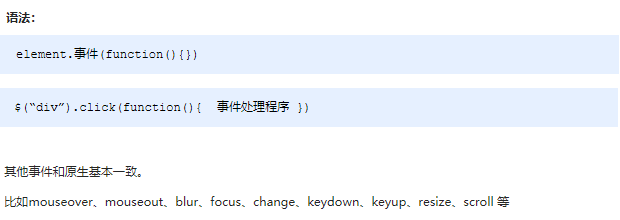
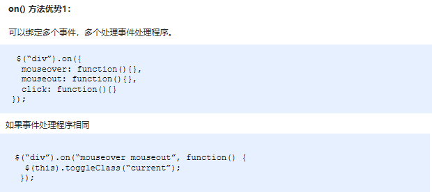
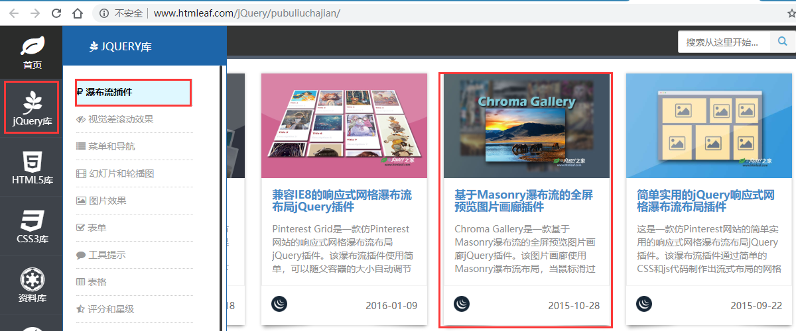
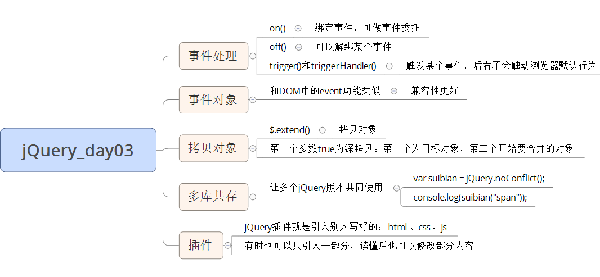

## 本资源由 itjc8.com 收集
# day03 - jQuery

> 学习目标：
>
> 能够说出4种常见的注册事件 
> 能够说出 on 绑定事件的优势
> 能够说出 jQuery 事件委派的优点以及方式
> 能够说出绑定事件与解绑事件
> 能够说出 jQuery 对象的拷贝方法
> 能够说出 jQuery 多库共存的2种方法
> 能够使用 jQuery 插件

## 1.1. jQuery 事件注册

​	jQuery 为我们提供了方便的事件注册机制，是开发人员抑郁操作优缺点如下：

- 优点: 操作简单，且不用担心事件覆盖等问题。
- 缺点: 普通的事件注册不能做事件委托，且无法实现事件解绑，需要借助其他方法。

**语法**



**演示代码**

```javascript
<body>
    <div></div>
    <script>
        $(function() {
            // 1. 单个事件注册
            $("div").click(function() {
                $(this).css("background", "purple");
            });
            $("div").mouseenter(function() {
                $(this).css("background", "skyblue");
            });
        })
    </script>
</body>
```

## 1.2. jQuery 事件处理

​	因为普通注册事件方法的不足，jQuery又开发了多个处理方法，重点讲解如下：

- on(): 用于事件绑定，目前最好用的事件绑定方法
- off(): 事件解绑
- trigger() / triggerHandler(): 事件触发

### 1.2.1 事件处理 on() 绑定事件

​	因为普通注册事件方法的不足，jQuery又创建了多个新的事件绑定方法bind() / live() / delegate() / on()等，其中最好用的是: on()

**语法**




**演示代码**

```javascript
<body>
    <div></div>
    <ul>
        <li>我们都是好孩子</li>
        <li>我们都是好孩子</li>
        <li>我们都是好孩子</li>
    </ul>
    <ol></ol>

    <script>
        $(function() {
            // (1) on可以绑定1个或者多个事件处理程序
            // $("div").on({
            //     mouseenter: function() {
            //         $(this).css("background", "skyblue");
            //     },
            //     click: function() {
            //         $(this).css("background", "purple");
            //     }
            // });
            $("div").on("mouseenter mouseleave", function() {
                $(this).toggleClass("current");
            });
  
            // (2) on可以实现事件委托（委派）
            // click 是绑定在ul 身上的，但是 触发的对象是 ul 里面的小li
            // $("ul li").click();
            $("ul").on("click", "li", function() {
                alert(11);
            });

            // (3) on可以给未来动态创建的元素绑定事件
            $("ol").on("click", "li", function() {
                alert(11);
            })
            var li = $("<li>我是后来创建的</li>");
            $("ol").append(li);
        })
    </script>
</body>

```

### 1.2.2. 案例：发布微博案例

> 1.点击发布按钮， 动态创建一个小li，放入文本框的内容和删除按钮， 并且添加到ul 中。
> 2.点击的删除按钮，可以删除当前的微博留言。

​	代码实现略。(详情参考源代码)

### 1.2.3. 事件处理 off() 解绑事件

​	当某个事件上面的逻辑，在特定需求下不需要的时候，可以把该事件上的逻辑移除，这个过程我们称为事件解绑。jQuery 为我们提供 了多种事件解绑方法：die() / undelegate() / off() 等，甚至还有只触发一次的事件绑定方法 one()，在这里我们重点讲解一下 off() ;

**语法**


**演示代码**

```javascript
<body>
    <div></div>
    <ul>
        <li>我们都是好孩子</li>
        <li>我们都是好孩子</li>
        <li>我们都是好孩子</li>
    </ul>
    <p>我是一个P标签</p>
	<script>
        $(function() {
  			// 事件绑定
            $("div").on({
                click: function() {
                    console.log("我点击了");
                },
                mouseover: function() {
                    console.log('我鼠标经过了');
                }
            });
            $("ul").on("click", "li", function() {
                alert(11);
            });
  
            // 1. 事件解绑 off 
            // $("div").off();  // 这个是解除了div身上的所有事件
            $("div").off("click"); // 这个是解除了div身上的点击事件
            $("ul").off("click", "li");
  
            // 2. one() 但是它只能触发事件一次
            $("p").one("click", function() {
                alert(11);
            })
        })
    </script>
</body>
```

### 1.2.4. 事件处理 trigger() 自动触发事件

​	有些时候，在某些特定的条件下，我们希望某些事件能够自动触发, 比如轮播图自动播放功能跟点击右侧按钮一致。可以利用定时器自动触发右侧按钮点击事件，不必鼠标点击触发。由此 jQuery 为我们提供了两个自动触发事件 trigger() 和 triggerHandler() ; 

**语法**


**演示代码**

```javascript
<body>
    <div></div>
    <input type="text">
      
    <script>
    $(function() {
      // 绑定事件
      $("div").on("click", function() {
        alert(11);
      });

      // 自动触发事件
      // 1. 元素.事件()
      // $("div").click();会触发元素的默认行为
      
      // 2. 元素.trigger("事件")
      // $("div").trigger("click");会触发元素的默认行为
      $("input").trigger("focus");
      
      // 3. 元素.triggerHandler("事件") 就是不会触发元素的默认行为
      $("input").on("focus", function() {
        $(this).val("你好吗");
      });
      // 一个会获取焦点，一个不会
      $("div").triggerHandler("click");
      // $("input").triggerHandler("focus");
    });
    </script>
</body>
```

## 1.3. jQuery 事件对象

​	jQuery 对DOM中的事件对象 event 进行了封装，兼容性更好，获取更方便，使用变化不大。事件被触发，就会有事件对象的产生。

**语法**


**演示代码**

```javascript
<body>
    <div></div>

	<script>
        $(function() {
            $(document).on("click", function() {
                console.log("点击了document");
            })
            $("div").on("click", function(event) {
                // console.log(event);
                console.log("点击了div");
                event.stopPropagation();
            })
        })
    </script>
</body>
```

注意：jQuery中的 event 对象使用，可以借鉴 API 和 DOM 中的 event 。

## 1.4.  jQuery 拷贝对象

​	jQuery中分别为我们提供了两套快速获取和设置元素尺寸和位置的API，方便易用，内容如下。

**语法**


**演示代码**

```javascript
 <script>
        $(function() {
   			// 1.合并数据
            var targetObj = {};
            var obj = {
                id: 1,
                name: "andy"
            };
            // $.extend(target, obj);
            $.extend(targetObj, obj);
            console.log(targetObj);
   
   			// 2. 会覆盖 targetObj 里面原来的数据
            var targetObj = {
                id: 0
            };
            var obj = {
                id: 1,
                name: "andy"
            };
            // $.extend(target, obj);
            $.extend(targetObj, obj);
            console.log(targetObj); 
        })
    </script>
```

## 1.5.  jQuery 多库共存

​	实际开发中，很多项目连续开发十多年，jQuery版本不断更新，最初的 jQuery 版本无法满足需求，这时就需要保证在旧有版本正常运行的情况下，新的功能使用新的jQuery版本实现，这种情况被称为，jQuery 多库共存。

**语法**


**演示代码**

```javascript
<script>
	$(function() {
  		// 让jquery 释放对$ 控制权 让用自己决定
  		var suibian = jQuery.noConflict();
  		console.log(suibian("span"));
	})
</script>
```

## 1.6.  jQuery 插件

​	jQuery 功能比较有限，想要更复杂的特效效果，可以借助于 jQuery 插件完成。 这些插件也是依赖于jQuery来完成的，所以必须要先引入

jQuery文件，因此也称为 jQuery 插件。

​	jQuery 插件常用的网站：

1.  jQuery 插件库  http://www.jq22.com/     
2.  jQuery 之家   http://www.htmleaf.com/ 

   jQuery 插件使用步骤：

3.  引入相关文件。（jQuery 文件 和 插件文件）    
4.  复制相关html、css、js (调用插件)。

### 1.4.1.  瀑布流插件（重点讲解）

​	我们学习的第一个插件是jQuery之家的开源插件，瀑布流。我们将重点详细讲解，从找到插件所在网页，然后点击下载代码，到插件的使用等，后面的插件使用可参考瀑布流插件的使用。

**下载位置**




**代码演示**

​	插件的使用三点：   1. 引入css.           2.引入JS            3.引入html。 （有的简单插件只需引入html和js，甚至有的只需引入js）

- 1.引入css.

```javascript
<link rel="stylesheet" href="css/normalize.css">
<link rel="stylesheet" type="text/css" href="css/default.css">
  
<!-- 下面的样式代码为页面布局，可以引入，也可以自己写，自己设计页面样式，一般为直接引入，方便 -->
<style type="text/css">
  #gallery-wrapper {
    position: relative;
    max-width: 75%;
    width: 75%;
    margin: 50px auto;
  }

  img.thumb {
    width: 100%;
    max-width: 100%;
    height: auto;
  }

  .white-panel {
    position: absolute;
    background: white;
    border-radius: 5px;
    box-shadow: 0px 1px 2px rgba(0, 0, 0, 0.3);
    padding: 10px;
  }

  .white-panel h1 {
    font-size: 1em;
  }

  .white-panel h1 a {
    color: #A92733;
  }

  .white-panel:hover {
    box-shadow: 1px 1px 10px rgba(0, 0, 0, 0.5);
    margin-top: -5px;
    -webkit-transition: all 0.3s ease-in-out;
    -moz-transition: all 0.3s ease-in-out;
    -o-transition: all 0.3s ease-in-out;
    transition: all 0.3s ease-in-out;
  }
</style>
```

- 2.引入js.

```javascript
<!-- 前两个必须引入 -->
<script src="js/jquery-1.11.0.min.js"></script>
<script src="js/pinterest_grid.js"></script>
<!-- 下面的为启动瀑布流代码，参数可调节属性，具体功能可参考readme.html -->
<script type="text/javascript">
	$(function() {
      $("#gallery-wrapper").pinterest_grid({
          no_columns: 5,
          padding_x: 15,
          padding_y: 10,
          margin_bottom: 50,
          single_column_breakpoint: 700
      });
	});
</script>
```

- 3.引入html.

```javascript
	<!-- html结构一般为事先写好，很难修改结构，但可以修改内容及图片的多少（article标签） -->
	<section id="gallery-wrapper">
        <article class="white-panel">
            
            <h1><a href="#">我是轮播图片1</a></h1>
            <p>里面很精彩哦</p>
        </article>
        <article class="white-panel">
            
            <h1><a href="#">我是轮播图片1</a></h1>
            <p>里面很精彩哦</p>
        </article>
        <article class="white-panel">
            
            <h1><a href="#">我是轮播图片1</a></h1>
            <p>里面很精彩哦</p>
        </article>
        <article class="white-panel">
            
            <h1><a href="#">我是轮播图片1</a></h1>
            <p>里面很精彩哦</p>
        </article>
    </section>
```

总结：jQuery插件就是引入别人写好的：html 、css、js  （有时也可以只引入一部分，读懂后也可以修改部分内容）

### 1.4.2. 图片懒加载插件

​	图片的懒加载就是：当页面滑动到有图片的位置，图片才进行加载，用以提升页面打开的速度及用户体验。（下载略）

**代码演示**

​	懒加载只需引入html 和 js操作 即可，此插件不涉及css。

- 1.引入js

```javascript
<script src="js/EasyLazyload.min.js"></script>
<script>
   	lazyLoadInit({
   		showTime: 1100,
   		onLoadBackEnd: function(i, e) {
     		console.log("onLoadBackEnd:" + i);
   		},
   		onLoadBackStart: function(i, e) {
     		console.log("onLoadBackStart:" + i);
   		}
 	});
</script>
```

- 2.引入html

```javascript
 
```

### 1.4.3. 全屏滚动插件

​	全屏滚动插件比较大，所以，一般大型插件都会有帮助文档，或者网站。全屏滚动插件介绍比较详细的网站为：

http://www.dowebok.com/demo/2014/77/

**代码演示**

​	全屏滚动因为有多重形式，所以不一样的风格html和css也不一样，但是 js 变化不大。所以下面只演示js的引入，html和css引入根据自己实际

项目需要使用哪种风格引入对应的HTML和CSS。

```javascript
<script src="js/jquery.min.js"></script>
<script src="js/fullpage.min.js"></script>
<script>
  	$(function() {
  		$('#dowebok').fullpage({
    		sectionsColor: ['pink', '#4BBFC3', '#7BAABE', '#f90'],
    		navigation: true
  		});
	});
</script>
```

注意：实际开发，一般复制文件，然后在文件中进行修改和添加功能。

### 1.4.4. bootstrap组件

​	Bootstrap是 Twitter 公司设计的基于HTML、CSS、JavaScript开发的简洁、直观、强悍的前端开发框架，他依靠jQuery实现，且支持响应式

布局，使得 Web 开发更加方便快捷。

​	**凡是在软件开发中用到了软件的复用，被复用的部分都可以称为组件，凡是在应用程序中已经预留接口的组件就是插件**。Bootstrap组件使

用非常方便:  1.引入bootstrap相关css和js        2.去官网复制html

**代码演示**

1. 引入bootstrap相关css和js

```javascript
<link rel="stylesheet" href="bootstrap/css/bootstrap.min.css">
<script src="bootstrap/js/jquery.min.js"></script>
<script src="bootstrap/js/bootstrap.min.js"></script>
```

2. 去官网复制html的功能模块

```javascript
    <div class="container">
        <!-- Single button -->
        <div class="btn-group">
            <button type="button" class="btn btn-default dropdown-toggle" data-toggle="dropdown" aria-haspopup="true" aria-expanded="false">
      		Action <span class="caret"></span>
    		</button>
            <ul class="dropdown-menu">
                <li><a href="#">Action</a></li>
                <li><a href="#">Another action</a></li>
                <li><a href="#">Something else here</a></li>
                <li role="separator" class="divider"></li>
                <li><a href="#">Separated link</a></li>
            </ul>
     	</div>
	</div>
```

### 1.4.5. bootstrap插件（JS）

​	bootstrap中的js插件其实也是组件的一部分，只不过是需要js调用功能的组件，所以一般bootstrap的js插件一般会伴随着js代码（有的也可以

省略js，用属性实现）。

​	步骤： 1.引入bootstrap相关css和js        2.去官网复制html        3.复制js代码，启动js插件。

**代码演示**

1. 引入bootstrap相关css和js

```javascript
<link rel="stylesheet" href="bootstrap/css/bootstrap.min.css">
<script src="bootstrap/js/jquery.min.js"></script>
<script src="bootstrap/js/bootstrap.min.js"></script>
```

2. 去官网复制html的功能模块

```javascript
<!-- 模态框 -->
<!-- Large modal -->
<button type="button" class="btn btn-primary" data-toggle="modal" data-target=".bs-example-modal-lg">Large modal</button>
<div class="modal fade bs-example-modal-lg" tabindex="-1" role="dialog" aria-labelledby="myLargeModalLabel">
    <div class="modal-dialog modal-lg" role="document">
        <div class="modal-content">
            里面就是模态框
        </div>
    </div>
</div>
```

3. 复制js代码，启动js插件。

```javascript
<script>
	// 当我们点击了自己定义的按钮，就弹出模态框
	$(".myBtn").on("click", function() {
		// alert(11);
		$('#btn').modal()
	})
</script>

```

### 1.4.6. bootstrap案例-阿里百秀

> 1.通过调用组件实现导航栏
> 2.通过调用插件实现登录
> 3.通过调用插件标签页实现 tab 栏

​	代码实现略。(详情参考源代码)

## 1.7. 综合案例: toDoList案例分析（代码略）

### 1.7.1 案例：案例介绍

```javascript
// 1. 文本框里面输入内容，按下回车，就可以生成待办事项。
// 2. 点击待办事项复选框，就可以把当前数据添加到已完成事项里面。
// 3. 点击已完成事项复选框，就可以把当前数据添加到待办事项里面。
// 4. 但是本页面内容刷新页面不会丢失。
```

### 1.7.2 案例：toDoList 分析

```javascript
// 1. 刷新页面不会丢失数据，因此需要用到本地存储 localStorage
// 2. 核心思路： 不管按下回车，还是点击复选框，都是把本地存储的数据加载到页面中，这样保证刷新关闭页面不会丢失数据
// 3. 存储的数据格式：var todolist =  [{ title : ‘xxx’, done: false}]
// 4. 注意点1： 本地存储 localStorage 里面只能存储字符串格式 ，因此需要把对象转换为字符串 JSON.stringify(data)。
// 5. 注意点2： 获取本地存储数据，需要把里面的字符串转换为对象格式JSON.parse() 我们才能使用里面的数据。
```

### 1.7.3 案例：toDoList 按下回车把新数据添加到本地存储里面 

```javascript
// 1.切记： 页面中的数据，都要从本地存储里面获取，这样刷新页面不会丢失数据，所以先要把数据保存到本地存储里面。
// 2.利用事件对象.keyCode判断用户按下回车键（13）。
// 3.声明一个数组，保存数据。
// 4.先要读取本地存储原来的数据（声明函数 getData()），放到这个数组里面。
// 5.之后把最新从表单获取过来的数据，追加到数组里面。
// 6.最后把数组存储给本地存储 (声明函数 savaDate())
```

### 1.7.4 案例：toDoList 本地存储数据渲染加载到页面

```javascript
// 1.因为后面也会经常渲染加载操作，所以声明一个函数 load，方便后面调用
// 2.先要读取本地存储数据。（数据不要忘记转换为对象格式）
// 3.之后遍历这个数据（$.each()），有几条数据，就生成几个小li 添加到 ol 里面。
// 4.每次渲染之前，先把原先里面 ol 的内容清空，然后渲染加载最新的数据。
```

### 1.7.5 案例：toDoList 删除操作

```javascript
// 1.点击里面的a链接，不是删除的li，而是删除本地存储对应的数据。
// 2.核心原理：先获取本地存储数据，删除对应的数据，保存给本地存储，重新渲染列表li
// 3.我们可以给链接自定义属性记录当前的索引号
// 4.根据这个索引号删除相关的数据----数组的splice(i, 1)方法
// 5.存储修改后的数据，然后存储给本地存储
// 6.重新渲染加载数据列表
// 7.因为a是动态创建的，我们使用on方法绑定事件
```

### 1.7.6 案例：toDoList  正在进行和已完成选项操作

```javascript
// 1.当我们点击了小的复选框，修改本地存储数据，再重新渲染数据列表。
// 2.点击之后，获取本地存储数据。
// 3.修改对应数据属性 done 为当前复选框的checked状态。
// 4.之后保存数据到本地存储
// 5.重新渲染加载数据列表
// 6.load 加载函数里面，新增一个条件,如果当前数据的done为true 就是已经完成的，就把列表渲染加载到 ul 里面
// 7.如果当前数据的done 为false， 则是待办事项，就把列表渲染加载到 ol 里面
```
### 1.7.7 案例：toDoList 统计正在进行个数和已经完成个数

```javascript
// 1.在我们load 函数里面操作
// 2.声明2个变量 ：todoCount 待办个数  doneCount 已完成个数   
// 3.当进行遍历本地存储数据的时候， 如果 数据done为 false， 则 todoCount++, 否则 doneCount++
// 4.最后修改相应的元素 text() 
```


## 1.8. 今日总结



