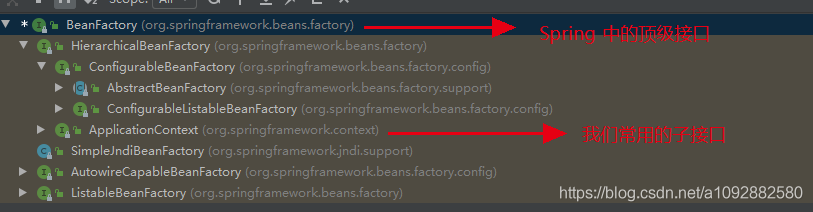

# Spring学习笔记 - 01

## 1. 程序的耦合和解耦

> - 耦合：简单来说就是**程序间的依赖关系**，在开发中我们应该尽量做到**编译期不依赖，运行时才依赖**。
> - **解耦**：**降低**程序间的依赖关系。可以通过读取配置文件来获取要创建的对象的全限定类名，并使用反射来创建对象，避免使用 `new` 关键字。

### 1.1 耦合的实例

- 我们以注册 `JDBC` 驱动为例子：

```java
@Test
public void testJdbc() throws Exception {
	// 注册驱动
	Class.forName("com.mysql.jdbc.Driver")
	// 后续操作...
}
123456
```

- 这里为什么我们不使用 `DriverManager.registerDriver(new com.mysql.jdbc.Driver());` 的方式来注册驱动呢？
- 当我们使用 `DriverManager.registerDriver(new com.mysql.jdbc.Driver());` 来注册驱动的时候，我们的测试类就依赖于 `MySQL`的驱动 jar 包。此时如果我们的项目中没有引入驱动 jar 包，那么测试类在编译期就会报错 **（Error）**，如下图所示：
  
- 而当我们使用反射的时候，我们的测试类并不依赖于驱动类，对于 `Class.forName()` 来说，此时的 `com,mysql.jdbc.Driver` 仅仅只是一个字符串，只有当运行时找不到该类才会抛出异常 **（Exception）**，如下图所示：
  
- 另一个例子就是在平时开发的三层结构中，我们经常会写以下的代码，在这种情况下，我们说接口和接口实现类耦合度比较高，在后期维护中，如果需要更改接口实现类，修改起来不灵活。

```java
IUserService service = new UserServiceImpl();
```

### 1.2 解耦的实例

- 为了降低耦合度，这里我们可以使用配置文件，配置文件中存放着我们需要用到的类的全限定类名（**唯一标识=全限定类名**），如下所示：

```java
userService=cn.ykf.service.impl.UserServiceImpl
```

- 当我们需要某个类对象的时候，就通过工厂来加载。工厂类代码如下：

```java
/**
 * 获取Bean对象的工厂类，对象单例## 标题
 *
 * @author yukaifan
 * @ClassName BeanFactory
 * @date 2019/12/13 23:24
 */
public class BeanFactory {
    /**
     * 用于加载配置文件的的Properties对象
     */
    private static Properties prop;

    /**
     * 容器，用于存放所有的Bean对象，确保对象都是单例的
     */
    private static Map<String, Object> beans;

    static {
        try {
            // 实例化Properties对象
            prop = new Properties();
            // 获取配置文件路径，使用类加载器（不要使用src路径，因为部署后不存在src目录；也不要使用绝对路径，耦合度高）
            InputStream is = BeanFactory.class.getClassLoader().getResourceAsStream("bean.properties");
            // 加载配置文件
            prop.load(is);

            // 初始化所有Bean对象
            beans = new HashMap<String, Object>();
            // 获取所有BeanName
            Enumeration<Object> keys = prop.keys();
            while (keys.hasMoreElements()) {
                // 取出每个key
                String key = keys.nextElement().toString();
                // 根据key获取全限定类名
                String beanPath = prop.getProperty(key);
                // 反射创建对象
                Object value = Class.forName(beanPath).getConstructor().newInstance();
                // 放进容器
                beans.put(key, value);
            }
        } catch (Exception e) {
            throw new ExceptionInInitializerError("初始化Properties失败...");
        }
    }

    /**
     * 禁止外界初始化
     */
    private BeanFactory() {

    }

    /**
     * 获取bean对象
     *
     * @param beanName bean名称
     * @return bean对象
     */
    public static Object getBean(String beanName) {
        return beans.get(beanName);
    }
}
```

------

## 2. Spring IoC 概念及基本使用

### 2.1 IoC 的概念

- 控制反转（Inversion of Control，缩写IoC）是指把创建对象的权利交给框架。简单来说就是，以前我们创建对象的时候，是通过 `new` 关键字来创建的，这种方式是**主动**的；而通过 IoC，我们把创建对象的任务交给了它，这种方式是**被动**的，我们只需要列出一个清单，表明需要什么对象，IoC 就会帮我们创建好对象，当我们需要使用时，只需要向 IoC 容器获取即可。

### 2.2 入门案例

接下来我们通过账户的业务层和持久层间的依赖关系的案例来演示 Spring 的 IoC。

- 导入依赖

```xml
<dependency>
    <groupId>org.springframework</groupId>
    <artifactId>spring-context</artifactId>
    <version>5.0.2.RELEASE</version>
</dependency>
```

> 注意，因为 Spring 5 版本是用 JDK8 编写的，所以我们的 JDK 版本需要是 8 及以上，同时如果使用 Tomcat 的话， Tomcat 版本要求 8.5 及以上。

- 创建业务层接口和实现类

```java
// 接口
public interface IAccountService {
    /**
     * 模拟保存账户的操作
     */
    void saveAccount();
}
// 实现类
public class AccountServiceImpl implements IAccountService {
	// 这里的依赖关系有待解决
    private IAccountDao dao = new AccountDaoImpl();

    @Override
    public void saveAccount() {
        dao.saveAccount();
    }
}
```

- 创建持久层接口和实现类

```java
// 接口
public interface IAccountDao {
    /**
     * 模拟将账户持久化
     */
    void saveAccount();
}
// 实现类
public class AccountDaoImpl implements IAccountDao {
    @Override
    public void saveAccount() {
        System.out.println("保存账户到数据库...");
    }
}
```

- 编写配置文件`bean.xml` （该文件需要放在类路径下，名称是任意的，但是不能是中文）

```xml
<?xml version="1.0" encoding="UTF-8"?>
<beans xmlns="http://www.springframework.org/schema/beans"
       xmlns:xsi="http://www.w3.org/2001/XMLSchema-instance"
       xsi:schemaLocation="http://www.springframework.org/schema/beans
        http://www.springframework.org/schema/beans/spring-beans.xsd">
    <!-- 配置serive -->
    <bean id="accountService" class="cn.ykf.service.impl.AccountServiceImpl"></bean>
    <!-- 配置dao -->
    <bean id="accountDao" class="cn.ykf.dao.impl.AccountDaoImpl"></bean>
</beans>
```

- 测试代码及运行结果如下

```java
public class IocDemo {
    public static void main(String[] args) {
        // 获取IOC核心容器
        ApplicationContext ac = new ClassPathXmlApplicationContext("bean.xml");
        // 获取对象
        IAccountService service = (IAccountService) ac.getBean("accountService");
        IAccountDao dao = ac.getBean("accountDao", IAccountDao.class);

        System.out.println(service);
        System.out.println(dao);
        service.saveAccount();
    }
}
```


### 2.3 ApplicationContext 接口的常用实现类

> Spring 中工厂的类结构图如下：
> 

在开发中我们一般使用 `BeanFactory` 的子接口 `ApplicationContext`，它的常用实现类如下表：

| 类名称                                 | 作用                                                         |
| -------------------------------------- | ------------------------------------------------------------ |
| **ClassPathXmlApplicationContext**     | 从**类的根路径**加载配置文件，推荐                           |
| FileSystemXmlApplicationContext        | 从**磁盘任意路径**加载配置文件，**必须要有访问权限，不推荐** |
| **AnnotationConfigApplicationContext** | 使用注解配置容器对象时，需要使用此类来创建 Spring 容器。它用来读取注解 |

### 2.4 BeanFactory 和 ApplicationContext 的区别

- `BeanFactory`才是 Spring 核心容器的顶级接口。
  - 在构建核心容器时，创建对象的默认方式为**延迟加载**。也就是说，我们向容器获取对象时，容器才会去创建对象。
- `ApplicationContext`是`BeanFactory`的子接口。
  - 在构建核心容器时，创建对象的默认方式为**立即加载**。也就是容器一旦创建完毕，就会创建配置的所有对象（**singleton对象**）。

## 3. Spring 基于 XML 的 IoC 详解

### 3.1 Bean 标签

- 作用
  - 该标签用于配置要让 Spring 创建的对象，**默认情况下是调用类中的无参构造方法，如果没有无参构造方法则不能创建成功**。
- 属性
  - `id` ：对象的唯一标识，用于获取对象。
  - `class` ： 对象的全限定类名，用于反射创建对象。
  - `scope`： 指定对象的作用范围，有以下取值：
    - `singleton` ： **默认值，单例的。**
    - `prototype` ： **多例的。**
    - `request` ： WEB 项目中，Spring 创建一个 Bean 对象，并将对象存入 request 域中。
    - `session` ： WEB 项目中，Spring 创建一个 Bean 对象，并将对象存入 session 域中。
    - `global-session` ： WEB 项目中，应用在 Portlet 环境，如果没有 Portlet 环境则相当于 session。
  - `init-method` ： 指定类中的初始化方法名称，创建对象前调用。
  - `destroy-method` ： 指定类中的销毁方法名称，销毁对象前调用。
  - `factory-bean` ： 指定工厂 Bean 对象的唯一标识 (Id)，将通过工厂创建对象。
  - `factory-method` ： 指定工厂中创建对象的方法，Spring 会通过该方法来创建对象。

### 3.2 Bean 的作用范围与生命周期

- 单例对象`scope = "singleton"`
  - 一个应用只有一个对象的实例。它的生命周期如下：
    - 对象出生：当容器创建时，对象就被创建了。
    - 对象活着：只要容器没有关闭，那么对象一直存在。
    - 对象死亡：当容器关闭时，对象就被销毁了。
- 多例对象`scope = "prototype"`
  - 每次访问对象的时候，都会重新创建对象实例。它的生命周期如下：
    - 对象出生：当使用对象时，创建新的对象实例。
    - 对象活着：只要对象在使用中，对象就一直存在。
    - 对象死亡：当对象长时间未使用，被 Java 的垃圾回收器回收。

### 3.3 实例化 Bean 的三种方式

1. 使用默认无参构造方法

```xml
<bean id="accountService" class="cn.ykf.service.impl.AccountServiceImpl"></bean>
```

> 在默认情况下，它会根据无参构造方法来创建类对象。如果类中没有无参构造方法，将会创建失败。

1. 使用实例工厂的方法

```java
/**
 * 模拟一个工厂类（该类可能是存在于jar包中的，我们无法通过修改源码的方式来提供默认构造函数）
 *
 * @author yukaifan
 * @ClassName InstanceFactory
 * @date 2019/12/14 11:36
 */
public class InstanceFactory {
    public IAccountService getAccountService() {
        return new AccountServiceImpl();
    }
}
```

~~~xml
<bean id="instanceFactory" class="cn.ykf.factory.InstanceFactory"></bean>
<bean id="accountService" factory-bean="instanceFactory" factory-method="getAccountService"></bean>
~~~


> 先把工厂的创建交给 Spring 来管理，然后再使用工厂中的方法来创建对象。

1. 使用静态工厂的静态方法

```java
public class StaticFactory {
    public static IAccountService getAccountService() {
        return new AccountServiceImpl();
    }
}
```

~~~xml
<bean id="accountService" class="cn.ykf.factory.StaticFactory" factory-method="getAccountService"></bean>
~~~


> 因为是静态工厂，所以无需先创建工厂，直接通过工厂的静态方法来创建对象。

## 4. Spring 的依赖注入

### 4.1 依赖注入的概念

- 依赖注入（Dependency Injection，缩写 DI）是 Spring 框架核心 IoC 的具体实现。当我们把对象的创建交给了 Spring 后，虽然降低了对象间的依赖关系，但是并不会消除。比方说：业务层仍然会调用持久层的方法。那么业务层和持久层的依赖关系，也要靠 Spring 来进行维护。也就是说，当 Spring 在创建业务层对象的时候，会帮我们把持久层对象传入到业务层中，无需我们自己解决。

### 4.2 构造注入

- 构造注入指的是，通过类中的构造方法给成员变量赋值。**这个赋值的操作并不是我们做的，而是通过配置的方式，让 Spring 框架来为我们注入**。具体代码如下：

```java
public class AccountServiceImpl implements IAccountService {
    private String name;
    private Integer age;
    private Date date;

    public AccountServiceImpl(String name, Integer age, Date date) {
        this.name = name;
        this.age = age;
        this.date = date;
    }

    @Override
    public void saveAccount() {
        System.out.println(name + ", " + age + ", " + date);
    }
}
```

~~~xml
<bean id="accountService" class="cn.ykf.service.impl.AccountServiceImpl">
    <constructor-arg name="name" value="test"></constructor-arg>
    <constructor-arg name="age" value="18"></constructor-arg>
    <constructor-arg name="date" ref="date"></constructor-arg>
</bean>
<!-- 配置一个日期对象用于注入到 service 中 -->
<bean id="date" class="java.util.Date"></bean>
~~~


> - `<constructor-arg>`标签用于构造函数注入，属性如下：
>   - `index` ： 指定要注入的参数在构造方法参数列表中索引位置，索引从0开始。
>   - `type` ： 指定要注入的参数的数据类型，该数据类型也是构造方法中某个或某些参数的类型。
>   - `name` ： 指定要注入的参数的名称，**这个是最方便也是最常用的**。
>   - `value` ： 用于提供基本类型和 String 类型的数据。
>   - `ref` ： 用于指定其他 Bean 类型数据，该 Bean 必须是 IoC 容器中的。

### 4.3 设值注入

- 设值注入指的是，通过类中的 `setXxx()` 方法给成员变量赋值。具体代码如下：

```java
public class AccountServiceImpl implements IAccountService {
    private String name;
    private Integer age;
    private Date date;

    public void setName(String name) {
        this.name = name;
    }

    public void setAge(Integer age) {
        this.age = age;
    }

    public void setDate(Date date) {
        this.date = date;
    }

    @Override
    public void saveAccount() {
        System.out.println(name + ", " + age + ", " + date);
    }
}
```

~~~xml
<bean id="accountService" class="cn.ykf.service.impl.AccountServiceImpl">
    <property name="name" value="test"></property>
    <property name="age" value="23"></property>
    <property name="date" ref="date"></property>
</bean>
~~~


> - `<property>`标签用于 set 方法注入，属性如下：
>   - `name` ： 指定注定时所调用的 set 方法名称。
>   - `value` ： 用于提供基本类型和 String 类型的数据。
>   - `ref` ： 用于指定其他 Bean 类型数据，该 Bean 必须是 IoC 容器中的。

### 4.4 注入集合属性

- 注入集合属性指的是，给类中的集合成员变量赋值，它用的也是设值注入的方式，只不过变量的数据类型都是集合。这里我们介绍注入`Array、List、Set、Map、Properties`。具体代码如下：

```java
public class AccountServiceImpl implements IAccountService {
    private String[] myStrs;
    private List<String> myList;
    private Set<String> mySet;
    private Map<String,String> myMap;
    private Properties myProps;

    public void setMyStrs(String[] myStrs) {
        this.myStrs = myStrs;
    }

    public void setMyList(List<String> myList) {
        this.myList = myList;
    }

    public void setMySet(Set<String> mySet) {
        this.mySet = mySet;
    }

    public void setMyMap(Map<String, String> myMap) {
        this.myMap = myMap;
    }

    public void setMyProps(Properties myProps) {
        this.myProps = myProps;
    }

    @Override
    public void saveAccount() {
        System.out.println(Arrays.toString(myStrs));
        System.out.println(myList);
        System.out.println(mySet);
        System.out.println(myMap);
        System.out.println(myProps);
    }
}
```

~~~xml
<bean id="accountService" class="cn.ykf.service.impl.AccountServiceImpl">
    <!-- 给数组注入数据 -->
    <property name="myStrs">
        <array>
            <value>aaa</value>
            <value>bbb</value>
            <value>ccc</value>
        </array>
    </property>
    <!-- 给 List 注入数据 -->
    <property name="myList">
        <list>
            <value>ddd</value>
            <value>eee</value>
            <value>fff</value>
        </list>
    </property>
    <!-- 给 Set 注入数据 -->
    <property name="mySet">
        <set>
            <value>asd</value>
            <value>ddw</value>
            <value>fefe</value>
        </set>
    </property>
    <!-- 给 Map 注入数据 -->
    <property name="myMap">
        <map>
            <entry key="a">
                <value>aaa</value>
            </entry>
            <entry key="b" value="fwewf"></entry>
        </map>
    </property>
    <!-- 给 Properties 注入数据 -->
    <property name="myProps">
        <props>
            <prop key="adas">dasdasdas</prop>
            <prop key="222">dead</prop>
        </props>
    </property>
</bean>
~~~


> - 对于集合类型的注入，可以将所涉及的标签分为两组：
>   - 用于给 List 结构（单列）注入的： `<list>、<array>、<set>`
>   - 用于给 Map 结构（键值对）注入的 ：`<map>、<props>`
> - 当结构相同时，使用的标签可以互换，也就是说，给 List 集合注入数据时，使用 `<array>` 或者 `<set>` 也是可以的。