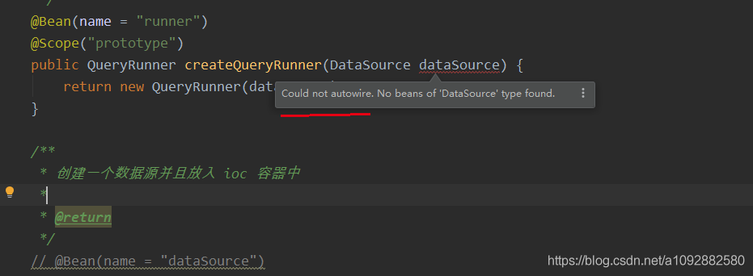
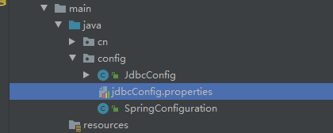

# Spring学习笔记 - 02

## 1. Spring 基于注解的 IoC 详解

如果要使用注解的话，首先需要在配置文件中导入新的命名空间，并且指定要扫描的包。

```xml
<?xml version="1.0" encoding="UTF-8"?>
<beans xmlns="http://www.springframework.org/schema/beans"
       xmlns:xsi="http://www.w3.org/2001/XMLSchema-instance"
       xmlns:context="http://www.springframework.org/schema/context"
       xsi:schemaLocation="http://www.springframework.org/schema/beans
        http://www.springframework.org/schema/beans/spring-beans.xsd
        http://www.springframework.org/schema/context
        http://www.springframework.org/schema/context/spring-context.xsd">

    <!--告知spring在创建容器时要扫描的包，配置所需要的标签不是在beans的约束中，而是一个名称为context名称空间和约束中-->
    <context:component-scan base-package="cn.ykf"/>
</beans>
```

### 1.1 用于创建对象的注解

- `@Component`注解
  - 作用
    - 用于把当前类对象存入 Spring 容器中
  - 属性
    - `value` ： 用于指定 Bean 的唯一标识 （Id）。**默认值是当前类名，且首字母小写**
- 除了 `@Component` 注解外，还有三个衍生注解也是用于创建对象，属性与 `@Component` 一样，见下表：

| 注解名称      | 作用   |
| ------------- | ------ |
| `@Controller` | 表现层 |
| `@Service`    | 业务层 |
| `@Repository` | 持久层 |

> 这三个注解是 Spring 框架为我们提供明确的三层使用的注解，使我们的三层对象更加清晰。

```java
// @Component("accountService")
@Service("accountService")
public class AccountServiceImpl implements IAccountService {
    private IAccountDao accountDao;

    @Override
    public void saveAccount() {
        accountDao.saveAccount();
    }
}

@Repository("accountDao")
public class AccountDaoImpl implements IAccountDao {
    @Override
    public void saveAccount() {
        System.out.println("保存账户到数据库...");
    }
}
```

### 1.2 用于注入数据的注解

- `@Autowired`注解
  - 作用
    - 自动按照**类型注入(By Type)**
    - 容器首先用变量的类型进行查找，如果容器中有**唯一一个 Bean 的类型匹配**，那么就直接注入；如果容器中**没有任何 Bean 的类型与要注入的变量类型匹配**，那么就报错；如果容器中有**多个 Bean 的类型匹配**，那么容器就会以**变量的名称作为 Bean 的 id 进行查找**，找到匹配的则注入，未找到则报错。
  - 出现位置
    - 变量或者方法上
  - 细节
    - 当使用注解来注入属性时，set 方法可以省略

```java
@service("accountService")
public class AccountServiceImpl implements IAccountService {
    @Autowired
    private IAccountDao accountDao;
	// ....
}
```

- `@Qualifier`注解
  - 作用
    - 在**按照类型注入的基础之上再按照名称注入**。它在给**类成员注入时不能单独使用，必须和 `@Autowired` 一起使用**。但是在给方法参数注入时可以单独使用。
  - 属性
    - `value` ： 用于指定注入 Bean 的唯一标识 （Id）

```java
@service("accountService")
public class AccountServiceImpl implements IAccountService {
    @Autowired
    @Qualifier("accountDao")
    private IAccountDao accountDao;
	// ...
}
```

- `@Resource`注解
  - 作用
    - 自动按照**名称注入(By Name)**，直接按照 Bean 的 Id 进行注入，它可以独立使用。
- 属性
  - `name` ： 指定注入 Bean 的 id

```java
import javax.annotation.Resource;

@service("accountService")
public class AccountServiceImpl implements IAccountService {
    // @Autowired
    // @Qualifier("accountDao")
    @Resource(name = "accountDao")
    private IAccountDao accountDao;
    // ...
}
```

> 如果报错 `Cannot resolve symbol 'Resource'` ，那么导入`javax.annotation` 的依赖即可

```xml
<!-- Javax Annotation -->
<dependency>
    <groupId>javax.annotation</groupId>
    <artifactId>javax.annotation-api</artifactId>
    <version>1.3.2</version>
</dependency>
```

> 以上三个注解都只能注入其他 Bean 类型的数据，而基本类型和 String 类型需要使用下面注解。

- `@Value`注解
  - 作用
    - 注入基于类型和 String 类型数据
  - 属性
    - `value` ： 用于指定数据的值。它可以使用 Spring 中的 SpEL( Spring 的 el 表达式，写法：`${表达式}`）

### 1.3 用于改变作用范围的

- `@Scope`注解
  - 作用
    - 指定 Bean 的作用范围
  - 属性
    - `value` ： 指定范围的取值。常用取值为 `singleton、prototype`

### 1.4 和生命周期有关

- `@PreDestroy`注解
  - 作用
    - 用于指定销毁方法
- `@PostConstruct`注解
  - 作用
    - 用于指定初始化方法

```java
@PostConstruct
public void init() {
    System.out.println("初始化方法执行了");
}

@PreDestroy
public void destroy() {
    System.out.println("销毁方法执行了");
}
```

### 1.5 XML 和 注解方式的比较

- 注解的优势
  - 配置简单，维护方便
- XML 的优势
  - 修改时无需修改源码，不涉及重新编译和部署
- Spring 管理 Bean 方式的比较

|               | 基于 XML 配置                                                | 基于注解配置                                     |
| ------------- | ------------------------------------------------------------ | ------------------------------------------------ |
| Bean 定义     | `<bean id = "..." class = "..." />`                          | `@Component、@Controller、@Service、@Repository` |
| Bean 名称     | 通过 `id` 或者 `name` 属性指定                               | `@Component("user")`                             |
| Bean 注入     | 通过`<property>` 或者 `<constructor-arg>` 标签注入           | `@Autowired、@Qualifier、@Resource`              |
| Bean 作用范围 | 通过`scope` 属性指定                                         | `@Scope`                                         |
| Bean 生命周期 | 通过 `init-method` 或者 `destroy-method` 属性指定初始化和销毁方法 | `@PostConstruct、@PreDestroy`                    |
| Bean 适合场景 | Bean 来自于第三方，无法修改源码                              | Bean 的实现类由自己开发                          |

## 2. 案例：实现账户的 CRUD 操作

### 2.1 XML 方式

- 导入相关依赖

```xml
<dependencies>
    <dependency>
        <groupId>org.springframework</groupId>
        <artifactId>spring-context</artifactId>
        <version>5.0.2.RELEASE</version>
    </dependency>
    <!-- https://mvnrepository.com/artifact/commons-dbutils/commons-dbutils -->
    <dependency>
        <groupId>commons-dbutils</groupId>
        <artifactId>commons-dbutils</artifactId>
        <version>1.4</version>
    </dependency>
    
    <dependency>
        <groupId>mysql</groupId>
        <artifactId>mysql-connector-java</artifactId>
        <version>5.1.6</version>
    </dependency>

    <dependency>
        <groupId>c3p0</groupId>
        <artifactId>c3p0</artifactId>
        <version>0.9.1.2</version>
    </dependency>

    <dependency>
        <groupId>junit</groupId>
        <artifactId>junit</artifactId>
        <version>4.12</version>
    </dependency>
</dependencies>
```

- 创建数据库表并编写对应实体类

```sql
create table account(
	id int primary key auto_increment,
	name varchar(40),
	balance doule
)character set utf8 collate utf8_general_ci;

insert into account(name,balance) values('aaa',1000);
insert into account(name,balance) values('bbb',1000);
insert into account(name,balance) values('ccc',1000);
123456789
public class Account implements Serializable {
    private Integer id;
    private String name;
    private Double balance;

    public Integer getId() {
        return id;
    }

    public void setId(Integer id) {
        this.id = id;
    }

    public String getName() {
        return name;
    }

    public void setName(String name) {
        this.name = name;
    }

    public Double getBalance() {
        return balance;
    }

    public void setBalance(Double balance) {
        this.balance = balance;
    }

    @Override
    public String toString() {
        return "Account{" +
                "id=" + id +
                ", name='" + name + '\'' +
                ", balance=" + balance +
                '}';
    }
}
```

- 编写业务层接口和实现类

```java
// 接口
public interface IAccountService {
    /**
     * 查询所有账户
     * @return
     */
    List<Account> listAllAccounts();

    /**
     * 根据id查询
     * @param accountId
     * @return
     */
    Account getAccountById(Integer accountId);

    /**
     * 保存
     * @param account
     * @return
     */
    int saveAccount(Account account);

    /**
     * 更新
     * @param account
     * @return
     */
    int updateAccount(Account account);

    /**
     * 删除
     * @param accountId
     * @return
     */
    int removeAccount(Integer accountId);
}
// 实现类
public class AccountServiceImpl implements IAccountService {

    private IAccountDao accountDao;

    public void setAccountDao(IAccountDao accountDao) {
        this.accountDao = accountDao;
    }

    @Override
    public List<Account> listAllAccounts() {
        return accountDao.listAllAccounts();
    }

    @Override
    public Account getAccountById(Integer accountId) {
        return accountDao.getAccountById(accountId);
    }

    @Override
    public int saveAccount(Account account) {
        return accountDao.saveAccount(account);
    }

    @Override
    public int updateAccount(Account account) {
        return accountDao.updateAccount(account);
    }

    @Override
    public int removeAccount(Integer accountId) {
        return accountDao.removeAccount(accountId);
    }
}
```

- 编写持久层接口和实现类

```java
// 接口
public interface IAccountDao {
    /**
     * 查询所有账户
     *
     * @return
     */
    List<Account> listAllAccounts();

    /**
     * 根据id查询
     *
     * @param accountId
     * @return
     */
    Account getAccountById(Integer accountId);

    /**
     * 保存
     *
     * @param account
     * @return
     */
    int saveAccount(Account account);

    /**
     * 更新
     *
     * @param account
     * @return
     */
    int updateAccount(Account account);

    /**
     * 删除
     *
     * @param accountId
     * @return
     */
    int removeAccount(Integer accountId);
}
// 实现类
public class AccountDaoImpl implements IAccountDao {

    private QueryRunner runner;

    public void setRunner(QueryRunner runner) {
        this.runner = runner;
    }

    @Override
    public List<Account> listAllAccounts() {
        try {
            return runner.query("SELECT * FROM account", new BeanListHandler<Account>(Account.class));
        } catch (SQLException e) {
            throw new RuntimeException(e);
        }
    }

    @Override
    public Account getAccountById(Integer accountId) {
        try {
            return runner.query("SELECT * FROM account WHERE id = ?", accountId, new BeanHandler<Account>(Account.class));
        } catch (SQLException e) {
            throw new RuntimeException(e);
        }
    }

    @Override
    public int saveAccount(Account account) {
        try {
            return runner.update("INSERT INTO account(name,balance) VALUES(?,?)", account.getName(), account.getBalance());
        } catch (SQLException e) {
            throw new RuntimeException(e);
        }
    }

    @Override
    public int updateAccount(Account account) {
        try {
            return runner.update("UPDATE account SET name = ?,balance = ? WHERE id = ?", account.getName(), account.getBalance(), account.getId());
        } catch (SQLException e) {
            throw new RuntimeException(e);
        }
    }

    @Override
    public int removeAccount(Integer accountId) {
        try {
            return runner.update("DELETE FROM account WHERE id = ?", accountId);
        } catch (SQLException e) {
            throw new RuntimeException(e);
        }
    }
}
```

编写 Spring 配置文件`bean.xml`

```xml
<?xml version="1.0" encoding="UTF-8"?>
<beans xmlns="http://www.springframework.org/schema/beans"
       xmlns:xsi="http://www.w3.org/2001/XMLSchema-instance"
       xsi:schemaLocation="http://www.springframework.org/schema/beans
        http://www.springframework.org/schema/beans/spring-beans.xsd">
    <!-- 配置service -->
    <bean id="accountService" class="cn.ykf.service.impl.AccountServiceImpl">
        <!-- 注入dao -->
        <property name="accountDao" ref="accountDao"></property>
    </bean>

    <!-- 配置dao -->
    <bean id="accountDao" class="cn.ykf.dao.impl.AccountDaoImpl">
        <!-- 注入QueryRunner -->
        <property name="runner" ref="runner"></property>
    </bean>

    <!-- 配置QueryRunner -->
    <bean id="runner" class="org.apache.commons.dbutils.QueryRunner" scope="prototype">
        <!-- 注入数据源 -->
        <constructor-arg name="ds" ref="dataSource"></constructor-arg>
    </bean>

    <!-- 配置数据源 -->
    <bean id="dataSource" class="com.mchange.v2.c3p0.ComboPooledDataSource">
        <property name="driverClass" value="com.mysql.jdbc.Driver"></property>
        <property name="jdbcUrl" value="jdbc:mysql://localhost:3306/db_demo"></property>
        <property name="user" value="root"></property>
        <property name="password" value="123456"></property>
    </bean>
</beans>
```

- 测试代码如下

```java
public class IAccountServiceTest {

    private ApplicationContext ac;
    private IAccountService service;

    @Before
    public void init() {
        // 获取容器
        ac = new ClassPathXmlApplicationContext("bean.xml");
        // 获取service对象
        service = ac.getBean("accountService", IAccountService.class);
    }

    @Test
    public void testListAllAccounts() {
        List<Account> accounts = service.listAllAccounts();
        accounts.forEach(System.out::println);
    }

    @Test
    public void testGetAccountById() {
        Account account = service.getAccountById(1);
        System.out.println(account);
    }

    @Test
    public void testSaveAccount() {
        Account account = new Account();
        account.setName("test");
        account.setBalance(2000.0);
        int row = service.saveAccount(account);
        Assert.assertEquals(1, row);
    }

    @Test
    public void testUpdateAccount() {
        Account account = service.getAccountById(7);
        account.setBalance(1000.0);
        int row = service.updateAccount(account);
        Assert.assertEquals(1, row);
    }

    @Test
    public void testRemoveAccount() {
        int row = service.removeAccount(7);
        Assert.assertEquals(1, row);
    }
}

```

### 2.2 半注解（XML + 注解）方式

> 如果想使用注解进行配置，那么就可以用到上述注解。

- 业务层代码

```java
@Service("accountService")
public class AccountServiceImpl implements IAccountService {

    @Autowired
    private IAccountDao accountDao;

    // 不需要 set 方法...
    // 业务方法省略...
}
```

- 持久层代码

```java
@Repository("accountDao")
public class AccountDaoImpl implements IAccountDao {

    @Autowired
    private QueryRunner runner;

    // 不需要 set 方法...
    // 持久化方法省略...
}
```

- 配置文件

```xml
<?xml version="1.0" encoding="UTF-8"?>
<beans xmlns="http://www.springframework.org/schema/beans"
       xmlns:xsi="http://www.w3.org/2001/XMLSchema-instance"
       xmlns:context="http://www.springframework.org/schema/context"
       xsi:schemaLocation="http://www.springframework.org/schema/beans
        http://www.springframework.org/schema/beans/spring-beans.xsd
        http://www.springframework.org/schema/context
        http://www.springframework.org/schema/context/spring-context.xsd">

    <!-- 配置注解扫描的包 -->
    <context:component-scan base-package="cn.ykf"></context:component-scan>

    <!-- 配置QueryRunner -->
    <bean id="runner" class="org.apache.commons.dbutils.QueryRunner" scope="prototype">
        <!-- 注入数据源 -->
        <constructor-arg name="ds" ref="dataSource"></constructor-arg>
    </bean>

    <!-- 配置数据源 -->
    <bean id="dataSource" class="com.mchange.v2.c3p0.ComboPooledDataSource">
        <property name="driverClass" value="com.mysql.jdbc.Driver"></property>
        <property name="jdbcUrl" value="jdbc:mysql://localhost:3306/db_demo"></property>
        <property name="user" value="root"></property>
        <property name="password" value="773620096zxc"></property>
    </bean>
</beans>
```

> 无法在 `QueryRunner` 和 `ComboPooledDataSource` 等第三方类上加注解，所以还是需要配置文件。

### 2.3 纯注解方式

- 如果想要使用纯注解，那么我们就需要将配置文件中还存在的配置也使用注解配置，这时候就需要一些新的注解了。
- `@Configuration`注解
  - 作用
    - 用于指定当前类是一个 Spring 配置类，当创建容器时会从该类上加载注解
  - 属性
    - `value` ： 用于指定配置类的字节码
  - 注意
    - 获取容器时需要使用`AnnotationApplicationContext(有 @Configuration 注解的类.class)`

```java
@Configuration
public class SpringConfiguration {
  // ...  
}
```

> 我们已经把配置文件用类来代替了，但是如何配置创建容器时要扫描的包呢？请看下一个注解。

- `@ComponentScan`注解
  - 作用
    - 用于指定 Spring 在初始化容器时要扫描的包。相当于`<context:component-scan base-package="cn.ykf"/>`
  - 属性
    - `value / basePackages` ：两者都是用来指定要扫描的包

```java
@Configuration
@ComponentScan(basePackages = "cn.ykf")
public class SpringConfiguration {
	// ...
}
```

> 我们已经配置好了要扫描的包，但是数据源和 `QueryRunner` 对象如何从配置文件中移除呢？请看下一个注解。

- `@Bean`
  - 作用
    - 该注解**只能写在方法上**，表明使用此方法创建一个对象，并且**放入 Spring 容器**
  - 属性
    - `name` ：用于指定 Bean的 id ，**默认值是当前方法的名称**
  - 细节
    - 当我们使用该注解配置方法时，如果方法有参数，那么 Spring 框架会去容器中查找有没有可用的 Bean 对象。查找的方式和 `@Autowired` 一样
      

```java
@Configuration
@ComponentScan(basePackages = "cn.ykf")
public class SpringConfiguration {
   /**
     * 创建一个 QueryRunner 对象并且放入 ioc 容器中，多例
     *
     * @return
     */
    @Bean(name = "runner")
    @Scope("prototype")
    public QueryRunner createQueryRunner(DataSource dataSource) {
        return new QueryRunner(dataSource);
    }

    /**
     * 创建一个数据源并且放入 ioc 容器中
     *
     * @return
     */
    @Bean(name = "dataSource")
    public DataSource createDataSource() {
        try {
            ComboPooledDataSource ds = new ComboPooledDataSource();
            ds.setDriverClass("com.mysql.jdbc.Driver");
            ds.setJdbcUrl("jdbc:mysql://localhost:3306/db_demo");
            ds.setUser("root");
            ds.setPassword("123456");
            return ds;
        } catch (PropertyVetoException e) {
            throw new RuntimeException(e);
        }
    }
}
```

> 完成到这里时，配置文件就可以移除了，但是因为没有配置文件，同时连接数据库的信息又写死在类上，要怎么把它们配置出来呢？请看下一个注解。

- `@PropertySource`注解
  - 作用
    - 用于加载 `xxxxx.properties` 文件中的配置
  - 属性
    - `value[]` ：用于指定配置文件的位置
  - 细节
    - 如果配置文件是在类路径下，需要写上 `classpath:`

配置文件`jdbcConfig.properties`

```java
jdbc.driver=com.mysql.jdbc.Driver
jdbc.url=jdbc:mysql://localhost:3306/db_demo
jdbc.username=root
jdbc.password=123456
1234
/**
 * Spring 连接 数据库的配置类
 *
 * @author yukaifan
 * @ClassName JdbcConfig
 * @date 2020-02-18 11:45
 */
@Configuration
@PropertySource("classpath:jdbcConfig.properties")
public class JdbcConfig {
    @Value("${jdbc.driver}")
    private String driver;

    @Value("${jdbc.url}")
    private String url;

    @Value("${jdbc.username}")
    private String username;

    @Value("${jdbc.password}")
    private String password;

    /**
     * 创建一个 QueryRunner 对象并且放入 ioc 容器中，多例
     *
     * @return
     */
    @Bean(name = "runner")
    @Scope("prototype")
    public QueryRunner createQueryRunner(DataSource dataSource) {
        return new QueryRunner(dataSource);
    }

    /**
     * 创建一个数据源并且放入 ioc 容器中
     *
     * @return
     */
    @Bean(name = "dataSource")
    public DataSource createDataSource() {
        try {
            ComboPooledDataSource ds = new ComboPooledDataSource();
            ds.setDriverClass(driver);
            ds.setJdbcUrl(url);
            ds.setUser(username);
            ds.setPassword(password);

            return ds;
        } catch (PropertyVetoException e) {
            throw new RuntimeException(e);
        }
    }
}
```

> 此时我们已经有了两个配置类，但是他们还没有关系。如何建立他们的关系呢？请看下一个注解。

- `@Import`
  - 作用
    - 用于导入其他的配置类，被引入的配置类有无 `@Configuration` 注解均可
  - 属性
    - `value[]` ：用于指定其他配置类的字节码

```java
/**
 * Spring 的主配置类
 *
 * @author yukaifan
 * @ClassName SpirngConfiguration
 * @date 2020-02-18 11:10
 */
@Configuration
@ComponentScan(basePackages = "cn.ykf")
@Import({JdbcConfig.class})
public class SpringConfiguration {

}
```

> 我们已经把要配置的都配置好了，但是新的问题产生了，由于没有配置文件了，如何获取容器呢？

```java
ApplicationContext ac = new AnnotationConfigApplicationContext(SpringConfiguration.class);
```

## 3. Spring 整合 JUnit

- 在原本的代码中，我们需要手动获取 IoC 容器，并获取 service 对象

```java
public class IAccountServiceTest {

    private ApplicationContext ac;
    private IAccountService service;

    @Before
    public void init() {
        // 获取容器，使用注解
        ac = new AnnotationConfigApplicationContext(SpringConfiguration.class);
        // 获取service对象
        service = ac.getBean("accountService", IAccountService.class);
    }
    // 测试方法...
}
```

- 但是我们是测试类，应该专注于测试功能，所以需要程序可以帮我们自己创建容器并且注入 service 对象。这时候就需要使用Spring 来整合 JUnit，步骤如下：

1. 导入依赖

```xml
<dependency>
    <groupId>org.springframework</groupId>
    <artifactId>spring-test</artifactId>
    <version>5.0.2.RELEASE</version>
</dependency>
```

> 当我们使用spring 5.x版本的时候，要求junit的版本必须是4.12及以上

1. 使用 `@RunWith` 注解替换 JUnit 原本的运行器

```java
@RunWith(SpringJUnit4ClassRunner.class)
public class IAccountServiceTest {
	// ....
}
```

1. 使用 `@ContextConfiguration` 指定 Spring 配置文件或者配置类的位置

```java
@RunWith(SpringJUnit4ClassRunner.class)
@ContextConfiguration(classes = SpringConfiguration.class)
public class IAccountServiceTest {
	// ....
}
```

> - `@ContextConfiguration`注解
>   - `locations` 属性：指定 XML 文件的位置，加上 `classpath:` 关键字表示在类路径下
>   - `classes` 属性：指定注解类所在的位置

1. 使用 `@Autowired` 注入 service 对象，最终代码如下

```java
@RunWith(SpringJUnit4ClassRunner.class)
@ContextConfiguration(classes = SpringConfiguration.class)
public class IAccountServiceTest {

    @Autowired
    private IAccountService service;

	// 测试方法...
}
```

- 注意，如果数据库配置文件 `jdbcConfig.properties` 没有存放在资源文件夹 `resources` 下的话，那么当项目编译打包时，可能会忽略配置文件，导致运行时找不到配置文件而报错，见下图




- 解决方案为在 `pom.xml` 中指定资源文件位置

```xml
<build>
    <resources>
        <resource>
            <directory>src/main/java</directory>
            <!-- 编译之后包含xml和properties -->
            <includes>
                <include>**/*</include>
            </includes>
        </resource>
    </resources>
</build>
```