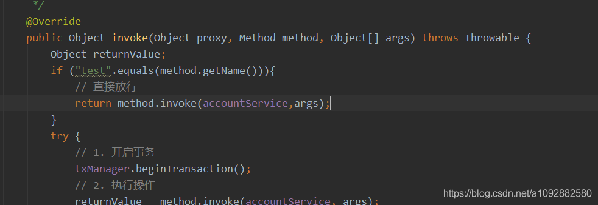
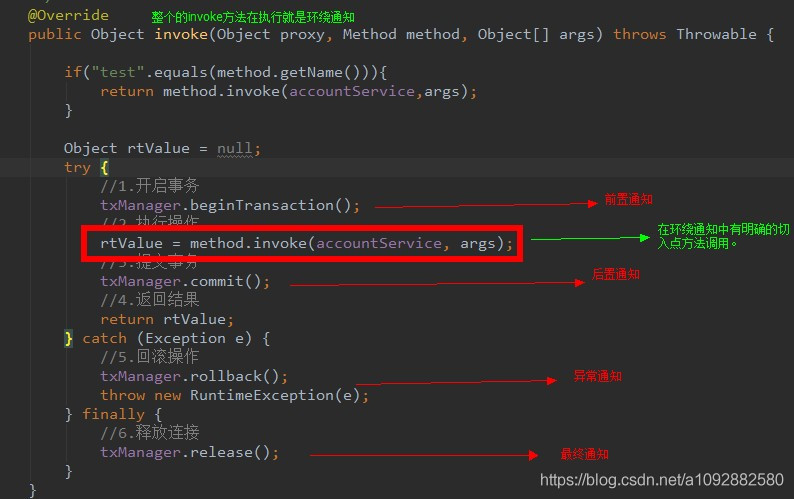

# Spring学习笔记 - 03

## 1. AOP 的引入

- 在上一篇笔记中，我们做了一个账户的 CRUD 的小案例，在讲 AOP 之前，我们先来分析该案例，一步一步地了解为什么要有 AOP 以及什么是 AOP。

### 1.1 案例中存在的问题

- 回顾上篇笔记中的业务层代码

```java
@Service("accountService")
public class AccountServiceImpl implements IAccountService {

    @Autowired
    private IAccountDao accountDao;

    @Override
    public List<Account> listAllAccounts() {
        return accountDao.listAllAccounts();
    }

    @Override
    public Account getAccountById(Integer accountId) {
        return accountDao.getAccountById(accountId);
    }

    @Override
    public int saveAccount(Account account) {
        return accountDao.saveAccount(account);
    }

    @Override
    public int updateAccount(Account account) {
        return accountDao.updateAccount(account);
    }

    @Override
    public int removeAccount(Integer accountId) {
        return accountDao.removeAccount(accountId);
    }
}
```

- 这里存在的问题就是：
  - **事务被自动提交了**。也就是说，我们默认是使用了 `connection .setAutoCommit(true)` 的方式来让事务自动提交。如果我们每次都执行一条 SQL 语句的话，那么不会出现问题，但是如果业务方法一次要执行多条 SQL 语句，那么这种方式可能就会出现问题了。请看下面的演示：
- 修改业务层，添加一个转账方法

```java
// 接口
public interface IAccountService {
    /**
     * 转账
     *
     * @param sourceName 转出账户名
     * @param targetName 转入账户名
     * @param money      转账金额
     */
    void transfer(String sourceName, String targetName, Double money);
}
// 实现类
public class AccountServiceImpl implements IAccountService {

    private IAccountDao accountDao;

    public void setAccountDao(IAccountDao accountDao) {
        this.accountDao = accountDao;
    }

    @Override
    public void transfer(String sourceName, String targetName, Double money) {
        // 获取转出账户和转入账户
        Account source = accountDao.getAccountByName(sourceName);
        Account target = accountDao.getAccountByName(targetName);
        // 转账
        source.setBalance(source.getBalance() - money);
        target.setBalance(target.getBalance() + money);
        // 更新账户
        accountDao.updateAccount(source);
        // 模拟异常
        int i = 1 / 0;
        accountDao.updateAccount(target);
    }
}
```

- 在测试类中调用该方法，执行前后数据库表的记录如下图：
  
- 由于执行有异常，转账失败。但是因为每次执行持久层方法都是独立事务，导致无法实现事务控制 **（ 不符合事务的一致性）**

### 1.2 问题的解决

- 为了解决这个问题，我们可以让**业务层来控制事务的提交和回滚**。
- 创建工具类 `ConnectionUtils`，该类用于获取和线程绑定的 `Connection` 对象，保证每个线程中只能有一个控制事务的 `Connection` 对象

```java
/**
 * 连接的工具类，它用于从数据源中获取一个连接，并且实现和线程的绑定
 *
 * @author yukaifan
 * @ClassName ConnectionUtils
 * @date 2020-02-19 10:54
 */
public class ConnectionUtils {

    private ThreadLocal<Connection> tl = new ThreadLocal<Connection>();

    private DataSource dataSource;

    public void setDataSource(DataSource dataSource) {
        this.dataSource = dataSource;
    }

    /**
     * 获取当前线程上的连接
     *
     * @return
     */
    public Connection getThreadConnection() {
        try {
            // 先从线程获取连接
            Connection conn = tl.get();
            // 判断当前线程上是否有连接
            if (conn == null) {
                // 从数据源中取出一个连接
                conn = dataSource.getConnection();
                // 与当前线程绑定
                tl.set(conn);
            }
            // 返回当前线程的连接
            return conn;
        } catch (Exception e) {
            throw new RuntimeException(e);
        }
    }

    /**
     * 将连接和线程解绑
     */
    public void removeConnection() {
        tl.remove();
    }
}
```

- 创建事务控制类 `TransactionManager`

```java
/**
 * 和事务管理相关的工具类，它包含了开启事务，提交事务，回滚事务和释放连接
 *
 * @author yukaifan
 * @ClassName TransactionManager
 * @date 2020-02-19 10:59
 */
public class TransactionManager {

    private ConnectionUtils connectionUtils;

    public void setConnectionUtils(ConnectionUtils connectionUtils) {
        this.connectionUtils = connectionUtils;
    }

    /**
     * 开启事务
     */
    public void beginTransaction() {
        try {
            connectionUtils.getThreadConnection().setAutoCommit(false);
        } catch (SQLException e) {
            e.printStackTrace();
        }
    }

    /**
     * 提交事务
     */
    public void commit() {
        try {
            connectionUtils.getThreadConnection().commit();
        } catch (SQLException e) {
            e.printStackTrace();
        }
    }

    /**
     * 回滚事务
     */
    public void rollback() {
        try {
            connectionUtils.getThreadConnection().rollback();
        } catch (SQLException e) {
            e.printStackTrace();
        }
    }

    /**
     * 释放连接
     */
    public void release() {
        try {
            // 将连接还回连接池
            connectionUtils.getThreadConnection().close();
            // 将连接与线程解绑，防止下次使用报错。因为连接被关闭后不能再调用
            connectionUtils.removeConnection();
        } catch (SQLException e) {
            e.printStackTrace();
        }
    }
}
```

> 要注意 `release()` 方法中，因为使用连接池，所以调用 `Connection` 对象的 `close()` 方法后，是将连接归还到连接池中，所以要把连接与绑定的线程解绑，不然下次从线程池中取出该线程，并获取绑定的连接进行使用时，由于连接被调用过 `close()` 方法，会抛出异常 `You can't operate on a closed Connection` ***（问题存在于 WEB 工程中）***

- 修改业务层代码，为所有方法加上事务管理

```java
public class AccountServiceImpl implements IAccountService {

    private IAccountDao accountDao;

    private TransactionManager txManager;

    public void setAccountDao(IAccountDao accountDao) {
        this.accountDao = accountDao;
    }

    public void setTxManager(TransactionManager txManager) {
        this.txManager = txManager;
    }

    @Override
    public List<Account> listAllAccounts() {
        try {
            // 1. 开启事务
            txManager.beginTransaction();
            // 2. 执行操作
            List<Account> accounts = accountDao.listAllAccounts();
            // 3. 提交事务
            txManager.commit();
            // 4. 返回结果
            return accounts;
        } catch (Exception e) {
            // 5. 回滚操作
            txManager.rollback();
            throw new RuntimeException(e);
        } finally {
            // 6. 释放连接
            txManager.release();
        }
    }

    @Override
    public Account getAccountById(Integer accountId) {
        try {
            // 1. 开启事务
            txManager.beginTransaction();
            // 2. 执行操作
            Account account = accountDao.getAccountById(accountId);
            // 3. 提交事务
            txManager.commit();
            // 4. 返回结果
            return account;
        } catch (Exception e) {
            // 5. 回滚操作
            txManager.rollback();
            throw new RuntimeException(e);
        } finally {
            // 6. 释放连接
            txManager.release();
        }
    }

    @Override
    public int saveAccount(Account account) {
        try {
            // 1. 开启事务
            txManager.beginTransaction();
            // 2. 执行操作
            int row = accountDao.saveAccount(account);
            // 3. 提交事务
            txManager.commit();
            // 4. 返回结果
            return row;
        } catch (Exception e) {
            // 5. 回滚操作
            txManager.rollback();
            throw new RuntimeException(e);
        } finally {
            // 6. 释放连接
            txManager.release();
        }
    }

    @Override
    public int updateAccount(Account account) {
        try {
            // 1. 开启事务
            txManager.beginTransaction();
            // 2. 执行操作
            int row = accountDao.updateAccount(account);
            // 3. 提交事务
            txManager.commit();
            // 4. 返回结果
            return row;
        } catch (Exception e) {
            // 5. 回滚操作
            txManager.rollback();
            throw new RuntimeException(e);
        } finally {
            // 6. 释放连接
            txManager.release();
        }
    }

    @Override
    public int removeAccount(Integer accountId) {
        try {
            // 1. 开启事务
            txManager.beginTransaction();
            // 2. 执行操作
            int row = accountDao.removeAccount(accountId);
            // 3. 提交事务
            txManager.commit();
            // 4. 返回结果
            return row;
        } catch (Exception e) {
            // 5. 回滚操作
            txManager.rollback();
            throw new RuntimeException(e);
        } finally {
            // 6. 释放连接
            txManager.release();
        }
    }

    @Override
    public void transfer(String sourceName, String targetName, Double money) {
        try {
            // 1. 开启事务
            txManager.beginTransaction();
            // 2. 执行操作

            // 2.1 获取转出账户和转入账户
            Account source = accountDao.getAccountByName(sourceName);
            Account target = accountDao.getAccountByName(targetName);
            // 2.2 转账
            source.setBalance(source.getBalance() - money);
            target.setBalance(target.getBalance() + money);
            // 2.3 更新账户
            accountDao.updateAccount(source);
            // 模拟异常
            int i = 1 / 0;
            accountDao.updateAccount(target);

            // 3. 提交事务
            txManager.commit();
        } catch (Exception e) {
            // 5. 回滚操作
            txManager.rollback();
            throw new RuntimeException(e);
        } finally {
            // 6. 释放连接
            txManager.release();
        }
    }
}
```

- 修改持久层代码，因为我们现在的 `Connection` 对象是由 `ConnectionUtils` 工具类来提供的（与线程绑定），而不是让 `QueryRunner` 对象自动去连接池中取（没有与线程绑定），所以 `QueryRunner` 对象不再需要注入数据源了。

```java
public class AccountDaoImpl implements IAccountDao {

    private QueryRunner runner;

    private ConnectionUtils connectionUtils;

    public void setRunner(QueryRunner runner) {
        this.runner = runner;
    }

    public void setConnectionUtils(ConnectionUtils connectionUtils) {
        this.connectionUtils = connectionUtils;
    }

    // 省略其他方法....
    // 每个方法都需要 Connection对象 作为参数 

    @Override
    public Account getAccountByName(String accountName) {
        try {
            List<Account> accounts = runner.query(connectionUtils.getThreadConnection(), "SELECT * FROM account WHERE name = ?", accountName, new BeanListHandler<Account>(Account.class));
            if (accounts == null || accounts.size() == 0) {
                return null;
            }
            if (accounts.size() > 1) {
                throw new RuntimeException("结果集不唯一，数据有问题！");
            }
            return accounts.get(0);
        } catch (SQLException e) {
            throw new RuntimeException(e);
        }
    }
}
```

- 编写配置文件，管理依赖关系

```xml
<?xml version="1.0" encoding="UTF-8"?>
<beans xmlns="http://www.springframework.org/schema/beans"
       xmlns:xsi="http://www.w3.org/2001/XMLSchema-instance"
       xsi:schemaLocation="http://www.springframework.org/schema/beans
        http://www.springframework.org/schema/beans/spring-beans.xsd">
    <!-- 配置service -->
    <bean id="accountService" class="cn.ykf.service.impl.AccountServiceImpl">
        <!-- 注入dao -->
        <property name="accountDao" ref="accountDao"></property>
        <!-- 注入事务管理器 -->
        <property name="txManager" ref="txManager"></property>
    </bean>

    <!-- 配置dao -->
    <bean id="accountDao" class="cn.ykf.dao.impl.AccountDaoImpl">
        <!-- 注入QueryRunner -->
        <property name="runner" ref="runner"></property>
        <!-- 注入ConnectionUtils -->
        <property name="connectionUtils" ref="connectionUtils"></property>
    </bean>

    <!-- 配置QueryRunner -->
    <bean id="runner" class="org.apache.commons.dbutils.QueryRunner" scope="prototype"></bean>

    <!-- 配置数据源 -->
    <bean id="dataSource" class="com.mchange.v2.c3p0.ComboPooledDataSource">
        <property name="driverClass" value="com.mysql.jdbc.Driver"></property>
        <property name="jdbcUrl" value="jdbc:mysql://localhost:3306/db_demo"></property>
        <property name="user" value="root"></property>
        <property name="password" value="773620096zxc"></property>
    </bean>

    <!-- 配置 Connection 工具类 -->
    <bean id="connectionUtils" class="cn.ykf.utils.ConnectionUtils">
        <property name="dataSource" ref="dataSource"></property>
    </bean>

    <!-- 配置事务管理器 -->
    <bean id="txManager" class="cn.ykf.utils.TransactionManager">
        <property name="connectionUtils" ref="connectionUtils"></property>
    </bean>
</beans>
```

### 1.3 新的问题

- 通过对业务层加上事务控制，此时的转账方法已经可以正常运行，但是由于我们的业务层每个方法都加上了事务控制，所以显得**业务层的方法特别臃肿，业务核心代码可能就 `accountDao.removeAccount(accountId);` 这么一句，其余的都是和事务有关，这样也就造成了业务层方法的耦合度很高**。
- 如果此时我们的 `TransactionManager` 类中的方法名进行了更改，那么我们需要在每处调用的地方都进行修改，这样不利于我们后期的开发。

### 1.4 新问题的解决

- 那么如何解决呢？这里我们可以使用动态代理，把事务的控制交给代理对象，关于动态代理的基本使用看这里： [动态代理入门](https://blog.csdn.net/a1092882580/article/details/104394934)
- 修改业务层代码，将其恢复原样，不再添加事务的控制代码
- 创建代理工厂，用于获取 service 的代理对象

```java
/**
 * 用于创建Service的代理对象的工厂
 *
 * @author yukaifan
 * @ClassName BeanFactory
 * @date 2020-02-19 17:00
 */
public class BeanFactory {
    private IAccountService accountService;

    private TransactionManager txManager;

    public final void setAccountService(IAccountService accountService) {
        this.accountService = accountService;
    }

    public void setTxManager(TransactionManager txManager) {
        this.txManager = txManager;
    }

    /**
     * 获取Service代理对象
     *
     * @return
     */
    public IAccountService getAccountService() {
        return (IAccountService) Proxy.newProxyInstance(accountService.getClass().getClassLoader(),
                accountService.getClass().getInterfaces(),
                new InvocationHandler() {
                    /**
                     * 添加对事务的支持
                     * @param proxy
                     * @param method
                     * @param args
                     * @return
                     * @throws Throwable
                     */
                    @Override
                    public Object invoke(Object proxy, Method method, Object[] args) throws Throwable {
                        try {
                            // 1. 开启事务
                            txManager.beginTransaction();
                            // 2. 执行操作，获取返回值
                            Object returnValue = method.invoke(accountService, args);
                            // 3. 提交事务
                            txManager.commit();
                            // 4. 返回结果
                            return returnValue;
                        } catch (Exception e) {
                            // 5. 回滚操作
                            txManager.rollback();
                            throw new RuntimeException(e);
                        } finally {
                            // 6. 释放连接
                            txManager.release();
                        }
                    }
                });
    }
}
```

- 修改配置文件

```xml
<!-- 配置代理的service -->
<bean id="proxyAccountService" factory-bean="beanFactory" factory-method="getAccountService"></bean>

<!-- 配置 BeanFactory -->
<bean id="beanFactory" class="cn.ykf.factory.BeanFactory">
    <!-- 注入 service -->
    <property name="accountService" ref="accountService"></property>
    <!-- 注入事务管理器 -->
    <property name="txManager" ref="txManager"></property>
</bean>

<!-- 配置service -->
<bean id="accountService" class="cn.ykf.service.impl.AccountServiceImpl">
    <!-- 注入dao -->
    <property name="accountDao" ref="accountDao"></property>
</bean>
```

> 到这里的时候，改造已经完成，通过代理对象一样可以控制住事务，同时业务层不再需要编写一堆的重复事务控制代码。但是如果每次管理事务的时候，我们都要像这样自己创建代理对象，那不是也挺麻烦的吗？有没有更好的方法呢？这时候就需要 AOP 的出场了。

## 2. AOP 的相关概念

### 2.1 什么是 AOP

- AOP 即面向切面编程，英文全称为 Aspect Oriented Programming
  - 简单的说它就是把我们程序重复的代码抽取出来，在需要执行的时候，**使用动态代理的技术**，在不修改源码的基础上，对我们的已有方法进行增强。
- 作用
  - **在程序运行期间，不修改源码对已有方法进行增强。**
- 优势
  - 减少重复代码
  - 提高开发效率
  - 维护方便

### 2.2 AOP 中的术语

- Joinpoint (连接点)
  - 所谓连接点是指那些**被拦截到的方法**
  - 比如说，我们的业务层中的方法都是连接点，因为我们对业务层中的所有方法都进行了拦截
- Pointcut (切入点)
  - 所谓切入点是指我们要对哪些 Joinpoint 进行拦截的定义，简单来说就是**被增强的方法**
  - 比如说，我们在业务层新增了一个方法 `test()` ，但是在代理工厂中，我们不对该方法进行增强，而是直接放行，那么此时的 `test()` 就不是切入点，仅仅是一个连接点，而其他的方法都被事务管理，也就是切入点
    
- Advice (通知/ 增强)
  - 所谓通知是指拦截到方法之后所要做的事情，简单来说就是**对切入点进行的增强操作**
  - 通知的类型：前置通知，后置通知，异常通知，最终通知，环绕通知
    
- Introduction (引介)
  - 引介是一种特殊的通知，在不修改类代码的前提下，Introduction 可以在运行期为类动态地添加一些方法或 Field
- Target (目标对象)
  - 被代理的对象
- Weaving (织入)
  - 是指把增强应用到目标对象来创建新的代理对象的过程
- Proxy (代理)
  - 一个类被 AOP 织入增强后，就产生一个结果代理类
- Aspect (切面)
  - 是切入点和通知（引介）的结合

## 3. Spring 中基于 XML 的 AOP 配置

### 3.1 入门案例

- 还是以账户的 CRUD 作为基础，在之前案例的基础上进行修改，只是此时不需要自己编写代理工厂，而是使用 AOP 来实现事务的控制
- 如果要使用 AOP ，那么需要导入 `aspectjweaver` 依赖，用于解析切入点表达式

```xml
<dependency>
    <groupId>org.aspectj</groupId>
    <artifactId>aspectjweaver</artifactId>
    <version>1.9.5</version>
</dependency>
```

- 为了使用 AOP，需要在配置文件中导入 AOP 的名称空间

```xml
<?xml version="1.0" encoding="UTF-8"?>
<beans xmlns="http://www.springframework.org/schema/beans"
       xmlns:xsi="http://www.w3.org/2001/XMLSchema-instance"
       xmlns:aop="http://www.springframework.org/schema/aop"
       xsi:schemaLocation="http://www.springframework.org/schema/beans
        http://www.springframework.org/schema/beans/spring-beans.xsd
        http://www.springframework.org/schema/aop
        http://www.springframework.org/schema/aop/spring-aop.xsd">
```

- 将事务管理器类 `TransactionManager` 作为通知类用于增强，编写配置文件

```xml
<!-- 这里省略了 service 、 dao 、 QueryRunner 、 数据源 、 工具类等配置，参照之前的配置文件 -->

<!-- 配置事务管理器 -->
<bean id="txManager" class="cn.ykf.utils.TransactionManager">
    <property name="connectionUtils" ref="connectionUtils"></property>
</bean>

<!-- 配置aop -->
<aop:config>
    <aop:pointcut id="pt1" expression="execution(* cn.ykf.service.impl.*.*(..))"/>
    <aop:aspect id="txAdvice" ref="txManager">
        <!-- 前置通知：开启事务，在切入点方法执行之前执行 -->
        <aop:before method="beginTransaction" pointcut-ref="pt1"></aop:before>
        <!-- 后置通知：提交事务，在切入点方法正常执行之后值。它和异常通知永远只能执行一个 -->
        <aop:after-returning method="commit" pointcut-ref="pt1"></aop:after-returning>
        <!-- 异常通知：回滚事务，在切入点方法执行产生异常之后执行。它和后置通知永远只能执行一个 -->
        <aop:after-throwing method="rollback" pointcut-ref="pt1"></aop:after-throwing>
        <!-- 最终通知：释放连接，无论切入点方法是否正常执行它都会在其后面执行 -->
        <aop:after method="release" pointcut-ref="pt1"></aop:after>
    </aop:aspect>
</aop:config>
```

### 4.2 AOP 的配置步骤

1. 使用 `<bean>` 标签将通知类配置进容器中
2. 使用 `<aop:config>` 标签开始声明 AOP 配置
3. 使用 `<aop:aspect>` 标签开始配置切面

> - `id` 属性用于给切面提供一个唯一标识， `ref` 属性用于引用配置好的通知类 Bean
> - 此标签写在 `<aop:aspect>` 标签内部时只能供当前切面使用；写在 `<aop:aspect>` 标签外部时则供全部切面使用
> - 受到约束，该标签在 `<aop:aspect>` 标签外部时必须出现在 `<aop:aspect>` 标签之前

1. 在 `<aop:aspect>` 标签的内部使用对应标签来配置通知的类型
2. 使用 `<aop:pointcut>` 标签配置切入点表达式

> - `id` 属性用于给切入点表达式提供一个唯一标识，`expression` 属性用于定义切入点表达式

1. 使用 `<aop:xxx>` 标签配置对应的通知类型

> - `<aop:before>`标签用于配置前置通知，指定增强的方法在切入点方法之前执行
>   - `method` 属性：指定通知类中的增强方法名称
>   - `pointcut-ref` 属性：指定切入点表达式的引用
>   - `pointcut` 属性：指定切入点表达式
> - `<aop:after-returning>` 标签用于配置后置通知，指定增强的方法在切入点方法正常运行之后执行，与异常通知是互斥的，属性同上
> - `<aop:afterthrowing>` 标签用于配置异常通知，指定增强的方法在切入点方法产生异常之后执行，与后置通知是互斥的，属性同上
> - `<aop:after>` 标签用于配置最终通知，指定增强的方法无论切入点方法是否产生异常都会执行，属性同上
> - `<aop:arround>` 标签用于配置环绕通知，属性同上

### 4.3 切入点表达式说明

- 切入点表达式用于指定需要增强的方法，使用`execution`关键字来匹配方法的执行，按以下语法进行书写：

  - `execution([访问修饰符] 返回值类型 包名.类名.方法名(参数列表))`

- 标准的切入点表达式写法

  - `public void cn.ykf.service.impl.AccountService.savaAccount(cn.ykf.pojo.Account)`

- 访问修饰符可以省略

  - `void cn.ykf.service.impl.AcccountService.savaAccount(cn.ykf.pojo.Account)`

- 返回值可以使用通配符，表示任意返回值

  - `* cn.ykf.service.impl.AcccountService.savaAccount(cn.ykf.pojo.Account)`

- 包名可以使用通配符，表示任意包。但是有几级包，就需要写几个`*`

  - `* *.*.*.*.AccountServiceImpl.savaAccount(cn.ykf.pojo.Account)`

- 包名可以使用`..`

  表示当前包及其子包

  - `* *..AccountServiceImpl.savaAccount(cn.ykf.pojo.Account)`
  - `* cn..AccountServiceImpl.savaAccount(cn.ykf.pojo.Account)`

- 类名和方法名都可以使用`*`

  来实现通配

  - `* cn..*.*(cn.ykf.pojo.Account)`

- 参数列表可以直接写数据类型，也可以用通配符`*`来表示任意类型，但是必须有参数

  - `* cn..*.*(*)`
  - 如果参数是基本类型或者 String 类型，那么可以直接写名称；如果是引用类型，必须写全限定类名

- 参数列表可以使用`..`表示有无参数均可，有参数可以是任意类型

  - `* cn..*.*(..)`

- 全通配写法

  - `* *..*.*(..)`

- 实际开发中切入点表达式的通常写法（切到业务层实现类下的所有方法）

  - `* cn.ykf.service.impl.*.*(..)`

### 4.4 环绕通知

- 环绕通知是 Spring 框架为我们提供的一种可以在代码中手动控制增强代码什么时候执行的方式，一般情况下都是**单独使用的**
- 在配置文件中使用 `<aop:around>` 来配置环绕通知

```xml
<!-- 配置aop -->
<aop:config>
    <aop:pointcut id="pt1" expression="execution(* cn.ykf.service.impl.*.*(..))"/>
    <aop:aspect id="txAdvice" ref="txManager">
        <!-- 配置环绕通知 -->
        <aop:around method="aroundTransaction" pointcut-ref="pt1"></aop:around>
    </aop:aspect>
</aop:config>
```

- 在通知类中编写环绕通知的具体实现

```java
/**
     * 环绕通知，一般单独使用
     */
    public Object aroundTransaction(ProceedingJoinPoint proceedingJoinPoint) {
        // 用于接收返回值
        Object returnValue = null;
        try {
            // 获取切入点方法参数
            Object[] args = proceedingJoinPoint.getArgs();
            // 前置通知：开始事务
            this.beginTransaction();
            // 调用切入点方法
            returnValue = proceedingJoinPoint.proceed(args);
            // 后置通知：提交事务
            this.commit();
        } catch (Throwable throwable) {
            // 异常通知：回滚事务
            this.rollback();
            throwable.printStackTrace();
        } finally {
            // 最终通知：释放连接
            this.release();
        }

        return returnValue;
    }
```

> Spring框架为我们提供了一个接口 `ProceedingJoinPoint`。该接口可以作为环绕通知的方法参数，在运行时由 Spring 为我们自动注入其实现类，可以通过该接口获取切入点方法参数以及调用切入点方法。

## 5. Spring 中基于注解的 AOP 配置

- 如果想使用注解的方式对上述案例进行配置，那么请看下面的使用方式

### 5.1 半注解（XML + 注解）方式

- 修改业务层和持久层代码

```java
@Service("accountService")
public class AccountServiceImpl implements IAccountService {
    @Autowired
    private IAccountDao accountDao;
	// ....
}

@Repository("accounrDao")
public class AccountDaoImpl implements IAccountDao {
	@Autowired
    private QueryRunner runner;
    @Autowired
    private ConnectionUtils connectionUtils;
    // ...
}
```

- 使用 `@Aspect` 注解将事务管理器 `TransactionManager` 声明为切面，并且将方法使用注解配置

```java
@Component("transactionManager")
@Aspect // 声明为切面
public class TransactionManager {

    @Autowired
    private ConnectionUtils connectionUtils;

	/**
     * 定义切入点表达式
     */
    @Pointcut("execution(* cn.ykf.service.impl.*.*(..))")
    private void pt1() {
    }


    /**
     * 前置通知：开启事务
     */
    @Before("pt1()")
    public void beginTransaction() {
        try {
            System.out.println("前置通知：开启事务");
            connectionUtils.getThreadConnection().setAutoCommit(false);
        } catch (SQLException e) {
            e.printStackTrace();
        }
    }

    /**
     * 后置通知：提交事务
     */
    @AfterReturning("pt1()")
    public void commit() {
        try {
            System.out.println("后置通知：提交事务");
            connectionUtils.getThreadConnection().commit();
        } catch (SQLException e) {
            e.printStackTrace();
        }
    }

    /**
     * 异常通知：回滚事务
     */
    @AfterThrowing("pt1()")
    public void rollback() {
        try {
            System.out.println("异常通知：回滚事务");
            connectionUtils.getThreadConnection().rollback();
        } catch (SQLException e) {
            e.printStackTrace();
        }
    }

    /**
     * 最终通知：释放连接
     */
    @After("pt1()")
    public void release() {
        try {
            System.out.println("最终通知：释放连接");
            // 将连接还回连接池
            connectionUtils.getThreadConnection().close();
            // 将连接与线程解绑，防止下次使用报错。因为连接被关闭后不能再调用
            connectionUtils.removeConnection();
        } catch (SQLException e) {
            e.printStackTrace();
        }
    }

    /**
     * 环绕通知，一般单独使用
     * @param proceedingJoinPoint
     * @return
     */
    // @Around("pt1()")
    public Object aroundTransaction(ProceedingJoinPoint proceedingJoinPoint) {
        // 用于接收返回值
        Object returnValue = null;
        try {
            // 获取切入点方法参数
            Object[] args = proceedingJoinPoint.getArgs();
            // 前置通知：开始事务
            this.beginTransaction();
            // 调用切入点方法
            returnValue = proceedingJoinPoint.proceed(args);
            // 后置通知：提交事务
            this.commit();
        } catch (Throwable throwable) {
            // 异常通知：回滚事务
            this.rollback();
            throwable.printStackTrace();
        } finally {
            // 最终通知：释放连接
            this.release();
        }

        return returnValue;
    }
}
```

> - `@Aspect` 注解用于将当前类声明为切面
> - `@Pointcut`注解用于指定切入点表达式，其属性`value`指定表达式的内容
>   - 该注解只能作用在方法上
> - `@Before`注解将当前方法声明为前置通知，其属性`value`既可以指定切入点表达式，也可以指定切入点表达式的引用
>   - 当引用切入点表达式的时候，写法为： `@Before("pt1()")`，要注意 `()` 不可以省略
> - `@AfterReturning` 注解将当前方法声明为后置通知
> - `@AfterThrowing` 注解将当前方法声明为异常通知
> - `@After` 注解将当前方法声明为最终通知
> - `@Around` 注解将当前方法声明为环绕通知通知

- 编写配置文件。注意这里要导入 `xmlns:aop` 和 `xmlns:context` 的名称空间

```xml
<?xml version="1.0" encoding="UTF-8"?>
<beans xmlns="http://www.springframework.org/schema/beans"
       xmlns:xsi="http://www.w3.org/2001/XMLSchema-instance"
       xmlns:aop="http://www.springframework.org/schema/aop"
       xmlns:context="http://www.springframework.org/schema/context"
       xsi:schemaLocation="http://www.springframework.org/schema/beans
        http://www.springframework.org/schema/beans/spring-beans.xsd
        http://www.springframework.org/schema/aop
        http://www.springframework.org/schema/aop/spring-aop.xsd
        http://www.springframework.org/schema/context
        http://www.springframework.org/schema/context/spring-context.xsd">

    <!-- 配置要扫描的包 -->
    <context:component-scan base-package="cn.ykf"></context:component-scan>

    <!-- 开启注解aop的支持 -->
    <aop:aspectj-autoproxy></aop:aspectj-autoproxy>

	<!-- 配置QueryRunner -->
    <bean id="runner" class="org.apache.commons.dbutils.QueryRunner" scope="prototype"></bean>

    <!-- 配置数据源 -->
    <bean id="dataSource" class="com.mchange.v2.c3p0.ComboPooledDataSource">
        <property name="driverClass" value="com.mysql.jdbc.Driver"></property>
        <property name="jdbcUrl" value="jdbc:mysql://localhost:3306/db_demo"></property>
        <property name="user" value="root"></property>
        <property name="password" value="773620096zxc"></property>
    </bean>
</beans>
```

### 5.2 纯注解方式

- 如果要使用纯注解的方式，那么只需要在配置上用 `@EnableAspectJAutoProxy` 注解开启对 AOP 的支持即可

```java
@Configuration
@ComponentScan("cn.ykf")
@EnableAspectJAutoProxy// 开启aop支持
public class SpringConfiguration {
}
```

### 5.3 存在的小问题

- 当使用注解来配置前置通知、后置通知、异常通知以及环绕通知时，由于 Spring 的 bug，导致了通知被调用的顺序有误，如图：
  
  
- 可以看出来，原本正常的调用顺序应该为：`前置通知 --> 后置通知/异常通知 --> 最终通知`，而此时的调用顺序变成了 `前置通知 --> 最终通知 --> 后置通知/异常通知`，如果是在事务管理中，一旦先执行了最终通知，连接被释放，那么再执行事务的提交或者回滚就行不通了。
- 如果想解决这个问题，那么只需要使用环绕通知即可，因为在环绕通知中每种通知的调用顺序是由我们自己决定的，不会受 Spring 的影响。
- **使用注解推荐使用环绕通知！！！**