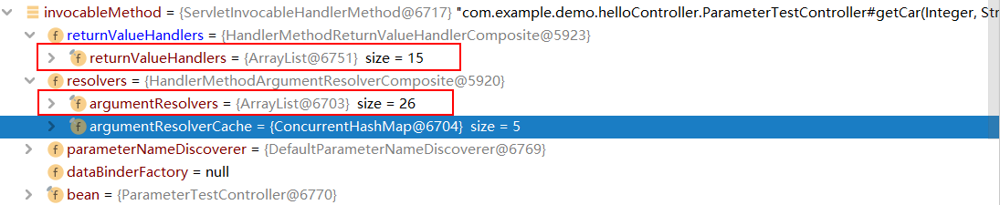
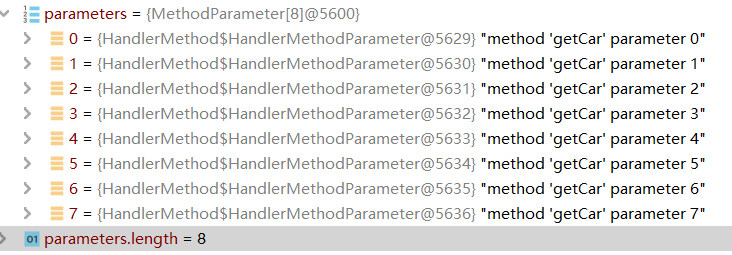
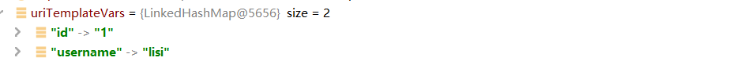
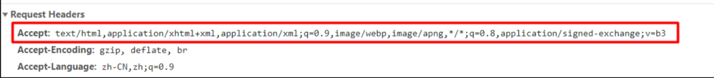
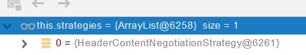
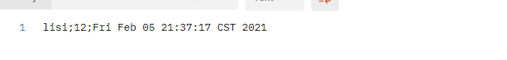
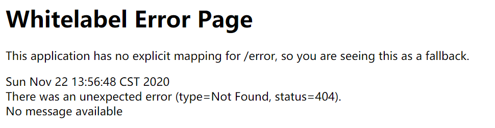
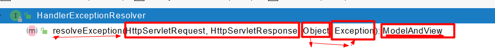
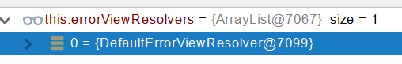

# 05、web开发


## 1、SpringMVC自动配置概览

Spring Boot provides auto-configuration for Spring MVC that **works well with most applications.(大多场景我们都无需自定义配置)**

The auto-configuration adds the following features on top of Spring’s defaults:

- Inclusion of `ContentNegotiatingViewResolver` and `BeanNameViewResolver` beans.

- - 内容协商视图解析器和BeanName视图解析器

- Support for serving static resources, including support for WebJars (covered [later in this document](https://docs.spring.io/spring-boot/docs/current/reference/html/spring-boot-features.html#boot-features-spring-mvc-static-content))).

- - 静态资源（包括webjars）

- Automatic registration of `Converter`, `GenericConverter`, and `Formatter` beans.

- - 自动注册 `Converter，GenericConverter，Formatter `

- Support for `HttpMessageConverters` (covered [later in this document](https://docs.spring.io/spring-boot/docs/current/reference/html/spring-boot-features.html#boot-features-spring-mvc-message-converters)).

- - 支持 `HttpMessageConverters` （后来我们配合内容协商理解原理）

- Automatic registration of `MessageCodesResolver` (covered [later in this document](https://docs.spring.io/spring-boot/docs/current/reference/html/spring-boot-features.html#boot-features-spring-message-codes)).

- - 自动注册 `MessageCodesResolver` （国际化用）

- Static `index.html` support.

- - 静态index.html 页支持

- Custom `Favicon` support (covered [later in this document](https://docs.spring.io/spring-boot/docs/current/reference/html/spring-boot-features.html#boot-features-spring-mvc-favicon)).

- - 自定义 `Favicon`  

- Automatic use of a `ConfigurableWebBindingInitializer` bean (covered [later in this document](https://docs.spring.io/spring-boot/docs/current/reference/html/spring-boot-features.html#boot-features-spring-mvc-web-binding-initializer)).

- - 自动使用 `ConfigurableWebBindingInitializer` ，（DataBinder负责将请求数据绑定到JavaBean上）

> If you want to keep those Spring Boot MVC customizations and make more [MVC customizations](https://docs.spring.io/spring/docs/5.2.9.RELEASE/spring-framework-reference/web.html#mvc) (interceptors, formatters, view controllers, and other features), you can add your own `@Configuration` class of type `WebMvcConfigurer` but **without** `@EnableWebMvc`.
>
> **不用@EnableWebMvc注解。使用** **`@Configuration`** **+** **`WebMvcConfigurer`** **自定义规则**


> If you want to provide custom instances of `RequestMappingHandlerMapping`, `RequestMappingHandlerAdapter`, or `ExceptionHandlerExceptionResolver`, and still keep the Spring Boot MVC customizations, you can declare a bean of type `WebMvcRegistrations` and use it to provide custom instances of those components.
>
> **声明** **`WebMvcRegistrations`** **改变默认底层组件**


> If you want to take complete control of Spring MVC, you can add your own `@Configuration` annotated with `@EnableWebMvc`, or alternatively add your own `@Configuration`-annotated `DelegatingWebMvcConfiguration` as described in the Javadoc of `@EnableWebMvc`.
>
> **使用** **`@EnableWebMvc+@Configuration+DelegatingWebMvcConfiguration 全面接管SpringMVC`**

## 2、简单功能分析

### 2.1、静态资源访问

#### 1、静态资源目录

只要静态资源放在类路径下： called `/static` (or `/public` or `/resources` or `/META-INF/resources`

访问 ： 当前项目根路径/ + 静态资源名 


原理： 静态映射/**。

请求进来，先去找Controller看能不能处理。不能处理的所有请求又都交给静态资源处理器。静态资源也找不到则响应404页面


改变默认的静态资源路径

```yaml
spring:
  mvc:
    static-path-pattern: /res/**

  resources:
    static-locations: [classpath:/haha/]
```

#### 2、静态资源访问前缀

默认无前缀

```
spring:
  mvc:
    static-path-pattern: /res/**
```

当前项目 + static-path-pattern + 静态资源名 = 静态资源文件夹下找

#### 3、webjar

自动映射 /[webjars](http://localhost:8080/webjars/jquery/3.5.1/jquery.js)/**

https://www.webjars.org/

```xml
        <dependency>
            <groupId>org.webjars</groupId>
            <artifactId>jquery</artifactId>
            <version>3.5.1</version>
        </dependency>
```

访问地址：[http://localhost:8080/webjars/**jquery/3.5.1/jquery.js**](http://localhost:8080/webjars/jquery/3.5.1/jquery.js)  后面地址要按照依赖里面的包路径

### 2.2、欢迎页支持

- 静态资源路径下  index.html

- - 可以配置静态资源路径
  - 但是不可以配置静态资源的访问前缀。否则导致 index.html不能被默认访问

```yaml
spring:
#  mvc:
#    static-path-pattern: /res/**   这个会导致welcome page功能失效

  resources:
    static-locations: [classpath:/haha/]

# 新版本是
	web:
	 resources:
	  static-locations: [classpath:/haha/]
```

- controller能处理/index

### 2.3、自定义 Favicon

favicon.ico 放在静态资源目录下即可。

```yaml
spring:
#  mvc:
#    static-path-pattern: /res/**   这个会导致 Favicon 功能失效
```

### 2.4、静态资源配置原理

- SpringBoot启动默认加载  xxxAutoConfiguration 类（自动配置类）
- SpringMVC功能的自动配置类 WebMvcAutoConfiguration，生效

```java
@Configuration(proxyBeanMethods = false)
@ConditionalOnWebApplication(type = Type.SERVLET)
@ConditionalOnClass({ Servlet.class, DispatcherServlet.class, WebMvcConfigurer.class })
@ConditionalOnMissingBean(WebMvcConfigurationSupport.class)
@AutoConfigureOrder(Ordered.HIGHEST_PRECEDENCE + 10)
@AutoConfigureAfter({ DispatcherServletAutoConfiguration.class, TaskExecutionAutoConfiguration.class,
        ValidationAutoConfiguration.class })
public class WebMvcAutoConfiguration {}
```

- 给容器中配了什么。

```java
    @Configuration(
        proxyBeanMethods = false
    )
    @Import({WebMvcAutoConfiguration.EnableWebMvcConfiguration.class})
    @EnableConfigurationProperties({WebMvcProperties.class, ResourceProperties.class, WebProperties.class})
    @Order(0)
    public static class WebMvcAutoConfigurationAdapter implements WebMvcConfigurer {}
```

- 配置文件的相关属性和xxx进行了绑定。WebMvcProperties = **spring.mvc**、ResourceProperties = **spring.resources**、**新版本添加了** WebProperties = **spring.web**，而static-locations也存在于web下的Resource下

```java
@ConfigurationProperties(
    prefix = "spring.mvc"
)
public class WebMvcProperties {}
```

```java
@Deprecated
@ConfigurationProperties(
    prefix = "spring.resources",
    ignoreUnknownFields = false
)
public class ResourceProperties extends Resources {}
```

```java
@ConfigurationProperties("spring.web")
public class WebProperties {}
```


#### 1、配置类只有一个有参构造器

```java
    //有参构造器所有参数的值都会从容器中确定
//ResourceProperties resourceProperties；获取和spring.resources绑定的所有的值的对象
//WebProperties webProperties 获取spring.web绑定的值，新版本添加的
//WebMvcProperties mvcProperties 获取和spring.mvc绑定的所有的值的对象
//ListableBeanFactory beanFactory Spring的beanFactory
//HttpMessageConverters 找到所有的HttpMessageConverters
//ResourceHandlerRegistrationCustomizer 找到 资源处理器的自定义器。=========
//DispatcherServletPath  
//ServletRegistrationBean   给应用注册Servlet、Filter....
    public WebMvcAutoConfigurationAdapter(ResourceProperties resourceProperties, WebProperties webProperties, WebMvcProperties mvcProperties, ListableBeanFactory beanFactory, ObjectProvider<HttpMessageConverters> messageConvertersProvider, ObjectProvider<WebMvcAutoConfiguration.ResourceHandlerRegistrationCustomizer> resourceHandlerRegistrationCustomizerProvider, ObjectProvider<DispatcherServletPath> dispatcherServletPath, ObjectProvider<ServletRegistrationBean<?>> servletRegistrations) {
            this.resourceProperties = (Resources)(resourceProperties.hasBeenCustomized() ? resourceProperties : webProperties.getResources());
            this.mvcProperties = mvcProperties;
            this.beanFactory = beanFactory;
            this.messageConvertersProvider = messageConvertersProvider;
            this.resourceHandlerRegistrationCustomizer = (WebMvcAutoConfiguration.ResourceHandlerRegistrationCustomizer)resourceHandlerRegistrationCustomizerProvider.getIfAvailable();
            this.dispatcherServletPath = dispatcherServletPath;
            this.servletRegistrations = servletRegistrations;
            this.mvcProperties.checkConfiguration();
        }
```


#### 2、资源处理的默认规则

```java
public void addResourceHandlers(ResourceHandlerRegistry registry) {
            if (!this.resourceProperties.isAddMappings()) {
                logger.debug("Default resource handling disabled");
            } else {
                Duration cachePeriod = this.resourceProperties.getCache().getPeriod();
                CacheControl cacheControl = this.resourceProperties.getCache().getCachecontrol().toHttpCacheControl();
                if (!registry.hasMappingForPattern("/webjars/**")) {
                    this.customizeResourceHandlerRegistration(registry.addResourceHandler(new String[]{"/webjars/**"}).addResourceLocations(new String[]{"classpath:/META-INF/resources/webjars/"}).setCachePeriod(this.getSeconds(cachePeriod)).setCacheControl(cacheControl).setUseLastModified(this.resourceProperties.getCache().isUseLastModified()));
                }

                String staticPathPattern = this.mvcProperties.getStaticPathPattern();
                if (!registry.hasMappingForPattern(staticPathPattern)) {
                    this.customizeResourceHandlerRegistration(registry.addResourceHandler(new String[]{staticPathPattern}).addResourceLocations(WebMvcAutoConfiguration.getResourceLocations(this.resourceProperties.getStaticLocations())).setCachePeriod(this.getSeconds(cachePeriod)).setCacheControl(cacheControl).setUseLastModified(this.resourceProperties.getCache().isUseLastModified()));
                }

            }
        }
```

- 总结①，add-mappings的使用

~~~yaml
spring:
#  mvc:
#    static-path-pattern: /res/**

  web:
    resources:
      static-locations: classpath:/haha/
      add-mappings: false
~~~


==addMappings是==WebResources中的静态类Resources的字段，默认为true，当为false时**默认资源处理已禁用**

- 总结②，webjars的访问原理

  ​	可以直接webjars + 静态资源的名字，是因为在这里已经进行了拼接

- 总结③，静态资源访问要放在哪些包下

~~~java
 public static class Resources {
        private static final String[] CLASSPATH_RESOURCE_LOCATIONS = new String[]{"classpath:/META-INF/resources/", "classpath:/resources/", "classpath:/static/", "classpath:/public/"};
        private String[] staticLocations;
        private boolean addMappings;
        private boolean customized;
        private final WebProperties.Resources.Chain chain;
        private final WebProperties.Resources.Cache cache;

        public Resources() {
            this.staticLocations = CLASSPATH_RESOURCE_LOCATIONS;
            this.addMappings = true;
            this.customized = false;
            this.chain = new WebProperties.Resources.Chain();
            this.cache = new WebProperties.Resources.Cache();
        }
~~~


#### 3、欢迎页的处理规则

在静态类`EnableWebMvcConfiguration`下

~~~java
  //HandlerMapping：处理器映射。保存了每一个Handler能处理哪些请求。
@Bean
        public WelcomePageHandlerMapping welcomePageHandlerMapping(ApplicationContext applicationContext, FormattingConversionService mvcConversionService, ResourceUrlProvider mvcResourceUrlProvider) {
            WelcomePageHandlerMapping welcomePageHandlerMapping = new WelcomePageHandlerMapping(new TemplateAvailabilityProviders(applicationContext), applicationContext, this.getWelcomePage(), this.mvcProperties.getStaticPathPattern());
            welcomePageHandlerMapping.setInterceptors(this.getInterceptors(mvcConversionService, mvcResourceUrlProvider));
            welcomePageHandlerMapping.setCorsConfigurations(this.getCorsConfigurations());
            return welcomePageHandlerMapping;
        }
~~~

点击进入`WelcomePageHandlerMapping`类

```java

   WelcomePageHandlerMapping(TemplateAvailabilityProviders templateAvailabilityProviders,
            ApplicationContext applicationContext, Optional<Resource> welcomePage, String staticPathPattern) {
        if (welcomePage.isPresent() && "/**".equals(staticPathPattern)) {
            //要用欢迎页功能，必须是/**
            logger.info("Adding welcome page: " + welcomePage.get());
            setRootViewName("forward:index.html");
        }
        else if (welcomeTemplateExists(templateAvailabilityProviders, applicationContext)) {
            // 调用Controller  /index
            logger.info("Adding welcome page template: index");
            setRootViewName("index");
        }
    }
```

## 3、请求参数处理

### 0、请求映射

#### 1、rest使用与原理

- @xxxMapping；
- Rest风格支持（使用**HTTP**请求方式动词来表示对资源的操作）

- - 以前：/getUser  获取用户   /deleteUser  删除用户   /editUser  修改用户    /saveUser  保存用户
  - 现在： /user   GET-获取用户   DELETE-删除用户   PUT-修改用户    POST-保存用户
  - 核心Filter；HiddenHttpMethodFilter

- - - 用法： 表单method=post，隐藏域 _method=put
    - SpringBoot中手动开启

- - 扩展：如何把_method 这个名字换成我们自己喜欢的。

**分析过程：**

①

```java
@RestController
public class UserController {
    @RequestMapping(value = "/user",method = RequestMethod.GET)
    public String getUser(){
        return "GET-张三";
    }

    @RequestMapping(value = "/user",method = RequestMethod.POST)
    public String saveUser(){
        return "POST-张三";
    }


    @RequestMapping(value = "/user",method = RequestMethod.PUT)
    public String putUser(){
        return "PUT-张三";
    }

    @RequestMapping(value = "/user",method = RequestMethod.DELETE)
    public String deleteUser(){
        return "DELETE-张三";
    }
}
```

index.html

~~~html
<form action="/user" method="get">
    <input value="get提交" type="submit">
</form>
<form action="/user" method="post">
    <input value="post提交" type="submit">
</form>
<form action="/user" method="put">
    <input value="put提交" type="submit">
</form>
<form action="/user" method="delete">
    <input value="delete提交" type="submit">
</form>
~~~

运行后发现，get请求是get，其他请求都是post

②

我们知道在springMVC中要是开启Rest风格是**通过 org.springframework.web.filter.HiddenHttpMethodFilter 把 POST 请求转化为 PUT 和 DELETE 请求**

那在springBooot的`WebMvcAutoConfiguration`中有没有进行配置呢

```java
@Bean
@ConditionalOnMissingBean({HiddenHttpMethodFilter.class})
@ConditionalOnProperty(
    prefix = "spring.mvc.hiddenmethod.filter",
    name = {"enabled"},
    matchIfMissing = false
)
public OrderedHiddenHttpMethodFilter hiddenHttpMethodFilter() {
        return new OrderedHiddenHttpMethodFilter();
    }
```

存在，名为`hiddenHttpMethodFilter`的方法，从`ConditionalOnProperty`注解中可以看到要进行配置，手动开启，不然就是不开启

~~~yaml
spring:
  mvc:
    hiddenmethod:
      filter:
        enabled: true   #开启页面表单的Rest功能
~~~

继续往里追，查看他的父类`HiddenHttpMethodFilter`，可以看到`doFilterInternal`方法

```java
public class HiddenHttpMethodFilter extends OncePerRequestFilter {
    private static final List<String> ALLOWED_METHODS;
    public static final String DEFAULT_METHOD_PARAM = "_method";
    private String methodParam = "_method";

    public HiddenHttpMethodFilter() {
    }

    public void setMethodParam(String methodParam) {
        Assert.hasText(methodParam, "'methodParam' must not be empty");
        this.methodParam = methodParam;
    }

    protected void doFilterInternal(HttpServletRequest request, HttpServletResponse response, FilterChain filterChain) throws ServletException, IOException {
        HttpServletRequest requestToUse = request;
        if ("POST".equals(request.getMethod()) && request.getAttribute("javax.servlet.error.exception") == null) {
            String paramValue = request.getParameter(this.methodParam);
            if (StringUtils.hasLength(paramValue)) {
                String method = paramValue.toUpperCase(Locale.ENGLISH);
                if (ALLOWED_METHODS.contains(method)) {
                    requestToUse = new HiddenHttpMethodFilter.HttpMethodRequestWrapper(request, method);
                }
            }
        }

        filterChain.doFilter((ServletRequest)requestToUse, response);
    }

    static {
        ALLOWED_METHODS = Collections.unmodifiableList(Arrays.asList(HttpMethod.PUT.name(), HttpMethod.DELETE.name(), HttpMethod.PATCH.name()));
    }

    private static class HttpMethodRequestWrapper extends HttpServletRequestWrapper {
        private final String method;

        public HttpMethodRequestWrapper(HttpServletRequest request, String method) {
            super(request);
            this.method = method;
        }

        public String getMethod() {
            return this.method;
        }
    }
}
```

可以看到获取HttpServletRequest对象，获取请求方法。只有是post且没有异常，才可以进入循环，然后`request.getParameter(this.methodParam)`获取是什么类型的请求，mothodParam是“_method”，之后将小写转换为大写，从静态代码块中判断是哪一类请求PUT，DELETE，PATCH，之后再掉用静态内部类`HttpMethodRequestWrapper`

`HttpMethodRequestWrapper`原生request（post），装饰者模式requesWrapper重写了getMethod方法，返回的是传入的值。

③

修改index.html

```html
<form action="/user" method="get">
    <input value="get提交" type="submit">
</form>
<form action="/user" method="post">
    <input value="post提交" type="submit">
</form>
<form action="/user" method="post">
    <input type="hidden"  name="_method" value="put"/>
    <input value="put提交" type="submit">
</form>
<form action="/user" method="post">
    <input type="hidden"  name="_method" value="DELETE"/>
    <input value="delete提交" type="submit">
</form>
```

④

**结论：Rest原理（表单提交要使用REST的时候）**

- 表单提交会带上**_method=PUT**
- **请求过来被**HiddenHttpMethodFilter拦截

- - 请求是否正常，并且是POST

- - - 获取到**_method**的值。
    - 兼容以下请求；**PUT**.**DELETE**.**PATCH**
    - **原生request（post），包装模式requesWrapper重写了getMethod方法，返回的是传入的值。**
    - **过滤器链放行的时候用wrapper。以后的方法调用getMethod是调用requesWrapper的。**

**Rest使用客户端工具，**

- 如PostMan直接发送Put、delete等方式请求，无需Filter。

⑤

**扩展：**新的注解

```java
@RestController
public class UserController {
//    @RequestMapping(value = "/user",method = RequestMethod.GET)
    @GetMapping("/user")
    public String getUser(){
        return "GET-张三";
    }

//    @RequestMapping(value = "/user",method = RequestMethod.POST)
    @PostMapping("/user")
    public String saveUser(){
        return "POST-张三";
    }


//    @RequestMapping(value = "/user",method = RequestMethod.PUT)
    @PutMapping("/user")
    public String putUser(){
        return "PUT-张三";
    }

//    @RequestMapping(value = "/user",method = RequestMethod.DELETE)
    @DeleteMapping("/user")
    public String deleteUser(){
        return "DELETE-张三";
    }
}
```

自定义

```java
//自定义filter，修改name属性
    @Bean
    public HiddenHttpMethodFilter hiddenHttpMethodFilter(){
        HiddenHttpMethodFilter methodFilter = new HiddenHttpMethodFilter();
        methodFilter.setMethodParam("_m");
        return methodFilter;
    }
```

#### 2、请求映射原理


SpringMVC功能分析都从 org.springframework.web.servlet.DispatcherServlet-》doDispatch（）


```java
protected void doDispatch(HttpServletRequest request, HttpServletResponse response) throws Exception {
        HttpServletRequest processedRequest = request;
        HandlerExecutionChain mappedHandler = null;
        boolean multipartRequestParsed = false;
        WebAsyncManager asyncManager = WebAsyncUtils.getAsyncManager(request);

        try {
            try {
                ModelAndView mv = null;
                Object dispatchException = null;

                try {
                    processedRequest = this.checkMultipart(request);
                    multipartRequestParsed = processedRequest != request;
                    // 找到当前请求使用哪个Handler（Controller的方法）处理
                    mappedHandler = this.getHandler(processedRequest);
                    if (mappedHandler == null) {
                        this.noHandlerFound(processedRequest, response);
                        return;
                    }

                    HandlerAdapter ha = this.getHandlerAdapter(mappedHandler.getHandler());
                    String method = request.getMethod();
                    boolean isGet = "GET".equals(method);
                    if (isGet || "HEAD".equals(method)) {
                        long lastModified = ha.getLastModified(request, mappedHandler.getHandler());
                        if ((new ServletWebRequest(request, response)).checkNotModified(lastModified) && isGet) {
                            return;
                        }
                    }

                    if (!mappedHandler.applyPreHandle(processedRequest, response)) {
                        return;
                    }

                    mv = ha.handle(processedRequest, response, mappedHandler.getHandler());
                    if (asyncManager.isConcurrentHandlingStarted()) {
                        return;
                    }

                    this.applyDefaultViewName(processedRequest, mv);
                    mappedHandler.applyPostHandle(processedRequest, response, mv);
                } catch (Exception var20) {
                    dispatchException = var20;
                } catch (Throwable var21) {
                    dispatchException = new NestedServletException("Handler dispatch failed", var21);
                }

                this.processDispatchResult(processedRequest, response, mappedHandler, mv, (Exception)dispatchException);
            } catch (Exception var22) {
                this.triggerAfterCompletion(processedRequest, response, mappedHandler, var22);
            } catch (Throwable var23) {
                this.triggerAfterCompletion(processedRequest, response, mappedHandler, new NestedServletException("Handler processing failed", var23));
            }

        } finally {
            if (asyncManager.isConcurrentHandlingStarted()) {
                if (mappedHandler != null) {
                    mappedHandler.applyAfterConcurrentHandlingStarted(processedRequest, response);
                }
            } else if (multipartRequestParsed) {
                this.cleanupMultipart(processedRequest);
            }

        }
    }
```

找到当前请求使用哪个Handler（Controller的方法）处理`mappedHandler = this.getHandler(processedRequest);`

HandlerMapping：处理器映射。/xxx->>xxxx


**RequestMappingHandlerMapping**：保存了所有@RequestMapping 和handler的映射规则。


所有的请求映射都在HandlerMapping中。


- SpringBoot自动配置欢迎页的 WelcomePageHandlerMapping 。访问 /能访问到index.html；
- SpringBoot自动配置了默认 的 RequestMappingHandlerMapping
- 请求进来，挨个尝试所有的HandlerMapping看是否有请求信息。

- - 如果有就找到这个请求对应的handler
  - 如果没有就是下一个 HandlerMapping

- 我们需要一些自定义的映射处理，我们也可以自己给容器中放**HandlerMapping**。自定义 **HandlerMapping**

```java
    protected HandlerExecutionChain getHandler(HttpServletRequest request) throws Exception {
        if (this.handlerMappings != null) {
            for (HandlerMapping mapping : this.handlerMappings) {
                HandlerExecutionChain handler = mapping.getHandler(request);
                if (handler != null) {
                    return handler;
                }
            }
        }
        return null;
    }
```

### 1、普通参数与基本注解

#### 1.1、注解

`@PathVariable`、`@RequestHeader`、`@ModelAttribute`、`@RequestParam`、`@MatrixVariable`、`@CookieValue`、`@RequestBody`

```java
@RestController
public class ParameterTestController {


    //  car/2/owner/zhangsan
    @GetMapping("/car/{id}/owner/{username}")
    public Map<String,Object> getCar(@PathVariable("id") Integer id,
                                     @PathVariable("username") String name,
                                     @PathVariable Map<String,String> pv,
                                     @RequestHeader("User-Agent") String userAgent,
                                     @RequestHeader Map<String,String> header,
                                     @RequestParam("age") Integer age,
                                     @RequestParam("inters") List<String> inters,
                                     @RequestParam Map<String,String> params,
                                     @CookieValue("_ga") String _ga,
                                     @CookieValue("_ga") Cookie cookie){


        Map<String,Object> map = new HashMap<>();

//        map.put("id",id);
//        map.put("name",name);
//        map.put("pv",pv);
//        map.put("userAgent",userAgent);
//        map.put("headers",header);
        map.put("age",age);
        map.put("inters",inters);
        map.put("params",params);
        map.put("_ga",_ga);
        System.out.println(cookie.getName()+"===>"+cookie.getValue());
        return map;
    }


    @PostMapping("/save")
    public Map postMethod(@RequestBody String content){
        Map<String,Object> map = new HashMap<>();
        map.put("content",content);
        return map;
    }
```

```java
@Controller
public class AttributionController {

    @GetMapping("/goto")
    public String gotoPage(HttpServletRequest request){
        request.setAttribute("code",200);
        return "forward:/success";
    }

    @ResponseBody
    @GetMapping("/success")
    public Map<Object, Object> success(HttpServletRequest request,
                                       @RequestAttribute("code") String code1){
        Object code = request.getAttribute("code");
        HashMap<Object, Object> map = new HashMap<>();
        map.put("Annotation_code",code1);
        map.put("req_method",code);
        return map;
    }
}
```

矩阵变量

我们知道 `/cars/{path}?xxx&aaa=ccc` queryString 查询字符串，一般用@RequestParam。

`/cars/{path};low=34;brand=byd,audi,yd`； 矩阵变量

例如：页面开发，cookie禁用了，session里面的内容怎么使用？

session.set(a,b)  --------> jsessionid ----------> cookie ----------->  每次发送请求携带

url重写：/abc;jsessionid=xxxx 把cookie的值使用矩阵变量的方法进行传递

```java
 //1、语法： 请求路径：/cars/sell;low=34;brand=byd,audi,yd
    //2、SpringBoot默认是禁用了矩阵变量的功能
    //      手动开启：原理。对于路径的处理。UrlPathHelper进行解析。
    //              removeSemicolonContent（移除分号内容）支持矩阵变量的
    //3、矩阵变量必须有url路径变量才能被解析
    @GetMapping("/cars/{path}")
    public Map carsSell(@MatrixVariable("low") Integer low,
                        @MatrixVariable("brand") List<String> brand,
                        @PathVariable("path") String path){
        Map<String,Object> map = new HashMap<>();

        map.put("low",low);
        map.put("brand",brand);
        map.put("path",path);
        return map;
    }

    // /boss/1;age=20/2;age=10

    @GetMapping("/boss/{bossId}/{empId}")
    public Map boss(@MatrixVariable(value = "age",pathVar = "bossId") Integer bossAge,
                    @MatrixVariable(value = "age",pathVar = "empId") Integer empAge){
        Map<String,Object> map = new HashMap<>();

        map.put("bossAge",bossAge);
        map.put("empAge",empAge);
        return map;

    }
```

手动开启：

在`WebMvcAutoConfiguration`中静态类`WebMvcAutoConfigurationAdapte`r有一个`configurePathMatch`方法，new了`UrlPathHelper`类，有一个`removeSemicolonContent`字段，默认为true，不开启

`WebMvcAutoConfigurationAdapter`继承于`WebMvcConfigurer`接口，并且用适配器模式进行基本实现了，`WebMvcConfigurerAdapter`

方法一：直接继承`WebMvcConfigurer`接口，重写`configurePathMatch`方法

```java
@Configuration(proxyBeanMethods = false)
public class MyConfig implements WebMvcConfigurer {
    @Override
    public void configurePathMatch(PathMatchConfigurer configurer) {
        UrlPathHelper urlPathHelper = new UrlPathHelper();
        urlPathHelper.setRemoveSemicolonContent(false);
        configurer.setUrlPathHelper(urlPathHelper);
    }
}
```

方法二：内部类

```java
@Bean
public WebMvcConfigurer webMvcConfigurer(){
    return new WebMvcConfigurer() {
        @Override
        public void configurePathMatch(PathMatchConfigurer configurer) {
            UrlPathHelper urlPathHelper = new UrlPathHelper();
            urlPathHelper.setRemoveSemicolonContent(false);
            configurer.setUrlPathHelper(urlPathHelper);
        }
    };
}
```

#### 1.2、Servlet API

WebRequest、ServletRequest、MultipartRequest、 HttpSession、javax.servlet.http.PushBuilder、Principal、InputStream、Reader、HttpMethod、Locale、TimeZone、ZoneId

**ServletRequestMethodArgumentResolver  以上的部分参数** （原理看参数处理原理）

```java
@Override
    public boolean supportsParameter(MethodParameter parameter) {
        Class<?> paramType = parameter.getParameterType();
        return (WebRequest.class.isAssignableFrom(paramType) ||
                ServletRequest.class.isAssignableFrom(paramType) ||
                MultipartRequest.class.isAssignableFrom(paramType) ||
                HttpSession.class.isAssignableFrom(paramType) ||
                (pushBuilder != null && pushBuilder.isAssignableFrom(paramType)) ||
                Principal.class.isAssignableFrom(paramType) ||
                InputStream.class.isAssignableFrom(paramType) ||
                Reader.class.isAssignableFrom(paramType) ||
                HttpMethod.class == paramType ||
                Locale.class == paramType ||
                TimeZone.class == paramType ||
                ZoneId.class == paramType);
    }
```

#### 1.3、复杂参数

**Map**、**Model（map、model里面的数据会被放在request的请求域  request.setAttribute）、**Errors/BindingResult、**RedirectAttributes（ 重定向携带数据）**、**ServletResponse（response）**、SessionStatus、UriComponentsBuilder、ServletUriComponentsBuilder

```java
Map<String,Object> map,  Model model, HttpServletRequest request 都是可以给request域中放数据，
request.getAttribute();
```

例子：

```java
@GetMapping("/testParam")
public String testParam(Map<String,Object> map,
                        Model model,
                        HttpServletRequest request,
                        HttpServletResponse response){
    map.put("mapTest","mapTest");
    model.addAttribute("modelTest","modelTest");
    request.setAttribute("requestTest","requestTest");

    Cookie cookie = new Cookie("k1", "v1");
    response.addCookie(cookie);

    return "forward:/success";
}


@ResponseBody
@GetMapping("/success")
public Map<Object, Object> success(HttpServletRequest request,
                                   @RequestAttribute(value = "code",required = false) String code1){
    HashMap<Object, Object> map = new HashMap<>();

    Object code = request.getAttribute("code");
    Object mapTest = request.getAttribute("mapTest");
    Object modelTest = request.getAttribute("modelTest");
    Object requestTest = request.getAttribute("requestTest");

    map.put("Annotation_code",code1);
    map.put("req_method",code);
    map.put("mapTest",mapTest);
    map.put("modelTest",modelTest);
    map.put("requestTest",requestTest);

    return map;
}
```

（看过[参数处理原理](#3、参数处理原理)后）进行Map解析参数值的时候，进入`HandlerMethodArgumentResolverComposite`类中的`resolveArgument`方法，执行`resolver.resolveArgument(parameter, mavContainer, webRequest, binderFactory)`，不会再到`AbstractNamedValueMethodArgumentResolver`类中的`resolveArgument`方法，而是进入`ModelMethodProcessor`类的`resolveArgument`方法

```java
public Object resolveArgument(MethodParameter parameter, @Nullable ModelAndViewContainer mavContainer, NativeWebRequest webRequest, @Nullable WebDataBinderFactory binderFactory) throws Exception {
    Assert.state(mavContainer != null, "ModelAndViewContainer is required for model exposure");
    return mavContainer.getModel();
}
```

`mavContainer`是`ModelAndViewContainer`的缩写，调用`getModel`方法

```java
public ModelMap getModel() {
    if (this.useDefaultModel()) {
        return this.defaultModel;
    } else {
        if (this.redirectModel == null) {
            this.redirectModel = new ModelMap();
        }

        return this.redirectModel;
    }
}
```

`defaultModel`可以看到`private final ModelMap defaultModel = new BindingAwareModelMap();`


**Map参数**，会返回 mavContainer.getModel（）---> BindingAwareModelMap 是Model 也是Map，根据debug显示**model参数**也如此，并且他俩是一个对象


返回到`invokeForRequest`方法，可以看到已经获取了所有参数对象


返回到`invokeAndHandle`方法，参数mavContainer可以看到已经填入的值，**那之后又是怎么放入request域中的呢？**


到了`this.returnValueHandlers.handleReturnValue(returnValue, this.getReturnValueType(returnValue), mavContainer, webRequest);`语句后，`ViewNameMethodReturnValueHandler`类中的`handleReturnValue`方法`mavContainer.setViewName(viewName);`将转发地址放入

```java
public void handleReturnValue(@Nullable Object returnValue, MethodParameter returnType, ModelAndViewContainer mavContainer, NativeWebRequest webRequest) throws Exception {
    if (returnValue instanceof CharSequence) {
        String viewName = returnValue.toString();
        mavContainer.setViewName(viewName);
        if (this.isRedirectViewName(viewName)) {
            mavContainer.setRedirectModelScenario(true);
        }
    } else if (returnValue != null) {
        throw new UnsupportedOperationException("Unexpected return type: " + returnType.getParameterType().getName() + " in method: " + returnType.getMethod());
    }

}
```


返回到`invokeHandlerMethod`方法，进入`getModelAndView(mavContainer, modelFactory, webRequest)`


接下来跳转[目标方法执行完成](#目标方法执行完成)，学习接下来怎么执行的。

#### 1.4、自定义对象参数

可以自动类型转换与格式化，可以级联封装。

```java
@Data
public class Person {
    private String userName;
    private Integer age;
    private Date birth;
    private Pet pet;
}
@Data
@ToString
@NoArgsConstructor
@AllArgsConstructor
public class Pet {
    private String name;
    private int age;
}

 @PostMapping("/saveUser")
    public Person saveUser(Person person){
        return person;
    }
```

html

~~~html
<form action="/saveuser" method="post">
    姓名： <input name="userName"/> <br/>
    年龄： <input name="age"/> <br/>
    生日： <input name="birth"/> <br/>
    宠物姓名：<input name="pet.name"/><br/>
    宠物年龄：<input name="pet.age"/><br>
    <input type="submit" value="保存"/>
</form>
~~~

根据debug显示，**ServletModelAttributeMethodProcessor  这个参数处理器支持**

**原因：**

判断函数：

```java
public boolean supportsParameter(MethodParameter parameter) {
        return parameter.hasParameterAnnotation(ModelAttribute.class) || 
            this.annotationNotRequired && !BeanUtils.isSimpleProperty(parameter.getParameterType());
    }
```

`this.annotationNotRequired`是true和`!BeanUtils.isSimpleProperty(parameter.getParameterType())`也是true，所有返回的为true

`isSimpleProperty`怎么判断

```java
public static boolean isSimpleProperty(Class<?> type) {
    Assert.notNull(type, "'type' must not be null");
    return isSimpleValueType(type) || type.isArray() && isSimpleValueType(type.getComponentType());
}
```

`isSimpleValueType` 判断是否为简单类型

```java
public static boolean isSimpleValueType(Class<?> type) {
    return Void.class != type && Void.TYPE != type && 
        (ClassUtils.isPrimitiveOrWrapper(type) || 
         Enum.class.isAssignableFrom(type) || 
         CharSequence.class.isAssignableFrom(type) || 
         Number.class.isAssignableFrom(type) || 
         Date.class.isAssignableFrom(type) || 
         Temporal.class.isAssignableFrom(type) || 
         URI.class == type || 
         URL.class == type || 
         Locale.class == type || 
         Class.class == type);
}
```


**解析：**

还是这条语句，`args[i] = this.resolvers.resolveArgument(parameter, mavContainer, request, this.dataBinderFactory);`，进去

```java
@Nullable
public final Object resolveArgument(MethodParameter parameter, @Nullable ModelAndViewContainer mavContainer, NativeWebRequest webRequest, @Nullable WebDataBinderFactory binderFactory) throws Exception {
    Assert.state(mavContainer != null, "ModelAttributeMethodProcessor requires ModelAndViewContainer");
    Assert.state(binderFactory != null, "ModelAttributeMethodProcessor requires WebDataBinderFactory");
    String name = ModelFactory.getNameForParameter(parameter);
    ModelAttribute ann = (ModelAttribute)parameter.getParameterAnnotation(ModelAttribute.class);
    if (ann != null) {
        mavContainer.setBinding(name, ann.binding());
    }

    Object attribute = null;
    BindingResult bindingResult = null;
    if (mavContainer.containsAttribute(name)) {
        attribute = mavContainer.getModel().get(name);
    } else {
        try {
            //==========重点=======================
            attribute = this.createAttribute(name, parameter, binderFactory, webRequest);
        } catch (BindException var10) {
            if (this.isBindExceptionRequired(parameter)) {
                throw var10;
            }

            if (parameter.getParameterType() == Optional.class) {
                attribute = Optional.empty();
            } else {
                attribute = var10.getTarget();
            }

            bindingResult = var10.getBindingResult();
        }
    }

    if (bindingResult == null) {
        //==========重点=======================
        WebDataBinder binder = binderFactory.createBinder(webRequest, attribute, name);
        if (binder.getTarget() != null) {
            if (!mavContainer.isBindingDisabled(name)) {
                //===========绑定数据的关键一步==============
                this.bindRequestParameters(binder, webRequest);
            }

            this.validateIfApplicable(binder, parameter);
            if (binder.getBindingResult().hasErrors() && this.isBindExceptionRequired(binder, parameter)) {
                throw new BindException(binder.getBindingResult());
            }
        }

        if (!parameter.getParameterType().isInstance(attribute)) {
            attribute = binder.convertIfNecessary(binder.getTarget(), parameter.getParameterType(), parameter);
        }

        bindingResult = binder.getBindingResult();
    }

    Map<String, Object> bindingResultModel = bindingResult.getModel();
    mavContainer.removeAttributes(bindingResultModel);
    mavContainer.addAllAttributes(bindingResultModel);
    return attribute;
}
```

经过判断是否是注解，是否在mavContainer内有Person对象，显然都没有，那么执行`attribute = this.createAttribute(name, parameter, binderFactory, webRequest);`，创造一个Person实例


执行`WebDataBinder binder = binderFactory.createBinder(webRequest, attribute, name);`，将参数值放入

**WebDataBinder :web数据绑定器，将请求参数的值绑定到指定的JavaBean里面**

**WebDataBinder 利用它里面的 Converters 将请求数据转成指定的数据类型。再次封装到JavaBean中**


**GenericConversionService：在设置每一个值的时候，找它里面的所有converter那个可以将这个数据类型（request带来参数的字符串）转换到指定的类型（JavaBean -- Integer）**

**byte -- > file**

```java
@Nullable
public GenericConverter find(TypeDescriptor sourceType, TypeDescriptor targetType) {
    List<Class<?>> sourceCandidates = this.getClassHierarchy(sourceType.getType());
    List<Class<?>> targetCandidates = this.getClassHierarchy(targetType.getType());
    Iterator var5 = sourceCandidates.iterator();

    while(var5.hasNext()) {
        Class<?> sourceCandidate = (Class)var5.next();
        Iterator var7 = targetCandidates.iterator();

        while(var7.hasNext()) {
            Class<?> targetCandidate = (Class)var7.next();
            ConvertiblePair convertiblePair = new ConvertiblePair(sourceCandidate, targetCandidate);
            GenericConverter converter = this.getRegisteredConverter(sourceType, targetType, convertiblePair);
            if (converter != null) {
                return converter;
            }
        }
    }

    return null;
}
```

未来我们可以给WebDataBinder里面放自己的Converter；

~~~java
@FunctionalInterface
public interface Converter<S, T>
~~~


**private static final class** StringToNumber<T **extends** Number> **implements** Converter<String, T>

例子：

宠物不再采用级联的方式

```html
<form action="/saveUser" method="post">
    姓名： <input name="userName" value="aaa"/> <br/>
    年龄： <input name="age" value="13"/> <br/>
    生日： <input name="birth" value="2019/11/10"/> <br/>
<!--    宠物姓名：<input name="pet.name" value="bbb"/><br/>-->
<!--    宠物年龄：<input name="pet.age" value="22"/><br>-->
    宠物: <input name="pet" value="bbb,22"/>
    <input type="submit" value="保存"/>
</form>
```

运行报错

> Field error in object 'person' on field 'pet': rejected value [bbb,22]; 
>
> codes [typeMismatch.person.pet,typeMismatch.pet,typeMismatch.com.example.demo.bean.Pet,typeMismatch]; 
>
> arguments [org.springframework.context.support.DefaultMessageSourceResolvable: codes [person.pet,pet]; 
>
> arguments []; 
>
> default message [pet]]; 
>
> default message [Failed to convert property value of type 'java.lang.String' to required type 'com.example.demo.bean.Pet' for property 'pet'; nested exception is java.lang.IllegalStateException: Cannot convert value of type 'java.lang.String' to required type 'com.example.demo.bean.Pet' for property 'pet': no matching editors or conversion strategy found]]


解决：自己进行解析，放入配置类中

```java
@Bean
public WebMvcConfigurer webMvcConfigurer(){
    return new WebMvcConfigurer() {
        @Override
        public void configurePathMatch(PathMatchConfigurer configurer) {
            UrlPathHelper urlPathHelper = new UrlPathHelper();
            urlPathHelper.setRemoveSemicolonContent(false);
            configurer.setUrlPathHelper(urlPathHelper);
        }
        @Override
        public void addFormatters(FormatterRegistry registry) {
            registry.addConverter(new Converter<String, Pet>() {
                @Override
                public Pet convert(String source) {
                    if(StringUtils.hasText(source)){
                        Pet pet = new Pet();
                        String[] split = source.split(",");
                        pet.setName(split[0]);
                        pet.setAge(Integer.parseInt(split[1]));
                        return pet;
                    }
                    return null;
                }
            });
        }
    };
}
```


### 2、POJO封装过程

**ServletModelAttributeMethodProcessor**

### 3、参数处理原理

以之前写的为例

~~~java
@GetMapping("/car/{id}/owner/{username}")
    public Map getCar(@PathVariable("id") Integer id,
                      @PathVariable("username") String username,
                      @PathVariable Map<String,String> pv,
                      @RequestHeader("User-Agent") String userAgent,
                      @RequestHeader Map<String,String> header,
                      @RequestParam("age") Integer age,
                      @RequestParam("inters") List<String> inters,
                      @RequestParam Map<String,String> params){

        Map<String,Object> map = new HashMap<>();

        map.put("id",id);
        map.put("name",username);
        map.put("pv",pv);
        map.put("userAgent",userAgent);
        map.put("headers",header);
        map.put("age",age);
        map.put("inters",inters);
        map.put("params",params);
        return map;
    }
~~~

------


#### Handler

- **HandlerMapping中找到能处理请求的Handler（Controller.method()）**

根据之前学习到的请求映射，所有请求都是在`DispatcherServlet`的`doDispatch`方法中

依旧是`mappedHandler = this.getHandler(processedRequest);`

依旧是5个handlerMappings，进入RequestMappingHandlerMapping，映射注册（mappingRegistry）找到当前请求的映射关系


找到了对应的请求，封装在MappingHandler


------


#### HandlerAdapter

- **为当前Handler 找一个适配器 HandlerAdapter； RequestMappingHandlerAdapter**

  `HandlerAdapter ha = this.getHandlerAdapter(mappedHandler.getHandler());`

  `handlerAdapters`有4中

  

  0 - 支持方法上标注@RequestMapping 

  1 - 支持函数式编程的

  ```java
  protected HandlerAdapter getHandlerAdapter(Object handler) throws ServletException {
      if (this.handlerAdapters != null) {
          Iterator var2 = this.handlerAdapters.iterator();
  
          while(var2.hasNext()) {
              HandlerAdapter adapter = (HandlerAdapter)var2.next();
              if (adapter.supports(handler)) {
                  return adapter;
              }
          }
      }
      
  public final boolean supports(Object handler) {
          return handler instanceof HandlerMethod && this.supportsInternal((HandlerMethod)handler);
      }
  ```

  `adapter.supports(handler)`调用supports方法，handler就是`HandlerMethod`类型的

  ------


#### 执行目标方法

- **执行目标方法**

  `mv = ha.handle(processedRequest, response, mappedHandler.getHandler());`

  ha就是RequestMappingHandlerAdapter对象， 进入RequestMappingHandlerAdapter 

  **执行目标方法：**`mav = this.invokeHandlerMethod(request, response, handlerMethod);`

  进入invokeHandlerMethod方法，可以看到 参数解析器（`argumentResolvers`），返回值处理器（`returnValueHandlers`）

  ```java
  protected ModelAndView invokeHandlerMethod(HttpServletRequest request, HttpServletResponse response, HandlerMethod handlerMethod) throws Exception {
      ServletWebRequest webRequest = new ServletWebRequest(request, response);
  
      ModelAndView var15;
      try {
          WebDataBinderFactory binderFactory = this.getDataBinderFactory(handlerMethod);
          ModelFactory modelFactory = this.getModelFactory(handlerMethod, binderFactory);
          ServletInvocableHandlerMethod invocableMethod = this.createInvocableHandlerMethod(handlerMethod);
          if (this.argumentResolvers != null) {
              invocableMethod.setHandlerMethodArgumentResolvers(this.argumentResolvers);
          }
  
          if (this.returnValueHandlers != null) {
              invocableMethod.setHandlerMethodReturnValueHandlers(this.returnValueHandlers);
          }
  
          /..................省略............................/
  
          invocableMethod.invokeAndHandle(webRequest, mavContainer, new Object[0]);
          if (asyncManager.isConcurrentHandlingStarted()) {
              result = null;
              return (ModelAndView)result;
          }
  
          var15 = this.getModelAndView(mavContainer, modelFactory, webRequest);
      } finally {
          webRequest.requestCompleted();
      }
  
      return var15;
  }
  ```

  

  **确定将要执行的目标方法的每一个参数的值是什么;SpringMVC目标方法能写多少种参数类型。取决于参数解析器。**

  

  根据`HandlerMethodArgumentResolve`接口结构可知：**当前解析器是否支持解析这种参数，支持就调用 resolveArgument**

  

  返回值处理器`returnValueHandlers`

  

  将`handlerMethod`再次封装，全都放入`invocableMethod`

  

  **执行目标方法：**

  `invocableMethod.invokeAndHandle(webRequest, mavContainer, new Object[0]);`

  进入，`ServletInvocableHandlerMethod`类`invokeAndHandle`方法

  ```java
  public void invokeAndHandle(ServletWebRequest webRequest, ModelAndViewContainer mavContainer, Object... providedArgs) throws Exception {
          Object returnValue = this.invokeForRequest(webRequest, mavContainer, providedArgs);
          this.setResponseStatus(webRequest);
          if (returnValue == null) {
              if (this.isRequestNotModified(webRequest) || this.getResponseStatus() != null || mavContainer.isRequestHandled()) {
                  this.disableContentCachingIfNecessary(webRequest);
                  mavContainer.setRequestHandled(true);
                  return;
              }
          } else if (StringUtils.hasText(this.getResponseStatusReason())) {
              mavContainer.setRequestHandled(true);
              return;
          }
  
          mavContainer.setRequestHandled(false);
          Assert.state(this.returnValueHandlers != null, "No return value handlers");
  
          try {
              this.returnValueHandlers.handleReturnValue(returnValue, this.getReturnValueType(returnValue), mavContainer, webRequest);
          } catch (Exception var6) {
              if (logger.isTraceEnabled()) {
                  logger.trace(this.formatErrorForReturnValue(returnValue), var6);
              }
  
              throw var6;
          }
      }
  ```

  在下一个语句`this.setResponseStatus(webRequest);`和`HashMap<String, Object> map = new HashMap<>();`加上断点，看会跳转到哪

  

  结果很明显

------

- **如何执行**

  点进`invokeForRequest`方法

  ```java
  @Nullable
      public Object invokeForRequest(NativeWebRequest request, @Nullable ModelAndViewContainer mavContainer, Object... providedArgs) throws Exception {
          Object[] args = this.getMethodArgumentValues(request, mavContainer, providedArgs);
          if (logger.isTraceEnabled()) {
              logger.trace("Arguments: " + Arrays.toString(args));
          }
  
          return this.doInvoke(args);
      }
  ```

  获取值`Object[] args = this.getMethodArgumentValues(request, mavContainer, providedArgs);`

  

  再往下`this.doInvoke(args)`，利用反射进行赋值

------

- **如何确定目标方法每一个参数的值**

  **谁能解析？**

  ```java
  //============InvocableHandlerMethod==========================
  protected Object[] getMethodArgumentValues(NativeWebRequest request, @Nullable ModelAndViewContainer mavContainer, Object... providedArgs) throws Exception {
      MethodParameter[] parameters = this.getMethodParameters();
      if (ObjectUtils.isEmpty(parameters)) {
          return EMPTY_ARGS;
      } else {
          Object[] args = new Object[parameters.length];
  
          for(int i = 0; i < parameters.length; ++i) {
              MethodParameter parameter = parameters[i];
              parameter.initParameterNameDiscovery(this.parameterNameDiscoverer);
              args[i] = findProvidedArgument(parameter, providedArgs);
              if (args[i] == null) {
                  if (!this.resolvers.supportsParameter(parameter)) {
                      throw new IllegalStateException(formatArgumentError(parameter, "No suitable resolver"));
                  }
  
                  try {
                      args[i] = this.resolvers.resolveArgument(parameter, mavContainer, request, this.dataBinderFactory);
                  } catch (Exception var10) {
                      if (logger.isDebugEnabled()) {
                          String exMsg = var10.getMessage();
                          if (exMsg != null && !exMsg.contains(parameter.getExecutable().toGenericString())) {
                              logger.debug(formatArgumentError(parameter, exMsg));
                          }
                      }
  
                      throw var10;
                  }
              }
          }
  
          return args;
      }
  }
  ```

  `MethodParameter[] parameters = this.getMethodParameters();`获取所有的参数

  

  `Object[] args = new Object[parameters.length];`创建一个装参数数据的数组args，最后返回的也是这个数组

  `this.resolvers.supportsParameter(parameter)`  resolvers的26个参数解析器是否支持parameter参数类型

  点进去进入`HandlerMethodArgumentResolverComposite`中`getArgumentResolver`方法，**挨个判断所有参数解析器那个支持解析这个参数**

  ```java
  @Nullable
      private HandlerMethodArgumentResolver getArgumentResolver(MethodParameter parameter) {
          HandlerMethodArgumentResolver result = (HandlerMethodArgumentResolver)this.argumentResolverCache.get(parameter);
          if (result == null) {
              Iterator var3 = this.argumentResolvers.iterator();
  
              while(var3.hasNext()) {
                  HandlerMethodArgumentResolver resolver = (HandlerMethodArgumentResolver)var3.next();
                  if (resolver.supportsParameter(parameter)) {
                      result = resolver;
                      this.argumentResolverCache.put(parameter, resolver);
                      break;
                  }
              }
          }
  
          return result;
      }
  }
  ```

  

  **解析这个参数的值**

  `args[i] = this.resolvers.resolveArgument(parameter, mavContainer, request, this.dataBinderFactory);`

  进入`HandlerMethodArgumentResolverComposite`类中的`resolveArgument`方法，执行`resolver.resolveArgument(parameter, mavContainer, webRequest, binderFactory)`

  再到`AbstractNamedValueMethodArgumentResolver`类中的`resolveArgument`方法

  ```java
  @Nullable
  public final Object resolveArgument(MethodParameter parameter, @Nullable ModelAndViewContainer mavContainer, NativeWebRequest webRequest, @Nullable WebDataBinderFactory binderFactory) throws Exception {
      //获取参数信息
      AbstractNamedValueMethodArgumentResolver.NamedValueInfo namedValueInfo = this.getNamedValueInfo(parameter);
      MethodParameter nestedParameter = parameter.nestedIfOptional();
      //获取参数的值
      Object resolvedName = this.resolveEmbeddedValuesAndExpressions(namedValueInfo.name);
      if (resolvedName == null) {
          throw new IllegalArgumentException("Specified name must not resolve to null: [" + namedValueInfo.name + "]");
      } else {
          Object arg = this.resolveName(resolvedName.toString(), nestedParameter, webRequest);
          if (arg == null) {
              if (namedValueInfo.defaultValue != null) {
                  arg = this.resolveEmbeddedValuesAndExpressions(namedValueInfo.defaultValue);
              } else if (namedValueInfo.required && !nestedParameter.isOptional()) {
                  this.handleMissingValue(namedValueInfo.name, nestedParameter, webRequest);
              }
  
              arg = this.handleNullValue(namedValueInfo.name, arg, nestedParameter.getNestedParameterType());
          } else if ("".equals(arg) && namedValueInfo.defaultValue != null) {
              arg = this.resolveEmbeddedValuesAndExpressions(namedValueInfo.defaultValue);
          }
  
          if (binderFactory != null) {
              WebDataBinder binder = binderFactory.createBinder(webRequest, (Object)null, namedValueInfo.name);
  
              try {
                  arg = binder.convertIfNecessary(arg, parameter.getParameterType(), parameter);
              } catch (ConversionNotSupportedException var11) {
                  throw new MethodArgumentConversionNotSupportedException(arg, var11.getRequiredType(), namedValueInfo.name, parameter, var11.getCause());
              } catch (TypeMismatchException var12) {
                  throw new MethodArgumentTypeMismatchException(arg, var12.getRequiredType(), namedValueInfo.name, parameter, var12.getCause());
              }
  
              if (arg == null && namedValueInfo.defaultValue == null && namedValueInfo.required && !nestedParameter.isOptional()) {
                  this.handleMissingValue(namedValueInfo.name, nestedParameter, webRequest);
              }
          }
  
          this.handleResolvedValue(arg, namedValueInfo.name, parameter, mavContainer, webRequest);
          return arg;
      }
  }
  ```

  `AbstractNamedValueMethodArgumentResolver.NamedValueInfo namedValueInfo = this.getNamedValueInfo(parameter);`获取参数的信息

  ```java
  private AbstractNamedValueMethodArgumentResolver.NamedValueInfo getNamedValueInfo(MethodParameter parameter) {
      AbstractNamedValueMethodArgumentResolver.NamedValueInfo namedValueInfo = (AbstractNamedValueMethodArgumentResolver.NamedValueInfo)this.namedValueInfoCache.get(parameter);
      if (namedValueInfo == null) {
          namedValueInfo = this.createNamedValueInfo(parameter);
          namedValueInfo = this.updateNamedValueInfo(parameter, namedValueInfo);
          this.namedValueInfoCache.put(parameter, namedValueInfo);
      }
  
      return namedValueInfo;
  }
  ```

  获取`namedValueInfo`，例子的第一个参数确实是id

  

  

  `Object arg = this.resolveName(resolvedName.toString(), nestedParameter, webRequest);`获取参数的值，到了这个函数

  ```java
  @Nullable
  protected Object resolveName(String name, MethodParameter parameter, NativeWebRequest request) throws Exception {
      Map<String, String> uriTemplateVars = (Map)request.getAttribute(HandlerMapping.URI_TEMPLATE_VARIABLES_ATTRIBUTE, 0);
      return uriTemplateVars != null ? uriTemplateVars.get(name) : null;
  }
  ```

  uriTemplateVars的值

  

  经过计算：

  
  
  这样这就是一个参数值的获取的流程，然后就在`getMethodArgumentValues`一直循环，匹配需要的参数解析器，然后解析这个参数的值，将其放入args数组中，返回args到`invokeForRequest`带着参数执行`doInvoke`方法，最后返回到执行目标方法`invokeAndHandle`

#### 目标方法执行完成

接着[复杂参数](#1.3、复杂参数)继续，探索转发怎么将Map和Model放入request域中。


将所有的数据都放在 **ModelAndViewContainer**；意思就是模型和视图的容器，包含要去的页面地址View。还包含Model数据。

```java
@Nullable
private ModelAndView getModelAndView(ModelAndViewContainer mavContainer, ModelFactory modelFactory, NativeWebRequest webRequest) throws Exception {
    modelFactory.updateModel(webRequest, mavContainer);
    if (mavContainer.isRequestHandled()) {
        return null;
    } else {
        ModelMap model = mavContainer.getModel();
        ModelAndView mav = new ModelAndView(mavContainer.getViewName(), model, mavContainer.getStatus());
        if (!mavContainer.isViewReference()) {
            mav.setView((View)mavContainer.getView());
        }

        if (model instanceof RedirectAttributes) {
            Map<String, ?> flashAttributes = ((RedirectAttributes)model).getFlashAttributes();
            HttpServletRequest request = (HttpServletRequest)webRequest.getNativeRequest(HttpServletRequest.class);
            if (request != null) {
                RequestContextUtils.getOutputFlashMap(request).putAll(flashAttributes);
            }
        }

        return mav;
    }
}
```

到了`getModelAndView`方法，执行`modelFactory.updateModel(webRequest, mavContainer);`语句，进入查看

到了`updateModel`方法，执行`this.updateBindingResult(request, defaultModel);`语句，进入查看，主要对Model参数的确定和更新，返回到`getModelAndView`

执行`ModelMap model = mavContainer.getModel();`，拿到两个数据后，`ModelAndView mav = new ModelAndView(mavContainer.getViewName(), model, mavContainer.getStatus());`，封装到ModelAndView类型的mav中，model继续判断是否是重定向，是的话再将所要数据放入RequestContext中。

一直返回到`doDispatch`，回到执行目标方法`mv = ha.handle(processedRequest, response, mappedHandler.getHandler());`，总算回到了最初的方法，目标方法执行完成。

------


#### 处理派发结果

`doDispatch`方法继续往下执行

`this.processDispatchResult(processedRequest, response, mappedHandler, mv, (Exception)dispatchException);`

进入查看

进入`processDispatchResult`，执行`this.render(mv, request, response);`，进入

进入`render`，执行`String viewName = mv.getViewName();`，获取视图名，是forward:/success，继续执行`view = this.resolveViewName(viewName, mv.getModelInternal(), locale, request);`，解析视图，获取视图名view，继续执行


执行到`view.render(mv.getModelInternal(), request, response);`，进入

进入`render`，执行`Map<String, Object> mergedModel = this.createMergedOutputModel(model, request, response);`，进入执行`mergedModel.putAll(model);`，意思是将model又放入 **mergedModel** 中，返回

核心：`this.renderMergedOutputModel(mergedModel, this.getRequestToExpose(request), response);`，进入

```java
//InternalResourceView
protected void renderMergedOutputModel(Map<String, Object> model, HttpServletRequest request, HttpServletResponse response) throws Exception {
    this.exposeModelAsRequestAttributes(model, request);
    this.exposeHelpers(request);
    String dispatcherPath = this.prepareForRendering(request, response);
    RequestDispatcher rd = this.getRequestDispatcher(request, dispatcherPath);
    if (rd == null) {
        throw new ServletException("Could not get RequestDispatcher for [" + this.getUrl() + "]: Check that the corresponding file exists within your web application archive!");
    } else {
        if (this.useInclude(request, response)) {
            response.setContentType(this.getContentType());
            if (this.logger.isDebugEnabled()) {
                this.logger.debug("Including [" + this.getUrl() + "]");
            }

            rd.include(request, response);
        } else {
            if (this.logger.isDebugEnabled()) {
                this.logger.debug("Forwarding to [" + this.getUrl() + "]");
            }

            rd.forward(request, response);
        }

    }
}
```

```java
暴露模型作为请求域属性
// Expose the model object as request attributes.
        exposeModelAsRequestAttributes(model, request);
```

进入这个方法，为什么Map和Model都在reques域中就非常明朗了

```java
protected void exposeModelAsRequestAttributes(Map<String, Object> model, HttpServletRequest request) throws Exception {
    //model中的所有数据遍历挨个放在请求域中
    model.forEach((name, value) -> {
        if (value != null) {
            request.setAttribute(name, value);
        } else {
            request.removeAttribute(name);
        }

    });
}
```

## 4、数据响应与内容协商


### 1、响应JSON

#### 1.1、jackson.jar，@ResponseBody

首先就要引入

```xml
 <dependency>
     <groupId>org.springframework.boot</groupId>
     <artifactId>spring-boot-starter-web</artifactId>
  </dependency>
web场景自动引入了json场景
    <dependency>
      <groupId>org.springframework.boot</groupId>
      <artifactId>spring-boot-starter-json</artifactId>
      <version>2.3.4.RELEASE</version>
      <scope>compile</scope>
    </dependency>
```


**例子：**

```java
@ResponseBody
@GetMapping("/jsonTest")
public Person JsonTest(){
    Person person = new Person();
    person.setUserName("lisi");
    person.setAge(12);
    person.setBirth(new Date());
    return person;
}
```

**1、返回值选择器**


执行完`invokeForRequest`方法之后就要对返回值进行处理

```java
try {
    this.returnValueHandlers.handleReturnValue(returnValue, this.getReturnValueType(returnValue), mavContainer, webRequest);
} catch (Exception var6) {
```

进行对返回器的寻找`HandlerMethodReturnValueHandler handler = this.selectHandler(returnValue, returnType);`

```java
public void handleReturnValue(@Nullable Object returnValue, MethodParameter returnType, ModelAndViewContainer mavContainer, NativeWebRequest webRequest) throws Exception {
    HandlerMethodReturnValueHandler handler = this.selectHandler(returnValue, returnType);
    if (handler == null) {
        throw new IllegalArgumentException("Unknown return value type: " + returnType.getParameterType().getName());
    } else {
        handler.handleReturnValue(returnValue, returnType, mavContainer, webRequest);
    }
}
```

依旧和寻找参数解析器一样，先循环判断支不支持，在进行返回


找到返回解析器后，`handler.handleReturnValue(returnValue, returnType, mavContainer, webRequest);`

```java
public void handleReturnValue(@Nullable Object returnValue, MethodParameter returnType, ModelAndViewContainer mavContainer, NativeWebRequest webRequest) throws IOException, HttpMediaTypeNotAcceptableException, HttpMessageNotWritableException {
    mavContainer.setRequestHandled(true);
    ServletServerHttpRequest inputMessage = this.createInputMessage(webRequest);
    ServletServerHttpResponse outputMessage = this.createOutputMessage(webRequest);
     // =============使用消息转换器进行写出操作=================
    this.writeWithMessageConverters(returnValue, returnType, inputMessage, outputMessage);
}
```


**2、返回值原理**

- 1、返回值处理器判断是否支持这种类型返回值 `supportsReturnType`
- 2、返回值处理器调用 `handleReturnValue` 进行处理
- 3、RequestResponseBodyMethodProcessor 可以处理返回值标了@ResponseBody 注解的。

- - \1.  利用 MessageConverters 进行处理 将数据写为json

- - - 1、内容协商（浏览器默认会以请求头的方式告诉服务器他能接受什么样的内容类型）
    - 2、服务器最终根据自己自身的能力，决定服务器能生产出什么样内容类型的数据，
    - 3、SpringMVC会挨个遍历所有容器底层的 HttpMessageConverter ，看谁能处理？

- - - - 1、得到MappingJackson2HttpMessageConverter可以将对象写为json
      - 2、利用MappingJackson2HttpMessageConverter将对象转为json再写出去。



服务器会获取浏览器可以接收的类型和自己可以生产的类型

```java
HttpServletRequest request = inputMessage.getServletRequest();
List<MediaType> acceptableTypes = this.getAcceptableMediaTypes(request);
List<MediaType> producibleTypes = this.getProducibleMediaTypes(request, valueType, (Type)targetType);
```


#### 1.2、SpringMVC到底支持哪些返回值

```
ModelAndView
Model
View
ResponseEntity 
ResponseBodyEmitter
StreamingResponseBody
HttpEntity
HttpHeaders
Callable
DeferredResult
ListenableFuture
CompletionStage
WebAsyncTask
有 @ModelAttribute 且为对象类型的
@ResponseBody 注解 ---> RequestResponseBodyMethodProcessor；
```

#### 1.3、HTTPMessageConverter原理


**1、MessageConverter规范**


HttpMessageConverter: 看是否支持将 此 Class类型的对象，转为MediaType类型的数据。

例子：Person对象转为JSON。或者 JSON转为Person


#### 2、默认的MessageConverter


0 - 只支持Byte类型的

1 - String

2 - String

3 - Resource

4 - ResourceRegion

5 - DOMSource.class \SAXSource.class \ StAXSource.class \StreamSource.class \Source.class

**6 -** MultiValueMap

7 - **true** 

**8 - true**

**9 - 支持注解方式xml处理的。**


最终 MappingJackson2HttpMessageConverter  把对象转为JSON（利用底层的jackson的objectMapper转换的）


### 2、内容协商

根据客户端接收能力不同，返回不同媒体类型的数据。现在要根据不同的请求，返回不同的类型数据

#### 1、引入xml依赖

```xml
 <dependency>
     <groupId>com.fasterxml.jackson.dataformat</groupId>
     <artifactId>jackson-dataformat-xml</artifactId>
</dependency>
```

再次运行，会返回xml类型，因为浏览器返回xml类型的权重比较高


#### 2、postman分别测试返回json和xml

只需要改变请求头中Accept字段。Http协议中规定的，告诉服务器本客户端可以接收的数据类型。


#### 3、开启浏览器参数方式内容协商功能

为了方便内容协商，开启基于请求参数的内容协商功能。

```
spring:
    contentnegotiation:
      favor-parameter: true  #开启请求参数内容协商模式
```

发请求： http://localhost:8080/jsonTest?format=json

http://localhost:8080/jsonTest?format=xml


确定客户端接收什么样的内容类型；

1、Parameter策略优先确定是要返回json数据（获取请求头中的format的值）


2、最终进行内容协商返回给客户端json即可。

#### 4、内容协商原理

- 1、判断当前响应头中是否已经有确定的媒体类型。MediaType
- **2、获取客户端（PostMan、浏览器）支持接收的内容类型。（获取客户端Accept请求头字段）【application/xml】**

- - **contentNegotiationManager 内容协商管理器 默认使用基于请求头的策略**
  - ****
  - **HeaderContentNegotiationStrategy  确定客户端可以接收的内容类型** 
  - ****

- 3、遍历循环所有当前系统的 **MessageConverter**，看谁支持操作这个对象（Person）
- 4、找到支持操作Person的converter，把converter支持的媒体类型统计出来。
- 5、客户端需要【application/xml】。服务端能力【10种、json、xml】
-    
- 6、进行内容协商的最佳匹配媒体类型
- 7、用支持将对象转为最佳匹配媒体类型的converter。调用它进行转化 。


导入了jackson处理xml的包，xml的converter就会自动进来

```java
WebMvcConfigurationSupport
jackson2XmlPresent = ClassUtils.isPresent("com.fasterxml.jackson.dataformat.xml.XmlMapper", classLoader);
```

~~~java
if (jackson2XmlPresent) {
            Jackson2ObjectMapperBuilder builder = Jackson2ObjectMapperBuilder.xml();
            if (this.applicationContext != null) {
                builder.applicationContext(this.applicationContext);
            }
            messageConverters.add(new MappingJackson2XmlHttpMessageConverter(builder.build()));
        }
~~~


#### 5、自定义 MessageConverter

**实现多协议数据兼容。json、xml、x-guigu**

0、@ResponseBody 响应数据出去 调用 **RequestResponseBodyMethodProcessor** 处理

1、Processor 处理方法返回值。通过 **MessageConverter** 处理

2、所有 **MessageConverter** 合起来可以支持各种媒体类型数据的操作（读、写）

3、内容协商找到最终的 **messageConverter**；

SpringMVC的什么功能。一个入口给容器中添加一个  WebMvcConfigurer

```java
 @Bean
    public WebMvcConfigurer webMvcConfigurer(){
        return new WebMvcConfigurer() {

            @Override
            public void extendMessageConverters(List<HttpMessageConverter<?>> converters) {

            }
        }
    }
```


**例子：**

浏览器发送请求       返回xml               [application/xml]                     jacaksonXmlConverter

如果是ajax请求        返回json              [application/json]                    jacksonJsonConverter

如果app发送请求     返回自定义协议数据  [application/x-custom]   xxxConverter

**步骤：**

- 添加自定义的MessageConverter进系统底层
- 系统底层就会统计出所有MessageConverter能操作哪些类型
- 客户端内容协商  [custom - - - > custom]

继承`HttpMessageConverter<T>`接口，实现canWrite，write，getSupportedMediaTypes方法，主要实现数据输出媒体类型，对于canRead和read方法就不再重写

~~~java
public class CustomMessageConverter implements HttpMessageConverter<Person> {
    @Override
    public boolean canRead(Class<?> aClass, MediaType mediaType) {
        return false;
    }

    @Override
    public boolean canWrite(Class<?> aClass, MediaType mediaType) {
        return aClass.isAssignableFrom(Person.class);
    }

    @Override
    public List<MediaType> getSupportedMediaTypes() {
        //服务器要统计所有的MessageConverters可以写出哪些内容类型
        return MediaType.parseMediaTypes("application/x-custom");
    }

    @Override
    public Person read(Class<? extends Person> aClass, HttpInputMessage httpInputMessage) throws IOException, HttpMessageNotReadableException {
        return null;
    }

    @Override
    public void write(Person person, MediaType mediaType, HttpOutputMessage httpOutputMessage) throws IOException, HttpMessageNotWritableException {
        //自定义协议数据的写出
        String data = person.getUserName()+";"+person.getAge()+";"+person.getBirth();
        //写出去
        OutputStream body = httpOutputMessage.getBody();
        body.write(data.getBytes());
    }
}
~~~

写配置类

```java
@Override
public void extendMessageConverters(List<HttpMessageConverter<?>> converters) {
    converters.add(new CustomMessageConverter());
}
```

已经写入了 `produciableTypes`中


结果




**问题1 ：如果要是使用地址参数 format 应该怎么办？**

http://localhost:8080/jsonTest?format=custom

思路： 如果要custom能够识别，需要在内容协商配置器（ContentNegotiationConfigurer）中加入新的策略，再将MessageConverter和mediaTypes向连接


配置类中配置

```java
@Override
public void configureContentNegotiation(ContentNegotiationConfigurer configurer) {
    HashMap<String, MediaType> mediaTypes = new HashMap<>();
    mediaTypes.put("json",MediaType.APPLICATION_JSON);
    mediaTypes.put("xml",MediaType.APPLICATION_XML);
    mediaTypes.put("custom",MediaType.parseMediaType("application/x-custom"));
    ParameterContentNegotiationStrategy parameterStrategy = new ParameterContentNegotiationStrategy(mediaTypes);
    configurer.strategies(Arrays.asList(parameterStrategy));
}
```

可以看到已经将application/x-custom加入到了策略中


**问题2 ：覆盖了原来的ParameterContentNegotiationStrategy**

用的自定义的类型，为什么是xml形式，`ParameterContentNegotiationStrategy`被覆盖，成了任意模式都能显示，所有根据权限xml显示


```java
@Override
public void configureContentNegotiation(ContentNegotiationConfigurer configurer) {
    HashMap<String, MediaType> mediaTypes = new HashMap<>();
    mediaTypes.put("json",MediaType.APPLICATION_JSON);
    mediaTypes.put("xml",MediaType.APPLICATION_XML);
    mediaTypes.put("custom",MediaType.parseMediaType("application/x-custom"));
    ParameterContentNegotiationStrategy parameterStrategy = new ParameterContentNegotiationStrategy(mediaTypes);
    //将请求头内容协商策略加入
    HeaderContentNegotiationStrategy headerStrategy = new HeaderContentNegotiationStrategy();
    configurer.strategies(Arrays.asList(parameterStrategy,headerStrategy));
}
```

**总结：**

**有可能我们添加的自定义的功能会覆盖默认很多功能，导致一些默认的功能失效。**

**大家考虑，上述功能除了我们完全自定义外？SpringBoot有没有为我们提供基于配置文件的快速修改媒体类型功能？怎么配置呢？【提示：参照SpringBoot官方文档web开发内容协商章节】**

**请求和响应流程总结：详细看资料**


## 5、视图解析与模板引擎

视图解析：**SpringBoot默认不支持 JSP，需要引入第三方模板引擎技术实现页面渲染。**

### 1、视图解析


#### 1、视图解析原理流程

1、目标方法处理的过程中，所有数据都会被放在 **ModelAndViewContainer 里面。包括数据和视图地址**

**2、方法的参数是一个自定义类型对象（从请求参数中确定的），把他重新放在** **ModelAndViewContainer** 

**3、任何目标方法执行完成以后都会返回 ModelAndView（数据和视图地址）。**

**4、processDispatchResult  处理派发结果（页面改如何响应）**

- 1、**render(mv, request, response);** 进行页面渲染逻辑

- - 1、根据方法的String返回值得到 **View** 对象【定义了页面的渲染逻辑】
    - 

- - - 1、所有的视图解析器尝试是否能根据当前返回值得到**View**对象
    - 2、得到了  **redirect:/main.html** --> Thymeleaf new **RedirectView**()
    - 3、ContentNegotiationViewResolver 里面包含了下面所有的视图解析器，内部还是利用下面所有视图解析器得到视图对象。
      - 
    - 4、view.render(mv.getModelInternal(), request, response);  视图对象调用自定义的render进行页面渲染工作
      - 

- - - - **RedirectView 如何渲染【重定向到一个页面】**
      - **1、获取目标url地址**
      - **2、response.sendRedirect(encodedURL);**

`ContentNegotiationViewResolver`中包含`ThymeleafViewResolver`视图解析器，到createView方法中可以判断是什么返回方式，比如redirect，forward

```java
protected View createView(String viewName, Locale locale) throws Exception {
    if (!this.alwaysProcessRedirectAndForward && !this.canHandle(viewName, locale)) {
        vrlogger.trace("[THYMELEAF] View \"{}\" cannot be handled by ThymeleafViewResolver. Passing on to the next resolver in the chain.", viewName);
        return null;
    } else {
        String forwardUrl;
        if (viewName.startsWith("redirect:")) {
            vrlogger.trace("[THYMELEAF] View \"{}\" is a redirect, and will not be handled directly by ThymeleafViewResolver.", viewName);
            forwardUrl = viewName.substring("redirect:".length(), viewName.length());
            RedirectView view = new RedirectView(forwardUrl, this.isRedirectContextRelative(), this.isRedirectHttp10Compatible());
            return (View)this.getApplicationContext().getAutowireCapableBeanFactory().initializeBean(view, viewName);
        } else if (viewName.startsWith("forward:")) {
            vrlogger.trace("[THYMELEAF] View \"{}\" is a forward, and will not be handled directly by ThymeleafViewResolver.", viewName);
            forwardUrl = viewName.substring("forward:".length(), viewName.length());
            return new InternalResourceView(forwardUrl);
        } else if (this.alwaysProcessRedirectAndForward && !this.canHandle(viewName, locale)) {
            vrlogger.trace("[THYMELEAF] View \"{}\" cannot be handled by ThymeleafViewResolver. Passing on to the next resolver in the chain.", viewName);
            return null;
        } else {
            vrlogger.trace("[THYMELEAF] View {} will be handled by ThymeleafViewResolver and a {} instance will be created for it", viewName, this.getViewClass().getSimpleName());
            return this.loadView(viewName, locale);
        }
    }
}
```


**视图解析：**

- - **返回值以 forward: 开始： new InternalResourceView(forwardUrl); -->  转发request.getRequestDispatcher(path).forward(request, response);** 
  - **返回值以** **redirect: 开始：** **new RedirectView() --》 render就是重定向** 
  - **返回值是普通字符串： new ThymeleafView（）--->** 


### 2、模板引擎-Thymeleaf

#### 1、thymeleaf简介

Thymeleaf is a modern server-side Java template engine for both web and standalone environments, capable of processing HTML, XML, JavaScript, CSS and even plain text.

**现代化、服务端Java模板引擎**


#### 2、基本语法

##### 1、表达式

| 表达式名字 | 语法   | 用途                               |
| ---------- | ------ | ---------------------------------- |
| 变量取值   | ${...} | 获取请求域、session域、对象等值    |
| 选择变量   | *{...} | 获取上下文对象值                   |
| 消息       | #{...} | 获取国际化等值                     |
| 链接       | @{...} | 生成链接                           |
| 片段表达式 | ~{...} | jsp:include 作用，引入公共页面片段 |


##### 2、字面量

文本值: **'one text'** **,** **'Another one!'** **,…**数字: **0** **,** **34** **,** **3.0** **,** **12.3** **,…**布尔值: **true** **,** **false**

空值: **null**

变量： one，two，.... 变量不能有空格

##### 3、文本操作

字符串拼接: **+**

变量替换: **|The name is ${name}|** 


##### 4、数学运算

运算符: + , - , * , / , %


##### 5、布尔运算

运算符:  **and** **,** **or**

一元运算: **!** **,** **not** 

**
**


##### 6、比较运算

比较: **>** **,** **<** **,** **>=** **,** **<=** **(** **gt** **,** **lt** **,** **ge** **,** **le** **)**等式: **==** **,** **!=** **(** **eq** **,** **ne** **)** 


##### 7、条件运算

If-then: **(if) ? (then)**

If-then-else: **(if) ? (then) : (else)**

Default: (value) **?: (defaultvalue)** 


##### 8、特殊操作

无操作： _


#### 3、设置属性值-th:attr

设置单个值

```
<form action="subscribe.html" th:attr="action=@{/subscribe}">
  <fieldset>
    <input type="text" name="email" />
    <input type="submit" value="Subscribe!" th:attr="value=#{subscribe.submit}"/>
  </fieldset>
</form>
```

设置多个值

```

```


以上两个的代替写法 th:xxxx

```
<input type="submit" value="Subscribe!" th:value="#{subscribe.submit}"/>
<form action="subscribe.html" th:action="@{/subscribe}">
```


所有h5兼容的标签写法

https://www.thymeleaf.org/doc/tutorials/3.0/usingthymeleaf.html#setting-value-to-specific-attributes


#### 4、迭代

```
<tr th:each="prod : ${prods}">
        <td th:text="${prod.name}">Onions</td>
        <td th:text="${prod.price}">2.41</td>
        <td th:text="${prod.inStock}? #{true} : #{false}">yes</td>
</tr>
```


```
<tr th:each="prod,iterStat : ${prods}" th:class="${iterStat.odd}? 'odd'">
  <td th:text="${prod.name}">Onions</td>
  <td th:text="${prod.price}">2.41</td>
  <td th:text="${prod.inStock}? #{true} : #{false}">yes</td>
</tr>
```


#### 5、条件运算

```
<a href="comments.html"
th:href="@{/product/comments(prodId=${prod.id})}"
th:if="${not #lists.isEmpty(prod.comments)}">view</a>
```


```
<div th:switch="${user.role}">
  <p th:case="'admin'">User is an administrator</p>
  <p th:case="#{roles.manager}">User is a manager</p>
  <p th:case="*">User is some other thing</p>
</div>
```


#### 6、属性优先级


### 3、thymeleaf使用

#### 1、引入Starter

```xml
        <dependency>
            <groupId>org.springframework.boot</groupId>
            <artifactId>spring-boot-starter-thymeleaf</artifactId>
        </dependency>
```

#### 2、自动配置好了thymeleaf

```java
@Configuration(proxyBeanMethods = false)
@EnableConfigurationProperties(ThymeleafProperties.class)
@ConditionalOnClass({ TemplateMode.class, SpringTemplateEngine.class })
@AutoConfigureAfter({ WebMvcAutoConfiguration.class, WebFluxAutoConfiguration.class })
public class ThymeleafAutoConfiguration { }
```


自动配好的策略

- 1、所有thymeleaf的配置值都在 ThymeleafProperties
- 2、配置好了 **SpringTemplateEngine** 
- **3、配好了** **ThymeleafViewResolver** 
- 4、我们只需要直接开发页面

```java
    public static final String DEFAULT_PREFIX = "classpath:/templates/";

    public static final String DEFAULT_SUFFIX = ".html";  //xxx.html
```

#### 3、页面开发

```java
@GetMapping("/viewTest")
public String viewTest(Model model){
    model.addAttribute("msg","你好，viewTest");
    model.addAttribute("link","www.baidu.com");
    return "success";
}
```

```html
<!DOCTYPE html>
<html lang="en" xmlns:th="http://www.thymeleaf.org">
<head>
    <meta charset="UTF-8">
    <title>Title</title>
</head>
<body>
<h1 th:text="${msg}">哈哈</h1>
<h2>
    <a href="www.atguigu.com" th:href="${link}">去百度</a>  <br/>
    <a href="www.atguigu.com" th:href="@{link}">去百度2</a>
</h2>
</body>
</html>
```

## 6、拦截器

### 1、HandlerInterceptor 接口

```java
/**
 * 登录检查
 * 1、配置好拦截器要拦截哪些请求
 * 2、把这些配置放在容器中
 */
@Slf4j
public class LoginInterceptor implements HandlerInterceptor {

    /**
     * 目标方法执行之前
     * @param request
     * @param response
     * @param handler
     * @return
     * @throws Exception
     */
    @Override
    public boolean preHandle(HttpServletRequest request, HttpServletResponse response, Object handler) throws Exception {

        String requestURI = request.getRequestURI();
        log.info("preHandle拦截的请求路径是{}",requestURI);

        //登录检查逻辑
        HttpSession session = request.getSession();

        Object loginUser = session.getAttribute("loginUser");

        if(loginUser != null){
            //放行
            return true;
        }

        //拦截住。未登录。跳转到登录页
        request.setAttribute("msg","请先登录");
//        re.sendRedirect("/");
        request.getRequestDispatcher("/").forward(request,response);
        return false;
    }

    /**
     * 目标方法执行完成以后
     * @param request
     * @param response
     * @param handler
     * @param modelAndView
     * @throws Exception
     */
    @Override
    public void postHandle(HttpServletRequest request, HttpServletResponse response, Object handler, ModelAndView modelAndView) throws Exception {
        log.info("postHandle执行{}",modelAndView);
    }

    /**
     * 页面渲染以后
     * @param request
     * @param response
     * @param handler
     * @param ex
     * @throws Exception
     */
    @Override
    public void afterCompletion(HttpServletRequest request, HttpServletResponse response, Object handler, Exception ex) throws Exception {
        log.info("afterCompletion执行异常{}",ex);
    }
}
```


### 2、配置拦截器

```java
/**
 * 1、编写一个拦截器实现HandlerInterceptor接口
 * 2、拦截器注册到容器中（实现WebMvcConfigurer的addInterceptors）
 * 3、指定拦截规则【如果是拦截所有，静态资源也会被拦截】
 */
@Configuration
public class AdminWebConfig implements WebMvcConfigurer {

    @Override
    public void addInterceptors(InterceptorRegistry registry) {
        registry.addInterceptor(new LoginInterceptor())
                .addPathPatterns("/**")  //所有请求都被拦截包括静态资源
                .excludePathPatterns("/","/login","/css/**","/fonts/**","/images/**","/js/**"); //放行的请求
    }
}
```


### 3、拦截器原理

1、根据当前请求，找到**HandlerExecutionChain【**可以处理请求的handler以及handler的所有 拦截器】

2、先来**顺序执行** 所有拦截器的 preHandle方法

- 1、如果当前拦截器prehandler返回为true。则执行下一个拦截器的preHandle
- 2、如果当前拦截器返回为false。直接   倒序执行所有已经执行了的拦截器的  afterCompletion；

**3、如果任何一个拦截器返回false。直接跳出不执行目标方法**

**4、所有拦截器都返回True。执行目标方法**

**5、倒序执行所有拦截器的postHandle方法。**

**6、前面的步骤有任何异常都会直接倒序触发** afterCompletion

7、页面成功渲染完成以后，也会倒序触发 afterCompletion


## 7、文件上传

### 1、页面表单

```html
<form method="post" action="/upload" enctype="multipart/form-data">
    <input type="file" name="file"><br>
    <input type="submit" value="提交">
</form>
```


### 2、文件上传代码


```java
    /**
     * MultipartFile 自动封装上传过来的文件
     * @param email
     * @param username
     * @param headerImg
     * @param photos
     * @return
     */
    @PostMapping("/upload")
    public String upload(@RequestParam("email") String email,
                         @RequestParam("username") String username,
                         @RequestPart("headerImg") MultipartFile headerImg,
                         @RequestPart("photos") MultipartFile[] photos) throws IOException {

        log.info("上传的信息：email={}，username={}，headerImg={}，photos={}",
                email,username,headerImg.getSize(),photos.length);

        if(!headerImg.isEmpty()){
            //保存到文件服务器，OSS服务器
            String originalFilename = headerImg.getOriginalFilename();
            headerImg.transferTo(new File("H:\\cache\\"+originalFilename));
        }

        if(photos.length > 0){
            for (MultipartFile photo : photos) {
                if(!photo.isEmpty()){
                    String originalFilename = photo.getOriginalFilename();
                    photo.transferTo(new File("H:\\cache\\"+originalFilename));
                }
            }
        }


        return "main";
    }
```

### 3、自动配置原理

**文件上传自动配置类-MultipartAutoConfiguration-MultipartProperties**

- 自动配置好了 **StandardServletMultipartResolver  【文件上传解析器】**
- **原理步骤**

- - **1、请求进来使用文件上传解析器判断（**isMultipart**）并封装（**resolveMultipart，**返回**MultipartHttpServletRequest**）文件上传请求**
  - **2、参数解析器来解析请求中的文件内容封装成MultipartFile**
  - **3、将request中文件信息封装为一个Map；**MultiValueMap<String, MultipartFile>

**FileCopyUtils**。实现文件流的拷贝

```java
    @PostMapping("/upload")
    public String upload(@RequestParam("email") String email,
                         @RequestParam("username") String username,
                         @RequestPart("headerImg") MultipartFile headerImg,
                         @RequestPart("photos") MultipartFile[] photos)
```


## 8、异常处理

### 1、默认规则

- 默认情况下，Spring Boot提供`/error`处理所有错误的映射
- 对于机器客户端，它将生成JSON响应，其中包含错误，HTTP状态和异常消息的详细信息。对于浏览器客户端，响应一个“ whitelabel”错误视图，以HTML格式呈现相同的数据
- 
- 
- **要对其进行自定义，添加`View`解析为`error`**
- 要完全替换默认行为，可以实现 `ErrorController `并注册该类型的Bean定义，或添加`ErrorAttributes类型的组件`以使用现有机制但替换其内容。
- error/下的4xx，5xx页面会被自动解析；

- 

### 2、定制错误处理逻辑

- 自定义错误页

- - error/404.html  error/5xx.html；有精确的错误状态码页面就匹配精确，没有就找 4xx.html；如果都没有就触发白页

- @ControllerAdvice+@ExceptionHandler处理全局异常；底层是 **ExceptionHandlerExceptionResolver 支持的**
- @ResponseStatus+自定义异常 ；底层是 **ResponseStatusExceptionResolver ，把responsestatus注解的信息底层调用** **response.sendError(statusCode, resolvedReason)；tomcat发送的/error**
- Spring底层的异常，如 参数类型转换异常；**DefaultHandlerExceptionResolver 处理框架底层的异常。**

- - response.sendError(HttpServletResponse.**SC_BAD_REQUEST**, ex.getMessage()); 
  - 

- 自定义实现 HandlerExceptionResolver 处理异常；可以作为默认的全局异常处理规则

- - 

- **ErrorViewResolver**  实现自定义处理异常；

- - response.sendError 。error请求就会转给controller
  - 你的异常没有任何人能处理。tomcat底层 response.sendError。error请求就会转给controller
  - **basicErrorController 要去的页面地址是** **ErrorViewResolver**  ；


### 3、异常处理自动配置原理

- **ErrorMvcAutoConfiguration  自动配置异常处理规则**

- - **容器中的组件：类型：DefaultErrorAttributes ->** **id：errorAttributes**

- - - **public class** **DefaultErrorAttributes** **implements** **ErrorAttributes**, **HandlerExceptionResolver**
    - **DefaultErrorAttributes**：定义错误页面中可以包含哪些数据。
    - 
    - 

- - **容器中的组件：类型：BasicErrorController --> id：basicErrorController（json+白页 适配响应）**

- - - **处理默认** **/error 路径的请求；页面响应** **new** ModelAndView(**"error"**, model)；
    - **容器中有组件 View->id是error；**（响应默认错误页）
    - 容器中放组件 **BeanNameViewResolver（视图解析器）；按照返回的视图名作为组件的id去容器中找View对象。**

- - **容器中的组件：**类型：**DefaultErrorViewResolver -> id：**conventionErrorViewResolver

- - - 如果发生错误，会以HTTP的状态码 作为视图页地址（viewName），找到真正的页面
    - error/404、5xx.html

如果想要返回页面；就会找error视图【**StaticView**】。(默认是一个白页)


写出去json

 错误页


### 4、异常处理步骤流程

1、执行目标方法，目标方法运行期间有任何异常都会被catch、而且标志当前请求结束；并且用 **dispatchException** 

2、进入视图解析流程（页面渲染？） 

processDispatchResult(processedRequest, response, mappedHandler, **mv**, **dispatchException**);

3、**mv** = **processHandlerException**；处理handler发生的异常，处理完成返回ModelAndView；

- 1、遍历所有的 **handlerExceptionResolvers，看谁能处理当前异常【HandlerExceptionResolver处理器异常解析器】**
- 
- **2、系统默认的  异常解析器；**
- 

- - **1、DefaultErrorAttributes先来处理异常。把异常信息保存到rrequest域，并且返回null；**
  - **2、默认没有任何人能处理异常，所以异常会被抛出**

- - - **1、如果没有任何人能处理最终底层就会发送 /error 请求。会被底层的BasicErrorController处理**
    - **2、解析错误视图；遍历所有的**  **ErrorViewResolver  看谁能解析。**
    - 
    - **3、默认的** **DefaultErrorViewResolver ,作用是把响应状态码作为错误页的地址，error/500.html** 
    - **4、模板引擎最终响应这个页面** **error/500.html** 

## 9、Web原生组件注入（Servlet、Filter、Listener）

### 1、使用注解

配置类要加注解`@ServletComponentScan(basePackages = "com.atguigu.admin")` 

指定原生Servlet组件都放在那里

对于原生的Servlet，Filter，Listerner要在类上加相应的注解

`@WebServlet(urlPatterns = "/my")`：效果：直接响应，**没有经过Spring的拦截器？**

`@WebFilter(urlPatterns={"/css/\*"**,**"/images/\*"})`

`@WebListener`

扩展：DispatchServlet 如何注册进来

- 容器中自动配置了  DispatcherServlet  属性绑定到 WebMvcProperties；对应的配置文件配置项是 **spring.mvc。**
- 通过`ServletRegistrationBean<DispatcherServlet> `把 DispatcherServlet  配置进来。
- 默认映射的是 / 路径。


Tomcat-Servlet；

多个Servlet都能处理到同一层路径，精确优选原则

A： /my/

B： /my/1

### 2、使用RegistrationBean

`ServletRegistrationBean`, `FilterRegistrationBean`, and `ServletListenerRegistrationBean`

```java
@Configuration
public class MyRegistConfig {

    @Bean
    public ServletRegistrationBean myServlet(){
        MyServlet myServlet = new MyServlet();

        return new ServletRegistrationBean(myServlet,"/my","/my02");
    }


    @Bean
    public FilterRegistrationBean myFilter(){

        MyFilter myFilter = new MyFilter();
//        return new FilterRegistrationBean(myFilter,myServlet());
        FilterRegistrationBean filterRegistrationBean = new FilterRegistrationBean(myFilter);
        filterRegistrationBean.setUrlPatterns(Arrays.asList("/my","/css/*"));
        return filterRegistrationBean;
    }

    @Bean
    public ServletListenerRegistrationBean myListener(){
        MySwervletContextListener mySwervletContextListener = new MySwervletContextListener();
        return new ServletListenerRegistrationBean(mySwervletContextListener);
    }
}
```

## 10、嵌入式Servlet容器

#### 1、切换嵌入式Servlet容器

- 默认支持的webServer

- - `Tomcat`, `Jetty`, or `Undertow`
  - `ServletWebServerApplicationContext 容器启动寻找ServletWebServerFactory 并引导创建服务器`

- 切换服务器


```xml
<dependency>
    <groupId>org.springframework.boot</groupId>
    <artifactId>spring-boot-starter-web</artifactId>
    <exclusions>
        <exclusion>
            <groupId>org.springframework.boot</groupId>
            <artifactId>spring-boot-starter-tomcat</artifactId>
        </exclusion>
    </exclusions>
</dependency>
```


- 原理

- - SpringBoot应用启动发现当前是Web应用。web场景包-导入tomcat
  - web应用会创建一个web版的ioc容器 `ServletWebServerApplicationContext` 
  - `ServletWebServerApplicationContext`  启动的时候寻找 **`ServletWebServerFactory`**`（Servlet 的web服务器工厂---> Servlet 的web服务器）`  
  - SpringBoot底层默认有很多的WebServer工厂；`TomcatServletWebServerFactory`, `JettyServletWebServerFactory`, or `UndertowServletWebServerFactory`
  - `底层直接会有一个自动配置类。ServletWebServerFactoryAutoConfiguration`
  - `ServletWebServerFactoryAutoConfiguration导入了ServletWebServerFactoryConfiguration（配置类）`
  - `ServletWebServerFactoryConfiguration 配置类 根据动态判断系统中到底导入了那个Web服务器的包。（默认是web-starter导入tomcat包），容器中就有 TomcatServletWebServerFactory`
  - `TomcatServletWebServerFactory 创建出Tomcat服务器并启动；TomcatWebServer 的构造器拥有初始化方法initialize---this.tomcat.start();`
  - `内嵌服务器，就是手动把启动服务器的代码调用（tomcat核心jar包存在）`

#### 2、定制Servlet容器

- 实现  `WebServerFactoryCustomizer<ConfigurableServletWebServerFactory> `

- - 把配置文件的值和**`ServletWebServerFactory 进行绑定`**

- 修改配置文件 **server.xxx**
- 直接自定义 **ConfigurableServletWebServerFactory** 


**xxxxxCustomizer：定制化器，可以改变xxxx的默认规则**

```java
import org.springframework.boot.web.server.WebServerFactoryCustomizer;
import org.springframework.boot.web.servlet.server.ConfigurableServletWebServerFactory;
import org.springframework.stereotype.Component;

@Component
public class CustomizationBean implements WebServerFactoryCustomizer<ConfigurableServletWebServerFactory> {

    @Override
    public void customize(ConfigurableServletWebServerFactory server) {
        server.setPort(9000);
    }

}
```

## 11、定制化原理

### 1、定制化的常见方式 

- 修改配置文件；
- **xxxxxCustomizer；**
- **编写自定义的配置类  xxxConfiguration；+** **@Bean替换、增加容器中默认组件；视图解析器** 
- **Web应用 编写一个配置类实现 WebMvcConfigurer 即可定制化web功能；+ @Bean给容器中再扩展一些组件**

```java
@Configuration
public class AdminWebConfig implements WebMvcConfigurer
```

- @EnableWebMvc + WebMvcConfigurer —— @Bean  可以全面接管SpringMVC，所有规则全部自己重新配置； 实现定制和扩展功能

- - 原理
  - 1、WebMvcAutoConfiguration  默认的SpringMVC的自动配置功能类。静态资源、欢迎页.....
  - 2、一旦使用 @EnableWebMvc 、。会 @Import(DelegatingWebMvcConfiguration.class)
  - 3、**DelegatingWebMvcConfiguration** 的 作用，只保证SpringMVC最基本的使用

- - - 把所有系统中的 WebMvcConfigurer 拿过来。所有功能的定制都是这些 WebMvcConfigurer  合起来一起生效
    - 自动配置了一些非常底层的组件。**RequestMappingHandlerMapping**、这些组件依赖的组件都是从容器中获取
    - **public class** DelegatingWebMvcConfiguration **extends** **WebMvcConfigurationSupport**

- - 4、**WebMvcAutoConfiguration** 里面的配置要能生效 必须  @ConditionalOnMissingBean(**WebMvcConfigurationSupport**.**class**)
  - 5、@EnableWebMvc  导致了 **WebMvcAutoConfiguration  没有生效。**

- ... ...


### 2、原理分析套路

**场景starter** **- xxxxAutoConfiguration - 导入xxx组件 - 绑定xxxProperties --** **绑定配置文件项** 