# 1.SpringSecurity 框架简介

## 1.1 概要 

Spring 是非常流行和成功的 Java 应用开发框架，Spring Security正是Spring家族中的成员。Spring Security 基于 Spring 框架，提供了一套 Web 应用安全性的完整解决方案。

正如你可能知道的关于安全方面的两个主要区域是**认证**和**授权**（或者访问控制），一般来说，Web 应用的安全性包括**用户认证**（Authentication）和用户授权（Authorization）两个部分，这两点也是Spring Security重要核心功能。

（1）用户认证指的是：验证某个用户是否为系统中的合法主体，也就是说用户能否访问该系统。用户认证一般要求用户提供用户名和密码。系统通过校验用户名和密码来完成认证过程。通俗点说就是系统认为用户是否能登录。

（2）用户授权指的是验证某个用户是否有权限执行某个操作。在一个系统中，不同用户所具有的权限是不同的。比如对一个文件来说，有的用户只能进行读取，而有的用户可以进行修改。一般来说，系统会为不同的用户分配不同的角色，而每个角色则对应一系列的权限。通俗点讲就是系统判断用户是否有权限去做某些事情。

官方描述

> Spring Security is a powerful and highly customizable authentication（高度定制化的认证） and access-control（权限） framework. It is the de-facto standard for securing Spring-based applications.
>
> Spring Security is a framework that focuses on providing both authentication and authorization to Java applications. Like all Spring projects, the real power of Spring Security is found in how easily it can be extended to meet custom requirements

## 1.2 历史

 “Spring Security开始于2003年年底,““spring的acegi安全系统”。 起因是Spring开发者邮件列表中的一个问题,有人提问是否考虑提供一个基于spring的安全实现。

Spring Security 以“The Acegi Secutity System for Spring” 的名字始于2013年晚些时候。一个问题提交到Spring 开发者的邮件列表，询问是否已经有考虑一个机遇Spring 的安全性社区实现。那时候Spring 的社区相对较小（相对现在）。实际上Spring自己在2013年只是一个存在于ScourseForge的项目，这个问题的回答是一个值得研究的领域，虽然目前时间的缺乏组织了我们对它的探索。

考虑到这一点，一个简单的安全实现建成但是并没有发布。几周后，Spring社区的其他成员询问了安全性，这次这个代码被发送给他们。其他几个请求也跟随而来。到2014年一月大约有20万人使用了这个代码。这些创业者的人提出一个SourceForge项目加入是为了，这是在2004三月正式成立。

在早些时候，这个项目没有任何自己的验证模块，身份验证过程依赖于容器管理的安全性和Acegi安全性。而不是专注于授权。开始的时候这很适合，但是越来越多的用户请求额外的容器支持。容器特定的认证领域接口的基本限制变得清晰。还有一个相关的问题增加新的容器的路径，这是最终用户的困惑和错误配置的常见问题。

Acegi安全特定的认证服务介绍。大约一年后，Acegi安全正式成为了Spring框架的子项目。1.0.0最终版本是出版于2006 -在超过两年半的大量生产的软件项目和数以百计的改进和积极利用社区的贡献。

Acegi安全2007年底正式成为了Spring组合项目，更名为"Spring Security"。

## 1.3 同款产品对比

### 1.3.1 Spring Security

Spring技术栈的组成部分。

通过提供完整可扩展的认证和授权支持保护你的应用程序。https://spring.io/projects/spring-security

SpringSecurity特点：

- 和Spring无缝整合。
- 全面的权限控制。
- 专门为Web开发而设计。
  - 旧版本不能脱离Web环境使用。
  - 新版本对整个框架进行了分层抽取，分成了核心模块和Web模块。单独引入核心模块就可以脱离Web环境。
- 重量级。

### 1.3.2 Shiro

Apache旗下的轻量级权限控制框架。

特点：

-  轻量级。Shiro主张的理念是把复杂的事情变简单。针对对性能有更高要求的互联网应用有更好表现。
- 通用性。
  - 好处：不局限于Web环境，可以脱离Web环境使用。
  - 缺陷：在Web环境下一些特定的需求需要手动编写代码定制。 

Spring Security 是 Spring 家族中的一个安全管理框架，实际上，在 Spring Boot 出现之前，Spring Security 就已经发展了多年了，但是使用的并不多，安全管理这个领域，一直是 Shiro 的天下。 相对于 Shiro，在 SSM 中整合 Spring Security 都是比较麻烦的操作，所以，Spring Security 虽然功能比 Shiro 强大，但是使用反而没有 Shiro 多（Shiro 虽然功能没有 Spring Security 多，但是对于大部分项目而言，Shiro 也够用了）。 自从有了 Spring Boot 之后，Spring Boot 对于 Spring Security 提供了自动化配置方案，可以使用更少的配置来使用 Spring Security。 

因此，一般来说，常见的安全管理技术栈的组合是这样的： 

SSM + Shiro 

Spring Boot/Spring Cloud + Spring Security 

**以上只是一个推荐的组合而已，如果单纯从技术上来说，无论怎么组合，都是可以运行的。**

## 1.4 模块划分

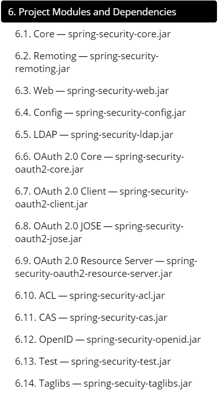

# 2. SpringSecurity 入门案例

## 2.1 创建一个项目

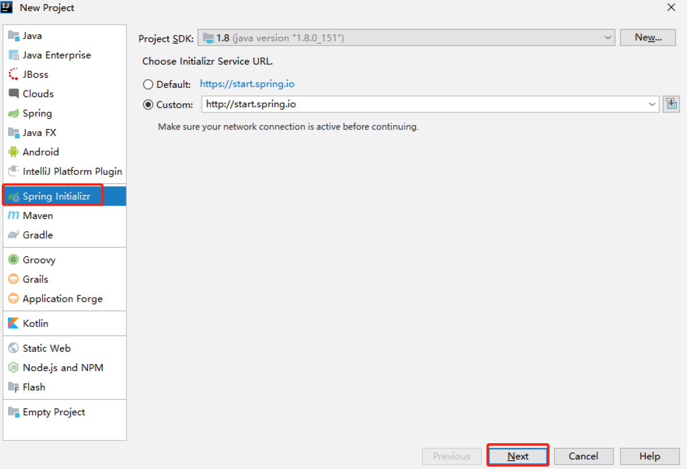

选择Spring Security

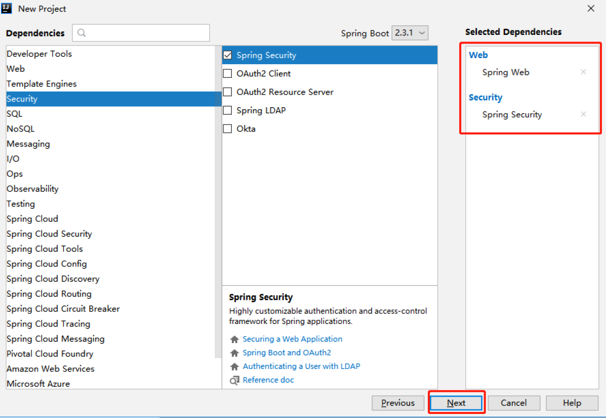

编写Controller

```java
@RestController
public class HelloController {
    @RequestMapping("/hello")
    public String hello(){
        return "hello,security";
    }
}
```

## 2.2 运行

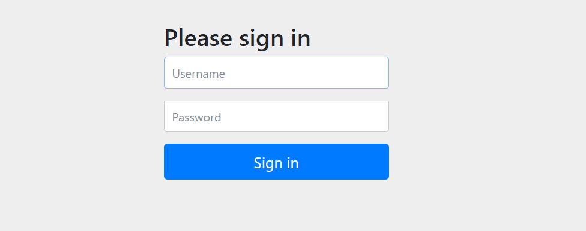

username为user

密码为

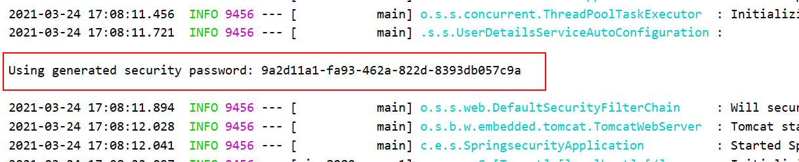

密码在项目启动的时候在控制台会打印，**注意每次启动的时候密码都回发生变化！**

## 2.3 权限管理中的相关概念

### 2.3.1主体

英文单词：principal

使用系统的用户或设备或从其他系统远程登录的用户等等。简单说就是谁使用系统谁就是主体。

### 2.3.2认证

英文单词：authentication

权限管理系统确认一个主体的身份，允许主体进入系统。简单说就是“主体”证明自己是谁。笼统的认为就是以前所做的登录操作。

### 2.3.3授权

英文单词：authorization

将操作系统的“权力”“授予”“主体”，这样主体就具备了操作系统中特定功能的能力。所以简单来说，授权就是给用户分配权限。

## 2.4 SpringSecurity 基本原理

### FilterChain

SpringSecurity 本质是一个过滤器链（**FilterChain**）：

> The client sends a request to the application, and the container creates a `FilterChain` which contains the `Filters` and `Servlet` that should process the `HttpServletRequest` based on the path of the request URI. In a Spring MVC application the `Servlet` is an instance of `DispatcherServlet`. At most one `Servlet` can handle a single `HttpServletRequest` and `HttpServletResponse`. However, more than one `Filter` can be used to:
>
> - Prevent downstream `Filter`s or the `Servlet` from being invoked. In this instance the `Filter` will typically write the `HttpServletResponse`.
> - Modify the `HttpServletRequest` or `HttpServletResponse` used by the downstream `Filter`s and `Servlet`
>
> 客户端向应用程序发送请求，容器创建一个FilterChain，其中包含Filters和Servlet，应该根据请求URI的路径处理HttpServletRequest。在Spring MVC应用中，Servlet是DispatcherServlet的一个实例。最多一个Servlet可以处理一个HttpServletRequest和HttpServletResponse。然而，可以使用多个Filter来。
>
> - 防止下游的Filter或Servlet被调用。在这种情况下，Filter通常会编写HttpServletResponse。
> - 修改下游Filter和Servlet使用的HttpServletRequest或HttpServletResponse。
>
> The power of the `Filter` comes from the `FilterChain` that is passed into it.
>
> Filter的力量来自于传递到它的FilterChain。
>
> Since a Filter only impacts downstream Filters and the Servlet, the order each Filter is invoked is extremely important.
>
> **由于一个Filter只影响下游的Filter和Servlet，所以每个Filter被调用的顺序是非常重要的。**

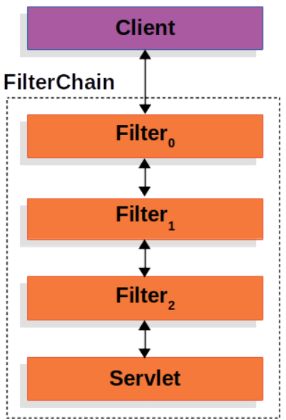


### DelegatingFilterProxy

> Spring provides a `Filter` implementation named `DelegatingFilterProxy` that allows bridging between the Servlet container’s lifecycle and Spring’s `ApplicationContext`. The Servlet container allows registering `Filter`s using its own standards, but it is not aware of Spring defined Beans. `DelegatingFilterProxy` can be registered via standard Servlet container mechanisms, but delegate all the work to a Spring Bean that implements `Filter`.

Spring提供了一个名为DelegatingFilterProxy的Filter实现，它允许在Servlet容器的生命周期和Spring的ApplicationContext之间进行桥接。Servlet容器允许使用自己的标准注册Filter，但它不知道Spring定义的Bean。DelegatingFilterProxy可以通过标准的Servlet容器机制进行注册，但将所有工作委托给实现Filter的Spring Bean。

下面是一张图片，说明DelegatingFilterProxy是如何融入Filters和FilterChain中的。

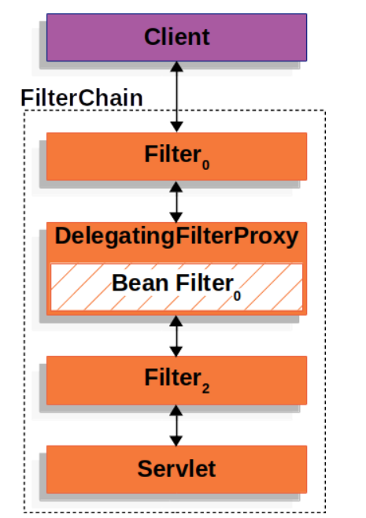

DelegatingFilterProxy从ApplicationContext中查找Bean Filter0，然后调用Bean Filter0。

### FilterChainProxy

spring Security的Servlet支持包含在FilterChainProxy中。FilterChainProxy是Spring Security提供的一个特殊的Filter，它允许通过SecurityFilterChain委托给许多Filter实例。由于FilterChainProxy是一个Bean，它通常被包装在一个DelegatingFilterProxy中。

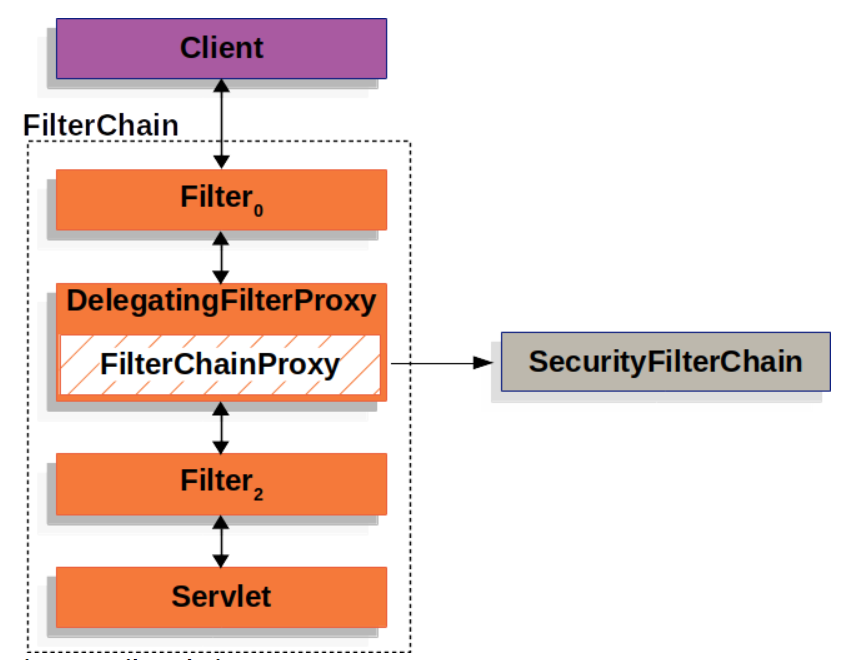

### SecurityFilterChain

SecurityFilterChainProxy使用SecurityFilterChain来决定该请求应调用哪些Spring安全过滤器。

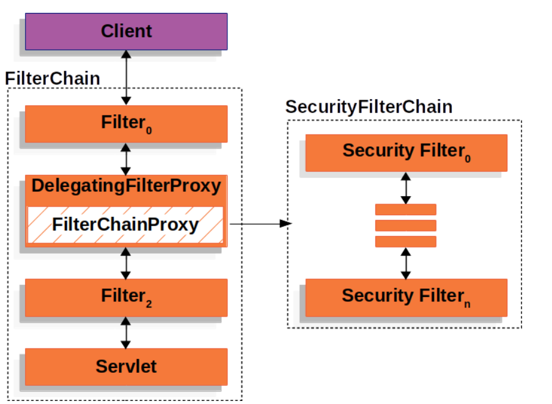

> The Security Filters in `SecurityFilterChain` are typically Beans, but they are registered with `FilterChainProxy` instead of DelegatingFilterProxy. `FilterChainProxy` provides a number of advantages to registering directly with the Servlet container or DelegatingFilterProxy. First, it provides a starting point for all of Spring Security’s Servlet support. For that reason, if you are attempting to troubleshoot Spring Security’s Servlet support, adding a debug point in `FilterChainProxy` is a great place to start.
>
> Second, since `FilterChainProxy` is central to Spring Security usage it can perform tasks that are not viewed as optional. For example, it clears out the `SecurityContext` to avoid memory leaks. It also applies Spring Security’s [`HttpFirewall`](https://docs.spring.io/spring-security/site/docs/5.5.0-SNAPSHOT/reference/html5/#servlet-httpfirewall) to protect applications against certain types of attacks.
>
> In addition, it provides more flexibility in determining when a `SecurityFilterChain` should be invoked. In a Servlet container, `Filter`s are invoked based upon the URL alone. However, `FilterChainProxy` can determine invocation based upon anything in the `HttpServletRequest` by leveraging the `RequestMatcher` interface.
>
> In fact, `FilterChainProxy` can be used to determine which `SecurityFilterChain` should be used. This allows providing a totally separate configuration for different *slices* of your application.
>
> SecurityFilterChain中的安全过滤器通常是Beans，但它们是用FilterChainProxy而不是DelegatingFilterProxy注册的。与直接用Servlet容器或DelegatingFilterProxy注册相比，FilterChainProxy提供了许多优势。首先，它为Spring Security的所有Servlet支持提供了一个起点。因此，如果您试图对Spring Security的Servlet支持进行故障排除，在FilterChainProxy中添加一个调试点是一个很好的开始。
>
> 其次，由于FilterChainProxy是Spring Security使用的核心，它可以执行一些不被视为可选的任务。例如，它可以清除SecurityContext以避免内存泄漏。它还应用Spring Security的HttpFirewall来保护应用程序免受某些类型的攻击。
>
> 此外，它还提供了更多的灵活性来决定何时应该调用SecurityFilterChain。在Servlet容器中，Filter仅根据URL被调用。然而，FilterChainProxy可以通过利用RequestMatcher接口，根据HttpServletRequest中的任何内容来决定调用。
>
> 事实上，FilterChainProxy可以用来决定应该使用哪个SecurityFilterChain。这允许为你的应用程序的不同片断提供一个完全独立的配置。
>

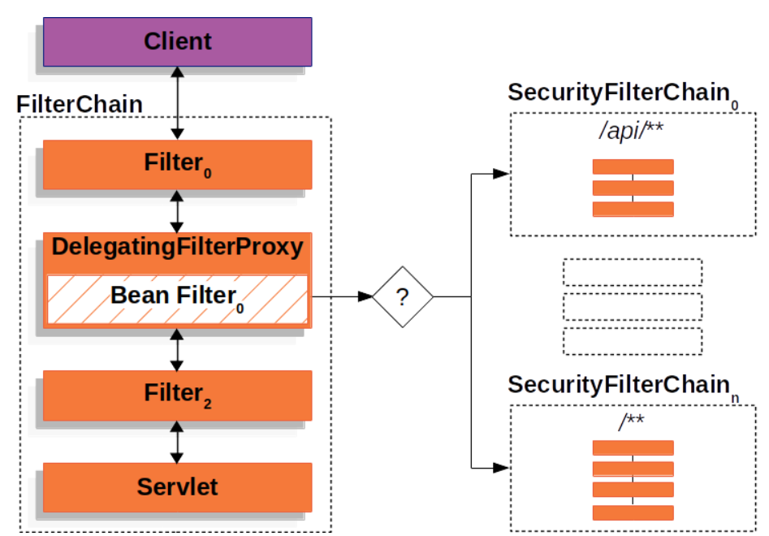

>  **Multiple SecurityFilterChain**
>
> In the Multiple SecurityFilterChain Figure `FilterChainProxy` decides which `SecurityFilterChain` should be used. Only the first `SecurityFilterChain` that matches will be invoked. If a URL of `/api/messages/` is requested, it will first match on `SecurityFilterChain0`'s pattern of `/api/**`, so only `SecurityFilterChain0` will be invoked even though it also matches on `SecurityFilterChainn`. If a URL of `/messages/` is requested, it will not match on `SecurityFilterChain0`'s pattern of `/api/**`, so `FilterChainProxy` will continue trying each `SecurityFilterChain`. Assuming that no other, `SecurityFilterChain` instances match `SecurityFilterChainn` will be invoked.
>
> Notice that `SecurityFilterChain0` has only three security `Filter`s instances configured. However, `SecurityFilterChainn` has four security `Filter`s configured. It is important to note that each `SecurityFilterChain` can be unique and configured in isolation. In fact, a `SecurityFilterChain` might have zero security `Filter`s if the application wants Spring Security to ignore certain requests.
>
> 在多个SecurityFilterChain图中，FilterChainProxy决定应该使用哪个SecurityFilterChain。只有第一个匹配的SecurityFilterChain才会被调用，如果请求的URL为/api/messages/，则会先在SecurityFilterChain0上匹配。如果请求一个/api/messages/的URL，首先会在SecurityFilterChain0的模式下匹配/api/**，所以只有SecurityFilterChain0会被调用，即使它也在SecurityFilterChainn上匹配。如果请求了/messages/的URL，在SecurityFilterChain0的/api/**模式上将不匹配，所以FilterChainProxy将继续尝试每个SecurityFilterChain。假设没有其他，SecurityFilterChain实例匹配SecurityFilterChainn将被调用。
>
> 注意，SecurityFilterChain0只配置了三个安全过滤器实例。然而，SecurityFilterChainn配置了四个安全过滤器。需要注意的是，每个SecurityFilterChain可以是唯一的，并且是单独配置的。事实上，如果应用程序希望Spring Security忽略某些请求，则SecurityFilterChain可能有零个安全过滤器。
>

### Security Filters

安全过滤器是通过SecurityFilterChain API插入到FilterChainProxy中的。过滤器的顺序很重要。通常不需要知道Spring Security的过滤器的顺序。然而，有时知道顺序是有益的。

- ChannelProcessingFilter
- WebAsyncManagerIntegrationFilter
- SecurityContextPersistenceFilter
- HeaderWriterFilter
- CorsFilter
- CsrfFilter
- LogoutFilter
- OAuth2AuthorizationRequestRedirectFilter
- Saml2WebSsoAuthenticationRequestFilter
- X509AuthenticationFilter
- AbstractPreAuthenticatedProcessingFilter
- CasAuthenticationFilter
- OAuth2LoginAuthenticationFilter
- Saml2WebSsoAuthenticationFilter
- `UsernamePasswordAuthenticationFilter`
- OpenIDAuthenticationFilter
- DefaultLoginPageGeneratingFilter
- DefaultLogoutPageGeneratingFilter
- ConcurrentSessionFilter
- DigestAuthenticationFilter
- BearerTokenAuthenticationFilter
- BasicAuthenticationFilter
- RequestCacheAwareFilter
- SecurityContextHolderAwareRequestFilter
- JaasApiIntegrationFilter
- RememberMeAuthenticationFilter
- AnonymousAuthenticationFilter
- OAuth2AuthorizationCodeGrantFilter
- SessionManagementFilter
- `ExceptionTranslationFilter`
- `FilterSecurityInterceptor`
- SwitchUserFilter


**代码底层流程：重点看三个过滤器：**

`FilterSecurityInterceptor`：是一个方法级的权限过滤器, 基本位于过滤链的最底部。

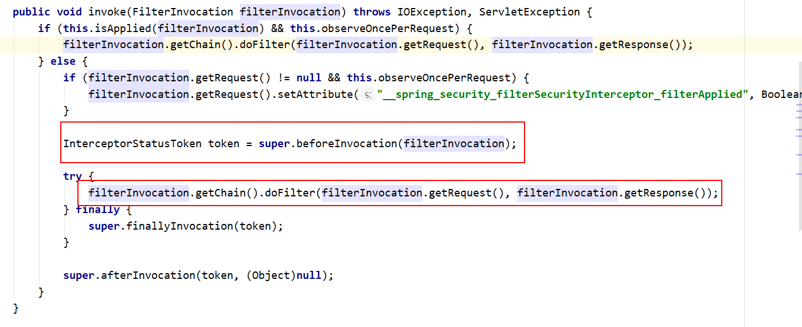

`super.beforeInvocation(fi)` 表示查看之前的filter 是否通过。

`fi.getChain().doFilter(fi.getRequest(), fi.getResponse());`表示真正的调用后台的服务。

------

`ExceptionTranslationFilter`：是个异常过滤器，用来处理在认证授权过程中抛出的异常

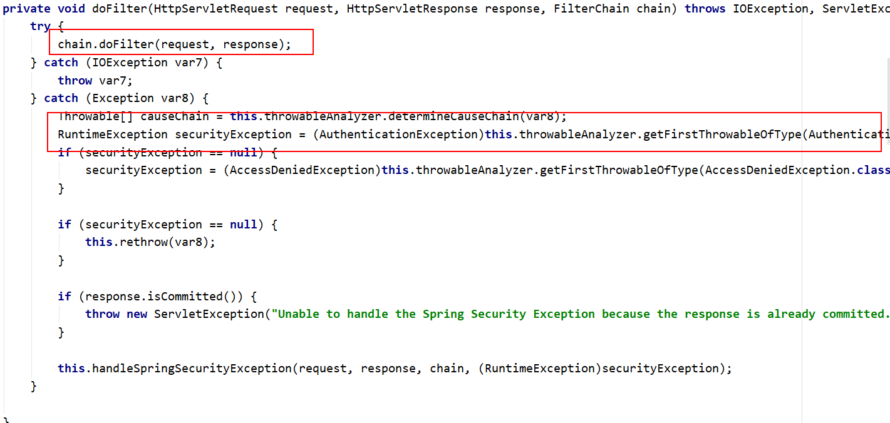

`UsernamePasswordAuthenticationFilter` ：对/login的POST请求做拦截，校验表单中用户名，密码。

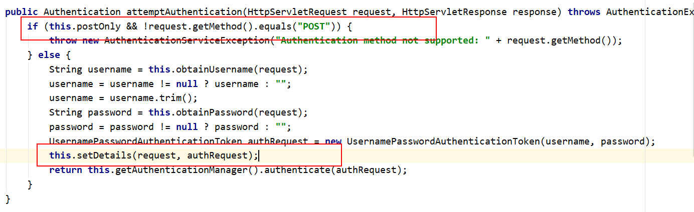

## 2.5 UserDetailsService接口讲解

当什么也没有配置的时候，账号和密码是由Spring Security定义生成的。而在实际项目中账号和密码都是从数据库中查询出来的。 所以我们要通过自定义逻辑控制认证逻辑。

如果需要自定义逻辑时，只需要实现UserDetailsService接口即可。接口定义如下：

```java
public interface UserDetailsService {
    UserDetails loadUserByUsername(String var1) throws UsernameNotFoundException;
}
```

**返回值UserDetails，这个类是系统默认的用户“主体”**

```java
public interface UserDetails extends Serializable {
    Collection<? extends GrantedAuthority> getAuthorities();

    String getPassword();

    String getUsername();

    boolean isAccountNonExpired();

    boolean isAccountNonLocked();

    boolean isCredentialsNonExpired();

    boolean isEnabled();
}
```

以下是UserDetails实现类

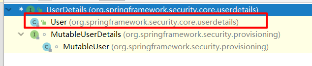

以后我们只需要使用User 这个实体类即可！

```java
public User(String username, String password, Collection<? extends GrantedAuthority> authorities) {
    this(username, password, true, true, true, true, authorities);
}
```

**方法参数 username**

表示用户名。此值是客户端表单传递过来的数据。默认情况下必须叫username，否则无法接收。

**方法参数 password**

一般进行加密

```java
new BCryptPasswordEncoder().encode("123")
```

**方法参数 authorities**

是权限集合，可以调用AuthorityUtils工具类

```java
List<GrantedAuthority> role = AuthorityUtils.commaSeparatedStringToAuthorityList("role");
```

## 2.6 PasswordEncoder 接口讲解

```java
public interface PasswordEncoder {
    String encode(CharSequence var1);

    boolean matches(CharSequence var1, String var2);

    default boolean upgradeEncoding(String encodedPassword) {
        return false;
    }
}
```

`String encode(CharSequence rawPassword);`

表示把参数按照特定的解析规则进行解析

`boolean matches(CharSequence rawPassword, String encodedPassword);`

表示验证从存储中获取的编码密码与编码后提交的原始密码是否匹配。如果密码匹配，则返回true；如果不匹配，则返回false。第一个参数表示需要被解析的密码。第二个参数表示存储的密码。

`default boolean upgradeEncoding(String encodedPassword) { return false; }`

表示如果解析的密码能够再次进行解析且达到更安全的结果则返回true，否则返回false。默认返回false。

子类

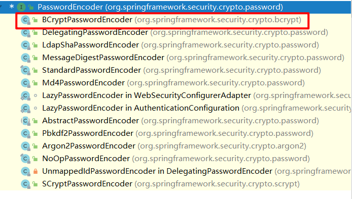

`BCryptPasswordEncoder`是Spring Security官方推荐的密码解析器，平时多使用这个解析器。

`BCryptPasswordEncoder`是对bcrypt强散列方法的具体实现。是基于Hash算法实现的单向加密。可以通过strength控制加密强度，默认10.

**查用方法演示**

~~~java
@Test public void test01(){ 
    // 创建密码解析器 
    BCryptPasswordEncoder bCryptPasswordEncoder = new BCryptPasswordEncoder(); 
    // 对密码进行加密 
    String atguigu = bCryptPasswordEncoder.encode("atguigu"); 
    // 打印加密之后的数据 System.out.println("加密之后数据：\t"+atguigu); 
    //判断原字符加密后和加密之前是否匹配 
    boolean result = bCryptPasswordEncoder.matches("atguigu", atguigu); 
    // 打印比较结果 
    System.out.println("比较结果：\t"+result); 
}
~~~

## 2.7 SpringBoot对Security的自动配置

https://docs.spring.io/spring-security/site/docs/5.3.4.RELEASE/reference/html5/#servlet-hello

# 3.SpringSecurity Web权限方案

## 3.1 设置登录系统的账号、密码

方式一：在application.properties

~~~properties
spring.security.user.name=atguigu
spring.security.user.password=atguigu
~~~

方式二：编写类实现接口

```java
@Configuration
public class SecurityConfig extends WebSecurityConfigurerAdapter {

    @Override
    protected void configure(AuthenticationManagerBuilder auth) throws Exception {
        BCryptPasswordEncoder bCryptPasswordEncoder = new BCryptPasswordEncoder();
        String password = bCryptPasswordEncoder.encode("123");
        auth.inMemoryAuthentication().withUser("liSi").password(password).roles("admin");
    }

    @Bean
    public PasswordEncoder passwordEncoder(){
        return new BCryptPasswordEncoder();
    }
}

```

注意：要将PasswordEncoder对象放入容器中，不然会报错

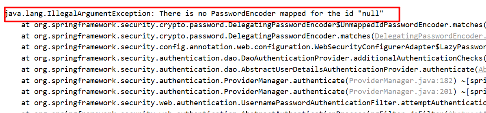

方法三：实现UserDetailsService接口

在service包中

~~~java
@Service("userDetailsService")
public class MyUserDetailsService implements UserDetailsService {
    @Override
    public UserDetails loadUserByUsername(String s) throws UsernameNotFoundException {
        List<GrantedAuthority> role = AuthorityUtils.commaSeparatedStringToAuthorityList("role");
        return new User("zhangSan",new BCryptPasswordEncoder().encode("123"),role);
    }
}
~~~

controller

```java
@Configuration
public class SecurityConfig extends WebSecurityConfigurerAdapter {
    @Autowired
    UserDetailsService userDetailsService;
//    @Override
//    protected void configure(AuthenticationManagerBuilder auth) throws Exception {
//        BCryptPasswordEncoder bCryptPasswordEncoder = new BCryptPasswordEncoder();
//        String password = bCryptPasswordEncoder.encode("123");
//        auth.inMemoryAuthentication().withUser("liSi").password(password).roles("admin");
//    }

    @Override
    protected void configure(AuthenticationManagerBuilder auth) throws Exception {
        auth.userDetailsService(userDetailsService).passwordEncoder(passwordEncoder());
    }
    @Bean
    public PasswordEncoder passwordEncoder(){
        return new BCryptPasswordEncoder();
    }
}
```

## 3.2 实现数据库认证来完成用户登录

完成自定义登录

### 3.2.1 准备sql

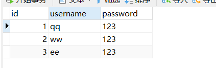

### 3.2.2 添加依赖

```xml
<dependency>
    <groupId>org.springframework.boot</groupId>
    <artifactId>spring-boot-starter-security</artifactId>
</dependency>
<dependency>
    <groupId>org.springframework.boot</groupId>
    <artifactId>spring-boot-starter-web</artifactId>
</dependency>

<dependency>
    <groupId>org.springframework.boot</groupId>
    <artifactId>spring-boot-configuration-processor</artifactId>
    <optional>true</optional>
</dependency>
<dependency>
    <groupId>org.projectlombok</groupId>
    <artifactId>lombok</artifactId>
    <optional>true</optional>
</dependency>
<dependency>
    <groupId>org.springframework.boot</groupId>
    <artifactId>spring-boot-starter-test</artifactId>
    <scope>test</scope>
</dependency>
<dependency>
    <groupId>org.springframework.security</groupId>
    <artifactId>spring-security-test</artifactId>
    <scope>test</scope>
</dependency>
<!--        lombok-->
<dependency>
    <groupId>org.projectlombok</groupId>
    <artifactId>lombok</artifactId>
    <optional>true</optional>
</dependency>
<dependency>
    <groupId>org.springframework.boot</groupId>
    <artifactId>spring-boot-starter-test</artifactId>
    <scope>test</scope>
</dependency>

<!--        导入Druid数据源-->
<dependency>
    <groupId>com.alibaba</groupId>
    <artifactId>druid</artifactId>
    <version>1.1.17</version>
</dependency>

<!--        数据库驱动-->
<dependency>
    <groupId>mysql</groupId>
    <artifactId>mysql-connector-java</artifactId>
</dependency>
<!--        Mybatis-plus-->
<dependency>
    <groupId>com.baomidou</groupId>
    <artifactId>mybatis-plus-boot-starter</artifactId>
    <version>3.4.1</version>
</dependency>
```

### 3.2.3 制作实体类

```java
@Data
@TableName("user")
public class Users {
    private Integer id;
    private String username;
    private String password;

}
```

因为我的表为user，所以用了@TableName("user")注解

### 3.2.4 整合MybatisPlus制作mapper

```java
@Repository
public interface UserMapper extends BaseMapper<Users> {
}
```

```yaml
spring:
  datasource:
    url: jdbc:mySql://localhost:3306/test
    password: 123456
    username: root
    driver-class-name: com.mysql.cj.jdbc.Driver
mybatis-plus:
  configuration:
    map-underscore-to-camel-case: true
```

### 3.2.5 制作登录实现类

```java
@Service("userDetailsService")
@Log4j2
public class MyUserDetailsService implements UserDetailsService {
    @Autowired
    private UserMapper userMapper;

    @Override
    public UserDetails loadUserByUsername(String username) throws UsernameNotFoundException {
        //条件构造器
        QueryWrapper<Users> userQueryWrapper = new QueryWrapper<>();
        //where username = ?
        userQueryWrapper.eq("username",username);
        //调用userMapper方法，根据用户名查询数据库
        Users users = userMapper.selectOne(userQueryWrapper);
        if(users == null) {
            throw new UsernameNotFoundException("用户名不存在！");
        }
        log.info(users);
        List<GrantedAuthority> auths = AuthorityUtils.commaSeparatedStringToAuthorityList("role");
        return new User(users.getUsername(), new BCryptPasswordEncoder().encode(users.getPassword()),auths);
    }
}
```

## 3.3 未认证请求跳转到登录页

### 3.3.1 引入前端模板依赖

```xml
<dependency>
    <groupId>org.springframework.boot</groupId>
    <artifactId>spring-boot-starter-thymeleaf</artifactId>
</dependency>
```

### 3.3.2 引入登录页面

将准备好的登录页面导入项目中

### 3.3.3 编写控制器

```java
@Controller
@RequestMapping("/user")
public class UserController {


    @RequestMapping("/success")
    @ResponseBody
    public String success(){
        return "success";
    }

    @RequestMapping("/fail")
    @ResponseBody
    public String fail(){
        return "fail";
    }

//    @RequestMapping("/login")
//    public String login(){
//        return "login";
//    }
}
```

### 3.3.4 编写配置类放行登录页面以及静态资源

```java
@Bean
    public PasswordEncoder passwordEncoder(){
        return new BCryptPasswordEncoder();
    }
    @Override
    protected void configure(HttpSecurity http) throws Exception {
        http.formLogin()
                .loginPage("/login.html")            // 配置哪个url为登录页面
                .loginProcessingUrl("/user/login")  // 设置哪个是登录的url
                .successForwardUrl("/user/success")    // 登录成功之后跳转到哪个url
                .failureForwardUrl("/user/fail").permitAll()     //登录失败之后跳转到哪个url   // 指定URL无需保护
                .and().authorizeRequests()
                .antMatchers("/hello","/user/login").permitAll()//表示配置请求路径   // 指定URL无需保护
                .anyRequest()  // 其他请求
                .authenticated()   //需要认证
                .and().csrf().disable();  // 关闭csrf
    }
}
```

> **注意：页面提交方式必须为post 请求，所以上面的页面不能使用，用户名，密码必须为username,password**

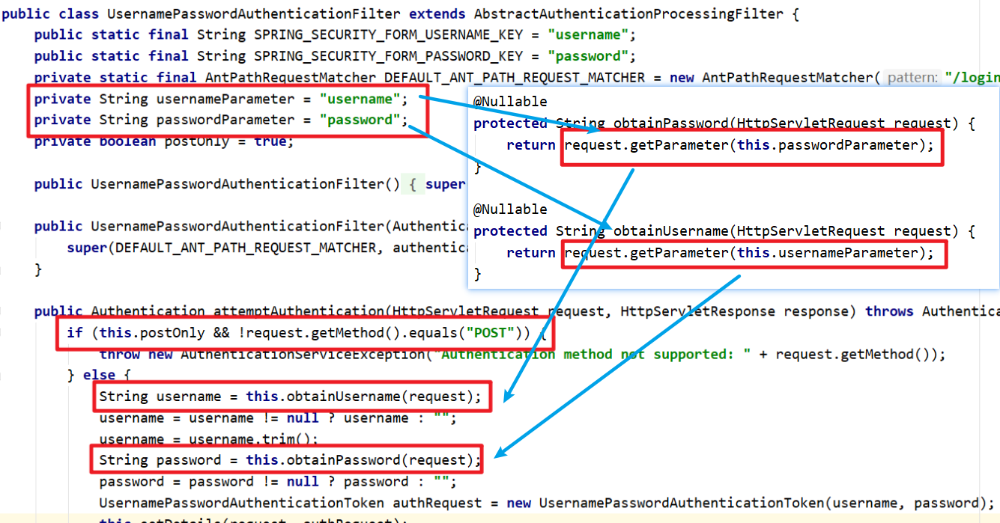

> **直接访问login.html页面还是访问controller请求**

如果是login.html请求，要设置loginPage("/login.html")，将login.html页面放入static中，因为在thymeleaf的templates包中外界是无法访问的，如果你有controller请求

```java
@GetMapping("/login")
public String login(){
    return "login.html";//现在login.html为静态资源，用login访问不到
}
```

这里输入http://localhost:8080/login.html然后输入username和password之后跳转的页面为http://localhost:8080/user/login

但是如果用`.defaultSuccessUrl("/user/success").permitAll()`，跳转的页面为http://localhost:8080/user/success

这里的路径不同和两个方法有关，之后再讲

如果直接访问http://localhost:8080/user/login，就会报错

org.thymeleaf.exceptions.TemplateInputException: Error resolving template [login.html], template might not exist or might not be accessible by any of the configured Template Resolvers

是说明html页面必须被thymeleaf模板引擎解析

那么就将login.html放入templates中，由controller进行跳转，而不是交给springsecurity处理

```java
@RequestMapping("/login")
public String login(){
    return "login";
}
```

无论现在还是之前使用HTML访问，没有指定loginPage("/login.html")会用到初始界面，而不是自定义界面，所以建议在静态资源内放入

起始页面

> **defaultSuccessUrl和successForwardUrl**

其实我们通过 defaultSuccessUrl 和 successForwardUrl 的字面意思都能够理解他们的作用。

defaultSuccessUrl 有一个重载的方法，如果我们在 defaultSuccessUrl 中指定登录成功的跳转页面为 /index，此时分两种情况，如果你是直接在浏览器中输入的登录地址，登录成功后，就直接跳转到 /index，如果你是在浏览器中输入了其他地址，例如 http://localhost:8080/xttblog，结果因为没有登录，又重定向到登录页面，此时登录成功后，就不会来到 /index ，而是来到 /xttblog 页面。

defaultSuccessUrl 就是说，它会默认跳转到 Referer 来源页面，如果 Referer 为空，没有来源页，则跳转到默认设置的页面。

successForwardUrl 表示不管你是从哪里来的，登录后一律跳转到 successForwardUrl 指定的地址。例如 successForwardUrl 指定的地址为 /index ，你在浏览器地址栏输入 http://localhost:8080/codedq，如果你还没有登录，将会重定向到登录页面，当你登录成功之后，就会服务端跳转到 /index 页面；或者你直接就在浏览器输入了登录页面地址，登录成功后也是来到 /index。而且是转发

defaultSuccessUrl 另外一个重载方法，第二个参数如果输入为 true，则效果和 successForwardUrl 一致。

一般来说，我们使用 defaultSuccessUrl 就够了。而且体验也比较好，特殊情况下，我们才使用 successForwardUrl。


## 3.4 基于角色或权限进行访问控制

### 3.4.1 hasAuthority 方法

如果当前的主体具有指定的权限，则返回 true,否则返回false

```java
.antMatchers("/user/login").hasAuthority("admin")
```

```java
List<GrantedAuthority> auths = AuthorityUtils.commaSeparatedStringToAuthorityList("abc");
```

不一样时会

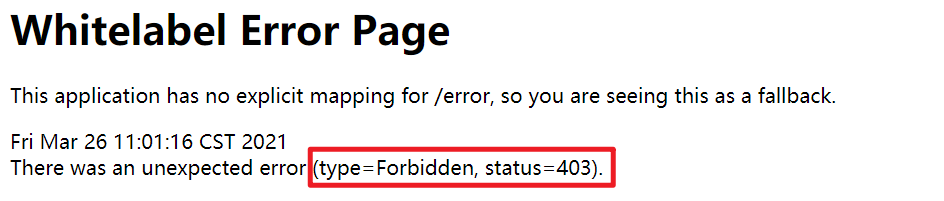

### 3.4.2 hasAnyAuthority方法

如果当前的主体有任何提供的角色（给定的作为一个逗号分隔的字符串列表）的话，返回true.

```java
.antMatchers("/user/success").hasAnyAuthority("admins","abc")
```

访问成功

### 3.4.3 hasRole 方法

如果用户具备给定角色就允许访问,否则出现403。如果当前主体具有指定的角色，则返回true。

源码显示

```java
private static String hasRole(String role) {
    Assert.notNull(role, "role cannot be null");
    Assert.isTrue(!role.startsWith("ROLE_"), () -> {
        return "role should not start with 'ROLE_' since it is automatically inserted. Got '" + role + "'";
    });
    return "hasRole('ROLE_" + role + "')";
}
```

在给权限之间加了role_前缀

```java
.antMatchers("/user/success").hasRole("abc")
```

访问失败

```java
List<GrantedAuthority> auths = AuthorityUtils.commaSeparatedStringToAuthorityList("ROLE_abc");
```

访问成功

### 3.4.4 hasAnyRole

表示用户具备任何一个条件都可以访问。

没有any和有any的比较，多了可变参数

```java
private static String hasAuthority(String authority) {
    return "hasAuthority('" + authority + "')";
}

private static String hasAnyAuthority(String... authorities) {
    String anyAuthorities = StringUtils.arrayToDelimitedString(authorities, "','");
    return "hasAnyAuthority('" + anyAuthorities + "')";
}

private static String hasRole(String role) {
    Assert.notNull(role, "role cannot be null");
    Assert.isTrue(!role.startsWith("ROLE_"), () -> {
        return "role should not start with 'ROLE_' since it is automatically inserted. Got '" + role + "'";
    });
    return "hasRole('ROLE_" + role + "')";
}

private static String hasAnyRole(String... authorities) {
        String anyAuthorities = StringUtils.arrayToDelimitedString(authorities, "','ROLE_");
        return "hasAnyRole('ROLE_" + anyAuthorities + "')";
    }
```

## 3.5 自定义403页面

### 3.5.1 修改访问配置类

```java
http.exceptionHandling().accessDeniedPage("/unauth.html");
```

unauth.html

```html
<!DOCTYPE html>
<html lang="en">
<head>
    <meta charset="UTF-8">
    <title>Title</title>
</head>
<body>
<h1>对不起，没有访问权限</h1>
</body>
</html>
```

## 3.6 注解使用

### 3.6.1 @Secured

判断是否具有角色，另外需要注意的是这里匹配的字符串需要添加前缀`ROLE_`。

使用注解先要开启注解功能！

`@EnableGlobalMethodSecurity(securedEnabled=true)`

~~~java
@SpringBootApplication
@EnableGlobalMethodSecurity(securedEnabled=true)
public class DemosecurityApplication { 
    public static void main(String[] args) { 
        SpringApplication.run(DemosecurityApplication.class, args); 
    } 
}
~~~

在控制器方法上添加注解

~~~java
// 测试注解： 
@RequestMapping("testSecured")
@ResponseBody
@Secured({"ROLE_normal","ROLE_admin"})
public String helloUser() { 
    return "hello,user"; 
} 
~~~

登录之后直接访问：http://localhost:8090/testSecured 控制器

### 3.6.2 @PreAuthorize

先开启注解功能： 

`@EnableGlobalMethodSecurity(prePostEnabled = true) `

`@PreAuthorize`：注解适合进入方法前的权限验证， @PreAuthorize可以将登录用户的roles/permissions参数传到方法中。

~~~java
@RequestMapping("/preAuthorize")
@ResponseBody
//@PreAuthorize("hasRole('ROLE_管理员')")
@PreAuthorize("hasAnyAuthority('menu:system')")
public String preAuthorize(){ 
    System.out.println("preAuthorize");
    return "preAuthorize";
}
~~~

### 3.6.3 @PostAuthorize

先开启注解功能： 

`@EnableGlobalMethodSecurity(prePostEnabled = true) `

`@PostAuthorize` 注解使用并不多，在方法执行后再进行权限验证，适合验证带有返回值的权限.

~~~java
@RequestMapping("/testPostAuthorize")
@ResponseBody
@PostAuthorize("hasAnyAuthority('menu:system')")
public String preAuthorize(){ 
    System.out.println("test--PostAuthorize");
    return "PostAuthorize";
}
~~~

### 3.6.4 @PostFilter

`@PostFilter` ：权限验证之后对数据进行过滤 留下用户名是admin1的数据,表达式中的 filterObject 引用的是方法返回值List中的某一个元素

~~~java
@RequestMapping("getAll")
@PreAuthorize("hasRole('ROLE_管理员')")
@PostFilter("filterObject.username == 'admin1'")
@ResponseBody
public List<UserInfo> getAllUser(){ 
    ArrayList<UserInfo> list = new ArrayList<>();
    list.add(new UserInfo(1l,"admin1","6666"));
    list.add(new UserInfo(2l,"admin2","888"));
    return list;
}
~~~

### 3.6.5 @PreFilter

`@PreFilter`: 进入控制器之前对数据进行过滤

~~~java
@RequestMapping("getTestPreFilter")
@PreAuthorize("hasRole('ROLE_管理员')")
@PreFilter(value = "filterObject.id%2==0")
@ResponseBody public List<UserInfo> getTestPreFilter(@RequestBody List<UserInfo> list){ 
    list.forEach(t-> { 
        System.out.println(t.getId()+"\t"+t.getUsername());
    });
    return list; }
~~~

## 3.7 用户注销

success.html

~~~html
<body> 登录成功<br> <a href="/logout">退出</a> </body>
~~~

在配置类中添加退出映射地址

~~~java
http.logout().logoutUrl("/logout").logoutSuccessUrl("/index").permitAll();
~~~

## 3.8 基于数据库的记住我

### 3.8.1 创建表

~~~sql
CREATE TABLE `persistent_logins` (
`username` varchar(64) NOT NULL,
`series` varchar(64) NOT NULL,
`token` varchar(64) NOT NULL,
`last_used` timestamp NOT NULL DEFAULT CURRENT_TIMESTAMP ON UPDATE CURRENT_TIMESTAMP,
PRIMARY KEY (`series`)
) ENGINE=InnoDB DEFAULT CHARSET=utf8;
~~~

### 3.8.2 添加数据库的配置文件

~~~yaml
spring:
  datasource:
    url: jdbc:mySql://localhost:3306/test
    password: 123456
    username: root
    driver-class-name: com.mysql.cj.jdbc.Driver
~~~

### 3.8.3 编写配置类

创建配置类

~~~java
@Configuration public class BrowserSecurityConfig {
    @Autowired private DataSource dataSource; 
    @Bean
    public PersistentTokenRepository persistentTokenRepository(){
        JdbcTokenRepositoryImpl jdbcTokenRepository = new JdbcTokenRepositoryImpl();
        // 赋值数据源
        jdbcTokenRepository.setDataSource(dataSource);
        // 自动创建表,第一次执行会创建，以后要执行就要删除掉！ 
//        jdbcTokenRepository.setCreateTableOnStartup(true);
        return jdbcTokenRepository;
    }
}
~~~

### 3.8.4 修改安全配置类

~~~java
@Autowired
private UsersServiceImpl usersService;
@Autowired
private PersistentTokenRepository tokenRepository;
// 开启记住我功能 
http.rememberMe().tokenRepository(tokenRepository)
    .tokenValiditySeconds(60)  //设置有效时长，单位秒
    .userDetailsService(userDetailsService);
~~~

### 3.8.5 页面添加记住我复选框

~~~html
记住我：<input type="checkbox"name="remember-me" title="记住密码"/><br/>
~~~

此处：name 属性值必须位remember-me.不能改为其他值

## 3.9 CSRF

### 3.9.1 CSRF 理解

**跨站请求伪造**（英语：Cross-site request forgery），也被称为 one-click attack 或者 session riding，通常缩写为 CSRF 或者 XSRF， 是一种挟制用户在当前已登录的Web应用程序上执行非本意的操作的攻击方法。跟跨网站脚本（XSS）相比，XSS利用的是用户对指定网站的信任，CSRF 利用的是网站对用户网页浏览器的信任。

跨站请求攻击，简单地说，是攻击者通过一些技术手段欺骗用户的浏览器去访问一个自己曾经认证过的网站并运行一些操作（如发邮件，发消息，甚至财产操作如转账和购买商品）。由于浏览器曾经认证过，所以被访问的网站会认为是真正的用户操作而去运行。这利用了web中用户身份验证的一个漏洞：简单的身份验证只能保证请求发自某个用户的浏览器，却不能保证请求本身是用户自愿发出的。

从Spring Security 4.0开始，默认情况下会启用CSRF保护，以防止CSRF攻击应用程序，Spring Security CSRF会针对PATCH，POST，PUT和DELETE方法进行防护。

### 3.9.2 案例

在登录页面添加一个隐藏域：

~~~html
<input type="hidden"th:if="${_csrf}!=null"th:value="${_csrf.token}"name="_csrf"/>
~~~

关闭安全配置的类中的csrf

~~~java
// http.csrf().disable();
~~~

### 3.9.3 Spring Security 实现CSRF的原理：

1. 在CsrfFilter中

   ```java
   protected void doFilterInternal(HttpServletRequest request, HttpServletResponse response, FilterChain filterChain) throws ServletException, IOException {
       request.setAttribute(HttpServletResponse.class.getName(), response);
       CsrfToken csrfToken = this.tokenRepository.loadToken(request);
       boolean missingToken = csrfToken == null;
       if (missingToken) {
           csrfToken = this.tokenRepository.generateToken(request);
           this.tokenRepository.saveToken(csrfToken, request, response);
       }
   
       request.setAttribute(CsrfToken.class.getName(), csrfToken);
       request.setAttribute(csrfToken.getParameterName(), csrfToken);
       if (!this.requireCsrfProtectionMatcher.matches(request)) {
           if (this.logger.isTraceEnabled()) {
               this.logger.trace("Did not protect against CSRF since request did not match " + this.requireCsrfProtectionMatcher);
           }
   
           filterChain.doFilter(request, response);
       } else {
           String actualToken = request.getHeader(csrfToken.getHeaderName());
           if (actualToken == null) {
               actualToken = request.getParameter(csrfToken.getParameterName());
           }
   
           if (!equalsConstantTime(csrfToken.getToken(), actualToken)) {
               this.logger.debug(LogMessage.of(() -> {
                   return "Invalid CSRF token found for " + UrlUtils.buildFullRequestUrl(request);
               }));
               AccessDeniedException exception = !missingToken ? new InvalidCsrfTokenException(csrfToken, actualToken) : new MissingCsrfTokenException(actualToken);
               this.accessDeniedHandler.handle(request, response, (AccessDeniedException)exception);
           } else {
               filterChain.doFilter(request, response);
           }
       }
   }
   ```

   

   获取CsrfToken对象

   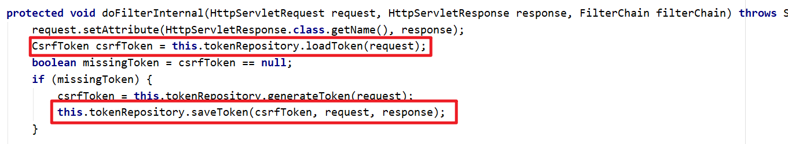

   

   得到表单中的值进行判断

   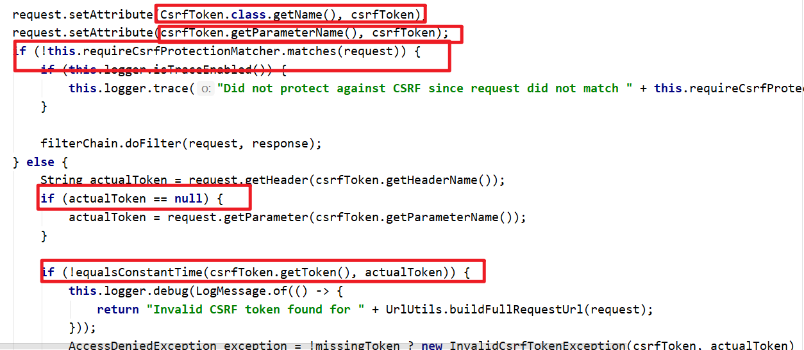

   

   写明了对哪些请求类型是不进行防护的

   ```java
   public static final RequestMatcher DEFAULT_CSRF_MATCHER = new CsrfFilter.DefaultRequiresCsrfMatcher();
   ```

   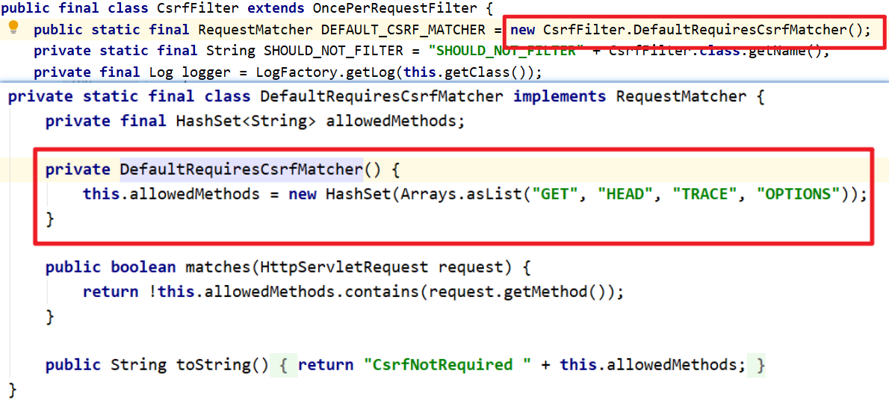

   

2. 生成csrfToken 保存到HttpSession 或者Cookie 中。

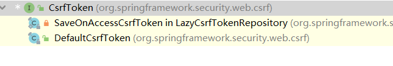

```java
public interface CsrfToken extends Serializable {
    String getHeaderName();

    String getParameterName();

    String getToken();
}
```


SaveOnAccessCsrfToken 类有个接口CsrfTokenRepository

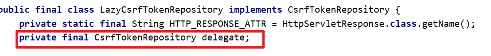

```java
public interface CsrfTokenRepository {
    CsrfToken generateToken(HttpServletRequest var1);

    void saveToken(CsrfToken var1, HttpServletRequest var2, HttpServletResponse var3);

    CsrfToken loadToken(HttpServletRequest var1);
}
```


当前接口实现类：HttpSessionCsrfTokenRepository，CookieCsrfTokenRepository

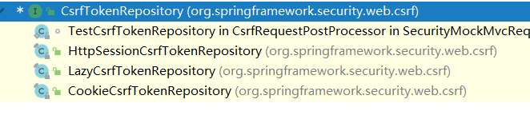

在CookieCsrfTokenRepository中

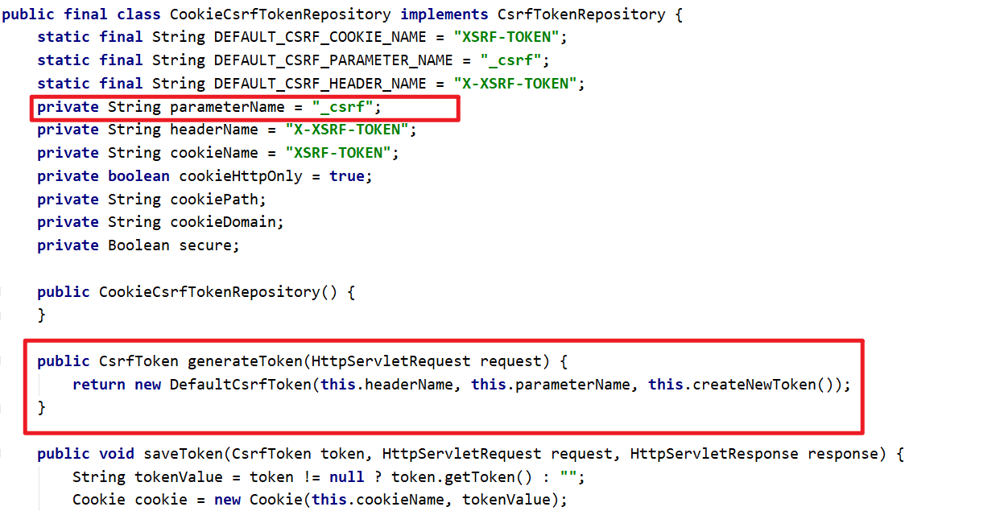

------

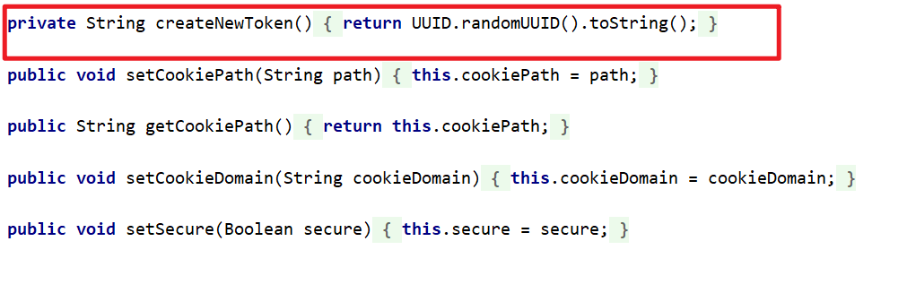

# 4. 实战

springSecurity结合JWT进行权限控制和校验


## 1、security的config配置

~~~java
@Configuration
@EnableWebSecurity// 这个注解必须加，开启Security
public class WebSecurityConfig extends WebSecurityConfigurerAdapter {
    @Autowired
    private UserDetailsServiceImpl userDetailsService;
    @Autowired
    MyAuthenticationSuccessHandler  authenticationSuccessHandler;
    @Autowired
    MyAuthenticationFailureHandler authenticationFailureHandler;
    @Autowired
    JwtAuthenticationEntryPoint jwtAuthenticationEntryPoint;
    @Autowired
    RestfulAccessDeniedHandler restfulAccessDeniedHandler;
    @Autowired
    JwtAuthorizationTokenFilter jwtAuthorizationTokenFilter;
    @Autowired
    MyLogoutHandler myLogoutHandler;
    @Autowired
    MyLogoutSuccessHandler myLogoutSuccessHandler;
    @Bean
    public PasswordEncoder passwordEncoder() {
        return new BCryptPasswordEncoder();
    }

    @Bean
    public UserDetailsService myUserService(){
        return new UserDetailsServiceImpl();
    }

    @Override
    public void configure(WebSecurity web) throws Exception {
        //解决静态资源被拦截的问题
        web.ignoring().antMatchers("/file/download/**");
    }

    @Override
    protected void configure(HttpSecurity http) throws Exception {

        //解决跨域问题。cors 预检请求放行,让Spring security 放行所有preflight request（cors 预检请求）
        http.authorizeRequests().requestMatchers(CorsUtils::isPreFlightRequest).permitAll();

        //让Security永远不会创建HttpSession，它不会使用HttpSession来获取SecurityContext
        http.csrf().disable().sessionManagement().sessionCreationPolicy(SessionCreationPolicy.STATELESS)
                .and().headers().cacheControl();

        //设置要拦截和不要拦截的路径
        http.authorizeRequests()
                .antMatchers(HttpMethod.OPTIONS,"/login").permitAll()
                .anyRequest().authenticated();

        http.formLogin()
                .loginProcessingUrl("/login")
                .successHandler(authenticationSuccessHandler)
                .failureHandler(authenticationFailureHandler)
                //配置取消session管理,又Jwt来获取用户状态,否则即使token无效,也会有session信息,依旧判断用户为登录状态
                .and()
                .sessionManagement().sessionCreationPolicy(SessionCreationPolicy.STATELESS)

                .and()
                //允许注销
                .logout().permitAll()
                //添加注销的处理器
                .addLogoutHandler(myLogoutHandler)
                //注销成功处理器
                .logoutSuccessHandler(myLogoutSuccessHandler)
                //登出后要删除cookie
                .deleteCookies("JSESSIONID")
                .and()
                .exceptionHandling()
                // 无权访问 权限不足
                .accessDeniedHandler(restfulAccessDeniedHandler)
                .and()
                .exceptionHandling()
                //未登陆时或者token过期返回 JSON 格式的数据给前端
                .authenticationEntryPoint(jwtAuthenticationEntryPoint);

        //拦截token，并检测。在 UsernamePasswordAuthenticationFilter 之前添加 JwtAuthenticationTokenFilter
        http.addFilterBefore(jwtAuthorizationTokenFilter, UsernamePasswordAuthenticationFilter.class);
    }

    /**
     * 身份认证接口
     * @param auth
     * @throws Exception
     */
    @Override
    protected void configure(AuthenticationManagerBuilder auth) throws Exception {
        auth.userDetailsService(userDetailsService).passwordEncoder(passwordEncoder());
    }
}
~~~


## 2、jwt的过滤器

该过滤器放置在过滤器链之前

~~~java
@Component
public class JwtAuthorizationTokenFilter extends OncePerRequestFilter {

    @Autowired
    private UserDetailsServiceImpl userDetailsService;


    @Override
    protected void doFilterInternal(HttpServletRequest request, HttpServletResponse response, FilterChain chain) throws ServletException, IOException {
        String tokenHeader = request.getHeader("tokenHeader");// 从header 中获取token
        String username = null;
        if (tokenHeader != null) {
            try {
                JwtUtils.verity(tokenHeader);
                username = JwtUtils.getUsernameFromToken(tokenHeader);
            }catch (SignatureVerificationException e){
                e.printStackTrace();
                Result result = new Result("无效签名 错误信息："+e.getMessage(),ResultCode.VERITYFAIL,null,null);
                JSONAuthenticaton.writeJSON(request,response,result);
            }catch (TokenExpiredException e){
                e.printStackTrace();
                Result result = new Result("token过期 错误信息："+e.getMessage(),ResultCode.VERITYFAIL,null,null);
                JSONAuthenticaton.writeJSON(request,response,result);
            }
            catch (AlgorithmMismatchException e){
                e.printStackTrace();
                Result result = new Result("token算法不一致 错误信息："+e.getMessage(),ResultCode.VERITYFAIL,null,null);
                JSONAuthenticaton.writeJSON(request,response,result);
            }
            catch (JWTVerificationException e){
                e.printStackTrace();
                Result result = new Result("token无效 错误信息："+e.getMessage(),ResultCode.VERITYFAIL,null,null);
                JSONAuthenticaton.writeJSON(request,response,result);
            }
            if (username != null && SecurityContextHolder.getContext().getAuthentication() == null) {
                //验证访问路径是否角色正确
                UserDetails userDetails = userDetailsService.loadUserByUsername(username);  // 查询UserDetails
                if (userDetails != null){
                    UsernamePasswordAuthenticationToken authentication = new UsernamePasswordAuthenticationToken(userDetails, null, userDetails.getAuthorities());
                    authentication.setDetails(new WebAuthenticationDetailsSource().buildDetails(request));
                    SecurityContextHolder.getContext().setAuthentication(authentication);  // 在上下文中记录UserDetails
                }
            }
        }
        chain.doFilter(request, response);
    }
}
~~~

## 3、jwt工具类

~~~java
public class JwtUtils {

    private static final String TOKEN = "JWT!fjw!@#";

    /**
     * 生成token
     * @param map   传入payload
     * @return      返回token
     */
    public static String getToken(Map<String,String> map){
        JWTCreator.Builder builder = JWT.create();
        map.forEach((k,v)->{
            builder.withClaim(k,v);
        });
        Calendar instance = Calendar.getInstance();
        //限制token的期限 7tian
        instance.add(Calendar.DATE,7);
        builder.withExpiresAt(instance.getTime());
        return builder.sign(Algorithm.HMAC256(TOKEN));
    }

    /**
     * 验证token
     * @param token token
     */
    public static void verity(String token){
        JWT.require(Algorithm.HMAC256(TOKEN)).build().verify(token);
    }

    /**
     * 获取payload中的姓名
     * @param token
     * @return
     */
    public static String getUsernameFromToken(String token){
        return JWT.require(Algorithm.HMAC256(TOKEN)).build().verify(token).getClaim("username").asString();
    }

    /**
     * 获取payload中的角色
     * @param token
     * @return
     */
    public static String getRoleFromToken(String token){
        return JWT.require(Algorithm.HMAC256(TOKEN)).build().verify(token).getClaim("role").asString();
    }
}
~~~

## 4、各种处理handler

登录成功handler，同时生成token返回

~~~java
@Component
public class MyAuthenticationSuccessHandler implements AuthenticationSuccessHandler {

    @Autowired
    Result result;
    @Autowired
    UsersInfoDto usersInfoDto;

    @Override
    public void onAuthenticationSuccess(HttpServletRequest httpServletRequest, HttpServletResponse httpServletResponse, Authentication authentication) throws IOException, ServletException {

        User userDetails = (User) authentication.getPrincipal();//拿到登录用户信息
        HashMap<String, String> payLoad = new HashMap<>();
        payLoad.put("username",userDetails.getUsername());

        String token = JwtUtils.getToken(payLoad);

        result.setMessage("登陆成功");
        result.setResultCode(ResultCode.SUCCESS);
        result.setReturnValue(token);
        ArrayList<UsersInfoDto> arrayList = new ArrayList<>();
        arrayList.add(usersInfoDto);
        result.setData(arrayList);
        JSONAuthenticaton.writeJSON(httpServletRequest,httpServletResponse,result);

    }
}
~~~

登陆验证失败

~~~java
@Component
public class MyAuthenticationFailureHandler implements AuthenticationFailureHandler {

    @Autowired
    Result result;

    @Override
    public void onAuthenticationFailure(HttpServletRequest httpServletRequest, HttpServletResponse httpServletResponse, AuthenticationException e) throws IOException, ServletException {

        if (e instanceof BadCredentialsException){
            result.setMessage("用户名或密码错误");
            result.setResultCode(ResultCode.FAIL);
            JSONAuthenticaton.writeJSON(httpServletRequest,httpServletResponse,result);
        }else {
            result.setMessage(e.getMessage());
            JSONAuthenticaton.writeJSON(httpServletRequest,httpServletResponse,result);
        }

    }
}
~~~

注销操作

~~~java
@Component
public class MyLogoutHandler implements LogoutHandler {

    @Override
    public void logout(HttpServletRequest httpServletRequest, HttpServletResponse httpServletResponse, Authentication authentication)  {
        SecurityContextHolder.clearContext();
    }
}
~~~

注销成功处理

~~~java
@Component
public class MyLogoutSuccessHandler implements LogoutSuccessHandler {

    @Autowired
    Result result;

    @Override
    public void onLogoutSuccess(HttpServletRequest httpServletRequest, HttpServletResponse httpServletResponse, Authentication authentication) throws IOException, ServletException {
        result.setMessage("注销成功");
        result.setResultCode(ResultCode.SUCCESS);
        JSONAuthenticaton.writeJSON(httpServletRequest,httpServletResponse,result);
    }
}
~~~

权限不足

~~~java
@Component
public class RestfulAccessDeniedHandler implements AccessDeniedHandler {

    @Autowired
    Result result;

    @Override
    public void handle(HttpServletRequest httpServletRequest, HttpServletResponse httpServletResponse, AccessDeniedException e) throws IOException, ServletException {
        result.setMessage("未授权或者权限不够");
        result.setResultCode(ResultCode.UNAUTHORIZED);
        JSONAuthenticaton.writeJSON(httpServletRequest,httpServletResponse,result);
    }
}
~~~

JWT时效已经过期，或者未登陆下访问接口

~~~java
@Component
public class JwtAuthenticationEntryPoint implements AuthenticationEntryPoint {

    @Autowired
    Result result;

    @Override
    public void commence(HttpServletRequest httpServletRequest, HttpServletResponse httpServletResponse, AuthenticationException e) throws IOException, ServletException {
        result.setMessage("没有凭证或者凭证错误");
        result.setResultCode(ResultCode.VERITYFAIL);
        JSONAuthenticaton.writeJSON(httpServletRequest,httpServletResponse,result);
    }
}
~~~

工具类：用于对handler的返回response设置编码，跨域，输出

~~~java
public class JSONAuthenticaton {
    public static void writeJSON(HttpServletRequest request, HttpServletResponse response,Object data) throws IOException, ServletException{
        //编码
        response.setCharacterEncoding("UTF-8");
        response.setContentType("application/json");
        //跨域
        response.setHeader("Access-Control-Allow-Origin","*");
        response.setHeader("Access-Control-Allow-Method","POST,GET");
        //输出JSON
        PrintWriter writer = response.getWriter();
        writer.write(new ObjectMapper().writeValueAsString(data));
        writer.flush();
        writer.close();
    }
}
~~~

## 5、继承service

~~~java
@Service
@Log4j2
public class UserDetailsServiceImpl implements UserDetailsService {

    @Autowired
    UsersDao usersDao;
    @Autowired
    PasswordEncoder passwordEncoder;
    @Autowired
    UsersInfoDto usersInfoDto;
    @Autowired
    UserRoleDto userRoleDto;
    @Autowired
    TeacherDao teacherDao;
    @Autowired
    StudentDao studentDao;
    @Autowired
    RoleDao roleDao;

    @Override
    public UserDetails loadUserByUsername(String username) throws UsernameNotFoundException {
        QueryWrapper<Users> queryWrapper = new QueryWrapper<>();
        queryWrapper.eq("username",username);
        Users users = usersDao.selectOne(queryWrapper);
        if (users == null) {
            Teacher teacher = teacherDao.selectById(username);
            if (teacher == null){
                Student student = studentDao.selectById(username);
                if (student == null){
                    throw new UsernameNotFoundException("用户名不存在");
                }else {
                    Users studentUsers = new Users();
                    studentUsers.setUsername(student.getUid().toString());
                    studentUsers.setPassword(student.getUid().toString());
                    studentUsers.setCareer("教师");
                    studentUsers.setName(student.getUname());
                    studentUsers.setCollege(student.getCollege());
                    studentUsers.setDept(student.getUdept());
                    usersDao.insert(studentUsers);
                    users = studentUsers;
                    QueryWrapper<Role> roleQueryWrapper = new QueryWrapper<>();
                    roleQueryWrapper.eq("role","student");
                    Role role = roleDao.selectOne(roleQueryWrapper);
                    usersDao.insertRoleByUsername(studentUsers.getUsername(),role.getId());
                }
            }else {
                Users teacherUsers = new Users();
                teacherUsers.setUsername(teacher.getNumber());
                teacherUsers.setPassword(teacher.getNumber());
                teacherUsers.setCareer("教师");
                teacherUsers.setName(teacher.getName());
                teacherUsers.setCollege(teacher.getCollege());
                teacherUsers.setDept(teacher.getDept());
                usersDao.insert(teacherUsers);
                users = teacherUsers;
                QueryWrapper<Role> roleQueryWrapper = new QueryWrapper<>();
                roleQueryWrapper.eq("role","teacher");
                Role role = roleDao.selectOne(roleQueryWrapper);
                usersDao.insertRoleByUsername(teacherUsers.getUsername(),role.getId());
            }
        }
        ArrayList<UserRoleDto> userRoleDtos = usersDao.selectRoleByUsername(users.getUsername());

        List<GrantedAuthority> grantedAuthorities = new ArrayList<>();
        for (UserRoleDto UserRoleDto : userRoleDtos){
            SimpleGrantedAuthority authority = new SimpleGrantedAuthority("ROLE_" + UserRoleDto.getRole());
            grantedAuthorities.add(authority);
        }

        //将用户信息进行保存
        usersInfoDto.setUsername(users.getUsername());
        usersInfoDto.setCareer(users.getCareer());
        usersInfoDto.setCollege(users.getCollege());
        usersInfoDto.setDept(users.getDept());
        usersInfoDto.setName(users.getName());
        usersInfoDto.setRoles(userRoleDtos);

        return new User(users.getUsername(), passwordEncoder.encode(users.getPassword()),grantedAuthorities);
    }
~~~

## 6、启动类注解

~~~java
@SpringBootApplication
@EnableGlobalMethodSecurity(securedEnabled=true)
@MapperScan("com.example.teachingaffair.dao")
public class TeachingaffairApplication {

    public static void main(String[] args) {
        SpringApplication.run(TeachingaffairApplication.class, args);
    }

}
~~~

