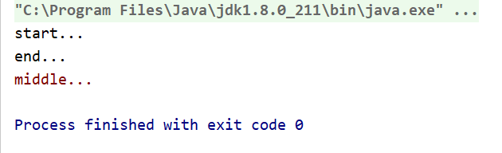

# java异常(Throwable)

# 第一章    异常

## 1.1 异常概念

异常，就是不正常的意思。在生活中:医生说,你的身体某个部位有异常,该部位和正常相比有点不同,该部位的功能将受影响.在程序中的意思就是：

* **异常** ：指的是程序在执行过程中，出现的非正常的情况，最终会导致JVM的非正常停止。

在Java等面向对象的编程语言中，异常本身是一个类，产生异常就是创建异常对象并抛出了一个异常对象。Java处理异常的方式是中断处理。

> 异常指的并不是语法错误,语法错了,编译不通过,不会产生字节码文件,根本不能运行.

## 1.2 异常体系

异常机制其实是帮助我们**找到**程序中的问题，异常的根类是`java.lang.Throwable`，其下有两个子类：`java.lang.Error`与`java.lang.Exception`，平常所说的异常指`java.lang.Exception`。


**Throwable体系：**

* **Error**:严重错误Error，无法通过处理的错误，只能事先避免，好比绝症。
* **Exception**:表示异常，异常产生后程序员可以通过代码的方式纠正，使程序继续运行，是必须要处理的。好比感冒、阑尾炎。

**Throwable中的常用方法：**

* `public void printStackTrace()`:打印异常的详细信息。

  *包含了异常的类型,异常的原因,还包括异常出现的位置,在开发和调试阶段,都得使用printStackTrace。*

* `public String getMessage()`:获取发生异常的原因。

  *提示给用户的时候,就提示错误原因。*

* `public String toString()`:获取异常的类型和异常描述信息(不用)。

***出现异常,不要紧张,把异常的简单类名,拷贝到API中去查。***


## 1.3 异常分类

这些异常有的是因为用户错误引起，有的是程序错误引起的，还有其它一些是因为物理错误引起的。

要理解Java异常处理是如何工作的，你需要掌握以下三种类型的异常：

- **检查性异常：**最具代表的检查性异常是用户错误或问题引起的异常，这是程序员无法预见的。例如要打开一个不存在文件时，一个异常就发生了，这些异常在编译时不能被简单地忽略。
- **运行时异常：** 运行时异常是可能被程序员避免的异常。与检查性异常相反，运行时异常可以在编译时被忽略。
- **错误：** 错误不是异常，而是脱离程序员控制的问题。错误在代码中通常被忽略。例如，当栈溢出时，一个错误就发生了，它们在编译也检查不到的。

​    

## 1.4    异常的产生过程解析

先运行下面的程序，程序会产生一个数组索引越界异常ArrayIndexOfBoundsException。我们通过图解来解析下异常产生的过程。

 工具类

~~~java
public class ArrayTools {
    // 对给定的数组通过给定的角标获取元素。
    public static int getElement(int[] arr, int index) {
        int element = arr[index];
        return element;
    }
}
~~~

 测试类

~~~java
public class ExceptionDemo {
    public static void main(String[] args) {
        int[] arr = { 34, 12, 67 };
        intnum = ArrayTools.getElement(arr, 4)
        System.out.println("num=" + num);
        System.out.println("over");
    }
}
~~~

上述程序执行过程图解：

 

## 1.5  Java 内置异常类

Java 语言定义了一些异常类在 java.lang 标准包中。

标准运行时异常类的子类是最常见的异常类。由于 java.lang 包是默认加载到所有的 Java 程序的，所以大部分从运行时异常类继承而来的异常都可以直接使用。

Java 根据各个类库也定义了一些其他的异常，下面的表中列出了 Java 的非检查性异常。

| **异常**                        | **描述**                                                     |
| :------------------------------ | :----------------------------------------------------------- |
| ArithmeticException             | 当出现异常的运算条件时，抛出此异常。例如，一个整数"除以零"时，抛出此类的一个实例。 |
| ArrayIndexOutOfBoundsException  | 用非法索引访问数组时抛出的异常。如果索引为负或大于等于数组大小，则该索引为非法索引。 |
| ArrayStoreException             | 试图将错误类型的对象存储到一个对象数组时抛出的异常。         |
| ClassCastException              | 当试图将对象强制转换为不是实例的子类时，抛出该异常。         |
| IllegalArgumentException        | 抛出的异常表明向方法传递了一个不合法或不正确的参数。         |
| IllegalMonitorStateException    | 抛出的异常表明某一线程已经试图等待对象的监视器，或者试图通知其他正在等待对象的监视器而本身没有指定监视器的线程。 |
| IllegalStateException           | 在非法或不适当的时间调用方法时产生的信号。换句话说，即 Java 环境或 Java 应用程序没有处于请求操作所要求的适当状态下。 |
| IllegalThreadStateException     | 线程没有处于请求操作所要求的适当状态时抛出的异常。           |
| IndexOutOfBoundsException       | 指示某排序索引（例如对数组、字符串或向量的排序）超出范围时抛出。 |
| NegativeArraySizeException      | 如果应用程序试图创建大小为负的数组，则抛出该异常。           |
| NullPointerException            | 当应用程序试图在需要对象的地方使用 `null` 时，抛出该异常     |
| NumberFormatException           | 当应用程序试图将字符串转换成一种数值类型，但该字符串不能转换为适当格式时，抛出该异常。 |
| SecurityException               | 由安全管理器抛出的异常，指示存在安全侵犯。                   |
| StringIndexOutOfBoundsException | 此异常由 `String` 方法抛出，指示索引或者为负，或者超出字符串的大小。 |
| UnsupportedOperationException   | 当不支持请求的操作时，抛出该异常。                           |

下面的表中列出了 Java 定义在 java.lang 包中的检查性异常类。

| **异常**                   | **描述**                                                     |
| :------------------------- | :----------------------------------------------------------- |
| ClassNotFoundException     | 应用程序试图加载类时，找不到相应的类，抛出该异常。           |
| CloneNotSupportedException | 当调用 `Object` 类中的 `clone` 方法克隆对象，但该对象的类无法实现 `Cloneable` 接口时，抛出该异常。 |
| IllegalAccessException     | 拒绝访问一个类的时候，抛出该异常。                           |
| InstantiationException     | 当试图使用 `Class` 类中的 `newInstance` 方法创建一个类的实例，而指定的类对象因为是一个接口或是一个抽象类而无法实例化时，抛出该异常。 |
| InterruptedException       | 一个线程被另一个线程中断，抛出该异常。                       |
| NoSuchFieldException       | 请求的变量不存在                                             |
| NoSuchMethodException      | 请求的方法不存在                                             |

## 1.6 异常方法

下面的列表是 Throwable 类的主要方法:

| **序号** | **方法及说明**                                               |
| :------- | :----------------------------------------------------------- |
| 1        | **public String getMessage()** 返回关于发生的异常的详细信息。这个消息在Throwable 类的构造函数中初始化了。 |
| 2        | **public Throwable getCause()** 返回一个Throwable 对象代表异常原因。 |
| 3        | **public String toString()** 使用getMessage()的结果返回类的串级名字。 |
| 4        | **public void printStackTrace()** 打印toString()结果和栈层次到System.err，即错误输出流。 |
| 5        | **public StackTraceElement [] getStackTrace()** 返回一个包含堆栈层次的数组。下标为0的元素代表栈顶，最后一个元素代表方法调用堆栈的栈底。 |
| 6        | **public Throwable fillInStackTrace()** 用当前的调用栈层次填充Throwable 对象栈层次，添加到栈层次任何先前信息中。 |

## 1.7 轨迹链

`printStrackTrace()`方法所提供的信息可以通过`getStrackTrace()`方法直接访问，这个方法返回一个由栈轨迹中的元素所构成的数组，其中每一个元素都表示栈中的一帧。元素0是栈顶元素，并且是调用序列的最后一个方法调用（这个Throwable被创建和抛出之处）。数组中的最后个元素和栈底是调用序列中的第一个方法调用

```java
public class ThrowExceptionTest {
    public static void main(String[] args){
        ThrowException throwException = new ThrowException();
        throwException.f();
        System.out.println("=====================");
        throwException.g();
        System.out.println("=====================");
        throwException.h();
    }
}

class ThrowException{
    public void f()  {
        try {
            throw new MyException();
        } catch (MyException e) {
            for(StackTraceElement stackTraceElement:e.getStackTrace()){
                System.out.println(stackTraceElement.getMethodName());
            }
        }
    }
    void g(){f();}
    void h(){g();}
}

class MyException extends Exception{

}

结果
f
main
=====================
f
g
main
=====================
f
g
h
main
```


# 第二章 异常的处理

Java异常处理的五个关键字：**try、catch、finally、throw、throws**

## 2.1 	抛出异常throw

在编写程序时，我们必须要考虑程序出现问题的情况。比如，在定义方法时，方法需要接受参数。那么，当调用方法使用接受到的参数时，首先需要先对参数数据进行合法的判断，数据若不合法，就应该告诉调用者，传递合法的数据进来。这时需要使用抛出异常的方式来告诉调用者。

在java中，提供了一个**throw**关键字，它用来抛出一个指定的异常对象。那么，抛出一个异常具体如何操作呢？

1. 创建一个异常对象。封装一些提示信息(信息可以自己编写)。

2. 需要将这个异常对象告知给调用者。怎么告知呢？怎么将这个异常对象传递到调用者处呢？通过关键字throw就可以完成。throw 异常对象。

   throw**用在方法内**，用来抛出一个异常对象，将这个异常对象传递到调用者处，并结束当前方法的执行。

**使用格式：**

~~~
throw new 异常类名(参数);
~~~

 例如：

~~~java
throw new NullPointerException("要访问的arr数组不存在");

throw new ArrayIndexOutOfBoundsException("该索引在数组中不存在，已超出范围");
~~~

学习完抛出异常的格式后，我们通过下面程序演示下throw的使用。

~~~java
public class ThrowDemo {
    public static void main(String[] args) {
        //创建一个数组 
        int[] arr = {2,4,52,2};
        //根据索引找对应的元素 
        int index = 4;
        int element = getElement(arr, index);

        System.out.println(element);
        System.out.println("over");
    }
    /*
     * 根据 索引找到数组中对应的元素
     */
    public static int getElement(int[] arr,int index){ 
       	//判断  索引是否越界
        if(index<0 || index>arr.length-1){
             /*
             判断条件如果满足，当执行完throw抛出异常对象后，方法已经无法继续运算。
             这时就会结束当前方法的执行，并将异常告知给调用者。这时就需要通过异常来解决。 
              */
             throw new ArrayIndexOutOfBoundsException("哥们，角标越界了~~~");
        }
        int element = arr[index];
        return element;
    }
}
~~~

> 注意：如果产生了问题，我们就会throw将问题描述类即异常进行抛出，也就是将问题返回给该方法的调用者。
>
> 那么对于调用者来说，该怎么处理呢？一种是进行捕获处理，另一种就是继续讲问题声明出去，使用throws声明处理。

## 2.2 Objects非空判断

还记得我们学习过一个类Objects吗，曾经提到过它由一些静态的实用方法组成，这些方法是null-save（空指针安全的）或null-tolerant（容忍空指针的），那么在它的源码中，对对象为null的值进行了抛出异常操作。

* `public static <T> T requireNonNull(T obj)`:查看指定引用对象不是null。

查看源码发现这里对为null的进行了抛出异常操作：

~~~java
public static <T> T requireNonNull(T obj) {
    if (obj == null)
      	throw new NullPointerException();
    return obj;
}
~~~

## 2.3  声明异常throws

**声明异常**：将问题标识出来，报告给调用者。如果方法内通过throw抛出了编译时异常，而没有捕获处理（稍后讲解该方式），那么必须通过throws进行声明，让调用者去处理。

关键字**throws**运用于方法声明之上,用于表示当前方法不处理异常,而是提醒该方法的调用者来处理异常(抛出异常).

**声明异常格式：**

~~~
修饰符 返回值类型 方法名(参数) throws 异常类名1,异常类名2…{   }	
~~~

声明异常的代码演示：

~~~java
public class ThrowsDemo {
    public static void main(String[] args) throws FileNotFoundException {
        read("a.txt");
    }

    // 如果定义功能时有问题发生需要报告给调用者。可以通过在方法上使用throws关键字进行声明
    public static void read(String path) throws FileNotFoundException {
        if (!path.equals("a.txt")) {//如果不是 a.txt这个文件 
            // 我假设  如果不是 a.txt 认为 该文件不存在 是一个错误 也就是异常  throw
            throw new FileNotFoundException("文件不存在");
        }
    }
}
~~~

throws用于进行异常类的声明，若该方法可能有多种异常情况产生，那么在throws后面可以写多个异常类，用逗号隔开。

~~~java
public class ThrowsDemo2 {
    public static void main(String[] args) throws IOException {
        read("a.txt");
    }

    public static void read(String path)throws FileNotFoundException, IOException {
        if (!path.equals("a.txt")) {//如果不是 a.txt这个文件 
            // 我假设  如果不是 a.txt 认为 该文件不存在 是一个错误 也就是异常  throw
            throw new FileNotFoundException("文件不存在");
        }
        if (!path.equals("b.txt")) {
            throw new IOException();
        }
    }
}
~~~

## 2.4  捕获异常try…catch

如果异常出现的话,会立刻终止程序,所以我们得处理异常:

1. 该方法不处理,而是声明抛出,由该方法的调用者来处理(throws)。
2. 在方法中使用try-catch的语句块来处理异常。

**try-catch**的方式就是捕获异常。

* **捕获异常**：Java中对异常有针对性的语句进行捕获，可以对出现的异常进行指定方式的处理。

捕获异常语法如下：

~~~java
try{
     编写可能会出现异常的代码
}catch(异常类型  e){
     处理异常的代码
     //记录日志/打印异常信息/继续抛出异常
}
~~~

**try：**该代码块中编写可能产生异常的代码。

**catch：**用来进行某种异常的捕获，实现对捕获到的异常进行处理。

> 注意:try和catch都不能单独使用,必须连用。

演示如下：

~~~java
public class TryCatchDemo {
    public static void main(String[] args) {
        try {// 当产生异常时，必须有处理方式。要么捕获，要么声明。
            read("b.txt");
        } catch (FileNotFoundException e) {// 括号中需要定义什么呢？
          	//try中抛出的是什么异常，在括号中就定义什么异常类型
            System.out.println(e);
        }
        System.out.println("over");
    }
    /*
     *
     * 我们 当前的这个方法中 有异常  有编译期异常
     */
    public static void read(String path) throws FileNotFoundException {
        if (!path.equals("a.txt")) {//如果不是 a.txt这个文件 
            // 我假设  如果不是 a.txt 认为 该文件不存在 是一个错误 也就是异常  throw
            throw new FileNotFoundException("文件不存在");
        }
    }
}
~~~

如何获取异常信息：

Throwable类中定义了一些查看方法:

* `public String getMessage()`:获取异常的描述信息,原因(提示给用户的时候,就提示错误原因。


* `public String toString()`:获取异常的类型和异常描述信息(不用)。
* `public void printStackTrace()`:打印异常的跟踪栈信息并输出到控制台。

​            *包含了异常的类型,异常的原因,还包括异常出现的位置,在开发和调试阶段,都得使用printStackTrace。*

## 2.4 finally 代码块

**finally**：有一些特定的代码无论异常是否发生，都需要执行。另外，因为异常会引发程序跳转，导致有些语句执行不到。而finally就是解决这个问题的，在finally代码块中存放的代码都是一定会被执行的。

什么时候的代码必须最终执行？

当我们在try语句块中打开了一些物理资源(磁盘文件/网络连接/数据库连接等),我们都得在使用完之后,最终关闭打开的资源。

finally的语法:

 try...catch....finally:自身需要处理异常,最终还得关闭资源。

> 注意:finally不能单独使用。

比如在我们之后学习的IO流中，当打开了一个关联文件的资源，最后程序不管结果如何，都需要把这个资源关闭掉。

finally代码参考如下：

~~~java
public class TryCatchDemo4 {
    public static void main(String[] args) {
        try {
            read("a.txt");
        } catch (FileNotFoundException e) {
            //抓取到的是编译期异常  抛出去的是运行期 
            throw new RuntimeException(e);
        } finally {
            System.out.println("不管程序怎样，这里都将会被执行。");
        }
        System.out.println("over");
    }
    /*
     *
     * 我们 当前的这个方法中 有异常  有编译期异常
     */
    public static void read(String path) throws FileNotFoundException {
        if (!path.equals("a.txt")) {//如果不是 a.txt这个文件 
            // 我假设  如果不是 a.txt 认为 该文件不存在 是一个错误 也就是异常  throw
            throw new FileNotFoundException("文件不存在");
        }
    }
}
~~~

> 当只有在try或者catch中调用退出JVM的相关方法,此时finally才不会执行,否则finally永远会执行。


## 2.5   异常注意事项

* 多个异常使用捕获又该如何处理呢？

  1. 多个异常分别处理。
  2. 多个异常一次捕获，多次处理。
  3. 多个异常一次捕获一次处理。

  一般我们是使用一次捕获多次处理方式，格式如下：

  ```java
  try{
       编写可能会出现异常的代码
  }catch(异常类型A  e){  当try中出现A类型异常,就用该catch来捕获.
       处理异常的代码
       //记录日志/打印异常信息/继续抛出异常
  }catch(异常类型B  e){  当try中出现B类型异常,就用该catch来捕获.
       处理异常的代码
       //记录日志/打印异常信息/继续抛出异常
  }
  ```

  > 注意:这种异常处理方式，要求多个catch中的异常不能相同，并且若catch中的多个异常之间有子父类异常的关系，那么子类异常要求在上面的catch处理，父类异常在下面的catch处理。

* 运行时异常被抛出可以不处理。即不捕获也不声明抛出。

* 如果finally有return语句,永远返回finally中的结果,避免该情况. 

* 如果父类抛出了多个异常,子类重写父类方法时,抛出和父类相同的异常或者是父类异常的子类或者不抛出异常。

* 父类方法没有抛出异常，子类重写父类该方法时也不可抛出异常。此时子类产生该异常，只能捕获处理，不能声明抛出

## 2.6 异常链

常常想要在捕获一个异常后抛出另一个异常，并且把原始异常信息保留，这就被称为异常链。Throwable类的子类在构造器上都可以接收cause对象作为参数，用来表示原始异常。这样通过把原始异常传递给新的异常，使得即便在当前位置创建并抛出了新的异常，也能通过这个异常链找到异常初始发生的位置

有趣的是，在Throwable的子类中，只有三种基本的异常提供了带cause参数的构造器，分别是error，exception，runtimeException。如果想把其他的类型链接起来，应该使用ininCause方法而不是构造器。

initCause()这个方法就是对异常来进行包装的，目的就是为了出了问题的时候能够追根究底。因为一个项目，越往底层，可能抛出的异常类型会用很多，如果你在上层想要处理这些异常，你就需要挨个的写很多catch语句块来捕捉异常，这样是很麻烦的。如果我们对底层抛出的异常捕获后，抛出一个新的统一的异常，会避免这个问题。但是直接抛出一个新的异常，会让最原始的异常信息丢失，这样不利于排查问题。举个例子，在底层会出现一个A异常，然后在中间代码层捕获A异常，对上层抛出一个B异常。如果在中间代码层不对A进行包装，在上层代码捕捉到B异常后就不知道为什么会导致B异常的发生，但是包装以后我们就可以用getCause()方法获得原始的A异常。这对追查BUG是很有利的。

~~~java
class A
{
    try
    {
    ....
    }
    catch(AException a)
    {
        throw new BException();
    }
}
...
class B
{
    try
    {
        ...
    }
    catch(BException b)
    {
        //这时候你需要去看b异常式什么问题导致的，你在A类里面
        //没有对AException进行包装，所以你无法知道是A导致的B
    }
}

如果包装以后：
class A
{
    try
    {
        ...
    } 
    catch(AException a) 
    {
        BException b = new BEexception()；
        b.initCause(a);
        throw b;
    }
}
...
class B 
{
    try 
    {
        ...
    } 
    catch(BException b) 
    {
        //什么导致了b呢？
        b.getCause()；//得到导致B异常的原始异常
    }
}
~~~

例子

```java
class DynamicFieldsException extends Exception{}

public class DynamicFields {

    private Object[][] fields;

    public DynamicFields(int initialSize){
        fields = new Object[initialSize][2];
//        for (int i=0;i < initialSize;i++){
//            fields[i] = new Object[]{null,null};
//        }
    }

    public String toString(){
        StringBuilder stringBuilder = new StringBuilder();
        for (Object[] obj: fields ) {
            stringBuilder.append(obj[0]);
            stringBuilder.append(": ");
            stringBuilder.append(obj[1]);
            stringBuilder.append("\n");
        }
        return stringBuilder.toString();
    }

    //寻找判断是否有该字段，有就返回索引号，没有就返回-1
    private int hasField(String id){
        for (int i = 0; i < fields.length; i++)
            if (id.equals(fields[i][0]))
                return i;
            return -1;
    }

    //获取字段的索引号
    private int getFieldNumber(String id) throws NoSuchFieldException {
        int fieldNum = hasField(id);
        if (fieldNum == -1)
            throw  new NoSuchFieldException();
        return fieldNum;
    }

    //如果有位置就放入数组中，没有位置就动态的扩建一个
    private int makeField(String id){
        for (int i = 0; i < fields.length; i++) {
            if (fields[i][0] == null){
                fields[i][0] = id;
                return i;
            }
        }
        Object[][] tmp = new Object[fields.length + 1][2];
        for (int i = 0; i < fields.length; i++) {
            tmp[i] = fields[i];
        }
//        for (int i = fields.length; i < tmp.length; i++) {
//            tmp[i] = new Object[]{null,null};
//        }
        fields = tmp;
        //对新的字段重新添加
        return makeField(id);
    }

    //获取id号对应的值
    public Object getField(String id) throws NoSuchFieldException {
        return fields[getFieldNumber(id)][1];
    }

    public Object setField(String id,Object value) throws DynamicFieldsException {
        if(value == null){
            DynamicFieldsException dynamicFieldsException = new DynamicFieldsException();
            //将其他的异常链接起来
            dynamicFieldsException.initCause(new NullPointerException());
            throw dynamicFieldsException;
        }
        int fieldNumber = hasField(id);
        if (fieldNumber == -1) {
            fieldNumber = makeField(id);
        }
        Object result = null;
        try {
            result = getField(id);
        } catch (NoSuchFieldException e) {
            throw new RuntimeException(e);
        }
        fields[fieldNumber][1] = value;
        return result;
    }

    public static void main(String[] args) {
        DynamicFields dynamicFields = new DynamicFields(3);
        System.out.println(dynamicFields);
        try {
            dynamicFields.setField("d","A value for d");
            dynamicFields.setField("number",47);
            dynamicFields.setField("number2",48);
            System.out.println(dynamicFields);
            dynamicFields.setField("d","A new value for d");
            dynamicFields.setField("number3",11);
            System.out.println("dynamicFields: \n" + dynamicFields);
            System.out.println("dynamicFields.getField(\"d\"): \n"+dynamicFields.getField("d"));
            //产生异常
            Object filed = dynamicFields.setField("d", null);
        } catch (DynamicFieldsException e) {
            e.printStackTrace(System.out);
        } catch (NoSuchFieldException e) {
            e.printStackTrace(System.out);
        }
    }
}
```

# 第三章 自定义异常

## 3.1 概述

**为什么需要自定义异常类:**

我们说了Java中不同的异常类,分别表示着某一种具体的异常情况,那么在开发中总是有些异常情况是SUN没有定义好的,此时我们根据自己业务的异常情况来定义异常类。例如年龄负数问题,考试成绩负数问题等等。

在上述代码中，发现这些异常都是JDK内部定义好的，但是实际开发中也会出现很多异常,这些异常很可能在JDK中没有定义过,例如年龄负数问题,考试成绩负数问题.那么能不能自己定义异常呢？

**什么是自定义异常类:**

在开发中根据自己业务的异常情况来定义异常类.

自定义一个业务逻辑异常: **RegisterException**。一个注册异常类。

**异常类如何定义:**

1. 自定义一个编译期异常: 自定义类 并继承于`java.lang.Exception`。
2. 自定义一个运行时期的异常类:自定义类 并继承于`java.lang.RuntimeException`。

## 3.2 自定义异常的练习

要求：我们模拟注册操作，如果用户名已存在，则抛出异常并提示：亲，该用户名已经被注册。

首先定义一个登陆异常类RegisterException：

~~~java
// 业务逻辑异常
public class RegisterException extends Exception {
    /**
     * 空参构造
     */
    public RegisterException() {
    }

    /**
     *
     * @param message 表示异常提示
     */
    public RegisterException(String message) {
        super(message);
    }
}
~~~

模拟登陆操作，使用数组模拟数据库中存储的数据，并提供当前注册账号是否存在方法用于判断。

~~~java
public class Demo {
    // 模拟数据库中已存在账号
    private static String[] names = {"bill","hill","jill"};
   
    public static void main(String[] args) {     
        //调用方法
        try{
              // 可能出现异常的代码
            checkUsername("nill");
            System.out.println("注册成功");//如果没有异常就是注册成功
        }catch(RegisterException e){
            //处理异常
            e.printStackTrace();
        }
    }

    //判断当前注册账号是否存在
    //因为是编译期异常，又想调用者去处理 所以声明该异常
    public static boolean checkUsername(String uname) throws LoginException{
        for (String name : names) {
            if(name.equals(uname)){//如果名字在这里面 就抛出登陆异常
                throw new RegisterException("亲"+name+"已经被注册了！");
            }
        }
        return true;
    }
}
~~~

# 第四章 注意事项

## 1、finally中使用return

若在 finally 中使用 return，那么即使 try-catch 中有 return 操作，也不会立马返回结果，而是再执行完 finally 中的语句再返回。此时问题就产生了：**如果 finally 中存在 return 语句，则会直接返回 finally 中的结果，从而无情的丢弃了 try 中的返回值。**

 **反例代码**

~~~java
public class Attention01 {
    public static void main(String[] args){
        System.out.println("执行结果:" + test());
    }

    private static int test() {
        int num = 0;
        try {
            // num=1,此处不返回
            num++;
            return num;
        } catch (Exception e) {
            // do something
        } finally {
            // num=2,返回此值
            num++;
            return num;
        }
    }
}
~~~


**原因分析**

如果在 finally 中存在 return 语句，那么 try-catch 中的 return 值都会被覆盖，如果程序员在写代码的时候没有发现这个问题，那么就会导致程序的执行结果出错。

**解决方案**

如果 try-catch-finally 中存在 return 返回值的情况，**一定要确保 return 语句只在方法的尾部出现一次**。

```java
public class Attention01 {
    public static void main(String[] args){
        System.out.println("执行结果:" + test());
    }

    private static int test() {
        int num = 0;
        try {
            num++;
        } catch (Exception e) {
            // do something
        } finally {
            // do something
        }
        return num;
    }
}
```

## 2、finally中的代码“不执行”

**反例代码**

```java
public class Attention02 {
    public static void main(String[] args) {
        System.out.println("执行结果:" + getValue());
    }
    private static int getValue() {
        int num = 1;
        try {
            return num;
        } finally {
            num++;
        }
    }
}
```

结果

执行结果:1

**查看字节码文件**

~~~java
 0 iconst_1
 1 istore_0
 2 iload_0
 3 istore_1
 4 iinc 0 by 1
 7 iload_1
 8 ireturn
 9 astore_2
10 iinc 0 by 1
13 aload_2
14 athrow
~~~


在 finally 语句（iinc 0, 1）执行之前，本地变量表中存储了两个信息，位置 0 和位置 1 都存储了一个值为 1 的 int 值。而在执行finally（iinc 0, 1）之前只把位置 0 的值进行了累加，之后又将位置 1 的值（1）返回给了操作数栈，所以当执行返回操作（ireturn）时会从操作数栈中读到返回值为 1 的结果，因此最终的执行是 1 而不是 2。

实际上，Java 虚拟机会把 finally 语句块作为 subroutine（对于这个 subroutine 不知该如何翻译为好，干脆就不翻译了，免得产生歧义和误解）**直接插入到 try 语句块或者 catch 语句块的控制转移语句之前**。但是，还有另外一个不可忽视的因素，那就是在执行 subroutine（也就是 finally 语句块）之前，try 或者 catch 语句块会保留其返回值到本地变量表（Local Variable Table）中，待 subroutine 执行完毕之后，再恢复保留的返回值到操作数栈中，然后通过 return 或者 throw 语句将其返回给该方法的调用者（invoker）。

因此如果在 try-catch-finally 中如果有 return 操作，**一定要确保 return 语句只在方法的尾部出现一次！**这样就能保证 try-catch-finally 中所有操作代码都会生效。

```java
public class Attention02 {
    public static void main(String[] args) {
        System.out.println("执行结果:" + getValue());
    }
    private static int getValue() {
        int num = 1;
        try {
//            return num;
        } finally {
            num++;
        }
        return num;
    }
}
```

## 3、finally中的代码“非最后”执行

**反例代码**

```java
public class Attention03 {
    public static void main(String[] args){
        execErr();
    }
    private static void execErr() {
        try {
            throw new RuntimeException();
        } catch (RuntimeException e) {
            e.printStackTrace();
        } finally {
            System.out.println("执行 finally.");
        }
    }
}
```


从以上结果可以看出 **finally 中的代码并不是最后执行的，而是在 catch 打印异常之前执行的**，这是为什么呢？

**原因分析**

产生以上问题的真实原因其实并不是因为 try-catch-finally，当我们打开 e.printStackTrace 的源码就能看出一些端倪了，源码如下：

```java
public void printStackTrace() {
    printStackTrace(System.err);
}
```

从上图可以看出，当执行 e.printStackTrace()  和 finally 输出信息时，使用的并不是同一个对象。**finally 使用的是标准输出流：System.out，而 e.printStackTrace()  使用的却是标准错误输出流：System.err.println**

它们执行的效果等同于：

```java
public class demo {
    public static void main(String[] args) {
        System.out.println("start...");
        System.err.println("middle...");
        System.out.println("end...");
    }
}
```




通过标准错误输出流（System.err）的注释和说明文档中看出：

```java
/**
 * The "standard" error output stream. This stream is already
 * open and ready to accept output data.
 * <p>
 * Typically this stream corresponds to display output or another
 * output destination specified by the host environment or user. By
 * convention, this output stream is used to display error messages
 * or other information that should come to the immediate attention
 * of a user even if the principal output stream, the value of the
 * variable <code>out</code>, has been redirected to a file or other
 * destination that is typically not continuously monitored.
 */
public final static PrintStream err = null;
```

我们简单的对以上的注释做一个简单的翻译：

> “标准”错误输出流。该流已经打开，并准备接受输出数据。通常，此流对应于主机环境或用户指定的显示输出或另一个输出目标。按照惯例，即使主要输出流（out 输出流）已重定向到文件或其他目标位置，该输出流（err 输出流）也能用于显示错误消息或其他信息，这些信息应引起用户的立即注意。

从源码的注释信息可以看出，标准错误输出流（System.err）和标准输出流（System.out）使用的是不同的流对象，即使标准输出流并定位到其他的文件，也不会影响到标准错误输出流。那么我们就可以大胆的猜测：二者是独立执行的，并且为了更高效的输出流信息，二者在执行时是并行执行的，因此我们看到的结果是打印顺序总是随机的。

**解决方案**

知道了原因，那么问题就好处理，我们只需要将 try-catch-finally 中的输出对象，改为统一的输出流对象就可以解决此问题了。

```java
public class Attention03 {
    public static void main(String[] args){
        execErr();
    }
    private static void execErr() {
        try {
            throw new RuntimeException();
        } catch (RuntimeException e) {
            System.out.println(e);
        } finally {
            System.out.println("执行 finally.");
        }
    }
}
```

## 4、finally中的代码“不执行”

finally 中的代码一定会执行吗？如果是之前我会毫不犹豫的说“是的”，但在遭受了社会的毒打之后，我可能会这样回答：**正常情况下 finally 中的代码一定会执行的，但如果遇到特殊情况 finally 中的代码就不一定会执行了**，比如下面这些情况：

- 在 try-catch 语句中执行了 System.exit；
- 在 try-catch 语句中出现了死循环；
- 在 finally 执行之前掉电或者 JVM 崩溃了。

如果发生了以上任意一种情况，finally 中的代码就不会执行了。**虽然感觉这一条有点“抬杠”的嫌疑，但墨菲定律告诉我们，如果一件事有可能会发生，那么他就一定会发生。所以从严谨的角度来说，这个观点还是成立的**，尤其是对于新手来说，神不知鬼不觉的写出一个自己发现不了的死循环是一件很容易的事，不是嘛？

```java
public class Attention04 {
    public static void main(String[] args) {
        noFinally();
    }
    private static void noFinally() {
        try {
            System.out.println("我是 try~");
            System.exit(0);
        } catch (Exception e) {
            // do something
        } finally {
            System.out.println("我是 fially~");
        }
    }
}
```

