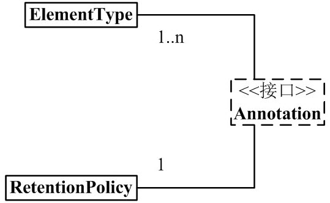
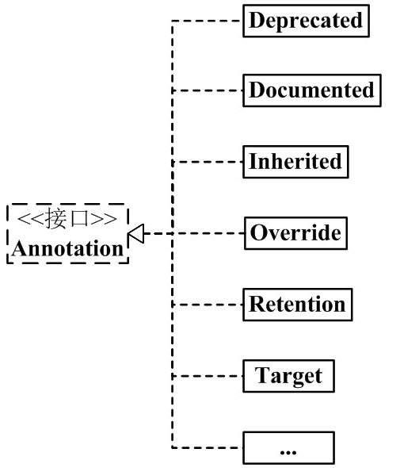
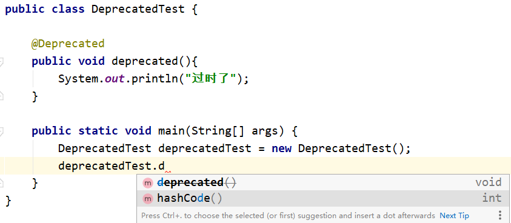
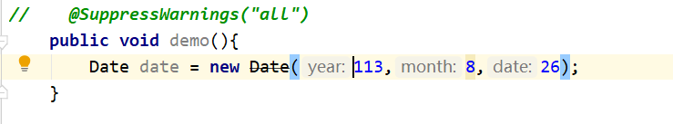
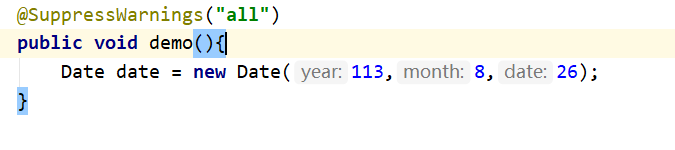
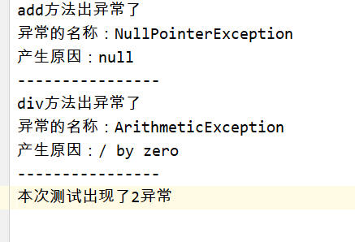

# Java 注解（Annotation）

Java 注解（Annotation）又称 Java 标注，是 JDK5.0 引入的一种注释机制。

Java 语言中的类、方法、变量、参数和包等都可以被标注。和 Javadoc 不同，Java 标注可以通过反射获取标注内容。在编译器生成类文件时，标注可以被嵌入到字节码中。Java 虚拟机可以保留标注内容，在运行时可以获取到标注内容 。 当然它也支持自定义 Java 标注。

网上很多关于 Java Annotation 的文章，看得人眼花缭乱。Java Annotation 本来很简单的，结果说的人没说清楚；弄的看的人更加迷糊。

我按照自己的思路，对 Annotation 进行了整理。理解 Annotation 的关键，是理解 Annotation 的语法和用法，对这些内容，我都进行了详细说明；理解 Annotation 的语法和用法之后，再看 Annotation 的框架图，可能有更深刻体会。废话就说这么多，下面开始对 Annotation 进行说明。若您发现文章中存在错误或不足的地方，希望您能指出！

## 0、内置的注解

Java 定义了一套注解，共有 7 个，3 个在 java.lang 中，剩下 4 个在 java.lang.annotation 中。

**作用在代码的注解是**

- @Override - 检查该方法是否是重写方法。如果发现其父类，或者是引用的接口中并没有该方法时，会报编译错误。
- @Deprecated - 标记过时方法。如果使用该方法，会报编译警告。
- @SuppressWarnings - 指示编译器去忽略注解中声明的警告。

作用在其他注解的注解(或者说 元注解)是:

- @Retention - 标识这个注解怎么保存，是只在代码中，还是编入class文件中，或者是在运行时可以通过反射访问。
- @Documented - 标记这些注解是否包含在用户文档中。
- @Target - 标记这个注解应该是哪种 Java 成员。
- @Inherited - 标记这个注解是继承于哪个注解类(默认 注解并没有继承于任何子类)

从 Java 7 开始，额外添加了 3 个注解:

- @SafeVarargs - Java 7 开始支持，忽略任何使用参数为泛型变量的方法或构造函数调用产生的警告。
- @FunctionalInterface - Java 8 开始支持，标识一个匿名函数或函数式接口。
- @Repeatable - Java 8 开始支持，标识某注解可以在同一个声明上使用多次。

## 1、Annotation 架构


从中，我们可以看出：

**(01) 1 个 Annotation 和 1 个 RetentionPolicy 关联。**

可以理解为：每1个Annotation对象，都会有唯一的RetentionPolicy属性。

**(02) 1 个 Annotation 和 1~n 个 ElementType 关联。**

可以理解为：对于每 1 个 Annotation 对象，可以有若干个 ElementType 属性。

**(03) Annotation 有许多实现类，包括：Deprecated, Documented, Inherited, Override 等等。**

Annotation 的每一个实现类，都 "和 1 个 RetentionPolicy 关联" 并且 " 和 1~n 个 ElementType 关联"。

下面，我先介绍框架图的左半边(如下图)，即 Annotation, RetentionPolicy, ElementType；然后在就 Annotation 的实现类进行举例说明。



## 2、Annotation 组成部分

java Annotation 的组成中，有 3 个非常重要的主干类。它们分别是：

**Annotation.java**

```java
public interface Annotation {
   
    boolean equals(Object obj);

    
    int hashCode();

    
    String toString();

    
    Class<? extends Annotation> annotationType();
}
```

**ElementType.java**

```java
public enum ElementType {
    /** Class, interface (including annotation type), or enum declaration */
    /* 类、接口（包括注释类型）或枚举声明  */
    TYPE,

    /** Field declaration (includes enum constants) */
    /* 字段声明（包括枚举常量）  */
    FIELD,

    /** Method declaration */
    /* 方法声明  */
    METHOD,

    /** Formal parameter declaration */
    /* 参数声明  */
    PARAMETER,

    /** Constructor declaration */
    /* 构造方法声明  */
    CONSTRUCTOR,

    /** Local variable declaration */
    /* 局部变量声明  */
    LOCAL_VARIABLE,

    /** Annotation type declaration */
    /* 注释类型声明  */
    ANNOTATION_TYPE,

    /** Package declaration */
    /* 包声明  */
    PACKAGE,

    /**
     * Type parameter declaration
     *
     * @since 1.8
     */
    /* 类型参数声明*/
    TYPE_PARAMETER,

    /**
     * Use of a type
     *
     * @since 1.8
     */
    /* 类型的使用 */
    TYPE_USE
}
```

**RetentionPolicy.java**

```java
public enum RetentionPolicy {
    /**
     * Annotations are to be discarded by the compiler.
     */
    /* Annotation信息仅存在于编译器处理期间，编译器处理完之后就没有该Annotation信息了  */
    SOURCE,

    /**
     * Annotations are to be recorded in the class file by the compiler
     * but need not be retained by the VM at run time.  This is the default
     * behavior.
     */
    /* 编译器将Annotation存储于类对应的.class文件中。默认行为  */
    CLASS,

    /**
     * Annotations are to be recorded in the class file by the compiler and
     * retained by the VM at run time, so they may be read reflectively.
     *
     * @see java.lang.reflect.AnnotatedElement
     */
    /* 编译器将Annotation存储于class文件中，并且可由JVM读入 */
    RUNTIME
}
```

说明：

**(01) Annotation 就是个接口。**

"每 1 个 Annotation" 都与 "1 个 RetentionPolicy" 关联，并且与 "1～n 个 ElementType" 关联。可以通俗的理解为：每 1 个 Annotation 对象，都会有唯一的 RetentionPolicy 属性；至于 ElementType 属性，则有 1~n 个。

**(02) ElementType 是 Enum 枚举类型，它用来指定 Annotation 的类型。**

"每 1 个 Annotation" 都与 "1～n 个 ElementType" 关联。当 Annotation 与某个 ElementType 关联时，就意味着：Annotation有了某种用途。例如，若一个 Annotation 对象是 METHOD 类型，则该 Annotation 只能用来修饰方法。

**(03) RetentionPolicy 是 Enum 枚举类型，它用来指定 Annotation 的策略。通俗点说，就是不同 RetentionPolicy 类型的 Annotation 的作用域不同。**

"每 1 个 Annotation" 都与 "1 个 RetentionPolicy" 关联。

- a) 若 Annotation 的类型为 SOURCE，则意味着：Annotation 仅存在于编译器处理期间，编译器处理完之后，该 Annotation 就没用了。 例如，" @Override" 标志就是一个 Annotation。当它修饰一个方法的时候，就意味着该方法覆盖父类的方法；并且在编译期间会进行语法检查！编译器处理完后，"@Override" 就没有任何作用了。
- b) 若 Annotation 的类型为 CLASS，则意味着：编译器将 Annotation 存储于类对应的 .class 文件中，它是 Annotation 的默认行为。
- c) 若 Annotation 的类型为 RUNTIME，则意味着：编译器将 Annotation 存储于 class 文件中，并且可由JVM读入。

这时，只需要记住"每 1 个 Annotation" 都与 "1 个 RetentionPolicy" 关联，并且与 "1～n 个 ElementType" 关联。学完后面的内容之后，再回头看这些内容，会更容易理解。

## 3、java 自带的 Annotation

理解了上面的 3 个类的作用之后，我们接下来可以讲解 Annotation 实现类的语法定义了。

### 1）Annotation 通用定义

```java
@Documented
@Target({ElementType.METHOD,ElementType.TYPE})
@Retention(RetentionPolicy.RUNTIME)
public @interface MyAnnotation {
    String value();
}
```

说明：

上面的作用是定义一个 Annotation，它的名字是 MyAnnotation1。定义了 MyAnnotation1 之后，我们可以在代码中通过 "@MyAnnotation1" 来使用它。 其它的，@Documented, @Target, @Retention, @interface 都是来修饰 MyAnnotation1 的。下面分别说说它们的含义：

**(01) @interface**

使用 @interface 定义注解时，意味着它实现了 java.lang.annotation.Annotation 接口，即该注解就是一个Annotation。

定义 Annotation 时，@interface 是必须的。

注意：它和我们通常的 implemented 实现接口的方法不同。Annotation 接口的实现细节都由编译器完成。通过 @interface 定义注解后，该注解不能继承其他的注解或接口。

**(02) @Documented**

类和方法的 Annotation 在缺省情况下是不出现在 javadoc 中的。如果使用 @Documented 修饰该 Annotation，则表示它可以出现在 javadoc 中。

定义 Annotation 时，@Documented 可有可无；若没有定义，则 Annotation 不会出现在 javadoc 中。

**(03) @Target(ElementType.TYPE)**

前面我们说过，ElementType 是 Annotation 的类型属性。而 @Target 的作用，就是来指定 Annotation 的类型属性。

@Target(ElementType.TYPE) 的意思就是指定该 Annotation 的类型是 ElementType.TYPE。这就意味着，MyAnnotation1 是来修饰"类、接口（包括注释类型）或枚举声明"的注解。

定义 Annotation 时，@Target 可有可无。若有 @Target，则该 Annotation 只能用于它所指定的地方；若没有 @Target，则该 Annotation 可以用于任何地方。

**(04) @Retention(RetentionPolicy.RUNTIME)**

前面我们说过，RetentionPolicy 是 Annotation 的策略属性，而 @Retention 的作用，就是指定 Annotation 的策略属性。

@Retention(RetentionPolicy.RUNTIME) 的意思就是指定该 Annotation 的策略是 RetentionPolicy.RUNTIME。这就意味着，编译器会将该 Annotation 信息保留在 .class 文件中，并且能被虚拟机读取。

定义 Annotation 时，@Retention 可有可无。若没有 @Retention，则默认是 RetentionPolicy.CLASS。

### 2）java自带的Annotation

通过上面的示例，我们能理解：@interface 用来声明 Annotation，@Documented 用来表示该 Annotation 是否会出现在 javadoc 中， @Target 用来指定 Annotation 的类型，@Retention 用来指定 Annotation 的策略。

理解这一点之后，我们就很容易理解 java 中自带的 Annotation 的实现类，即 Annotation 架构图的右半边。如下图：



**java 常用的 Annotation：**

```java
@Deprecated  -- @Deprecated 所标注内容，不再被建议使用。
@Override    -- @Override 只能标注方法，表示该方法覆盖父类中的方法。
@Documented  -- @Documented 所标注内容，可以出现在javadoc中。
@Inherited   -- @Inherited只能被用来标注“Annotation类型”，它所标注的Annotation具有继承性。
@Retention   -- @Retention只能被用来标注“Annotation类型”，而且它被用来指定Annotation的RetentionPolicy属性。
@Target      -- @Target只能被用来标注“Annotation类型”，而且它被用来指定Annotation的ElementType属性。
@SuppressWarnings -- @SuppressWarnings 所标注内容产生的警告，编译器会对这些警告保持静默。
```

由于 "@Deprecated 和 @Override" 类似，"@Documented, @Inherited, @Retention, @Target" 类似；下面，我们只对 @Deprecated, @Inherited, @SuppressWarnings 这 3 个 Annotation 进行说明。

**2.1) @Deprecated**

@Deprecated 的定义如下：

```java
@Documented
@Retention(RetentionPolicy.RUNTIME)
public @interface Deprecated {
}
```

说明：

- (01) @interface -- 它的用来修饰 Deprecated，意味着 Deprecated 实现了 java.lang.annotation.Annotation 接口；即 Deprecated 就是一个注解。 (02) @Documented -- 它的作用是说明该注解能出现在 javadoc 中。
- (03) @Retention(RetentionPolicy.RUNTIME) -- 它的作用是指定 Deprecated 的策略是 RetentionPolicy.RUNTIME。这就意味着，编译器会将Deprecated 的信息保留在 .class 文件中，并且能被虚拟机读取。
- (04) @Deprecated 所标注内容，不再被建议使用。

例如，若某个方法被 @Deprecated 标注，则该方法不再被建议使用。如果有开发人员试图使用或重写被 @Deprecated 标示的方法，编译器会给相应的提示信息。示例如下:



**2.2) @Inherited**

@Inherited 的定义如下：

```java
@Documented
@Retention(RetentionPolicy.RUNTIME)
@Target(ElementType.ANNOTATION_TYPE)
public @interface Inherited {
}
```

说明：

- (01) @interface -- 它的用来修饰 Inherited，意味着 Inherited 实现了 java.lang.annotation.Annotation 接口；即 Inherited 就是一个注解。
- (02) @Documented -- 它的作用是说明该注解能出现在 javadoc 中。
- (03) @Retention(RetentionPolicy.RUNTIME) -- 它的作用是指定 Inherited 的策略是 RetentionPolicy.RUNTIME。这就意味着，编译器会将 Inherited 的信息保留在 .class 文件中，并且能被虚拟机读取。
- (04) @Target(ElementType.ANNOTATION_TYPE) -- 它的作用是指定 Inherited 的类型是 ANNOTATION_TYPE。这就意味着，@Inherited 只能被用来标注 "Annotation 类型"。
- (05) @Inherited 的含义是，它所标注的Annotation将具有继承性。

假设，我们定义了某个 Annotaion，它的名称是 MyAnnotation，并且 MyAnnotation 被标注为 @Inherited。现在，某个类 Base 使用了

MyAnnotation，则 Base 具有了"具有了注解 MyAnnotation"；现在，Sub 继承了 Base，由于 MyAnnotation 是 @Inherited的(具有继承性)，所以，Sub 也 "具有了注解 MyAnnotation"。

@Inherited 的使用示例:

```java
/**
 * 自定义的Annotation。
 */
@Target(ElementType.TYPE)
@Retention(RetentionPolicy.RUNTIME)
@Inherited
@interface Inheritable
{
}

@Inheritable
class InheritableFather
{
    public InheritableFather() {
        // InheritableBase是否具有 Inheritable Annotation
        System.out.println("InheritableFather:"+InheritableFather.class.isAnnotationPresent(Inheritable.class));
    }
}

public class InheritableSon extends InheritableFather{
    public InheritableSon() {
        // InheritableSon类是否具有 Inheritable Annotation
        System.out.println("InheritableSon:"+InheritableSon.class.isAnnotationPresent(Inheritable.class));
    }

    public static void main(String[] args)
    {
        InheritableSon is = new InheritableSon();
    }
}
```

运行结果：

```java
InheritableFather:true
InheritableSon:true
```

现在，我们对 InheritableSon.java 进行修改：注释掉 "Inheritable 的 @Inherited 注解"。

```java
InheritableFather:true
InheritableSon:false
```

对比上面的两个结果，我们发现：当注解 Inheritable 被 @Inherited 标注时，它具有继承性。否则，没有继承性。

**2.3) @SuppressWarnings**

@SuppressWarnings 的定义如下：

```
@Target({TYPE, FIELD, METHOD, PARAMETER, CONSTRUCTOR, LOCAL_VARIABLE})
@Retention(RetentionPolicy.SOURCE)
public @interface SuppressWarnings {
    String[] value();
}
```

说明：

(01) @interface -- 它的用来修饰 SuppressWarnings，意味着 SuppressWarnings 实现了 java.lang.annotation.Annotation 接口；即 SuppressWarnings 就是一个注解。

(02) @Retention(RetentionPolicy.SOURCE) -- 它的作用是指定 SuppressWarnings 的策略是 RetentionPolicy.SOURCE。这就意味着，SuppressWarnings 信息仅存在于编译器处理期间，编译器处理完之后 SuppressWarnings 就没有作用了。

(03) @Target({TYPE, FIELD, METHOD, PARAMETER, CONSTRUCTOR, LOCAL_VARIABLE}) -- 它的作用是指定 SuppressWarnings 的类型同时包括TYPE, FIELD, METHOD, PARAMETER, CONSTRUCTOR, LOCAL_VARIABLE。

- TYPE 意味着，它能标注"类、接口（包括注释类型）或枚举声明"。
- FIELD 意味着，它能标注"字段声明"。
- METHOD 意味着，它能标注"方法"。
- PARAMETER 意味着，它能标注"参数"。
- CONSTRUCTOR 意味着，它能标注"构造方法"。
- LOCAL_VARIABLE 意味着，它能标注"局部变量"。

(04) String[] value(); 意味着，SuppressWarnings 能指定参数

(05) SuppressWarnings 的作用是，让编译器对"它所标注的内容"的某些警告保持静默。例如，"@SuppressWarnings(value={"deprecation", "unchecked"})" 表示对"它所标注的内容"中的 "SuppressWarnings 不再建议使用警告"和"未检查的转换时的警告"保持沉默。示例如下：





说明：

(01) 左边的图中，没有使用 @SuppressWarnings(value={"deprecation"}) , 而 Date 属于 java 不再建议使用的类。因此，调用 Date 的 API 时，会产生警告。而右边的途中，使用了 @SuppressWarnings(value={"deprecation"})。因此，编译器对"调用 Date 的 API 产生的警告"保持沉默。

补充：SuppressWarnings 常用的关键字的表格

```
deprecation  -- 使用了不赞成使用的类或方法时的警告
unchecked    -- 执行了未检查的转换时的警告，例如当使用集合时没有用泛型 (Generics) 来指定集合保存的类型。
fallthrough  -- 当 Switch 程序块直接通往下一种情况而没有 Break 时的警告。
path         -- 在类路径、源文件路径等中有不存在的路径时的警告。
serial       -- 当在可序列化的类上缺少 serialVersionUID 定义时的警告。
finally      -- 任何 finally 子句不能正常完成时的警告。
all          -- 关于以上所有情况的警告。
```

## 4、Annotation 的作用

Annotation 是一个辅助类，它在 Junit、Struts、Spring 等工具框架中被广泛使用。

我们在编程中经常会使用到的 Annotation 作用有：

### 1）编译检查

Annotation 具有"让编译器进行编译检查的作用"。

例如，@SuppressWarnings, @Deprecated 和 @Override 都具有编译检查作用。

(01) 关于 @SuppressWarnings 和 @Deprecated，已经在"第3部分"中详细介绍过了。这里就不再举例说明了。

(02) 若某个方法被 @Override 的标注，则意味着该方法会覆盖父类中的同名方法。如果有方法被 @Override 标示，但父类中却没有"被 @Override 标注"的同名方法，则编译器会报错。

### 2) 在反射中使用 Annotation

在反射的 Class, Method, Field 等函数中，有许多于 Annotation 相关的接口。

这也意味着，我们可以在反射中解析并使用 Annotation。

```java
@Target({ElementType.TYPE})
@Retention(RetentionPolicy.RUNTIME)
public @interface ReflectAnnotation {
    String className();
    String methodName();
}
```

```java
public class Person {
    public String name;
    protected int age;
    private String id;
    String mood;

    public Person() {
    }

    public Person(String name, int age, String id, String mood) {
        this.name = name;
        this.age = age;
        this.id = id;
        this.mood = mood;
    }

    public String getName() {
        return name;
    }

    public void setName(String name) {
        this.name = name;
    }

    public int getAge() {
        return age;
    }

    public void setAge(int age) {
        this.age = age;
    }

    public String getId() {
        return id;
    }

    public void setId(String id) {
        this.id = id;
    }

    public String getMood() {
        return mood;
    }

    public void setMood(String mood) {
        this.mood = mood;
    }

    @Override
    public String toString() {
        return "Preson{" +
                "name='" + name + '\'' +
                ", age=" + age +
                ", id='" + id + '\'' +
                ", mood='" + mood + '\'' +
                '}';
    }

    public void eat(){
        System.out.println("eat...");
    }

    public void sleep(String where){
        System.out.println("sleep..."+where);
    }
}
```

```java
@ReflectAnnotation(className = "com.example.demo.reflect.Person",methodName = "sleep")
public class ReflectTest {
    public static void main(String[] args) throws Exception {
        //获取该类的字节码对象
        Class<ReflectTest> reflectTestClass = ReflectTest.class;
        //获取注解对象，会自动创建注解的实现类，方法返回参数值
        ReflectAnnotation annotation = reflectTestClass.getAnnotation(ReflectAnnotation.class);
        //调用注解中的抽象方法
        String className = annotation.className();
        String method = annotation.methodName();


        //利用反射
        Class<?> clazz = Class.forName(className);
        Object o = clazz.newInstance();
        Method m = clazz.getMethod(method,String.class);
        m.invoke(o,"在学校");


    }
}
```

### 3) 根据 Annotation 生成帮助文档

通过给 Annotation 注解加上 @Documented 标签，能使该 Annotation 标签出现在 javadoc 中。

### 4) 能够帮忙查看查看代码

通过 @Override, @Deprecated 等，我们能很方便的了解程序的大致结构。

另外，我们也可以通过自定义 Annotation 来实现一些功能。


## 5、练习

写一个检查异常的注解

```java
@Retention(RetentionPolicy.RUNTIME)
@Target({ElementType.METHOD})
public @interface Check {
}
```

要检查的类

```java
public class Calculator {
    @Check
    public void add(){
        String str=null;
        System.out.println(str.toString());
        System.out.println("1+0="+(1+0));
    }

    @Check
    public void sub(){
        System.out.println("1-0="+(1-0));
    }

    @Check
    public void mul(){
        System.out.println("1*0="+(1*0));
    }

    @Check
    public void div(){
        System.out.println("1/0="+(1/0));
    }

    public void show(){
        System.out.println("无Bug...");
    }
}
```

测试

```java
public class CheckTest {
    public static void main(String[] args) throws IOException {
        Calculator calculator = new Calculator();
        Class<? extends Calculator> calculatorClass = calculator.getClass();
        Method[] methods = calculatorClass.getMethods();

        int number = 0;//出现异常的次数
        BufferedWriter bw = new BufferedWriter(new FileWriter("CheckResult.txt"));//把异常结果输入到日志中

        for (Method method : methods) {
            if (method.isAnnotationPresent(Check.class)){
                try {
                    method.invoke(calculator);
                } catch (Exception e) {
                    number++;
                    bw.write(method.getName()+"方法出异常了");
                    bw.newLine();
                    bw.write("异常的名称："+e.getCause().getClass().getSimpleName());
                    bw.newLine();
                    bw.write("产生原因："+e.getCause().getMessage());
                    bw.newLine();
                    bw.write("----------------");
                    bw.newLine();
                }

            }
        }
        bw.write("本次测试出现了"+number+"异常");
        bw.flush();
        bw.close();
    }
}
```

结果



