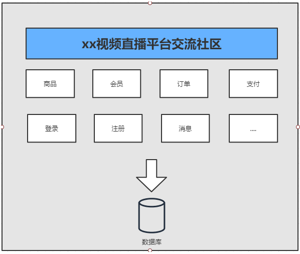
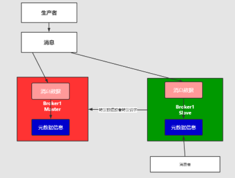
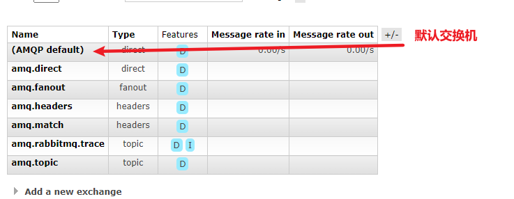
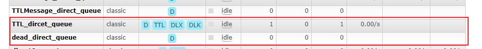
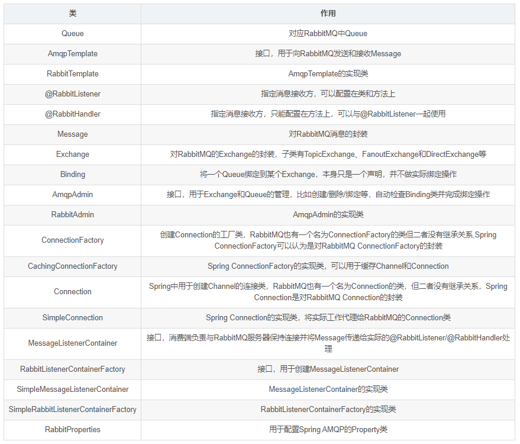

# 消息队列RebbitMq
# 认识中间件
## 1、什么是中间件
我国企业从20世纪80年代开始就逐渐进行信息化建设，由于方法和体系的不成熟，以及企业业务和市场需求的不断变化，一个企业可能同时运行着多个不同的业务系统，这些系统可能基于不同的操作系统、不同的数据库、异构的网络环境。现在的问题是，如何把这些信息系统结合成一个有机地协同工作的整体，真正实现企业跨平台、分布式应用。中间件便是解决之道，它用自己的复杂换取了企业应用的简单


> 中间件（Middleware）是处于操作系统和应用程序之间的软件，也有人认为它应该属于操作系统中的一部分。人们在使用中间件时，往往是一组中间件集成在一起，构成一个平台（包括开发平台和运行平台），但在这组中间件中必须要有一个通信中间件，即中间件=平台+通信，这个定义也限定了只有用于分布式系统中才能称为中间件，同时还可以把它与支撑软件和实用软件区分开来。


举例：

1. RMI（Remote Method Invocations, 远程调用）
2. Load Balancing(负载均衡，将访问负荷分散到各个服务器中)
3. Transparent Fail-over(透明的故障切换)
4. Clustering(集群,用多个小的服务器代替大型机）
5. Back-end-Integration(后端集成，用现有的、新开发的系统如何去集成遗留的系统)
6. Transaction事务（全局/局部）全局事务（分布式事务）局部事务（在同一数据库联接内的事务）
7. Dynamic Redeployment(动态重新部署,在不停止原系统的情况下，部署新的系统）
8. System Management(系统管理)
9. Threading(多线程处理)
10. Message-oriented Middleware面向消息的中间件（异步的调用编程）
11. Component Life Cycle(组件的生命周期管理)
12. Resource pooling（资源池）
13. Security（安全）
14. Caching（缓存）


## 2、为什么需要使用消息中间件
具体地说，中间件屏蔽了底层操作系统的复杂性，使程序开发人员面对一个简单而统一的开发环境，减少程序设计的复杂性，将注意力集中在自己的业务上，不必再为程序在不同系统软件上的移植而重复工作，从而大大减少了技术上的负担。中间件带给应用系统的，不只是开发的简便、开发周期的缩短，也减少了系统的维护、运行和管理的工作量，还减少了计算机总体费用的投入。

## 3、中间件特点
为解决分布异构问题，人们提出了中间件(middleware)的概念。中间件是位于平台(硬件和操作系统)和应用之间的通用服务，如下图所示，这些服务具有标准的程序接口和协议。针对不同的操作系统和硬件平台，它们可以有符合接口和协议规范的多种实现。


也许很难给中间件一个严格的定义，但中间件应具有如下的一些特点：

1. 满足大量应用的需要
2. 运行于多种硬件和OS平台
3. 支持分布计算，提供跨网络、硬件和OS平台的透明性的应用或服务的交互
4. 支持标准的协议
5. 支持标准的接口

由于标准接口对于可移植性和标准协议对于互操作性的重要性，中间件已成为许多标准化工作的主要部分。对于应用软件开发，中间件远比操作系统和网络服务更为重要，中间件提供的程序接口定义了一个相对稳定的高层应用环境，不管底层的计算机硬件和系统软件怎样更新换代，只要将中间件升级更新，并保持中间件对外的接口定义不变，应用软件几乎不需任何修改，从而保护了企业在应用软件开发和维护中的重大投资。


> 简单说：中间件有个很大的特点，是脱离于具体设计目标，而具备提供普遍独立功能需求的模块。这使得中间件一定是可替换的。如果一个系统设计中，中间件是不可替换的，不是架构、框架设计有问题，那么就是这个中间件，在 别处可能是个中间件，在这个系统内是引擎。哈。


## 4、在项目中什么时候使用中间件技术
在项目的架构和重构中，使用任何技术和架构的改变我们都需要谨慎斟酌和思考，因为任何技术的融入和变化都可能人员，技术，和成本的增加，中间件的技术一般现在一些互联网公司或者项目中使用比较多，如果你仅仅还只是一个初创公司建议还是使用单体架构，最多加个缓存中间件即可，不要盲目追求新或者所谓的高性能，而追求的背后一定是业务的驱动和项目的驱动，因为一旦追求就意味着你的学习成本，公司的人员结构以及服务器成本，维护和运维的成本都会增加，所以需要谨慎选择和考虑。

但是作为一个开放人员，一定要有学习中间件技术的能力和思维，否则很容易当项目发展到一个阶段在去掌握估计或者在面试中提及，就会给自己带来不小的困扰，在当今这个时代这些技术也并不是什么新鲜的东西，如果去掌握和挖掘最关键的还是自己花时间和花精力去探讨和研究。

## 5、中间件类型
* 消息中间件 ActiveMQ
* 消息中间件 RabbitMQ
* 消息中间件 Kafaka
* 消息中间件 RocketMQ
* 消息中间件应用场景说明
* 负载均衡中间件(Nginx/Lvs)
* 缓存中间件(Memcache/Redis)
* 数据库中间件(ShardingJdbc/Mycat)

# 中间件技术及架构的概述
## 1、单体架构
在企业开发的中，大部分的初期架构都采用的是单体架构的模式进行架构，而这种架构的典型的特点：就是把所有的业务和模块，源代码，静态资源文件等都放在一个一工程中，如果其中的一个模块升级或者迭代发生一个很小变动都会重新编译和重新部署项目。 这种的架构存在的问题就是：

1. 耦合度太高
2. 运维的成本过高
3. 不易维护
4. 服务器的成本高
5. 以及升级架构的复杂度也会增大

这样就有后续的分布式架构系统。如下




## 2、分布式架构


何谓分布式系统呢：

> 通俗一点：就是一个请求由服务器端的多个服务（服务或者系统）协同处理完成

和单体架构不同的是，单体架构是一个请求发起jvm调度线程（确切的是tomcat线程池）分配线程Thread来处理请求直到释放，而分布式是系统是：一个请求是由多个系统共同来协同完成，jvm和环境都可能是独立。如果生活中的比喻的话，单体架构就想建设一个小房子很快就能够搞定，如果你要建设一个鸟巢或者大型的建筑，你就必须是各个环节的协同和分布，这样目的也是项目发展都后期的时候要去部署和思考的问题。我们也不能看出来：分布式架构系统存在的特点和问题如下：

**存在问题**

1. 学习成本高，技术栈过多
2. 运维成本和服务器成本增高
3. 人员的成本也会增高
4. 项目的负载度也会上升
5. 面临的错误和容错性也会成倍增加
6. 占用的服务器端口和通讯的选择的成本高
7. 安全性的考虑和因素逼迫可能选择RMI/MQ相关的服务器端通讯。

**好处**

1. 服务系统的独立，占用的服务器资源减少和占用的硬件成本减少，确切的说是：可以合理的分配服务资源，不造成服务器资源的浪费
2. 系统的独立维护和部署，耦合度降低，可插拔性。
3. 系统的架构和技术栈的选择可以变的灵活（而不是单纯的选择java）
4. 弹性的部署，不会造成平台因部署造成的瘫痪和停服的状态。

## 3、基于消息中间件的分布式系统的架构


从上图中可以看出来，消息中间件的是

1. 利用可靠的消息传递机制进行系统和系统直接的通讯
2. 通过提供消息传递和消息的排队机制，它可以在分布式系统环境下扩展进程间的通讯。

## 4、消息中间件应用的场景
1. 跨系统数据传递
2. 高并发的流量削峰
3. 数据的分发和异步处理
4. 大数据分析与传递
5. 分布式事务

比如你有一个数据要进行迁移或者请求并发过多的时候，比如你有10W的并发请求下订单，我们可以在这些订单入库之前，我们可以把订单请求堆积到消息队列中，让它稳健可靠的入库和执行。

它是一种接受数据，接受请求、存储数据、发送数据等功能的技术服务。

> MQ消息队列：负责数据的传接受，存储和传递，所以性能要过于普通服务和技术。


谁来生产消息，存储消息和消费消息呢？


## 5、消息中间件的核心组成部分
1. 消息的协议
2. 消息的持久化机制
3. 消息的分发策略
4. 消息的高可用，高可靠
5. 消息的容错机制

# 消息队列协议
## 1、什么是协议


我们知道消息中间件负责数据的传递，存储，和分发消费三个部分，数据的存储和分发的过程中肯定要遵循某种约定成俗的规范，你是采用底层的TCP/IP，UDP协议还是其他的自己取构建等，而这些约定成俗的规范就称之为：协议。

> 所谓协议是指：
1：计算机底层操作系统和应用程序通讯时共同遵守的一组约定，只有遵循共同的约定和规范，系统和底层操作系统之间才能相互交流。
2：和一般的网络应用程序的不同它主要负责数据的接受和传递，所以性能比较的高。
3：协议对数据格式和计算机之间交换数据都必须严格遵守规范。

## 2、网络协议的三要素
1.语法。语法是用户数据与控制信息的结构与格式,以及数据出现的顺序。
2.语义。语义是解释控制信息每个部分的意义。它规定了需要发出何种控制信息,以及完成的动作与做出什么样的响应。
3.时序。时序是对事件发生顺序的详细说明。

比如我MQ发送一个信息，是以什么数据格式发送到队列中，然后每个部分的含义是什么，发送完毕以后的执行的动作，以及消费者消费消息的动作，消费完毕的响应结果和反馈是什么，然后按照对应的执行顺序进行处理。如果你还是不理解：大家每天都在接触的http请求协议:

> 1：语法：http规定了请求报文和响应报文的格式。
2：语义：客户端主动发起请求称之为请求。（这是一种定义，同时你发起的是post/get请求）
3：时序：一个请求对应一个响应。（一定先有请求在有响应，这个是时序）

而消息中间件采用的并不是http协议，而常见的消息中间件协议有：OpenWire、AMQP、MQTT、Kafka，OpenMessage协议。

> **面试题：为什么消息中间件不直接使用http协议呢？**1: 因为http请求报文头和响应报文头是比较复杂的，包含了cookie，数据的加密解密，状态码，响应码等附加的功能，但是对于一个消息而言，我们并不需要这么复杂，也没有这个必要性，它其实就是负责数据传递，存储，分发就行，一定要追求的是高性能。尽量简洁，快速。
2:大部分情况下http大部分都是短链接，在实际的交互过程中，一个请求到响应很有可能会中断，中断以后就不会就行持久化，就会造成请求的丢失。这样就不利于消息中间件的业务场景，因为消息中间件可能是一个长期的获取消息的过程，出现问题和故障要对数据或消息就行持久化等，目的是为了保证消息和数据的高可靠和稳健的运行。


## 3：AMQP协议
AMQP：(全称：Advanced Message Queuing Protocol) 是高级消息队列协议。由摩根大通集团联合其他公司共同设计。是一个提供统一消息服务的应用层标准高级消息队列协议，是应用层协议的一个开放标准，为面向消息的中间件设计。基于此协议的客户端与消息中间件可传递消息，并不受客户端/中间件不同产品，不同的开发语言等条件的限制。Erlang中的实现有RabbitMQ等。
特性：
1：分布式事务支持。
2：消息的持久化支持。
3：高性能和高可靠的消息处理优势。


## 4：MQTT协议
MQTT协议：（Message Queueing Telemetry Transport）消息队列是IBM开放的一个即时通讯协议，物联网系统架构中的重要组成部分。
特点：
1：轻量
2：结构简单
3：传输快，不支持事务
4：没有持久化设计。
应用场景：
1：适用于计算能力有限
2：低带宽
3：网络不稳定的场景。


## 5、OpenMessage协议


是近几年由阿里、雅虎和滴滴出行、Stremalio等公司共同参与创立的分布式消息中间件、流处理等领域的应用开发标准。
特点：
1：结构简单
2：解析速度快
3：支持事务和持久化设计。

## 6、Kafka协议


Kafka协议是基于TCP/IP的二进制协议。消息内部是通过长度来分割，由一些基本数据类型组成。
特点是：
1：结构简单
2：解析速度快
3：无事务支持
4：有持久化设计

## 7、小结
协议：是在tcp/ip协议基础之上构建的一种约定成俗的规范和机制、它的主要目的可以让客户端（应用程序 java，go）进行沟通和通讯。并且这种协议下规范必须具有持久性，高可用，高可靠的性能。


# 消息队列持久化
## 1、持久化
简单来说就是将数据存入磁盘，而不是存在内存中随服务器重启断开而消失，使数据能够永久保存。


## 2、常见的持久化方式
|ActiveMQ|RabbitMQ|Kafka|RocketMQ| |
| ----- | ----- | ----- | ----- | ----- |
|文件存储|支持|支持|支持|支持|
|数据库|支持|/|/|/|

# 消息的分发策略
## 1、消息的分发策略
MQ消息队列有如下几个角色
1：生产者
2：存储消息
3：消费者
那么生产者生成消息以后，MQ进行存储，消费者是如何获取消息的呢？一般获取数据的方式无外乎推（push）或者拉（pull）两种方式，典型的git就有推拉机制，我们发送的http请求就是一种典型的拉取数据库数据返回的过程。而消息队列MQ是一种推送的过程，而这些推机制会适用到很多的业务场景也有很多对应推机制策略

## 2、场景分析一
比如我在APP上下了一个订单，我们的系统和服务很多，我们如何得知这个消息被那个系统或者那些服务或者系统进行消费，那这个时候就需要一个分发的策略。这就需要消费策略。或者称之为消费的方法论。


## 3、场景分析二
在发送消息的过程中可能会出现异常，或者网络的抖动，故障等等因为造成消息的无法消费，比如用户在下订单，消费MQ接受，订单系统出现故障，导致用户支付失败，那么这个时候就需要消息中间件就必须支持消息重试机制策略。也就是支持：出现问题和故障的情况下，消息不丢失还可以进行重发。


## 4、消息分发策略的机制和对比
|ActiveMQ|RabbitMQ|Kafka|RocketMQ| |
| ----- | ----- | ----- | ----- | ----- |
|发布订阅|支持|支持|支持|支持|
|轮询分发|支持|支持|支持|/|
|公平分发|/|支持|支持|/|
|重发|支持|支持|/|支持|
|消息拉取|/|支持|支持|支持|

# 消息队列高可用和高可靠
## 1、什么是高可用机制
所谓高可用：是指产品在规定的条件和规定的时刻或时间内处于可执行规定功能状态的能力。
当业务量增加时，请求也过大，一台消息中间件服务器的会触及硬件（CPU,内存，磁盘）的极限，一台消息服务器你已经无法满足业务的需求，所以消息中间件必须支持集群部署。来达到高可用的目的。

## 2、集群模式1 - Master-slave主从共享数据的部署方式


解说：生产者讲消费发送到Master节点，所有的都连接这个消息队列共享这块数据区域，Master节点负责写入，一旦Master挂掉，slave节点继续服务。从而形成高可用

## 3、集群模式2 - Master- slave主从同步部署方式


解释：这种模式写入消息同样在Master主节点上，但是主节点会同步数据到slave节点形成副本，和zookeeper或者redis主从机制很类同。这样可以达到负载均衡的效果，如果消费者有多个这样就可以去不同的节点就行消费，以为消息的拷贝和同步会暂用很大的带宽和网络资源。在后续的rabbtmq中会有使用。

## 4、集群模式3 - 多主集群同步部署模式


解释：和上面的区别不是特别的大，但是它的写入可以往任意节点去写入。

## 5、集群模式4 - 多主集群转发部署模式


解释：如果你插入的数据是broker-1中，元数据信息会存储数据的相关描述和记录存放的位置（队列）。
它会对描述信息也就是元数据信息就行同步，如果消费者在broker-2中进行消费，发现自己几点没有对应的消息，可以从对应的元数据信息中去查询，然后返回对应的消息信息，场景：比如买火车票或者黄牛买演唱会门票，比如第一个黄牛有顾客说要买的演唱会门票，但是没有但是他会去联系其他的黄牛询问，如果有就返回。

## 6、集群模式5 Master-slave与Breoker-cluster组合的方案


解释：实现多主多从的热备机制来完成消息的高可用以及数据的热备机制，在生产规模达到一定的阶段的时候，这种使用的频率比较高。

这么集群模式，具体在后续的课程中会进行一个分析和讲解。他们的最终目的都是为保证：消息服务器不会挂掉，出现了故障依然可以抱着消息服务继续使用。

**反正终归三句话：**
**1：要么消息共享，**
**2：要么消息同步**
**3：要么元数据共享**

## 7、什么是高可靠机制
所谓高可用是指：是指系统可以无故障低持续运行，比如一个系统突然崩溃，报错，异常等等并不影响线上业务的正常运行，出错的几率极低，就称之为：高可靠。
在高并发的业务场景中，如果不能保证系统的高可靠，那造成的隐患和损失是非常严重的。
如何保证中间件消息的可靠性呢？可以从两个方面考虑：
1：消息的传输：通过协议来保证系统间数据解析的正确性。
2：消息的存储可靠：通过持久化来保证消息的可靠性。

# RabbitMQ入门和安装
## 1、概述
官网：https://www.rabbitmq.com/
什么是RabbitMQ,官方给出来这样的解释：

> RabbitMQ is the most widely deployed open source message broker.
With tens of thousands of users, RabbitMQ is one of the most popular open source message brokers. From T-Mobile to Runtastic, RabbitMQ is used worldwide at small startups and large enterprises.
RabbitMQ is lightweight and easy to deploy on premises and in the cloud. It supports multiple messaging protocols. RabbitMQ can be deployed in distributed and federated configurations to meet high-scale, high-availability requirements.
RabbitMQ runs on many operating systems and cloud environments, and provides a wide range of developer tools for most popular languages.
翻译以后：
RabbitMQ是部署最广泛的开源消息代理。
RabbitMQ拥有成千上万的用户，是最受欢迎的开源消息代理之一。从T-Mobile 到Runtastic，RabbitMQ在全球范围内的小型初创企业和大型企业中都得到使用。
RabbitMQ轻巧，易于在内部和云中部署。它支持多种消息传递协议。RabbitMQ可以部署在分布式和联合配置中，以满足大规模，高可用性的要求。
RabbitMQ可在许多操作系统和云环境上运行，并为大多数流行语言提供了广泛的开发人员工具。

简单概述：
RabbitMQ是一个开源的遵循AMQP协议实现的基于Erlang语言编写，支持多种客户端（语言）。用于在分布式系统中存储消息，转发消息，具有高可用，高可扩性，易用性等特征。

## 2、安装Erlang
1：下载地址：https://www.rabbitmq.com/download.html
2：环境准备：CentOS7.x+ / Erlang
RabbitMQ是采用Erlang语言开发的，所以系统环境必须提供Erlang环境，第一步就是安装Erlang。

查看系统版本号

```bash
[root@iZm5eauu5f1ulwtdgwqnsbZ ~]# lsb_release -a
LSB Version:    :core-4.1-amd64:core-4.1-noarch
Distributor ID: CentOS
Description:    CentOS Linux release 8.3.2011
Release:        8.3.2011Codename:       n/a
```
### 2-1:安装下载
参考地址：https://www.erlang-solutions.com/downloads/

```bash
wget https://packages.erlang-solutions.com/erlang-solutions-2.0-1.noarch.rpm
rpm -Uvh erlang-solutions-2.0-1.noarch.rpm
```
### 2-2：安装成功
```bash
yum install -y erlang
```
### 2-3：安装成功
```bash
erl -v
```
## 3、安装socat
```bash
yum install -y socat
```
### 4、安装rabbitmq
#### 4-1:下载rabbitmq
```bash
> wget https://github.com/rabbitmq/rabbitmq-server/releases/download/v3.8.13/rabbitmq-server-3.8.13-1.el8.noarch.rpm
> rpm -Uvh rabbitmq-server-3.8.13-1.el8.noarch.rpm
```
#### 4-2:启动rabbitmq服务
```bash
# 启动服务
> systemctl start rabbitmq-server
# 查看服务状态
> systemctl status rabbitmq-server
# 停止服务
> systemctl stop rabbitmq-server
# 开机启动服务
> systemctl enable rabbitmq-server
```
## 5、RabbitMQ的配置
RabbitMQ默认情况下有一个配置文件，定义了RabbitMQ的相关配置信息，默认情况下能够满足日常的开发需求。如果需要修改需要，需要自己创建一个配置文件进行覆盖。
参考官网：
1:https://www.rabbitmq.com/documentation.html
2:https://www.rabbitmq.com/configure.html
3:https://www.rabbitmq.com/configure.html#config-items
4：https://github.com/rabbitmq/rabbitmq-server/blob/add-debug-messages-to-quorum\_queue\_SUITE/docs/rabbitmq.conf.example

### 5-1、相关端口
> 5672:RabbitMQ的通讯端口
25672:RabbitMQ的节点间的CLI通讯端口是
15672:RabbitMQ HTTP\_API的端口，管理员用户才能访问，用于管理RabbitMQ,需要启动Management插件。
1883，8883：MQTT插件启动时的端口。
61613、61614：STOMP客户端插件启用的时候的端口。
15674、15675：基于webscoket的STOMP端口和MOTT端口

一定要注意：RabbitMQ 在安装完毕以后，会绑定一些端口，如果你购买的是阿里云或者腾讯云相关的服务器一定要在安全组中把对应的端口添加到防火墙。

# RabbitMQWeb管理界面及授权操作
## 1、RabbitMQ管理界面
### 1-1：默认情况下，rabbitmq是没有安装web端的客户端插件，需要安装才可以生效
```bash
rabbitmq-plugins enable rabbitmq_management
```
> 说明：rabbitmq有一个默认账号和密码是：`guest` 默认情况只能在localhost本机下访问，所以需要添加一个远程登录的用户。

### 1-2：安装完毕以后，重启服务即可
```bash
systemctl restart rabbitmq-server
```
> 一定要记住，在对应服务器(阿里云，腾讯云等)的安全组中开放`15672`的端口。

### 1-3：在浏览器访问
http://ip:15672/

## 2、授权账号和密码
### 2-1：新增用户
```bash
rabbitmqctl add_user admin admin
```
### 2-2:设置用户分配操作权限
```bash
rabbitmqctl set_user_tags admin administrator
```
用户级别：

* 1、administrator 可以登录控制台、查看所有信息、可以对rabbitmq进行管理
* 2、monitoring 监控者 登录控制台，查看所有信息
* 3、policymaker 策略制定者 登录控制台,指定策略
* 4、managment 普通管理员 登录控制台

### 2-3：为用户添加资源权限
```bash
rabbitmqctl set_permissions -p / admin ".*" ".*" ".*"
```
## 3、小结：
```bash
rabbitmqctl add_user 账号 密码
rabbitmqctl set_user_tags 账号 administrator
rabbitmqctl change_password Username Newpassword 修改密码
rabbitmqctl delete_user Username 删除用户
rabbitmqctl list_users 查看用户清单
rabbitmqctl set_permissions -p / 用户名 ".*" ".*" ".*" 为用户设置administrator角色
rabbitmqctl set_permissions -p / root ".*" ".*" ".*"
```
# Docker安装RabbitMQ
参考网站：
1：https://www.rabbitmq.com/download.html
2：https://registry.hub.docker.com/\_/rabbitmq/

## 1、获取rabbit镜像
```bash
docker pull rabbitmq
```
## 2、创建并运行容器
```bash
docker run -di --name=myrabbit -p 15672:15672 rabbitmq
```
—hostname：指定容器主机名称
—name:指定容器名称
-p:将mq端口号映射到本地
或者运行时设置用户和密码

```bash
docker run -di --name myrabbit -e RABBITMQ_DEFAULT_USER=admin -e RABBITMQ_DEFAULT_PASS=admin -p 15672:15672 -p 5672:5672 -p 25672:25672 -p 61613:61613 -p 1883:1883 rabbitmq:management

#使用该方法可能启动后立即会关闭
```
查看日志

```bash
docker logs -f myrabbit
```
## 3、容器运行正常
使用 `http://你的IP地址:15672` 访问rabbitmq控制台

默认访问账号和密码：guest/guest

> 注意：

> docker启动rabbitmq后无法访问15672端口，经查找资料得知，rabbitmq默认web界面管理插件是关闭的，只要通过命令开启就行

```bash
docker ps # 查看容器
```


```bash
docker exec -it a32a59ccc70d /bin/bash #进入容器
```


```bash
rabbitmq-plugins enable rabbitmq_management #开启web界面管理插件

# 或者
docker exec -it {rabbitmq容器名称或者id} rabbitmq-plugins enable rabbitmq_management
#重启rabbitmq容器
docker restart {rabbitmq容器id}

```


再次访问即可

## 4、额外Linux相关排查命令
```bash
more xxx.log  #查看日记信息
netstat -naop | grep 5672 # 查看端口是否被占用
ps -ef | grep 5672  #查看进程
systemctl stop #服务
```
# RabbitMQ的角色分类
## 1、none
不能访问management plugin

## 2、management
查看自己相关信息

* 列出自己可以通过AMPQ登入的虚拟机
* 查看自己的虚拟机节点 virtual hosts的queues,exchanges和bindings信息
* 查看和关闭自己的channels和connections
* 查看有关自己的虚拟机节点virtual hosts的统计信息。包括其他用户在这个节点virtual hosts中的活动信息。

## 3、policymaker
* 包含management所有权限
* 查看和创建和删除自己的virtual hosts所属的policies和parameters信息。

## 4、monitoring
* 包含management所有权限
* 罗列出所有的virtual hosts，包括不能登录的virtual hosts。
* 查看其他用户的connections和channels信息
* 查看节点级别的数据如clustering和memory使用情况
* 查看所有的virtual hosts的全局统计信息。

## 5、administrator
* 最高权限
* 可以创建和删除virtual hosts
* 可以查看，创建和删除users
* 查看创建permisssions
* 关闭所有用户的connections


# RabbitMQ入门案例 - Simple 简单模式
## 导入maven依赖
### 1、java依赖
```xml
<dependency>
    <groupId>com.rabbitmq</groupId>
    <artifactId>amqp-client</artifactId>
    <version>5.10.0</version>
</dependency>
```
### 2、spring依赖
```xml
<dependency>
    <groupId>org.springframework.amqp</groupId>
    <artifactId>spring-amqp</artifactId>
    <version>2.2.5.RELEASE</version>
</dependency>
<dependency>
    <groupId>org.springframework.amqp</groupId>
    <artifactId>spring-rabbit</artifactId>
    <version>2.2.5.RELEASE</version>
</dependency>
```
### 3、springBoot依赖
```xml
<dependency>
    <groupId>org.springframework.boot</groupId>
    <artifactId>spring-boot-starter-amqp</artifactId>
</dependency>
```
## 启动rabbitmq服务
```bash
systemctl start rabbitmq-server
或者
docker start myrabbit
```
## 定义生产者
```java
public class Producer {
    public static void main(String[] args) {
        //创建连接工厂
        ConnectionFactory connectionFactory = new ConnectionFactory();
        //设置连接属性
        connectionFactory.setHost("82.156.45.232");
        connectionFactory.setPort(5672);
        connectionFactory.setVirtualHost("/");
        connectionFactory.setUsername("admin");
        connectionFactory.setPassword("admin");

        Connection connection = null;
        Channel channel = null;
        try {
            //从连接工厂获取连接
            connection = connectionFactory.newConnection("生产者");
            //从连接中获取通道
            channel = connection.createChannel();
            //申明队列存储消息，如果队列不存在，则会创建，Rabbitmq不允许创建两个相同的队列名称，否则会报错。
            /**
             * @params1 queue 队列的名称
             * @params2 durable 队列是否持久化，所谓持久化是否存盘，当出现异常的时候非持久化的队列会被移除，持久化队列不会
             * @params1 exclusive 是否排他，即是否私有的，如果为true,会对当前队列加锁，其他的通道不能访问，并且连接自动关闭
             * @params1 autoDelete 是否自动删除，当最后一个消费者断开连接之后是否自动删除消息。
             * @params1 arguments 可以设置队列附加参数，设置队列的有效期，消息的最大长度，队列的消息生命周期等等。
             */
            channel.queueDeclare("queue1",false,false,false,null);
            //生成消息
            String msg = "hello world";
            // 发送消息给中间件rabbitmq-server
            // @params1: 交换机exchange
            // @params2: 队列名称/routing
            // @params3: 属性配置
            // @params4: 发送消息的内容
            channel.basicPublish("","queue1",null,msg.getBytes());
            System.out.println("消息发送成功");
        } catch (Exception e) {
            e.printStackTrace();
        } finally {
            // 释放连接关闭通道
            if (channel != null && channel.isOpen()) {
                try {
                    channel.close();
                } catch (Exception ex) {
                    ex.printStackTrace();
                }
            }
            if (connection != null && connection.isOpen()) {
                try {
                    connection.close();
                } catch (Exception ex) {
                    ex.printStackTrace();
                }
            }
        }

    }
}
```
1、执行发送，这个时候可以在web控制台查看到这个队列queue的信息


2、我们可以进行对队列的消息进行预览和测试如下：


3、进行预览和获取消息进行测试


## 问题
对于[docker](https://so.csdn.net/so/search?q=docker&spm=1001.2101.3001.7020)安装了个rabbitmq，访问UI界面的【Channels菜单】有这样的提示：


解决：

```bash
#进入rabbitmq容器
docker exec -it {rabbitmq容器名称或者id} /bin/bash

#进入容器后，cd到以下路径
cd /etc/rabbitmq/conf.d/

#修改 management_agent.disable_metrics_collector = false
echo management_agent.disable_metrics_collector = false > management_agent.disable_metrics_collector.conf

#退出容器
exit

#重启rabbitmq容器
docker restart {rabbitmq容器id}

```
## 定义消费者
```java
public class Consumer {
    public static void main(String[] args) {
        ConnectionFactory connectionFactory = new ConnectionFactory();
        connectionFactory.setHost("82.156.45.232");
        connectionFactory.setPort(5672);
        connectionFactory.setUsername("admin");
        connectionFactory.setPassword("admin");
        Connection connection = null;
        Channel channel = null;
        try {
            connection = connectionFactory.newConnection();
            channel = connection.createChannel();
            channel.basicConsume("queue1",true, new DefaultConsumer(channel){
                @Override
                public void handleDelivery(String consumerTag, Envelope envelope, AMQP.BasicProperties properties, byte[] body) throws IOException {
                    String string = new String(body, StandardCharsets.UTF_8);
                    System.out.println(string);
                }
            });
        } catch (IOException | TimeoutException e) {
            e.printStackTrace();
        } finally {
            try {
                if (channel != null && channel.isOpen()){
                    channel.close();
                }
                if (connection != null && connection.isOpen()){
                    connection.close();
                }
            } catch (IOException | TimeoutException e) {
                e.printStackTrace();
            }
        }
    }
}
```
**注意：不建议关闭通道和连接，上述程序会出现消费了，但是打印不出来信息的问题，原因是关闭了通道。**`handleDelivery`**接收属于一种监听，不是按顺序执行的。**

# AMQP
AMQP全称：Advanced Message Queuing Protocol(高级消息队列协议)。是应用层协议的一个开发标准，为面向消息的中间件设计。

## AMQP生产者流转过程


## AMQP消费者流转过程


# RabbitMQ的核心组成部分


核心概念：
**Server**：又称Broker ,接受客户端的连接，实现AMQP实体服务。 安装rabbitmq-server

**Connection**：连接，应用程序与Broker的网络连接 TCP/IP/ 三次握手和四次挥手

**Channel**：网络信道，几乎所有的操作都在Channel中进行，Channel是进行消息读写的通道，客户端可以建立对各Channel，每个Channel代表一个会话任务。

**Message** :消息：服务与应用程序之间传送的数据，由Properties和body组成，Properties可是对消息进行修饰，比如消息的优先级，延迟等高级特性，Body则就是消息体的内容。

**Virtual Host** 虚拟地址，用于进行逻辑隔离，最上层的消息路由，一个虚拟主机理由可以有若干个Exhange和Queueu，同一个虚拟主机里面不能有相同名字的Exchange

**Exchange**：交换机，接受消息，根据路由键发送消息到绑定的队列。(==不具备消息存储的能力==)

**Bindings**：Exchange和Queue之间的虚拟连接，binding中可以保护多个routing key.

**Routing key**：是一个路由规则，虚拟机可以用它来确定如何路由一个特定消息。

**Queue**：队列：也成为Message Queue,消息队列，保存消息并将它们转发给消费者。


## RabbitMQ整体架构是什么样子的？


## RabbitMQ的运行流程


## RabbitMQ支持消息的模式
参考官网：[https://www.rabbitmq.com/getstarted.html](https://www.rabbitmq.com/getstarted.html)

### 03-1、简单模式 Simple
* 参考之前章节


### 03-2、工作模式 Work
* 类型：无
* 特点：分发机制


### 03-3、发布订阅模式
* 类型：fanout
* 特点：Fanout—发布与订阅模式，是一种广播机制，它是没有路由key的模式。


### 03-4、路由模式
* 类型：direct
* 特点：有routing-key的匹配模式


### 03-5、主题Topic模式
* 类型：topic
* 特点：模糊的routing-key的匹配模式


### 03-6、参数模式
* 类型：headers
* 特点：参数匹配模式


## 小结
* rabbitmq发送消息一定有一个交换机，消息message是通过交换机给通道，而不是直接放入通道中




# work模式
> In the [first tutorial](https://www.rabbitmq.com/tutorials/tutorial-one-java.html) we wrote programs to send and receive messages from a named queue. In this one we'll create a *Work Queue* that will be used to distribute time-consuming tasks among multiple workers.

> The main idea behind Work Queues (aka: *Task Queues*) is to avoid doing a resource-intensive task immediately and having to wait for it to complete. Instead we schedule the task to be done later. We encapsulate a *task* as a message and send it to a queue. A worker process running in the background will pop the tasks and eventually execute the job. When you run many workers the tasks will be shared between them.

> This concept is especially useful in web applications where it's impossible to handle a complex task during a short HTTP request window.

在简单模式中，我们使用默认的队列进行消息的接收和发送，在本模式下，我们会创建一个工作队列（work queues）来在多名接收者中传递消息。工作队列（任务队列 task queues）的背后思想是避免立即执行资源密集型任务（resource-intensive task），并且必须等待它完成。相反，我们将任务安排在以后完成。我们将任务封装为消息，并将其发送到队列。后台运行的工作进程将弹出任务并最终执行作业。当您运行多个Worker时，任务将在他们之间共享。这一概念在web应用程序中特别有用，因为在短的HTTP请求窗口中不可能处理复杂的任务。

### 轮询模式
特点：该模式接收消息是当有多个消费者接入时，消息的分配模式是一个消费者分配一条，直至消息消费完成；

生产者：

```java
public class Producer {
    public static void main(String[] args) {
        ConnectionFactory connectionFactory = new ConnectionFactory();

        connectionFactory.setHost("82.156.45.232");
        connectionFactory.setPort(5672);
        connectionFactory.setVirtualHost("/");
        connectionFactory.setUsername("admin");
        connectionFactory.setPassword("admin");

        Connection connection = null;
        Channel channel = null;
        try {
            connection = connectionFactory.newConnection("生产者");
            channel = connection.createChannel();
            channel.queueDeclare("workRoundQueues", false, false, false, null);
            for (int i = 0; i < 20; i++) {
                String msg = "Hello world," + i + "号";
                channel.basicPublish("", "workRoundQueues", null, msg.getBytes());
            }
            System.out.println("发送成功");
        } catch (Exception e) {
            e.printStackTrace();
        } finally {
            try {
                if (channel != null && channel.isOpen()) {
                    channel.close();
                }
                if (connection != null && connection.isOpen()) {
                    connection.close();
                }
            } catch (Exception e) {
                e.printStackTrace();
            }
        }
    }
}
```
消费者1：

```java
public class Consumer1 {
    public static void main(String[] args) {
        ConnectionFactory connectionFactory = new ConnectionFactory();
        connectionFactory.setHost("82.156.45.232");
        connectionFactory.setPort(5672);
        connectionFactory.setVirtualHost("/");
        connectionFactory.setUsername("admin");
        connectionFactory.setPassword("admin");

        Connection connection = null;
        Channel channel = null;
        try {
            connection = connectionFactory.newConnection("消费者-work1");
            channel = connection.createChannel();
            channel.basicQos(1); //一次只能消费一条
            channel.basicConsume("workRoundQueues", true, (consumerTag, message) -> {
                System.out.println("work1-收到消息是：" + new String(message.getBody(), StandardCharsets.UTF_8));
                try {
                    Thread.sleep(2000);
                } catch (InterruptedException e) {
                    e.printStackTrace();
                }
            }, consumerTag -> {

            });
            System.out.println("Work1-开始接受消息");
        } catch (Exception e) {
            e.printStackTrace();
        }
    }
}
```
消费者2：

```java
public class Consumer2 {
    public static void main(String[] args) {
        ConnectionFactory connectionFactory = new ConnectionFactory();
        connectionFactory.setHost("82.156.45.232");
        connectionFactory.setPort(5672);
        connectionFactory.setVirtualHost("/");
        connectionFactory.setUsername("admin");
        connectionFactory.setPassword("admin");

        Connection connection = null;
        Channel channel = null;
        try {
            connection = connectionFactory.newConnection("消费者-work2");
            channel = connection.createChannel();
            channel.basicQos(1); //一次只能消费一条
            channel.basicConsume("workRoundQueues", true, new DeliverCallback() {
                @Override
                public void handle(String consumerTag, Delivery message) throws IOException {
                    System.out.println("work2-收到消息是：" + new String(message.getBody(), StandardCharsets.UTF_8));
                    try {
                        Thread.sleep(200);
                    } catch (InterruptedException e) {
                        e.printStackTrace();
                    }
                }
            }, new CancelCallback() {
                @Override
                public void handle(String consumerTag) throws IOException {

                }
            });
            System.out.println("Work2-开始接受消息");
        } catch (Exception e) {
            e.printStackTrace();
        }
    }
}
```
**小结：**

* work1和work2的消息处理能力不同，但是最后处理的消息条数相同，是“按均分配”。
* 先启动消费者先监听着，然后再加入消息。

## 公平分发
特点：由于消息接收者处理消息的能力不同，存在处理快慢的问题，我们就需要能者多劳，处理快的多处理，处理慢的少处理；

生产者不变

消费者：

```java
public class Consumer1 {
    public static void main(String[] args) {
        ConnectionFactory connectionFactory = new ConnectionFactory();
        connectionFactory.setHost("82.156.45.232");
        connectionFactory.setPort(5672);
        connectionFactory.setVirtualHost("/");
        connectionFactory.setUsername("admin");
        connectionFactory.setPassword("admin");

        Connection connection = null;
        Channel channel = null;
        try {
            connection = connectionFactory.newConnection("消费者-work1");
            channel = connection.createChannel();
            channel.basicQos(1); //一次只能消费一条
            Channel finalChannel = channel;
            //关闭自动应答
            channel.basicConsume("workRoundQueues", false, (consumerTag, message) -> {
                System.out.println("work1-收到消息是：" + new String(message.getBody(), StandardCharsets.UTF_8));
                try {
                    Thread.sleep(2000);
                    // 手动应答
                    finalChannel.basicAck(message.getEnvelope().getDeliveryTag(), false);
                } catch (InterruptedException e) {
                    e.printStackTrace();
                }
            }, consumerTag -> {

            });
            System.out.println("Work1-开始接受消息");
        } catch (Exception e) {
            e.printStackTrace();
        }
    }
}
```
**小结：**

从结果可以看到，消费者1在相同时间内，处理了更多的消息；以上代码我们实现了公平分发模式；

* 消费者一次接收一条消息，代码`channel.BasicQos(0, 1, false);`
* 公平分发需要消费者开启手动应答，关闭自动应答
* 关闭自动应答代码`channel.BasicConsume(“queue_test”, false, consumer);`
* 消费者开启手动应答代码：`channel.BasicAck(ea.DeliveryTag, false);`

**两种work模式区别：**

1. 当队列里消息较多时，我们通常会开启多个消费者处理消息；公平分发和轮询分发都是我们经常使用的模式。
2. 轮询分发的主要思想是“按均分配”，不考虑消费者的处理能力，所有消费者均分；这种情况下，处理能力弱的服务器，一直都在处理消息，而处理能力强的服务器，在处理完消息后，处于空闲状态；
3. 公平分发的主要思想是”能者多劳”，按需分配，能力强的干的多。

# fanout模式
>  In the [previous tutorial](https://www.rabbitmq.com/tutorials/tutorial-two-java.html) we created a work queue. The assumption behind a work queue is that each task is delivered to exactly one worker. In this part we'll do something completely different -- we'll deliver a message to multiple consumers. This pattern is known as "publish/subscribe".

> A producer is a user application that sends messages.
A queue is a buffer that stores messages.
A consumer is a user application that receives messages.
The core idea in the messaging model in RabbitMQ is that the producer never sends any messages directly to a queue. Actually, quite often the producer doesn't even know if a message will be delivered to any queue at all.
Instead, the producer can only send messages to an exchange. An exchange is a very simple thing. On one side it receives messages from producers and the other side it pushes them to queues. The exchange must know exactly what to do with a message it receives. Should it be appended to a particular queue? Should it be appended to many queues? Or should it get discarded. The rules for that are defined by the exchange type.
There are a few exchange types available: direct, topic, headers and fanout.

work模式是每个任务传递给一个工人。但是有时候我们需要做一些不同——我们将一个消息传递给多个消费者，这种模式被称为“发布/订阅”。

生产者是发送消息的用户应用程序。
队列是存储消息的缓冲区。
消费者是接收消息的用户应用程序。
RabbitMQ中消息传递模型的核心思想是，生产者从不将任何消息直接发送到队列。实际上，通常情况下，生产者甚至根本不知道消息是否会被传递到任何队列。
相反，生产者只能向交换机发送消息。交换是一件非常简单的事情。它一方面接收来自生产者的消息，另一方面将消息推送到队列中。交换机必须确切知道如何处理收到的消息。是否应将其附加到特定队列？是否应该将其附加到多个队列中？或者它应该被丢弃。其规则由exchange类型定义。
交换机分为四种，direct，topic，headers，fanout。

fanout：fanout类型的Exchange会把所有发送到该Exchange的消息路由到所有与它绑定的Queue中。

**实现**

先在rabbitmq可视化网站内，新建路由


然后新建队列，绑定该路由


代码：

生产者：

```java
public class Producer {
    public static void main(String[] args) {
        ConnectionFactory connectionFactory = new ConnectionFactory();
        connectionFactory.setHost("82.156.45.232");
        connectionFactory.setPort(5672);
        connectionFactory.setVirtualHost("/");
        connectionFactory.setUsername("admin");
        connectionFactory.setPassword("admin");

        Connection connection = null;
        Channel channel = null;
        try {
            connection = connectionFactory.newConnection("生成者");
            channel = connection.createChannel();
            // 为广播机制，没有路由key
            String msg = "hello world";
            String exchange = "fanoutExchange";
            channel.basicPublish(exchange, "", false, null, msg.getBytes());
            System.out.println("发送成功！");
        } catch (IOException | TimeoutException e) {
            e.printStackTrace();
        } finally {
            try {
                if (channel != null && channel.isOpen()) {
                    channel.close();
                }
                if (connection != null && connection.isOpen()) {
                    connection.close();
                }
            } catch (Exception e) {
                e.printStackTrace();
            }
        }

    }
}
```
消费者：

```java
public class Consumer {
    public static void main(String[] args) {
        new Thread(runnable, "fanoutQueue-1").start();
        new Thread(runnable, "fanoutQueue-2").start();
        new Thread(runnable, "fanoutQueue-3").start();
    }

    public static Runnable runnable = () -> {
        ConnectionFactory connectionFactory = new ConnectionFactory();
        connectionFactory.setHost("82.156.45.232");
        connectionFactory.setPort(5672);
        connectionFactory.setVirtualHost("/");
        connectionFactory.setUsername("admin");
        connectionFactory.setPassword("admin");
        //获取队列的名称
        final String queueName = Thread.currentThread().getName();
        Connection connection = null;
        Channel channel = null;
        try {
            connection = connectionFactory.newConnection("消费者");
            channel = connection.createChannel();
            channel.basicConsume(queueName, true, (consumerTag, message) -> {
                String msg = new String(message.getBody(), StandardCharsets.UTF_8);
                System.out.println(queueName + "获取消息为：" + msg);
            }, consumerTag -> {

            });
            System.out.println(queueName + "：开始接受消息");
        } catch (IOException | TimeoutException e) {
            e.printStackTrace();
        }
    };
}
```
# Direct模式
> In the previous tutorial we built a simple logging system. We were able to broadcast log messages to many receivers.

> In this tutorial we're going to add a feature to it - we're going to make it possible to subscribe only to a subset of the messages. For example, we will be able to direct only critical error messages to the log file (to save disk space), while still being able to print all of the log messages on the console.

> 在上一个教程中，我们构建了一个简单的日志系统。我们能够向许多接收者广播日志信息。

> 在本教程中，我们将向其添加一个功能——我们将使订阅消息的子集成为可能。例如，我们将只能够将关键错误消息定向到日志文件（以节省磁盘空间），同时仍然能够在控制台上打印所有日志消息。

**Bindings**

> A binding is a relationship between an exchange and a queue. This can be simply read as: the queue is interested in messages from this exchange.Bindings can take an extra routingKey parameter. To avoid the confusion with a basic\_publish parameter we're going to call it a binding key. This is how we could create a binding with a key:

> 绑定是交换和队列之间的关系。这可以简单地理解为：队列对来自此交换的消息感兴趣。绑定可以使用额外的routingKey参数。为了避免与基本的发布参数混淆，我们将其称为绑定键。这就是我们如何使用密钥创建绑定的方法：

`channel.queueBind(queueName, EXCHANGE_NAME, "black"); `

> The meaning of a binding key depends on the exchange type. The fanout exchanges, which we used previously, simply ignored its value.

> 绑定密钥的含义取决于交换类型。我们之前使用的扇出交换只是忽略了它的价值。

**Direct exchange**

> Our logging system from the previous tutorial broadcasts all messages to all consumers. We want to extend that to allow filtering messages based on their severity. For example we may want a program which writes log messages to the disk to only receive critical errors, and not waste disk space on warning or info log messages.We were using a fanout exchange, which doesn't give us much flexibility - it's only capable of mindless broadcasting.We will use a direct exchange instead. The routing algorithm behind a direct exchange is simple - a message goes to the queues whose binding key exactly matches the routing key of the message.

> 上一个教程中的日志系统将所有消息广播给所有消费者。我们希望扩展它，允许根据消息的严重性过滤消息。例如，我们可能希望一个将日志消息写入磁盘的程序只接收关键错误，而不在警告或信息日志消息上浪费磁盘空间。我们使用的是扇出交换，这并没有给我们太多的灵活性——它只能进行无意识的广播。我们将使用直接交换。直接交换背后的路由算法很简单——消息被发送到绑定密钥与消息的路由密钥完全匹配的队列。

**实现**

新建相关的路由和队列


代码：指给routingKey为1和2的发送消息，3不发，接收时只有1和2收到他们自己对应的消息

生产者：

```java
public class Producer {
    public static void main(String[] args) {
        ConnectionFactory connectionFactory = new ConnectionFactory();
        connectionFactory.setHost("82.156.45.232");
        connectionFactory.setPort(5672);
        connectionFactory.setVirtualHost("/");
        connectionFactory.setUsername("admin");
        connectionFactory.setPassword("admin");

        Connection connection = null;
        Channel channel = null;
        try {
            connection = connectionFactory.newConnection("生产者");
            channel = connection.createChannel();
            String exchange = "directExchange";
            String routingKey1 = "routingKey1";
            String routingKey2 = "routingKey2";
            String msg1 = "hello,routingKey1";
            String msg2 = "hello,routingKey2";
            channel.basicPublish(exchange,routingKey1,false,null,msg1.getBytes());
            channel.basicPublish(exchange,routingKey2,false,null,msg2.getBytes());
            System.out.println("发送成功！");
        } catch (IOException | TimeoutException e) {
            e.printStackTrace();
        } finally {
            try {
                if (channel != null && channel.isOpen()) {
                    channel.close();
                }
                if (connection != null && connection.isOpen()) {
                    connection.close();
                }
            } catch (Exception e) {
                e.printStackTrace();
            }
        }
    }
}
```
消费者：

```java
public class Consumer {
    public static void main(String[] args) {
        new Thread(runnable, "directQueue-1").start();
        new Thread(runnable, "directQueue-2").start();
        new Thread(runnable, "directQueue-3").start();
    }

    public static Runnable runnable = () -> {
        ConnectionFactory connectionFactory = new ConnectionFactory();
        connectionFactory.setHost("82.156.45.232");
        connectionFactory.setPort(5672);
        connectionFactory.setVirtualHost("/");
        connectionFactory.setUsername("admin");
        connectionFactory.setPassword("admin");
        //获取队列的名称
        final String queueName = Thread.currentThread().getName();
        Connection connection = null;
        Channel channel = null;
        try {
            connection = connectionFactory.newConnection("消费者");
            channel = connection.createChannel();
            channel.basicConsume(queueName, true, (consumerTag, message) -> {
                String msg = new String(message.getBody(), StandardCharsets.UTF_8);
                System.out.println(queueName + "获取消息为：" + msg);
            }, consumerTag -> {

            });
            System.out.println(queueName + "：开始接受消息");
        } catch (IOException | TimeoutException e) {
            e.printStackTrace();
        }
    };
}
```
# Topic模式
> In the previous tutorial we improved our logging system. Instead of using a fanout exchange only capable of dummy broadcasting, we used a direct one, and gained a possibility of selectively receiving the logs.Although using the direct exchange improved our system, it still has limitations - it can't do routing based on multiple criteria.In our logging system we might want to subscribe to not only logs based on severity, but also based on the source which emitted the log. You might know this concept from the syslog unix tool, which routes logs based on both severity (info/warn/crit...) and facility (auth/cron/kern...).That would give us a lot of flexibility - we may want to listen to just critical errors coming from 'cron' but also all logs from 'kern'.To implement that in our logging system we need to learn about a more complex topic exchange.

> 在上一个教程中，我们改进了日志系统。我们没有使用只能进行虚拟广播的扇出交换，而是使用了直接交换，并获得了选择性接收日志的可能性。虽然使用直接交换改进了我们的系统，但它仍然有局限性——它不能基于多个标准进行路由。在我们的日志系统中，我们可能不仅希望根据严重性订阅日志，还希望根据发出日志的源订阅日志。您可能从syslog unix工具中了解到这个概念，该工具根据两种严重性（info/warn/crit…）路由日志和设备（auth/cron/kern…）。这将给我们带来很大的灵活性——我们可能只想听到来自“cron”的关键错误，还想听到来自“kern”的所有日志。为了在我们的日志系统中实现这一点，我们需要了解更复杂的主题交换。

**Topic exchange**

> Messages sent to a topic exchange can't have an arbitrary routing\_key - it must be a list of words, delimited by dots. The words can be anything, but usually they specify some features connected to the message. A few valid routing key examples: "stock.usd.nyse", "nyse.vmw", "quick.orange.rabbit". There can be as many words in the routing key as you like, up to the limit of 255 bytes.The binding key must also be in the same form. The logic behind the topic exchange is similar to a direct one - a message sent with a particular routing key will be delivered to all the queues that are bound with a matching binding key. However there are two important special cases for binding keys:

>  \* (star) can substitute for exactly one word.

> \#  (hash) can substitute for zero or more words.

> 发送到主题交换的邮件不能有任意的路由键——它必须是一个单词列表，用点分隔。这些词可以是任何东西，但通常它们指定了与消息相关的一些功能。几个有效的路由关键示例：“stock.usd.nyse”、“nyse.vmw”、“quick.orange.rabbit”。路由密钥中可以有任意多个单词，最多255字节。绑定密钥的格式也必须相同。主题交换背后的逻辑类似于直接交换——使用特定路由密钥发送的消息将被传递到使用匹配绑定密钥绑定的所有队列。然而，绑定密钥有两种重要的特殊情况：

> \*（星号）只能代替一个单词。

> #（散列）可以代替零个或多个单词。

**实现**

添加相关队列和交换机，设置策略


如果为` com.course.order` 的话，会被1和3接收，如果为`com.order.user` ,会被2和3接收，如果为`com.order.user.name` ，只会被3接收

**代码：**

生产者：

```java
public class Producer {
    public static void main(String[] args) {
        ConnectionFactory connectionFactory = new ConnectionFactory();
        connectionFactory.setHost("82.156.45.232");
        connectionFactory.setPort(5672);
        connectionFactory.setVirtualHost("/");
        connectionFactory.setUsername("admin");
        connectionFactory.setPassword("admin");

        Connection connection = null;
        Channel channel = null;
        try {
            connection = connectionFactory.newConnection("生产者");
            channel = connection.createChannel();
            String exchange = "topicExchange";
            String routingKey1 = "com.course.order";
            String routingKey2 = "com.order.user";
            String msg1 = "hello,com.course.order";
            String msg2 = "hello,com.order.user";
            channel.basicPublish(exchange,routingKey1,false,null,msg1.getBytes());
            System.out.println("发送成功！");
        } catch (IOException | TimeoutException e) {
            e.printStackTrace();
        } finally {
            try {
                if (channel != null && channel.isOpen()) {
                    channel.close();
                }
                if (connection != null && connection.isOpen()) {
                    connection.close();
                }
            } catch (Exception e) {
                e.printStackTrace();
            }
        }
    }
}
```
消费者：

```java
public class Consumer {
    public static void main(String[] args) {
        new Thread(runnable, "topicQueue-1").start();
        new Thread(runnable, "topicQueue-2").start();
        new Thread(runnable, "topicQueue-3").start();
    }

    public static Runnable runnable = () -> {
        ConnectionFactory connectionFactory = new ConnectionFactory();
        connectionFactory.setHost("82.156.45.232");
        connectionFactory.setPort(5672);
        connectionFactory.setVirtualHost("/");
        connectionFactory.setUsername("admin");
        connectionFactory.setPassword("admin");
        //获取队列的名称
        final String queueName = Thread.currentThread().getName();
        Connection connection = null;
        Channel channel = null;
        try {
            connection = connectionFactory.newConnection("消费者");
            channel = connection.createChannel();
            channel.basicConsume(queueName, true, (consumerTag, message) -> {
                String msg = new String(message.getBody(), StandardCharsets.UTF_8);
                System.out.println(queueName + "获取消息为：" + msg);
            }, consumerTag -> {

            });
            System.out.println(queueName + "：开始接受消息");
        } catch (IOException | TimeoutException e) {
            e.printStackTrace();
        }
    };
}
```
# springboot整合rabbitmq
还原一个订单场景，客户在下完订单之后，会进行发送短信，发送邮箱，发送SMS消息。

**串行执行**： 总时长 = 完成订单时间 + 发送短信 + 发送邮箱 + SMS消息

**异步线程池**： 总时长 = 完成订单时间 + 发送某种消息的最长时间

存在问题：

1. 耦合度高
2. 需要自己写线程池自己维护成本太高
3. 出现了消息可能会丢失，需要你自己做消息补偿
4. 如何保证消息的可靠性你自己写
5. 如果服务器承载不了，你需要自己去写高可用

**异步消息队列**：

**好处**

1. 完全解耦，用MQ建立桥接
2. 有独立的线程池和运行模型
3. 出现了消息可能会丢失，MQ有持久化功能
4. 如何保证消息的可靠性，死信队列和消息转移的等
5. 如果服务器承载不了，你需要自己去写高可用，HA镜像模型高可用。
6. 按照以上约定，用户的响应时间相当于是订单信息写入数据库的时间，也就是50毫秒。注册邮件，发送短信写入消息队列后，直接返回，因此写入消息队列的速度很快，基本可以忽略，因此用户的响应时间可能是50毫秒。因此架构改变后，系统的吞吐量提高到每秒20 QPS。比串行提高了3倍，比并行提高了两倍

**解耦、削峰、异步、高内聚，低耦合**

1、 fanout模式

创建springboot项目，选择web骨架，选择rabbitmq

引入maven坐标

```xml
<dependency>
    <groupId>org.springframework.boot</groupId>
    <artifactId>spring-boot-starter-amqp</artifactId>
</dependency>
<dependency>
    <groupId>org.springframework.boot</groupId>
    <artifactId>spring-boot-starter-web</artifactId>
</dependency>
```
配置

```yaml
# 服务端口
server:
  port: 8080
# 配置rabbitmq服务
spring:
  rabbitmq:
    username: admin
    password: admin
    virtual-host: /
    host: 47.104.141.27
    port: 5672
```
模拟订单

```java
@Service
public class OrderService {
    @Resource
    RabbitTemplate rabbitTemplate;

    public void orderService(){
        //模拟用户下单
        String orderId = UUID.randomUUID().toString();
        String fanoutExchange = "fanout_order_exchange";
        String routeKey = "";
        //发送rabbitmq
        rabbitTemplate.convertAndSend(fanoutExchange,routeKey,orderId);
    }
}
```
rabbitmq配置

```java
@Configuration
public class RabbitmqConfiguration {

    //定义交换机
    @Bean
    public FanoutExchange fanoutExchange(){
        return new FanoutExchange("fanout_order_exchange",true,false);
    }

    //定义队列
    @Bean
    public Queue emailQueue(){
        return new Queue("email_queue",true);
    }
    //定义队列
    @Bean
    public Queue duanxinQueue(){
        return new Queue("duanxin_queue",true);
    }
    //定义队列
    @Bean
    public Queue smsQueue(){
        return new Queue("sms_queue",true);
    }

    //绑定
    @Bean
    public Binding bindingEmail(){
        return BindingBuilder.bind(emailQueue()).to(fanoutExchange());
    }

    //绑定
    @Bean
    public Binding bindingDuanxin(){
        return BindingBuilder.bind(duanxinQueue()).to(fanoutExchange());
    }

    //绑定
    @Bean
    public Binding bindingSms(){
        return BindingBuilder.bind(smsQueue()).to(fanoutExchange());
    }
}
```
消费端：

新建一个springboot项目，添加配置

创建三个消费者：

```java
@RabbitListener(queues = {"duanxin_queue"})
@Service
public class DuanxinConsumer {

    @RabbitHandler
    public void reviceMessage(String message) {
        System.out.println("短信接收订单信息" + message);
    }
}

@RabbitListener(queues = {"email_queue"})
@Service
public class EmailConsumer {

    @RabbitHandler
    public void reviceMessage(String message) {
        System.out.println("邮件接收订单信息" + message);
    }
}

@RabbitListener(queues = {"sms_queue"})
@Service
public class SmsConsumer {

    @RabbitHandler
    public void reviceMessage(String message) {
        System.out.println("sms接收订单信息" + message);
    }
}
```
2、direct模式

创建新的rabbitmq配置类

```java
@Configuration
public class DirectRabbitmqConfiguration {

    //定义交换机
    @Bean
    public DirectExchange directExchange(){
        return new DirectExchange("direct_order_exchange",true,false);
    }

    //定义队列
    @Bean
    public Queue emailDirectQueue(){
        return new Queue("email_queue",true);
    }
    //定义队列
    @Bean
    public Queue duanxinDirectQueue(){
        return new Queue("duanxin_queue",true);
    }
    //定义队列
    @Bean
    public Queue smsDirectQueue(){
        return new Queue("sms_queue",true);
    }

    //绑定
    @Bean
    public Binding bindingDirectEmail(){
        return BindingBuilder.bind(emailDirectQueue()).to(directExchange()).with("email");
    }

    //绑定
    @Bean
    public Binding bindingDirectDuanxin(){
        return BindingBuilder.bind(duanxinDirectQueue()).to(directExchange()).with("duanxin");
    }

    //绑定
    @Bean
    public Binding bindingDirectSms(){
        return BindingBuilder.bind(smsDirectQueue()).to(directExchange()).with("sms");
    }
}

```
订单：

```java
public void orderServiceDirect(){
    //模拟用户下单
    String orderId = UUID.randomUUID().toString();
    String fanoutExchange = "direct_order_exchange";
    //发送rabbitmq
    rabbitTemplate.convertAndSend(fanoutExchange,"sms",orderId);
    rabbitTemplate.convertAndSend(fanoutExchange,"duanxin",orderId);
}
```
消费者，将fanout复制一份

**注意**：如果先启动消费者，因为没有配置类，导致报错找不到绑定关系，可以在消费者和生产者两边定义

3、topic模式

使用注解进行绑定

```java
@RabbitListener(bindings = @QueueBinding(
        value = @Queue(value = "duanxin_queue",durable = "true",autoDelete = "false"),
        exchange = @Exchange(value = "topic_order_exchange",type = ExchangeTypes.TOPIC),
        key = "duanxin.#"
))
@Service
public class TopicDuanxinConsumer {

    @RabbitHandler
    public void reviceMessage(String message) {
        System.out.println("短信-topic--接收订单信息" + message);
    }
}
```
# 过期时间TTL
过期时间TTL表示可以对消息设置预期的时间，在这个时间内都可以被消费者接收获取；过了之后消息将自动被删除。RabbitMQ可以对**消息和队列**设置TTL。目前有两种方法可以设置。

* 第一种方法是通过队列属性设置，队列中所有消息都有相同的过期时间。
* 第二种方法是对消息进行单独设置，每条消息TTL可以不同。

如果上述两种方法同时使用，则消息的过期时间以两者之间TTL较小的那个数值为准。消息在队列的生存时间一旦超过设置的TTL值，就称为dead message被投递到死信队列， 消费者将无法再收到该消息。

**设置队列过期时间**

创建相关配置，定义ttl时间

```java
@Configuration
public class TTLRabbitmqConfiguration {

    //定义交换机
    @Bean
    public DirectExchange TTLDirectExchange(){
        return new DirectExchange("TTL_order_exchange",true,false);
    }

    //定义队列
    @Bean
    public Queue TTLDirectQueue(){
        //设置超时时间
        HashMap<String, Object> args = new HashMap<>();
        args.put("x-message-ttl",5000);
        return new Queue("TTL_dircet_queue",true,false,false,args);
    }

    //绑定
    @Bean
    public Binding bindingTTLDirect(){
        return BindingBuilder.bind(TTLDirectQueue()).to(directExchange()).with("ttl");
    }
}
```
发送定单：

```java
public void orderServiceTTL(){
    //模拟用户下单
    String orderId = UUID.randomUUID().toString();
    String fanoutExchange = "TTL_order_exchange";
    //发送rabbitmq
    String routeKey = "ttl";
    rabbitTemplate.convertAndSend(fanoutExchange,routeKey,orderId);
}
```
参数 x-message-ttl 的值 必须是非负 32 位整数 (0 <= n <= 2^32-1) ，以毫秒为单位表示 TTL 的值。这样，值 6000 表示存在于 队列 中的当前 消息 将最多只存活 6 秒钟。


超过时间，可以看到消息为0


**对消息进行单独设置**

定义一个新的队列

```java
//定义队列
@Bean
public Queue TTLMessageDirectQueue(){
    return new Queue("TTLMessage_direct_queue",true);
}

//绑定
@Bean
public Binding bindingTTLMessageDirect(){
    return BindingBuilder.bind(TTLMessageDirectQueue()).to(TTLDirectExchange()).with("ttlmessage");
}
```
发送消息，设置消息时间

```java
public void orderServiceTTLMessage(){
        //模拟用户下单
        String orderId = UUID.randomUUID().toString();
        String fanoutExchange = "TTLMessage_direct_queue";
        //发送rabbitmq
        String routeKey = "ttlmessage";
        MessagePostProcessor messagePostProcessor = new MessagePostProcessor(){
            @Override
            public Message postProcessMessage(Message message) throws AmqpException {
                message.getMessageProperties().setExpiration("5000");
                message.getMessageProperties().setContentEncoding("UTF-8");
                return message;
            }
        };
        rabbitTemplate.convertAndSend(fanoutExchange,routeKey,orderId,messagePostProcessor);
    }
```
对单条消息进行设置，是没有TTL标志的，对于队列和单条信息都有时间限制的情况，决定消息的存在时间取决于最短时间


# 消息确认机制的配置
NONE值是禁用发布确认模式，是默认值

CORRELATED值是发布消息成功到交换器后会触发回调方法

SIMPLE值经测试有两种效果，其一效果和CORRELATED值一样会触发回调方法，其二在发布消息成功后使用rabbitTemplate调用waitForConfirms或waitForConfirmsOrDie方法等待broker节点返回发送结果，根据返回结果来判定下一步的逻辑，要注意的点是waitForConfirmsOrDie方法如果返回false则会关闭channel，则接下来无法发送消息到broker;

```yaml
# 服务端口
server:
  port: 8080
# 配置rabbitmq服务
spring:
  rabbitmq:
    username: admin
    password: admin
    virtual-host: /
    host: 47.104.141.27
    port: 5672
    publisher-confirm-type: correlated
```
```java
public class MessageConfirmCallback implements RabbitTemplate.ConfirmCallback {
    @Override
    public void confirm(CorrelationData correlationData, boolean ack, String cause) {
        if(ack){
            System.out.println("消息确认成功!!!!");
        }else{
            System.out.println("消息确认失败!!!!");
        }
    }
}
```
```java
    public void makeOrderTopic(String userId,String productId,int num){
        // 1: 根据商品id查询库存是否充足
        // 2: 保存订单
        String orderId = UUID.randomUUID().toString();
        System.out.println("保存订单成功：id是：" + orderId);
        // 3: 发送消息
        //com.#  duanxin
        //#.email.* email
        //#.sms.# sms
        // 设置消息确认机制
        rabbitTemplate.setConfirmCallback(new MessageConfirmCallback());
        rabbitTemplate.convertAndSend("topic_order_ex","com.email.sms.xxx",orderId);
    }
```
# 死信队列
DLX，全称为Dead-Letter-Exchange , 可以称之为死信交换机，也有人称之为死信邮箱。当消息在一个队列中变成死信(dead message)之后，它能被重新发送到另一个交换机中，这个交换机就是DLX ，绑定DLX的队列就称之为死信队列。消息变成死信，可能是由于以下的原因：

* 消息被拒绝
* 消息过期
* 队列达到最大长度

DLX也是一个正常的交换机，和一般的交换机没有区别，它能在任何的队列上被指定，实际上就是设置某一个队列的属性。当这个队列中存在死信时，Rabbitmq就会自动地将这个消息重新发布到设置的DLX上去，进而被路由到另一个队列，即死信队列。要想使用死信队列，只需要在定义队列的时候设置队列参数 `x-dead-letter-exchange` 指定交换机即可。

建立死信队列相关配置

```java
@Configuration
public class DeadRabbitmqConfiguration {

    //定义交换机
    @Bean
    public DirectExchange DeadDirectExchange(){
        return new DirectExchange("dead_order_exchange",true,false);
    }

    //定义队列
    @Bean
    public Queue deadDirectQueue(){
        return new Queue("dead_direct_queue",true);
    }

    //绑定
    @Bean
    public Binding bindingDead(){
        return BindingBuilder.bind(deadDirectQueue()).to(DeadDirectExchange()).with("dead");
    }

}
```
在之前的TTL队列上添加新的配置

**注意**：在重新启动项目，发送消息的时候会出现报错，报错原因是这个TTL队列已经存在，再修改配置的时候无法实现，就会报错，因此要么删除队列，要么新起一个队列。如果在生产环境中队列正在运行，建议新建一个队列，避免删除队列

```java
//定义队列
@Bean
public Queue TTLDirectQueue(){
    //设置超时时间
    HashMap<String, Object> args = new HashMap<>();
    args.put("x-message-ttl",5000);
    args.put("x-dead-letter-exchange","dead_order_exchange");
    args.put("x-dead-letter-routing-key","dead");
    return new Queue("TTL_dircet_queue",true,false,false,args);
}
```


过了超时时间之后，TTL队列中的数据就会保存到死信队列中


死信队列流程


# 内存磁盘的监控
**RabbitMQ的内存警告**

当内存使用超过配置的阈值或者磁盘空间剩余空间对于配置的阈值时，RabbitMQ会暂时阻塞客户端的连接，并且停止接收从客户端发来的消息，以此避免服务器的崩溃，客户端与服务端的心态检测机制也会失效。

如下图：


**RabbitMQ的内存控制**

参考帮助文档：[https://www.rabbitmq.com/configure.html](https://www.rabbitmq.com/configure.html)

当出现警告的时候，可以通过配置去修改和调整

命令的方式：

```bash
rabbitmqctl set_vm_memory_high_watermark <fraction>
rabbitmqctl set_vm_memory_high_watermark absolute 50MB
```
fraction/value 为内存阈值。默认情况是：0.4/2GB，代表的含义是：当RabbitMQ的内存超过40%时，就会产生警告并且阻塞所有生产者的连接。通过此命令修改阈值在Broker重启以后将会失效，通过修改配置文件方式设置的阈值则不会随着重启而消失，但修改了配置文件一样要重启broker才会生效。

**配置文件方式 rabbitmq.conf**

```Plain Text
#默认
#vm_memory_high_watermark.relative = 0.4
# 使用relative相对值进行设置fraction,建议取值在04~0.7之间，不建议超过0.7.
vm_memory_high_watermark.relative = 0.6
# 使用absolute的绝对值的方式，但是是KB,MB,GB对应的命令如下
vm_memory_high_watermark.absolute = 2GB
```
**RabbitMQ的内存换页**

在某个Broker节点及内存阻塞生产者之前，它会尝试将队列中的消息换页到磁盘以释放内存空间，持久化和非持久化的消息都会写入磁盘中，其中持久化的消息本身就在磁盘中有一个副本，所以在转移的过程中持久化的消息会先从内存中清除掉。

> 默认情况下，内存到达的阈值是50%时就会换页处理。也就是说，在默认情况下该内存的阈值是0.4的情况下，当内存超过0.4\*0.5=0.2时，会进行换页动作。

比如有1000MB内存，当内存的使用率达到了400MB,已经达到了极限，但是因为配置的换页内存0.5，这个时候会在达到极限400mb之前，会把内存中的200MB进行转移到磁盘中。从而达到稳健的运行。

可以通过设置 `vm_memory_high_watermark_paging_ratio` 来进行调整

```Plain Text
vm_memory_high_watermark.relative = 0.4
vm_memory_high_watermark_paging_ratio = 0.7（设置小于1的值）
```
为什么设置小于1，以为你如果你设置为1的阈值。内存都已经达到了极限了。你在去换页意义不是很大了。

**RabbitMQ的磁盘预警**

当磁盘的剩余空间低于确定的阈值时，RabbitMQ同样会阻塞生产者，这样可以避免因非持久化的消息持续换页而耗尽磁盘空间导致服务器崩溃。

> 默认情况下：磁盘预警为50MB的时候会进行预警。表示当前磁盘空间第50MB的时候会阻塞生产者并且停止内存消息换页到磁盘的过程。这个阈值可以减小，但是不能完全的消除因磁盘耗尽而导致崩溃的可能性。比如在两次磁盘空间的检查空隙内，第一次检查是：60MB ，第二检查可能就是1MB,就会出现警告。

命令的方式：

```bash
rabbitmqctl set_disk_free_limit  <disk_limit>
rabbitmqctl set_disk_free_limit memory_limit  <fraction>
disk_limit：固定单位 KB MB GB
fraction ：是相对阈值，建议范围在:1.0~2.0之间。（相对于内存）
```
通过配置文件配置如下：

```Plain Text
disk_free_limit.relative = 3.0
disk_free_limit.absolute = 50mb
```
# RabbitMQ 集群
## 搭建集群
RabbitMQ这款消息队列中间件产品本身是基于Erlang编写，Erlang语言天生具备分布式特性（通过同步Erlang集群各节点的magic cookie来实现）。因此，RabbitMQ天然支持Clustering。这使得RabbitMQ本身不需要像ActiveMQ、Kafka那样通过ZooKeeper分别来实现HA方案和保存集群的元数据。集群是保证可靠性的一种方式，同时可以通过水平扩展以达到增加消息吞吐量能力的目的。在实际使用过程中多采取多机多实例部署方式，为了便于同学们练习搭建，有时候你不得不在一台机器上去搭建一个rabbitmq集群，本章主要针对单机多实例这种方式来进行开展

主要参考官方文档：[https://www.rabbitmq.com/clustering.html](https://www.rabbitmq.com/clustering.html)

**Tips：**

如果采用多机部署方式，需读取其中一个节点的cookie, 并复制到其他节点（节点之间通过cookie确定相互是否可通信）。cookie存放在/var/lib/rabbitmq/.erlang.cookie。例如：主机名分别为rabbit-1、rabbit-2

1、逐个启动各节点

2、配置各节点的hosts文件( vim /etc/hosts)​

* ip1：rabbit-1​
* ip2：rabbit-2

其它步骤雷同单机部署方式

## 集群整合springboot
整合开始

1 引入starter

```xml
<parent>
    <groupId>org.springframework.boot</groupId>
    <artifactId>spring-boot-starter-parent</artifactId>
    <version>2.2.6.RELEASE</version>
    <relativePath/> <!-- lookup parent from repository -->
</parent>
<dependency>
    <groupId>org.springframework.boot</groupId>
    <artifactId>spring-boot-starter-amqp</artifactId>
</dependency>
```
2：详细配置如下

```yaml
 rabbitmq:
    addresses: 127.0.0.1:6605,127.0.0.1:6606,127.0.0.1:6705 #指定client连接到的server的地址，多个以逗号分隔(优先取addresses，然后再取host)
#    port:
    ##集群配置 addresses之间用逗号隔开
    # addresses: ip:port,ip:port
    password: admin
    username: 123456
    virtual-host: / # 连接到rabbitMQ的vhost
    requested-heartbeat: #指定心跳超时，单位秒，0为不指定；默认60s
    publisher-confirms: #是否启用 发布确认
    publisher-reurns: # 是否启用发布返回
    connection-timeout: #连接超时，单位毫秒，0表示无穷大，不超时
    cache:
      channel.size: # 缓存中保持的channel数量
      channel.checkout-timeout: # 当缓存数量被设置时，从缓存中获取一个channel的超时时间，单位毫秒；如果为0，则总是创建一个新channel
      connection.size: # 缓存的连接数，只有是CONNECTION模式时生效
      connection.mode: # 连接工厂缓存模式：CHANNEL 和 CONNECTION
    listener:
      simple.auto-startup: # 是否启动时自动启动容器
      simple.acknowledge-mode: # 表示消息确认方式，其有三种配置方式，分别是none、manual和auto；默认auto
      simple.concurrency: # 最小的消费者数量
      simple.max-concurrency: # 最大的消费者数量
      simple.prefetch: # 指定一个请求能处理多少个消息，如果有事务的话，必须大于等于transaction数量.
      simple.transaction-size: # 指定一个事务处理的消息数量，最好是小于等于prefetch的数量.
      simple.default-requeue-rejected: # 决定被拒绝的消息是否重新入队；默认是true（与参数acknowledge-mode有关系）
      simple.idle-event-interval: # 多少长时间发布空闲容器时间，单位毫秒
      simple.retry.enabled: # 监听重试是否可用
      simple.retry.max-attempts: # 最大重试次数
      simple.retry.initial-interval: # 第一次和第二次尝试发布或传递消息之间的间隔
      simple.retry.multiplier: # 应用于上一重试间隔的乘数
      simple.retry.max-interval: # 最大重试时间间隔
      simple.retry.stateless: # 重试是有状态or无状态
    template:
      mandatory: # 启用强制信息；默认false
      receive-timeout: # receive() 操作的超时时间
      reply-timeout: # sendAndReceive() 操作的超时时间
      retry.enabled: # 发送重试是否可用
      retry.max-attempts: # 最大重试次数
      retry.initial-interval: # 第一次和第二次尝试发布或传递消息之间的间隔
      retry.multiplier: # 应用于上一重试间隔的乘数
      retry.max-interval: #最大重试时间间隔
```
> 注：相关配置很多，大家只需要关注一些常用的配置即可

对于发送方而言，需要做以下配置：

1. 配置CachingConnectionFactory
2. 配置Exchange/Queue/Binding
3. 配置RabbitAdmin创建上一步的Exchange/Queue/Binding
4. 配置RabbitTemplate用于发送消息，RabbitTemplate通过CachingConnectionFactory获取到Connection，然后想指定Exchange发送

对于消费方而言，需要做以下配置：

1. 配置CachingConnectionFactory
2. 配置Exchange/Queue/Binding
3. 配置RabbitAdmin创建上一步的Exchange/Queue/Binding
4. 配置RabbitListenerContainerFactory
5. 配置[@RabbitListener](https://github.com/RabbitListener%20%22@RabbitListener%22)/[@RabbitHandler](https://github.com/RabbitHandler%20%22@RabbitHandler%22)用于接收消息

在默认情况下主要的配置如下


3 Spring AMQP的主要对象

> 注：如果不了解AMQP请前往官网了解.



4 使用：

通过配置类加载的方式：

```java
@Configuration
public class RabbitConfig {
    private static final Logger logger = LoggerFactory.getLogger(RabbitConfig.class);
    public static final String RECEIVEDLXEXCHANGE="spring-ex";
    public static final String RECEIVEDLXQUEUE="spring-qu1";
    public static final String RECEIVEDLXROUTINGKEY="aa";
    public static final String DIRECTEXCHANGE="spring-ex";
    public static final String MDMQUEUE="mdmQueue";
    public static final String TOPICEXCHANGE="spring-top";
    @Value("${spring.rabbitmq.addresses}")
    private String hosts;
    @Value("${spring.rabbitmq.username}")
    private String userName;
    @Value("${spring.rabbitmq.password}")
    private String password;
    @Value("${spring.rabbitmq.virtual-host}")
    private String virtualHost;
 /*   @Value("${rabbit.channelCacheSize}")
    private int channelCacheSize;*/
//    @Value("${rabbit.port}")
//    private int port;
/*    @Autowired
    private ConfirmCallBackListener confirmCallBackListener;
    @Autowired
    private ReturnCallBackListener returnCallBackListener;*/
    @Bean
    public ConnectionFactory connectionFactory(){
        CachingConnectionFactory cachingConnectionFactory = new CachingConnectionFactory();
        cachingConnectionFactory.setAddresses(hosts);
        cachingConnectionFactory.setUsername(userName);
        cachingConnectionFactory.setPassword(password);
//        cachingConnectionFactory.setChannelCacheSize(channelCacheSize);
        //cachingConnectionFactory.setPort(port);
        cachingConnectionFactory.setVirtualHost(virtualHost);
        //设置连接工厂缓存模式：
        cachingConnectionFactory.setCacheMode(CachingConnectionFactory.CacheMode.CONNECTION);
        //缓存连接数
        cachingConnectionFactory.setConnectionCacheSize(3);
        //设置连接限制
        cachingConnectionFactory.setConnectionLimit(6);
        logger.info("连接工厂设置完成，连接地址{}"+hosts);
        logger.info("连接工厂设置完成，连接用户{}"+userName);
        return cachingConnectionFactory;
    }
    @Bean
    public RabbitAdmin rabbitAdmin(){
        RabbitAdmin rabbitAdmin = new RabbitAdmin(connectionFactory());
        rabbitAdmin.setAutoStartup(true);
        rabbitAdmin.setIgnoreDeclarationExceptions(true);
        rabbitAdmin.declareBinding(bindingMdmQueue());
        //声明topic交换器
        rabbitAdmin.declareExchange(directExchange());
        logger.info("管理员设置完成");
        return rabbitAdmin;
    }
    @Bean
    public RabbitListenerContainerFactory listenerContainerFactory() {
        SimpleRabbitListenerContainerFactory factory = new SimpleRabbitListenerContainerFactory();
        factory.setConnectionFactory(connectionFactory());
        factory.setMessageConverter(new Jackson2JsonMessageConverter());
        //最小消费者数量
        factory.setConcurrentConsumers(10);
        //最大消费者数量
        factory.setMaxConcurrentConsumers(10);
        //一个请求最大处理的消息数量
        factory.setPrefetchCount(10);
        //
        factory.setChannelTransacted(true);
        //默认不排队
        factory.setDefaultRequeueRejected(true);
        //手动确认接收到了消息
        factory.setAcknowledgeMode(AcknowledgeMode.MANUAL);
        logger.info("监听者设置完成");
        return factory;
    }
    @Bean
    public DirectExchange directExchange(){
        return new DirectExchange(DIRECTEXCHANGE,true,false);
    }
    @Bean
    public Queue mdmQueue(){
        Map arguments = new HashMap<>();
        // 绑定该队列到私信交换机
        arguments.put("x-dead-letter-exchange",RECEIVEDLXEXCHANGE);
        arguments.put("x-dead-letter-routing-key",RECEIVEDLXROUTINGKEY);
        logger.info("队列交换机绑定完成");
        return new Queue(RECEIVEDLXQUEUE,true,false,false,arguments);
    }
    @Bean
    Binding bindingMdmQueue() {
        return BindingBuilder.bind(mdmQueue()).to(directExchange()).with("");
    }
    @Bean
    public RabbitTemplate rabbitTemplate(){
        RabbitTemplate rabbitTemplate = new RabbitTemplate(connectionFactory());
        rabbitTemplate.setMandatory(true);
        //发布确认
//        rabbitTemplate.setConfirmCallback(confirmCallBackListener);
        // 启用发布返回
//        rabbitTemplate.setReturnCallback(returnCallBackListener);
        logger.info("连接模板设置完成");
        return rabbitTemplate;
    }
  /*  @Bean
    public TopicExchange topicExchange(){
        return new TopicExchange(TOPICEXCHANGE,true,false);
    }*/
  /*
*//**
     * @return DirectExchange
     *//*
    @Bean
    public DirectExchange dlxExchange() {
        return new DirectExchange(RECEIVEDLXEXCHANGE,true,false);
    }
*//*
*
     * @return Queue
*//*
    @Bean
    public Queue dlxQueue() {
        return new Queue(RECEIVEDLXQUEUE,true);
    }
*//*
     * @return Binding
     *//*
    @Bean
    public Binding binding() {
        return BindingBuilder.bind(dlxQueue()).to(dlxExchange()).with(RECEIVEDLXROUTINGKEY);
    }*/
}
```
通过两种方式加载

1 通过配置文件

2 通过配置类

说明：上面是通过配置文件与配置类的方式去加载,常用的配置如上所示。实际使用中要生产方与消费方要分开配置，相关配置也会有小变动，大体配置不变。更多信息可查看官网配置。

## 集群监控
在广大的互联网行业中RabbitMQ几乎都会有集群,那么对于集群的监控就成了企业生态中必不可少的一环。接下来我们来将讲解主要的4种监控。

1、管理界面监控

> 管理界面监控需要我们开启对应的插件(rabbitmq-plugins enable rabbitmq\_management) 然后访问[http://ip:15672](http://ip:15672/)

在管理控制台我们就可以直观的看到集群中的每一个节点是否正常,如果为红色则表示节点挂掉了,同时可以很方便的查看到各个节点的内存、磁盘等相关的信息，使用起来也是非常方便的。但是遗憾的该功能做的比较简陋,没有告警等一些列的个性化设置,同时如果想把他接入到公司其他的监控系统统一管理也是很难做到的,所以扩展性不强，一般在小型企业的小集群中使用。

2、tracing日志监控

> 对于企业级的应用开发来讲,我们通常都会比较关注我们的消息,甚至很多的场景把消息的可靠性放在第一位,但是我们的MQ集群难免会出现消息异常丢失或者客户端无法发送消息等异常情况,此时为了帮助开发人员快速的定位问题,我们就可以对消息的投递和消费过程进行监控,而tracing日志监控插件帮我们很好的实现了该功能

> 消息中心的消息追踪需要使用Trace实现，Trace是Rabbitmq用于记录每一次发送的消息，方便使用Rabbitmq的开发者调试、排错。可通过插件形式提供可视化界面。Trace启动后会自动创建系统Exchange：amq.rabbitmq.trace ,每个队列会自动绑定该Exchange，绑定后发送到队列的消息都会记录到Trace日志。

**消息追踪启用与查看**

以下是trace的相关命令和使用（要使用需要先rabbitmq启用插件，再打开开关才能使用）：

|命令集|描述|
| ----- | ----- |
|rabbitmq-plugins list|查看插件列表|
|rabbitmq-plugins enable rabbitmq\_tracing|rabbitmq启用trace插件|
|rabbitmqctl trace\_on|打开trace的开关|
|rabbitmqctl trace\_on -p itcast|打开trace的开关(itcast为需要日志追踪的vhost)|
|rabbitmqctl trace\_off|关闭trace的开关|
|rabbitmq-plugins disable rabbitmq\_tracing|rabbitmq关闭Trace插件|
|rabbitmqctl set\_user\_tags heima administrator|只有administrator的角色才能查看日志界面|

安装插件并开启 trace\_on 之后，会发现多个 exchange：amq.rabbitmq.trace ，类型为：topic


**日志追踪**

1、发送消息

```java
rabbitTemplate.convertAndSend("spring_queue", "只发队列spring_queue的消息--01。");
```
2、查看trace

点击Tracing查看Trace log files


3、点击Tracing查看Trace log files

4、点击xuexiangban-trace.log确认消息轨迹正确性


3、定制自己的监控系统

> RabbitMQ提供了很丰富的restful风格的api接口,我们可以通过这些接口得到对应的集群数据,此时我们就可以定制我们的监控系统。

|**HTTP API URL**|**HTTP 请求类型**|**接口含义**|
| ----- | ----- | ----- |
|/api/connections|GET|获取当前RabbitMQ集群下所有打开的连接|
|/api/nodes|GET|获取当前RabbitMQ集群下所有节点实例的状态信息|
|/api/vhosts/{vhost}/connections|GET|获取某一个虚拟机主机下的所有打开的connection连接|
|/api/connections/{name}/channels|GET|获取某一个连接下所有的管道信息|
|/api/vhosts/{vhost}/channels|GET|获取某一个虚拟机主机下的管道信息|
|/api/consumers/{vhost}|GET|获取某一个虚拟机主机下的所有消费者信息|
|/api/exchanges/{vhost}|GET|获取某一个虚拟机主机下面的所有交换器信息|
|/api/queues/{vhost}|GET|获取某一个虚拟机主机下的所有队列信息|
|/api/users|GET|获取集群中所有的用户信息|
|/api/users/{name}|GET/PUT/DELETE|获取/更新/删除指定用户信息|
|/api/users/{user}/permissions|GET|获取当前指定用户的所有权限信息|
|/api/permissions/{vhost}/{user}|GET/PUT/DELETE|获取/更新/删除指定虚拟主机下特定用户的权限|
|/api/exchanges/{vhost}/{name}/publish|POST|在指定的虚拟机主机和交换器上发布一个消息|
|/api/queues/{vhost}/{name}/get|POST|在指定虚拟机主机和队列名中获取消息，同时该动作会修改队列状态|
|/api/healthchecks/node/{node}|GET|获取指定节点的健康检查状态|

> 更多API的相关信息和描述可以访问[http://ip:15672/api/](http://ip:15672/api/)

> 接下来我们使用RabbitMQ Http API接口来获取集群监控数据

HttpClient以及Jackson的相关Jar

```xml
<dependency>
    <groupId>org.apache.httpcomponents</groupId>
    <artifactId>httpclient</artifactId>
    <version>4.3.6</version>
</dependency>
<dependency>
 <groupId>com.fasterxml.jackson.core</groupId>
 <artifactId>jackson-databind</artifactId>
 <version>2.7.4</version>
</dependency>
<dependency>
 <groupId>com.fasterxml.jackson.core</groupId>
 <artifactId>jackson-annotations</artifactId>
 <version>2.7.4</version>
</dependency>
<dependency>
 <groupId>com.fasterxml.jackson.core</groupId>
 <artifactId>jackson-core</artifactId>
 <version>2.7.4</version>
</dependency>
```
```java
/**
 * RabbitMQ的监控
 */
public class MonitorRabbitMQ {
    //RabbitMQ的HTTP API——获取集群各个实例的状态信息，ip替换为自己部署相应实例的
    private static String RABBIT_NODES_STATUS_REST_URL = "http://192.168.13.111:15672/api/nodes";
    //RabbitMQ的HTTP API——获取集群用户信息，ip替换为自己部署相应实例的
    private static String RABBIT_USERS_REST_URL = "http://192.168.13.111:15672/api/users";
    //rabbitmq的用户名
    private static String RABBIT_USER_NAME = "guest";
    //rabbitmq的密码
    private static String RABBIT_USER_PWD = "guest";
    public static void main(String[] args) {
        try {
            //step1.获取rabbitmq集群各个节点实例的状态信息
            Map<String, ClusterStatus> clusterMap =
                    fetchRabbtMQClusterStatus(RABBIT_NODES_STATUS_REST_URL, RABBIT_USER_NAME, RABBIT_USER_PWD);
            //step2.打印输出各个节点实例的状态信息
            for (Map.Entry entry : clusterMap.entrySet()) {
                System.out.println(entry.getKey() + " : " + entry.getValue());
            }
            //step3.获取rabbitmq集群用户信息
            Map<String, User> userMap =
                    fetchRabbtMQUsers(RABBIT_USERS_REST_URL, RABBIT_USER_NAME, RABBIT_USER_PWD);
            //step4.打印输出rabbitmq集群用户信息
            for (Map.Entry entry : userMap.entrySet()) {
                System.out.println(entry.getKey() + " : " + entry.getValue());
            }
        } catch (IOException e) {
            e.printStackTrace();
        }
    }
    public static Map<String, ClusterStatus> fetchRabbtMQClusterStatus(String url, String username, String password) throws IOException {
        Map<String, ClusterStatus> clusterStatusMap = new HashMap<String, ClusterStatus>();
        String nodeData = getData(url, username, password);
        JsonNode jsonNode = null;
        try {
            jsonNode = JsonUtil.toJsonNode(nodeData);
        } catch (IOException e) {
            e.printStackTrace();
        }
        Iterator<JsonNode> iterator = jsonNode.iterator();
        while (iterator.hasNext()) {
            JsonNode next = iterator.next();
            ClusterStatus status = new ClusterStatus();
            status.setDiskFree(next.get("disk_free").asLong());
            status.setFdUsed(next.get("fd_used").asLong());
            status.setMemoryUsed(next.get("mem_used").asLong());
            status.setProcUsed(next.get("proc_used").asLong());
            status.setSocketUsed(next.get("sockets_used").asLong());
            clusterStatusMap.put(next.get("name").asText(), status);
        }
        return clusterStatusMap;
    }
    public static Map<String, User> fetchRabbtMQUsers(String url, String username, String password) throws IOException {
        Map<String, User> userMap = new HashMap<String, User>();
        String nodeData = getData(url, username, password);
        JsonNode jsonNode = null;
        try {
            jsonNode = JsonUtil.toJsonNode(nodeData);
        } catch (IOException e) {
            e.printStackTrace();
        }
        Iterator<JsonNode> iterator = jsonNode.iterator();
        while (iterator.hasNext()) {
            JsonNode next = iterator.next();
            User user = new User();
            user.setName(next.get("name").asText());
            user.setTags(next.get("tags").asText());
            userMap.put(next.get("name").asText(), user);
        }
        return userMap;
    }
    public static String getData(String url, String username, String password) throws IOException {
        CloseableHttpClient httpClient = HttpClients.createDefault();
        UsernamePasswordCredentials creds = new UsernamePasswordCredentials(username, password);
        HttpGet httpGet = new HttpGet(url);
        httpGet.addHeader(BasicScheme.authenticate(creds, "UTF-8", false));
        httpGet.setHeader("Content-Type", "application/json");
        CloseableHttpResponse response = httpClient.execute(httpGet);
        try {
            if (response.getStatusLine().getStatusCode() != 200) {
                System.out.println("call http api to get rabbitmq data return code: " + response.getStatusLine().getStatusCode() + ", url: " + url);
            }
            HttpEntity entity = response.getEntity();
            if (entity != null) {
                return EntityUtils.toString(entity);
            }
        } finally {
            response.close();
        }
        return null;
    }
    public static class JsonUtil {
        private static ObjectMapper objectMapper = new ObjectMapper();
        static {
            objectMapper.disable(DeserializationFeature.FAIL_ON_UNKNOWN_PROPERTIES);
            //objectMapper.disable(SerializationFeature.FAIL_ON_EMPTY_BEANS);
        }
        public static JsonNode toJsonNode(String jsonString) throws IOException {
            return objectMapper.readTree(jsonString);
        }
    }
    public static class User {
        private String name;
        private String tags;
        @Override
        public String toString() {
            return "User{" +
                    "name=" + name +
                    ", tags=" + tags +
                    '}';
        }
        //GET/SET方法省略
        public String getName() {
            return name;
        }
        public void setName(String name) {
            this.name = name;
        }
        public String getTags() {
            return tags;
        }
        public void setTags(String tags) {
            this.tags = tags;
        }
    }
    public static class ClusterStatus {
        private long diskFree;
        private long diskLimit;
        private long fdUsed;
        private long fdTotal;
        private long socketUsed;
        private long socketTotal;
        private long memoryUsed;
        private long memoryLimit;
        private long procUsed;
        private long procTotal;
        // 此处省略了Getter和Setter方法
        public long getDiskFree() {
            return diskFree;
        }
        public void setDiskFree(long diskFree) {
            this.diskFree = diskFree;
        }
        public long getDiskLimit() {
            return diskLimit;
        }
        public void setDiskLimit(long diskLimit) {
            this.diskLimit = diskLimit;
        }
        public long getFdUsed() {
            return fdUsed;
        }
        public void setFdUsed(long fdUsed) {
            this.fdUsed = fdUsed;
        }
        public long getFdTotal() {
            return fdTotal;
        }
        public void setFdTotal(long fdTotal) {
            this.fdTotal = fdTotal;
        }
        public long getSocketUsed() {
            return socketUsed;
        }
        public void setSocketUsed(long socketUsed) {
            this.socketUsed = socketUsed;
        }
        public long getSocketTotal() {
            return socketTotal;
        }
        public void setSocketTotal(long socketTotal) {
            this.socketTotal = socketTotal;
        }
        public long getMemoryUsed() {
            return memoryUsed;
        }
        public void setMemoryUsed(long memoryUsed) {
            this.memoryUsed = memoryUsed;
        }
        public long getMemoryLimit() {
            return memoryLimit;
        }
        public void setMemoryLimit(long memoryLimit) {
            this.memoryLimit = memoryLimit;
        }
        public long getProcUsed() {
            return procUsed;
        }
        public void setProcUsed(long procUsed) {
            this.procUsed = procUsed;
        }
        public long getProcTotal() {
            return procTotal;
        }
        public void setProcTotal(long procTotal) {
            this.procTotal = procTotal;
        }
        @Override
        public String toString() {
            return "ClusterStatus{" +
                    "diskFree=" + diskFree +
                    ", diskLimit=" + diskLimit +
                    ", fdUsed=" + fdUsed +
                    ", fdTotal=" + fdTotal +
                    ", socketUsed=" + socketUsed +
                    ", socketTotal=" + socketTotal +
                    ", memoryUsed=" + memoryUsed +
                    ", memoryLimit=" + memoryLimit +
                    ", procUsed=" + procUsed +
                    ", procTotal=" + procTotal +
                    '}';
        }
    }
}
```
4、Zabbix 监控RabbitMQ

> Zabbix是一个基于WEB界面提供分布式系统监视以及网络监视功能的企业级开源解决方案,他也可以帮助我们搭建一个MQ集群的监控系统,同时提供预警等功能，但是由于其搭建配置要求比较高一般都是由运维人员负责搭建,感兴趣的同学可以访问[https://www.zabbix.com/](https://www.zabbix.com/) 官网进行了解学习。

# 分布式事务
分布式事务指事务的操作位于不同的节点上，需要保证事务的 AICD 特性。

例如在下单场景下，库存和订单如果不在同一个节点上，就涉及分布式事务。

## 分布式事务的方式
在分布式系统中，要实现分布式事务，无外乎那几种解决方案。

**一、两阶段提交（2PC）需要数据库产商的支持，java组件有atomikos等。**

两阶段提交（Two-phase Commit，2PC），通过引入协调者（Coordinator）来协调参与者的行为，并最终决定这些参与者是否要真正执行事务。

> 准备阶段

协调者询问参与者事务是否执行成功，参与者发回事务执行结果。


1.2 提交阶段

如果事务在每个参与者上都执行成功，事务协调者发送通知让参与者提交事务；否则，协调者发送通知让参与者回滚事务。

需要注意的是，在准备阶段，参与者执行了事务，但是还未提交。只有在提交阶段接收到协调者发来的通知后，才进行提交或者回滚。


> 存在的问题

* 同步阻塞 所有事务参与者在等待其它参与者响应的时候都处于同步阻塞状态，无法进行其它操作。
* 单点问题 协调者在 2PC 中起到非常大的作用，发生故障将会造成很大影响。特别是在阶段二发生故障，所有参与者会一直等待状态，无法完成其它操作。
* 数据不一致 在阶段二，如果协调者只发送了部分 Commit 消息，此时网络发生异常，那么只有部分参与者接收到 Commit 消息，也就是说只有部分参与者提交了事务，使得系统数据不一致。
* 太过保守 任意一个节点失败就会导致整个事务失败，没有完善的容错机制。

**二、补偿事务（TCC） 严选，阿里，蚂蚁金服。**

TCC 其实就是采用的补偿机制，其核心思想是：针对每个操作，都要注册一个与其对应的确认和补偿（撤销）操作。它分为三个阶段：

* Try 阶段主要是对业务系统做检测及资源预留
* Confirm 阶段主要是对业务系统做确认提交，Try阶段执行成功并开始执行 Confirm阶段时，默认 - - - Confirm阶段是不会出错的。即：只要Try成功，Confirm一定成功。
* Cancel 阶段主要是在业务执行错误，需要回滚的状态下执行的业务取消，预留资源释放。

> 举个例子，假入 Bob 要向 Smith 转账，思路大概是： 我们有一个本地方法，里面依次调用

> 1：首先在 Try 阶段，要先调用远程接口把 Smith 和 Bob 的钱给冻结起来。

> 2：在 Confirm 阶段，执行远程调用的转账的操作，转账成功进行解冻。

> 3：如果第2步执行成功，那么转账成功，如果第二步执行失败，则调用远程冻结接口对应的解冻方法 (Cancel)。

优点： 跟2PC比起来，实现以及流程相对简单了一些，但数据的一致性比2PC也要差一些

缺点： 缺点还是比较明显的，在2,3步中都有可能失败。TCC属于应用层的一种补偿方式，所以需要程序员在实现的时候多写很多补偿的代码，在一些场景中，一些业务流程可能用TCC不太好定义及处理。

**三、本地消息表（异步确保）比如：支付宝、微信支付主动查询支付状态，对账单的形式**

本地消息表与业务数据表处于同一个数据库中，这样就能利用本地事务来保证在对这两个表的操作满足事务特性，并且使用了消息队列来保证最终一致性。

* 在分布式事务操作的一方完成写业务数据的操作之后向本地消息表发送一个消息，本地事务能保证这个消息一定会被写入本地消息表中。
* 之后将本地消息表中的消息转发到 Kafka 等消息队列中，如果转发成功则将消息从本地消息表中删除，否则继续重新转发。
* 在分布式事务操作的另一方从消息队列中读取一个消息，并执行消息中的操作。


优点： 一种非常经典的实现，避免了分布式事务，实现了最终一致性。

缺点： 消息表会耦合到业务系统中，如果没有封装好的解决方案，会有很多杂活需要处理。

**四、MQ 事务消息 异步场景，通用性较强，拓展性较高。**

有一些第三方的MQ是支持事务消息的，比如RocketMQ，他们支持事务消息的方式也是类似于采用的二阶段提交，但是市面上一些主流的MQ都是不支持事务消息的，比如 Kafka 不支持。

以阿里的 RabbitMQ 中间件为例，其思路大致为：

* 第一阶段Prepared消息，会拿到消息的地址。 第二阶段执行本地事务，第三阶段通过第一阶段拿到的地址去访问消息，并修改状态。
* 也就是说在业务方法内要想消息队列提交两次请求，一次发送消息和一次确认消息。如果确认消息发送失败了RabbitMQ会定期扫描消息集群中的事务消息，这时候发现了Prepared消息，它会向消息发送者确认，所以生产方需要实现一个check接口，RabbitMQ会根据发送端设置的策略来决定是回滚还是继续发送确认消息。这样就保证了消息发送与本地事务同时成功或同时失败。


优点： 实现了最终一致性，不需要依赖本地数据库事务。

缺点： 实现难度大，主流MQ不支持，RocketMQ事务消息部分代码也未开源。

**总结：**

通过本文我们总结并对比了几种分布式分解方案的优缺点，分布式事务本身是一个技术难题，是没有一种完美的方案应对所有场景的，具体还是要根据业务场景去抉择吧。阿里RocketMQ去实现的分布式事务，现在也有除了很多分布式事务的协调器，比如LCN等，大家可以多去尝试。

## 具体实现
分布式事务的完整架构图


**系统与系统之间的分布式事务问题**


在生产实际运行的过程中，会出现各种报错，可能是订单服务方面报错，可能是配置中心方面的报错，他们处于不同的服务，可能会在不同的服务器上，不同JVM上运行，不同的数据库，这样就会导致事务没法同一，订单服务方面的报错导致的回滚，如果请求已经发送给了配送中心，配送中心还会正常运行，保存数据，导致数据不一致，产生了脏数据，影响后续业务。

**基于MQ的分布式事务整体设计思路**


**基于MQ的分布式事务消息的可靠生产问题**


利用rabbitmq的确认机制可以确保生成者这一端可以稳定生产，添加一个冗余表，存储订单信息和订单发送状态，通过rabbitmq的确认机制来决定发送状态，发送失败的订单可以通过定时任务再次发送，多少失败就需要人工的介入，排查是否rabbitmq运行正常。

**注意： 想要开启确认机制必须添加这个配置 **`publisher-confirm-type: correlated`

**基于MQ的分布式事务消息的可靠生产问题-定时重发**


**基于MQ的分布式事务消息的可靠消费**


**基于MQ的分布式事务消息的消息重发**


正常情况下，消费者在接收消息的时候报错，消息队列会一直重发，会导致内存占满，是非常不合理的，因此必须设置重试次数，或者捕获异常做不再重发的处理。因此可以有几种处理方式：

1. 控制重发的次数 + 死信队列
2. try+catch+手动ack
3. try+catch+手动ack+死信队列处理+人工干预

**基于MQ的分布式事务消息的死信队列消息转移 + 人工处理**


对于报错后没法进行应答，可以在catch进行手动应答`channel.basicNack(tag,false,false);` ，不进行重发，将消息放入死信队列，尤死信队列进行再次消费，如果还是报错，就可以将消息存储起来，进行人工干预。

**注意：**

1. 配置文件中配置了重发次数，如果代码了使用了try+catch+手动ack的方式，重试是不会起作用的，他俩是互斥的
2. `channel.basicNack(tag,false,false);` 最后一个参数为true的话还是会出现死循环的重发，使用true建议不要加try/catch
3. `rabbitmq:listener:simple.acknowledge-mode`表示消息确认方式，其有三种配置方式，分别是none、manual和auto；默认auto,会自动将消息丢掉或者转移。
4. 在多次的重复的消费处理，可能会出现数据库有多条主键不同其他数据都相同的数据的问题，这种幂等性问题可以通过分布式锁，数据库添加唯一索引的方式解决。

## 总结
**基于MQ的分布式事务解决方案优点：**

1. 通用性强
2. 拓展方便
3. 耦合度低，方案也比较成熟

**基于MQ的分布式事务解决方案缺点：**

1. 基于消息中间件，只适合异步场景
2. 消息会延迟处理，需要业务上能够容忍

**建议**

1. 尽量去避免分布式事务
2. 尽量将非核心业务做成异步

