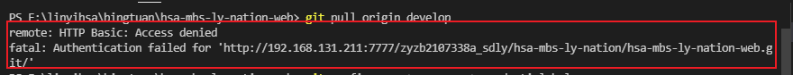

# MySQL板块

## MySql的时区问题

> 问题描述

java将当前时间保存到MySQL数据库时，MySQL中的时间不正确，或者出现连接的时候出现报错

> 解决方案

**1、可以修改数据库默认的时区**

`show variables like '%time_zone%';`                       一般为SYSTEM系统时区

`set time_zone='+8:00';`                                               修改当前session时区为+8:00

`set global time_zone='+8:00';`                                 修改全局时区为+8:00

**2、修改java中的时区为东八区**

serverTimezone可以设置为北京时间GMT%2B8、上海时间Asia/Shanghai或者香港时间Hongkong
`url: jdbc:mysql://localhost:3306/test?serverTimezone=Asia/Shanghai&useUnicode=true&characterEncoding=utf8`

**3、修改my.ini配置文件（优点：永久保存设置，缺点：需重启MySQL服务）设置默认时区** 

[mysqld]

default-time_zone='+8:00'


## sql语句语法


**数据查询语言（Data Query Language, DQL）**

数据查询语言（Data Query Language, DQL）是SQL语言中，负责进行数据查询而不会对数据本身进行修改的语句，这是最基本的SQL语句。保留字SELECT是DQL（也是所有SQL）用得最多的动词，其他DQL常用的保留字有FROM，WHERE，GROUP BY，HAVING和ORDER BY。这些DQL保留字常与其他类型的SQL语句一起使用。

~~~sql
select  top/distinct 字段列表 from 表列表 where 筛选条件 group by 分组字段列表 having  对分组之后得到的结果集筛选  order by 排序字段列表 asc/dasc
~~~

连表查询


```sql
SELECT Persons.LastName, Persons.FirstName, Orders.OrderNo
FROM Persons, Orders
WHERE Persons.Id_P = Orders.Id_P 
```

jion

```sql
SELECT Persons.LastName, Persons.FirstName, Orders.OrderNo
FROM Persons
INNER JOIN Orders
ON Persons.Id_P = Orders.Id_P
ORDER BY Persons.LastName
```

inner jion (jion)

```sql
SELECT Persons.LastName, Persons.FirstName, Orders.OrderNo
FROM Persons
INNER JOIN Orders
ON Persons.Id_P=Orders.Id_P
ORDER BY Persons.LastName
```

left jion

```sql
SELECT Persons.LastName, Persons.FirstName, Orders.OrderNo
FROM Persons
LEFT JOIN Orders
ON Persons.Id_P=Orders.Id_P
ORDER BY Persons.LastName
```

right jion

```sql
SELECT Persons.LastName, Persons.FirstName, Orders.OrderNo
FROM Persons
RIGHT JOIN Orders
ON Persons.Id_P=Orders.Id_P
ORDER BY Persons.LastName
```

full jion

```sql
SELECT Persons.LastName, Persons.FirstName, Orders.OrderNo
FROM Persons
FULL JOIN Orders
ON Persons.Id_P=Orders.Id_P
ORDER BY Persons.LastName
```


**数据定义语言 (Data Definition Language, DDL)**

数据定义语言 (Data Definition Language, DDL) 是SQL语言集中，负责数据结构定义与数据库对象定义的语言，由CREATE、ALTER与DROP三个语法所组成，最早是由 Codasyl (Conference on Data Systems Languages) 数据模型开始，现在被纳入 SQL 指令中作为其中一个子集。

查看所有数据库实例

~~~sql
SHOW DATABASES; 
~~~

查看表

~~~SQL
show tables;
~~~

创建数据库实例

~~~sql
CREATE DATABASE dbname;
~~~

创建表

~~~sql
CREATE TABLE tablename(

   id INT(11) NOT NULL auto_increment,

    moneyint(10)  unsigned zerofill default NULL,

   name VARCHAR(256) NOT NULL，

  PRIMARY KEY (`id`)--指定该表的主键，可以多个列（关键字）

);  
~~~

选择将要操作的数据库实例

~~~sql
use dbname;  
~~~

显示表结构信息（列信息）  

~~~sql
desc tablename
~~~

查看表创建语句（完整语句=包含默认值）

~~~sql
 showcreate table tablename;
~~~

删除数据库实例

 ~~~sql
DROP DATABASE dbname; 
DROP DATABASE  if exists  dbname; 
 ~~~

 删除表

~~~sql
DROP TABLE tablename; 
DROP TABLE if exists tablename; （mysql 特有的）
~~~

修改表的字段

~~~sql
ALTER TABLE tablename MODIFY [COLUMN]column_definition [FIRST | AFTER col_name]
~~~

添加表的字段

~~~SQL
ALTER TABLE tablename ADD [COLUMN] column_definition [FIRST | AFTER col_name]; 
~~~

删除表的字段

~~~sql
ALTER TABLE tablename DROP [COLUMN] col_name; 
~~~

表字段改名和类型

~~~sql
ALTER TABLE tablename CHANGE [COLUMN] old_col_name new_col_definition [FIRST | AFTER col_name]; 
~~~

修改表名

~~~sql
ALTER TABLE tablename RENAME [TO] new_tablename; 
~~~

**数据操纵语言（Data Manipulation Language, DML）**

数据操纵语言（Data Manipulation Language, DML）是SQL语言中，负责对数据库对象运行数据访问工作的指令集，以INSERT、UPDATE、DELETE三种指令为核心，分别代表插入、更新与删除。

~~~sql
INSERT INTO Persons VALUES ('Gates', 'Bill', 'Xuanwumen 10', 'Beijing');

INSERT INTO Persons (LastName, Address) VALUES ('Wilson', 'Champs-Elysees'); 指定字段插入

update userinfo set userpwd='111',email='111@126.com';

update userinfo set userpwd='123456' where username='xxx';

dalete from userinfo;

delete from userinfo where username='yyy';
~~~


**数据控制语言（Data Control Language，DCL）**
数据控制语言 (Data Control Language) 在SQL语言中，是一种可对数据访问权进行控制的指令，它可以控制特定用户账户对数据表、查看表、预存程序、用户自定义函数等数据库对象的控制权。由 GRANT 和 REVOKE 两个指令组成。DCL以控制用户的访问权限为主，GRANT为授权语句，对应的REVOKE是撤销授权语句。

**指针控制语言（CCL）**
它的语句，像DECLARE CURSOR，FETCH INTO和UPDATE WHERE CURRENT用于对一个或多个表单独行的操作。

**事务处理语言（TPL）**
它的语句能确保被DML语句影响的表的所有行及时得以更新。TPL语句包括BEGIN TRANSACTION，COMMIT和ROLLBACK。

# Mybetis板块

## Mybatis类型转换问题

> 问题描述

Mybatis自动封装到实体类中会出现为什么Integer，数据库也为int，而取出后会为long类型？

> 解决

使用Mysql查询数据时，自动映射数据类型。

   * 有时候Mysql的int字段，会正确映射到Java的Integer类型，有时候又会映射到Java的Long类型上，最后终于找到原因。
   * 原来是Mysql的int字段，勾选了unsigned无符号选项，这样就导致int类型，变成了long类型。
   * 同理，MySQL的bigint类型，本来应该映射到Java的Long类型。但是如果勾选了unsigned无符号，则也会映射为BigInteger类型


## mybatis #和$的区别

1、区别

1. `#{}`相当于jdbc中的preparedstatement #{}是经过预编译的,是安全的,而`${}`是未经过预编译的,仅仅是取变量的值,是非安全的,存在sql注入
2. `${}`是输出变量的值`${}`的情况,order by是肯定只能用`${}`了,用`#{}`会多个' '（引号）导致sql语句失效.此外还有一个like语句后也需要用`${}`

2、order by后面如果采用预编译的形式动态输入参数,那么实际插入的参数是一个字符串,例子中是:order by 'domain_id'

------

## mybatis如何判断update操作是否成功

使用mybatis进行update操作时设置一个int类型返回值，但是这个返回值并不是受影响行数，而是match次数，

所以需要在jdbc url上进行修改，在末尾加上一项?useAffectedRows=true，

即jdbc:mysql://${jdbc.host}/${jdbc.db}?useAffectedRows=true

这样一来返回值即受影响行数了。

对于delete和insert是可以根据int数值判断的，为0就是没有操作成功


# Maven板块

## 创建maven的Web骨架时非常慢

创建maven中的appweb骨架时，添加键值对archetypeCatalog和internal就不会从调用远端提供的模板


# Git板块

## git常用命令

**全局配置**

git config --global user.name "xxx"

git config --global user.email "xxx"

**创建仓库**

mkdir XXX

**进入目录**

cd xxx

**仓库初始化**

git init

**常用指令**

git status

git add 文件名

git commit -m "描述"

**版本回退**

git log

git log --pretty=oneline

git reset --hard 提交编号

git reflog	

**线上仓库克隆到本地**

git clone

**提交到线上仓库**

git push/git push origin

**拉取线上最新版本**

git pull

**查看分支**

git branch

**创建分支**

git branch 分支名

**切换分支**

git checkout 分支名

**删除分支**

git branch -d xxx

**合并分支**

git merge 被合并的分支名

**git 重命名 origin**

git remote rm origin

git remote add origin xxx


## git账户密码的修改及保存

对于修改密码之后，git拉取时报错：



可以执行 `git config --system --unset credential.helper` 来重置账户密码。再次git pull 时会需要输入账户密码。但是之后每次都要输入，可以执行`git config --global credential.helper store` 保存密码，再次输入账户密码之后，以后就不再需要输入。