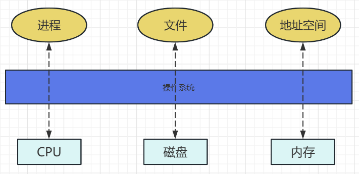

# 操作系统

## 1.什么是操作系统

**用户角度**

- 操作系统是一个控制软件。
- 管理应用程序。
- 为应用程序提供服务。
- 杀死应用程序。

**对象内部内部管理角度**

- 资源管理。
- 管理外设、分配资源。

**操作系统层次结构**

- 硬件之上，系统软件。
- 应用程序之下，为应用软件提供服务支撑。

**操作系统接口的两个方面：**

面向应用程序(shell)，面向内部资源(kernel)，linux、Windows、Android属于外壳(shell)，而不是内核(kernel)，kernel是研究重点，在shell之下。

**Kernel-操作系统内部组件（CPU，内存，磁盘）**

- CPU调度
- 物理内存管理
- 虚拟内存管理
- 文件系统管理
- 中断出来与设备驱动

**Kernel的特征：**

- 并发：计算机系统中同时存在多个运行的程序，需要OS管理和调度（注意与并行的区别）。
- 共享：分时法访问，”同时“访问，互斥共享。
- 虚拟：利用多道程序设计技术，让每个用户都觉得有一个计算机专门为他服务。
- 异步：程序的执行不是一贯到底的，而是走走停停，向前推进的速度不可预知，但只要运行环境相同，OS需要保证程序运行的结果也要相同。