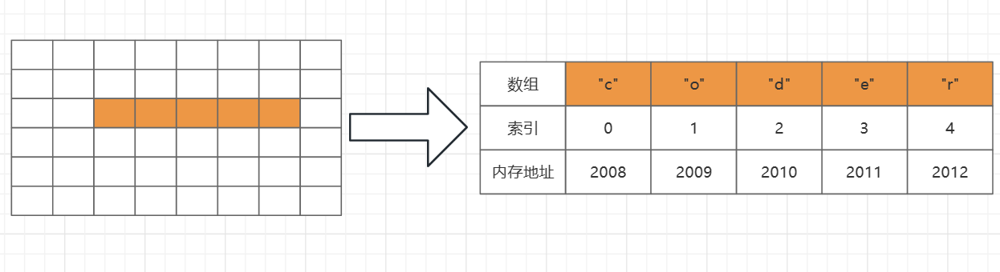

# 1. 数值和字符串

资料来源： 

## 1.1 数组简介

作者：LeetCode
链接：https://leetcode.cn/leetbook/read/array-and-string/
来源：力扣（LeetCode）

### 1.1.1 集合、列表和数组

> 集合

集合一般被定义为：由一个或多个确定的元素所构成的整体。通俗来讲，集合就是将一组事物组合起来。

集合的特点：

- 集合里的元素类型不一定相同。
- 集合里的元素没有顺序。

事实上，这样的集合并不直接存在于编程语言中。然而，实际编程语言中的很多数据结构，就是在集合的基础上添加了一些规则形成的。

> 列表

列表（又称线性列表）的定义为：是一种数据项构成的有限序列，即按照一定的线性顺序，排列而成的数据项的集合。

列表的概念是在集合的特征上形成的，它具有顺序而且长度是可变的。

在编程语言中，列表最常见的表现形式有数组和链表，而我们熟悉的栈和队列则是两种特殊类型的列表。除此之外，向列表中添加、删除元素的具体实现方式会根据编程语言的不同而有所区分。

> 数组

数组是列表的实现方式之一，也是面试中经常涉及到的数据结构。

正如前面提到的，数组是列表的实现方式，它具有列表的特征，同时也具有自己的一些特征。然而，在具体的编程语言中，数组这个数据结构的实现方式具有一定差别。比如 C++ 和 Java 中，数组中的元素类型必须保持一致，而 Python 中则可以不同。Python 中的数组叫做 list，具有更多的高级功能。

那么如何从宏观上区分列表和数组呢？这里有一个重要的概念：索引。

首先，数组会用一些名为 索引 的数字来标识每项数据在数组中的位置，且在大多数编程语言中，索引是从 0 算起的。我们可以根据数组中的索引，快速访问数组中的元素。

而列表中没有索引，这是数组与列表最大的不同点。

其次，数组中的元素在内存中是连续存储的，且每个元素占用相同大小的内存。相反，列表中的元素在内存中可能彼此相邻，也可能不相邻。比如列表的另一种实现方式——链表，它的元素在内存中则不一定是连续的。

相反，列表中的元素在内存中可能彼此相邻，也可能不相邻。比如列表的另一种实现方式——链表，它的元素在内存中则不一定是连续的。

### 1.1.2 数组的操作

>读取元素

读取数组中的元素，是通过访问索引的方式来读取的，索引一般从 0 开始。

在计算机中，内存可以看成一些已经排列好的格子，每个格子对应一个内存地址。一般情况下，数据会分散地存储在不同的格子中。而对于数组，计算机会在内存中为其生成一段连续的空间。并且会记下索引为 0 的内存地址，以数组`["c","o","d","e","r"]`为例，它的各个元素对应索引以及内存地址如下图所示：

假如想要访问索引为 2 处的元素 "d" 时，计算机会进行以下计算：

- 找到该数组的索引 0 的内存地址：2008。

- 将内存地址加上索引，作为目标元素的地址，即 2008 + 2 = 2010 ，对应的元素为 "d",这时便找到了目标元素。

计算内存地址时很快的过程，而我们一旦知道内存地址就可以立即访问到该元素，因此它的时间复杂度时常数级别，为O(1)。

> 插入元素

如果要将该元素插入到数组的末尾，只需要一步。即计算机通过数组的长度和位置计算出即将插入元素的内存地址，然后将该元素插入到指定的位置即可。

然而，如果要将该元素插入到数组中的其他位置，则会有所区别，这时我们首先需要为该元素所插入的位置腾出空间，然后进行插入操作。

如果需要频繁的对数组元素进行插入操作，会造成时间的浪费，事实上，另一种数据结构链表可以有效的解决这个问题。

> 删除元素

删除元素与插入元素的操作类似，当删除掉数组的某个元素后，数组中会留下空缺的位置，而数组中的元素在内存中是连续的，这就使得后面得元素需要对该位置进行填补操作。

当数组得长度为 n 时，最坏情况下，删除第一个元素，共需要的步骤为 1 + (n - 1) = n 步，其中 1 为删除操作，n - 1 为移动其余元素的步骤数。删除操作具有线性时间复制度，即时间复杂度为 O(N)，N为数组长度。
