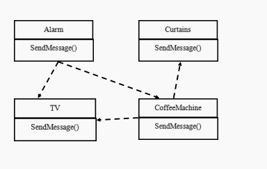
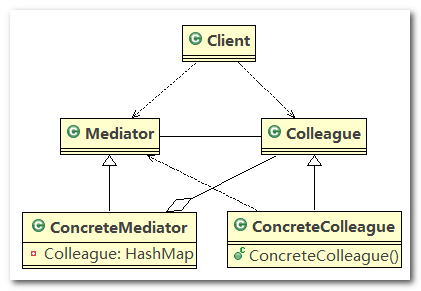
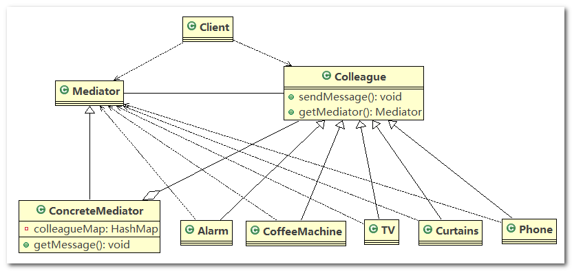

# 中介者模式

## 1、智能家庭项目

智能家庭项目：

1. 智能家庭包括各种设备，闹钟、咖啡机、电视机、窗帘 等
2. 主人要看电视时，各个设备可以协同工作，自动完成看电视的准备工作，比如流程为： 闹铃响起 --> 咖啡机开始做咖啡 --> 窗帘自动落下 --> 电视机开始播放


## 2、传统方案解决智能家庭管理问题

> **类图**



> **传统的方式的问题分析**

1. 当各电器对象有多种状态改变时，相互之间的调用关系会比较复杂
2. 各个电器对象彼此联系， 你中有我，我中有你，不利于松耦合
3. 各个电器对象之间所传递的消息(参数)，容易混乱
4. 当系统增加一个新的电器对象时，或者执行流程改变时，代码的可维护性、扩展性都不理想 ==> 考虑中介者模式

## 3、中介者模式基本介绍

1. 中介者模式(`Mediator Pattern`) ， 用一个中介对象来封装一系列的对象交互。中介者使各个对象不需要显式地相互引用，从而使其耦合松散，而且可以独立地改变它们之间的交互
2. 中介者模式属于行为型模式， 使代码易于维护
3. 比如`MVC`模式， `C`(`Controller`控制器)是`M`(`Model`模型)和`V`(`View`视图)的中介者，在前后端交互时起到了中间人的作用

## 4、中介者模式的原理类图

1. `Mediator` 就是抽象中介者，定义了中介者的行为规范
2. `Colleague` 是抽象的同事类，定义了同事类中抽象的行为规范
3. `ConcreteMediator` 具体的中介者对象，实现 `Mediator` 中的抽象方法，他需要知道所有具体的同事类，即以一个集合来管理所有的同事(`HashMap`)，并接收某个同事的消息，完成相应的任务
4. `ConcreteColleague` 具体的同事类，`Colleague` 的实现类会有很多，每个同事只知道自己的行为， 而不了解其他同事类的行为(方法)，但是他们都依赖中介者对象(通过构造器将中介者注入)
5. 原本同事之间复杂的调用关系和业务逻辑，都交给中介者去执行，这样具体的同事类之间耦合度就会降低



## 5、中介者模式解决智能家庭管理问题

类图



------

使用步骤

1. 创建 `ConcreteMediator` 对象，并使用 `Mediator` 类型接收
2. 创建各个同事类对象，比如 `Alarm`、`CoffeeMachine`、`TV` 等
3. 在创建同事类对象时，就直接通过构造器注入一个 `Mediator` 对象，同时将同事类对象添加至 `Mediator` 的同事类集合中去
4. 在同事类对象中调用 `sendMessage()` 方法时，会去用 `Mediator` 对象中的 `getMessage()` 方法
5. `getMessage()` 方法会根据会根据当前接收到的消息，去调用其他同事，协同完成其他任务，即 `getMessage()` 方法会处理很多的业务逻辑，是一个核心方法

------

代码实现

1. `Colleague`：同事类，即为各种家电的抽象父类，通过构造器将中介者对象注入，抽象父类中的 `SendMessage()` 由子类重写，该方法将调用中介者的 `GetMessage()` 方法触发执行动作

   ```java
   //同事抽象类
   public abstract class Colleague {
   
       private Mediator mediator;
   
       public Colleague(Mediator mediator) {
           this.mediator = mediator;
   
       }
   
       public Mediator getMediator() {
           return this.mediator;
       }
       //用于接收不同状态
       public abstract void sendMessage(int stateChange);
   }
   
   ```

2. `Alarm`：

   ```java
   //具体的同事类
   public class Alarm extends Colleague {
   
       public Alarm(Mediator mediator) {
           super(mediator);
           // 在创建Alarm 同事对象时，将自己放入到ConcreteMediator 对象中[集合]，方便中介可以及时联系到自己
           mediator.Register(this);
       }
   
       //接收状态
       public void sendAlarm(int stateChange) {
           sendMessage(stateChange);
       }
   
       @Override
       public void sendMessage(int stateChange) {
           // 调用的中介者对象的getMessage，对不同的状态码进行处理
           this.getMediator().GetMessage(stateChange, this.getClass().getSimpleName());
       }
   }
   ```

3. `CoffeeMachine`：

   ```java
   public class CoffeeMachine extends Colleague {
   
       public CoffeeMachine(Mediator mediator) {
           super(mediator);
           mediator.Register(this);
       }
   
       @Override
       public void sendMessage(int stateChange) {
           this.getMediator().GetMessage(stateChange,this.getClass().getSimpleName());
       }
   
       public void startCoffee() {
           System.out.println("做咖啡");
       }
   
       public void finishCoffee() {
           System.out.println("5分钟后");
           System.out.println("咖啡完成");
           //咖啡机发消息给中介，完成下一步指令
           sendMessage(0);
       }
   }
   ```

4. `TV`：

   ```java
   public class TV extends Colleague {
   
       public TV(Mediator mediator) {
           super(mediator);
           mediator.Register(this);
       }
   
       @Override
       public void sendMessage(int stateChange) {
           this.getMediator().GetMessage(stateChange,this.getClass().getSimpleName());
       }
   
       public void startTv() {
           System.out.println("开始看电视");
       }
   
       public void stopTv() {
           System.out.println("电视停止");
       }
   }
   ```

5. `Curtains`：

   ```java
   public class Curtains extends Colleague {
       public Curtains(Mediator mediator) {
           super(mediator);
           mediator.Register(this);
       }
   
       @Override
       public void sendMessage(int stateChange) {
           this.getMediator().GetMessage(stateChange, this.getClass().getSimpleName());
       }
   
       public void upCurtains() {
           System.out.println("拉窗帘");
       }
   }
   ```

6. `Mediator`：定义中介者的行为规范

   ```java
   public abstract class Mediator {
       // 将给中介者对象，加入到集合中
       public abstract void Register(Colleague colleague);
   
       // 接收消息, 消息由具体的同事对象发出
       public abstract void GetMessage(int stateChange, String colleagueName);
   }
   ```

7. `ConcreteMediator`：继承了 `Mediator` 抽象父类，实现了其父类中的抽象方法，`Register()` 完成注册的功能，调用 `GetMessage()` 方法将执行目标任务

   ```java
   //具体的中介者类
   public class ConcreteMediator extends Mediator {
       // 集合，放入所有的同事对象
       private HashMap<String, Colleague> colleagueMap;
   
       public ConcreteMediator() {
           colleagueMap = new HashMap<String, Colleague>();
       }
   
       @Override
       public void Register(Colleague colleague) {
           if (colleague instanceof Alarm) {
               colleagueMap.put("Alarm", colleague);
           } else if (colleague instanceof CoffeeMachine) {
               colleagueMap.put("CoffeeMachine", colleague);
           } else if (colleague instanceof TV) {
               colleagueMap.put("TV", colleague);
           } else if (colleague instanceof Curtains) {
               colleagueMap.put("Curtains", colleague);
           }
       }
   
       @Override
       public void GetMessage(int stateChange, String colleagueName) {
           if (colleagueMap.get(colleagueName) instanceof Alarm) {
               //闹钟发消息
               if (stateChange == 0) {
                   //对其他电器的控制
                   ((CoffeeMachine)colleagueMap.get("CoffeeMachine")).startCoffee();
                   ((Curtains)colleagueMap.get("Curtains")).upCurtains();
                   ((TV)colleagueMap.get("TV")).startTv();
               } else if (stateChange == 1) {
                   ((CoffeeMachine)colleagueMap.get("CoffeeMachine")).finishCoffee();
               }
           } else if (colleagueMap.get(colleagueName) instanceof CoffeeMachine) {
               //如果是咖啡机发消息
               ((TV)colleagueMap.get("TV")).stopTv();
               ((Curtains)colleagueMap.get("Curtains")).upCurtains();
           } else if (colleagueMap.get(colleagueName) instanceof TV) {
               // 如果TV发现消息
           } else if (colleagueMap.get(colleagueName) instanceof Curtains) {
               // 如果是以窗帘发出的消息，这里处理...
           }
       }
   }
   ```

8. `Client`：测试代码

   ```java
   public class Client {
       public static void main(String[] args) {
           // 创建一个中介者对象
           Mediator mediator = new ConcreteMediator();
   
           // 创建Alarm 并且加入到 ConcreteMediator 对象的HashMap
           Alarm alarm = new Alarm(mediator);
           // 创建了CoffeeMachine 对象，并且加入到 ConcreteMediator 对象的HashMap
           CoffeeMachine coffeeMachine = new CoffeeMachine(mediator);
           // 创建 Curtains , 并且加入到 ConcreteMediator 对象的HashMap
           Curtains curtains = new Curtains(mediator);
           // 创建 TV , 并且加入到 ConcreteMediator 对象的HashMap
           TV tV = new TV(mediator);
   
           // 让闹钟发出消息
           alarm.sendAlarm(0);
           alarm.sendAlarm(1);
       }
   }
   ```

------

总结

1. 中介者(`Mediator`)将各种家电对象分隔开来，家电与家电之间没有发生关联，家电执行的任务都是交给中介者触发
2. 中介者模式可以提高程序的可扩展性，比如我们新增电话类 `Phone`，我们只需要修改 `ConcreteMediator` 中的代码即可实现扩展

## 6、中介者模式的注意事项和细节

> **中介者模式的注意事项和细节**

1. 多个类相互耦合， 会形成网状结构，使用中介者模式将网状结构分离为星型结构， 进行解耦
2. 减少类间依赖， 降低了耦合， 符合迪米特原则
3. 中介者承担了较多的责任， 一旦中介者出现了问题， 整个系统就会受到影响
4. 如果设计不当， 中介者对象本身变得过于复杂， 这点在实际使用时， 要特别注意