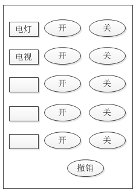

# 命令模式

## 1、智能生活项目需求

1. 我们买了一套智能家电， 有照明灯、 风扇、 冰箱、 洗衣机， 我们只要在手机上安装 `app` 就可以控制对这些家电工作。
2. 这些智能家电来自不同的厂家， 我们不想针对每一种家电都安装一个 `App`， 分别控制， 我们希望只要一个 `app` 就可以控制全部智能家电。
3. 要实现一个 `app` 控制所有智能家电的需要， 则每个智能家电厂家都要提供一个统一的接口给 `app` 调用， 这时 就可以考虑使用命令模式。
4. 命令模式可将“动作的请求者”从“动作的执行者” 对象中解耦出来。
5. 在我们的例子中，动作的请求者是手机 `app`，动作的执行者是每个厂商的一个家电产品。


## 2、命令模式基本介绍

1. 命令模式(`Command Pattern`)： 在软件设计中， 我们经常需要向某些对象发送请求， 但是并不知道请求的接收者是谁， 也不知道被请求的操作是哪个，我们只需在程序运行时指定具体的请求接收者即可， 此时可以使用命令模式来进行设计
2. 命令模式使得请求发送者与请求接收者消除彼此之间的耦合， 让对象之间的调用关系更加灵活， 实现解耦
3. 在命令模式中， 会将一个请求封装为一个对象， 以便使用不同参数来表示不同的请求(即命令)， 同时命令模式也支持可撤销的操作
4. 通俗易懂的理解： 将军发布命令， 士兵去执行。 其中有几个角色： 将军(命令发布者) 、 士兵(命令的具体执行者) 、 命令(连接将军和士兵)
5. `Invoker` 是调用者(将军) ， `Receiver` 是被调用者(士兵) ， `MyCommand` 是命令， 实现了 `Command` 接口， 持有接收对象

## 3、命令模式原理类图

1. `Invoker`：是调用者角色，里面聚合了一个 `Command` 实现类的对象
2. `Command`：是命令角色， 用于定义接口规范，需要执行的所有命令都在这里， 可以是接口或抽象类
3. `Receiver`：接收者角色， 知道如何实施和执行一个请求相关的操作
4. `ConcreteCommand`：具体的命令角色，实现(或继承) `Command`，将一个接收者对象与一个动作绑定， 调用接受者相应的操作
5. 将 `Command` 的具体实现类与 `Invoker` 聚合，将 `Receiver` 与 `Command` 的具体实现类聚合，从而将 `Invoker`(命令调用者)和 `Receiver`(命令执行者)解耦


## 4、命令模式解决智能生活项目

应用实例要求

编写程序， 使用命令模式 完成前面的智能家电项目



------

类图


------

代码实现

1. `Command`：定义命令的规范

   ```java
   //创建命令接口
   public interface Command {
   
   	// 执行动作(操作)
   	public void execute();
   
   	// 撤销动作(操作)
   	public void undo();
   	
   }
   ```

2. `LightOnCommand`：打开电灯的命令类，该类实现了 `Command` 接口，并且聚合了一个 `LightReceiver` 的实现类，用于操作电灯的开、关

   ```java
   public class LightOnCommand implements Command {
   
   	// 聚合LightReceiver
   	LightReceiver light;
   
   	// 构造器
   	public LightOnCommand(LightReceiver light) {
   		this.light = light;
   	}
   
   	@Override
   	public void execute() {
   		// 调用接收者的方法
   		light.on();
   	}
   
   	@Override
   	public void undo() {
   		// 调用接收者的方法
   		light.off();
   	}
   
   }
   ```

3. `LightOffCommand`：关闭电灯的命令类，该类实现了 `Command` 接口，并且聚合了一个 `LightReceiver` 的实现类，用于操作电灯的开、关

   ```java
   public class LightOffCommand implements Command {
   
   	// 聚合LightReceiver
   	LightReceiver light;
   
   	// 构造器
   	public LightOffCommand(LightReceiver light) {
   		this.light = light;
   	}
   
   	@Override
   	public void execute() {
   		// 调用接收者的方法
   		light.off();
   	}
   
   	@Override
   	public void undo() {
   		// 调用接收者的方法
   		light.on();
   	}
   }
   ```

4. `LightReceiver`：命令执行者，用于操作电灯的开、关

   ```java
   public class LightReceiver {
   
   	public void on() {
   		System.out.println(" 电灯打开了.. ");
   	}
   
   	public void off() {
   		System.out.println(" 电灯关闭了.. ");
   	}
   	
   }
   ```

5. `TVOnCommand`：打开电视机的命令类，该类实现了 `Command` 接口，并且聚合了一个 `TVReceiver` 的实现类，用于操作电视机的开、关

   ```java
   public class TVOnCommand implements Command {
   
   	// 聚合TVReceiver
   	TVReceiver tv;
   
   	// 构造器
   	public TVOnCommand(TVReceiver tv) {
   		this.tv = tv;
   	}
   
   	@Override
   	public void execute() {
   		// 调用接收者的方法
   		tv.on();
   	}
   
   	@Override
   	public void undo() {
   		// 调用接收者的方法
   		tv.off();
   	}
   }
   ```

6. `TVOffCommand`：关闭电视机的命令类，该类实现了 `Command` 接口，并且聚合了一个 `TVReceiver` 的实现类，用于操作电视机的开、关

   ```java
   public class TVOffCommand implements Command {
   
   	// 聚合TVReceiver
   	TVReceiver tv;
   
   	// 构造器
   	public TVOffCommand(TVReceiver tv) {
   		this.tv = tv;
   	}
   
   	@Override
   	public void execute() {
   		// 调用接收者的方法
   		tv.off();
   	}
   
   	@Override
   	public void undo() {
   		// 调用接收者的方法
   		tv.on();
   	}
   }
   ```

7. `TVReceiver`：命令执行者，用于操作电视机的开、关

   ```java
   public class TVReceiver {
   
   	public void on() {
   		System.out.println(" 电视机打开了.. ");
   	}
   
   	public void off() {
   		System.out.println(" 电视机关闭了.. ");
   	}
   	
   }
   ```

8. `NoCommand`：空命令，该类在 `RemoteController` 中用于初始化命令按钮，这样就不用做空指针判断

   ```java
   // 没有任何命令，即空执行: 用于初始化每个按钮, 当调用空命令时，对象什么都不做
   // 其实，这样是一种设计模式, 可以省掉对空判断
   public class NoCommand implements Command {
   
   	@Override
   	public void execute() {
   
   	}
   
   	@Override
   	public void undo() {
   
   	}
   
   }
   ```

9. `RemoteController`：命令的发出者(`Invoker`)，聚合了 `Command` 的实现类，在 `RemoteController` 中调用 `Command` 实现类的方法控制设备的开、关

   ```java
   public class RemoteController {
   
   	// 开 按钮的命令数组
   	Command[] onCommands;
   	Command[] offCommands;
   
   	// 执行撤销的命令
   	Command undoCommand;
   
   	// 构造器，完成对按钮初始化
   	public RemoteController() {
   		onCommands = new Command[5];
   		offCommands = new Command[5];
   
   		for (int i = 0; i < 5; i++) {
   			onCommands[i] = new NoCommand(); // 初始化时，设置为空操作，避免空指针判断
   			offCommands[i] = new NoCommand(); // 初始化时，设置为空操作，避免空指针判断
   		}
   	}
   
   	// 给我们的按钮设置你需要的命令
   	public void setCommand(int no, Command onCommand, Command offCommand) {
   		onCommands[no] = onCommand;
   		offCommands[no] = offCommand;
   	}
   
   	// 按下开按钮
   	public void onButtonWasPushed(int no) { // no 0
   		// 找到你按下的开的按钮， 并调用对应方法
   		onCommands[no].execute();
   		// 记录这次的操作，用于撤销
   		undoCommand = onCommands[no];
   	}
   
   	// 按下开按钮
   	public void offButtonWasPushed(int no) { // no 0
   		// 找到你按下的关的按钮， 并调用对应方法
   		offCommands[no].execute();
   		// 记录这次的操作，用于撤销
   		undoCommand = offCommands[no];
   	}
   
   	// 按下撤销按钮
   	public void undoButtonWasPushed() {
   		undoCommand.undo();
   	}
   
   }
   ```

10. `Client`：测试代码

    ```java
    public class Client {
    
    	public static void main(String[] args) {
    
    		// 使用命令设计模式，完成通过遥控器，对电灯的操作
    		// 创建电灯的对象(接受者)
    		LightReceiver lightReceiver = new LightReceiver();
    
    		// 创建电灯相关的开关命令
    		LightOnCommand lightOnCommand = new LightOnCommand(lightReceiver);
    		LightOffCommand lightOffCommand = new LightOffCommand(lightReceiver);
    
    		// 需要一个遥控器
    		RemoteController remoteController = new RemoteController();
    
    		// 给我们的遥控器设置命令, 比如 no = 0 是电灯的开和关的操作
    		remoteController.setCommand(0, lightOnCommand, lightOffCommand);
    
    		System.out.println("--------按下灯的开按钮-----------");
    		remoteController.onButtonWasPushed(0);
    		System.out.println("--------按下灯的关按钮-----------");
    		remoteController.offButtonWasPushed(0);
    		System.out.println("--------按下撤销按钮-----------");
    		remoteController.undoButtonWasPushed();
    
    		// 使用命令设计模式，完成通过遥控器，对电视机的操作
    		System.out.println("=========使用遥控器操作电视机==========");
    
    		TVReceiver tvReceiver = new TVReceiver();
    
    		TVOffCommand tvOffCommand = new TVOffCommand(tvReceiver);
    		TVOnCommand tvOnCommand = new TVOnCommand(tvReceiver);
    
    		// 给我们的遥控器设置命令, 比如 no = 1 是电视机的开和关的操作
    		remoteController.setCommand(1, tvOnCommand, tvOffCommand);
    
    		System.out.println("--------按下电视机的开按钮-----------");
    		remoteController.onButtonWasPushed(1);
    		System.out.println("--------按下电视机的关按钮-----------");
    		remoteController.offButtonWasPushed(1);
    		System.out.println("--------按下撤销按钮-----------");
    		remoteController.undoButtonWasPushed();
    
    	}
    
    }
    ```

------

优点

命令模式扩展性很强，假如我们想新增 `TV` 相关的类(`Command` 和 `Receiver`)，`RemoteController` 类并不需要做任何变化，符合开闭原则

## 5、Spring JdbcTemplate

> **命令模式在Spring框架JdbcTemplate应用的源码分析**

1. `StatementCallback` 接口类似与之前的 `Command` 接口，用于定义命令的规范

   ```java
   @FunctionalInterface
   public interface StatementCallback<T> {
   	@Nullable
   	T doInStatement(Statement stmt) throws SQLException, DataAccessException;
   
   }
   ```

2. `QueryStatementCallback` 为匿名内部类，实现了 `StatementCallback` 接口，同时也充当了命令的接收者(`Receiver`)

   ```java
   public class JdbcTemplate extends JdbcAccessor implements JdbcOperations {
   
       // ...
   
   	@Override
   	@Nullable
   	public <T> T query(final String sql, final ResultSetExtractor<T> rse) throws DataAccessException {
   		Assert.notNull(sql, "SQL must not be null");
   		Assert.notNull(rse, "ResultSetExtractor must not be null");
   		if (logger.isDebugEnabled()) {
   			logger.debug("Executing SQL query [" + sql + "]");
   		}
   
   		class QueryStatementCallback implements StatementCallback<T>, SqlProvider {
   			@Override
   			@Nullable
   			public T doInStatement(Statement stmt) throws SQLException {
   				ResultSet rs = null;
   				try {
   					rs = stmt.executeQuery(sql);
   					return rse.extractData(rs);
   				}
   				finally {
   					JdbcUtils.closeResultSet(rs);
   				}
   			}
   			@Override
   			public String getSql() {
   				return sql;
   			}
   		}
   
   		return execute(new QueryStatementCallback());
   	}
       // ...
   }
   ```

3. `JdbcTemplate` 为命令的调用者，在 `execute(StatementCallback<T> action)` 方法中，执行了命令： `T result = action.doInStatement(stmt);`，不同的 `StatementCallback` 实现类，`doInStatement()` 方法的实现逻辑也不同

   ```java
   public class JdbcTemplate extends JdbcAccessor implements JdbcOperations {
   
       // ...
       
   	@Override
   	@Nullable
   	public <T> T execute(StatementCallback<T> action) throws DataAccessException {
   		Assert.notNull(action, "Callback object must not be null");
   
   		Connection con = DataSourceUtils.getConnection(obtainDataSource());
   		Statement stmt = null;
   		try {
   			stmt = con.createStatement();
   			applyStatementSettings(stmt);
   			T result = action.doInStatement(stmt);
   			handleWarnings(stmt);
   			return result;
   		}
   		catch (SQLException ex) {
   			// Release Connection early, to avoid potential connection pool deadlock
   			// in the case when the exception translator hasn't been initialized yet.
   			String sql = getSql(action);
   			JdbcUtils.closeStatement(stmt);
   			stmt = null;
   			DataSourceUtils.releaseConnection(con, getDataSource());
   			con = null;
   			throw translateException("StatementCallback", sql, ex);
   		}
   		finally {
   			JdbcUtils.closeStatement(stmt);
   			DataSourceUtils.releaseConnection(con, getDataSource());
   		}
   	}
       // ...
   }
   ```

4. 另外实现 `StatementCallback` 命令接口的子类还有如下四个

   

## 6、命令模式的注意事项

> **命令模式的注意事项和细节**

1. 将发起请求的对象与执行请求的对象解耦。发起请求的对象是调用者，调用者只要调用命令对象的`execute()`方法就可以让接收者工作，而不必知道具体的接收者对象是谁、是如何实现的，命令对象会负责让接收者执行请求的动作， 也就是说： ”请求发起者”和“请求执行者”之间的解耦是通过命令对象实现的，命令对象起到了纽带桥梁的作用
2. 容易设计一个命令队列。只要把命令对象放到列队，就可以多线程的执行命令容易实现对请求的撤销和重做
3. 命令模式不足：可能导致某些系统有过多的具体命令类， 增加了系统的复杂度， 这点在在使用的时候要注意
4. 空命令也是一种设计模式，它为我们省去了判空的操作。在上面的实例中，如果没有用空命令，我们每按下一个按键都要判空，这给我们编码带来一定的麻烦
5. 命令模式经典的应用场景：界面的一个按钮都是一条命令、 模拟`CMD`（`DOS`命令）订单的撤销/恢复、触发-反馈机制