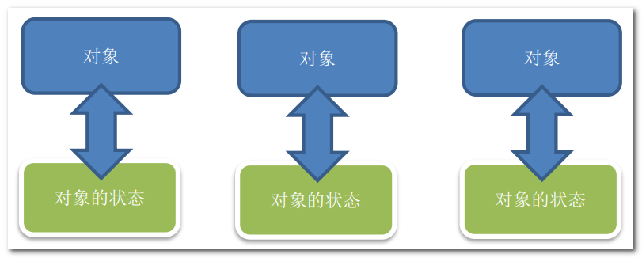
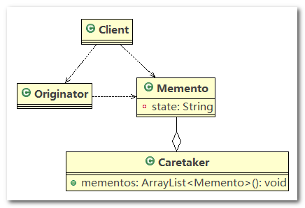
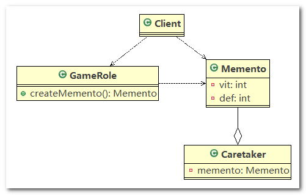

# 备忘录模式

## 1、游戏角色状态恢复问题

游戏角色有攻击力和防御力，在大战`Boss`前保存自身的状态(攻击力和防御力)， 当大战`Boss`后攻击力和防御力下降， 然后从备忘录对象恢复到大战前的状态

## 2、传统方案解决游戏角色恢复

> **类图**



> **传统的方式的问题分析**

1. 一个对象，就对应一个保存对象状态的对象， 这样当我们游戏的对象很多时，不利于管理，开销也很大
2. 传统的方式是简单地做备份， `new` 出另外一个对象出来，再把需要备份的数据放到这个新对象，但这就暴露了对象内部的细节
3. 解决方案： ==> 备忘录模式

## 3、备忘录模式基本介绍

1. 备忘录模式(`Memento Pattern`) 在不破坏封装性的前提下，捕获一个对象的内部状态，并在该对象之外保存这个状态。这样以后就可将该对象恢复到原先保存的状态
2. 可以这里理解备忘录模式：现实生活中的备忘录是用来记录某些要去做的事情，或者是记录已经达成的共同意见的事情，以防忘记了。
3. 而在软件层面，备忘录模式有着相同的含义，备忘录对象主要用来记录一个对象的某种状态，或者某些数据，当要做回退时，可以从备忘录对象里获取原来的数据进行恢复操作
4. 备忘录模式属于行为型模式

## 4、备忘录模式原理类图

> **类图**

1. `Originator` ：对象(需要保存状态的对象)
2. `Memento` ：备忘录对象，负责保存好记录， 即 `Originator` 内部状态
3. `Caretaker`：守护者对象，负责保存多个备忘录对象， 使用集合管理， 提高效率
4. 说明：如果希望保存多个 `Originator` 对象的不同时间的状态，只需要使用 `HashMap <String, Collection>` 存储即可，`String` 为 `Originator` 对象的唯一标识(`key`)，`Collection` 为 `Originator` 对象不同时间的备忘录集合



> **代码实现**

1. `Originator`：实体类，该类的实例为需要保存状态的对象，`saveStateMemento()` 方法用于返回一个备忘录对象，`getStateFromMemento()` 方法用于从备忘录

   ```java
   public class Originator {
   
   	private String state;// 状态信息
   
   	public String getState() {
   		return state;
   	}
   
   	public void setState(String state) {
   		this.state = state;
   	}
   
   	// 编写一个方法，可以保存一个状态对象 Memento
   	// 因此编写一个方法，返回 Memento
   	public Memento saveStateMemento() {
   		return new Memento(state);
   	}
   
   	// 通过备忘录对象，恢复状态
   	public void getStateFromMemento(Memento memento) {
   		state = memento.getState();
   	}
   }
   ```

2. `Memento`：备忘录对象，负责保存对象的状态

   ```java
   public class Memento {
   	private String state;
   
   	// 构造器
   	public Memento(String state) {
   		this.state = state;
   	}
   
   	public String getState() {
   		return state;
   	}
   
   }
   ```

3. `Caretker`：聚合了备忘录的集合，即 `List<Memento>`

   ```java
   public class Caretaker {
   
   	// 在List 集合中会有很多的备忘录对象
   	private List<Memento> mementoList = new ArrayList<Memento>();
   
   	public void add(Memento memento) {
   		mementoList.add(memento);
   	}
   
   	// 获取到第index个Originator 的 备忘录对象(即保存状态)
   	public Memento get(int index) {
   		return mementoList.get(index);
   	}
   	
   }
   ```

4. `Client`：测试代码

   ```java
   public class Client {
   
   	public static void main(String[] args) {
   
   		Originator originator = new Originator();
   		Caretaker caretaker = new Caretaker();
   
   		originator.setState(" 状态#1 攻击力 100 "); // 设置攻击速度
   		caretaker.add(originator.saveStateMemento()); // 保存了当前的状态
   		
   		originator.setState(" 状态#2 攻击力 80 "); // 设置攻击速度
   		caretaker.add(originator.saveStateMemento()); // 保存了当前的状态
   		
   		originator.setState(" 状态#3 攻击力 50 "); // 设置攻击速度
   		caretaker.add(originator.saveStateMemento()); // 保存了当前的状态
   
   		System.out.println("当前的状态是 =" + originator.getState());
   
   		// 希望得到状态 1, 将 originator 恢复到状态1
   		originator.getStateFromMemento(caretaker.get(0)); // 恢复对象属性
   		System.out.println("恢复到状态1 , 当前的状态是");
   		System.out.println("当前的状态是 =" + originator.getState());
   
   	}
   
   }
   ```

## 5、备忘录模式解决游戏角色恢复

应用实例

游戏角色有攻击力和防御力，在大战`Boss`前保存自身的状态(攻击力和防御力)， 当大战`Boss`后攻击力和防御力下降， 然后从备忘录对象恢复到大战前的状态

------

类图



------

代码实现

1. `GameRole`：游戏角色对应的实体类，`createMemento()` 方法用于创建备忘录对象，`recoverGameRoleFromMemento()` 用于从备忘录对象中恢复角色的状态

   ```java
   public class GameRole {
   
   	private int vit;
   	private int def;
   
   	// 创建Memento ,即根据当前的状态得到Memento
   	public Memento createMemento() {
   		return new Memento(vit, def);
   	}
   
   	// 从备忘录对象，恢复GameRole的状态
   	public void recoverGameRoleFromMemento(Memento memento) {
   		this.vit = memento.getVit();
   		this.def = memento.getDef();
   	}
   
   	// 显示当前游戏角色的状态
   	public void display() {
   		System.out.println("游戏角色当前的攻击力：" + this.vit + " 防御力: " + this.def);
   	}
   
   	public int getVit() {
   		return vit;
   	}
   
   	public void setVit(int vit) {
   		this.vit = vit;
   	}
   
   	public int getDef() {
   		return def;
   	}
   
   	public void setDef(int def) {
   		this.def = def;
   	}
   
   }
   ```

2. `Memento`：备忘录对象

   ```java
   public class Memento {
   
   	// 攻击力
   	private int vit;
   	// 防御力
   	private int def;
   
   	public Memento(int vit, int def) {
   		this.vit = vit;
   		this.def = def;
   	}
   
   	public int getVit() {
   		return vit;
   	}
   
   	public void setVit(int vit) {
   		this.vit = vit;
   	}
   
   	public int getDef() {
   		return def;
   	}
   
   	public void setDef(int def) {
   		this.def = def;
   	}
   
   }
   ```

3. `Caretaker`：守护者对象，用于管理备忘录对象

   ```java
   //守护者对象, 保存游戏角色的状态
   public class Caretaker {
   
   	// 如果只保存一次状态
   	private Memento memento;
   	
   	// 对GameRole 保存多次状态
   	// private ArrayList<Memento> mementos;
   	
   	// 对多个游戏角色保存多个状态
   	// private HashMap<String, ArrayList<Memento>> rolesMementos;
   
   	public Memento getMemento() {
   		return memento;
   	}
   
   	public void setMemento(Memento memento) {
   		this.memento = memento;
   	}
   
   }
   ```

4. `Client`：测试代码

   ```java
   public class Client {
   
   	public static void main(String[] args) {
   		// 创建游戏角色
   		GameRole gameRole = new GameRole();
   		gameRole.setVit(100);
   		gameRole.setDef(100);
   
   		System.out.println("和boss大战前的状态");
   		gameRole.display();
   
   		// 把当前状态保存caretaker
   		Caretaker caretaker = new Caretaker();
   		caretaker.setMemento(gameRole.createMemento());
   
   		System.out.println("和boss大战~~~");
   		gameRole.setDef(30);
   		gameRole.setVit(30);
   		gameRole.display();
   
   		System.out.println("大战后，使用备忘录对象恢复元气");
   		gameRole.recoverGameRoleFromMemento(caretaker.getMemento());
   		System.out.println("恢复后的状态");
   		gameRole.display();
   	}
   
   }
   ```

## 6、备忘录模式的注意事项和细节

1. 给用户提供了一种可以恢复状态的机制，可以使用户能够比较方便地回到某个历史的状态
2. 实现了信息的封装，使得用户不需要关心状态的保存细节
3. 如果类的成员变量过多，势必会占用比较大的资源，而且每一次保存都会消耗一定的内存，这个需要注意
4. 为了节约内存，备忘录模式可以和原型模式配合使用

------

适用的应用场景：

1. 后悔药
2. 打游戏时的存档
3. `Windows` 里的 `Ctrl + Z`。
4. `IE` 中的后退
5. 数据库的事务管理