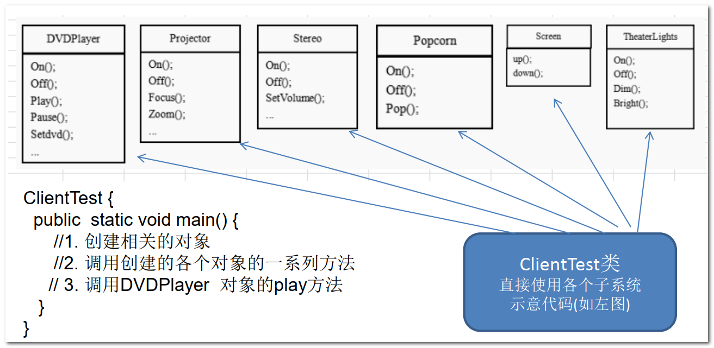
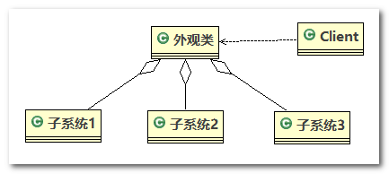
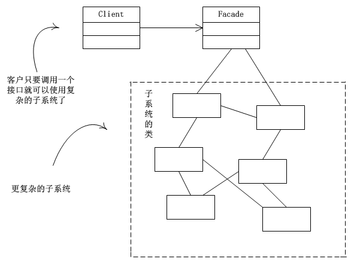
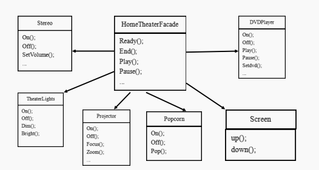
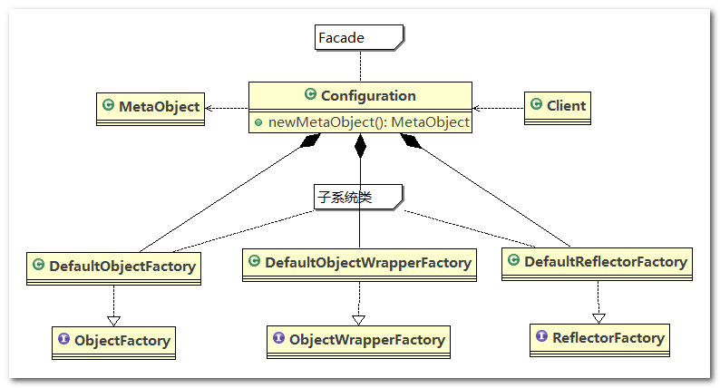

# 外观模式(Facade Pattern)

## 1、影院管理项目

组建一个家庭影院：`DVD` 播放器、 投影仪、 自动屏幕、 环绕立体声、 爆米花机，要求完成使用家庭影院的功能， 其过程为：直接用遥控器统筹各设备开关

1. 开爆米花机
2. 放下屏幕
3. 开投影仪
4. 开音响
5. 开 `DVD`， 选 `DVD`
6. 去拿爆米花
7. 调暗灯光
8. 播放
9. 观影结束后， 关闭各种设备

## 2、传统方式解决影院管理

每个设备都对应于一个类，导致客户端使用时，直接依赖于具体的类



> **传统方式解决影院管理问题分析**

1. 在 `ClientTest` 的`main`方法中，创建各个子系统的对象，并直接去调用子系统(对象)相关方法，会造成调用过程混乱，没有清晰的过程
2. 不利于在`ClientTest` 代码中对子系统进行维护操作

------

解决思路：

1. 定义一个高层接口，给子系统中的一组接口提供一个一致的界面(比如在高层接口提供四个方法 `ready`, `play`, `pause`, `end`)，用来访问子系统中的一群接口
2. 也就是说 就是通过定义一个一致的接口(界面类)， 用以屏蔽内部子系统的细节，使得调用端只需跟这个接口发生调用，而无需关心这个子系统的内部细节 --> 外观模式

## 3、外观模式基本介绍

1. 外观模式（`Facade`）， 也叫过程模式，外观模式为子系统中的一组接口提供一个一致的界面，此模式定义了一个高层接口，这个接口使得这一子系统更加容易使用
2. 外观模式通过定义一个一致的接口，用以屏蔽内部子系统的细节，使得调用端只需跟这个接口发生调用，而无需关心这个子系统的内部细节
3. 外观模式属于结构型模式

## 4、外观模式原理类图

原理类图的说明(外观模式的角色)

1. 外观类(`Facade`)：为调用端提供统一的调用接口，外观类知道哪些子系统负责处理请求，从而将用端的请求代理给适当子系统对象
2. 调用者(`Client`)：外观接口的调用者
3. 子系统的集合：指模块或者子系统，处理 `Facade` 对象指派的任务，他是功能的实际提供者



## 5、外观模式解决影院管理

> **外观模式解决影院管理说明**

外观模式可以理解为转换一群接口，客户只要调用一个接口，而不用调用多个接口才能达到目的。 比如：在`pc`上安装软件的时候经常有一键安装选项（省去选择安装目录、安装的组件等等），还有就是手机的重启功能（把关机和启动合为一个操作）。

外观模式就是解决多个复杂接口带来的使用困难，起到简化用户操作的作用



> **外观模式应用案例：使用外观模式来完成家庭影院项目**

类图



代码实现

1. `DVDPlayer`：

   ```java
   public class DVDPlayer {
   
   	// 使用单例模式, 使用饿汉式
   	private static DVDPlayer instance = new DVDPlayer();
   
   	public static DVDPlayer getInstanc() {
   		return instance;
   	}
   
   	public void on() {
   		System.out.println(" dvd on ");
   	}
   
   	public void off() {
   		System.out.println(" dvd off ");
   	}
   
   	public void play() {
   		System.out.println(" dvd is playing ");
   	}
   
   	// ....
   	public void pause() {
   		System.out.println(" dvd pause ..");
   	}
   	
   }
   ```

2. `Popcorn`：

   ```java
   public class Popcorn {
   
   	private static Popcorn instance = new Popcorn();
   
   	public static Popcorn getInstance() {
   		return instance;
   	}
   
   	public void on() {
   		System.out.println(" popcorn on ");
   	}
   
   	public void off() {
   		System.out.println(" popcorn ff ");
   	}
   
   	public void pop() {
   		System.out.println(" popcorn is poping  ");
   	}
   	
   }
   ```

3. `Projector`：

   ```java
   public class Projector {
   
   	private static Projector instance = new Projector();
   
   	public static Projector getInstance() {
   		return instance;
   	}
   
   	public void on() {
   		System.out.println(" Projector on ");
   	}
   
   	public void off() {
   		System.out.println(" Projector ff ");
   	}
   
   	public void focus() {
   		System.out.println(" Projector is Projector  ");
   	}
   
   	// ...
   	
   }
   ```

4. `Screen`：

   ```java
   public class Screen {
   
   	private static Screen instance = new Screen();
   
   	public static Screen getInstance() {
   		return instance;
   	}
   
   	public void up() {
   		System.out.println(" Screen up ");
   	}
   
   	public void down() {
   		System.out.println(" Screen down ");
   	}
   
   }
   ```

5. `Stereo`：

   ```java
   public class Stereo {
   
   	private static Stereo instance = new Stereo();
   
   	public static Stereo getInstance() {
   		return instance;
   	}
   
   	public void on() {
   		System.out.println(" Stereo on ");
   	}
   
   	public void off() {
   		System.out.println(" Screen off ");
   	}
   
   	public void up() {
   		System.out.println(" Screen up.. ");
   	}
   
   	// ...
   }
   ```

6. `TheaterLight`：

   ```java
   public class TheaterLight {
   
   	private static TheaterLight instance = new TheaterLight();
   
   	public static TheaterLight getInstance() {
   		return instance;
   	}
   
   	public void on() {
   		System.out.println(" TheaterLight on ");
   	}
   
   	public void off() {
   		System.out.println(" TheaterLight off ");
   	}
   
   	public void dim() {
   		System.out.println(" TheaterLight dim.. ");
   	}
   
   	public void bright() {
   		System.out.println(" TheaterLight bright.. ");
   	}
   }
   ```

7. `HomeTheaterFacade`：

   ```java
   public class HomeTheaterFacade {
   
   	// 定义各个子系统对象
   	private TheaterLight theaterLight;
   	private Popcorn popcorn;
   	private Stereo stereo;
   	private Projector projector;
   	private Screen screen;
   	private DVDPlayer dVDPlayer;
   
   	// 构造器
   	public HomeTheaterFacade() {
   		super();
   		this.theaterLight = TheaterLight.getInstance();
   		this.popcorn = Popcorn.getInstance();
   		this.stereo = Stereo.getInstance();
   		this.projector = Projector.getInstance();
   		this.screen = Screen.getInstance();
   		this.dVDPlayer = DVDPlayer.getInstanc();
   	}
   
   	// 操作分成 4 步
       
   	public void ready() {
   		popcorn.on();
   		popcorn.pop();
   		screen.down();
   		projector.on();
   		stereo.on();
   		dVDPlayer.on();
   		theaterLight.dim();
   	}
   
   	public void play() {
   		dVDPlayer.play();
   	}
   
   	public void pause() {
   		dVDPlayer.pause();
   	}
   
   	public void end() {
   		popcorn.off();
   		theaterLight.bright();
   		screen.up();
   		projector.off();
   		stereo.off();
   		dVDPlayer.off();
   	}
   
   }
   ```

8. `Client`：

   ```java
   public class Client {
   
   	public static void main(String[] args) {
   		// 这里直接调用。。。很麻烦，也不利于扩展
           
           // 使用外观模式
   		HomeTheaterFacade homeTheaterFacade = new HomeTheaterFacade();
   		homeTheaterFacade.ready();
   		homeTheaterFacade.play();
   		homeTheaterFacade.end();
   	}
   
   }
   ```

## 6、Mybatis 外观模式

`MyBatis` 中的`Configuration` 去创建 `MetaObject` 对象使用到外观模式

1. `Configuration` 类中的 `newMetaObject()` 方法调用 `MetaObject.forObject()` 静态方法创建 `MetaObject` 对象

   1. `Configuration` 类相当于外观类，对客户端（调用方）提供统一接口
   2. 成员变量 `reflectorFactory`、`objectFactory`、`objectWrapperFactory`、`mapperRegistry` 相当于子系统集合

   ```java
   public class Configuration {
   
       // ...
       
       protected ReflectorFactory reflectorFactory = new DefaultReflectorFactory();
       protected ObjectFactory objectFactory = new DefaultObjectFactory();
       protected ObjectWrapperFactory objectWrapperFactory = new DefaultObjectWrapperFactory();
       protected MapperRegistry mapperRegistry = new MapperRegistry(this);
       
       // ...
       
   	public MetaObject newMetaObject(Object object) {
           return MetaObject.forObject(object, objectFactory, objectWrapperFactory, reflectorFactory);
       }
   
   	// ...
   ```

2. 在 `MetaObject.forObject()` 静态方法中，调用 `MetaObject` 类的构造器创建 `MetaObject` 对象，其具体步骤为判断形参 `object` 的类型，将 `object` 强转为对应类型的对象。

   ```java
   public class MetaObject {
   
       private Object originalObject;
       private ObjectWrapper objectWrapper;
       private ObjectFactory objectFactory;
       private ObjectWrapperFactory objectWrapperFactory;
       private ReflectorFactory reflectorFactory;
   
       private MetaObject(Object object, ObjectFactory objectFactory, ObjectWrapperFactory objectWrapperFactory, ReflectorFactory reflectorFactory) {
           this.originalObject = object;
           this.objectFactory = objectFactory;
           this.objectWrapperFactory = objectWrapperFactory;
           this.reflectorFactory = reflectorFactory;
   
           if (object instanceof ObjectWrapper) {
               this.objectWrapper = (ObjectWrapper) object;
           } else if (objectWrapperFactory.hasWrapperFor(object)) {
               this.objectWrapper = objectWrapperFactory.getWrapperFor(this, object);
           } else if (object instanceof Map) {
               this.objectWrapper = new MapWrapper(this, (Map) object);
           } else if (object instanceof Collection) {
               this.objectWrapper = new CollectionWrapper(this, (Collection) object);
           } else {
               this.objectWrapper = new BeanWrapper(this, object);
           }
       }
   
       public static MetaObject forObject(Object object, ObjectFactory objectFactory, ObjectWrapperFactory objectWrapperFactory, ReflectorFactory reflectorFactory) {
           if (object == null) {
               return SystemMetaObject.NULL_META_OBJECT;
           } else {
               return new MetaObject(object, objectFactory, objectWrapperFactory, reflectorFactory);
           }
       }
       
       // ...
   ```

3. 类图

   

## 7、外观模式的注意事项

> **外观模式的注意事项和细节**

1. 外观模式对外屏蔽了子系统的细节，因此外观模式降低了客户端对子系统使用的复杂性
2. 外观模式对客户端与子系统的耦合关系，让子系统内部的模块更易维护和扩展
3. 通过合理的使用外观模式，可以帮我们更好的划分访问的层次
4. 当系统需要进行分层设计时， 可以考虑使用`Facade`模式
5. 在维护一个遗留的大型系统时，可能这个系统已经变得非常难以维护和扩展，此时可以考虑为新系统开发一个`Facade`类，来提供遗留系统的比较清晰简单的接口，让新系统与`Facade`类交互， 提高复用性
6. 不能过多的或者不合理的使用外观模式，使用外观模式好，还是直接调用模块好，要以让系统有层次，利于维护为目的