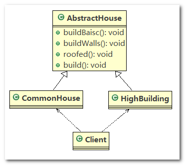
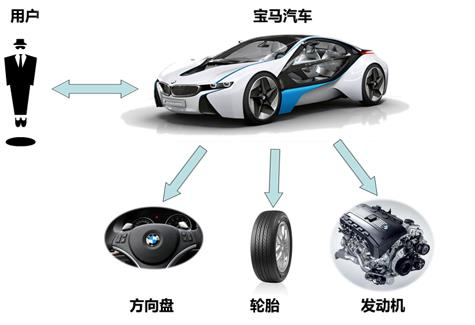
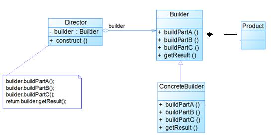
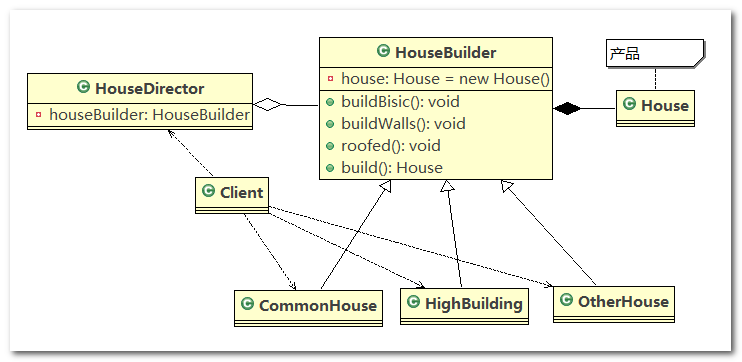

# 建造者模式

## 1、盖房项目实际需求

1. 需要建房子：这一过程为打桩、 砌墙、封顶
2. 房子有各种各样的，比如普通房，高楼，别墅，各种房子的过程虽然一样，但是各自实现的细节不同
3. 请编写程序，完成需求

## 2、传统方式解决盖房问题

类图



------

代码实现

1. `AbstractHouse`：房子的抽象父类，指定建造房子的规范，以及建造房子的具体流程

   ```java
   public abstract class AbstractHouse {
   
   	// 打地基
   	public abstract void buildBasic();
   
   	// 砌墙
   	public abstract void buildWalls();
   
   	// 封顶
   	public abstract void roofed();
   
   	// 建造房子的具体流程
   	public void build() {
   		buildBasic();
   		buildWalls();
   		roofed();
   	}
   
   }
   
   1234567891011121314151617181920
   ```

2. `CommonHouse`：普通房子，继承 `AbstractHouse` 类，实现了建造房子中各个步骤的具体细节

   ```java
   public class CommonHouse extends AbstractHouse {
   
   	@Override
   	public void buildBasic() {
   		System.out.println(" 普通房子打地基 ");
   	}
   
   	@Override
   	public void buildWalls() {
   		System.out.println(" 普通房子砌墙 ");
   	}
   
   	@Override
   	public void roofed() {
   		System.out.println(" 普通房子封顶 ");
   	}
   
   }
   123456789101112131415161718
   ```

3. `HighBuilding`：高楼大厦，继承 `AbstractHouse` 类，实现了建造房子中各个步骤的具体细节

   ```java
   public class HighBuilding extends AbstractHouse{
   
   	@Override
   	public void buildBasic() {
   		System.out.println(" 高楼的打地基100米 ");
   	}
   
   	@Override
   	public void buildWalls() {
   		System.out.println(" 高楼的砌墙20cm ");
   	}
   
   	@Override
   	public void roofed() {
   		System.out.println(" 高楼的透明屋顶 ");
   	}
   
   
   }
   
   1234567891011121314151617181920
   ```

4. `Client`：客户端，发出建造房子的命令

   ```java
   public class Client {
   
   	public static void main(String[] args) {
   		CommonHouse commonHouse = new CommonHouse();
   		commonHouse.build();
   	}
   
   }
   12345678
   ```

------

传统方式优缺点分析

1. 优点是比较好理解，简单易操作。
2. 设计的程序结构，过于简单，没有设计缓存层对象，程序的扩展和维护不好，也就是说，这种设计方案，把产品(即：房子) 和创建产品的过程(即：建房子流程) 封装在一起，代码耦合性增强了。
3. 解决方案：将产品和产品建造过程解耦 --> 建造者模式

## 3、建造者模式基本介绍

1. 建造者模式（`Builder Pattern`） 又叫生成器模式，是一种对象构建模式。它可以将复杂对象的建造过程抽象出来（抽象类别），使这个抽象过程的不同实现方法可以构造出不同表现（属性）的对象。
2. 建造者模式是一步一步创建一个复杂的对象，它允许用户只通过指定复杂对象的类型和内容就可以构建它们，用户不需要知道内部的具体构建细节。
3. 实际应用场景：建造房子、组装车辆




## 4、建造者模式的四个角色

1. `Product`（产品角色）： 一个具体的产品对象
2. `Builder`（抽象建造者）： 创建一个`Product`对象的抽象接口（或抽象类），抽象建造者主要负责规范建造的流程，不关心具体的建造细节
3. `ConcreteBuilder`（具体建造者）： 实现接口，构建和装配各个部件，具体建造者负责实现具体的建造细节
4. `Director`（指挥者）： 构建一个使用`Builder`接口的具体实现类的对象。它主要是用于创建一个复杂的对象。它主要有两个作用，一是：隔离了客户与对象的生产过程，二是：负责控制产品对象的生产过程

## 5、建造者模式原理类图

1. `Product`（产品类）：一个具体的产品
2. `Builder`（抽象建造者）：`Builder` 中组合了一个 `Product` 实例
3. `ConcreteBuilder`（具体建造者）：实现了 `Builder` 中的抽象方法
4. `Director`（指挥者）：将 `Builder` 的具体实现类聚合到 `Director` 中，在 `Director` 中调用具体的 `Builder` 完成具体产品的制造



## 6、建造者模式解决盖房问题

案例需求

需要建房子：这一过程为打桩、 砌墙、封顶。不管是普通房子也好，别墅也好都需要经历这些过程， 下面我们使用建造者模式(`Builder Pattern`)来完成

------

类图



------

代码实现

1. `House`：产品类

   ```java
   //产品->Product
   public class House {
   	private String base;
   	private String wall;
   	private String roofed;
   12345
   ```

2. `HouseBuilder`：抽象建造者，规定制造房子的规范，并提供 `buildHouse()` 方法返回制造好的房子（产品）

   ```java
   // 抽象的建造者
   public abstract class HouseBuilder {
   
   	protected House house = new House();
   
   	// 将建造的流程写好, 抽象的方法
   	public abstract void buildBasic();
   
   	public abstract void buildWalls();
   
   	public abstract void roofed();
   
   	// 建造房子好， 将产品(房子) 返回
   	public House buildHouse() {
   		return house;
   	}
   
   }
   123456789101112131415161718
   ```

3. `CommonHouse`：具体建造者，负责建造普通房子，重写父类 `HouseBuilder` 中的抽象方法来指定普通房子的建造细节

   ```java
   public class CommonHouse extends HouseBuilder {
   
   	@Override
   	public void buildBasic() {
   		house.setBase("普通房子打地基5米");
   	}
   
   	@Override
   	public void buildWalls() {
   		house.setWall("普通房子砌墙10cm");
   	}
   
   	@Override
   	public void roofed() {
   		house.setRoofed("普通房子屋顶");
   	}
   
   }
   123456789101112131415161718
   ```

4. `HighBuilding`：具体建造者，负责建造高楼大厦，重写父类 `HouseBuilder` 中的抽象方法来指定高楼大厦的建造细节

   ```java
   public class HighBuilding extends HouseBuilder {
   
   	@Override
   	public void buildBasic() {
   		house.setBase("高楼的打地基100米");
   	}
   
   	@Override
   	public void buildWalls() {
   		house.setWall("高楼的砌墙20cm");
   	}
   
   	@Override
   	public void roofed() {
   		house.setRoofed("高楼的透明屋顶");
   	}
   
   }
   123456789101112131415161718
   ```

5. `HouseDirector`：指挥者，指挥具体的 `Builder` 对象制造产品，可指定制造产品的流程

   ```java
   //指挥者，这里去指定制作流程，返回产品
   public class HouseDirector {
   
   	HouseBuilder houseBuilder = null;
   
   	// 构造器传入 houseBuilder
   	public HouseDirector(HouseBuilder houseBuilder) {
   		this.houseBuilder = houseBuilder;
   	}
   
   	// 通过setter 传入 houseBuilder
   	public void setHouseBuilder(HouseBuilder houseBuilder) {
   		this.houseBuilder = houseBuilder;
   	}
   
   	// 如何处理建造房子的流程，交给指挥者
   	public House constructHouse() {
   		houseBuilder.buildBasic();
   		houseBuilder.buildWalls();
   		houseBuilder.roofed();
   		return houseBuilder.buildHouse();
   	}
   
   }
   123456789101112131415161718192021222324
   ```

6. `Client`：客户端，发出建造房子的命令

   ```java
   public class Client {
   	public static void main(String[] args) {
   		// 盖普通房子
   		CommonHouse commonHouse = new CommonHouse();
   		// 准备创建房子的指挥者
   		HouseDirector houseDirector = new HouseDirector(commonHouse);
   		// 完成盖房子，返回产品(普通房子)
   		House house = houseDirector.constructHouse();
   		// 查看建造的普通房子
   		System.out.println(house);
   
   		System.out.println("--------------------------");
   		// 盖高楼
   		HighBuilding highBuilding = new HighBuilding();
   		// 重置建造者
   		houseDirector.setHouseBuilder(highBuilding);
   		// 完成盖房子，返回产品(高楼)
   		house = houseDirector.constructHouse();
   		// 查看建造的高楼
   		System.out.println(house);
   	}
   }
   12345678910111213141516171819202122
   ```

7. 程序运行结果

   ```
   House [base=普通房子打地基5米, wall=普通房子砌墙10cm, roofed=普通房子屋顶]
   --------------------------
   House [base=高楼的打地基100米, wall=高楼的砌墙20cm, roofed=高楼的透明屋顶]
   123
   ```

------

总结

1. 首先，`Product` 为产品类，将 `Product` 的实例对象组合在抽象建造者 `AbstractBuilder` 中，并通过抽象建造者中定义的抽象方法，来约定制造产品的规范
2. 然后，通过 `Builder` 具体的实现类：具体建造者 `ConcreteBuilder`，重写抽象父类 `AbstractBuilder` 中的抽象方法，来指定具体产品的制造细节
3. 最后，将 `ConcreteBuilder` 的实例对象聚合在指挥者 `Director` 中，通过指挥者实现具体产品的制造流程（抽象方法的调用顺序），最后返回产品即可

## 7、JDK StringBuilder

1. `StringBuilder` 的 `append()` 方法：调用父类`AbstractStringBuilder` 的 `append()` 方法

   ```java
   public final class StringBuilder
       extends AbstractStringBuilder
       implements java.io.Serializable, CharSequence
   {
       // ...
       
       @Override
       public StringBuilder append(String str) {
           super.append(str);
           return this;
       }
       
       // ...
   12345678910111213
   ```

2. `AbstractStringBuilder` 的 `append()` 方法是由 `Appendable` 接口定义的规范

   ```java
   abstract class AbstractStringBuilder implements Appendable, CharSequence {
       /**
        * The value is used for character storage.
        */
       char[] value;
   
       /**
        * The count is the number of characters used.
        */
       int count;
   
       /**
        * This no-arg constructor is necessary for serialization of subclasses.
        */
       AbstractStringBuilder() {
       }
   
       /**
        * Creates an AbstractStringBuilder of the specified capacity.
        */
       AbstractStringBuilder(int capacity) {
           value = new char[capacity];
       }
       
       // ...
       
       public AbstractStringBuilder append(String str) {
           if (str == null)
               return appendNull();
           int len = str.length();
           ensureCapacityInternal(count + len);
           str.getChars(0, len, value, count);
           count += len;
           return this;
       }
       
       // ...
   12345678910111213141516171819202122232425262728293031323334353637
   ```

3. `Appendable` 接口：定义了 `append()` 方法的规范，相当于是一个抽象的建造者

   ```java
   public interface Appendable {
   
       Appendable append(CharSequence csq) throws IOException;
   
       Appendable append(CharSequence csq, int start, int end) throws IOException;
   
       Appendable append(char c) throws IOException;
   }
   12345678
   ```

4. 说明：实际源码中的生产模式有可能和我们讲的有细微差别

------

源码中建造者模式角色分析

1. `Appendable` 接口定义了多个 `append()` 方法(抽象方法)，即 `Appendable` 为抽象建造者，定义了制造产品的抽象方法（规范）
2. `AbstractStringBuilder` 实现了 `Appendable` 接口方法，这里的 `AbstractStringBuilder` 已经是建造者，只是不能实例化
3. `StringBuilder` 既充当了指挥者角色，同时充当了具体的建造者， 因为建造方法的实现是由 `AbstractStringBuilder` 完成，而 `StringBuilder` 继承了`AbstractStringBuilder`

## 8、建造者模式注意事项

> **建造者模式的注意事项和细节**

1. 客户端(使用程序)不必知道产品内部组成的细节，将产品本身与产品的创建过程解耦，使得相同的创建过程可以创建不同的产品对象
2. 每一个具体建造者都相对独立，而与其他的具体建造者无关，因此可以很方便地替换具体建造者或增加新的具体建造者， 用户使用不同的具体建造者即可得到不同的产品对象
3. 可以更加精细地控制产品的创建过程 。将复杂产品的创建步骤分解在不同的方法中，使得创建过程更加清晰，也更方便使用程序来控制创建过程
4. 增加新的具体建造者无须修改原有类库的代码，指挥者类针对抽象建造者类编程，系统扩展方便，符合 “开闭原则”
5. 建造者模式所创建的产品一般具有较多的共同点，其组成部分相似，如果产品之间的差异性很大，则不适合使用建造者模式，因此其使用范围受到一定的限制
6. 如果产品的内部变化复杂，可能会导致需要定义很多具体建造者类来实现这种变化，导致系统变得很庞大， 因此在这种情况下，要考虑是否选择建造者模式

> **抽象工厂模式 VS 建造者模式**

1. 抽象工厂模式实现对产品家族的创建，一个产品家族是这样的一系列产品：具有不同分类维度的产品组合，采用抽象工厂模式不需要关心构建过程，只关心什么产品由什么工厂生产即可
2. 而建造者模式则是要求按照指定的蓝图建造产品，它的主要目的是通过组装零配件而产生一个新产品，可以这样理解：建造者模式制造产品需要有一个具体的流程，对于不同产品整体流程相差不大，但是每个流程的实现细节较大