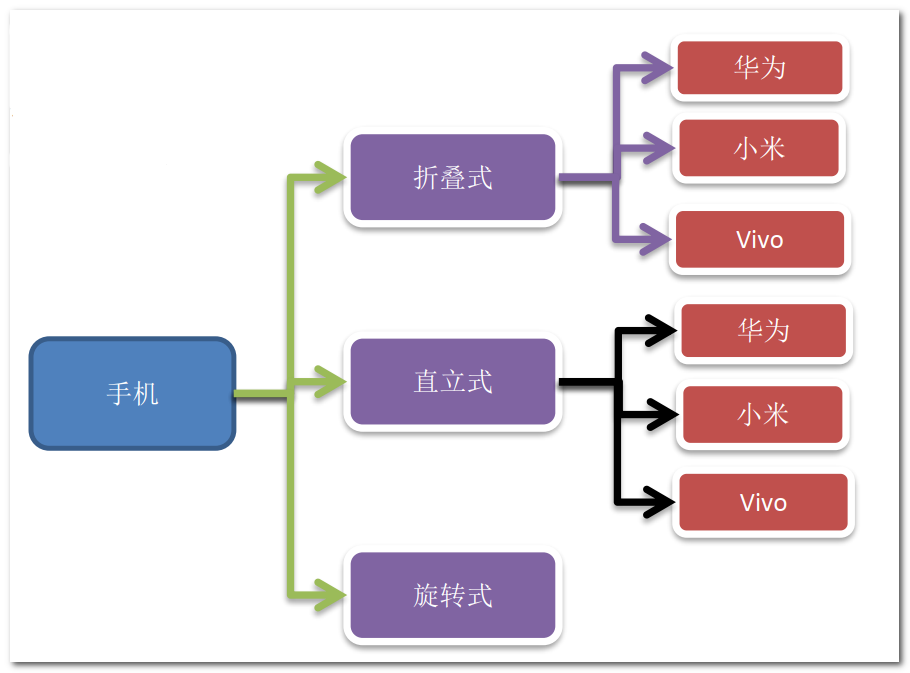
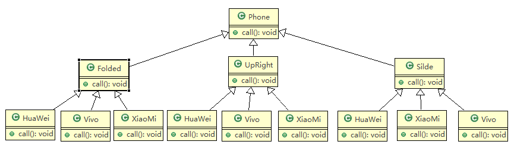
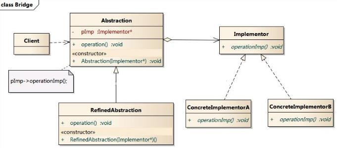
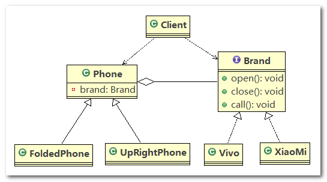
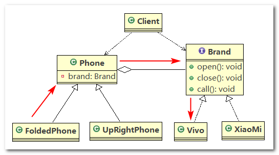
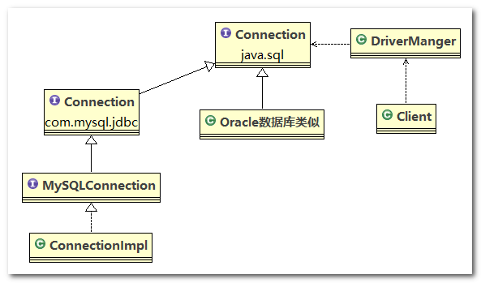
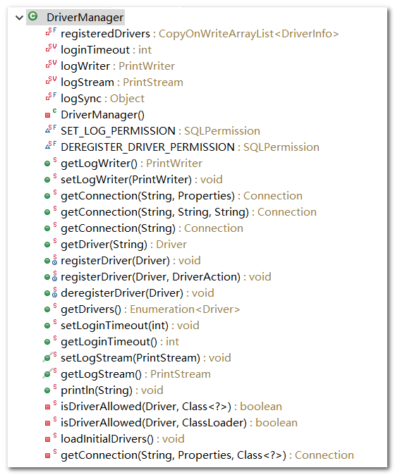
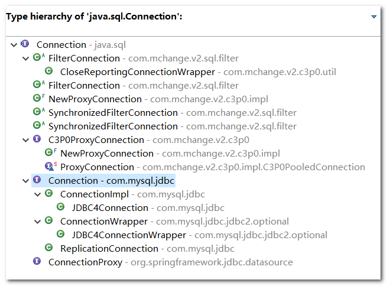

# 桥接模式（Bridge Pattern）

## 1、手机操作问题

现在对不同手机类型、不同品牌的手机实现操作编程(比如：开机、关机、上网，打电话等)



## 2、传统方案解决手机问题

类图



------

传统方案解决手机操作问题分析

1. 扩展性问题(类爆炸)， 如果我们再增加手机的样式(旋转式)，就需要增加各个品牌手机的类，同样如果我们增加一个手机品牌，也要在各个手机样式类下增加
2. 违反了单一职责原则，当我们增加手机样式时，要同时增加所有品牌的手机，这样增加了代码维护成本
3. 解决方案 --> 使用桥接模式

## 3、桥接模式基本介绍

> **桥接模式(Bridge)-基本介绍**

1. 桥接模式(`Bridge`模式)是指：将实现与抽象放在两个不同的类层次中，使两个层次可以独立改变，桥接模式是一种结构型设计模式
2. `Bridge`模式基于类的最小设计原则，通过使用封装、聚合及继承等行为让不同的类承担不同的职责。它的主要特点是把抽象(`Abstraction`)与行为实现(`Implementation`)分离开来，从而可以保持各部分的独立性以及应对他们的功能扩展

## 4、桥接模式原理类图

> **桥接模式(Bridge)-原理类图**

1. `Client`：桥接模式的调用者
2. `Abstraction`：抽象类，`Abstraction` 中维护了一个 `Implementor` 实现类的实例（聚合关系），`Abstraction` 充当桥接类
3. `RefinedAbstraction`：`Abstraction` 的具体实现类
4. `Implementor`：定义行为的接口
5. `ConcreteImplementor`：`Implementor` 的具体实现类

从 `UML` 图： 这里的抽象类和接口是聚合的关系， 其实也是调用和被调用关系，抽象在 `Abstraction` 这一块，行为实现在 `Implementor` 这一块



## 5、桥接模式解决手机问题

使用桥接模式改进传统方式，让程序具有更好的扩展性，利用程序维护

------

类图



------

代码实现

1. `Brand`：规定各个品牌手机的行为

   ```java
   //接口
   public interface Brand {
   	void open();
   
   	void close();
   
   	void call();
   }
   ```

2. `XiaoMi`：实现了 `Brand` 接口，指定了小米手机的具体行为

   ```java
   public class XiaoMi implements Brand {
   
   	@Override
   	public void open() {
   		System.out.println(" 小米手机开机 ");
   	}
   
   	@Override
   	public void close() {
   		System.out.println(" 小米手机关机 ");
   	}
   
   	@Override
   	public void call() {
   		System.out.println(" 小米手机打电话 ");
   	}
   
   }
   ```

3. `Vivo`：实现了 `Brand` 接口，指定了 `Vivo` 手机的具体行为

   ```java
   public class Vivo implements Brand {
   
   	@Override
   	public void open() {
   		System.out.println(" Vivo手机开机 ");
   	}
   
   	@Override
   	public void close() {
   		System.out.println(" Vivo手机关机 ");
   	}
   
   	@Override
   	public void call() {
   		System.out.println(" Vivo手机打电话 ");
   	}
   
   }
   ```

4. `Phone`：电话的抽象类，在该类中聚合了一个 `Brand` 接口的具体实现类

   ```java
   public abstract class Phone {
   
   	// 组合品牌
   	private Brand brand;
   
   	// 构造器
   	public Phone(Brand brand) {
   		this.brand = brand;
   	}
   
   	protected void open() {
   		this.brand.open();
   	}
   
   	protected void close() {
   		this.brand.close();
   	}
   
   	protected void call() {
   		this.brand.call();
   	}
   
   }
   ```

5. `FoldedPhone`：继承抽象父类 `Phone`，对抽象父类中的方法进行重写

   ```java
   //折叠式手机类，继承 抽象类 Phone
   public class FoldedPhone extends Phone {
   
   	// 构造器
   	public FoldedPhone(Brand brand) {
   		super(brand);
   	}
   
   	@Override
   	public void open() {
   		super.open();
   		System.out.println(" 折叠样式手机 ");
   	}
   
   	@Override
   	public void close() {
   		super.close();
   		System.out.println(" 折叠样式手机 ");
   	}
   
   	@Override
   	public void call() {
   		super.call();
   		System.out.println(" 折叠样式手机 ");
   	}
   
   }
   ```

6. `UpRightPhone`：继承抽象父类 `Phone`，对抽象父类中的方法进行重写

   ```java
   public class UpRightPhone extends Phone {
   
   	// 构造器
   	public UpRightPhone(Brand brand) {
   		super(brand);
   	}
   
   	@Override
   	public void open() {
   		super.open();
   		System.out.println(" 直立样式手机 ");
   	}
   
   	@Override
   	public void close() {
   		super.close();
   		System.out.println(" 直立样式手机 ");
   	}
   
   	@Override
   	public void call() {
   		super.call();
   		System.out.println(" 直立样式手机 ");
   	}
   	
   }
   ```

7. `Client`：客户端，可以看到，使用桥接模式可以轻松地组合出不同手机类型、不同品牌的手机

   ```java
   public class Client {
   
   	public static void main(String[] args) {
   
   		// 折叠式的小米手机 (样式 + 品牌 )
   		Phone phone1 = new FoldedPhone(new XiaoMi());
   		phone1.open();
   		phone1.call();
   		phone1.close();
   		System.out.println("=======================");
   
   		// 折叠式的Vivo手机 (样式 + 品牌 )
   		Phone phone2 = new FoldedPhone(new Vivo());
   		phone2.open();
   		phone2.call();
   		phone2.close();
   		System.out.println("==============");
   
   		// 直立式的小米手机 (样式 + 品牌 )
   		UpRightPhone phone3 = new UpRightPhone(new XiaoMi());
   		phone3.open();
   		phone3.call();
   		phone3.close();
   		System.out.println("==============");
   
   		// 直立式的Vivo手机 (样式 + 品牌 )
   		UpRightPhone phone4 = new UpRightPhone(new Vivo());
   		phone4.open();
   		phone4.call();
   		phone4.close();
   		
   	}
   
   }
   ```

------

总结

1. `Phone` 就像一座桥的感觉，它其实并没有做什么实质性的工作，只是调用 `Brand` 的具体实现类中的方法，就感觉像是一个请求从 `Phone` 的具体实现类通过 `Phone` 传递到了 `Brand` 的具体实现类
2. 通过代码我们可以看到，增加一个新的手机样式，并不会引起类膨胀，因为只要新样式继承了 `Phone`，并通过构造器或者 `setter` 方法聚合一个 `Brand` 实现类的实例，就能完成组合的作用



## 6、JDBC 源码剖析

> **桥接模式在JDBC的源码剖析**

`Jdbc` 的 `Driver`接口，如果从桥接模式来看， `Driver`就是一个接口（行为规范），下面可以有`MySQL`的`Driver`， `Oracle`的`Driver`，这些就可以当做实现接口类

> **源码剖析**

类图



------

代码追踪

1. 客户端通过 `DriverManager` 操作数据库，`DriverManager` 里面定义了很多方法，就比如说如下的 `getConnection()` 方法，它返回一个 `Connection` 对象

   

   ```java
   @CallerSensitive
   public static Connection getConnection(String url,
       java.util.Properties info) throws SQLException {
   
       return (getConnection(url, info, Reflection.getCallerClass()));
   }
   ```

2. `Connection` 为 `java.sql` 包下的接口，里面定义了 超多的抽象方法，比如 `prepareStatement()` 方法

   ```java
   public interface Connection  extends Wrapper, AutoCloseable {
       
       // ...  
       PreparedStatement prepareStatement(String sql, int resultSetType,
                                          int resultSetConcurrency, int resultSetHoldability)
           throws SQLException;
   
       CallableStatement prepareCall(String sql, int resultSetType,
                                     int resultSetConcurrency,
                                     int resultSetHoldability) throws SQLException;
   
       PreparedStatement prepareStatement(String sql, int autoGeneratedKeys)
           throws SQLException;
   
       PreparedStatement prepareStatement(String sql, int columnIndexes[])
           throws SQLException;
   
       PreparedStatement prepareStatement(String sql, String columnNames[])
           throws SQLException;
   
       // ...
   ```

3. `com.mysql.jdbc.Connection` 接口继承了 `java.sql.Connection` 接口

   

   ```java
   public interface Connection extends java.sql.Connection, ConnectionProperties {
   ```

4. `ConnectionImpl` 类实现了 `MySQLConnection` 接口，其中 `MySQLConnection` 接口继承了 `com.mysql.jdbc.Connection` 接口

   ```java
   public class ConnectionImpl extends ConnectionPropertiesImpl implements MySQLConnection {
   ```

------

总结

就以 `getConnection()` 方法的调用过程为例，`Client` 端调用 `DriverManager`（桥接器），`DriverManager` 去找 `java.sql.Connection` 的具体实现类

## 7、桥接模式的注意事项

> **桥接模式的注意事项和细节**

1. 实现了抽象和实现部分的分离， 从而极大的提供了系统的灵活性， 让抽象部分和实现部分独立开来， 这有助于系统进行分层设计， 从而产生更好的结构化系统。
2. 对于系统的高层部分， 只需要知道抽象部分和实现部分的接口就可以了， 其它的部分由具体业务来完成。
3. 桥接模式替代多层继承方案， 可以减少子类的个数， 降低系统的管理和维护成本
4. 桥接模式的引入增加了系统的理解和设计难度， 由于聚合关联关系建立在抽象层， 要求开发者针对抽象进行设计和编程
5. 桥接模式要求正确识别出系统中两个独立变化的维度(抽象和实现)， 因此其使用范围有一定的局限性， 即需要有这样的应用场景

## 8、桥接模式应用场景

对于那些不希望使用继承或因为多层次继承导致系统类的个数急剧增加的系统， 桥接模式尤为适用

1. `JDBC` 驱动程序
2. 银行转账系统
   1. 转账分类（抽象层）：网上转账， 柜台转账， `AMT` 转账
   2. 转账用户类型（行为实现）： 普通用户， 银卡用户， 金卡用户
3. 消息管理
   1. 消息类型（抽象层）： 即时消息， 延时消息
   2. 消息分类（行为实现）： 手机短信， 邮件消息， `QQ` 消息