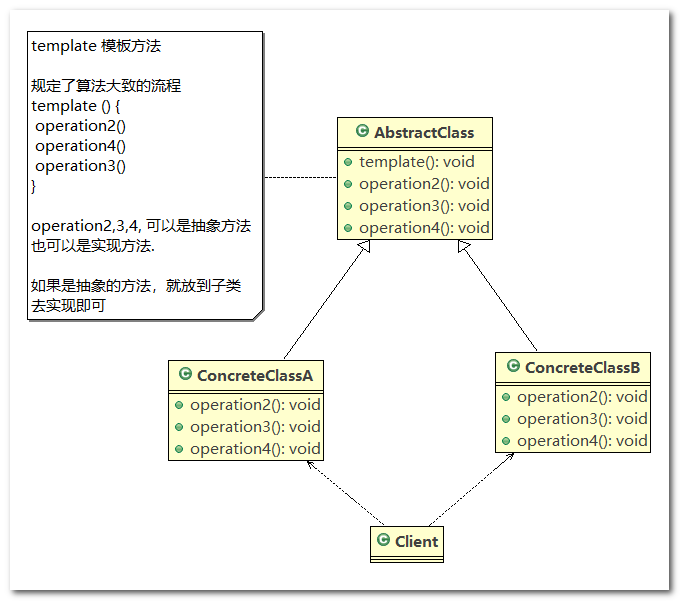
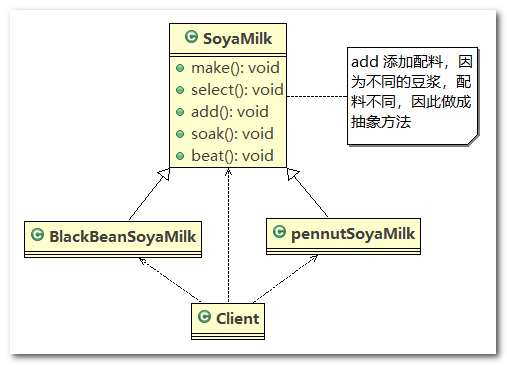
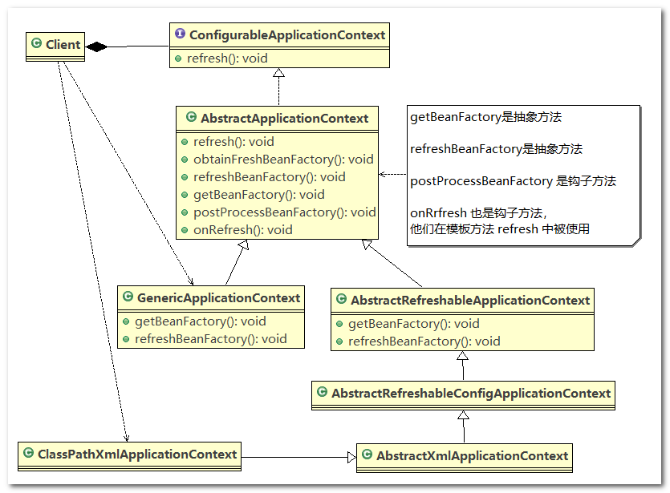
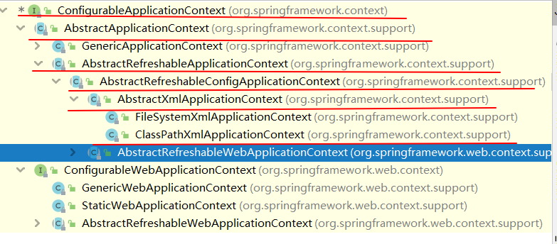

# 模板方法模式

## 1、豆浆制作问题

> **编写制作豆浆的程序， 说明如下:**

1. 制作豆浆的流程：选材—>添加配料—>浸泡—>放到豆浆机打碎
2. 通过添加不同的配料， 可以制作出不同口味的豆浆
3. 选材、 浸泡和放到豆浆机打碎这几个步骤对于制作每种口味的豆浆都是一样的
4. 请使用模板方法模式完成 (说明：因为模板方法模式，比较简单，很容易就想到这个方案， 因此就直接使用，不再使用传统的方案来引出模板方法模式)

## 2、模板方法模式基本介绍

1. 模板方法模式(`Template Method Pattern`) ， 又叫模板模式(`Template Pattern`)， 在一个抽象类公开定义了执行它的方法的模板，它的子类可以按需要重写方法实现， 但调用将以抽象类中定义的方式进行
2. 简单说， 模板方法模式定义一个操作中的算法(流程)的骨架， 而将一些步骤延迟到子类中， 使得子类可以不改变一个算法的结构， 就可以重定义该算法的某些特定步骤
3. 模板方法设计模式属于行为型模式

## 3、模板方法模式原理类图

1. `AbstractClass` 为抽象类， 类中实现了`template()`模板方法， 该方法定义了算法的骨架， 具体子类需要去实现抽象方法 `operation 2,3,4`
2. `ConcreteClass`实现抽象方法 `operation 2,3,4`，以完成算法中特定子类的步骤



## 4、模板方法模式解决豆浆制作问题

应用实例要求

1. 对于编写制作豆浆的程序， 说明如下:
2. 制作豆浆的流程：选材—>添加配料—>浸泡—>放到豆浆机打碎
3. 通过添加不同的配料， 可以制作出不同口味的豆浆
4. 选材、 浸泡和放到豆浆机打碎这几个步骤对于制作每种口味的豆浆都是一样的

------

类图



------

代码实现

1. `SoyaMilk`：抽象类，定义制作豆浆的模板方法，对于不同口味的豆浆，子类重写 `addCondiments()` 方法即可

   ```java
   //抽象类，表示豆浆
   public abstract class SoyaMilk {
   
   	// 模板方法, make , 模板方法可以做成final , 不让子类去覆盖
   	final void make() {
   
   		select();
   		addCondiments();
   		soak();
   		beat();
   
   	}
   
   	// 选材料
   	void select() {
   		System.out.println("第一步：选择好的新鲜黄豆  ");
   	}
   
   	// 添加不同的配料, 抽象方法, 子类具体实现
   	abstract void addCondiments();
   
   	// 浸泡
   	void soak() {
   		System.out.println("第三步， 黄豆和配料开始浸泡， 需要3小时 ");
   	}
   
   	void beat() {
   		System.out.println("第四步：黄豆和配料放到豆浆机去打碎  ");
   	}
   }
   ```

2. `RedBeanSoyaMilk`：红豆口味的豆浆，重写 `addCondiments()` 方法，添加红豆

   ```java
   public class RedBeanSoyaMilk extends SoyaMilk {
   
   	@Override
   	void addCondiments() {
   		System.out.println(" 加入上好的红豆 ");
   	}
   
   }
   ```

3. `PeanutSoyaMilk`：花生口味的豆浆，重写 `addCondiments()` 方法，添加花生

   ```java
   public class PeanutSoyaMilk extends SoyaMilk {
   
   	@Override
   	void addCondiments() {
   		System.out.println(" 加入上好的花生 ");
   	}
   
   }
   ```

4. `Client`：客户端

   ```java
   public class Client {
   
   	public static void main(String[] args) {
   		// 制作红豆豆浆
   		System.out.println("----制作红豆豆浆----");
   		SoyaMilk redBeanSoyaMilk = new RedBeanSoyaMilk();
   		redBeanSoyaMilk.make();
   
            // 制作花生豆浆
   		System.out.println("----制作花生豆浆----");
   		SoyaMilk peanutSoyaMilk = new PeanutSoyaMilk();
   		peanutSoyaMilk.make();
   	}
   
   }
   ```

## 5、模板方法模式的钩子方法

钩子方法

1. 在模板方法模式的父类中， 我们可以定义一个方法，它默认不做任何事，子类可以视情况要不要覆盖它，该方法称为“钩子”
2. 还是用上面做豆浆的例子来讲解，比如，我们还希望制作纯豆浆，不添加任何的配料， 请使用钩子方法对前面的模板方法进行改造

------

代码演示

1. `SoyaMilk`：添加 `customerWantCondiments()` 方法用于判断是否需要添加配料

   ```java
   //抽象类，表示豆浆
   public abstract class SoyaMilk {
   
   	// 模板方法, make , 模板方法可以做成final , 不让子类去覆盖.
   	final void make() {
   
   		select();
   		if (customerWantCondiments()) {
   			addCondiments();
   		}
   		soak();
   		beat();
   
   	}
   
   	// 选材料
   	void select() {
   		System.out.println("第一步：选择好的新鲜黄豆  ");
   	}
   
   	// 添加不同的配料， 抽象方法, 子类具体实现
   	abstract void addCondiments();
   
   	// 浸泡
   	void soak() {
   		System.out.println("第三步， 黄豆和配料开始浸泡， 需要3小时 ");
   	}
   
   	void beat() {
   		System.out.println("第四步：黄豆和配料放到豆浆机去打碎  ");
   	}
   
   	// 钩子方法，决定是否需要添加配料
   	boolean customerWantCondiments() {
   		return true;
   	}
   }
   ```

2. `PureSoyaMilk`：纯豆浆无需添加配料，所以 `customerWantCondiments()` 返回 `false`，空实现 `addCondiments()` 方法

   ```java
   public class PureSoyaMilk extends SoyaMilk{
   
   	@Override
   	void addCondiments() {
   		//空实现
   	}
   	
   	@Override
   	boolean customerWantCondiments() {
   		return false;
   	}
    
   }
   ```

3. `Client`：客户端

   ```java
   public class Client {
   
   	public static void main(String[] args) {
   		// 制作红豆豆浆
   		System.out.println("----制作红豆豆浆----");
   		SoyaMilk redBeanSoyaMilk = new RedBeanSoyaMilk();
   		redBeanSoyaMilk.make();
   
   		// 制作花生豆浆
   		System.out.println("----制作花生豆浆----");
   		SoyaMilk peanutSoyaMilk = new PeanutSoyaMilk();
   		peanutSoyaMilk.make();
   
   		// 制作纯豆浆
   		System.out.println("----制作纯豆浆----");
   		SoyaMilk pureSoyaMilk = new PureSoyaMilk();
   		pureSoyaMilk.make();
   	}
   
   }
   ```

## 6、Spring 框架中的模板方法模式

> **类图**



> **继承关系图**



> **源码追踪**

`ConfigurableApplicationContext` 中定义了抽象方法 `refresh()`

```java
public interface ConfigurableApplicationContext extends ApplicationContext, Lifecycle, Closeable {
    
    // ...
    
    void refresh() throws BeansException, IllegalStateException;

    // ...
```

------

`AbstractApplicationContext`

1. `AbstractApplicationContext` 实现了 `ConfigurableApplicationContext` 接口，重写了 `refresh()` 方法，`AbstractApplicationContext` 类中的 `refresh()` 方法就是模板方法

   ```java
   public abstract class AbstractApplicationContext extends DefaultResourceLoader
   		implements ConfigurableApplicationContext, DisposableBean {
       // ...
       
   	@Override
   	public void refresh() throws BeansException, IllegalStateException {
   		synchronized (this.startupShutdownMonitor) {
   			// Prepare this context for refreshing.
   			prepareRefresh();
   
   			// Tell the subclass to refresh the internal bean factory.
   			ConfigurableListableBeanFactory beanFactory = obtainFreshBeanFactory();
   
   			// Prepare the bean factory for use in this context.
   			prepareBeanFactory(beanFactory);
   
   			try {
   				// Allows post-processing of the bean factory in context subclasses.
   				postProcessBeanFactory(beanFactory);
   
   				// Invoke factory processors registered as beans in the context.
   				invokeBeanFactoryPostProcessors(beanFactory);
   
   				// Register bean processors that intercept bean creation.
   				registerBeanPostProcessors(beanFactory);
   
   				// Initialize message source for this context.
   				initMessageSource();
   
   				// Initialize event multicaster for this context.
   				initApplicationEventMulticaster();
   
   				// Initialize other special beans in specific context subclasses.
   				onRefresh();
   
   				// Check for listener beans and register them.
   				registerListeners();
   
   				// Instantiate all remaining (non-lazy-init) singletons.
   				finishBeanFactoryInitialization(beanFactory);
   
   				// Last step: publish corresponding event.
   				finishRefresh();
   			}
   
   			catch (BeansException ex) {
   				if (logger.isWarnEnabled()) {
   					logger.warn("Exception encountered during context initialization - " +
   							"cancelling refresh attempt: " + ex);
   				}
   
   				// Destroy already created singletons to avoid dangling resources.
   				destroyBeans();
   
   				// Reset 'active' flag.
   				cancelRefresh(ex);
   
   				// Propagate exception to caller.
   				throw ex;
   			}
   
   			finally {
   				// Reset common introspection caches in Spring's core, since we
   				// might not ever need metadata for singleton beans anymore...
   				resetCommonCaches();
   			}
   		}
   	}
   }
   
       // ...
   ```

2. 在 `obtainFreshBeanFactory()` 方法中调用了 `refreshBeanFactory()` 方法和 `getBeanFactory()` 方法

   ```java
   protected ConfigurableListableBeanFactory obtainFreshBeanFactory() {
      refreshBeanFactory();
      ConfigurableListableBeanFactory beanFactory = getBeanFactory();
      if (logger.isDebugEnabled()) {
         logger.debug("Bean factory for " + getDisplayName() + ": " + beanFactory);
      }
      return beanFactory;
   }
   ```

3. `refreshBeanFactory()` 方法和 `getBeanFactory()` 方法都是 `AbstractApplicationContext` 类中定义的抽象方法

   ```java
   protected abstract void refreshBeanFactory() throws BeansException, IllegalStateException;
   
   @Override
   public abstract ConfigurableListableBeanFactory getBeanFactory() throws IllegalStateException;
   ```

4. 在 `AbstractApplicationContext` 类中定义了一些钩子方法： `postProcessBeanFactory(beanFactory)` 方法和 `onRefresh()` 方法，这些方法默认都是空实现

```java
protected void postProcessBeanFactory(ConfigurableListableBeanFactory beanFactory) {
	}


protected void onRefresh() throws BeansException {
   // For subclasses: do nothing by default.
}
```

`AbstractRefreshableApplicationContext`

`AbstractRefreshableApplicationContext` 继承 `AbstractApplicationContext` 类，并实现了一些方法的具体逻辑，比如

```java
public abstract class AbstractRefreshableApplicationContext extends AbstractApplicationContext {
    
    // ...
    
    @Override
	public final ConfigurableListableBeanFactory getBeanFactory() {
		synchronized (this.beanFactoryMonitor) {
			if (this.beanFactory == null) {
				throw new IllegalStateException("BeanFactory not initialized or already closed - " +
						"call 'refresh' before accessing beans via the ApplicationContext");
			}
			return this.beanFactory;
		}
	}

    
    // ...
```

## 7、模板方法模式的注意事项

> **模板方法模式的注意事项和细节**

1. 基本思想是：将算法的具体实现流程编写在抽象父类中，某些具体的方法实现由子类重写。 需要修改算法时， 只要修改父类的模板方法或者已经实现的某些步骤流程， 子类就会继承这些修改
2. 实现了最大化代码复用。 父类的模板方法和已实现的某些步骤会被子类继承而直接使用。
3. 既统一了算法， 也提供了很大的灵活性。 父类的模板方法确保了算法的结构保持不变， 同时由子类提供部分步骤的实现。
4. 该模式的不足之处： 每一个不同的具体实现都需要一个子类实现， 导致类的个数增加， 使得系统更加庞大
5. 一般模板方法都加上 `final` 关键字， 防止子类重写模板方法
6. 模板方法模式使用场景： 当要完成在某个过程， 该过程要执行一系列步骤 ， 这一系列的步骤基本相同， 但其个别步骤在实现时 可能不同， 通常考虑用模板方法模式来处理