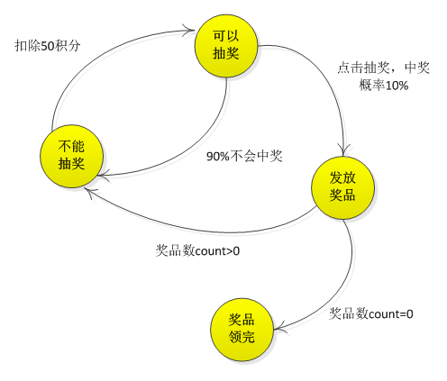
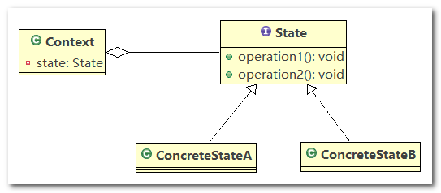
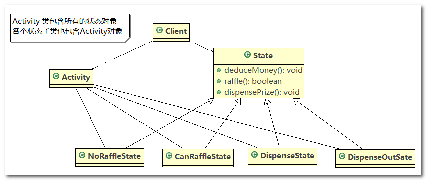
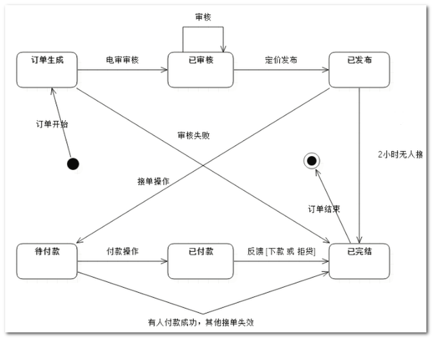
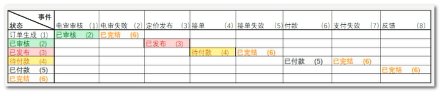
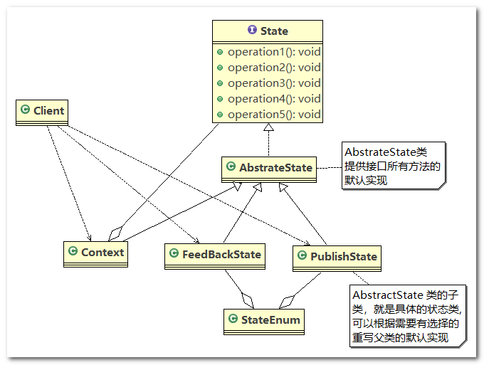

# 状态模式

## 1、APP 抽奖活动问题

请编写程序完成`APP`抽奖活动，具体要求如下:

1. 假如每参加一次这个活动要扣除用户`50`积分，中奖概率是`10%`
2. 奖品数量固定，抽完就不能抽奖
3. 活动有四个状态：可以抽奖、不能抽奖、发放奖品和奖品领完
4. 活动的四个状态转换关系图



## 2、状态模式基本介绍

1. 状态模式(`State Pattern`)：它主要用来解决对象在多种状态转换时，需要对外输出不同的行为的问题。状态和行为是一一对应的，状态之间可以相互转换
2. 当一个对象的内在状态改变时，允许改变其行为，这个对象看起来像是改变了其类

## 3、状态模式原理类图

1. `Context` 类为上下文对象，用于维护`State`实例，这个实例定义当前状态
2. `State` 是抽象的状态角色，定义一个接口封装与`Context` 的一个特定接口相关行为
3. `ConcreteState` 具体的状态角色，每个子类实现一个与`Context` 的一个状态相关行为



## 4、状态模式解决 APP 抽奖问题

应用实例要求

完成`APP`抽奖活动项目，使用状态模式

------

类图



------

代码实现

1. `State`：抽奖状态的抽象父类，定义了三个抽奖动作：扣除积分、抽奖、发放奖品

   ```java
   /**
    * 状态抽象类
    * 
    * @author Administrator
    *
    */
   public abstract class State {
   
   	// 扣除积分 - 50
   	public abstract void deductMoney();
   
   	// 是否抽中奖品
   	public abstract boolean raffle();
   
   	// 发放奖品
   	public abstract void dispensePrize();
   
   }
   ```

2. `NoRaffleState`：等待扣除积分，不能抽奖的状态

   ```java
   /**
    * 不能抽奖状态
    * 
    * @author Administrator
    *
    */
   public class NoRaffleState extends State{
   
       private Activity activity;
   
       public NoRaffleState(Activity activity) {
           this.activity = activity;
       }
   
       // 当前状态可以扣积分 , 扣除后，将状态设置成可以抽奖状态
       @Override
       public void deductMoney() {
           int money = activity.getMoney();
           System.out.println("当前有："+money+" 积分");
           activity.setMoney(money-50);
           activity.setState(activity.getCanRaffleState());
       }
   
       @Override
       public boolean raffle() {
           return false;
       }
   
       @Override
       public void dispensePrize() {
   
       }
   }
   ```

3. `CanRaffleState`：已经扣除完积分，等待抽奖的状态

   ```java
   /**
    * 可以抽奖的状态
    * 
    * @author Administrator
    *
    */
   public class CanRaffleState extends State {
   
       private Activity activity;
   
       public CanRaffleState(Activity activity) {
           this.activity = activity;
       }
   
       @Override
       public void deductMoney() {
   
       }
   
       // 可以抽奖, 抽完奖后，根据实际情况，改成新的状态
       @Override
       public boolean raffle() {
           System.out.println("正在抽奖，请稍等");
           Random random = new Random();
           int i = random.nextInt(10);
           System.out.println("抽奖码是："+i);
           // 10%中奖机会
           if (i==0){
               // 改变活动状态为发放奖品 context
               activity.setState(activity.getDispenseState());
               return true;
           }else {
               // 改变状态为不能抽奖
               activity.setState(activity.getNoDispenseState());
               return false;
           }
       }
   
       @Override
       public void dispensePrize() {
   
       }
   }
   ```

4. `DispenseState`：已抽完奖，等待发放奖品的状态

   ```java
   /**
    * 发放奖品的状态
    * 
    * @author Administrator
    *
    */
   public class DispenseState extends State {
   
       private Activity activity;
   
       public DispenseState(Activity activity) {
           this.activity = activity;
       }
   
       @Override
       public void deductMoney() {
   
       }
   
       @Override
       public boolean raffle() {
           return false;
       }
   
       @Override
       public void dispensePrize() {
           System.out.println("恭喜中奖了");
           // 改变状态为不能抽奖
           activity.setState(activity.getNoRaffleState());
       }
   }
   ```

5. `NoDispenseState`：不发奖品状态

   ```java
   /**
    * 奖品发放完毕状态 说明，当我们activity 改变成 DispenseOutState， 抽奖活动结束
    * 
    * @author Administrator
    *
    */
   public class NoDispenseState extends State {
   
       private Activity activity;
   
       public NoDispenseState(Activity activity) {
           this.activity = activity;
       }
   
       @Override
       public void deductMoney() { }
   
       @Override
       public boolean raffle() {
           return false;
       }
   
       @Override
       public void dispensePrize() {
           System.out.println("很遗憾，没中");
           // 改变状态为不能抽奖
           activity.setState(activity.getNoRaffleState());
       }
   }
   ```

6. `RaffleActivity`：上下文对象，用于维护 `State`状态对象，并实现扣除积分和抽奖的方法

   ```java
   /**
    * 抽奖活动
    * 
    * @author Administrator
    *
    */
   public class Activity {
   
       //积分的数量
       private int money;
       //奖品个数
       private int count;
       //当前活动的状态
       private State state = null;
   
       private State noRaffleState = new NoRaffleState(this);
       private State canRaffleState = new CanRaffleState(this);
       private State dispenseState = new DispenseState(this);
       private State noDispenseState = new NoDispenseState(this);
   
       public Activity(int money, int count) {
           this.money = money;
           this.count = count;
           state = noRaffleState;
       }
   
   
       public void deductMoney(){
           if (money < 50 ){
               System.out.println("积分不够，不能抽奖");
               System.exit(0);
           }else if(count == 0){
               System.out.println("奖品已经抽完，下次再抽");
               System.exit(0);;
           }else {
               //扣除积分
               state.deductMoney();
               //开始抽奖
               boolean raffle = state.raffle();
               if (raffle){
                   //抽到奖品
                   state.dispensePrize();
                   count--;
               }else {
                   //没有抽到奖品
                   state.dispensePrize();
               }
           }
       }
       
       //getter和setter方法
       public int getMoney() {
           return money;
       }
   
       public void setMoney(int money) {
           this.money = money;
       }
   
   
       public void setState(State state) {
           this.state = state;
       }
   
       public State getNoRaffleState() {
           return noRaffleState;
       }
   
       public void setNoRaffleState(State noRaffleState) {
           this.noRaffleState = noRaffleState;
       }
   
       public State getCanRaffleState() {
           return canRaffleState;
       }
   
       public State getDispenseState() {
           return dispenseState;
       }
   
       public State getNoDispenseState() {
           return noDispenseState;
       }
   
   }
   ```

7. `ClientTest`：测试代码

   ```java
   /**
    * 状态模式测试类
    * 
    * @author Administrator
    *
    */
   public class Client {
       public static void main(String[] args) {
           // 创建活动对象，奖品有1个奖品
           Activity activity = new Activity(300,1);
   
           // 我们连续抽30次奖
           for (int i = 0; i < 30; i++) {
               System.out.println("--------第" + (i + 1) + "次抽奖----------");
               // 参加抽奖
               activity.deductMoney();
           }
       }
   }
   ```

## 5、状态模式在实际项目的应用

> **传统实现方式分析**

1. 借贷平台的订单，有审核、发布、抢单等等 步骤，随着操作的不同，会改变订单的状态，项目中的这个模块实现就会使用到状态模式

2. 通常通过`if else`判断订单的状态，从而实现不同的逻辑，伪代码如下

   ```java
   if(审核){
   	//审核逻辑
   }elseif(发布){
   	//发布逻辑
   }elseif(接单){
   	//接单逻辑
   }
   ```

3. 问题分析 ：这类代码难以应对变化，在添加一种状态时，我们需要手动添加`if else`，在添加一种功能时，要对所有的状态进行判断。因此代码会变得越来越臃肿，并且一旦没有处理某个状态，便会发生极其严重的`BUG`，难以维护

> **状态模式在实际项目-借贷平台 源码剖析**

状态模式本质上是一种基于状态和事件的状态机，下面是订单流程的状态图



通过状态图，我们再设计一张横纵坐标关系表来比较，图如下



------

类图



------

代码实现

1. `State`：订单状态的接口

   ```java
   /**
    * 状态接口
    * 
    * @author Administrator
    *
    */
   public interface State {
   
   	/**
   	 * 电审
   	 */
   	void checkEvent(Context context);
   
   	/**
   	 * 电审失败
   	 */
   	void checkFailEvent(Context context);
   
   	/**
   	 * 定价发布
   	 */
   	void makePriceEvent(Context context);
   
   	/**
   	 * 接单
   	 */
   	void acceptOrderEvent(Context context);
   
   	/**
   	 * 无人接单失效
   	 */
   	void notPeopleAcceptEvent(Context context);
   
   	/**
   	 * 付款
   	 */
   	void payOrderEvent(Context context);
   
   	/**
   	 * 接单有人支付失效
   	 */
   	void orderFailureEvent(Context context);
   
   	/**
   	 * 反馈
   	 */
   	void feedBackEvent(Context context);
   
   	String getCurrentState();
   }
   ```

2. `AbstractState`：订单状态的抽象父类，对 `State` 接口中的方法进行了默认实现

   ```java
   public abstract class AbstractState implements State {
   
   	protected static final RuntimeException EXCEPTION = new RuntimeException("操作流程不允许");
   
   	// 抽象类，默认实现了 State 接口的所有方法
   	// 该类的所有方法，其子类(具体的状态类)，可以有选择的进行重写
   
   	@Override
   	public void checkEvent(Context context) {
   		throw EXCEPTION;
   	}
   
   	@Override
   	public void checkFailEvent(Context context) {
   		throw EXCEPTION;
   	}
   
   	@Override
   	public void makePriceEvent(Context context) {
   		throw EXCEPTION;
   	}
   
   	@Override
   	public void acceptOrderEvent(Context context) {
   		throw EXCEPTION;
   	}
   
   	@Override
   	public void notPeopleAcceptEvent(Context context) {
   		throw EXCEPTION;
   	}
   
   	@Override
   	public void payOrderEvent(Context context) {
   		throw EXCEPTION;
   	}
   
   	@Override
   	public void orderFailureEvent(Context context) {
   		throw EXCEPTION;
   	}
   
   	@Override
   	public void feedBackEvent(Context context) {
   		throw EXCEPTION;
   	}
   }
   ```

3. `AllState`：各种具体的订单状态，继承了 `AbstractState` 父类，并重写了自己所需要的方法

   ```java
   //各种具体状态类
   class FeedBackState extends AbstractState {
   
   	@Override
   	public String getCurrentState() {
   		return StateEnum.FEED_BACKED.getValue();
   	}
   }
   
   class GenerateState extends AbstractState {
   
   	@Override
   	public void checkEvent(Context context) {
   		context.setState(new ReviewState());
   	}
   
   	@Override
   	public void checkFailEvent(Context context) {
   		context.setState(new FeedBackState());
   	}
   
   	@Override
   	public String getCurrentState() {
   		return StateEnum.GENERATE.getValue();
   	}
   }
   
   class NotPayState extends AbstractState {
   
   	@Override
   	public void payOrderEvent(Context context) {
   		context.setState(new PaidState());
   	}
   
   	@Override
   	public void feedBackEvent(Context context) {
   		context.setState(new FeedBackState());
   	}
   
   	@Override
   	public String getCurrentState() {
   		return StateEnum.NOT_PAY.getValue();
   	}
   }
   
   class PaidState extends AbstractState {
   
   	@Override
   	public void feedBackEvent(Context context) {
   		context.setState(new FeedBackState());
   	}
   
   	@Override
   	public String getCurrentState() {
   		return StateEnum.PAID.getValue();
   	}
   }
   
   class PublishState extends AbstractState {
   
   	@Override
   	public void acceptOrderEvent(Context context) {
   		// 把当前状态设置为 NotPayState。。。
   		// 至于应该变成哪个状态，有流程图来决定
   		context.setState(new NotPayState());
   	}
   
   	@Override
   	public void notPeopleAcceptEvent(Context context) {
   		context.setState(new FeedBackState());
   	}
   
   	@Override
   	public String getCurrentState() {
   		return StateEnum.PUBLISHED.getValue();
   	}
   }
   
   class ReviewState extends AbstractState {
   
   	@Override
   	public void makePriceEvent(Context context) {
   		context.setState(new PublishState());
   	}
   
   	@Override
   	public String getCurrentState() {
   		return StateEnum.REVIEWED.getValue();
   	}
   
   }
   ```

4. `Context`：环境上下文，继承了 `AbstractState` 父类，实现了自己所需要的方法，以供 `Client` 端调用

   ```java
   //环境上下文
   public class Context extends AbstractState {
   	// 当前的状态 state, 根据我们的业务流程处理，不停的变化
   	private State state;
   
   	@Override
   	public void checkEvent(Context context) {
   		state.checkEvent(this);
   		getCurrentState();
   	}
   
   	@Override
   	public void checkFailEvent(Context context) {
   		state.checkFailEvent(this);
   		getCurrentState();
   	}
   
   	@Override
   	public void makePriceEvent(Context context) {
   		state.makePriceEvent(this);
   		getCurrentState();
   	}
   
   	@Override
   	public void acceptOrderEvent(Context context) {
   		state.acceptOrderEvent(this);
   		getCurrentState();
   	}
   
   	@Override
   	public void notPeopleAcceptEvent(Context context) {
   		state.notPeopleAcceptEvent(this);
   		getCurrentState();
   	}
   
   	@Override
   	public void payOrderEvent(Context context) {
   		state.payOrderEvent(this);
   		getCurrentState();
   	}
   
   	@Override
   	public void orderFailureEvent(Context context) {
   		state.orderFailureEvent(this);
   		getCurrentState();
   	}
   
   	@Override
   	public void feedBackEvent(Context context) {
   		state.feedBackEvent(this);
   		getCurrentState();
   	}
   
   	public State getState() {
   		return state;
   	}
   
   	public void setState(State state) {
   		this.state = state;
   	}
   
   	@Override
   	public String getCurrentState() {
   		System.out.println("当前状态 : " + state.getCurrentState());
   		return state.getCurrentState();
   	}
   }
   ```

5. `ClientTest`：测试代码

   ```java
   /** 测试类 */
   public class ClientTest {
   
   	public static void main(String[] args) {
   		// 创建context 对象
   		Context context = new Context();
   		// 将当前状态设置为 PublishState
   		context.setState(new PublishState());
   		System.out.println(context.getCurrentState());
   
   		// publish --> not pay
   		context.acceptOrderEvent(context);
   		// not pay --> paid
   		context.payOrderEvent(context);
   		// 失败, 检测失败时，会抛出异常
   		try {
   			context.checkFailEvent(context);
   			System.out.println("流程正常..");
   		} catch (Exception e) {
   			// TODO: handle exception
   			System.out.println(e.getMessage());
   		}
   
   	}
   
   }
   ```

## 6、状态模式的注意事项和细节

优点

1. 状态模式将每个状态的行为封装到对应的一个类中，所以代码有很强的可读性
2. 方便维护。因为将容易产生问题的`if-else`语句删除了，如果把每个状态的行为都放到一个类中，每次调用方法时都要判断当前是什么状态，不但会产出很多`if-else`语句，而且容易出错
3. 符合“开闭原则”，容易增删对象的状态

------

缺点

会产生很多类，每个状态都要一个对应的类，当状态过多时会产生很多类，加大维护难度

------

应用场景

当一个事件或者对象有很多种状态，状态之间会相互转换，对不同的状态要求有不同的行为的时候，可以考虑使用状态模式