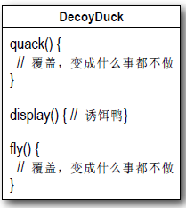
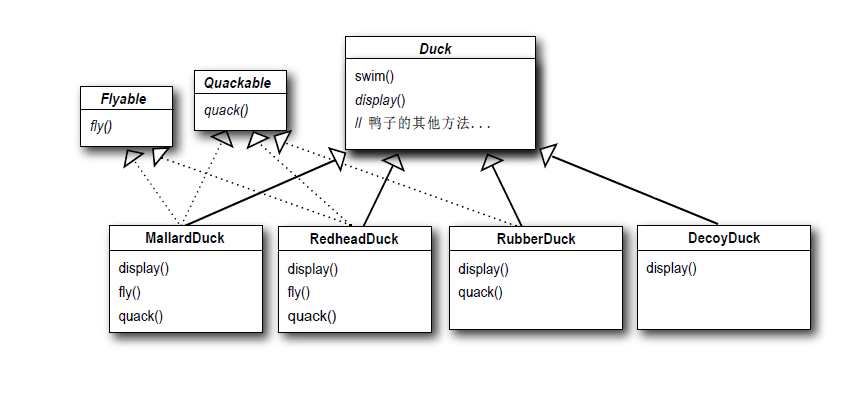
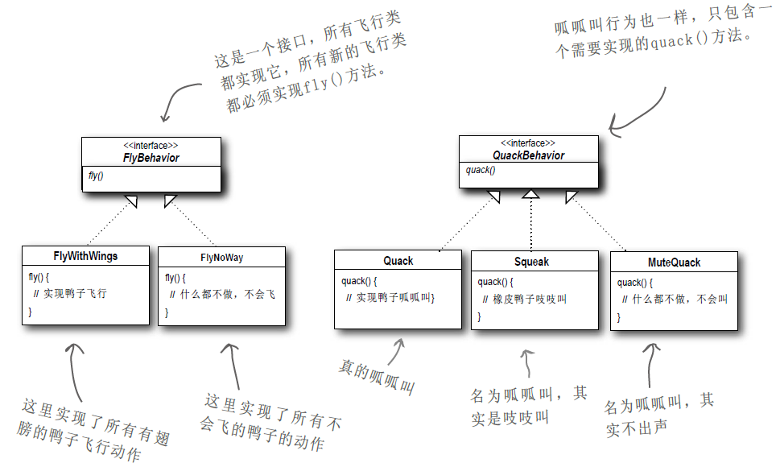
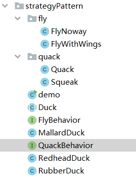
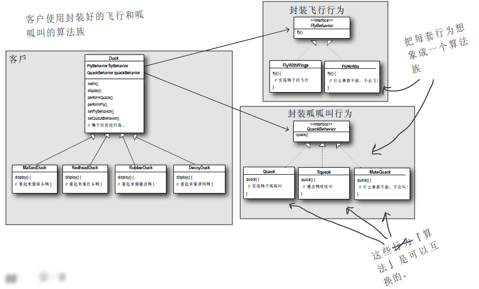

# 策略模式（Strategy Pattern）

## 1 先从简单的模拟鸭子应用做起

Joe上班的公司做了一套相当成功的模拟鸭子游戏：SimUDuck。游戏中出现各种鸭子， 一边游泳戏水， 一边呱呱叫。此系统
的内部设计使用了标准的OO技术， 设计了一个鸭子超类（Superclass），并让各种鸭子继承此超类。

~~~java
Duck类：
    public abstract class Duck {
    //所有的鸭子都会呱呱叫
    public void quack(){
        System.out.println("Quack quack quack quack quack...");
    }
    //也会游泳
    public void swim(){
        System.out.println("Swim swim swim swim swim...");
    }
    //因为每一种鸭子的外观都不同， 所以display()方法是抽象的。
    public abstract void display();
}

MallardDuck类：
    public class MallardDuck extends Duck {

    // 外观是绿头
    @Override
    public void display() {
        System.out.println("The head of a duck is green");
    }
}


~~~

现在我们得让鸭子能飞，主管认为， 此模拟程序需要会飞的鸭子， 将竞争者抛在后头。当然，在这个时候，Joe的经理拍胸脯告诉主管们，Joe只需要一个星期就可以搞定， 「毕竟， Joe是一个OO程序员. . .这有什么困难？」

方法：我只需要在Duck类中加上fly ( )方法，然后所有鸭子都会继承fly()。这是我大显身手，展示OO才华的时候了。

~~~java
Duck类改变：
public abstract class Duck {
    //所有的鸭子都会呱呱叫
    public void quack(){
        System.out.println("Quack quack quack quack quack...");
    }
    //也会游泳
    public void swim(){
        System.out.println("Swim swim swim swim swim...");
    }
    //因为每一种鸭子的外观都不同， 所以display()方法是抽象的。
    public abstract void display();
    
    //为了领导的要求添加飞行的功能
    public void fly(){
        System.out.println("Fly fly fly fly fly fly...");
    }
}
~~~

**但是，可怕的问题发生了 ...** 

Joe忽略了一件事：并非Duck所有的子类都会飞。当Joe在Duck超类中加上新的行为， 这会使得某些子类也具有这个不恰当的行为。现在可好了！SimUDuck程序中有一个会飞的非动物。对代码所做的局部修改， 影响层面可能不只局部（会飞的橡皮鸭）！

橡皮鸭子不会呱呱叫， 所以把quack() 的定义覆盖成「吱吱叫」（ squeak ） 。

~~~java
public class RubberDuck extends Duck{
    @Override
    public void display() {
        System.out.println("A rubber duck");
    }
    public void quack(){
        System.out.println("Squeak squeak squeak squeak squeak...");
    }
}
~~~

Joe想到继承，我可以把橡皮鸭类中的fly()方法覆盖掉， 就好像覆盖quack()的作法一样...

~~~java
public void fly(){}

测试：
    public class demo {
    public static void main(String[] args) {
        Duck duck = new RubberDuck();
        duck.display();
        duck.swim();
        duck.quack();
        duck.fly();
    }
}
结果：
    A rubber duck
	Swim swim swim swim swim...
	Squeak squeak squeak squeak squeak...

	Process finished with exit code 0
~~~

**问题又来了**，可是， 如果以后我加入诱饵鸭（DecoyDuck ） ， 又会如何？ 诱饵鸭是假鸭， 不会飞也不会叫. . .



**所以继承并非答案**

------

利用接口如何？
Joe认识到继承可能不是答案， 因为他刚刚拿到来自主管的备忘录， 希望以后每六个月更新产品（至于更新的方法，他们还没想到）。Joe知道规格会常常改变，每当有新的鸭子子类出现，他就要被迫检查并可能需要覆盖fly()和quark() . . . 这简直是无穷尽的恶梦。所以，他需要一个更清晰的方法，让「某些」（而不是全部）鸭子类型可飞或可叫。



你觉得这个设计如何？

经理：这真是一个超笨的主意，你没发现这么一来重复的代码会变多吗？如果你认为覆盖几个方法就算是差劲，那么对于48个Duck的子类都要稍微修改一下飞行的行为，你又怎么说？!

我们知道，并非「所有」的子类都具有飞行和呱呱叫的行为，所以继承并不是适当的解决方式。虽然Flyable与Quackable可以解决「一部分」的问题（不会再有会飞的橡皮鸭），但是却造成代码无法复用，这只能算是从一个恶梦跳进另一个恶梦。甚至，在会飞的鸭子中，飞行的动作可能还有多种变化. .

------

**把问题归零**

现在我们知道使用继承有一些缺失， 因为改变鸭子的行为会影响所有种类的鸭子，而这并不恰当。Flyable与Quackable接口一开始似乎还挺不错，解决了问题（ 只有会飞的鸭子才继承Flyable），但是Java的接口不具有实现代码，所以继承接口无法达到代码的复用。这意味着：无论何时你需要修改某个行为， 你必须得往下追踪并修改每一个定义此行为的类，一不小心，可能造成新的错误。

幸运地，有一个设计原则，正适用于此状况。**把会变化的部分取出并「封装」起来，好让其他部分不会受到影响**。

换句话说， 如果每次新的需求一来， 都会变化到某方面的代码， 那么你就可以确定， 这部分的代码需要被抽出来， 和其他闻风不动的代码有所区隔。下面是这个原则的另一个思考方式：**「把会变化的部分取出并封装起来，以便以后可以轻易地扩充此部分，而不影响不需要变化的其他部分」**。
这样的概念很简单，几乎是每个设计模式背后的精神所在。所有的模式都提供了一套方法让「系统中的某部分改变不会影响其他部分」。
好，该是把鸭子的行为从D u c k 类中取出的时候了！


### 1.1 设计鸭子的行为

从现在开始，鸭子的行为将被放在分开的类中，此类专门提供某行为的实现。**针对接口编程， 而不是针对实现编程。**

我们利用接口代表每个行为， 比方说， F l y B e h a v i o r 与Q u a c k B e h a v i o r，而行为的每个实现都必须实现这些接口之一。
所以这次鸭子类不会负责实现F l y i n g与Q u a c k i n g接口，反而是由其他类专门实现F l y B e h a v i o r与Q u a c k B e h a v i o r，这就称为「行为」类。由行为类实现行为接口，而不是由D u c k类实现行为接口。

这样的作法迥异于以往，以前的作法是：行为是继承D u c k超类的具体实现而来， 或是继承某个接口并由子类自行实现而来。这两种作法都是依赖于「实现」， 我们被实现绑得死死的， 没办法更改行为（除非写更多代码）。

在我们的新设计中， 鸭子的子类将使用接口（ F l y B e h a v i o r 与Q u a c k B e h a v i o r）所表示的行为，所以实际的「实现」不会被
绑死在鸭子的子类中。（ 换句话说， 特定的实现代码位于实现F l y B e h a v i o r与Q u a k c B e h a v i o r的特定类中）



这样的设计， 可以让飞行和呱呱叫的动作被其他的对象复用，因为这些行为已经与鸭子类无关了。而我们可以新增一些行为， 不会影响到既有的行为类， 也不会影响有「使用」到飞行行为的鸭子类。

------

**整合鸭子的行为**

①

首先， 在鸭子中「加入两个实例变量」， 分别为「FlyBehavior 」与「QuackBehavior 」， 声明为接口类型（ 而不是具体类实现类型） ， 每个变量会利用多态的方式在运行时引用正确的行为类型（ 例如： FlyWithWings 、Squeak . . .等）。

我们也必须将Duck类与其所有子类中的fly()与quack()移除，因为这些行为已经被搬移到FlyBehavior 与QuackBehavior 类中了。

我们用performQuack ( )和performFly ( )取代Duck类中的fly()与quack ()。稍后你就知道为什么。



~~~java
Duck类：
    public abstract class Duck {
    public QuackBehavior quackBehavior;
    public FlyBehavior flyBehavior;

    //也会游泳
    public void swim(){
        System.out.println("Swim swim swim swim swim...");
    }
    //因为每一种鸭子的外观都不同， 所以display()方法是抽象的。
    public abstract void display();

    public void performFly(){
        this.flyBehavior.fly();
    }

    public void performQuack(){
        this.quackBehavior.quack();
    }
}
FlyBehavior接口：
    public interface FlyBehavior {
    public void fly();
}
QuackBehavior接口：
    public interface QuackBehavior {
    public void quack();
}
FlyBehavior接口的实现类FlyNoway：
    public class FlyNoway implements FlyBehavior {
    @Override
    public void fly() {
        System.out.println("I can not fly");
    }
}
FlyBehavior接口的实现类FlyWithWings：
    public class FlyWithWings implements FlyBehavior {
    @Override
    public void fly() {
        System.out.println("Fly fly fly fly fly fly...");
    }
}
QuackBehavior接口的实现类Quack：
    public class Quack implements QuackBehavior {
    @Override
    public void quack() {
        System.out.println("Quack quack quack quack quack...");
    }
}
QuackBehavior接口的实现类Squeak：
    public class Squeak implements QuackBehavior {
    @Override
    public void quack() {
        System.out.println("Squeak squeak squeak squeak squeak...");
    }
}
~~~

②

现在，我们来实现performQuack()和performFly()，上述代码中已经展现

③

将实例对象引入各个鸭子

~~~java
MallardDuck：
    public class MallardDuck extends Duck {
    protected MallardDuck(){
        quackBehavior = new Quack();
        flyBehavior = new FlyWithWings();
    }

    // 外观是绿头
    @Override
    public void display() {
        System.out.println("The head of a duck is green");
    }
}
RubberDuck：
    public class RubberDuck extends Duck{

    public RubberDuck(){
        quackBehavior = new Squeak();
        flyBehavior = new FlyNoway();
    }

    @Override
    public void display() {
        System.out.println("A rubber duck");
    }
}
~~~

测试代码：

~~~java
public class demo {
    public static void main(String[] args) {
        RubberDuck rubberDuck = new RubberDuck();
        rubberDuck.performFly();
        rubberDuck.performQuack();
    }
}

结果：
  I can not fly
Squeak squeak squeak squeak squeak...

Process finished with exit code 0  
~~~

仍请注意， 虽然我们把行为设定成具体的类（通过实例化类似Q u a c k 或F l y W i t h W i n g s 的行为类， 并指定到行为引用变量中），但是还是可以在运行时『轻易地』改变该行为。所以，目前的作法还是很有弹性的，只是初始化实例变量的作法不够弹性罢了。但是想
一想，因为q u a c k B e h a v i o r 实例变量是一个接口类型，能够在运行时，透过多态的魔法动态地指定不同的Q u i c k B e h a v i o r 实现类给它。

------

### 1.2 动态设定行为

在鸭子里建立了一堆动态的功能没有用到，就太可惜了！假设我们想在鸭子子类透过设定方法设定鸭子的行为，而不是在鸭子的构造器内实例化。

①   在Duck类中，加入两个新方法：从此以后， 我们可以「随时」调用这两个方法改变鸭子的行为。

~~~java
public void setFlyBehavior(FlyBehavior fb) {
    flyBehavior = fb;
}
public void setQuackBehavior(QuackBehavior qb) {
    quackBehavior = qb;
}
~~~

②   制造一个新的鸭子类型：模型鸭（ModelDuck. java）

~~~java
public class ModelDuck extends Duck {
    public ModelDuck() {
        flyBehavior = new FlyNoway();
        quackBehavior = new Quack();
    }
    @Override
    public void display() {
        System.out.println("I am a model duck");
    }
}
~~~

③   建立一个新的FlyBehavior类型（FlyRocketPowered. java）

~~~java
public class FlyRocketPowered implements FlyBehavior {
    @Override
    public void fly() {
        System.out.println("I am flying with a rocket!");
    }
}
~~~

④测试

~~~java
public class demo {
    public static void main(String[] args) {
        ModelDuck modelDuck = new ModelDuck();
        modelDuck.performFly();
        modelDuck.setFlyBehavior(new FlyRocketPowered());
        modelDuck.performFly();
    }
}
结果：
    I can not fly
	I am flying with a rocket!

Process finished with exit code 0
~~~

第一次调用performFly()会被委托给flyBehavior对象（ 也就是FlyNoway对象） ， 该对象是在模型鸭构造器中设置的

这会调用继承来的setter方法，把火箭动力飞行的行为设定到模型鸭中。哇咧！ 模型鸭突然具有火箭动力飞行能力。

如果成功了， 就意味着模型鸭动态地改变行为。如果把行为的实现绑死在鸭子类中， 可就无法做到这样。


### 1.3 封装行为的大局观

下面是整个重新设计后的类结构，你所期望的一切都有：鸭子继承D u c k，飞行行为实现F l y B e h a v i o r接口，呱呱叫行为实现Q u a c k B e h a v i o r接口。也请注意， 我们描述事情的方式也稍有改变。不再把鸭子的行为说成「一组行为」， 我们开始把行为想成是「一族算法」。想想看， 在S i m U D u c k 的设计中，算法代表鸭子能做的事（不同的叫法和飞行法），这样的作法也能用于用一群类计算不同州的销售税金。请特别注意类之间的『关系』。拿一枝笔， 把下面图形中的每个箭头标上适当的关系，关系可以是I S - A（是一个）、H A S - A（有一个）、I M P L E M E N T S（实现）。




### 1.4 总结

**『有一个』可能比『是一个』更好**

『有一个』关系相当有趣： 每一鸭子都有一个F l y B e h a v i o r 且有一个Q u a c k B e h a v i o r，让鸭子将飞行和呱呱叫委托它们代为处理。当你将两个类结合起来使用，如同本例一般，这就是组合（c o m p o s i t i o n）。这种作法和『继承』不同的地方在于，鸭子的行为不是继承而来，而是和适当的行为对象『组合』而来。这是一个很重要的技巧。其实是使用了我们的第三个设计原则：**多用组合，少用继承**。
如你所见， 使用组合建立系统具有很大的弹性， 不仅可将算法族封装成类， 更可以『在运行时动态地改变行为』，只要组合的行为对象，符合正确的接口标准即可。组合用在『许多』设计模式中， 在本书中， 你也会看到它的诸多优点和缺点。

**策略模式**定义了算法族，分别封装起来，让它们之间可以互相替换， 此模式让算法的变化独立于使用算法的客户。

## 2 策略模式

**意图：**定义一系列的算法,把它们一个个封装起来, 并且使它们可相互替换。

**主要解决：**在有多种算法相似的情况下，使用 if...else 所带来的复杂和难以维护。

**何时使用：**一个系统有许多许多类，而区分它们的只是他们直接的行为。

**如何解决：**将这些算法封装成一个一个的类，任意地替换。

**关键代码：**实现同一个接口。

**应用实例：** 1、诸葛亮的锦囊妙计，每一个锦囊就是一个策略。 2、旅行的出游方式，选择骑自行车、坐汽车，每一种旅行方式都是一个策略。 3、JAVA AWT 中的 LayoutManager。

**优点：** 1、算法可以自由切换。 2、避免使用多重条件判断。 3、扩展性良好。

**缺点：** 1、策略类会增多。 2、所有策略类都需要对外暴露。

**使用场景：** 1、如果在一个系统里面有许多类，它们之间的区别仅在于它们的行为，那么使用策略模式可以动态地让一个对象在许多行为中选择一种行为。 2、一个系统需要动态地在几种算法中选择一种。 3、如果一个对象有很多的行为，如果不用恰当的模式，这些行为就只好使用多重的条件选择语句来实现。

**注意事项：**如果一个系统的策略多于四个，就需要考虑使用混合模式，解决策略类膨胀的问题。

## 3 JDK Arrays 源码分析

代码

```java
public class Strategy {

	public static void main(String[] args) {
		// TODO Auto-generated method stub
		// 数组
		Integer[] data = { 9, 1, 2, 8, 4, 3 };
		// 实现降序排序，返回-1放左边，1放右边，0保持不变

		// 说明
		// 1. 实现了 Comparator 接口（策略接口） , 匿名类 对象 new Comparator<Integer>(){..}
		// 2. 对象 new Comparator<Integer>(){..} 就是实现了 策略接口 的对象
		// 3. public int compare(Integer o1, Integer o2){} 指定具体的处理方式
		Comparator<Integer> comparator = new Comparator<Integer>() {
			public int compare(Integer o1, Integer o2) {
				if (o1 > o2) {
					return -1;
				} else {
					return 1;
				}
			};
		};
		
		// 说明
		/*
		 * public static <T> void sort(T[] a, Comparator<? super T> c) {
		        if (c == null) {
		            sort(a); //默认方法
		        } else { 
		            if (LegacyMergeSort.userRequested)
		                legacyMergeSort(a, c); //使用策略对象c
		            else
		            	// 使用策略对象c
		                TimSort.sort(a, 0, a.length, c, null, 0, 0);
		        }
		    }
		 */
		//方式1 
		Arrays.sort(data, comparator);

		System.out.println(Arrays.toString(data)); // 降序排序

		// 方式2- 同时lambda 表达式实现 策略模式
		Integer[] data2 = { 19, 11, 12, 18, 14, 13 };

		Arrays.sort(data2, (var1, var2) -> {
			if (var1.compareTo(var2) > 0) {
				return -1;
			} else {
				return 1;
			}
		});

		System.out.println("data2=" + Arrays.toString(data2));

	}

}
```

------

总结

`Comparator` 为策略接口(算法的提供者)，其实现对象指明了具体算法的行为，`Arrays` 为算法的使用者，通过组合(聚合)不同的算法提供者，实现不同的算法行为

## 4 策略模式的注意事项和细节

1. 策略模式的关键是： 分析项目中变化部分与不变部分
2. 策略模式的核心思想是：多用组合(聚合)，少用继承；用行为类组合，而不是行为的继承，这样更有弹性
3. 体现了“对修改关闭，对扩展开放”原则，客户端增加行为不用修改原有代码，只要添加一种策略（或者行为）即可， 避免了使用多重判断语句（`if..else if..else`）
4. 提供了可以替换继承关系的办法： 策略模式将算法封装在独立的`Strategy`类中使得你可以独立于其`Context`改变它，使它易于切换、易于理解、易于扩展
5. 需要注意的是：每添加一个策略就要增加一个类，当策略过多时，会导致类数目庞大