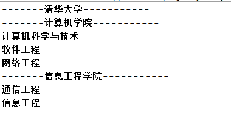
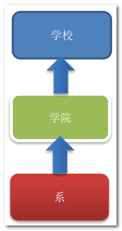
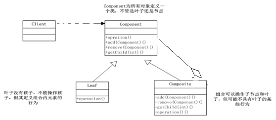
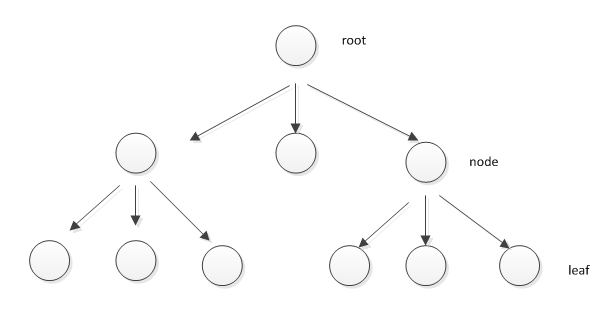
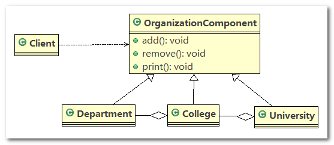
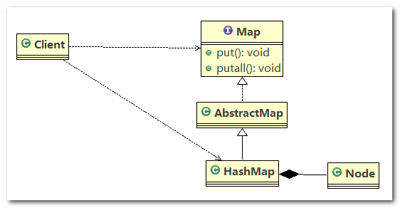

# 组合模式（Composite Pattern）

## 1、学校院系展示需求

> **看一个学校院系展示需求**

编写程序展示一个学校院系结构：需求是这样，要在一个页面中展示出学校的院系组成，一个学校有多个学院，一个学院有多个系。 如图：



## 2、传统方案解决学校院系展示

传统方案解决学校院系展示(类图)



------

> **传统方案解决学校院系展示存在的问题分析**

1. 将学院看做是学校的子类，系是学院的子类，这样实际上是站在组织大小来进行分层次的
2. 实际上我们的要求是 ：在一个页面中展示出学校的院系组成，一个学校有多个学院，一个学院有多个系， 因此继承这种方案，不能很好实现的管理的操作，比如对学院、系的添加，删除，遍历等
3. 解决方案：把学校、院、系都看做是组织结构，他们之间没有继承的关系，而是一个树形结构，可以更好的实现管理操作 --> 组合模式

## 3、组合模式基本介绍

1. 组合模式（`Composite Pattern`），又叫部分整体模式，它创建了对象组的树形结构，将对象组合成树状结构以表示“整体-部分”的层次关系。
2. 组合模式依据树形结构来组合对象，用来表示部分以及整体层次。
3. 这种类型的设计模式属于结构型模式。
4. 组合模式使得用户对单个对象和组合对象的访问具有一致性， 即：组合能让客户以一致的方式处理个别对象以及组合对象

## 4、组合模式的原理类图

1. `Component`：这是组合模式中对象声明接口，在适当情况下，实现所有类共有的接口默认行为，用于访问和管理 `Component` 子部件，`Component` 可以是抽象类或者接口
2. `Leaf`：在组合模式中表示叶子节点（没有子节点）
3. `Composite`：在组合模式中表示非叶子节点，用于存储子部件，继承（或实现） `Component`，实现子部件的相关操作，比如添加、删除操作等，相当于其下一层 `Component` 子部件的管理者



## 5、组合模式解决的问题

组合模式解决这样的问题，当我们的要处理的对象可以生成一颗树形结构，而我们要对树上的节点和叶子进行操作时，它能够提供一致的方式，而不用考虑它是节点还是叶子


## 6、组合模式解决学校院系展示

应用实例要求

编写程序展示一个学校院系结构：需求是这样，要在一个页面中展示出学校的院系组成，一个学校有多个学院，一个学院有多个系

------

类图



------

代码实现

1. `OrganizationComponent`：组合模式中对象方法定义的接口

   ```java
   public abstract class OrganizationComponent {
   
   	private String name; // 名字
   	private String des; // 说明
   
   	protected void add(OrganizationComponent organizationComponent) {
   		// 默认实现，叶子节点无需添加此方法
   		throw new UnsupportedOperationException();
   	}
   
   	protected void remove(OrganizationComponent organizationComponent) {
   		// 默认实现，叶子节点无需添加此方法
   		throw new UnsupportedOperationException();
   	}
   
   	// 方法print, 做成抽象的, 子类都需要实现
   	protected abstract void print();
   
   	// 构造器
   	public OrganizationComponent(String name, String des) {
   		super();
   		this.name = name;
   		this.des = des;
   	}
   
   	public String getName() {
   		return name;
   	}
   
   	public void setName(String name) {
   		this.name = name;
   	}
   
   	public String getDes() {
   		return des;
   	}
   
   	public void setDes(String des) {
   		this.des = des;
   	}
   
   }
   ```

2. `University`：表示大学节点，其子节点为 `College` 节点

   ```java
   //University 就是 Composite , 可以管理College
   public class University extends OrganizationComponent {
   
   	// List 中 存放的College
   	List<OrganizationComponent> organizationComponents = new ArrayList<OrganizationComponent>();
   
   	// 构造器
   	public University(String name, String des) {
   		super(name, des);
   	}
   
   	// 重写add
   	@Override
   	protected void add(OrganizationComponent organizationComponent) {
   		organizationComponents.add(organizationComponent);
   	}
   
   	// 重写remove
   	@Override
   	protected void remove(OrganizationComponent organizationComponent) {
   		organizationComponents.remove(organizationComponent);
   	}
   
   	// print方法，就是输出University 包含的学院
   	@Override
   	protected void print() {
   		System.out.println("--------------" + getName() + "--------------");
   		// 遍历 organizationComponents
   		for (OrganizationComponent organizationComponent : organizationComponents) {
   			organizationComponent.print();
   		}
   	}
   
   	@Override
   	public String getName() {
   		return super.getName();
   	}
   
   	@Override
   	public String getDes() {
   		return super.getDes();
   	}
   
   }
   ```

3. `College`：表示学院节点，其子节点为 `Department` 节点

   ```java
   public class College extends OrganizationComponent {
   
   	// List 中 存放的Department
   	List<OrganizationComponent> organizationComponents = new ArrayList<OrganizationComponent>();
   
   	// 构造器
   	public College(String name, String des) {
   		super(name, des);
   	}
   
   	// 重写add
   	@Override
   	protected void add(OrganizationComponent organizationComponent) {
   		// 将来实际业务中，Colleage 的 add 和 University add 不一定完全一样
   		organizationComponents.add(organizationComponent);
   	}
   
   	// 重写remove
   	@Override
   	protected void remove(OrganizationComponent organizationComponent) {
   		organizationComponents.remove(organizationComponent);
   	}
   
   	// print方法，就是输出学院包含的系
   	@Override
   	protected void print() {
   		System.out.println("--------------" + getName() + "--------------");
   		// 遍历 organizationComponents
   		for (OrganizationComponent organizationComponent : organizationComponents) {
   			organizationComponent.print();
   		}
   	}
   
   	@Override
   	public String getName() {
   		return super.getName();
   	}
   
   	@Override
   	public String getDes() {
   		return super.getDes();
   	}
   
   }
   ```

4. `Department`：表示专业节点，该节点为叶子节点

   ```java
   public class Department extends OrganizationComponent {
   
   	// 没有集合
   
   	public Department(String name, String des) {
   		super(name, des);
   	}
   
   	// add , remove 就不用写了，因为他是叶子节点
   
   	@Override
   	protected void print() {
            // 输出系名
   		System.out.println(getName());
   	}
   
   	@Override
   	public String getName() {
   		return super.getName();
   	}
   
   	@Override
   	public String getDes() {
   		return super.getDes();
   	}
   
   }
   ```

5. `Client`：表示客户端，测试代码

   ```java
   public class Client {
   
   	public static void main(String[] args) {
   
   		// 从大到小创建对象 学校
   		OrganizationComponent university = new University("清华大学", " 中国顶级大学 ");
   
   		// 创建 学院
   		OrganizationComponent computerCollege = new College("计算机学院", " 计算机学院 ");
   		OrganizationComponent infoEngineercollege = new College("信息工程学院", " 信息工程学院 ");
   
   		// 创建各个学院下面的系(专业)
   		computerCollege.add(new Department("软件工程", " 软件工程不错 "));
   		computerCollege.add(new Department("网络工程", " 网络工程不错 "));
   		computerCollege.add(new Department("计算机科学与技术", " 计算机科学与技术是老牌的专业 "));
   		infoEngineercollege.add(new Department("通信工程", " 通信工程不好学 "));
   		infoEngineercollege.add(new Department("信息工程", " 信息工程好学 "));
   
   		// 将学院加入到 学校
   		university.add(computerCollege);
   		university.add(infoEngineercollege);
   
   		university.print();
   		// infoEngineercollege.print();
   	}
   
   }
   ```

6. 程序运行结果

   ```
   --------------清华大学--------------
   --------------计算机学院--------------
   软件工程
   网络工程
   计算机科学与技术
   --------------信息工程学院--------------
   通信工程
   信息工程
   12345678
   ```

## 7、JDK HashMap 组合模式

> **Java 的集合类：HashMap 就使用了组合模式**

`HashMap` 测试代码

```java
public class Composite {

	public static void main(String[] args) {

		// 说明
		// 1. Map 就是一个抽象的构建 (类似我们的Component)
		// 2. HashMap是一个中间的构建(Composite), 实现/继承了相关方法
		// put, putall
		// 3. Node 是 HashMap的静态内部类，类似Leaf叶子节点, 这里就没有put, putall
		// static class Node<K,V> implements Map.Entry<K,V>

		Map<Integer, String> hashMap = new HashMap<Integer, String>();
		hashMap.put(0, "东游记");// 直接存放叶子节点(Node)

		Map<Integer, String> map = new HashMap<Integer, String>();
		map.put(1, "西游记");
		map.put(2, "红楼梦"); // ..
		hashMap.putAll(map);
		System.out.println(hashMap);

	}

}
```

------

源码追踪

1. `Map<K,V>` 接口：相当于组合模式中的 `Component` 组件，用于规定管理子部件的行为

   ```java
   public interface Map<K,V> {
       // ...
       
       V put(K key, V value);
       void putAll(Map<? extends K, ? extends V> m);
       
       // ...
   ```

2. `AbstractMap<K,V>` 抽象类实现了 `Map<K,V>` 接口：也相当于组合模式中的 `Component` 组件，只不过默认实现了一些公用方法

   ```java
   public abstract class AbstractMap<K,V> implements Map<K,V> {
       
       // ...
       
       public V put(K key, V value) {
           throw new UnsupportedOperationException();
       }
       
       public void putAll(Map<? extends K, ? extends V> m) {
           for (Map.Entry<? extends K, ? extends V> e : m.entrySet())
               put(e.getKey(), e.getValue());
       }
       
   	// ...
   ```

3. `HashMap<K,V>` 继承了 `AbstractMap<K,V>` 抽象类，并实现了 `Map<K,V>` 接口，相当于组合模式中的 `Composite` 组件，即非叶子节点

   ```java
   public class HashMap<K,V> extends AbstractMap<K,V>
       implements Map<K,V>, Cloneable, Serializable {
       
       // ...
       
       public V put(K key, V value) {
           return putVal(hash(key), key, value, false, true);
       }
       
       public void putAll(Map<? extends K, ? extends V> m) {
           putMapEntries(m, true);
       }
       
       // ...
   ```

4. `Node<K,V>` 为 `HashMap<K,V>` 的静态内部类，实现了 `Map.Entry<K,V>` 接口，相当于组合模式中的叶子节点，只定义了一些获取值的方法，并没有添加值（子节点）的方法

   ```java
   static class Node<K,V> implements Map.Entry<K,V> {
   
       // ...
   
       public final K getKey()        { return key; }
       public final V getValue()      { return value; }
       public final String toString() { return key + "=" + value; }
   
       public final int hashCode() {
           return Objects.hashCode(key) ^ Objects.hashCode(value);
       }
   
       public final V setValue(V newValue) {
           V oldValue = value;
           value = newValue;
           return oldValue;
       }
   
       // ...
   ```

------

类图



## 8、组合模式的注意事项

> **组合模式的注意事项和细节**

1. 简化客户端操作。 客户端只需要面对一致的对象而不用考虑整体部分或者节点叶子的问题
2. 具有较强的扩展性。 当我们要更改组合对象时， 我们只需要调整内部的层次关系， 客户端不用做出任何改动
3. 方便创建出复杂的层次结构。 客户端不用理会组合里面的组成细节， 容易添加节点或者叶子从而创建出复杂的树形结构
4. 需要遍历组织机构， 或者处理的对象具有树形结构时, 非常适合使用组合模式
5. 要求较高的抽象性， 如果节点和叶子有很多差异性的话， 比如很多方法和属性都不一样， 不适合使用组合模式