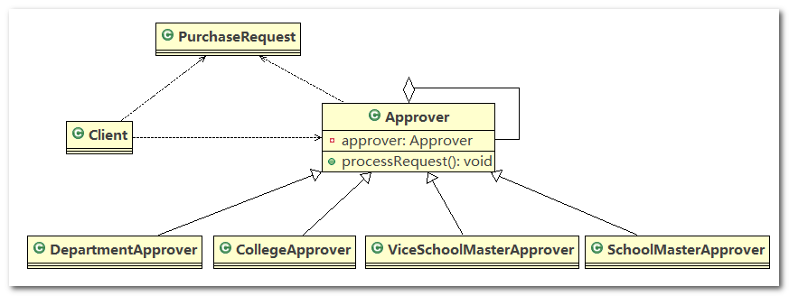

# 职责链模式

## 1、OA 系统采购审批需求

学校 OA 系统的采购审批项目： 需求是采购员采购教学器材

1. 如果金额 小于等于 `5000`，由教学主任审批 (`0<=x<=5000`)
2. 如果金额 小于等于 `10000`, 由院长审批 (`5000<x<=10000`)
3. 如果金额 小于等于 `30000`，由副校长审批 (`10000<x<=30000`)
4. 如果金额 超过 `30000` 以上，由校长审批 ( `30000<x`)

请设计程序完成采购审批项目

## 2、传统方案解决 OA 系统审批

> **类图**

传统方式是： 接收到一个采购请求后， 根据采购金额来调用对应的 `Approver` (审批人)完成审批。


> **传统方案解决 OA 系统审批问题分析**

1. 传统方式的问题分析 : 客户端这里会使用到 分支判断(比如`switch`) 来对不同的采购请求处理， 这样就存在如下问题
   1. 如果各个级别的人员审批金额发生变化， 在客户端的也需要变化
   2. 客户端必须明确的知道有多少个审批级别和访问
2. 这样 对一个采购请求进行处理和 `Approver` (审批人) 就存在强耦合关系， 不利于代码的扩展和维护
3. 解决方案 ==> 职责链模式

## 3、职责链模式基本介绍

1. 职责链模式(`Chain of Responsibility Pattern`)，又叫责任链模式， 为请求创建了一个接收者对象的链。这种模式对请求的发送者和接收者进行解耦
2. 职责链模式通常每个接收者都包含对另一个接收者的引用。如果一个对象不能处理该请求， 那么它会把相同的请求传给下一个接收者，依此类推
3. 责任链模式使多个对象都有机会处理请求，从而避免请求的发送者和接收者之间的耦合关
   系。将这个对象连成一条链，并沿着这条链传递该请求，直到有一个对象处理它为止
4. 这种类型的设计模式属于行为型模式


## 4、职责链模式的原理类图

1. `Handler`：抽象的处理者，定义了一个处理请求的接口，同时该类中聚合了另外一个 `Handler` 对象
2. `ConcreteHandlerA` 、`ConcreteHandlerB` 是具体的处理者，处理它自己负责的请求， 可以访问它的后继者(即下一个处理者)，如果可以处理当前请求， 则处理， 否则就将该请求交个后继者去处理， 从而形成一个职责链
3. `Request` ：含义很多属性， 表示一个请求


## 5、职责链模式解决 OA 系统审批

应用实例要求：编写程序完成学校 `OA` 系统的采购审批项目，采购员采购教学器材的需求如下

1. 如果金额 小于等于 `5000`，由教学主任审批
2. 如果金额 小于等于 `10000`，由院长审批
3. 如果金额 小于等于 `30000`，由副校长审批
4. 如果金额 超过 `30000` 以上，有校长审批

------

类图



------

代码实现

1. `PurchaseRequest`：实体类，表示购买请求

   ```java
   //请求类
   public class PurchaseRequest {
   
   	private int type = 0; // 请求类型
   	private float price = 0.0f; // 请求金额
   	private int id = 0;
   
   	// 构造器
   	public PurchaseRequest(int type, float price, int id) {
   		this.type = type;
   		this.price = price;
   		this.id = id;
   	}
   
   	public int getType() {
   		return type;
   	}
   
   	public float getPrice() {
   		return price;
   	}
   
   	public int getId() {
   		return id;
   	}
   
   }
   ```

2. `Approver`：审批者的抽象父类，里面聚合了一个 `Approver` 对象，构成一条责任链

   ```java
   public abstract class Approver {
   
   	Approver approver; // 下一个处理者
   	String name; // 名字
   
   	public Approver(String name) {
   		this.name = name;
   	}
   
   	// 下一个处理者
   	public void setApprover(Approver approver) {
   		this.approver = approver;
   	}
   
   	// 处理审批请求的方法，得到一个请求, 处理是子类完成，因此该方法做成抽象
   	public abstract void processRequest(PurchaseRequest purchaseRequest);
   
   }
   ```

3. `DepartmentApprover`：系主任(具体的处理着)

   ```java
   public class DepartmentApprover extends Approver {
   
   	public DepartmentApprover(String name) {
   		super(name);
   	}
   
   	@Override
   	public void processRequest(PurchaseRequest purchaseRequest) {
   		if (purchaseRequest.getPrice() <= 5000) {
   			System.out.println(" 请求编号 id= " + purchaseRequest.getId() + " 被 " + this.name + " 处理");
   		} else {
   			approver.processRequest(purchaseRequest);
   		}
   	}
   
   }
   ```

4. `CollegeApprover`：院长(具体的处理着)

   ```java
   public class CollegeApprover extends Approver {
   
   	public CollegeApprover(String name) {
   		super(name);
   	}
   
   	@Override
   	public void processRequest(PurchaseRequest purchaseRequest) {
   		if (purchaseRequest.getPrice() < 5000 && purchaseRequest.getPrice() <= 10000) {
   			System.out.println(" 请求编号 id= " + purchaseRequest.getId() + " 被 " + this.name + " 处理");
   		} else {
   			approver.processRequest(purchaseRequest);
   		}
   	}
   }
   ```

5. `ViceSchoolMasterApprover`：副校长(具体的处理着)

   ```java
   public class ViceSchoolMasterApprover extends Approver {
   
   	public ViceSchoolMasterApprover(String name) {
   		super(name);
   	}
   
   	@Override
   	public void processRequest(PurchaseRequest purchaseRequest) {
   		if (purchaseRequest.getPrice() < 10000 && purchaseRequest.getPrice() <= 30000) {
   			System.out.println(" 请求编号 id= " + purchaseRequest.getId() + " 被 " + this.name + " 处理");
   		} else {
   			approver.processRequest(purchaseRequest);
   		}
   	}
   }
   ```

6. `SchoolMasterApprover`：校长(具体的处理着)

   ```java
   public class SchoolMasterApprover extends Approver {
   
   	public SchoolMasterApprover(String name) {
   		super(name);
   	}
   
   	@Override
   	public void processRequest(PurchaseRequest purchaseRequest) {
   		if (purchaseRequest.getPrice() > 30000) {
   			System.out.println(" 请求编号 id= " + purchaseRequest.getId() + " 被 " + this.name + " 处理");
   		} else {
   			approver.processRequest(purchaseRequest);
   		}
   	}
   }
   ```

7. `Client`：测试代码

   ```java
   public class Client {
   
   	public static void main(String[] args) {
   		// 创建一个请求
   		PurchaseRequest purchaseRequest = new PurchaseRequest(1, 31000, 1);
   
   		// 创建相关的审批人
   		DepartmentApprover departmentApprover = new DepartmentApprover("张主任");
   		CollegeApprover collegeApprover = new CollegeApprover("李院长");
   		ViceSchoolMasterApprover viceSchoolMasterApprover = new ViceSchoolMasterApprover("王副校");
   		SchoolMasterApprover schoolMasterApprover = new SchoolMasterApprover("佟校长");
   
   		// 需要将各个审批级别的下一个设置好 (处理人构成环形: )
   		departmentApprover.setApprover(collegeApprover);
   		collegeApprover.setApprover(viceSchoolMasterApprover);
   		viceSchoolMasterApprover.setApprover(schoolMasterApprover);
   		schoolMasterApprover.setApprover(departmentApprover);
   
   		departmentApprover.processRequest(purchaseRequest);
   		viceSchoolMasterApprover.processRequest(purchaseRequest);
   	}
   
   }
   ```

## 6、HandlerExecutionChain

> **SpringMVC 请求流程分析**


> **源码追踪**

1. 在 `DispatcherServlet` 类的 `doDispatch()` 方法中，关注如下几点：

   1. `HandlerExecutionChain mappedHandler = null;`：表示 `Handler` 执行链
   2. `mappedHandler = getHandler(processedRequest);`：通过请求参数(`processedRequest`)初始化 `mappedHandler`
   3. `mappedHandler.applyPreHandle(processedRequest, response)`：执行 `applyPreHandle()` 方法
   4. `mappedHandler.applyPostHandle(processedRequest, response, mv);`：执行 `applyPostHandle()` 方法

   ```java
   protected void doDispatch(HttpServletRequest request, HttpServletResponse response) throws Exception {
   	HttpServletRequest processedRequest = request;
   	HandlerExecutionChain mappedHandler = null;
   	boolean multipartRequestParsed = false;
   
   	WebAsyncManager asyncManager = WebAsyncUtils.getAsyncManager(request);
   
   	try {
   		ModelAndView mv = null;
   		Exception dispatchException = null;
   
   		try {
   			processedRequest = checkMultipart(request);
   			multipartRequestParsed = processedRequest != request;
   
   			// Determine handler for the current request.
   			mappedHandler = getHandler(processedRequest);
   			if (mappedHandler == null || mappedHandler.getHandler() == null) {
   				noHandlerFound(processedRequest, response);
   				return;
   			}
   
   			// Determine handler adapter for the current request.
   			HandlerAdapter ha = getHandlerAdapter(mappedHandler.getHandler());
   
   			// Process last-modified header, if supported by the handler.
   			String method = request.getMethod();
   			boolean isGet = "GET".equals(method);
   			if (isGet || "HEAD".equals(method)) {
   				long lastModified = ha.getLastModified(request, mappedHandler.getHandler());
   				if (logger.isDebugEnabled()) {
   					String requestUri = urlPathHelper.getRequestUri(request);
   					logger.debug("Last-Modified value for [" + requestUri + "] is: " + lastModified);
   				}
   				if (new ServletWebRequest(request, response).checkNotModified(lastModified) && isGet) {
   					return;
   				}
   			}
   
   			if (!mappedHandler.applyPreHandle(processedRequest, response)) {
   				return;
   			}
   
   			try {
   				// Actually invoke the handler.
   				mv = ha.handle(processedRequest, response, mappedHandler.getHandler());
   			}
   			finally {
   				if (asyncManager.isConcurrentHandlingStarted()) {
   					return;
   				}
   			}
   
   			applyDefaultViewName(request, mv);
   			mappedHandler.applyPostHandle(processedRequest, response, mv);
   		}
   		catch (Exception ex) {
   			dispatchException = ex;
   		}
   		processDispatchResult(processedRequest, response, mappedHandler, mv, dispatchException);
   	}
   	catch (Exception ex) {
   		triggerAfterCompletion(processedRequest, response, mappedHandler, ex);
   	}
   	catch (Error err) {
   		triggerAfterCompletionWithError(processedRequest, response, mappedHandler, err);
   	}
   	finally {
   		if (asyncManager.isConcurrentHandlingStarted()) {
   			// Instead of postHandle and afterCompletion
   			mappedHandler.applyAfterConcurrentHandlingStarted(processedRequest, response);
   			return;
   		}
   		// Clean up any resources used by a multipart request.
   		if (multipartRequestParsed) {
   			cleanupMultipart(processedRequest);
   		}
   	}
   }
   ```

2. `mappedHandler.applyPreHandle(processedRequest, response)` 方法中获取到拦截器(`getInterceptors`)，并调用拦截器的 `preHandle()` 方法完成前置拦截

   ```java
   boolean applyPreHandle(HttpServletRequest request, HttpServletResponse response) throws Exception {
       if (getInterceptors() != null) {
           for (int i = 0; i < getInterceptors().length; i++) {
               HandlerInterceptor interceptor = getInterceptors()[i];
               if (!interceptor.preHandle(request, response, this.handler)) {
                   triggerAfterCompletion(request, response, null);
                   return false;
               }
               this.interceptorIndex = i;
           }
       }
       return true;
   }
   
   public HandlerInterceptor[] getInterceptors() {
       if (this.interceptors == null && this.interceptorList != null) {
           this.interceptors = this.interceptorList.toArray(new HandlerInterceptor[this.interceptorList.size()]);
       }
       return this.interceptors;
   }
   ```

3. `mappedHandler.applyPostHandle(processedRequest, response, mv);`方法中同样也是调用拦截器的 `postHandle()` 方法完成后置拦截

   ```java
   void applyPostHandle(HttpServletRequest request, HttpServletResponse response, ModelAndView mv) throws Exception {
   	if (getInterceptors() == null) {
   		return;
   	}
   	for (int i = getInterceptors().length - 1; i >= 0; i--) {
   		HandlerInterceptor interceptor = getInterceptors()[i];
   		interceptor.postHandle(request, response, this.handler, mv);
   	}
   }
   ```

4. `triggerAfterCompletion()` 在 `applyPreHandle()` 中被调用，同样也是通过调用拦截器的 `afterCompletion()` 方法

   ```java
   void triggerAfterCompletion(HttpServletRequest request, HttpServletResponse response, Exception ex)
   		throws Exception {
   
   	if (getInterceptors() == null) {
   		return;
   	}
   	for (int i = this.interceptorIndex; i >= 0; i--) {
   		HandlerInterceptor interceptor = getInterceptors()[i];
   		try {
   			interceptor.afterCompletion(request, response, this.handler, ex);
   		}
   		catch (Throwable ex2) {
   			logger.error("HandlerInterceptor.afterCompletion threw exception", ex2);
   		}
   	}
   }
   ```

> **源码总结**

1. `SpringMVC` 请求的流程图中，执行了拦截器相关方法：`interceptor.preHandler()` 、`interceptor.preHandler()` 等等
2. 在处理`SpringMvc`请求时，使用到职责链模式，还使用到适配器模式
3. `HandlerExecutionChain` 主要负责的是请求拦截器的执行和请求处理，但是他本身不处理请求，只是将请求分配给链上注册处理器执行， 这是职责链实现方式，减少职责链本身与处理逻辑之间的耦合，规范了处理流程
4. `HandlerExecutionChain` 维护了 `HandlerInterceptor` 的集合， 可以向其中注册相应的拦截器

## 7、职责链模式的注意事项和细节

1. 将请求和处理分开，实现解耦，提高系统的灵活性
2. 简化了对象，使对象不需要知道链的结构
3. 性能会受到影响，特别是在链比较长的时候，因此需控制链中最大节点数量，一般通过在`Handler`中设置一个最大节点数量，在`setNext()`方法中判断是否已经超过阀值，超过则不允许该链建立，避免出现超长链将会无意识地破坏系统性能
4. 调试不方便。采用了类似递归的方式，调试时逻辑可能比较复杂
5. 最佳应用场景： 有多个对象可以处理同一个请求时，比如：多级请求、请假、加薪等审批流程、 `Java Web`中`Tomcat`对`Encoding`的处理、拦截器