# 装饰者模式（Decorator Pattern）

本章可以称为“给爱用继承的人一个全新的设计眼界” 。我们即将再度探讨典型的继承滥用问题。你将在本章学到如何使用对象组合的方式，做到在运行时装饰类。为什么呢？一旦你熟悉了装饰的技巧，你将能够在不修改任何底层代码的情况下,给你的（或别人的）对象赋
予新的职责。

## 1 星巴兹的故事

星巴兹（Starbuzz）是以扩张速度最快而闻名的咖啡连锁店。如果你在街角看到它的店，在对面街上肯定还会看到另一家。因为扩张速度实在太快了，他们准备更新订单系统，以合乎他们的饮料供应要求。他们原先的类设计是这样的……

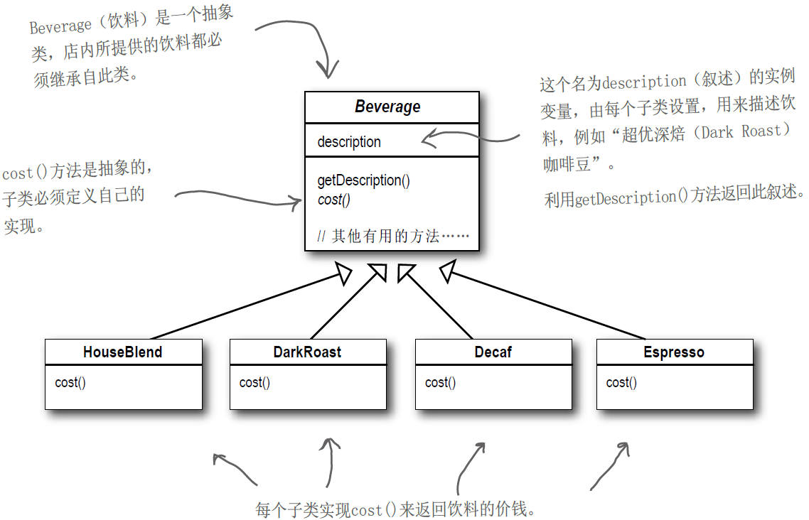

购买咖啡时，也可以要求在其中加入各种调料，例如：蒸奶（Steamed Milk）、豆浆（Soy）、摩卡（Mocha，也就是巧克力风味）或覆盖奶泡。星巴兹会根据所加入的调料收取不同的费用。所以订单系统必须考虑到这些调料部分。这是他们的第一个尝试……

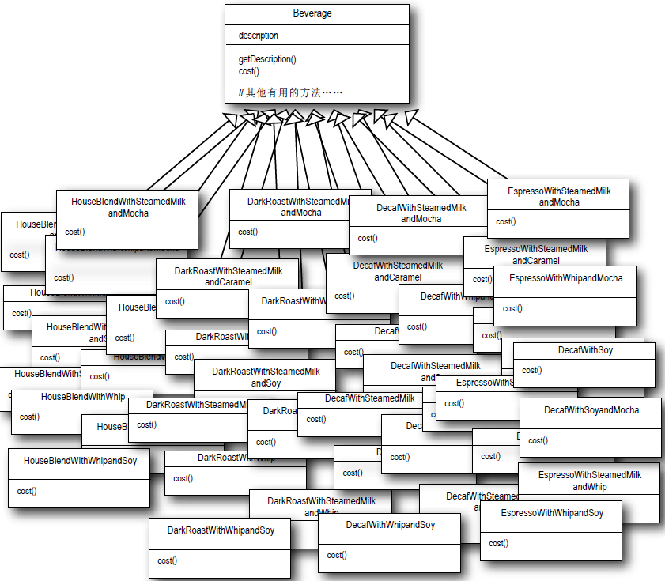

很明显，星巴兹为自己制造了一个维护恶梦。如果牛奶的价钱上扬，怎么办？新增一种焦糖调料风味时，怎么办？

**修改**

利用实例变量和继承，就可以追踪这些调料呀！

先从Beverage基类下手，加上实例变量代表是否加上调料（牛奶、豆浆、摩卡、奶泡……）

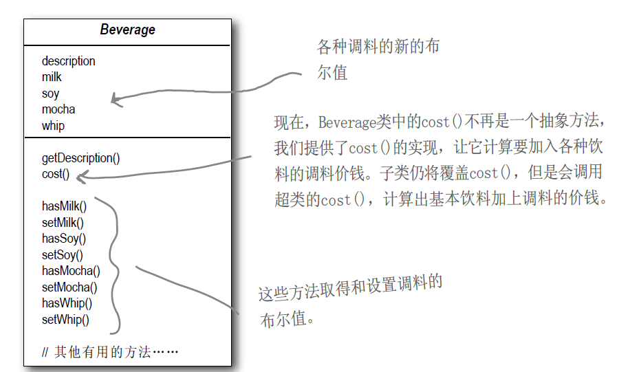

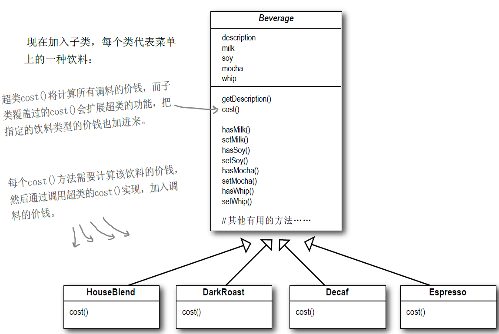

**当哪些需求或因素改变时会影响这个设计**

- 调料价钱的改变会使我们更改现有代码。
- 一旦出现新的调料，我们就需要加上新的方法，并改变超类中的cost()方法。
- 以后可能会开发出新饮料。对这些饮料而言（例如：冰茶），某些调料可能并不适合，但是在这个设计方式中，Tea（茶）子类仍将继承那些不适合的方法，例如：hasWhip()（加奶泡）。
- 万一顾客想要双倍摩卡咖啡，怎么办？

## 2 认识装饰者模式

好了，我们已经了解利用继承无法完全解决问题，在星巴兹遇到的问题有：类数量爆炸、设计死板，以及基类加入的新功能并不适用于所有的子类。

所以，在这里要采用不一样的做法：我们要以饮料为主体，然后在运行时以调料来“装饰”（decorate）饮料。比方说，如果顾客想要摩卡和奶泡深焙咖啡，那么，要做的是：

- 拿一个深焙咖啡（DarkRoast）对象
- 以摩卡（Mocha）对象装饰它
- 以奶泡（Whip）对象装饰它
- 调用cost()方法，并依赖委托（delegate）将调料的价钱加上去

## 3 以装饰者构造饮料订单

**以DarkRoast对象开始**

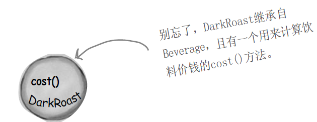

顾客想要摩卡（Mocha），所以建立一个Mocha对象，并用它将DarkRoast对象包（wrap）起来。

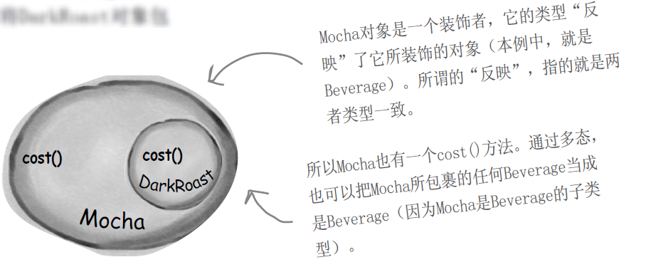

顾客也想要奶泡（Whip），所以需要建立一个Whip装饰者，并用它将Mocha对象包起来。别忘了，DarkRoast继承自Beverage，且有一个cost()方法，用来计算饮料价钱。

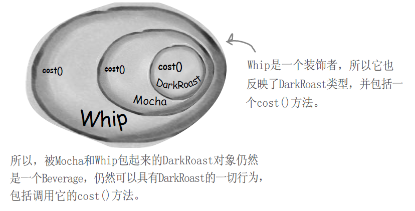

现在，该是为顾客算钱的时候了。通过调用最外圈装饰者（Whip）的cost()就可以办得到。Whip的cost()会先委托它装饰的对象（也就是Mocha）计算出价钱，然后再加上奶泡的价钱

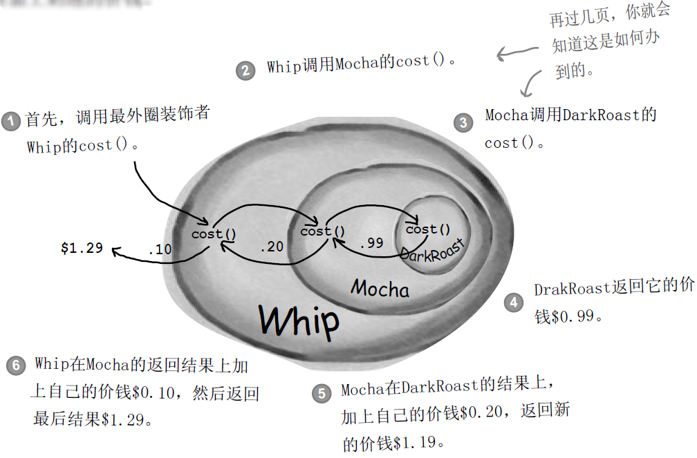

**总结**

- 装饰者和被装饰对象有相同的超类型。
- 你可以用一个或多个装饰者包装一个对象。
- 既然装饰者和被装饰对象有相同的超类型，所以在任何需要原始对象（被包装的）的场合，可以用装饰过的对象代替它。
- 装饰者可以在所委托被装饰者的行为之前与/或之后，加上自己的行为，以达到特定的目的。
- 对象可以在任何时候被装饰，所以可以在运行时动态地、不限量地用你喜欢的装饰者来装饰对象。

## 4 定义装饰者模式

装饰者模式动态地将责任附加到对象上。若要扩展功能，装饰者提供了比继承更有弹性的替代方案。

虽然这说明了装饰者模式的“角色”，但是没说明怎么在我们的实现中实际“应用”它。我们来看看类图，会有些帮助（下一页，我们会将此结构套用在饮料问题上）。

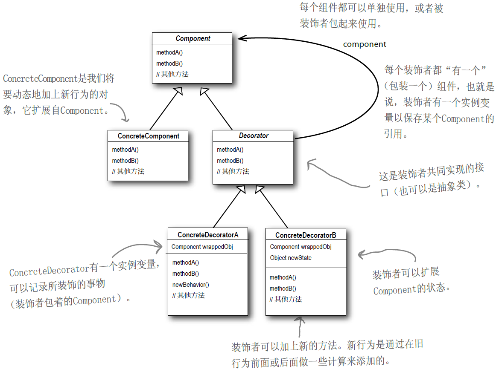

## 5 装饰我们的饮料

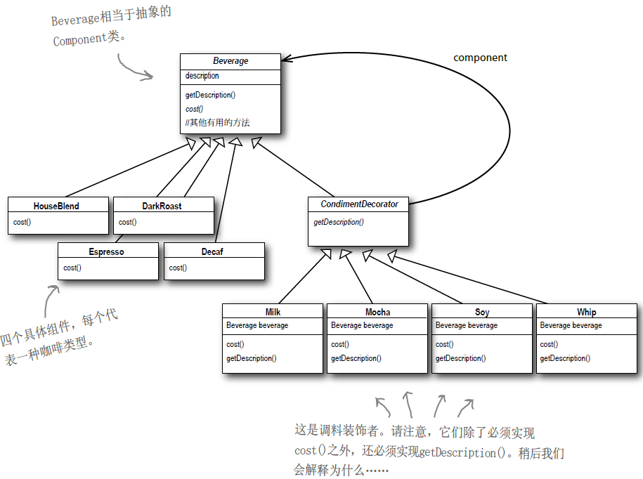

**问题：**

1. CondimentDecorator扩展自Beverage类，这用到了继承，不是说不会使用继承，而是要利用组合取代继承吗

这么做的重点在于，装饰者和被装饰者必须是一样的类型，也就是有共同的超类，这是相当关键的地方。在这里，我们利用继承达到“类型匹配”，而不是利用继承获得“行为”。当我们将装饰者与组件组合时，就是在加入新的行为。所得到的新行为，并不是继承自超类，而是由组合对象得来的。**如果依赖继承，那么类的行为只能在编译时静态决定。换句话说，如果不是来自超类，就是子类覆盖后的版本。反之，利用组合，可以把装饰者混合着用……而且是在“运行时”。**

2. 如果需要继承的是component类型，为什么不Beverage 类设计成一个接口，而是设计成一个抽象类呢？

当初从星巴兹拿到这个程序时，Beverage“经”是一个抽象类了。通常装饰者模式是采用抽象类，但是在Java中可以使用接口。尽管如此，通常我们都努力避免修改现有的代码，所以，如果抽象类运作得好好的，还是别去修改它。

## 6 实现饮料

### 6.1 写下星巴兹的代码

Beverage类：这不需要改变星巴兹原始的设计

```java
public abstract class Beverage {
    protected String description;

    public String getDescription(){
        return description;
    }

    public abstract double cost();
}
```

Condiment类：调料的抽象类

```java
//首先，必须让Condiment Decorator能够取代Beverage，所以将Condiment Decorator扩展自 Beverage 类。
public abstract class Condiment extends Beverage{
    //所有的调料装饰者都必须重新实现getDescription()方法。
    public abstract String getDescription();
}
```

### 6.2 写饮料的代码

现在，已经有了基类，让我们开始开始实现一些饮料吧！先从浓缩咖啡（Espresso）开始。别忘了，我们需要为具体的饮料设置描述，而且还必须实现cost()方法。

Espresso咖啡

```java
//首先，让Espresso扩展自Beverage类，因为Espresso是一种饮料。
public class Espresso extends Beverage {

    //为了要设置饮料的描述，我们写了一个构造器。记住，description实例变量继承自Beverage。
    public Espresso(){
        description = "浓缩咖啡";
    }

    //最后，需要计算Espresso的价钱，现在不需要管调料的价钱，直接把Espresso的价格$1.99返回即可。
    @Override
    public double cost() {
        return 1.99;
    }
}
```

HouseBlend咖啡

```java
public class HouseBlend extends Beverage {

    public HouseBlend(){
        description = "综合咖啡";
    }

    @Override
    public double cost() {
        return 0.89;
    }
}
```

### 6.3 写调料代码

Mocha类

```java
//摩卡是一个装饰者，所以让它扩展自CondimentDecorator。
//别忘了，CondimentDecorator扩展自Beverage。
public class Mocha extends CondimentDecorator {
    /*
    要让Mocha能够引用一个Beverage，做法如下：
    (1)用一个实例变量记录饮料，也就是被装饰者。
    (2)想办法让被装饰者（饮料）被记录到实例变量中。
    这里的做法是：把饮料当作构造器的参数，再由构造器将此饮料记录在实例变量中。
     */
    private Beverage beverage;

    public Mocha(Beverage beverage){
        this.beverage = beverage;
    }
    /*
    我们希望叙述不只是描述饮料（例如“DarkRoast”），而是完整地连调料都描述出来（例如“DarkRoast, Mocha”）。
    所以首先利用委托的做法，得到一个叙述，然后在其后加上附加的叙述（例如“Mocha”）。
     */
    @Override
    public String getDescription() {
        return beverage.getDescription() + ", 摩卡";
    }
    /*
    要计算带Mocha饮料的价钱。首先把调用委托给被装饰对象，以计算价钱，然后再加上Mocha的价钱，得到最后结果。
     */
    @Override
    public double cost() {
        return beverage.cost() + 0.20;
    }
}
```

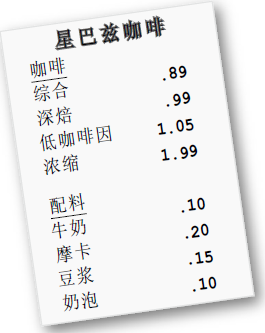

你可以自行建立另外两种饮料类（DarkRoast和Decaf），写下Soy和Whip调料的代码，并完成编译。

### 6.4 供应咖啡

这是用来下订单的一些测试代码

```java
public class StarBuzzCoffee {
    public static void main(String[] args) {
        Beverage beverage = new Espresso();
        System.out.println("我要一杯"+beverage.getDescription()+", 一共花费 "+beverage.cost()+" ￥");
        Beverage beverage1 = new DarkRoast();
        beverage1 = new Mocha(beverage1);
        beverage1 = new Mocha(beverage1);
        beverage1 = new Whip(beverage1);
        System.out.println("我要一杯"+beverage1.getDescription()+", 一共花费 "+beverage1.cost()+" ￥");
        Beverage beverage2 = new HouseBlend();
        beverage2 = new Soy(beverage2);
        beverage2 = new Mocha(beverage2);
        beverage2 = new Whip(beverage2);
        System.out.println("我要一杯"+beverage2.getDescription()+", 一共花费 "+beverage2.cost()+" ￥");
    }
}
```

结果：

~~~java
我要一杯浓缩咖啡, 一共花费 1.99 ￥
我要一杯深焙咖啡, 摩卡, 摩卡, 奶泡, 一共花费 1.49 ￥
我要一杯综合咖啡, 豆浆, 摩卡, 奶泡, 一共花费 1.34 ￥

Process finished with exit code 0
~~~

当我们介绍到“工厂”和“生成器”设计模式时，将有更好的方式建立被装饰者对象。

**思考：**

在菜单上加上咖啡的容量大小，供顾客可以选择小杯（tall）、中杯（grande）、大杯（venti）。星巴兹认为这是任何咖啡都必须具备的，所以在Beverage类中加上了getSize()与setSize()。他们也希望调料根据咖啡容量收费，例如：小中大杯的咖啡加上豆浆，分别加收0.10、0.15、0.20美金。如何改变装饰者类应对这样的需求？

## 7 真实世界的装饰者：Java I/O

java.io包内的类太多了，简直是……“排山倒海”。你第一次（还有第二次和第三次）看到这些API发出“哇”的惊叹时，放心，你不是唯一受到惊吓的人。现在，你已经知道装饰者模式，这些I/O的相关类对你来说应该更有意义了，因为其中许多类都是装饰者。下面是一个典型的对象集合，用装饰者来将功能结合起来，以读取文件数据：

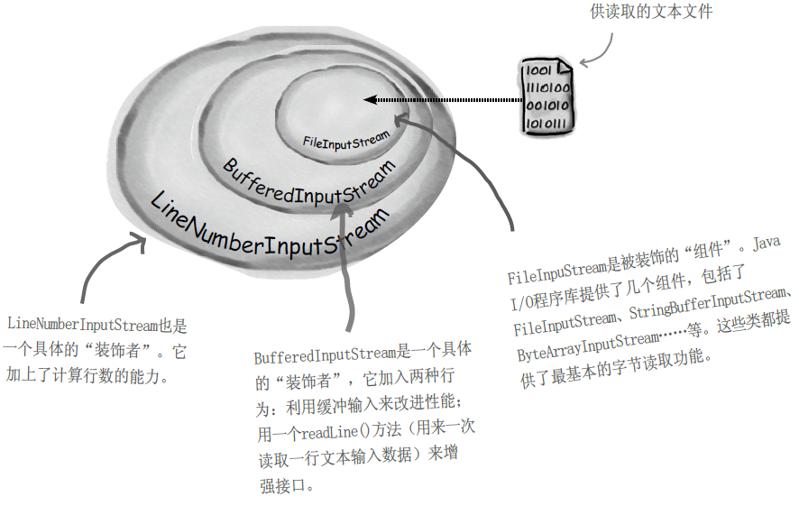

`BufferedInputStream`及`LineNumberInputStream`都扩展自
`FilterInputStream`，而`FilterInputStream`是一个抽象的装饰类。

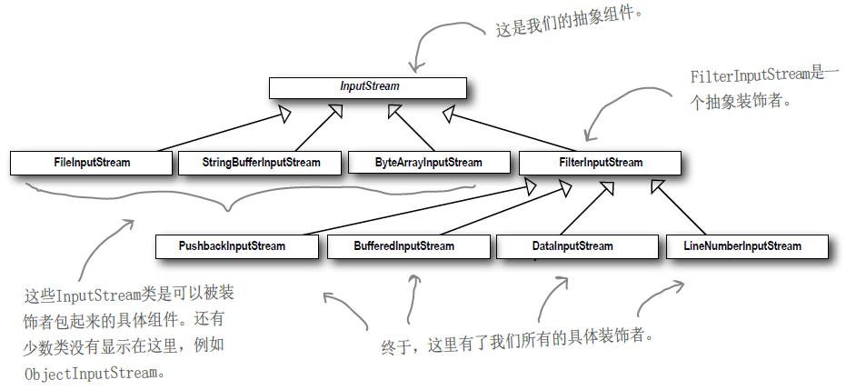

**编写自己的Java I/0装饰者**

```java
public class LowerCaseInputStream extends FilterInputStream {
    /**
     * Creates a <code>FilterInputStream</code>
     * by assigning the  argument <code>in</code>
     * to the field <code>this.in</code> so as
     * to remember it for later use.
     *
     * @param in the underlying input stream, or <code>null</code> if
     *           this instance is to be created without an underlying stream.
     */
    protected LowerCaseInputStream(InputStream in) {
        super(in);
    }

    //现在，必须实现两个read()方法，一个针对字节，一个针对字节数组，把每个是大写字符的字节（每个代表一个字符）转成小写。
    public int read() throws IOException {
        int read = super.read();
        return (read == -1 ? read : Character.toLowerCase(read));
    }

    public int read(byte[] b, int offset, int len) throws IOException {
        int result = super.read(b, offset, len);
        for (int i = offset; i < offset+result; i++) {
            b[i] = (byte)Character.toLowerCase((char)b[i]);
        }
        return result;
    }
}
```

测试刚写好的I/O 装饰者

```java
public class InputTest {
    //设置FileInputStream，先用BufferedInputStream装饰它，再用我们崭新的Lower CaseInputStream过滤器装饰它。
    public static void main(String[] args) throws IOException {
        int c;
        try {
            InputStream in =
                    new LowerCaseInputStream(
                            new BufferedInputStream(
                                    new FileInputStream("./DesignPatterns/test.txt")));
            while((c = in.read()) >= 0) {
                System.out.print((char)c);
            }
            in.close();
        } catch (IOException e) {
            e.printStackTrace();
        }
    }
}
```

## 8 总结

- 继承属于扩展形式之一，但不见得是达到弹性设计的最佳方式。
- 在我们的设计中，应该允许行为可以被扩展，而无须修改现有的代码。
- 组合和委托可用于在运行时动态地加上新的行为。
- 除了继承，装饰者模式也可以让我们扩展行为。
- 装饰者模式意味着一群装饰者类， 这些类用来包装具体组件。
- 装饰者类反映出被装饰的组件类型（事实上，他们具有相同的类型，都经过接口或继承实现）。
- 装饰者可以在被装饰者的行为前面与/或后面加上自己的行为， 甚至将被装饰者的行为整个取代掉，而达到特定的目的。
- 你可以用无数个装饰者包装一个组件。
- 装饰者一般对组件的客户是透明的，除非客户程序依赖于组件的具体类型。
- 装饰者会导致设计中出现许多小对象，如果过度使用，会让程序变得很复杂。