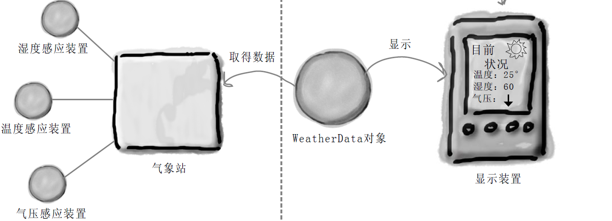
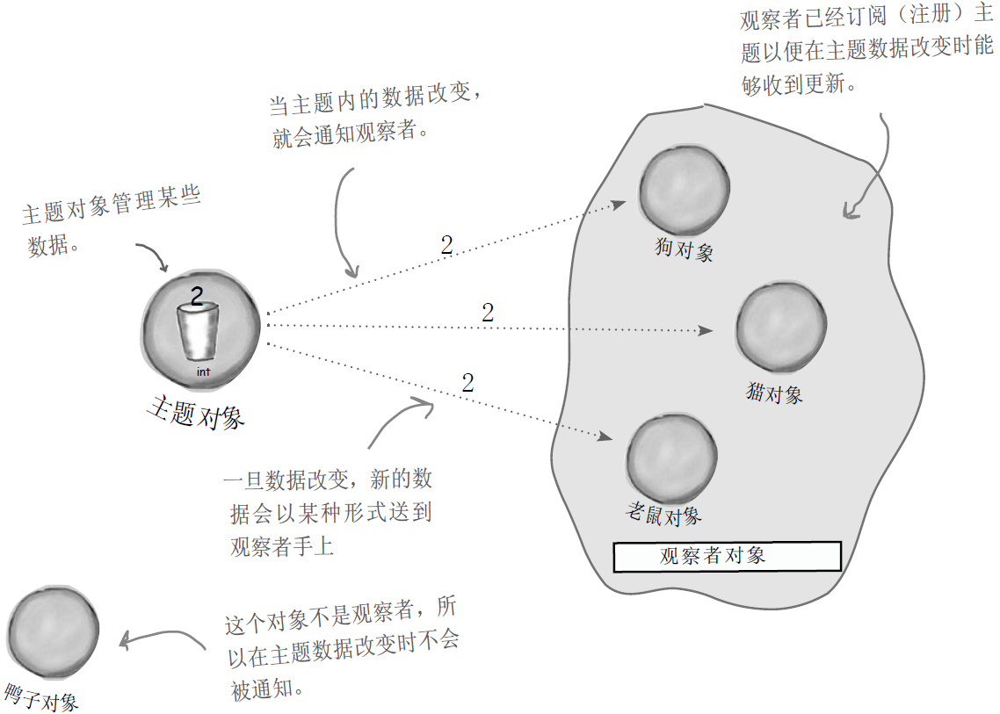
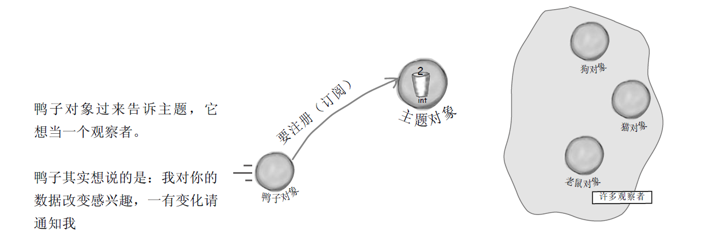
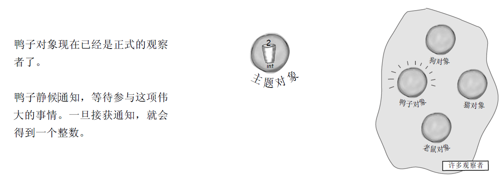
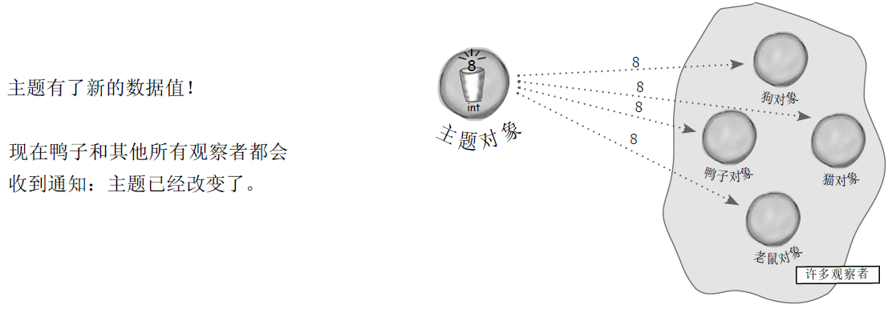
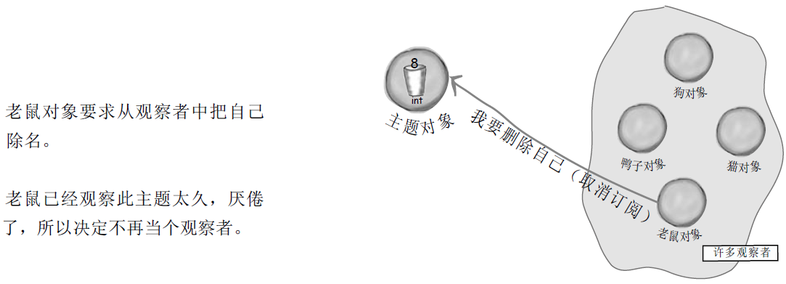
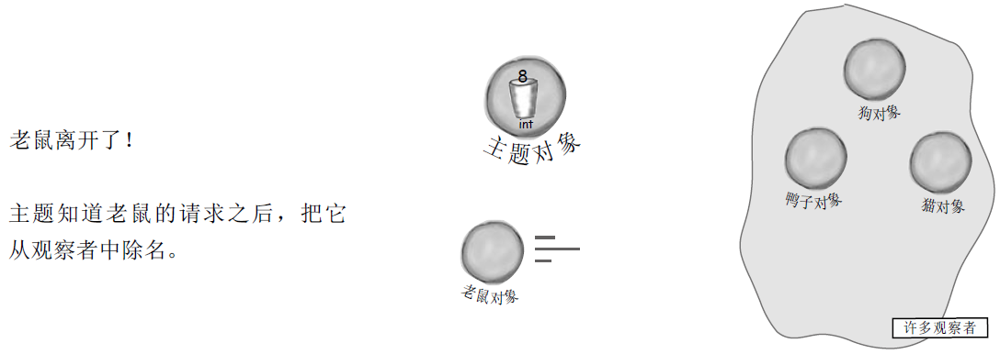
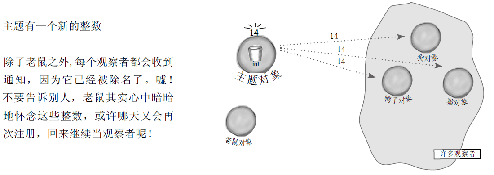
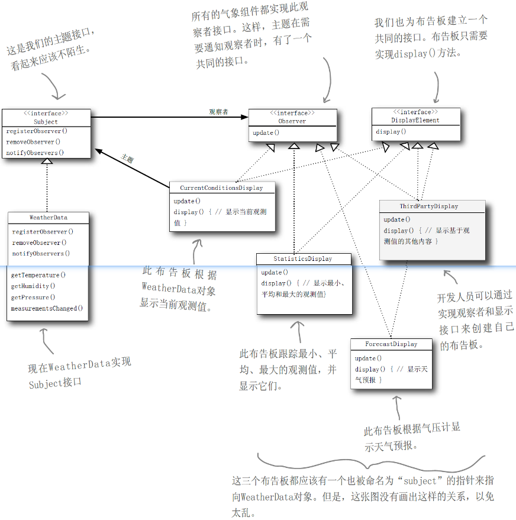
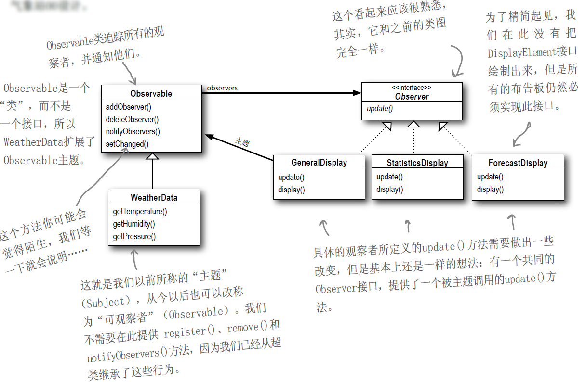

# 观察者模式（Observer Pattern）

## 1 天气预报项目需求

天气预报项目需求，具体要求如下：

1. 气象站可以将每天测量到的温度，湿度，气压等等以公告的形式发布出去(比如发布到自己的网站或第三方)
2. 需要设计开放型`API`，便于其他第三方也能接入气象站获取数据
3. 提供温度、气压和湿度的接口
4. 测量数据更新时，要能实时的通知给第三方



## 2 天气预报需求

- WeatherData类具有getter方法，可以取得三个测量值：温度、湿度与气压。
- 当新的测量数据备妥时，measurementsChanged()方法就会被调用（我们不在乎此方法是如何被调用的，我们只在乎它被调用了）

- 我们需要实现三个使用天气数据的布告板：“目前状况”布告、“气象统计”布告、“天气预报”布告。一旦WeatherData有新的测量，这些布告必须马上更新。
- 此系统必须可扩展，让其他开发人员建立定制的布告板，用户可以随心所欲地添加或删除任何布告板。目前初始的布告板有三类：“目前状况”布告、“气象统计”布告、“天气预报”布告。

## 3 认识观察者模式

主题（subject）------------- 观察者（observer）



------



------



------



------



------



------



## 4 定义观察者模式

观察者模式定义了对象之间的一对多依赖，这样一来，当一个对象改变状态时，它的所有依赖者都会收到通知并自动更新。

观察者模式定义了一系列对象之间的一对多关系。当一个对象改变状态，其他依赖者都会收到通知。



## 5 实现气象站

三个接口

~~~java
public interface DisplayElement {
    public void display();
}
~~~

```java
public interface Observer {
    public void update(float temperature,float humidity,float pressure);
}
```

```java
public interface Subject {
    public void registerObserver(Observer o);
    public void removeObserver(Observer o);
    public void notifyObservers();
}
```

实现类

```java
public class WeatherData implements Subject {
    private ArrayList observers;
    private float temperature;
    private float humidity;
    private float pressure;

    public WeatherData(){
        observers = new ArrayList();
    }
    @Override
    public void registerObserver(Observer o) {
        observers.add(o);
    }

    @Override
    public void removeObserver(Observer o) {
        int i = observers.indexOf(o);
        if (i >= 0){
            observers.remove(o);
        }
    }

    @Override
    public void notifyObservers() {
        for (int i = 0; i < observers.size(); i++) {
            Observer observer = (Observer)observers.get(i);
            observer.update(temperature, humidity, pressure);
        }
    }
    public void measurementsChanged() {
        notifyObservers();
    }
    public void setMeasurements(float temperature, float humidity, float pressure) {
        this.temperature = temperature;
        this.humidity = humidity;
        this.pressure = pressure;
        measurementsChanged();
    }
}
```

两个布告板

```java
public class CurrentConditionsDisplay implements Observer,DisplayElement {
    private float temperature;
    private float humidity;
    private float pressure;
    private Subject weatherData;
    public CurrentConditionsDisplay(Subject weatherData){
        this.weatherData = weatherData;
        weatherData.registerObserver(this);
    }
    @Override
    public void display() {
        System.out.println("当前气温");
        System.out.println("Current conditions: " + temperature + "F degrees and " + humidity + "% humidity " + pressure + "P");
    }

    @Override
    public void update(float temperature, float humidity, float pressure) {
        this.temperature = temperature;
        this.humidity = humidity;
        this.pressure = pressure;
        display();
    }
}
```

```java
public class StatisticsDisplay implements Observer,DisplayElement {
    private float temperature;
    private float humidity;
    private float pressure;
    private Subject weatherData;

    public StatisticsDisplay(Subject weatherData){
        this.weatherData = weatherData;
        weatherData.registerObserver(this);
    }

    @Override
    public void display() {
        System.out.println("当前最大值");
        System.out.println("Statistics display: " + temperature + "F degrees and " + humidity + "% humidity " + pressure + "P");
    }

    @Override
    public void update(float temperature, float humidity, float pressure) {
        if (this.temperature < temperature){
            this.temperature = temperature;
        }
        if (this.humidity < humidity){
            this.humidity = humidity;
        }
        if (this.pressure < pressure){
            this.pressure = pressure;
        }
        display();
    }
}
```

运行程序

```java
public class Demo {
    public static void main(String[] args) {
        WeatherData weatherData = new WeatherData();
        CurrentConditionsDisplay currentDisplay = new CurrentConditionsDisplay(weatherData);
        StatisticsDisplay statisticsDisplay = new StatisticsDisplay(weatherData);
        weatherData.setMeasurements(80, 65, 30.4f);
        System.out.println("-------------------------------------------------------");
        weatherData.setMeasurements(82, 70, 29.2f);
        System.out.println("-------------------------------------------------------");
        weatherData.setMeasurements(78, 90, 29.2f);
    }
}
```

结果

~~~java
当前气温
Current conditions: 80.0F degrees and 65.0% humidity 30.4P
当前最大值
Statistics display: 80.0F degrees and 65.0% humidity 30.4P
-------------------------------------------------------
当前气温
Current conditions: 82.0F degrees and 70.0% humidity 29.2P
当前最大值
Statistics display: 82.0F degrees and 70.0% humidity 30.4P
-------------------------------------------------------
当前气温
Current conditions: 78.0F degrees and 90.0% humidity 29.2P
当前最大值
Statistics display: 82.0F degrees and 90.0% humidity 30.4P

Process finished with exit code 0
~~~

## 6 使用Java内置的观察者模式

到目前为止，我们已经从无到有地完成了观察者模式，但是，JavaAAPI有内置的观察者模式。java.util包（package）内包含最基本的Observer接口与Observable类，这和我们的Subject接口与Observer接口很相似。Observer接口与Observable类使用上更方便，因为许多功能都已经事先准备好了。你甚至可以使用推（push）或拉（pull）的方式传送数据，稍后就会看到这样的例子。为了更了解java.uitl.Observer和java.util.Observable，看看下面的图，这是修改后的气象站OO设计。



Java内置的观察者模式运作方式，和我们在气象站中的实现类似，但有一些小差异。最明显的差异是WeatherData（也就是我们的主题）现在扩展自Observable类，并继承到一些增加、删除、通知观察者的方法（以及其他的方法）。Java版本的用法如下：

**如何把对象变成观察者**

如同以前一样，实现观察者接口（java.uitl.Observer），然后调用任何Observable对象的addObserver()方法。不想再当观察者时，调用deleteObserver()方法就可以了。

**可观察者要如何送出通知**

首先，你需要利用扩展java.util.Observable接口产生“可观察者”类，然后，需要两个步骤：

- 先调用setChanged()方法，标记状态已经改变的事实。
- 然后调用两种notifyObservers()方法中的一个：`notifyObservers() 或 notifyObservers(Object arg)`

当通知时，此版本可以传送任何的数据对象给每一个观察者。

**观察者如何接收通知**

同以前一样，观察者实现了更新的方法，但是方法的签名不太一样：`update(Observable o, Object arg)`

`Observable o`主题本身当作第一个变量，好让观察者知道是哪个主题通知它的。

`Object arg`这正是传入notifyObservers()的数据对象。如果没有说明则为空。

如果你想“ 推” （ p u s h ） 数据给观察者， 你可以把数据当作数据对象传送给notifyObservers(arg)方法。否则，观察者就必须从可观察者对象中“拉”（pull）数据。如何拉数据？我们再做一遍气象站，你很快就会看到。

**`setChanged()`方法**

setChanged()方法用来标记状态已经改变的事实，好让notifyObservers()知道当它被调用时应该更新观察者。如果调用notifyObservers()之前没有先调用setChanged()，观察者就“不会”被通知。让我们看看Observable 内部，以了解这一切：

```java
private boolean changed = false;
private Vector<Observer> obs;
```

```java
/**
 * Marks this <tt>Observable</tt> object as having been changed; the
 * <tt>hasChanged</tt> method will now return <tt>true</tt>.
 */
protected synchronized void setChanged() {
    changed = true;
}

/**
 * Indicates that this object has no longer changed, or that it has
 * already notified all of its observers of its most recent change,
 * so that the <tt>hasChanged</tt> method will now return <tt>false</tt>.
 * This method is called automatically by the
 * <code>notifyObservers</code> methods.
 *
 * @see     java.util.Observable#notifyObservers()
 * @see     java.util.Observable#notifyObservers(java.lang.Object)
 */
protected synchronized void clearChanged() {
    changed = false;
}

/**
 * Tests if this object has changed.
 *
 * @return  <code>true</code> if and only if the <code>setChanged</code>
 *          method has been called more recently than the
 *          <code>clearChanged</code> method on this object;
 *          <code>false</code> otherwise.
 * @see     java.util.Observable#clearChanged()
 * @see     java.util.Observable#setChanged()
 */
public synchronized boolean hasChanged() {
    return changed;
}
```

这样做有其必要性。setChanged()方法可以让你在更新观察者时，有更多的弹性，你可以更适当地通知观察者。比方说，如果没有setChanged()方法，我们的气象站测量是如此敏锐，以致于温度计读数每十分之一度就会更新，这会造成WeatherData对象持续不断地通知观察者，我们并不希望看到这样的事情发生。如果我们希望半度以上才更新，就可以在温度差距到达半度时，调用setChanged()，进行有效的更新。

你也许不会经常用到此功能，但是把这样的功能准备好，当需要时马上就可以使用。总之，你需要调用setChanged()，以便通知开始运转。如果此功能在某些地方对你有帮助，你可能也需要clearChanged()方法，将changed状态设置回false。另外也有一个hasChanged()方法，告诉你changed标志的当前状态。

```java
/**
 * If this object has changed, as indicated by the
 * <code>hasChanged</code> method, then notify all of its observers
 * and then call the <code>clearChanged</code> method to
 * indicate that this object has no longer changed.
 * <p>
 * Each observer has its <code>update</code> method called with two
 * arguments: this observable object and <code>null</code>. In other
 * words, this method is equivalent to:
 * <blockquote><tt>
 * notifyObservers(null)</tt></blockquote>
 *
 * @see     java.util.Observable#clearChanged()
 * @see     java.util.Observable#hasChanged()
 * @see     java.util.Observer#update(java.util.Observable, java.lang.Object)
 */
public void notifyObservers() {
    notifyObservers(null);
}

/**
 * If this object has changed, as indicated by the
 * <code>hasChanged</code> method, then notify all of its observers
 * and then call the <code>clearChanged</code> method to indicate
 * that this object has no longer changed.
 * <p>
 * Each observer has its <code>update</code> method called with two
 * arguments: this observable object and the <code>arg</code> argument.
 *
 * @param   arg   any object.
 * @see     java.util.Observable#clearChanged()
 * @see     java.util.Observable#hasChanged()
 * @see     java.util.Observer#update(java.util.Observable, java.lang.Object)
 */
public void notifyObservers(Object arg) {
    /*
     * a temporary array buffer, used as a snapshot of the state of
     * current Observers.
     */
    Object[] arrLocal;

    synchronized (this) {
        /* We don't want the Observer doing callbacks into
         * arbitrary code while holding its own Monitor.
         * The code where we extract each Observable from
         * the Vector and store the state of the Observer
         * needs synchronization, but notifying observers
         * does not (should not).  The worst result of any
         * potential race-condition here is that:
         * 1) a newly-added Observer will miss a
         *   notification in progress
         * 2) a recently unregistered Observer will be
         *   wrongly notified when it doesn't care
         */
        if (!changed)
            return;
        arrLocal = obs.toArray();
        clearChanged();
    }

    for (int i = arrLocal.length-1; i>=0; i--)
        ((Observer)arrLocal[i]).update(this, arg);
}
```

notifyObservers() 只会在changed标为“true”时通知观察者。

在通知观察者之后，把changed标志设回false。

## 7 利用内置的支持重做气象站

```java
//记得要导入（import）正确的Observer/Observable。
import java.util.Observable;
//我们现在正在继承Observable。我们不再需要追踪观察者了，也不需要管理注册与删除（让超类代劳即可）。
// 所以我们把注册、添加、通知的相关代码删除。
public class WeatherData extends Observable {
    private float temperature;
    private float humidity;
    private float pressure;

    //我们的构造器不再需要为了记住观察者们而建立数据结构了。
    public WeatherData(){}

    public void measurementsChanged() {
        //在调用notifyObservers()之前，要先调用setChanged()来指示状态已经改变。
        setChanged();
        //注意：我们没有调用notifyObservers()传送数据对象，这表示我们采用的做法是“拉”
        notifyObservers();
    }

    public void setMeasurements(float temperature, float humidity, float pressure) {
        this.temperature = temperature;
        this.humidity = humidity;
        this.pressure = pressure;
        measurementsChanged();
    }
    //这些并不是新方法，只是因为我们要使用“拉”的做法，所以才提醒你有这些方法。察者会利用这些方法取得WeatherData对象的状态。
    public float getTemperature() {
        return temperature;
    }
    public float getHumidity() {
        return humidity;
    }
    public float getPressure() {
        return pressure;
    }
}
```

```java
//记得要导入（import）正确的Observer/Observable。
import java.util.Observable;
import java.util.Observer;

public class CurrentConditionsDisplay implements Observer,DisplayElement {
    private float temperature;
    private float humidity;
    private float pressure;
    private Observable observable;

    //现在构造器需要一Observable当参数，并将CurrentConditionsDisplay对象登记成为观察者。
    public CurrentConditionsDisplay(Observable o){
        this.observable = o;
        observable.addObserver(this);
    }


    @Override
    public void display() {
        System.out.println("当前气温");
        System.out.println("Current conditions: " + temperature + "F degrees and " + humidity + "% humidity " + pressure + "P");
    }

    //在 update()中，先确定可观察者属于WeatherData类型，然后利用 getter方法获取温度，湿度，压力测量值，最后调用display()。
    @Override
    public void update(Observable o, Object arg) {
        if (o instanceof WeatherData) {
            WeatherData weatherData = (WeatherData)o;
            this.temperature = weatherData.getTemperature();
            this.humidity = weatherData.getHumidity();
            this.pressure = weatherData.getPressure();
            display();
        }
    }
}
```

```java
//记得要导入（import）正确的Observer/Observable。
import java.util.Observable;
import java.util.Observer;

public class StatisticsDisplay implements Observer,DisplayElement {
    private float temperature;
    private float humidity;
    private float pressure;
    private Observable observable;

    public StatisticsDisplay(Observable o){
        this.observable = o;
        observable.addObserver(this);
    }

    @Override
    public void update(Observable o, Object arg) {
        if (o instanceof WeatherData) {
            WeatherData weatherData = (WeatherData)o;
            if (this.temperature < weatherData.getTemperature()){
                this.temperature = weatherData.getTemperature();
            }
            if (this.humidity < weatherData.getHumidity()){
                this.humidity = weatherData.getHumidity();
            }
            if (this.pressure < weatherData.getPressure()){
                this.pressure = weatherData.getPressure();
            }
            display();
        }
    }

    @Override
    public void display() {
        System.out.println("当前最大值");
        System.out.println("StatisticsDisplay: " + temperature + "F degrees and " + humidity + "% humidity " + pressure + "P");
    }
}
```

再次测试

~~~java
当前最大值
StatisticsDisplay: 80.0F degrees and 65.0% humidity 30.4P
当前气温
Current conditions: 80.0F degrees and 65.0% humidity 30.4P
-------------------------------------------------------
当前最大值
StatisticsDisplay: 82.0F degrees and 70.0% humidity 30.4P
当前气温
Current conditions: 82.0F degrees and 70.0% humidity 29.2P
-------------------------------------------------------
当前最大值
StatisticsDisplay: 82.0F degrees and 90.0% humidity 30.4P
当前气温
Current conditions: 78.0F degrees and 90.0% humidity 29.2P

Process finished with exit code 0
~~~

**你注意到差别了吗**

你会看到相同的计算结果，但是奇怪的地方在于，文字输出的次序不一样。怎么会这样呢？在继续之前，请花一分钟的时间思考……

不要依赖于观察者被通知的次序`java.uitl.Observable`实现了它的`notifyObservers()`方法，这导致了通知观察者的次序不同于我们先前的次序。谁也没有错，只是双方选择不同的方式实现罢了。

但是可以确定的是，如果我们的代码依赖这样的次序，就是错的。为什么呢？因为一旦观察者/可观察者的实现有所改变，通知次序就会改变，很可能就会产生错误的结果。这绝对不是我们所认为的松耦合。

**`java.util.Observable`的黑暗面**

可观察者是一个“类”而不是一个“接口”，更糟的是，它甚至没有实现一个接口。不幸的是，java.util.Observable的实现有许多问题，限制了它的使用和复用。这并不是说它没有提供有用的功能，我们只是想提醒大家注意一些事实。

**Observable是一个类**

你已经从我们的原则中得知这不是一件好事，但是，这到底会造成什么问题呢？

首先，因为Observable是一个“类”，你必须设计一个类继承它。如果某类想同时具有Observable类和另一个超类的行为，就会陷入两难，毕竟Java不支持多重继承。这限制了Observable的复用潜力（而增加复用潜力不正是我们使用模式最原始的动机吗？）。

再者，因为没有Observable接口，所以你无法建立自己的实现，和Java内置的Observer API搭配使用，也无法将java.util的实现换成另一套做法的实现，（比方说，

**Observable将关键的方法保护起来**

如果你看看Observable API，你会发现setChanged()方法被保护起来了（被定义成protected）。那又怎么样呢？这意味着：除非你继承自Observable，否则你无法创建Observable实例并组合到你自己的对象中来。这个设计违反了第二个设计原则：“多用组合，少用继承”。

**做什么呢？**

如果你能够扩展java.util.Observable，那么Observable“可能”可以符合你的需求。否则，你可能需要像本章开头的做法那样自己实现这一整套观察者模式。不管用哪一种方法，反正你都已经熟悉观察者模式了，应该都能善用它们。

8 总结

- 观察者模式定义了对象之间一对多的关系。
- 主题（也就是可观察者）用一个共同的接口来更新观察者。
- 观察者和可观察者之间用松耦合方式结合（loosecoupling），可观察者不知道观察者的细节，只知道观察者实现了观察者接口。
- 使用此模式时，你可从被观察者处推（push）或拉（pull）数据（然而，推的方式被认为更“正确”）。
- 有多个观察者时，不可以依赖特定的通知次序。
- Java有多种观察者模式的实现，包括了通用的java.util.Observable。
- 要注意java.util.Observable实现上所带来的一些问题。
- 如果有必要的话，可以实现自己的Observable，这并不难，不要害怕。
-  Swing大量使用观察者模式，许多GUI框架也是如此。
- 此模式也被应用在许多地方，例如：JavaBeans、RMI。