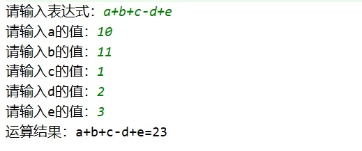
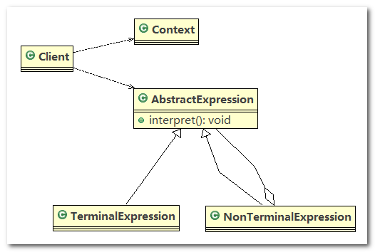
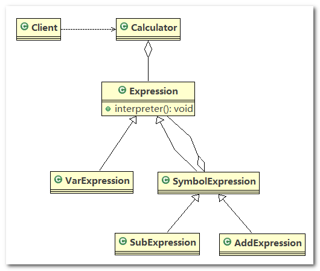
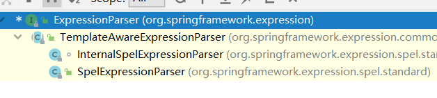
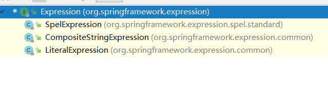

# 解释器模式

## 1、四则运算问题

通过解释器模式来实现四则运算，如计算`a+b-c`的值，具体要求

1. 先输入表达式的形式，比如 `a+b+c-d+e`，要求表达式的字母不能重复
2. 在分别输入 `a, b, c, d, e` 的值
3. 最后求出结果：如图



## 2、传统方案解决四则运算问题分析

1. 编写一个方法，接收表达式的形式，然后根据用户输入的数值进行解析，得到结果
2. 问题分析：如果加入新的运算符，比如 ‘*’、’/’ ( 等等，不利于扩展， 另外让一个方法来解析会造成程序结构混乱，不够清晰
3. 解决方案：可以考虑使用解释器模式， 即： 表达式 --> 解释器(可以有多种) --> 结果

## 3、解释器模式基本介绍

解释器模式

1. 在编译原理中， 一个算术表达式通过词法分析器形成词法单元，而后这些词法单元再通过语法分析器构建语法分析树，最终形成一颗抽象的语法分析树。这里的词法分析器和语法分析器都可以看做是解释器
2. 解释器模式(`Interpreter Pattern`)：是指给定一个语言(表达式)， 我们编程人员需要定义语句的文法的一种表示，并定义一个解释器， 使用该解释器来解释语言中的句子(表达式)

------

应用场景

1. 应用可以将一个需要解释执行的语言中的句子表示为一个抽象语法树
2. 一些重复出现的问题可以用一种简单的语言来表达
3. 一个简单语法需要解释的场景
4. 这样的例子还有，比如编译器、 运算表达式计算、正则表达式、 机器人等

## 4、解释器模式的原理类图

1. `Context`：是环境角色，含有解释器之外的全局信息
2. `AbstractExpression`：抽象表达式， 声明一个抽象的解释操作，这个方法为抽象语法树中所有的节点所共享
3. `TerminalExpression`：为终结符表达式，实现与文法中的终结符相关的解释操作
4. `NonTermialExpression`：为非终结符表达式，为文法中的非终结符实现解释操作
5. 说明： 输入 `Context` 和 `TerminalExpression` 信息通过 `Client` 输入即可



## 5、解释器模式来实现四则运算

应用实例要求

通过解释器模式来实现四则运算，如计算`a+b-c`的值

------

类图



------

代码实现

1. `Expression`：表达式解释器的抽象父类

   ```java
   /**
    * 抽象类表达式，通过HashMap 键值对, 可以获取到变量的值
    */
   public abstract class Expression {
       // a + b - c
       // 解释公式和数值, key 就是公式(表达式)中的参数[a,b,c], value就是就是具体值
       // HashMap {a=10, b=20}
       public abstract int interpreter(HashMap<String,Integer> var);
   }
   ```

2. `VarExpression`：变量的解释器，重写了 `interpreter()` 方法，该方法通过变量的名称获取变量的值

   ```java
   /**
    * 变量的解释器
    */
   public class VarExpression extends Expression {
   
       private String key;
   
       public VarExpression(String key){
           this.key = key;
       }
   
       // var 就是{a=10, b=20}
       // interpreter 根据 变量名称，返回对应值
       @Override
       public int interpreter(HashMap<String, Integer> var) {
           return var.get(key);
       }
   }
   ```

3. `SymbolExpression`：抽象运算符的解释器，由于运算符有多中类型，所以在 `interpreter()` 无法完成具体的运算操作，具体操作交由子类实现

   ```java
   /**
    * 抽象运算符号解析器 这里，每个运算符号，都只和自己左右两个数字有关系，
    * 但左右两个数字有可能也是一个解析的结果，无论何种类型，都是Expression类的实现类
    */
   public abstract class SymbolExpression extends Expression {
   
       protected Expression left;
       protected Expression right;
   
       public SymbolExpression(Expression left,Expression right){
           this.left = left;
           this.right = right;
       }
   }
   ```

4. `AddExpression`：加法运算符的解释器，递归调用：表达式的值 = 左边表达式的值 + 右边表达式的值

   ```java
   /**
    * 加法解释器
    */
   public class AddExpression extends SymbolExpression {
   
       public AddExpression(Expression left, Expression right) {
           super(left, right);
       }
   
       // 处理相加
       // var 仍然是 {a=10,b=20}..
       @Override
       public int interpreter(HashMap<String, Integer> var) {
           // left.interpreter(var) ： 返回 left 表达式对应的值 a = 10
           // right.interpreter(var): 返回right 表达式对应值 b = 20
           return left.interpreter(var) + right.interpreter(var);
       }
   }
   ```

5. `SubExpression`：减法运算符的解释器，递归调用：表达式的值 = 左边表达式的值 + 右边表达式的值

   ```java
   /**
    * 减法解释器
    */
   public class SubExpression extends SymbolExpression {
   
       public SubExpression(Expression left, Expression right) {
           super(left, right);
       }
   
       @Override
       public int interpreter(HashMap<String, Integer> var) {
           return left.interpreter(var) - right.interpreter(var);
       }
   }
   ```

6. `Calculator`：计算器类，通过 `Expression` 的实现类完成具体的解释运算

   ```java
   public class Calculator {
   
       // 定义表达式
       private Expression expression;
       // 安排运算先后顺序
       private Stack<Expression> expressions;
       // 表达式拆分成字符数组
       private char[] expStr;
   
       public Calculator(String expStr){
           expressions = new Stack<>();
           this.expStr = expStr.toCharArray();
       }
   
       public void expression(){
           Expression left;
           Expression right;
   
           // 遍历我们的字符数组， 即遍历 [a, +, b]
           // 针对不同的情况，做处理
           for (int i = 0; i < expStr.length; i++) {
               switch (expStr[i]){
                   case '+':
                       left = expressions.pop();// 从stack取出left => "a"
                       right = new VarExpression(String.valueOf(expStr[++i]));// 取出右表达式 "b"
                       expressions.push(new AddExpression(left,right));// 然后根据得到left 和 right 构建 AddExpresson加入stack
                       break;
                   case '-':
                       left = expressions.pop();
                       right = new VarExpression(String.valueOf(expStr[++i]));
                       expressions.push(new SubExpression(left,right));
                       break;
                   default:
                       // 如果是一个 Var 就创建一个 VarExpression 对象，并push到 stack
                       expressions.push(new VarExpression(String.valueOf(expStr[i])));
                       break;
               }
           }
           // 当遍历完整个 expStr 数组后，expressions 就得到最后Expression
           this.expression = expressions.pop();
       }
   
       public int result(HashMap<String, Integer> var) {
           // 最后将表达式a+b和 var = {a=10,b=20}
           // 然后传递给expression的interpreter进行解释执行
           return this.expression.interpreter(var);
       }
   }
   ```

7. `ClientTest`：测试代码

   ```java
   public class Client {
       public static void main(String[] args) throws IOException {
           String expStr = getExpStr(); // a+b
           HashMap<String, Integer> var = getValue(expStr);// var {a=10, b=20}
           Calculator calculator = new Calculator(expStr);
           calculator.expression();
           System.out.println("运算结果：" + expStr + "=" + calculator.result(var));
       }
       // 获得表达式
       public static String getExpStr() throws IOException {
           System.out.print("请输入表达式：");
           return (new Scanner(System.in)).next();
       }
   
       // 获得值映射
       public static HashMap<String, Integer> getValue(String expStr) throws IOException {
           HashMap<String, Integer> map = new HashMap<>();
   
           for (char ch : expStr.toCharArray()) {
               if (ch != '+' && ch != '-') {
                   if (!map.containsKey(String.valueOf(ch))) {
                       System.out.print("请输入" + String.valueOf(ch) + "的值：");
                       String in = (new Scanner(System.in)).next();
                       map.put(String.valueOf(ch), Integer.valueOf(in));
                   }
               }
           }
   
           return map;
       }
   }
   ```

## 6、Spring SpelExpressionParser

> **测试代码**

```java
public class Interpreter {

	public static void main(String[] args) {
		// 创建一个 Parser 对象
		ExpressionParser parser = new SpelExpressionParser();

		// 通过 Parser 对象 获取到一个Expression对象
		// 会根据不同的 Parser 对象 ，返回不同的 Expression对象
		Expression expression = parser.parseExpression("10 * (2 + 1) * 1 + 66"); // 96
		int result = (Integer) expression.getValue();
		System.out.println(result);
	}

}
```

> **源码追踪**

1. `ExpressionParser` 是个接口，定义了获取 `Express` 表达式对象的行为规范，其继承关系如下

   

   ```java
   public interface ExpressionParser {
   
   	Expression parseExpression(String expressionString) throws ParseException;
   
   	Expression parseExpression(String expressionString, ParserContext context) throws ParseException;
   
   }
   ```

2. `TemplateAwareExpressionParser` 实现了 `ExpressionParser` 接口，其中有个重要的方法为 `parseExpression()`，该方法根据表达式的值，获取 `Express` 对象；在 `TemplateAwareExpressionParser` 中实现了获取 `CompositeStringExpression` 表达式对象的方法

   ```java
   public abstract class TemplateAwareExpressionParser implements ExpressionParser {
       
       // ...
       
       @Override
   	public Expression parseExpression(String expressionString) throws ParseException {
   		return parseExpression(expressionString, NON_TEMPLATE_PARSER_CONTEXT);
   	}
   
   	@Override
   	public Expression parseExpression(String expressionString, ParserContext context)
   			throws ParseException {
   		if (context == null) {
   			context = NON_TEMPLATE_PARSER_CONTEXT;
   		}
   
   		if (context.isTemplate()) {
   			return parseTemplate(expressionString, context); // 创建 CompositeStringExpression 对象
   		}
   		else {
   			return doParseExpression(expressionString, context); // 创建 SpelExpression 对象
   		}
   	}
       
       
       // ...
       
       private Expression parseTemplate(String expressionString, ParserContext context)
           	throws ParseException {
   		if (expressionString.length() == 0) {
   			return new LiteralExpression("");
   		}
   		Expression[] expressions = parseExpressions(expressionString, context);
   		if (expressions.length == 1) {
   			return expressions[0];
   		}
   		else {
   			return new CompositeStringExpression(expressionString, expressions);
   		}
   	}
       
       protected abstract Expression doParseExpression(String expressionString,
   		ParserContext context) throws ParseException;
   
       // ...
   ```

3. `SpelExpressionParser` 类继承自 `TemplateAwareExpressionParser` 类，实现了 `doParseExpression()` 抽象方法

   ```java
   public class SpelExpressionParser extends TemplateAwareExpressionParser {
       
       // ...
       
       @Override
   	protected SpelExpression doParseExpression(String expressionString, ParserContext context) throws ParseException {
   		return new InternalSpelExpressionParser(this.configuration).doParseExpression(expressionString, context);
   	}
       
       // ...
   ```

4. `Expression` 是个接口，定义了表达式解释器的业务规范，里面有超多的 `getValue()` 方法，用于获取表达式的值，其继承关系如下

   

   ```java
   public interface Expression {
   
   	Object getValue() throws EvaluationException;
   
   	Object getValue(Object rootObject) throws EvaluationException;
   
   	<T> T getValue(Class<T> desiredResultType) throws EvaluationException;
   
   	<T> T getValue(Object rootObject, Class<T> desiredResultType) throws EvaluationException;
       
       // ...
   ```

5. `SpelExpression` 实现了 `Expression` 接口，重写了超多的 `getValue()` 方法，主要是通过调用 `SpelNodeImpl` 类中的方法来实现 `Expresssion` 中的 `getValue()` 方法

   ```java
   public class SpelExpression implements Expression {
   
   	private final String expression;
   
   	private final SpelNodeImpl ast;
   
   	private final SpelParserConfiguration configuration;
   
   	// the default context is used if no override is supplied by the user
   	private EvaluationContext defaultContext;
   
   
   	/**
   	 * Construct an expression, only used by the parser.
   	 */
   	public SpelExpression(String expression, SpelNodeImpl ast, SpelParserConfiguration configuration) {
   		this.expression = expression;
   		this.ast = ast;
   		this.configuration = configuration;
   	}
   
   
   	// implementing Expression
   
   	@Override
   	public Object getValue() throws EvaluationException {
   		ExpressionState expressionState = new ExpressionState(getEvaluationContext(), this.configuration);
   		return this.ast.getValue(expressionState);
   	}
   
   	@Override
   	public Object getValue(Object rootObject) throws EvaluationException {
   		ExpressionState expressionState = new ExpressionState(getEvaluationContext(), toTypedValue(rootObject), this.configuration);
   		return this.ast.getValue(expressionState);
   	}
   
   	@Override
   	public <T> T getValue(Class<T> expectedResultType) throws EvaluationException {
   		ExpressionState expressionState = new ExpressionState(getEvaluationContext(), this.configuration);
   		TypedValue typedResultValue = this.ast.getTypedValue(expressionState);
   		return ExpressionUtils.convertTypedValue(expressionState.getEvaluationContext(), typedResultValue, expectedResultType);
   	}
   
   	@Override
   	public <T> T getValue(Object rootObject, Class<T> expectedResultType) throws EvaluationException {
   		ExpressionState expressionState = new ExpressionState(getEvaluationContext(), toTypedValue(rootObject), this.configuration);
   		TypedValue typedResultValue = this.ast.getTypedValue(expressionState);
   		return ExpressionUtils.convertTypedValue(expressionState.getEvaluationContext(), typedResultValue, expectedResultType);
   	}
   
   	@Override
   	public Object getValue(EvaluationContext context) throws EvaluationException {
   		Assert.notNull(context, "The EvaluationContext is required");
   		return this.ast.getValue(new ExpressionState(context, this.configuration));
   	}
       
       // ...
   ```

> **总结**

`Expression` 接口有不同的实现类，比如 `SpelExpression`，使用的时候，根据我们创建的 `ExpressionParser` 对象不同，就返回不同的 `Expression` 对象

## 7、解释器模式的注意事项和细节

1. 当有一个语言需要解释执行， 可将该语言中的句子表示为一个抽象语法树， 就可以考虑使用解释器模式， 让程序具有良好的扩展性
2. 应用场景： 编译器、 运算表达式计算、 正则表达式、 机器人等
3. 使用解释器可能带来的问题： 解释器模式会引起类膨胀、 解释器模式采用递归调用方法， 将会导致调试非常复杂、 效率可能降低