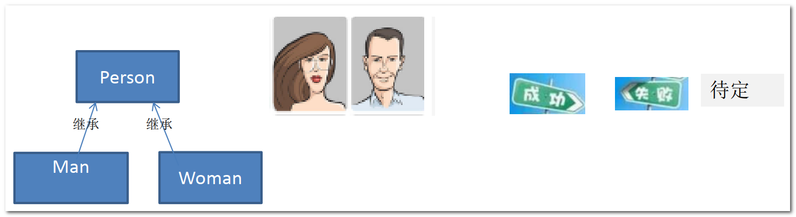
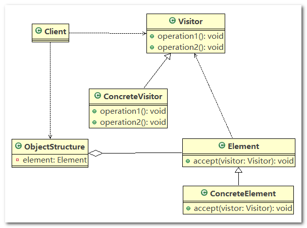
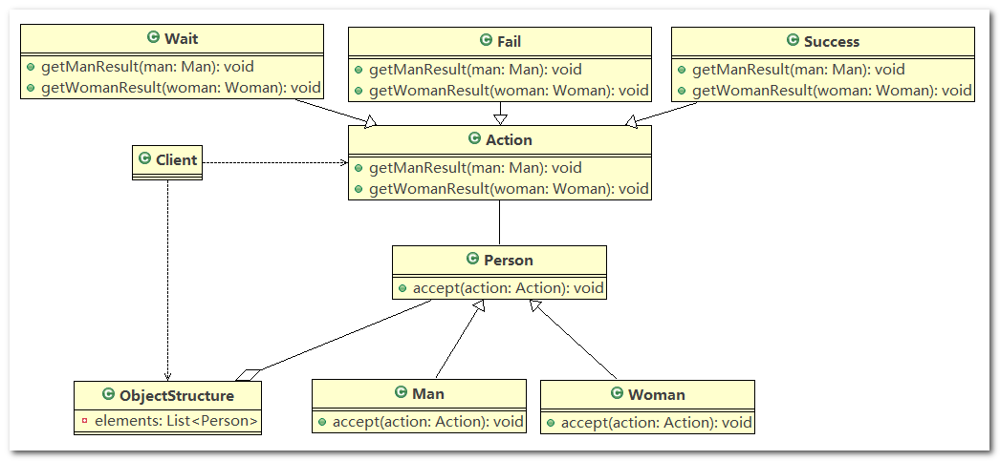

# 访问者模式

## 1、测评系统的需求

完成测评系统需求

将观众分为男人和女人，对歌手进行测评，当看完某个歌手表演后，得到他们对该歌手不同的评价(评价有不同的种类，比如成功、失败等)

## 2、传统方式完成测评系统

> **传统方式的问题分析**

1. 如果系统比较小，还是`ok`的，但是考虑系统增加越来越多新的功能时，对代码改动较大，违反了`ocp`原则， 不利于维护
2. 传统方式的扩展性不好，比如增加了新的人员类型，或者管理方法，都不好扩展
3. 引出我们会使用新的设计模式 –-> 访问者模式



## 3、访问者模式基本介绍

1. 访问者模式(`Visitor Pattern`) ：封装一些作用于某种数据结构的各元素的操作，它可以在不改变数据结构的前提下定义作用于这些元素的新的操作
2. 访问者模式主要将数据结构与数据操作分离，解决数据结构和操作耦合性问题
3. 访问者模式的基本工作原理是：在被访问的类里面加一个对外提供接待访问者的接口
4. 访问者模式主要应用场景是： 需要对一个对象结构中的对象进行很多不同操作(这些操作彼此没有关联)，同时需要避免让这些操作污染这些对象的类，可以选用访问者模式解决

## 4、访问者模式的原理类图

1. `Visitor` 是抽象访问者，定义访问者的行为规范
2. `ConcreteVisitor` ：是一个具体的访问者，继承(或实现) `Visitor`，实现 `Visitor` 中定义的每个方法，实现具体的行为逻辑
3. `Element` 定义一个`accept` 方法，用于接收一个访问者对象(`Visitor` 的具体实现类)
4. `ConcreteElement` 为具体元素， 实现了 `Element` 接口中 `accept` 方法
5. `ObjectStructure` 能枚举它里面所包含的元素(`Element`)， 可以提供一个高层的接口，目的是允许访问者访问指定的元素



## 5、访问者模式完成测评系统

应用实例要求

将人分为男人和女人，对歌手进行测评，当看完某个歌手表演后，得到他们对该歌手不同的评价(评价有不同的种类，比如成功、失败、待定等)，请使用访问者模式来说实现

------

类图



------

代码实现

1. `Action`：定义 `Visitor` 的行为规范，`getResult()` 方法接收 `Person` 类型的参数，用于获取观众对歌手的评价

   ```java
   public abstract class Action {
   
   	// 得到观众的评价
   	public abstract void getResult(Person person);
   
   }
   ```

2. `Success`：具体的 `Visitor` 实现类，`Success` 表示通过

   ```java
   public class Success extends Action {
   
   	@Override
   	public void getResult(Person person) {
   		System.out.println(person.gender + "给的评价该歌手很成功 !");
   	}
   
   }
   ```

3. `Fail`：具体的 `Visitor` 实现类，`Fail` 表示失败

   ```java
   public class Fail extends Action {
   
   	@Override
   	public void getResult(Person person) {
   		System.out.println(person.gender + "给的评价该歌手失败 !");
   	}
   
   }
   ```

4. `Wait`：具体的 `Visitor` 实现类，`Wait` 表示待定

   ```java
   public class Wait extends Action {
   
   	@Override
   	public void getResult(Person person) {
   		System.out.println(person.gender + "给的评价是该歌手待定 ..");
   	}
   
   }
   ```

5. `Person`：观众类，该抽象类定义了抽象方法 `accept()`，可以接收一个 `Visitor` 实现类的实例，用于触发观众投票的动作

   ```java
   public abstract class Person {
   	
   	String gender;
   
   	// 提供一个方法，让访问者可以访问
   	public abstract void accept(Action action);
   
   }
   ```

6. `Man`：男观众

   ```java
   //说明
   //1. 这里我们使用到了双分派, 即首先在客户端程序中，将具体状态作为参数传递Man中(第一次分派)
   //2. 然后Man 类调用作为参数的 "具体方法" 中方法getResult, 同时将自己(this)作为参数传入，完成第二次的分派
   public class Man extends Person {
   
   	public Man() {
   		gender = "男性";
   	}
   
   	@Override
   	public void accept(Action action) {
   		action.getResult(this);
   	}
   
   }
   ```

7. `Woman`：女观众

   ```java
   //说明
   //1. 这里我们使用到了双分派, 即首先在客户端程序中，将具体状态作为参数传递Woman中(第一次分派)
   //2. 然后Woman 类调用作为参数的 "具体方法" 中方法getResult, 同时将自己(this)作为参数传入，完成第二次的分派
   public class Woman extends Person{
   
   	public Woman() {
   		gender = "女性";
   	}
   	
   	@Override
   	public void accept(Action action) {
   		action.getResult(this);
   	}
   
   }
   ```

8. `ObjectStructure`：一个高层的封装接口，允许 `Visitor` 访问指定的元素

   ```java
   //数据结构，管理很多人（Man , Woman）
   public class ObjectStructure {
   
   	// 维护了一个集合
   	private List<Person> persons = new LinkedList<>();
   
   	// 增加到list
   	public void attach(Person p) {
   		persons.add(p);
   	}
   
   	// 移除
   	public void detach(Person p) {
   		persons.remove(p);
   	}
   
   	// 显示测评情况
   	public void display(Action action) {
   		for (Person p : persons) {
   			p.accept(action);
   		}
   	}
   }
   ```

9. `Client`：测试代码

   ```java
   public class Client {
   
   	public static void main(String[] args) {
   		// 创建ObjectStructure
   		ObjectStructure objectStructure = new ObjectStructure();
   
   		objectStructure.attach(new Man());
   		objectStructure.attach(new Woman());
   
   		// 成功
   		Success success = new Success();
   		objectStructure.display(success);
   
   		// 失败
   		System.out.println("===============");
   		Fail fail = new Fail();
   		objectStructure.display(fail);
   
   		// 待定
   		System.out.println("=======给的是待定的测评========");
   		Wait wait = new Wait();
   		objectStructure.display(wait);
   	}
   
   }
   ```

------

总结

访问者模式的扩展性很强，假如我们现在想添加观众的类别(`Element`)，只需编写类继承 `Person` 抽象类即可，其他地方的代码无需改变，如果我们想添加投票的类别(`Visitor`)，只需编写类实现 `Action` 接口即可

------

双分派

1. 上面提到了双分派，所谓双分派是指不管类怎么变化，我们都能找到期望的方法运行。双分派意味着得到执行的操作取决于请求的种类和两个接收者的类型
2. 以上述实例为例，假设我们要添加一个`Wait`的状态类， 统计`Man`类和`Woman`类的投票结果，由于使用了双分派， 只需增加一个`Action`子类即可在客户端调用即可， 不需要改动任何其他类的代码

## 6、访问者模式的注意事项

> **访问者模式的注意事项和细节**

1. 访问者模式符合单一职责原则、让程序具有优秀的扩展性、灵活性非常高
2. 访问者模式可以对功能进行统一，可以做报表、 `UI`、拦截器与过滤器，适用于数据结构相对稳定的系统
3. 因此，如果一个系统有比较稳定的数据结构，又有经常变化的功能需求，那么访问者模式就是比较合适的