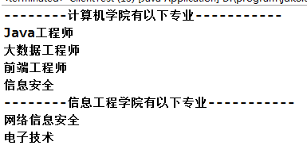
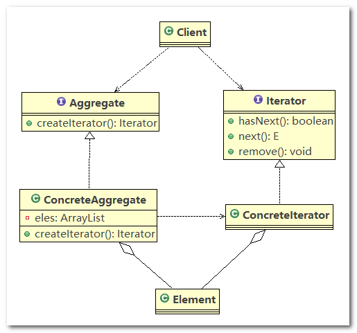
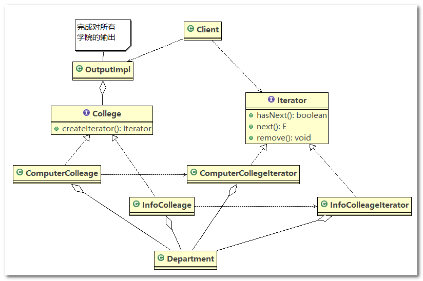
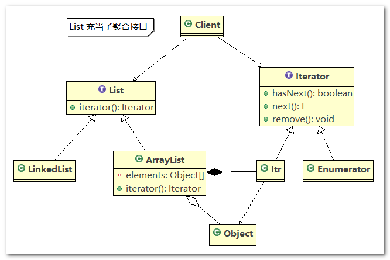

# 迭代器模式

## 1、学校院系展示需求

编写程序展示一个学校院系结构：需求是这样，要在一个页面中展示出学校的院系组成，一个学校有多个学院，一个学院有多个系。 如图：



## 2、传统方案解决学校院系展示需求

> **传统的方式的问题分析**

1. 将学院看做是学校的子类，系是学院的子类，这样实际上是站在组织大小来进行分层次的
2. 实际上我们的要求是 ： 在一个页面中展示出学校的院系组成，一个学校有多个学院，一个学院有多个系， 因此这种方案，不能很好实现的遍历的操作
3. 假如计算机学院的院系存储在数组中，信息工程学院的院系存储在集合中，我们要怎么才能定义一个统一的规范，来遍历不同存储结构下的院系。解决方案： => 迭代器模式


## 3、迭代器模式基本介绍

1. 迭代器模式(`Iterator Pattern`) 是常用的设计模式，属于行为型模式
2. 如果我们的集合元素是用不同的方式实现的， 有数组，还有`java`的集合类，或者还有其他方式，当客户端要遍历这些集合元素的时候就要使用多种遍历方式，而且还会暴露元素的内部结构，可以考虑使用迭代器模式解决。
3. 迭代器模式，提供一种遍历集合元素的统一接口，用一致的方法遍历集合元素，对于使用者来说，不需要知道集合对象的底层表示，即： 不暴露集合的内部结构

## 4、迭代器模式的原理类图

1. `Iterator` ：迭代器接口，由 `JDK` 提供，该接口定义了三个用于遍历集合(数组)的方法：`hasNext()`、`next()`、`remove()`
2. `ConcreteIterator`：具体的迭代器类，实现具体的迭代逻辑
3. `Aggregate`：一个统一的聚合接口，将客户端和具体的 `Aggregate` 实现类解耦
4. `ConcreteAggreage` ：具体的聚合实现类，该类持有对象集合(`Element`)，并提供一个方法，返回一个迭代器， 该迭代器可以正确遍历集合
5. `Client`：客户端，通过 `Iterator` 和 `Aggregate` 依赖其对应的子类



## 5、迭代器模式解决学校院系展示需求

应用实例要求

编写程序展示一个学校院系结构： 需求是这样， 要在一个页面中展示出学校的院系组成， 一个学校有多个学院，一个学院有多个系

------

类图



------

代码实现

1. `Department`：实体类，用于表示学院的系

   ```java
   //系
   public class Department {
   
   	private String name;
   	private String desc;
   
   	public Department(String name, String desc) {
   		this.name = name;
   		this.desc = desc;
   	}
   
   	public String getName() {
   		return name;
   	}
   
   	public void setName(String name) {
   		this.name = name;
   	}
   
   	public String getDesc() {
   		return desc;
   	}
   
   	public void setDesc(String desc) {
   		this.desc = desc;
   	}
   
   }
   ```

2. `ComputerCollegeIterator`：计算机院系的迭代器，该类实现了 `Iterator` 接口，用于迭代计算机学院的系

   ```java
   public class ComputerCollegeIterator implements Iterator {
   
   	// 这里我们需要Department 是以怎样的方式存放=>数组
   	Department[] departments;
   	int position = 0; // 遍历的位置
   
   	public ComputerCollegeIterator(Department[] departments) {
   		this.departments = departments;
   	}
   
   	// 判断是否还有下一个元素
   	@Override
   	public boolean hasNext() {
   		if (position >= departments.length || departments[position] == null) {
   			return false;
   		} else {
   			return true;
   		}
   	}
   
   	@Override
   	public Object next() {
   		Department department = departments[position];
   		position += 1;
   		return department;
   	}
   
   	// 删除的方法，默认空实现
   	@Override
   	public void remove() {
   
   	}
   
   }
   ```

3. `InfoColleageIterator`：信息院系的迭代器，该类实现了 `Iterator` 接口，用于迭代信息学院的系

   ```java
   public class InfoColleageIterator implements Iterator {
   
   	List<Department> departmentList; // 信息工程学院是以List方式存放系
   	int index = -1;// 索引
   
   	public InfoColleageIterator(List<Department> departmentList) {
   		this.departmentList = departmentList;
   	}
   
   	// 判断list中还有没有下一个元素
   	@Override
   	public boolean hasNext() {
   		if (index >= departmentList.size() - 1) {
   			return false;
   		} else {
   			index += 1;
   			return true;
   		}
   	}
   
   	@Override
   	public Object next() {
   		return departmentList.get(index);
   	}
   
   	// 空实现remove
   	@Override
   	public void remove() {
   
   	}
   
   }
   ```

4. `College`：学院的聚合接口

   ```java
   public interface College {
   
   	public String getName();
   
   	// 增加系的方法
   	public void addDepartment(String name, String desc);
   
   	// 返回一个迭代器,遍历
   	public Iterator createIterator();
   	
   }
   ```

5. `ComputerCollege`：计算机学院的聚合接口实现类，该类聚合了 `Department[]` 数组，并提供访问 `Department[]` 数组的迭代器

   ```java
   public class ComputerCollege implements College {
   
   	Department[] departments;
   	int numOfDepartment = 0;// 保存当前数组的对象个数
   
   	public ComputerCollege() {
   		departments = new Department[5];
   		addDepartment("Java专业", " Java专业 ");
   		addDepartment("PHP专业", " PHP专业 ");
   		addDepartment("大数据专业", " 大数据专业 ");
   		numOfDepartment = 3;
   	}
   
   	@Override
   	public String getName() {
   		return "计算机学院";
   	}
   
   	@Override
   	public void addDepartment(String name, String desc) {
   		Department department = new Department(name, desc);
   		departments[numOfDepartment] = department;
   		numOfDepartment += 1;
   	}
   
   	@Override
   	public Iterator createIterator() {
   		return new ComputerCollegeIterator(departments);
   	}
   
   }
   ```

6. `InfoCollege`：信息学院的聚合接口实现类，该类聚合了 `List<Department>` 集合，并提供访问 `List<Department>` 集合的迭代器

   ```java
   public class InfoCollege implements College {
   
   	List<Department> departmentList;
   
   	public InfoCollege() {
   		departmentList = new ArrayList<Department>();
   		addDepartment("信息安全专业", " 信息安全专业 ");
   		addDepartment("网络安全专业", " 网络安全专业 ");
   		addDepartment("服务器安全专业", " 服务器安全专业 ");
   	}
   
   	@Override
   	public String getName() {
   		return "信息工程学院";
   	}
   
   	@Override
   	public void addDepartment(String name, String desc) {
   		Department department = new Department(name, desc);
   		departmentList.add(department);
   	}
   
   	@Override
   	public Iterator createIterator() {
   		return new InfoColleageIterator(departmentList);
   	}
   
   }
   ```

7. `OutPutImpl`：为 `Client` 层提供遍历输出学院系的方法

   ```java
   public class OutPutImpl {
   
   	// 学院集合
   	List<College> collegeList;
   
   	public OutPutImpl(List<College> collegeList) {
   		this.collegeList = collegeList;
   	}
   
   	// 遍历所有学院,然后调用printDepartment 输出各个学院的系
   	public void printCollege() {
   		// 从collegeList 取出所有学院, Java 中的 List 已经实现Iterator
   		Iterator<College> iterator = collegeList.iterator();
   
   		while (iterator.hasNext()) {
   			// 取出一个学院
   			College college = iterator.next();
   			System.out.println("=== " + college.getName() + "=====");
   			printDepartment(college.createIterator()); // 得到对应迭代器
   		}
   	}
   
   	// 输出学院的系
   	public void printDepartment(Iterator iterator) {
   		while (iterator.hasNext()) {
   			Department d = (Department) iterator.next();
   			System.out.println(d.getName());
   		}
   	}
   
   }
   ```

8. `Client`：测试代码

   ```java
   public class Client {
   
   	public static void main(String[] args) {
   		// 创建学院
   		List<College> collegeList = new ArrayList<College>();
   
   		ComputerCollege computerCollege = new ComputerCollege();
   		InfoCollege infoCollege = new InfoCollege();
   
   		collegeList.add(computerCollege);
   		collegeList.add(infoCollege);
   
   		OutPutImpl outPutImpl = new OutPutImpl(collegeList);
   		outPutImpl.printCollege();
   	}
   
   }
   ```

------

总结

院系数据真实存放在 `ComputerCollege` 和 `InfoCollege` 中，如果想要遍历院系，需要将院系作为参数传入 `ComputerCollegeIterator` 和 `InfoColleageIterator` 中，获得迭代器，进行迭代

## 6、JDK ArrayList 源码分析

> **原理类图分析**

1. `ArrayList` 的内部类 `Itr` 充当了具体实现迭代器 `Iterator` 的类
2. `List` 就是充当了聚合接口， 含有一个 `iterator()` 方法， 该方法返回一个迭代器对象
3. `ArrayList` 是实现聚合接口 `List` 的子类， 实现了 `iterator()` 方法
4. `Iterator` 接口系统(`JDK`)提供
5. 迭代器模式解决了不同集合(`ArrayList`，`LinkedList`) 统一遍历问题



> **源码追踪**

1. `Iterator` 接口中定义的方法

   ```java
   public interface Iterator<E> {
       
       boolean hasNext();
   
       E next();
   
       default void remove() {
           throw new UnsupportedOperationException("remove");
       }
   
       default void forEachRemaining(Consumer<? super E> action) {
           Objects.requireNonNull(action);
           while (hasNext())
               action.accept(next());
       }
       
   }
   ```

2. 在 `List` 接口中定义了获取 `iterator` 的抽象方法，即 `List` 充当了聚合接口

   ```java
   public interface List<E> extends Collection<E> {
       
       // ...
       
       Iterator<E> iterator();
       
       // ...
   ```

3. 在 `ArrayList` 中实现了 `iterator` 方法

   ```java
   public class ArrayList<E> extends AbstractList<E>
           implements List<E>, RandomAccess, Cloneable, java.io.Serializable
       
       // ...
       
       public Iterator<E> iterator() {
           return new Itr();
       }    
      
       // ...
   12345678910
   ```

4. `Itr` 实现了 `Iterator` 接口，为 `ArrayList` 的内部类，在 `Itr` 中，直接使用 `ArrayList` 中用于存放数据的 `Object[]` 数组，通过 `size` 属性标识集合元素个数

   ```java
   private class Itr implements Iterator<E> {
       int cursor;       // index of next element to return
       int lastRet = -1; // index of last element returned; -1 if no such
       int expectedModCount = modCount;
   
       public boolean hasNext() {
           return cursor != size;
       }
   
       @SuppressWarnings("unchecked")
       public E next() {
           checkForComodification();
           int i = cursor;
           if (i >= size)
               throw new NoSuchElementException();
           Object[] elementData = ArrayList.this.elementData;
           if (i >= elementData.length)
               throw new ConcurrentModificationException();
           cursor = i + 1;
           return (E) elementData[lastRet = i];
       }
   
       public void remove() {
           if (lastRet < 0)
               throw new IllegalStateException();
           checkForComodification();
   
           try {
               ArrayList.this.remove(lastRet);
               cursor = lastRet;
               lastRet = -1;
               expectedModCount = modCount;
           } catch (IndexOutOfBoundsException ex) {
               throw new ConcurrentModificationException();
           }
       }
   
       @Override
       @SuppressWarnings("unchecked")
       public void forEachRemaining(Consumer<? super E> consumer) {
           Objects.requireNonNull(consumer);
           final int size = ArrayList.this.size;
           int i = cursor;
           if (i >= size) {
               return;
           }
           final Object[] elementData = ArrayList.this.elementData;
           if (i >= elementData.length) {
               throw new ConcurrentModificationException();
           }
           while (i != size && modCount == expectedModCount) {
               consumer.accept((E) elementData[i++]);
           }
           // update once at end of iteration to reduce heap write traffic
           cursor = i;
           lastRet = i - 1;
           checkForComodification();
       }
   
       final void checkForComodification() {
           if (modCount != expectedModCount)
               throw new ConcurrentModificationException();
       }
   }
   ```

## 7、迭代器模式的注意事项

> **迭代器模式的注意事项和细节**

优点

1. 提供一个统一的方法遍历对象，客户不用再考虑聚合的类型，使用一种方法就可以遍历对象了。
2. 隐藏了聚合的内部结构，客户端要遍历聚合的时候只能取到迭代器，而不会知道聚合的具体组成。
3. 提供了一种设计思想，就是一个类应该只有一个引起变化的原因（叫做单一责任原则）。在聚合类中，我们把迭代器分开，就是要把管理对象集合和遍历对象集合的责任分开，这样一来集合改变的话，只影响到聚合对象。而如果遍历方式改变的话，只影响到了迭代器。
4. 当要展示一组相似对象，或者遍历一组相同对象时使用，适合使用迭代器模式

------

缺点

每个聚合对象都要一个迭代器，会生成多个迭代器不好管理类(这其实也不算什么缺点啦~~~)