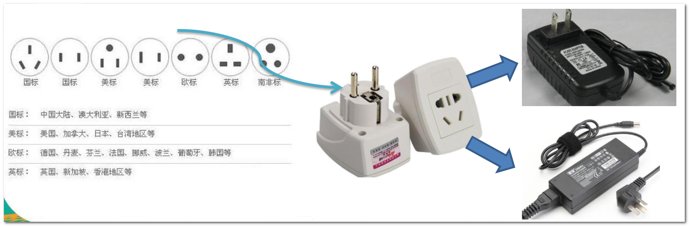
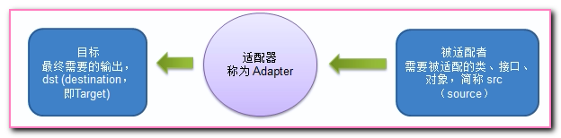
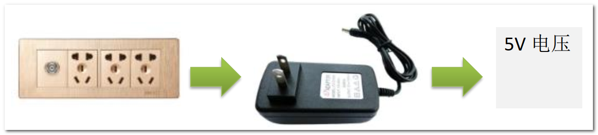
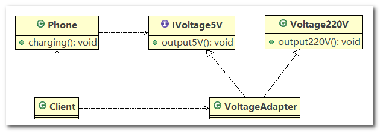
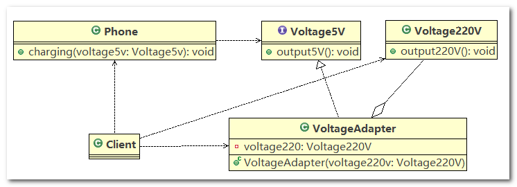
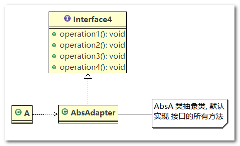
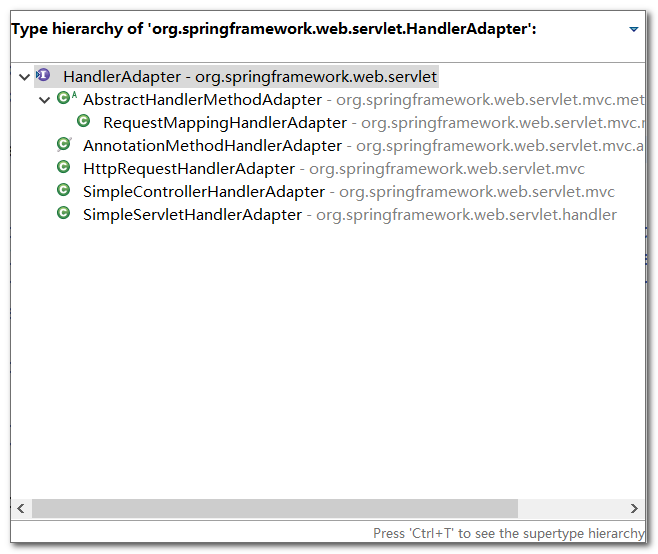
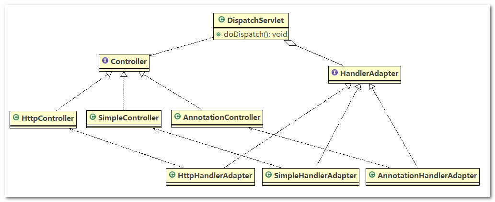

# 第 9 章 适配器设计模式

## 1、适配器模式基本介绍

> **现实生活中的适配器例子**

泰国旅游使用插座问题：泰国插座用的是两孔的（欧标） ，可以买个多功能转换插头 (适配器) ，这样就可以使用了



> **适配器模式基本介绍**

1. 适配器模式(`Adapter Pattern`)将某个类的接口转换成客户端期望的另一个接口表示，主的目的是兼容性，让原本因接口不匹配不能一起工作的两个类可以协同工作。
2. 适配器的别名为包装器(`Wrapper`)，适配器模式属于结构型模式
3. 主要分为三类：类适配器模式、对象适配器模式、接口适配器模式

## 2、适配器模式工作原理

1. 适配器模式：将一个类的接口转换成另一种接口，让原本接口不兼容的类可以兼容
2. 从用户的角度看不到被适配者，用户与被适配者是解耦的
3. 用户调用适配器转化出来的目标接口方法， 适配器再调用被适配者的相关接口方法
4. 用户收到反馈结果，感觉只是和目标接口交互， 如图



## 3、类适配器模式

> **类适配器模式介绍**

基本介绍： 核心模块是 `Adapter` 类，`Adapter` 类，通过继承 `src` 类（被适配者），实现 `dst` 类接口（目标类），完成 `src --> dst` 的适配

> **类适配器模式应用实例**

应用实例说明

以生活中充电器的例子来讲解适配器，充电器本身相当于`Adapter`， `220V`交流电相当于`src` (即被适配者)， 我们的`dst`(即目标)是`5V`直流电



------

类图



------

代码实现

1. `Voltage220V`：`src`类，输出 `220V` 的电压

   ```java
   //被适配的类
   public class Voltage220V {
   	// 输出220V的电压
   	public int output220V() {
   		int src = 220;
   		return src;
   	}
   }
   ```

2. `IVoltage5V`：适配器接口（`dst` 接口），规定适配器的规范

   ```java
   //适配接口
   public interface IVoltage5V {
   	public int output5V();
   }
   ```

3. `VoltageAdapter`：适配器，继承了 `Voltage220V` 并实现了 `IVoltage5V` 接口

   ```java
   //适配器类
   public class VoltageAdapter extends Voltage220V implements IVoltage5V {
   	@Override
   	public int output5V() {
   		int srcV = output220V(); // 获取到220V电压
   		int dstV = srcV / 44; // 降压转成 5v
   		return dstV;
   	}
   }
   ```

4. `Phone`：使用 `5V` 适配器进行充电

   ```java
   public class Phone {
   	// 充电
   	public void charging(IVoltage5V iVoltage5V) {
   		if (iVoltage5V.output5V() == 5) {
   			System.out.println("电压为5V, 可以充电~~");
   		} else if (iVoltage5V.output5V() > 5) {
   			System.out.println("电压大于5V, 不能充电~~");
   		}
   	}
   }
   ```

5. `Client`：客户端，进行代码测试

   ```java
   public class Client {
   
   	public static void main(String[] args) {
   		System.out.println(" === 类适配器模式 ====");
   		Phone phone = new Phone();
   		phone.charging(new VoltageAdapter());
   	}
   
   }
   ```

------

总结

`Voltage220V` 只能输出 `220V` 的电压，我们定义一个抽象的适配器规范：`IVoltage5V` 接口，该接口里面有一个抽象方法 `public int output5V();`，适配器 `VoltageAdapter` 继承 `Voltage220V` 并实现 `IVoltage5V` 接口，可以将 `220V` 的电压转为 `5V` 电压

> **类适配器模式注意事项和细节**

缺点

`Java`是单继承机制，所以类适配器需要继承`src`类这一点算是一个缺点，因为`Adapter`已经继承了`src`类，这要求`dst`必须是接口，有一定局限性

`src`类的方法在`Adapter`中都会暴露出来，也增加了使用的成本，因为`src`类中的方法可能很多

------

优点：

由于其继承了`src`类，所以它可以根据需求重写`src`类的方法，使得`Adapter`的灵活性增强了

## 4、对象适配器模式

> **对象适配器模式介绍**

1. 基本思路和类的适配器模式相同，只是将`Adapter`类作修改，不是继承`src`类，而是持有`src`类的实例，以解决兼容性的问题。
2. 对象适配器模式的核心思想：适配器持有`src`类，实现`dst`类接口，完成`src --> dst`的适配
3. 根据“合成复用原则”，在系统中尽量使用关联关系（聚合、组合）来替代继承关系。
4. 对象适配器模式是适配器模式常用的一种

> **对象适配器模式应用实例**

应用实例说明

以生活中充电器的例子来讲解适配器，充电器本身相当于`Adapter`， `220V`交流电相当于`src` (即被适配者)， 我们的`dst`(即目标)是`5V`直流电， 使用对象适配器模式完成

------

类图



------

代码实现

1. `Voltage220V`：`src`类，输出 `220V` 的电压，与类适配器中的代码一样

2. `IVoltage5V`：适配器接口（`dst` 接口），规定适配器的规范，与类适配器中的代码一样

3. `VoltageAdapter`：适配器，`VoltageAdapter` 中聚合了一个 `Voltage220V` 类的对象，并实现了 `IVoltage5V` 接口

   ```java
   //适配器类
   public class VoltageAdapter implements IVoltage5V {
   
   	private Voltage220V voltage220V; // 关联关系-聚合
   
   	// 通过构造器，传入一个 Voltage220V 实例
   	public VoltageAdapter(Voltage220V voltage220v) {
   		this.voltage220V = voltage220v;
   	}
   
   	@Override
   	public int output5V() {
   		int dst = 0;
   		if (null != voltage220V) {
   			int src = voltage220V.output220V();// 获取220V 电压
   			System.out.println("使用对象适配器，进行适配~~");
   			dst = src / 44;
   			System.out.println("适配完成，输出的电压为=" + dst);
   		}
   		return dst;
   	}
   
   }
   ```

4. `Phone`：使用 `5V` 适配器进行充电，与类适配器中的代码一样

5. `Client`：客户端，进行代码测试，创建适配器 `VoltageAdapter` 时，注入 `src` 类实例：`new Voltage220V()`

   ```java
   public class Client {
   
   	public static void main(String[] args) {
   		System.out.println(" === 对象适配器模式 ====");
   		Phone phone = new Phone();
   		phone.charging(new VoltageAdapter(new Voltage220V()));
   	}
   
   }
   ```

------

总结

与类适配器模式相比，对象适配器模式中，适配器 `Adapter` 没有使用继承关系，而是使用聚合关系，在适配器 `Adapter` 中聚合了一个 `src` 类实例，相同的是 `Adapter` 实现适配器接口（`dst`接口），在 `Adapter` 中实现 `dst` 接口中的抽象方法，然后使用 `src` 类实例和完成适配（转换）

> **对象适配器模式注意事项和细节**

对象适配器和类适配器其实算是同一种思想，只不过实现方式不同。根据合成复用原则， 使用组合替代继承， 所以它解决了类适配器必须继承`src`的局限性问题，也不再要求`dst`必须是接口。对象适配器的使用成本更低，更灵活

## 5、接口适配器模式

> **接口适配器模式介绍**

1. 一些书籍称为：适配器模式(`Default Adapter Pattern`)或缺省适配器模式
2. 核心思想：当不需要全部实现接口提供的方法时，可先设计一个抽象类实现接口，并为该接口中每个方法提供一个默认实现（空方法），那么该抽象类的子类可有选择地覆盖父类的某些方法来实现需求
3. 适用于一个接口的实现类不想使用其所有的方法的情况

> **接口适配器模式应用实例**

类图



代码示例

1. `Interface4`：接口

   ```java
   public interface Interface4 {
   	public void m1();
   
   	public void m2();
   
   	public void m3();
   
   	public void m4();
   }
   ```

2. `AbsAdapter`：适配器，对接口中的抽象方法进行空实现

   ```java
   //在AbsAdapter 我们将 Interface4 的方法进行默认实现
   public abstract class AbsAdapter implements Interface4 {
   	// 默认实现
   	public void m1() {
   
   	}
   
   	public void m2() {
   
   	}
   
   	public void m3() {
   
   	}
   
   	public void m4() {
   
   	}
   }
   ```

3. `Client`：客户端

   ```java
   public class Client {
   	public static void main(String[] args) {
   
   		AbsAdapter absAdapter = new AbsAdapter() {
   			// 只需要去覆盖我们 需要使用 接口方法
   			@Override
   			public void m1() {
   				System.out.println("使用了m1的方法");
   			}
   		};
   
   		absAdapter.m1();
   	}
   }
   ```

------

`Android` 代码示例

1. `AnimatorListener`是一个接口，它里面定义了一些抽象方法

   ```java
   public static interface AnimatorListener {
       void onAnimationStart(Animator animation);
       void onAnimationEnd(Animator animation);
       void onAnimationCancel(Animator animation);
       void onAnimationRepeat(Animator animation);
   }
   ```

2. `AnimatorListenerAdapter`类就是一个接口适配器，它空实现了`Animator.AnimatorListener`类(`src`)的所有方法

   ```java
   public abstract class AnimatorListenerAdapter implements Animator.AnimatorListener, Animator.AnimatorPauseListener {
       @Override //默认实现
       public void onAnimationCancel(Animator animation) {
       }
       
       @Override
       public void onAnimationEnd(Animator animation) {
       }
       
       @Override
       public void onAnimationRepeat(Animator animation) {
       }
       
       @Override
       public void onAnimationStart(Animator animation) {
       }
       
       @Override
       public void onAnimationPause(Animator animation) {
       }
       
       @Override
       public void onAnimationResume(Animator animation) {
       }
   }
   ```

3. 我们在程序里的匿名内部类就是`Listener`具体实现类，我们可以选择性地实现想要重写的方法

   ```java
   new AnimatorListenerAdapter() {
       @Override
       public void onAnimationStart(Animator animation) {
       	//xxxx具体实现
       }
   }
   ```

## 6、SpringMVC 源码

> **适配器模式在SpringMVC框架应用的源码剖析**

`SpringMVC`中的`HandlerAdapter`，就使用了适配器模式，`SpringMVC`处理请求的流程回顾：

1. 首先用户请求到达前端控制器 `dispatcherServlet` 的 `doDispatch()` 方法
2. 在 `doDispatch()` 中，通过 `HandlerMapping` 找到用户请求的 `Handler`（处理器）
3. 通过 `Handler` 执行目标方法，获得本次访问结果：`ModelAndView` 对象
4. 接着调用 `InternalResourceViewResolve` 对返回的 `ModelAndView` 对象进行解析，找到指定的资源
5. 目标资源（`JSP` 页面或者 `JSON` 字符串）最终都会以 `JSON` 字符串的形式返回给 `Tomcat`
6. `Tomcat` 将字符串 以 `HTTP` 协议的方式返回给浏览器

------

使用 `HandlerAdapter` 的原因分析:

可以看到处理器的类型不同，有多种实现方式，那么调用方式就不是确定的，如果需要直接调用
`Controller`方法，需要调用的时候就得不断是使用`if else`来进行判断是哪一种子类然后执行。那么如果后面要扩展`Controller`，就得修改原来的代码，这样违背了`OCP` 原则

> **源码追踪**

1. `doDispatch()` 方法

   ```java
   /**
    * Process the actual dispatching to the handler.
    * <p>The handler will be obtained by applying the servlet's HandlerMappings in order.
    * The HandlerAdapter will be obtained by querying the servlet's installed HandlerAdapters
    * to find the first that supports the handler class.
    * <p>All HTTP methods are handled by this method. It's up to HandlerAdapters or handlers
    * themselves to decide which methods are acceptable.
    * @param request current HTTP request
    * @param response current HTTP response
    * @throws Exception in case of any kind of processing failure
    */
   protected void doDispatch(HttpServletRequest request, HttpServletResponse response) throws Exception {
   	HttpServletRequest processedRequest = request;
   	HandlerExecutionChain mappedHandler = null;
   	boolean multipartRequestParsed = false;
   
   	WebAsyncManager asyncManager = WebAsyncUtils.getAsyncManager(request);
   
   	try {
   		ModelAndView mv = null;
   		Exception dispatchException = null;
   
   		try {
   			processedRequest = checkMultipart(request);
   			multipartRequestParsed = processedRequest != request;
   
   			// Determine handler for the current request.
   			mappedHandler = getHandler(processedRequest);
   			if (mappedHandler == null || mappedHandler.getHandler() == null) {
   				noHandlerFound(processedRequest, response);
   				return;
   			}
   
   			// Determine handler adapter for the current request.
   			HandlerAdapter ha = getHandlerAdapter(mappedHandler.getHandler());
   
   			// Process last-modified header, if supported by the handler.
   			String method = request.getMethod();
   			boolean isGet = "GET".equals(method);
   			if (isGet || "HEAD".equals(method)) {
   				long lastModified = ha.getLastModified(request, mappedHandler.getHandler());
   				if (logger.isDebugEnabled()) {
   					String requestUri = urlPathHelper.getRequestUri(request);
   					logger.debug("Last-Modified value for [" + requestUri + "] is: " + lastModified);
   				}
   				if (new ServletWebRequest(request, response).checkNotModified(lastModified) && isGet) {
   					return;
   				}
   			}
   
   			if (!mappedHandler.applyPreHandle(processedRequest, response)) {
   				return;
   			}
   
   			try {
   				// Actually invoke the handler.
   				mv = ha.handle(processedRequest, response, mappedHandler.getHandler());
   			}
   			finally {
   				if (asyncManager.isConcurrentHandlingStarted()) {
   					return;
   				}
   			}
   
   			applyDefaultViewName(request, mv);
   			mappedHandler.applyPostHandle(processedRequest, response, mv);
   		}
   		catch (Exception ex) {
   			dispatchException = ex;
   		}
   		processDispatchResult(processedRequest, response, mappedHandler, mv, dispatchException);
   	}
   	catch (Exception ex) {
   		triggerAfterCompletion(processedRequest, response, mappedHandler, ex);
   	}
   	catch (Error err) {
   		triggerAfterCompletionWithError(processedRequest, response, mappedHandler, err);
   	}
   	finally {
   		if (asyncManager.isConcurrentHandlingStarted()) {
   			// Instead of postHandle and afterCompletion
   			mappedHandler.applyAfterConcurrentHandlingStarted(processedRequest, response);
   			return;
   		}
   		// Clean up any resources used by a multipart request.
   		if (multipartRequestParsed) {
   			cleanupMultipart(processedRequest);
   		}
   	}
   }
   ```

2. `getHandlerAdapter()` 方法

   ```java
   /**
    * Return the HandlerAdapter for this handler object.
    * @param handler the handler object to find an adapter for
    * @throws ServletException if no HandlerAdapter can be found for the handler. This is a fatal error.
    */
   protected HandlerAdapter getHandlerAdapter(Object handler) throws ServletException {
   	for (HandlerAdapter ha : this.handlerAdapters) {
   		if (logger.isTraceEnabled()) {
   			logger.trace("Testing handler adapter [" + ha + "]");
   		}
   		if (ha.supports(handler)) {
   			return ha;
   		}
   	}
   	throw new ServletException("No adapter for handler [" + handler +
   			"]: The DispatcherServlet configuration needs to include a HandlerAdapter that supports this handler");
   }
   ```

3. `HandlerAdapter` 只是一个接口，定义了适配器的规范

   ```java
   public interface HandlerAdapter {
   
   	/**
   	 * Given a handler instance, return whether or not this {@code HandlerAdapter}
   	 * can support it. Typical HandlerAdapters will base the decision on the handler
   	 * type. HandlerAdapters will usually only support one handler type each.
   	 * <p>A typical implementation:
   	 * <p>{@code
   	 * return (handler instanceof MyHandler);
   	 * }
   	 * @param handler handler object to check
   	 * @return whether or not this object can use the given handler
   	 */
   	boolean supports(Object handler);
   
   	/**
   	 * Use the given handler to handle this request.
   	 * The workflow that is required may vary widely.
   	 * @param request current HTTP request
   	 * @param response current HTTP response
   	 * @param handler handler to use. This object must have previously been passed
   	 * to the {@code supports} method of this interface, which must have
   	 * returned {@code true}.
   	 * @throws Exception in case of errors
   	 * @return ModelAndView object with the name of the view and the required
   	 * model data, or {@code null} if the request has been handled directly
   	 */
   	ModelAndView handle(HttpServletRequest request, HttpServletResponse response, Object handler) throws Exception;
   
   	/**
   	 * Same contract as for HttpServlet's {@code getLastModified} method.
   	 * Can simply return -1 if there's no support in the handler class.
   	 * @param request current HTTP request
   	 * @param handler handler to use
   	 * @return the lastModified value for the given handler
   	 * @see javax.servlet.http.HttpServlet#getLastModified
   	 * @see org.springframework.web.servlet.mvc.LastModified#getLastModified
   	 */
   	long getLastModified(HttpServletRequest request, Object handler);
   
   }
   ```

4. `HandlerAdapter` 继承树

   

------

源码分析与总结

1. 首先，我们拿到此次请求的 `Request` 对象：`HttpServletRequest processedRequest = request;`
2. 接着，通过 `Request` 对象拿到 `Handler(Controller)` 对象：`mappedHandler = getHandler(processedRequest);`
3. 然后通过 `Handler` 拿到对应的适配器( `Adapter`)：`HandlerAdapter ha = getHandlerAdapter(mappedHandler.getHandler());`
4. 最后通过适配器调用 `Controller` 的方法并返回 `ModelAndView`：`mv = ha.handle(processedRequest, response, mappedHandler.getHandler());`

> **动手写 SpringMVC 通过适配器设计模式**

说明：

`Spring` 定义了一个适配接口，使得每一种 `Controller`有一种对应的适配器实现类，适配器代替 `Controller` 执行相应的方法，扩展 `Controller` 时，只需要增加一个适配器类就完成了 `SpringMVC` 的扩展了，这就是设计模式的力量

------

类图



------

代码实现

1. `Controller` 接口及其实现类

   ```java
   //多种Controller实现  
   public interface Controller {
   
   }
   
   class HttpController implements Controller {
   	public void doHttpHandler() {
   		System.out.println("http...");
   	}
   }
   
   class SimpleController implements Controller {
   	public void doSimplerHandler() {
   		System.out.println("simple...");
   	}
   }
   
   class AnnotationController implements Controller {
   	public void doAnnotationHandler() {
   		System.out.println("annotation...");
   	}
   }
   ```

2. `HandlerAdapter` 接口及其实现类

   ```java
   //定义一个Adapter接口 
   public interface HandlerAdapter {
   	// 当前 HandlerAdapter 对象是否支持 handler（判断 handler 的类型是否为具体的子类类型）
   	public boolean supports(Object handler);
   
   	// 执行目标方法（将 handler 对象强转后，调用对应的方法）
   	public void handle(Object handler);
   }
   
   // 多种适配器类
   class SimpleHandlerAdapter implements HandlerAdapter {
   
   	public void handle(Object handler) {
   		((SimpleController) handler).doSimplerHandler();
   	}
   
   	public boolean supports(Object handler) {
   		return (handler instanceof SimpleController);
   	}
   
   }
   
   class HttpHandlerAdapter implements HandlerAdapter {
   
   	public void handle(Object handler) {
   		((HttpController) handler).doHttpHandler();
   	}
   
   	public boolean supports(Object handler) {
   		return (handler instanceof HttpController);
   	}
   
   }
   
   class AnnotationHandlerAdapter implements HandlerAdapter {
   
   	public void handle(Object handler) {
   		((AnnotationController) handler).doAnnotationHandler();
   	}
   
   	public boolean supports(Object handler) {
   		return (handler instanceof AnnotationController);
   	}
   
   }
   ```

3. `DispatchServlet`：模拟 `doDispatch()` 方法中获取适配器的流程

   ```java
   public class DispatchServlet {
   
   	public static List<HandlerAdapter> handlerAdapters = new ArrayList<HandlerAdapter>();
   
   	// 组合了多个 HandlerAdapter 的实现类
   	public DispatchServlet() {
   		handlerAdapters.add(new AnnotationHandlerAdapter());
   		handlerAdapters.add(new HttpHandlerAdapter());
   		handlerAdapters.add(new SimpleHandlerAdapter());
   	}
   
   	public void doDispatch() {
   
   		// 此处模拟SpringMVC从request取handler的对象，
   		// 适配器可以获取到希望的Controller
   		HttpController controller = new HttpController();
   		// AnnotationController controller = new AnnotationController();
   		// SimpleController controller = new SimpleController();
   		
   		// 得到对应适配器
   		HandlerAdapter adapter = getHandler(controller);
   		// 通过适配器执行对应的controller对应方法
   		adapter.handle(controller);
   
   	}
   
   	public HandlerAdapter getHandler(Controller controller) {
   		// 遍历：根据得到的controller(handler), 返回对应适配器
   		for (HandlerAdapter adapter : this.handlerAdapters) {
   			if (adapter.supports(controller)) {
   				return adapter;
   			}
   		}
   		return null;
   	}
   
   	public static void main(String[] args) {
   		new DispatchServlet().doDispatch(); // http...
   	}
   
   }
   ```

------

总结

1. `HandlerAdapter`的作用：
   1. `public boolean supports(Object handler);`：当前适配器是否支持 `handler`，从上面源码可以看出，使用 `instanceof` 关键字进行判断
   2. `public void handle(Object handler);`：执行 `Handler(Controller)` 的目标方法，即 `HandlerAdapter` 代替原有的 `Handler(Controller)` 执行目标方法
2. 通过 `HandlerAdapter` 可以使得 `DispatchServlet` 和具体的 `Controller` 解耦，扩展 `Controller` 时，我们只需要增加一个适配器类就完成了 `SpringMVC` 的扩展
3. 对于同一类的请求方式，我们封装一个 `HandlerAdapter` 实现类，通过该 `HandlerAdapter` 实现类完成一类相同的请求

## 7、适配器模式的注意事项

> **适配器模式的注意事项和细节**

三种命名方式，是根据`src`是以怎样的形式给到`Adapter`（在`Adapter`里的形式）来命名的。

1. 类适配器：以类给到，在`Adapter`里，就是将`src`当做类，继承
2. 对象适配器：以对象给到，在`Adapter`里，将`src`作为一个对象，持有
3. 接口适配器：以接口给到，在`Adapter`里，将`src`作为一个接口，实现

------

`Adapter`模式最大的作用还是将原本不兼容的接口融合在一起工作，相当于是个中转封装站

实际开发中，实现起来不拘泥于我们讲解的三种经典形式